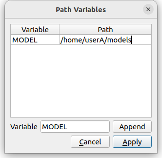

Environment Settings
==================

.. contents::
   :local:
   :depth: 1

Overview
--------

In Choreonoid, the following configuration items are saved as per-user settings in the environment configuration file, and the previous settings are inherited when Choreonoid starts.

* Whether the window is maximized
* Window size
* Current directory in file load and save dialogs
* Whether to enable layout save/load for project files (see :ref:`basics_layout_save`)

On the other hand, the states of items, toolbars, and views are not saved as environment settings, so if you want to inherit the current state, you need to save it to a project file and load it the next time you use it.

Environment Configuration File
------------------------------

One environment configuration file is created for each OS user account. On Unix-based operating systems, the file location is ".config/Choreonoid/Choreonoid.conf" in the home directory. Therefore, you can clear or copy environment settings by deleting or copying this file. Additionally, since the configuration content is written to this file as text in YAML format, if any problems occur with the environment settings, it is possible to directly edit this file to attempt problem resolution.

.. _basics_project_pathset:

Project Path Variables
----------------------

"Project path variables," which are one of the environment configuration items, is a mechanism that makes the loading of related files portable when loading projects. By utilizing this feature, it becomes possible to load projects composed of various files stored in different directories in environments different from where the project file was saved.

Generally, projects are composed of files other than the project file. For example, in :ref:`basics_project_sr1walk`, two models (robot and floor) are loaded as body item type items, which are loaded from model files called "SR1.body" and "floor.wrl" respectively. In the project file, only the paths to those model files are recorded, and the model files themselves need to be in a loadable state when loading the project.

However, the directory where model files are stored may differ depending on the environment. For example, user A might store model files under /home/userA/models, while user B might store them under /home/userB/robots. In this case, if a project file saved in user A's environment references /home/userA/models, the models cannot be loaded in user B's environment because model files are not stored in such a directory.

Therefore, Choreonoid records references to external files in project files according to the following rules:

1. If an external file is in the same directory as the project file or in a subdirectory, record it as a relative path from the directory containing the project file
2. If rule 1 does not apply, and the path to the external file contains a directory registered as a "path variable," replace the corresponding part of that directory with the variable name
3. If rule 2 also does not apply, the external file is recorded as an absolute path from the root directory

First, with rule 1, when all files composing a project are gathered in the same directory as the project file, they can be loaded without problems in different environments by simply copying that directory.

However, model files are often shared among various projects and may also be used independently of Choreonoid projects, so it is common to store model files in directories different from the project file. In such cases, the "path set" mechanism of rule 2 can be utilized.

Path set is a function that registers directories with labels, and you can register as many as needed. In the case of user A and user B mentioned above, for example, they would register as follows:

.. tabularcolumns:: |p{2.0cm}|p{2.0cm}|p{4.0cm}|

.. list-table::
 :widths: 24,25,50
 :header-rows: 1

 * - User
   - Variable Name
   - Directory
 * - User A
   - MODEL
   - /home/userA/models
 * - User B
   - MODEL
   - /home/userB/robots

With this registration, for example, if "SR1.body" is stored in the above directory, it will be described in the project file as "${MODEL}/SR1.body" using the variable name. Then, during loading, the ${MODEL} part is expanded to the actual registered directory, making it loadable in both user A's and user B's environments.

By default, Choreonoid registers a variable called "PROGRAM_TOP" that indicates the top directory of Choreonoid's installation destination, and a variable called "SHARE" that indicates the share directory. Therefore, by placing files somewhere under the installation destination or its share directory, you can make project files that use those files portable.

If you want to define other path variables, configure them in the following dialog that appears when you select "File" - "Project File Options" - "Path Variable Settings" from the main menu.

First, enter the variable name you want to add in the text box labeled "Variable" to the left of the "Add" button. Here, we are entering the variable name "MODEL". When you press the "Add" button, this variable is added to the variable list at the top, and the "Path" part becomes editable, so enter the actual directory there. Here, assuming user A, we are entering "/home/userA/models".

When editing is finished, press the "Apply" button to record the edited content as environment settings.