Projects and Items
==============

.. contents::
   :local:
   :depth: 1

.. _basics_about_project:

Projects
--------

Choreonoid can perform various tasks such as robot simulation and motion choreography. A collection of data necessary for a particular task, organized in a state that can be handled on Choreonoid, is called a "project". When using Choreonoid to accomplish something, you will first create this "project". Additionally, the state of a created project can be saved as a "project file" to a file, and can be loaded and used again when needed.

Project Items
-------------

In Choreonoid, among the various data that constitute a project, those that become explicit operation targets for users are called "project items" (abbreviated as "items"). A project generally consists of multiple items. Various types of items are defined according to the types of data being handled, and you will use different item types (:ref:`basics_itemclass`) according to the purpose of the project. It is also possible to add custom item classes by developing plugins.

When a project consists of multiple items, it becomes necessary to define relationships between those items. Choreonoid defines this using a tree structure, and users can freely edit the tree configuration. This is called the :ref:`basics_item_tree`.

.. _basics_project_load:

Loading Projects
----------------

Please execute "File" - "Load Project" from the main menu at the top of the main window. This will display the "Load Choreonoid Project File" dialog as shown below.

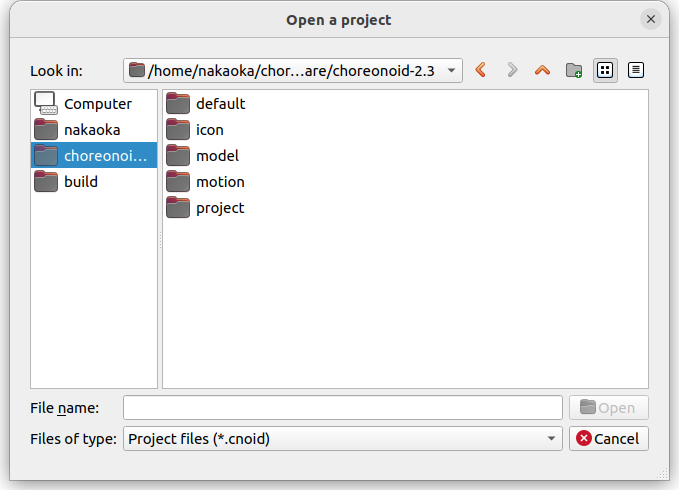

Please specify the project file you want to load here. Note that project files usually have the extension ".cnoid".

If you are starting Choreonoid from the command line, you can also load a project using :ref:`basis_launch_projectfile` introduced in :doc:`launch`.

.. _basics_sample_project:

Sample Projects
---------------

Choreonoid comes with several sample projects by default. These samples are stored in the "project" directory under Choreonoid's share directory. (Please refer to :doc:`../install/directories` for the location of the share directory.)

The following shows an overview of the main samples, so please try loading and testing any that interest you.

.. tabularcolumns:: |p{4.5cm}|p{10.5cm}|

.. list-table::
 :widths: 30,70
 :header-rows: 1

 * - Project File
   - Content
 * - FallingBoxes.cnoid
   - Simulation of four boxes falling
 * - SR1Walk.cnoid
   - Walking simulation of the sample bipedal robot model "SR1"
 * - SR1Walk2D.cnoid
   - Walking simulation of the SR1 robot using the "2D mode" of AISTSimulatorItem
 * - SR1Liftup.cnoid
   - Simulation of the SR1 robot grasping and lifting a box
 * - SR1WalkinHouse.cnoid
   - Simulation of the SR1 robot walking inside a house and lifting a videotape from a table
 * - PA10Pickup.cnoid
   - Simulation of the Mitsubishi Heavy Industries manipulator "PA10" grasping and moving a box
 * - SampleCrawler.coid
   - Simulation of driving a mobile robot with crawler mechanism
 * - SampleCrawlerJoystick.coid
   - Simulation of operating a mobile robot with crawler mechanism using a joystick. When a USB joystick is connected (operation confirmed with Logicool gamepad F310), you can operate it by tilting the stick
 * - TankJoystick.coid
   - Simulation of operating a tank-style mobile robot with a joystick. The setting involves exploring inside a dark plant by illuminating with the robot's light. In addition to movement operations, you can change the direction of the turret (light) and turn the light ON/OFF
 * - GR001Sample.cnoid
   - Sample motion choreography for the bipedal robot kit "GR001" manufactured by HPI Japan. The robot can be moved using keyframe data "SampleMotion1". Also, by building and installing the GRobot plugin, it is possible to operate the actual GR001 machine
 * - RIC30Sample.cnoid
   - Motion choreography sample for the bipedal robot kit "RIC30" manufactured by RT Corporation. The content is the same as GR001
 * - ClosedLinkSample.cnoid
   - Sample of modeling and simulation of closed-loop mechanisms
 * - ConveyorSample.cnoid
   - Simulation sample of conveyor belt mechanism

For the samples listed above that include robot control, you need to set **BUILD_SIMPLE_CONTROLLER_SAMPLES** to "ON" when building Choreonoid (it is ON by default). Additionally, there are other samples that are added when optional plugins are enabled, beyond those listed here.

.. _basics_project_sr1walk:

SR1Walk Project
---------------

Below, let's load a project called "SR1Walk" from the samples and look at an actual project example. First, please load the project file "SR1Walk.cnoid" for this sample. The project will be loaded and a robot like the following should be displayed.

.. image:: images/SR1Walk_scene.png

This robot is the "SR1" robot, one of the sample models. The SR1Walk project is a project that performs bipedal walking simulation with this SR1 robot.

The simulation starts by pressing the "Start Simulation Button" in the "Simulation Bar" shown below.

.. image:: images/SimulationBar_StartButton.png

When you press the button, the robot should start walking. In this simulation, the robot's physical model is loaded and controlled by PD control according to the walking pattern. The results are calculated through dynamics computation and presented through animation.

Project Component Items
------------------------

The items that constitute a project can be confirmed in the "Item Tree View" area, which is located by default in the upper left of the main window. In the SR1Walk project, the Item Tree View should be displayed as follows.

.. image:: images/ItemTreeView.png

Each item displayed in the Item Tree View corresponds to an item.

Here, the overview of each item is as follows.

.. tabularcolumns:: |p{3.5cm}|p{3.5cm}|p{7.5cm}|

.. list-table::
 :widths: 20,28,52
 :header-rows: 1

 * - Name
   - Item Type
   - Content
 * - World
   - World Item
   - Corresponds to one virtual world in simulation. For details, see :ref:`model_collision_and_worlditem`.
 * - SR1
   - Body Item
   - Item corresponding to robot model "SR1". Holds information such as shape, joint structure, physical parameters, and current state of the SR1 model. For details of the BodyItem class, see :doc:`../handling-models/bodymodel`.
 * - SR1WalkController
   - Simple Controller Item
   - Item corresponding to a control program (controller) that performs PD control based on walking patterns. During simulation, the control routine associated with this item is executed to control the robot.
 * - ASITSimulator-SR1
   - Body Motion Item
   - Item that stores the motion trajectory of the SR1 model. Generated as a simulation result when simulation is executed.
 * - Floor
   - Body Item
   - Floor model
 * - AISTSimulator
   - AIST Simulator Item
   - Simulation engine developed by AIST. Simulation results are calculated by the dynamics computation routine associated with this item.

.. _basics_itemclass:

Item Types
----------

The types of items are called "item types". The items that constitute a project generally consist of multiple item types.

Item types correspond to classes defined in Choreonoid's C++ implementation, and all items are classes that inherit from the base "Item" class. For example, the item types included in the SR1Walk project have the following inheritance relationships.

.. image:: images/item-inheritance.png

Functions designed for a certain item type are also available for item types that inherit from it. Many of the basic functions for handling items are designed for the base type (Item class), and they are available for all items.

On the other hand, there are also functions that target specific item types. For example, functions targeting robot and environment models are intended for Body Item type items that correspond to model data.

Such functions targeting specific item types are also valid for item types that further inherit from that type. For example, to use simulation functions, you need an item of "Simulator Item" type that abstracts simulation engines, but actually "AIST Simulator Item" that inherits from this is used in the SR1Walk project. Simulation functions can also be executed by other item types that inherit from Simulator Item type, so by introducing such item types, you can also change simulation calculation methods, etc.

.. note:: As an example of this, when "ODE Plugin" or "Bullet Plugin" are built, additional simulator item types "ODE Simulator Item" and "Bullet Simulator Item" are loaded in the SR1Walk project as well.
 In this case, you can perform simulations using those engines by selecting those items and pressing the simulation start button.
 (For how to build these plugins, see :doc:`../install/options`.)

As described above, the system defines general functions for higher-level item types and defines item types for special functions at lower levels, thereby achieving a mechanism that unifies interfaces as much as possible while also supporting individual functions.

.. _basics_item_tree:

Item Tree
---------

In the SR1Walk project, each item is arranged in the following tree structure.

| + World
|   + SR1
|     + SR1WalkController
|       + AISTSimulator-SR1
|   + Floor
|   + AISTSimulator

This tree structure is for defining relationships between items. In the SR1Walk project, specifically the following relationships are expressed.

First, the robot and floor models "SR1" and "Floor" are placed as child items (child nodes in the item tree) of "World". This indicates that both SR1 and Floor are objects that exist in the virtual world of this World item. This causes interference between SR1 and Floor to be calculated, for example. (For details on this, see :ref:`model_collision_and_worlditem`.)

Also, the simulation engine "AISTSimulator" is placed as a child item of World. This indicates that the virtual world that is the simulation target of AISTSimulator is World.

Such relationships with World items may not have great significance when there is only one virtual world as in this project. However, when multiple World item type items exist, it becomes necessary to indicate which World item models and simulators are associated with in this way. Conversely, this mechanism allows Choreonoid to handle multiple virtual worlds simultaneously.

Next, "SR1WalkController" is placed as a child item of SR1. This indicates that the control target of this controller is the SR1 robot. Even when multiple robots and controllers exist, this mechanism allows association between robots and controllers.

Regarding AISTSimulator-SR1, which corresponds to robot motion trajectory data, it is placed as a child item of SR1WalkController. This indicates the following two relationships. One is that this motion trajectory represents the motion of the SR1 model. Although the motion trajectory item is not a direct child of SR1, being a descendant child (grandchild or below) also creates the same association as a child. However, if you only wanted to show this relationship, it could be a direct child item of SR1, but as a second relationship, to also show that this motion trajectory is the result of SR1WalkController's control, it is arranged in this way.

As described above, various relationships between items can be expressed through the tree structure of items. Also, the arrangement of items in the tree can be freely moved by users at any time, and each function of Choreonoid extracts relationships according to their respective rules from the current tree state. This unified and dynamic interface based on items and their tree structure makes it possible to handle complex projects and functions simply and flexibly.

.. _basics_itemtree_management:

Item Tree Management
--------------------

.. _basics_selection_and_check:

Selection and Check
~~~~~~~~~~~~~~~~~~~

Items can be "selected" or "checked" in the Item Tree View. For example, suppose there are three items as follows.

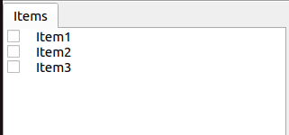

In this state, all items are in their normal state. Here, when you click "Item2" with the mouse, the Item2 area becomes displayed as follows.

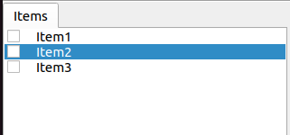

This state is called the "item selected" state.

The selection state is released by selecting another item or pressing the ESC key. Also, by clicking items while holding the Shift or Ctrl key, you can put multiple items in the selected state simultaneously. Such multiple item selection is often necessary, so please remember this. Furthermore, pressing "Ctrl + A" (Ctrl and A simultaneously) puts all items in the selected state.

Separate from the selection state, there is also an item "check" state. This is indicated by a box displayed at the left end of the item. When you click this box part, a check appears in the box as shown below.

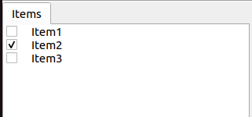

You can release the check state by clicking the checked box again.

As shown below, it is possible to have both selection and check for an item simultaneously.

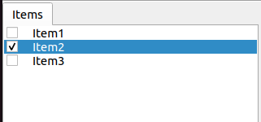

Selection state and check state are used when multiple items can be operation targets, to clearly indicate which items are operation targets. It's a bit complicated, but each state can be switched independently, and which state is referenced when performing a certain operation does not have strict regulations and depends on each operation. Therefore, you need to remember which of the selection state or check state to use for each operation, but the general tendency is:

* Selection state

 * Basic operations on the item tree
 * Temporary operations
 * Selection when multiple items compete as candidates

* Check state

 * Switching permanent ON/OFF states
 * Operations where multiple candidates can be targets simultaneously

Such is the usage distinction.

As an example of using selection state, when multiple Simulator Item type items exist, which item to use for simulation is determined by the selection state of items when the simulation start button is pressed.

Also, as an example of using check state, whether to display models in the Scene View is switched by the check state. In the SR1Walk example, two models, robot and floor, are loaded as items, but by default only the robot model is displayed. So please try checking the "Floor" item, which is the floor model. The blue floor model should then be displayed in the Scene View. Conversely, if you uncheck the "SR1" item, which is the robot model, the robot display in the Scene View will also disappear. (This operation is explained in detail in :doc:`sceneview`.)

New Creation
~~~~~~~~~~~~

New creation of items can be done from "File" - "New" in the main menu. When you select the item class you want to newly create here, a dialog for deciding the name appears, so enter an appropriate name there (the default name is also OK) and press the "Generate" button. (Depending on the item class, there may be setting items other than the name.) The item is then generated and displayed in the Item Tree View.

Note that when performing the above operation, if one existing item is selected in the Item Tree View, the newly created item will be placed as a child item of that item.

.. _basics_item_load:

Loading
~~~~~~~

Items that can be generated by loading from files, including robot models, also exist. In this case, select the type of file you want to load from "File" - "Load" in the main menu. A file loading dialog will appear, so select the file to load with it. If it can be loaded successfully, an item corresponding to that file will be generated. As with new creation, if an existing item is selected, the item will be loaded as a child item of that item.

Also, for items loaded from files in this way, you can reload the item on the spot by selecting that item in the Item Tree View and pressing "Ctrl + R". This is convenient when you want to immediately reflect file updates made externally in Choreonoid. For example, it can be used when editing model files externally and wanting to immediately confirm the editing results in Choreonoid.

.. note:: In the item loading dialog, there is an option "Check in Item Tree View" at the bottom of the dialog. If you check this, the item will be loaded with the check mentioned in :ref:`basics_selection_and_check` enabled, and furthermore, this option setting will be inherited for subsequent loading of the same type of items. This function is convenient to set for items like Body Items that often need to be checked after loading.
	  
Name Change
~~~~~~~~~~~

Double-clicking an item in the Item Tree View allows you to edit the item name text. You can change the item name by entering a new name there.

Cut, Copy, Paste
~~~~~~~~~~~~~~~~

Right-clicking an item in the Item Tree View displays a context menu with the following items:

* Cut
* Copy (Single)
* Copy (Subtree)
* Paste

You can perform cut, copy, and paste operations using these.

For copying, when the target item has child items, the behavior changes between "Single" and "Subtree". "Single" copies only that item, while "Subtree" copies including all child items (descendant items) that the item has.

For pasting, it is pasted as a child item of the item in the selected state, so you can change item arrangement using cut & paste.

.. _basics_item_move:

Movement
~~~~~~~~

You can move the position of items by dragging items on the ItemTreeView.

For example, suppose there are three items Item1 to Item3 as shown in the figure below.

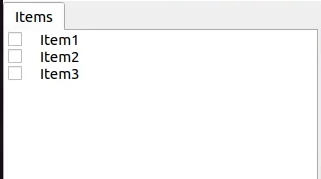

Here, when you drag Item3 with the mouse to a position where it overlaps with Item1, a rectangle surrounding Item1 appears as shown on the left side of the figure below. When you complete the drag in this state, Item3 moves to a position where it becomes a child item of Item1, as shown on the right side.

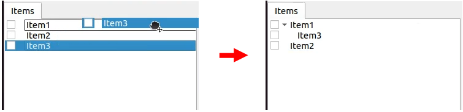

Alternatively, when you drag Item3 to exactly the middle position between Item1 and Item2, a line appears between Item1 and Item2. When you complete the drag in this state, Item3 moves in a form inserted between Item1 and Item2, as shown on the right side.

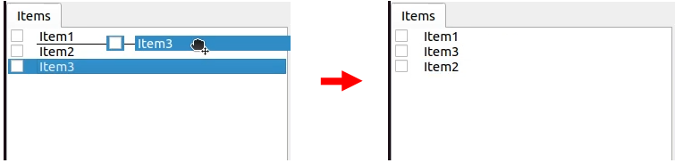

In the following example, Item3, which is a child item of Item1, is dragged to a lower position where there is nothing. In this case, Item3 moves to line up at the Root of the tree, as shown in the right figure.

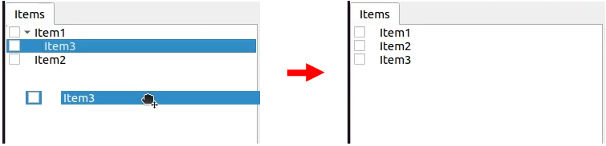

By dragging items on the Item Tree View in this way, you can freely change the arrangement of items.

Save
~~~~

Some items can save the data they have to files. For such items, you can save data to files by first putting the item in the selected state and executing "File" - "Save Selected Item As" from the main menu. Files saved in this way can usually be loaded again into Choreonoid using the :ref:`basics_item_load` procedure described above. This also allows data to be used in other Choreonoid projects. It also becomes possible to use saved data in external programs.

As a concrete example, let's try saving the "AISTSimulator-SR1" item generated after simulation in the SR1Walk sample. This item is a Body Motion Item type item that stores robot motion trajectory data, and that data can be saved as a file. First, select this item and execute "Save Selected Item As", and the following dialog appears.

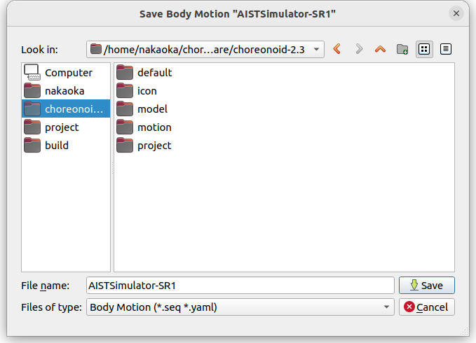

Here you specify the save destination and file name, but in addition to those, there is a "Files of type" combo box at the bottom of the dialog. Some items can be saved in multiple file types, and in such cases you can select the file type with this combo box.

Here we will save in the standard yaml format. It will then be saved as a file like "AISTSimulator-SR1.yaml". This file can be loaded again from "File" - "Load" - "Body Motion" in the main menu.

Furthermore, regarding saving to files, there is also an "Export" item. "Export" is the same as normal saving in terms of saving to files, but file formats that are not standard formats in Choreonoid are classified under this "Export". When the file format you want to save exists in "Export", you can save files in that format by executing "File" - "Export Selected Item" from the main menu.

.. _basics_composite_item:

Composite Items
---------------

Some items store data contained in that item as their own child items. These are called "Composite Items".

An example of an item class that is a composite item is the Body Motion Item type. This was also generated as "AISTSimulator-SR1" during simulation execution in the SR1Walk sample, and is an item that stores robot motion trajectory data. This item actually has the following configuration. (The parentheses indicate the item type of each item.)

| + BodyMotionItem
|   + Joint (MultiValueSeq item)
|   + Cartesian (MultiSE3Seq item)
|   + Devices (MultiDeviceStateSeq item)

Here, "Joint" is an item that stores joint angle trajectory data, "Cartesian" is an item that stores link position/orientation trajectory data, and "Devices" is an item that stores input/output data of devices such as sensors. (Other data items that store :ref:`legged_model_zmp` trajectories etc. are added as needed.)

These items are each items that can be generated and used individually, but here they serve as parts of the composite item's data. Such items are called "sub-items" of the composite item. Items that become sub-items cannot be separated from the main body of the composite item.

Movement of items within the item tree, and loading and saving of items, are performed on the main body of the composite item. At that time, sub-items are processed together with the main body.

The benefits of introducing composite items are in the following points:

* More complex item classes can be defined by combining existing item classes
* Functions available for sub-items become available as-is for composite items (part of their data)

These benefits allow more efficient introduction of new item classes. That is, for developers, there are fewer parts that need to be newly implemented, and for users, there are fewer new operations that need to be learned.

.. _basics_item_property:

Item Properties
---------------

Items have attributes accessible through the :ref:`basics_mainwindow_item_property_view`, which are called "properties". When you select one item in the Item Tree View, a list of that item's properties is displayed in the Property View. For example, when you select "AISTSimulator" in the SR1Walk sample, the AIST Simulator's property list is displayed in the Item Property View as shown below.

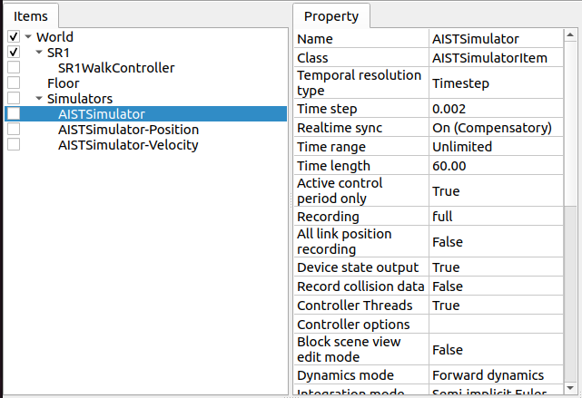

Properties include those that are only for viewing and those that users can edit. For example, the "Class" property, which is second from the top in the figure above, indicates the item type of this item, showing that it is an AISTSimulatorItem (AIST Simulator Item) type. However, the class of an item cannot be changed after item generation. On the other hand, for other properties, you can edit values by double-clicking on the property value (right column) in the Property View.

For example, this item has a "Gravity acceleration" property that shows the 3 elements of the gravity acceleration vector. When you double-click on the value part, it becomes as shown below and you can input values from the keyboard.

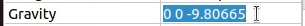

Here, try entering "0 0 0" for example. This sets the gravity of the virtual world to zero gravity. When you perform simulation again in this state, you can see that the robot moves as if floating without moving from the floor.

In this example, the target was a vector value, so it was set to input three elements as text, but the value editing method changes according to the type of property. For example, for values that switch mode ON/OFF, it becomes a combo box for selecting from Boolean values true / false as shown below.

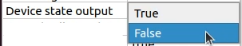

For properties that select from three or more choices, it becomes a combo box containing the choices,

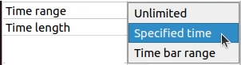

For normal numerical values (scalar values), you can input with a spin box (input box with buttons to increase/decrease values) for numerical input.

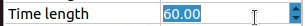

The advantage of properties is that they can be operated through the unified interface of the Property View for any item class. However, note that not all information that items have can necessarily be displayed and edited in the form of properties. For example, regarding motion trajectory data, it is difficult to handle the trajectory itself in the Property View, so it is handled with other interfaces such as Graph View.

As mentioned in :ref:`basics_itemclass`, item types have inheritance relationships, and properties defined in higher-level types are also valid for lower-level types. Properties such as "Name" and "Class" are defined for the base "Item" type, so they are valid for all items. Also, some of the simulation-related properties of "AIST Simulator Item" are properties defined in the higher-level "Simulator Item" type, and are common to all items that inherit from the Simulator Item type.

.. _basics_project_save:

Saving Projects
---------------

The current state of the item tree on Choreonoid, and the contents of each item's data and properties, etc., can be saved together as a project file. To do this, execute "File" - "Save Project As" from the main menu. The "Save Choreonoid Project File" dialog will be displayed, so specify the destination directory and file name to perform the save. Project files usually have the extension ".cnoid".

.. note:: Project files save not only the state of items, but also much of the state of views and toolbars. This allows you to resume work on a project in almost the same state as before by loading the project file.

When the current project was originally loaded from a project file, you can perform overwrite saving by "File" - "Save Project" from the main menu. This overwrite saving can also be executed by pressing the "Save Project" button in the "File Bar" shown in the figure below.

.. note:: Choreonoid still has many parts under development and may crash suddenly, so it is recommended to press this button frequently while creating projects.

When you try to execute overwrite saving when there is no base project file, the same function as "Save As" is executed.

Project files are saved in a format called YAML. YAML is a format for describing structured information in a simple and highly readable text file format. Although we won't go into details here, the adoption of this YAML format makes it relatively easy to view project files as text files to check their contents, or to edit contents with a text editor.

Note that project data is not necessarily all stored together in the project file, but some parts are saved in other files and saved as references to those files. For example, in the SR1Walk project, the robot and floor models are saved separately as :doc:`../handling-models/modelfile/index`, and only those file names are described in the project file. To record the entire project, you need to also manage those saved as separate files, so please be careful.

.. _basics_layout_save:

Saving Layout
-------------

The display on/off and layout of toolbars and views can also be saved in project files. Project files saved in this way include layout information, and the saved layout will be restored when the file is loaded.

This is not done by default, but it will be done if you check "File" - "Project File Options" - "Layout" in the main menu. Therefore, when the layout of toolbars and views is important for project work, please check this. Once you check it, that setting is saved as :doc:`config` and will be effective when starting Choreonoid again.