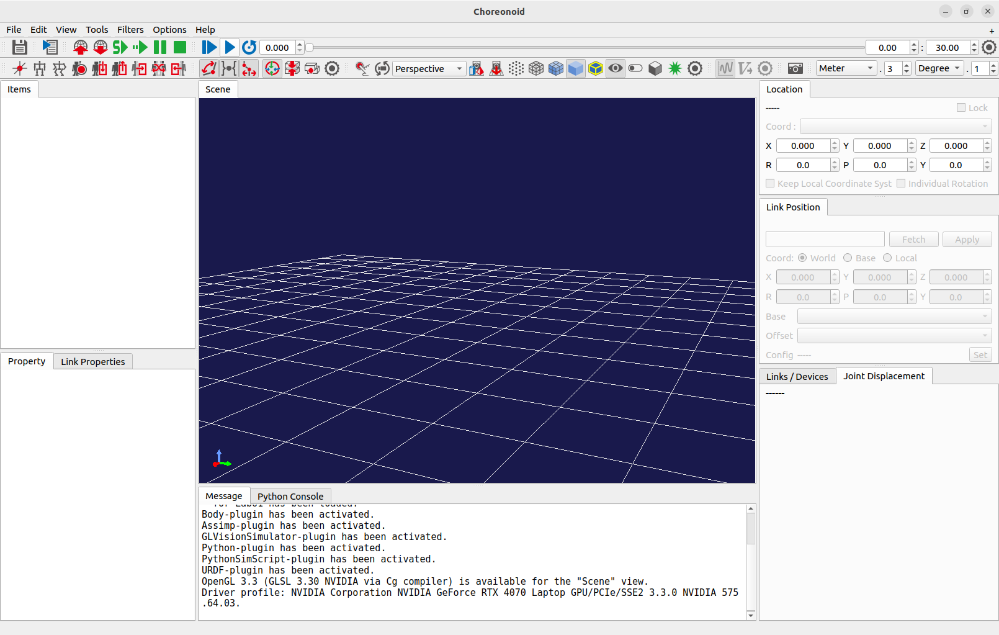

Launch Methods
==============

.. contents::
   :local:
   :depth: 1

.. highlight:: sh

Launching from Command Line
---------------------------

To launch Choreonoid using command input from a terminal, which is common on operating systems like Linux, you enter the command "choreonoid", which is the executable file for Choreonoid. (On Windows, similar operations are possible using a system tool called "Command Prompt".)

This command is located in the "bin" directory of the installation destination. If the path is set to that directory, you can simply launch it by typing ::

 choreonoid

Alternatively, when you build Choreonoid from source, the executable file is first generated in the bin directory of the build directory. You can also directly execute that executable file. For example, if you performed the build in a build directory called "build" within the source directory, you can launch Choreonoid by entering the following in the terminal: ::

 cd [source directory]
 ./build/bin/choreonoid

When launched, Choreonoid's main window as shown below will be displayed.

Launching from File Manager
---------------------------

On operating systems like Windows, the command line operations described above may not be very common. In such cases, you can also run Choreonoid from file manager software like Windows Explorer. Open the Choreonoid installation folder with the file manager, and launch it by double-clicking the executable file in the bin directory (on Linux it's "choreonoid", on Windows it's "choreonoid.exe").

Launching from Application Menu
-------------------------------

When Choreonoid is installed using the installer on Windows, a Choreonoid item is added to the Start menu, so it's also possible to launch Choreonoid from the Start menu. Even on operating systems other than Windows or when not using an installer on Windows, you can register the Choreonoid executable file mentioned above in the menu.

.. _basis_launch_projectfile:

Specifying Project Files with Command Line Arguments
----------------------------------------------------

For "projects" described in :doc:`item`, it's also possible to have them loaded when Choreonoid starts up. To do this, you specify a "project file" as a command line argument when launching Choreonoid. For example, to load a project file called "project1.cnoid" in the current directory, you can specify it as follows: ::

 choreonoid project1.cnoid

If you're familiar with the command line, this method allows you to efficiently load project files.

Also, by using the OS file association feature to associate files with the ".cnoid" extension with the choreonoid executable file, it becomes possible to launch Choreonoid with that project file simply by double-clicking the project file from the file manager. The Windows installer performs such associations during installation.