Screen Configuration
==================

In Choreonoid, various "toolbars" and "views" are basically arranged on the "main window," and their layout can be freely configured. This section explains the configuration and operation methods.

.. contents::
   :local:
   :depth: 1

Main Window
-----------

The configuration of the "main window" displayed when Choreonoid is launched is as follows.

.. image:: images/screen.png

Basic operations such as changing the position and size of the main window, minimizing, and maximizing can be performed according to the conventions of the OS window system.

The following sections explain each component of the main window.

Main Menu
---------

The main menu provides menu-based access to various operations and settings. Menu items are organized by categories such as "File," "Edit," "Tools," "Filter," "Options," and "Help." Note that on Mac OS X and Ubuntu's Unity desktop environment, etc., the main menu is not displayed in the main window but is displayed in the bar at the top of the desktop screen according to the system conventions.

Toolbar
-------

The toolbar is similar to those found in general application software, providing a compact interface with buttons and other elements arranged together, allowing quick access to frequently used functions. The toolbar is also a basic interface in Choreonoid, and various toolbars are arranged and used in the toolbar area at the top of the main window.

As a specific example of a toolbar, there is the following "Time Bar."

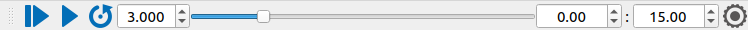

This toolbar performs time-related operations in Choreonoid. Using this, it is possible to specify the temporal editing position of time-series data and perform animation display.

Choreonoid provides various other toolbars as well.

.. _basics_mainwindow_view:

View
----

The "view area" is an area that displays "views," which are central GUI elements of Choreonoid. Views are panel-like areas where various data display and editing are performed. Choreonoid provides various types of views, and it is common to arrange multiple views in the view area for use. The following are some basic views.

.. _basics_mainwindow_itemtreeview:

Item Tree View
~~~~~~~~~~~~~~
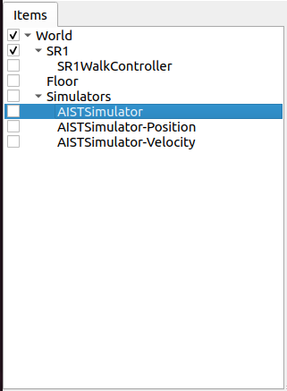

Data that becomes an explicit operation target in Choreonoid is usually managed as "project items." The "Item Tree View" shown in the above figure is provided as a view for this purpose. Details of these will be explained in the next section :doc:`item`.

.. _basics_mainwindow_item_property_view:

Item Property View
~~~~~~~~~~~~~~~~~~

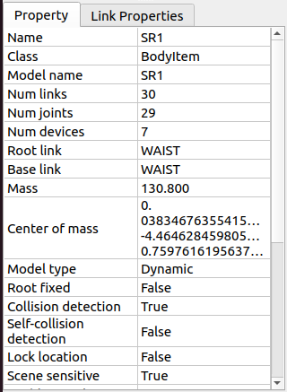

This is a view for browsing and editing :ref:`basics_item_property`. A list of properties of the item selected in the Item Tree View is displayed. For editable properties, you can also input values by clicking on them.

.. _basics_mainwindow_messageview:

Message View
~~~~~~~~~~~~

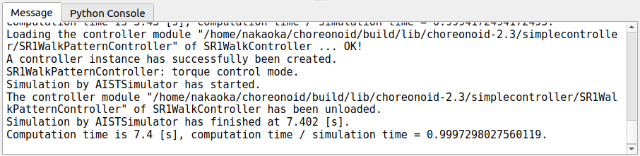

This is a view where messages from Choreonoid are output. It can be used to check the operation status.

.. _basics_mainwindow_sceneview:

Scene View
~~~~~~~~~~

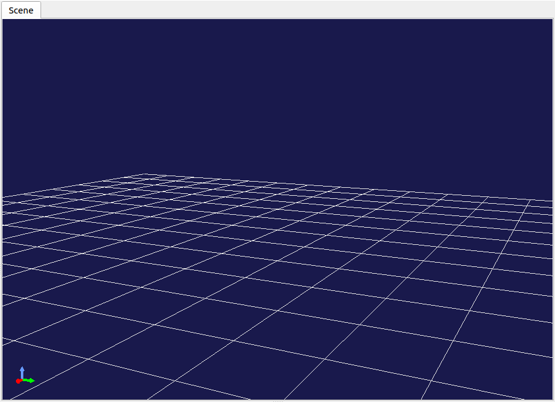

This is a view that displays various data using three-dimensional computer graphics (3D-CG). Robot and environment models are rendered in this view. Additionally, interactive manipulation of target models can be performed in this view. Details are explained in :doc:`sceneview`.

Status Bar
-----------

The status bar at the bottom of the main window is an area for notifying the content of currently ongoing processes in Choreonoid with brief messages, displaying messages like the following:

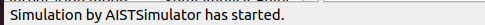

The status bar area is internally divided into two parts. Basically, the left side displays messages announcing the start or end of processes, while the right side displays the state of objects that the mouse cursor is pointing to in the working view.

Display Switching
-----------------

In Choreonoid, multiple views and toolbars can be arranged and displayed on the main window. However, if all available views and toolbars are displayed simultaneously, unused ones will also be displayed, making it confusing, or sufficient size cannot be secured for frequently used views, resulting in poor usability. Therefore, Choreonoid allows switching the display of views and toolbars. By using this function to display only what is necessary for the current work, it becomes possible to work comfortably.

.. _basics_switch_view_tabs:

Switching Between Overlapping Views
~~~~~~~~~~~~~~~~~~~~~~~~~~~~~~~~~~~~

Multiple views can be stacked in the same area. In this case, a list of overlapping views is displayed as tabs as shown in the figure below. (※If tabs are not displayed, press the F12 key to display them.)

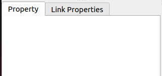

As you can understand, you can bring a view to the front for display by clicking on its tab. For views that are not used very frequently but are occasionally needed, it is common to place them behind other views like this and use them by switching.

The method for changing the tab stacking is explained in :ref:`basics_modify_layout` below.

.. _basics_show_hide_views:

View Display Switching
~~~~~~~~~~~~~~~~~~~~~~~

When you navigate from the main menu to "View" - "Show View," a menu like the one shown below appears.

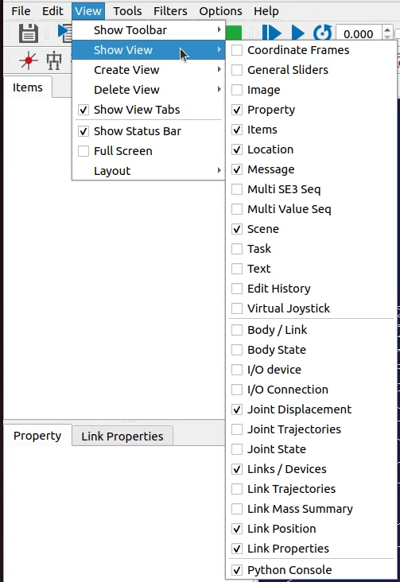

What is displayed here is a list of views currently available in Choreonoid. Those with checkmarks are already displayed (including those stacked in tabs), and those without checkmarks indicate views that are not yet displayed. By selecting a view here, you can toggle its check state and switch the display/hide state of that view. When displaying a view that was not previously shown, it will be displayed by overlapping with one of the existing view areas.

Note that views that are not yet displayed are usually not generated internally and will be generated when they are displayed. After that, the view is not deleted internally just by hiding it, so when it is redisplayed, it will be shown maintaining its previous state.

The menus for "Create View" and "Delete View" are used to explicitly perform such internal generation/deletion. How these are used is generally when generating and displaying multiple views of the same type. For example, :ref:`basics_mainwindow_sceneview` supports this function, and it is possible to display multiple scene views simultaneously using "Create View" and display them with different viewpoints and rendering methods. "Delete View" hides the view and also performs internal deletion. When a generated view is no longer needed, it can be completely deleted using this function.

.. _basics_show_toolbar:

Toolbar Display Switching
~~~~~~~~~~~~~~~~~~~~~~~~~~

For toolbars as well, similar to views, you can switch the display state from "View" - "Show Toolbar" in the main menu.

.. _basics_modify_layout:

Layout Modification
-------------------

The layout of views and toolbars can be freely modified, allowing you to achieve a layout that is convenient according to user preferences and work content.

.. _basics_modify_view_layout:

View Layout Modification
~~~~~~~~~~~~~~~~~~~~~~~~~

View layout is configured by combining operations such as:

* :ref:`basics_view_split_position`
* :ref:`basics_view_tab_position`
* :ref:`basics_view_move`

.. _basics_view_split_position:

Changing Split Boundary Position
''''''''''''''''''''''''''''''''
By dragging the boundary between adjacent views, you can change the size allocation to each view. For example, in the figure below, two view areas are arranged horizontally.

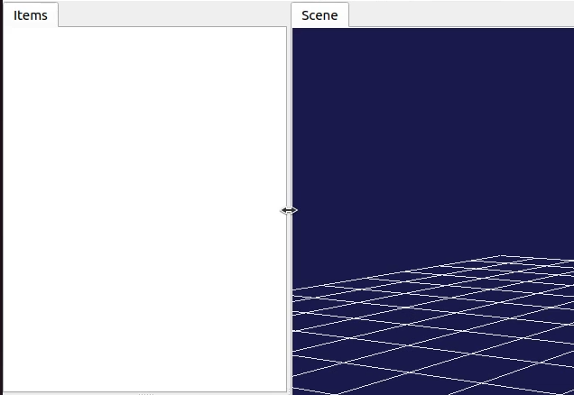

When you move the mouse cursor to the boundary between these areas, the cursor changes to a double-arrow shape as shown in the figure. When the mouse cursor is in this shape, you can change the position of this boundary left and right by pressing the left mouse button and moving the mouse left and right (dragging). As a result, you can change the size distribution to the left and right areas. Furthermore, by continuing to drag the boundary to either the left or right area, you can completely close one area. Even when you do this, the boundary line remains, so you can display the closed area again by dragging the boundary line again. The above operations can be performed similarly between view areas arranged vertically.

.. _basics_view_tab_position:

Changing Tab Position
'''''''''''''''''''''
In areas where views are stacked, you can change the order of tabs by dragging them. In the example below, the left tab is dragged to the right to swap the order of the two tabs.

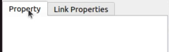
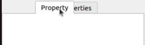
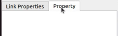

Although this only changes the visual order, it can be useful in situations such as "when processing a series of data one by one with multiple stacked views, it is clearer to arrange the tabs in the order of the data."

.. _basics_view_move:

Moving Views
''''''''''''
By dragging a view tab beyond the tab area, you can move the view to another area, move it to a newly divided area, or even make it an independent window from the main window.

When you drag a view tab, the mouse cursor becomes hand-shaped, indicating that the view is being dragged. When you move the mouse cursor near the center of the view area you want to move to as shown in the figure below, a dotted line surrounding the entire view area is displayed. (On the actual screen, it becomes a black and white dotted line.) When you complete the drag here, the view moves to overlap with that area, and a new tab corresponding to that view is added.

.. image:: images/view_drag_pane_center.png

Also, when you drag near the edge of the destination view area, the view moves to be inserted into a new area that contacts that edge. For example, when you drag to the right edge of a view area, the area division shown in the following figure is performed, and the view is inserted into the right area indicated by the red frame.

.. image:: images/view_drag_pane_right.png

For other edges as well, area divisions like those shown in the following figure are performed.

.. image:: images/view_drag_pane_others.png

View movement can also be performed by dividing the entire view area of the main window. For example, when you drag to the top edge of the entire view area, the area division shown in the following figure is performed, and the view is inserted into the part indicated by the red frame.

.. image:: images/view_drag_whole_top.png

Similarly, you can move to other areas as shown in the figure below.

.. image:: images/view_drag_whole_others.png

Furthermore, by dragging a view outside the entire view area as shown in the figure below, you can make it an independent window from the main window.

.. image:: images/view_drag_outer.png

Independent view windows can also be destinations for moving other views. This allows you to prepare windows with several views arranged separately from the main window. This can be utilized when using multi-displays. It is also possible to drag an independent view back to the main window.

However, immediately after making a view independent, tabs are not displayed, and you cannot drag the internal view. In this case, pressing the F12 key will display the tabs, and you can move the view to other areas by dragging those tabs.

Toolbar Layout Modification
~~~~~~~~~~~~~~~~~~~~~~~~~~~~

The position of each toolbar within the toolbar area can be changed by dragging the toolbar.

The part circled in red in the figure below is the handle for dragging the toolbar.

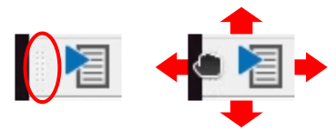

When you move the mouse cursor here, the cursor becomes hand-shaped. By dragging from there, you can move the toolbar up, down, left, and right. Even when there are other toolbars to the left and right, you can swap the positions of toolbars by continuing to drag. For vertical movement, even if there is no toolbar area, the vertical area is expanded and moved there.

Methods to Expand View Area
---------------------------

When the number of toolbars and views displayed simultaneously increases, depending on the display size, it may not be possible to allocate sufficient area to each view. In such cases, it is necessary to avoid displaying unnecessary toolbars and views as much as possible. Alternatively, by slightly expanding the display area of toolbars and views using the following methods, it may be possible to display more toolbars and views.

First, by using full-screen display, the portion allocated to the main window's title bar and window system management area can also be used, slightly increasing the display area. Switching to full-screen can be done from the main menu "View" - "Full Screen" or with the F11 key.

Also, you can toggle the display ON/OFF of view selection tabs from the main menu "View" - "Show View Tabs" or with the F12 key. When tabs are hidden, you cannot switch between overlapping views, but when switching is not needed for the time being, you can use the view area expanded by the amount of the tab area.

Furthermore, by unchecking "View" - "Show Status Bar" in the main menu, the status bar becomes hidden, and that area can also be freed up for use.

.. Display State and Layout Saving
.. --------------------------------

.. Currently it seems you can only save to project files, so this should be improved