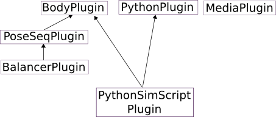

Plugin System
==================

.. contents::
   :local:
   :depth: 1

What is a Plugin
--------------

Choreonoid allows you to add new functions by introducing additional program modules, which are called "plugins". In fact, many of the standard features that Choreonoid provides are also implemented as plugins.

The functions that plugins add can take various forms. Generally, you can think of them as adding new types of items, views, and toolbars, which enable you to handle new data or use new operation and editing interfaces.

Plugin Examples
--------------

Below are some of the plugins that Choreonoid provides as standard. As you can see, various functions from basic to specialized features are provided as plugins.

.. tabularcolumns:: |p{4.0cm}|p{11.0cm}|

.. list-table::
 :widths: 25,75
 :header-rows: 1

 * - Plugin
   - Overview
 * - Body Plugin
   - A plugin that provides basic functions for handling robot and object models. It defines item classes and views related to displaying robot models, editing positions and orientations, dynamics simulation, etc.
 * - PoseSeq Plugin
   - A plugin that provides functions for choreographing robot motions using keyframes.
 * - Balancer Plugin
   - A plugin that adds automatic balance correction functions for bipedal robots to the motion choreography by the PoseSeq plugin.
 * - Python Plugin
   - A plugin for executing Python scripts on Choreonoid. You can automate Choreonoid operations using Python scripts.
 * - PythonSimScript Plugin
   - A plugin for linking Python scripts with simulation execution.
 * - Media Plugin
   - A plugin for playing audio and video files on Choreonoid.

Plugin Dependencies
----------------------

Some plugins require functions from other plugins. In this case, dependencies arise between plugins. For example, the dependency relationships for the above plugins can be illustrated as follows:

Here, the arrows indicate the direction of dependency. For example, the PoseSeq plugin depends on the Body plugin, so the Body plugin must also be loaded when using it. Also, since the Balancer plugin depends on the PoseSeq plugin, both the PoseSeq plugin and Body plugin are required when using it. The PythonSimScript plugin depends on both the Body plugin and Python plugin in parallel. On the other hand, the Body plugin, Python plugin, and Media plugin can be loaded without requiring other plugins themselves.

Regarding plugin dependencies, you usually don't need to worry about them because dependent plugins are also built when building a plugin. However, when a plugin fails to load properly, it may be because the dependent plugins are not properly installed, so it's good to be aware of these dependency relationships.

.. note:: For this purpose, it would be good if Choreonoid had a function to display a list of available plugins and the dependencies between plugins, but such a function does not exist yet, so for now you need to learn such information through the manual. We plan to implement a function to display plugin information in the future.

As you can see from the plugin dependencies, Choreonoid allows plugins to provide additional functions while using functions from other plugins. This enables efficient development of new functions and can be expected to make the developed functions operate in the same way as existing functions for users.

.. _basics_plugin_files:

Plugin Files
------------------

Plugins are binary files in the format of "shared libraries" or "dynamic link libraries", and are usually stored in Choreonoid's plugin directory. The plugin directory is the "lib/choreonoid-x.x" directory in Choreonoid's build directory or installation directory.
Here, x.x is replaced with Choreonoid's version number.

On Linux, Choreonoid plugin files have names that start with "libCnoid" followed by the plugin name, and end with the shared library extension ".so". For example, the Body plugin has the filename "libCnoidBodyPlugin.so".

On Windows, the name starts with "Cnoid" followed by the plugin name, with the extension ".dll". Therefore, the Body plugin has the filename "CnoidBodyPlugin.dll".

Plugin files stored in the plugin directory are automatically loaded and become available when Choreonoid starts. If a particular plugin fails to load properly, check whether the plugin file (including any dependent plugins) is correctly placed in the plugin directory.

.. note:: When using Choreonoid built from source, care is needed when updating the source and rebuilding/installing. There is no problem if all previously built plugins are updated and installed. However, in some cases, plugins may be discontinued or renamed. Also, you may change the configuration of plugins to build in the CMake build settings. In such cases, files of plugins that are no longer built may remain in the build directory or installation directory and be loaded when Choreonoid starts. However, since their content is outdated, they may cause problems such as Choreonoid crashes. Therefore, when the configuration of plugins to build changes after updating the source, especially if Choreonoid behaves strangely, it is recommended to delete all plugin files in the plugin directory once and then reinstall.

Building Plugins
------------------

In addition to the plugins that are built and installed by default with Choreonoid, there are also optional plugins available. You may also want to use plugins distributed separately from the Choreonoid main body. In such cases, you need to build and install the plugins you want to use.

For plugins included with the Choreonoid main body, please refer to :doc:`../install/index` - :doc:`../install/options` for instructions on building them. Basically, when configuring CMake during build, you just need to turn on the "ENABLE_XXX_PLUGIN" option (where XXX is the plugin name) and build.

For plugins distributed separately from the main body, please follow their instructions for building and installation.

Plugin Development
----------------

By developing plugins, you can add new functions to Choreonoid. For information on how to develop plugins, please refer to :doc:`../plugin-development/index` in this manual.

In practice, users have developed new plugins to realize and apply the following functions:

* Operation interface for bipedal humanoid robots "HRP-2" and "HRP-4C"
* Function to import human postures captured with Kinect into models on Choreonoid
* Function to connect with ROS nodes and perform simulation
* Research and development of new simulation engines
* Function to perform motion planning centered on grasping on Choreonoid (`graspPlugin <http://www.hlab.sys.es.osaka-u.ac.jp/grasp/ja/>`_)
* Research and development of methods to apply motion-captured human movement data to robots