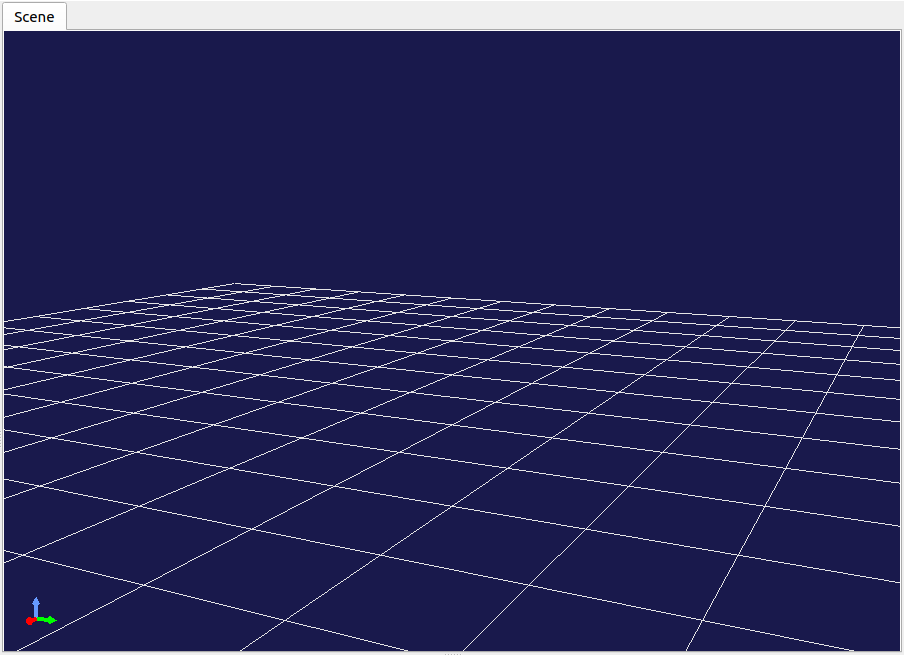
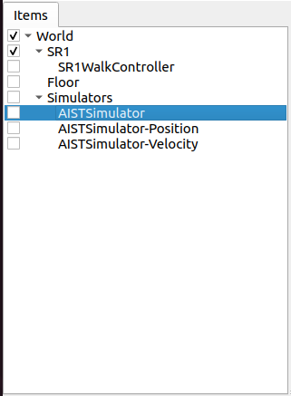
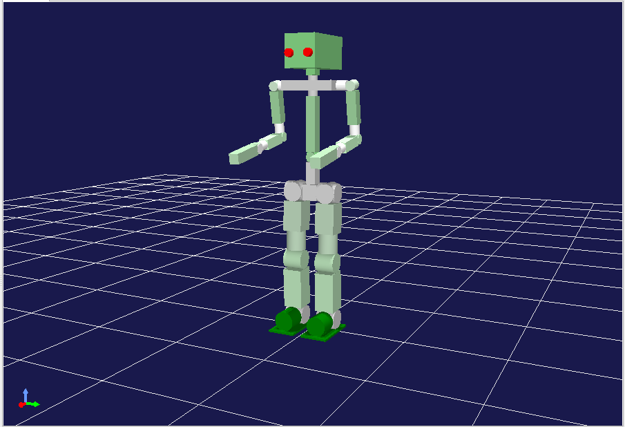
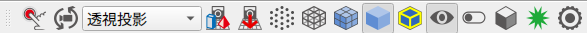

Scene Display
=============

.. contents::
   :local:
   :depth: 1

Scene
------

In Choreonoid, information that can be displayed as three-dimensional computer graphics (3DCG) is called a "Scene". Robot and environment models, as well as virtual worlds containing multiple such models, are treated as scene information.

.. _basics_sceneview_sceneview:

Scene View
------------

A "Scene View" is provided as a view for displaying scenes, which enables visual confirmation of the status of robot models, environment models, etc. through 3DCG. Furthermore, the Scene View can also be used as an interface for editing scenes.

The following explains the basic operation methods of the Scene View.

Empty Scene and Coordinate System
---------------------------------

The Scene View displays as follows by default:

The set of three arrows displayed in the lower left represents the coordinate system of the three-dimensional space as seen from the current viewpoint. The red, green, and blue arrows correspond to the X-axis, Y-axis, and Z-axis respectively (RGB=XYZ). In Choreonoid, the positive Z-axis direction is normally assumed to be vertically upward, and the Scene View's display and operation system is based on this assumption. This is a relatively common coordinate system approach in robotics, but it should be noted that it differs from coordinate systems where the positive Y-axis direction corresponds to vertically upward (which is common especially in the CG field).

Also, the grid-like wireframe represents the plane where Z=0. Since the Z=0 floor plane is often assumed when handling robot models, this corresponding plane is displayed by default.

The ON/OFF settings for the above displays can be switched in the configuration dialog described later.

Supported Items
---------------

In Choreonoid, much of the information that can be treated as scenes is also defined as items. Such items include the following:

.. tabularcolumns:: |p{3.0cm}|p{12.0cm}|

.. list-table::
 :widths: 22,78
 :header-rows: 1

 * - Item Type
   - Overview
 * - Body Item
   - Items corresponding to robot and environment models (body models). The shape and posture of models are displayed as scenes.
 * - World Item
   - Items that group multiple body models together as one virtual world. Interference information between models, etc. is displayed as scenes.
 * - Scene Item
   - Items specialized for the purpose of displaying as scenes. Used for purposes such as simple viewing of 3DCG data or enhancing the appearance of scenes.
 * - Point Set Item
   - Items for storing and displaying point cloud data.

In addition to these, items added by plugins may include items that can be displayed as scenes.

Displaying Supported Items
--------------------------

For scene display-compatible items, they are basically displayed in the Scene View by checking them in the Item Tree View.

For example, in the "SR1Walk" project introduced in the previous section :doc:`item`, the Item Tree View was in the following state:

Since the BodyItem type "SR1" is checked here, this robot model is displayed in the Scene View.

However, if this check is unchecked, the robot display will also disappear. Also, in this project, "Floor" is also a BodyItem type, and checking this will display the floor model.

.. _basics_sceneview_scenebar:

Scene Bar
----------

A "Scene Bar" shown below is provided as a toolbar to assist Scene View operations.

The functions equipped in this bar are as follows from left to right:

* Edit mode switching
* Viewpoint operation mode switching
* Rendering camera selection
* Viewpoint recovery
* Wireframe display
* Flip model types
* Collision line display
* Configuration dialog
		      
The usage of these functions is explained below.

.. _sceneview_editmode:

View Mode and Edit Mode
-----------------------

The Scene View has two overall operation modes: "View Mode" and "Edit Mode".

View mode is for viewing models and data displayed in the Scene View, displaying models and data simply while primarily performing viewpoint changes as operations.

Edit mode is a mode that accepts editing of models and data displayed in the view. For example, you can change the posture by dragging models with the mouse.

Choreonoid starts in view mode by default. Mode switching is performed by one of the following methods:

* Press the "Switch to the edit mode" Button in the Scene Bar. When this is OFF, it's in view mode, and when turned ON, it becomes edit mode.
* Press the ESC key while the Scene View has focus. (The mode switches each time you press it.)
* Double-click in the Scene View. (However, in edit mode, double-clicking may be assigned to other operations.)

The current mode can be identified by whether the "Switch to the edit mode" Button in the Scene Bar is pressed. Also, in edit mode, editing markers may be displayed on models, and you can also identify the mode by whether such displays are present.

Specific editing operations vary depending on the target models and data, so details are not explained here. (Operation methods for robot models are explained in :doc:`../handling-models/index` - :doc:`../handling-models/pose-editing`.) The following mainly explains operation methods in view mode.

.. _basics_sceneview_viewpoint:

Changing Viewpoint
------------------

In view mode, you can change the viewpoint by operating the mouse in the Scene View. The correspondence between viewpoint elements to change and mouse operations is as follows:

* Left button drag: Viewpoint rotation
* Middle button drag: Viewpoint parallel movement
* Wheel: Viewpoint zoom (forward/backward movement)

For all operations, the behavior changes depending on the position the mouse cursor points to in the Scene View when performing the operation, and the viewpoint change focuses on that position.

In viewpoint rotation operations, the position the cursor points to when starting the drag becomes the center of rotation. For example, with the SR1 robot, if you start dragging from the robot's right hand tip area, the viewpoint changes centered on the right hand tip (so that the hand tip position doesn't change on the screen), and if you drag from the left hand, it centers on the left hand, so please try it.

In viewpoint parallel movement, parallel movement is performed so that the position pointed to at the start of dragging follows the subsequent drag position. This is effective when using the Perspective camera described later for perspective display (default state). In this case, when pointing to nearby objects, the movement amount becomes small, and when pointing to distant objects, the movement amount becomes large.

For viewpoint zoom as well, when pointing to nearby objects, the zoom amount (forward/backward movement amount) becomes small, and when pointing to distant objects, it becomes large.

Note that when the mouse cursor points to an empty area in the scene, the operation focuses on the area that was pointed to immediately before.

Pressing the "Fit view to all objects" Button in the Scene Bar adjusts the translation position and zoom so that all objects in the scene are visible without changing the viewpoint direction. This is useful when you lose track of what you're looking at while performing viewpoint change operations.

Viewpoint Change Modifier Keys
------------------------------

The following modifier key operations are possible for viewpoint changes:

* Shift key + rotation operation: Snaps the viewpoint direction to each axis. Use this when you want to obtain images from directions such as directly from the side or directly from above.
* Shift key + zoom operation: Reduces the amount of zoom change. Use this when you want to finely adjust the zoom position.
* Ctrl key + translation operation: Performs zoom operation. Use this when you want to continuously change the zoom position.

Note that in environments without a middle button, the space key can be used instead of the middle button to perform operations that use the middle button. However, for the space key input to be accepted, the Scene View must have keyboard focus.

First-Person Viewpoint Change Mode
----------------------------------

The above viewpoint change operations were centered on objects in the Scene View, such as rotating around the object the mouse points to. In contrast, an operation system centered on the viewpoint is also provided, which is called "First-Person Viewpoint Control Mode". To switch to this mode, perform one of the following operations:

* Turn ON the "First-person viewpoint control mode" Button in the Scene Bar
* Press the "1" key on the keyboard while the Scene View has focus (press the "3" key to return to the default mode)

In this mode, viewpoint rotation and translation operations change as follows:

* Rotation: Always rotates centered on the viewpoint, regardless of mouse cursor position
* Translation: Moves in the direction the mouse is dragged

Such "First-Person Viewpoint Control Mode" is useful in situations such as entering inside buildings and exploring the interior.

.. _basics_sceneview_change_camera:

Changing Rendering Camera
-------------------------

Scene image rendering in the Scene View is performed using virtual cameras. By switching these cameras, you can obtain images with different perspectives or viewpoints than the default.

Camera switching can be performed with the "Rendering Camera Selection Combo" in the Scene Bar. When you click this combo box, a list of available cameras is displayed, so make your selection there.

By default, a camera called "Perspective" is selected. This camera provides images with perspective.

On the other hand, selecting "Orthographic" provides orthographic projection images without perspective. This is convenient when you want to accurately understand shapes and dimensions.

Note that zoom operations differ somewhat between Perspective and Orthographic cameras. With Perspective cameras, the operation moves the camera position forward and backward, but with Orthographic cameras, the operation expands and contracts the field of view while keeping the position the same. With Orthographic cameras, depending on the camera's forward/backward position, it may not be possible to display all the objects you want to see. In such cases, temporarily switch to Perspective camera, change the forward/backward position with zoom operations (move backward), then switch back to Perspective camera.

In addition to the two cameras provided by default above, if the scene contains additional cameras, they can also be selected. For example, when you add a robot model with mounted cameras to the scene, those cameras become selectable. This allows you to obtain images from the robot-mounted camera's viewpoint, and as the robot moves, the image in the Scene View changes accordingly. However, in this case, since the viewpoint is determined by the robot's position, normal viewpoint changes through mouse operations in the Scene View are not possible.

.. _basics_sceneview_wireframe:

Wireframe Display
------------------

When the "Wireframe rendering" Button in the Scene Bar is turned ON, the scene is rendered in wireframe. This is convenient when you want to see the polygon structure of models or the overlapping details of objects. There are several other elements that change the scene rendering method, which can be set in the configuration dialog explained below.

.. _basics_sceneview_config_dialog:

Configuration Dialog
--------------------

There are other configurable items for the Scene View's rendering method and behavior, which can be configured in detail in the dialog displayed by pressing the "Show the config dialog" Button in the :ref:`basics_sceneview_scenebar`. The dialog consists of four panels — "Camera", "Lighting", "Background", and "Drawing" — together with an options area below them. An overview of the main configuration items accessible from each panel is shown below.

Camera panel
~~~~~~~~~~~~

.. tabularcolumns:: |p{4.5cm}|p{10.5cm}|

.. list-table::
 :widths: 35,65
 :header-rows: 1

 * - Item
   - Content
 * - Field of view
   - Sets the field of view angle for the Perspective camera. Larger values result in wider angles.
 * - Direction
   - Selects the reference direction of the field of view from "Auto", "Vertical", or "Horizontal". With "Auto", the direction is determined automatically according to the aspect ratio of the view.
 * - Near / Far
   - Sets the rendering range (clipping distances) as seen from the viewpoint. No specific setting is needed if there are no rendering problems.
 * - Use infinite far clip distance for all cameras (OpenGL 4.5 or later)
   - Treats the far clipping distance of all cameras as effectively infinite. This is available in environments with OpenGL 4.5 or later.
 * - Restrict camera roll
   - Suppresses the roll (rotation around the optical axis) during viewpoint rotation, so that the up direction of the screen is preserved.
 * - Vertical axis
   - Selects the axis to be regarded as the vertical upward direction from X, Y, or Z. In Choreonoid, Z is normally used as the upward direction.
 * - Upside down
   - Displays the scene view image flipped upside down.

Lighting panel
~~~~~~~~~~~~~~

.. tabularcolumns:: |p{4.5cm}|p{10.5cm}|

.. list-table::
 :widths: 35,65
 :header-rows: 1

 * - Item
   - Content
 * - Lighting mode
   - Selects the lighting process used for rendering from "Normal", "Minimum", or "Solid color". "Minimum" is a lightweight lighting mode, and "Solid color" is a mode that renders only with material colors.
 * - Smooth shading
   - Toggles smooth shading ON/OFF. When OFF, it becomes flat shading.
 * - Back face culling
   - Selects culling of polygon back faces from "Enabled", "Disabled", or "Forced". With "Forced", culling is always performed regardless of the model's specification.
 * - World light
   - Toggles ON/OFF for lights fixed in the scene (normally emitted from above). The "Intensity" sets the brightness, and "Shadow" controls whether this light generates shadows.
 * - Head light
   - Toggles ON/OFF for the light that is always emitted from the viewpoint position. The "Intensity" sets the brightness.
 * - Ambient light
   - Toggles ambient light ON/OFF. The "Intensity" sets its strength. When "Normalize material ambient" is ON, the ambient light components of each material are uniformized for rendering.
 * - Additional lights
   - When models loaded in the scene have lights, toggles their ON/OFF. When the "Shadow for light" check is turned ON, shadows are rendered using the light with the specified number (up to two lights).
 * - Texture
   - Toggles ON/OFF for texture display.
 * - Fog
   - Toggles ON/OFF for fog effects defined in the scene.
 * - Anti-aliasing of shadows
   - Applies anti-aliasing to the outlines of shadows.

Background panel
~~~~~~~~~~~~~~~~

.. tabularcolumns:: |p{4.5cm}|p{10.5cm}|

.. list-table::
 :widths: 35,65
 :header-rows: 1

 * - Item
   - Content
 * - Background color
   - Sets the color for areas in the scene where no objects exist.
 * - Coordinate axes
   - Toggles ON/OFF for the coordinate axes displayed in the lower left of the Scene View.
 * - XY (Floor) Grid / XZ Grid / YZ Grid
   - Toggles ON/OFF the display of grid lines on each plane, and sets the overall "Span" (size of the range), the "Interval" between lines, and the "Color" of the lines.

Drawing panel
~~~~~~~~~~~~~

.. tabularcolumns:: |p{4.5cm}|p{10.5cm}|

.. list-table::
 :widths: 35,65
 :header-rows: 1

 * - Item
   - Content
 * - Default color
   - Sets the color for rendering objects without color specification.
 * - Default line width
   - Sets the default line width for line rendering.
 * - Default point size
   - Sets the default point size for point rendering.
 * - Collision highlight color
   - Sets the color used to highlight interference areas between models.
 * - Collision line color
   - Sets the color of collision lines.
 * - Anti-Aliasing (MSAA)
   - Selects the level of multi-sample anti-aliasing from "System Default", "Off", "2x", "4x", "8x", or "16x". When "System Default" is selected, the level configured in the main menu "Options" - "OpenGL" - "MSAA Level (System Default)" is used.
 * - Normal Visualization
   - Displays normals for each point of polygons. Normal length can also be set.
 * - Lightweight view change
   - While the viewpoint is being manipulated with the mouse, the rendering is temporarily switched to a simplified display (bounding box display) to improve responsiveness. However, this switching is only applied to models in the scene that support lightweight rendering (for example, models whose Scene Item property "Lightweight rendering" is turned ON), and only those parts are shown in simplified form. This is useful when you want to browse a heavy scene smoothly.
 * - FPS Test
   - Pressing the "FPS Test" button measures the frame rate at which the current scene can be rendered. The number of trials can also be specified.

Other options
~~~~~~~~~~~~~

At the bottom of the dialog there is a check box "Use dedicated item tree view checks to select the target items". Multiple Scene Views can be created to display different objects in each view. In such cases, if this check is ON, dedicated checks for the target Scene View are displayed on the right side of the Item Tree View, which can be used to toggle display ON/OFF in the Scene View. Note that when there are multiple Scene Views, the target view for the configuration dialog is the Scene View that had focus last when the dialog was displayed.

Saving Scene View State and Configuration
-----------------------------------------

As mentioned in :ref:`basics_project_save`, view states and settings are saved to the project file when saving projects. The Scene View's viewpoint position and various settings are also saved simultaneously when saving projects, and will return to the same state when loaded next time.
