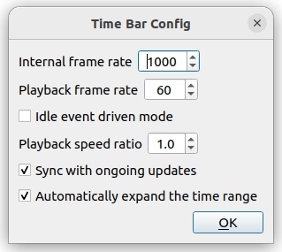

Time Axis Operations
===============

.. contents::
   :local:
   :depth: 1

Virtual Time and Time Bar
-------------------------

In Choreonoid, a virtual time axis is set up, and its current time can be changed by user operations. This allows you to change the display position (time) of data that has temporal extent, or perform animation display according to such data.

The following "Time Bar" is provided as a toolbar for performing such time axis operations.

.. image:: images/TimeBar.png

Here we will explain time axis operations, focusing on the operation of this time bar.

.. _basics_sequence_data:

Sequence Data
-------------

The targets of time axis operations are data that have temporal extent, and we will collectively call them "sequence data". In Choreonoid, most sequence data are also defined as items. Specific examples of sequence data items include the following:

.. tabularcolumns:: |p{4.0cm}|p{11.0cm}|

.. list-table::
 :widths: 30,70
 :header-rows: 1

 * - Item Type
   - Overview
 * - MultiValueSeq Item
   - An item that stores multiple sequence data of floating-point scalar values. Used for storing robot joint angle trajectories, etc.
 * - MultiSE3Seq Item
   - An item that stores multiple sequence data of 3D positions and orientations. Used for storing positions and orientations of robot parts (links), etc.
 * - Vector3Seq Item
   - An item that stores sequence data of 3D vectors. Used for storing trajectories of center of gravity position, ZMP, etc.
 * - Body Motion Item
   - An item that stores motion trajectories of :doc:`../handling-models/bodymodel`. Robot motion patterns and simulation results are stored. Defined as a :ref:`basics_composite_item` consisting of MultiValueSeqItem, MultiSE3SeqItem, Vector3SeqItem, etc.
 * - Pose Sequence Item
   - An item that stores sequences of key poses. Used in robot motion choreography.
 * - Audio Item
   - An item that stores audio data.
 * - Media Item
   - An item that stores media data such as videos.

To try the time bar operations explained below, let's prepare some sequence data item. For example, as introduced in :ref:`basics_project_sr1walk`, when you load the SR1Walk project and press the simulation start button, the simulation result is generated as an item called "AISTSimulator-SR1". This is a Body Motion item type item mentioned above, so it can be used as a target for time axis operations.

Association of Sequence Data
----------------------------

Regarding the display of sequence data, there are cases where the sequence data itself is displayed directly, and cases where other data is updated with the content of the sequence data at a certain time, and the content of the sequence data is confirmed indirectly through that data.

For example, regarding robot motion trajectory data, displaying the motion trajectory itself using graphs, or displaying numerical values such as joint angles at each time of the motion trajectory corresponds to the former case. On the other hand, applying the joint angles and other states at each time of the motion trajectory to the robot model and displaying the robot's posture at that time corresponds to the latter case.

In the latter case, sequence data is reflected in the display by establishing some form of association between the data.

Association is usually performed using the tree structure of items. In the case of robot models and their motion trajectory data, Body items and Body Motion items are the corresponding items respectively. To associate these, the Body Motion item should be a child item of the Body item.

For example, in the SR1Walk simulation, the item tree is as follows:

.. image:: images/ItemTreeView.png

Here, the simulation result "AISTSimulator-SR1" is generated as a child item of "SR1", indicating that the association between the two is established.

When users create or load data themselves, please arrange each item to form a tree structure for such associations.

Selection of Sequence Data
--------------------------

When displaying sequence data, in both direct and indirect display cases, it may be necessary to select the data item you want to display in the item tree view. This is a necessary operation to determine which item to actually display when there can be multiple candidate data items for display.

In the example of Body Motion items, you need to select the item, so please perform that operation.

.. note:: Regarding simulation results, if you select a simulator item type item (the item labeled "AISTSimulator" in the SR1Walk sample), it has the same meaning as selecting all Body Motion items of the simulation results. (This is the state immediately after simulation.) In this case, even when there are multiple models included in the simulated virtual world, by selecting just one simulator item, the motion results of all models will be displayed, so for displaying simulation results, normally performing this selection operation is sufficient.

Time Display and Modification
------------------------------

The current time in Choreonoid's virtual time is displayed in the following area of the time bar. The unit is usually "seconds".

.. image:: images/timebar_time.png

Also, this area allows value input, making it possible to change the current time by entering a value. Additionally, by pressing the arrow buttons of the input box or the up/down keys on the keyboard, you can change the numerical value at regular intervals.

Time Slider
-----------

The current time can be roughly understood by the position of the following time slider.

.. image:: images/timeslider.png

Also, by dragging this slider with the mouse, you can continuously change the current time. As the sequence data display is continuously updated accordingly, if there are changes in the content of the sequence data at each time, it will appear as animation. Therefore, the time slider also serves as an interface for manually performing animation.

Animation Playback
------------------

By using the following buttons on the time bar, you can also perform automatic animation playback.

.. image:: images/play_buttons.png

Both of these buttons are for starting animation. The left button starts playback from time 0 (more precisely, from the minimum time of :ref:`basics_timebar_range`) regardless of where the current time is. The right button starts playback from the current time.

During playback, the current time is updated at a constant speed, allowing you to view animation with time progression similar to the real world.

During animation playback, the shape of the right button changes to the following "stop playback" button.

.. image:: images/play_stop_buttons.png

Pressing this button stops playback. When playback stops, the button icon and function return to the original playback start button.

Note that the functions of the above two buttons for playback are assigned to shortcut keys "F5" and "F6" respectively.

.. _basics_timebar_range:

Time Range
----------

The time range handled by the time bar can be set with the following numerical input boxes.

.. image:: images/timebar_range.png

The left represents the minimum time and the right represents the maximum time, and the relationship between the time slider position and time also changes according to this range. When the time length of the sequence data to be handled is long, this time range should also be set longer accordingly. However, if it is set unnecessarily long, the effective range of the time slider becomes narrow, making it difficult to use the slider for cueing and animation operations, so it is recommended to specify an appropriate range according to the target data.

.. _basics_timebar_config:

Settings for Virtual Time Handling
----------------------------------

The time bar has the following "Settings" button.

.. image:: images/timebar_config.png

Pressing this button displays the following settings dialog,
where you can configure settings related to virtual time handling.

The setting items are as follows:

.. tabularcolumns:: |p{4.0cm}|p{11.0cm}|

.. list-table::
 :widths: 30,70
 :header-rows: 1

 * - Item Name
   - Setting Content
 * - Internal Frame Rate
   - Sets the time resolution used in Choreonoid's internal processing. This value is used, for example, for delta time in dynamics simulation and the frame rate of motion trajectories generated by keyframe interpolation.
 * - Playback Frame Rate
   - Sets the frame rate for animation playback. Even if the target data has a finer frame rate than this, animation will be performed at this resolution. (However, this value is the maximum frame rate, and depending on the time required for processing such as rendering, the frame rate may be lower than this value.)
 * - Idle Loop Drive Mode
   - When this mode is turned on, excess CPU power is used to improve the frame rate during animation playback, regardless of the playback frame rate setting.
 * - Playback Speed Multiplier
   - Sets how many times faster than real time the animation playback speed should be. The default 1.0 results in playback at the same speed as the real world. Setting 2.0 results in 2x speed playback.
 * - Sync to Ongoing Updates
   - Performs playback synchronized to the update speed of the target sequence data, regardless of the playback speed multiplier. For example, when playing back motion trajectories being updated by simulation, playback is synchronized to the simulation calculation speed.
 * - Auto-expand Time Range
   - When the maximum time is reached during animation playback, animation continues while updating the maximum time.