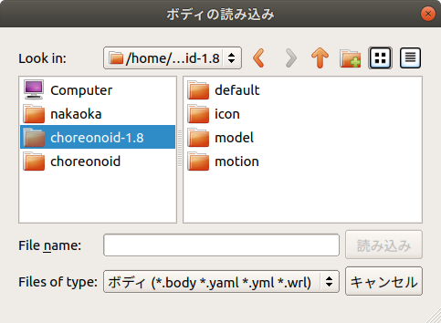

Body Model
==========

.. contents::
   :local:
   :depth: 1

Body Model and Body Item
------------------------

In order to perform various calculations related to robots on a computer, a model is required that digitizes the shape, physical properties, etc. of robots and environmental objects. In Choreonoid, this model is called a "Body Model". This actually corresponds to the "Body" class defined as a C++ class in the "Body Library" used by Choreonoid.

As a project item for accessing this body model from the Choreonoid GUI, the "Body Item" type is defined, and many of the robot-related operations performed on Choreonoid are done through this item.

Body items are usually generated by loading a :doc:`modelfile/index` that describes the model of a robot or environmental object.

.. _bodymodel_samplemodels:

Sample Models
--------------

Choreonoid comes with the following sample models as standard, which are stored under the "model" directory in the share directory. (For the location of the share directory, see :doc:`../install/directories`.) It is recommended to first load these models to understand how to work with models.

.. tabularcolumns:: |p{2.0cm}|p{3.5cm}|p{9.0cm}|

.. list-table::
 :widths: 15,25,60
 :header-rows: 1

 * - Model
   - File
   - Description
 * - box1
   - misc/box1.body
   - Sample of a box-shaped object
 * - floor
   - misc/floor.body
   - Simple floor model
 * - SR1
   - SR1/SR1.body
   - Sample of a simple biped robot model
 * - GR001
   - GR001/GR001.body
   - Model of HPI's small biped robot "GR001"
 * - PA10
   - PA10/PA10.body
   - Model of Mitsubishi Heavy Industries' manipulator "PA10"
 * - Tank
   - tank/tank.body
   - Sample of a tank-type model

.. _loading_model:

Loading a Body Model
----------------------

To load a file describing a body model, use the main menu "File" - "Load" - "Body". When you execute this menu, the following file loading dialog will be displayed.

In this dialog, select the model file you want to load. When doing so, you can navigate to related directories from the "Sidebar" on the left side of the dialog, so please use this as needed.

Let's try loading the "PA10" model, which is one of the sample models. In this case, it's good to first select the share directory from the sidebar. In the figure above, "choreonoid-1.8" in the sidebar corresponds to the share directory, so select this first. The contents of the share directory will then be displayed in the right area, so select "model" from here. Among the directories displayed there, select "PA10", and you should find a file called "PA10.body". Double-click this or select it and press the "Load" button.

When the file is loaded successfully, the model name will be displayed in the item tree view as follows.

.. image:: images/pa10item_checked.png

At this time, the following message will be output to the message view: ::

 Loading Body "/home/nakaoka/choreonoid/build/share/choreonoid-2.3/model/PA10/PA10.body"
 -> ok!

If there is a problem with the model file, an error message will be output instead, so please check the contents of the file.

The loaded body model is called a "Body Item" in the item tree view.

.. note:: When you select a body item in the item tree view and press Ctrl + R, the model file will be reloaded. This operation immediately reflects the reloaded model in the GUI, making it convenient when editing model files.

Display in Scene View
----------------------

Models loaded as body items are displayed as 3D graphics in the scene view.

.. image:: images/pa10scene.png

Users can toggle whether to display or not. If you uncheck the body item as shown in the following figure

.. image:: images/pa10item.png

the model will disappear from the scene view.

By checking it again, the display in the scene view will return to normal, so please toggle display/hide as needed.

.. _model_structure:

Model Structure
------------

In robotics, individual parts (rigid bodies) that constitute a model are generally called "links". Models can consist of either a single link or multiple links (multi-link model).

For models that can be considered as a single rigid body, there is usually one link. For example, the box-shaped sample model "box1" is such a model.

Robots are usually multi-link models. In multi-link models, links are connected by "joints", and various poses can be achieved by moving the joints.

The structure of a model can be checked using the "Link/Device View". Since the Link/Device View displays information for the currently selected body item, first select the body item of the model whose structure you want to check in the item tree view. For example, when you select the PA10 body item, the Link/Device View should display as follows:

.. image:: images/linkview_pa10links.png

As shown here, the PA10 model consists of 10 links from "BASE" to "HAND_R". Furthermore, "J1" to "HAND_R" are links that also serve as joints. The "ID" displays the joint identification numbers, showing that there are 9 joints numbered from 0 to 8. While this display doesn't clearly show the joint connection relationships, you can check them by changing the combo box at the top of the Link/Device View from "Link List" to "Link Tree", which displays the following:

.. image:: images/linkview_pa10linktree.png

The parent-child relationships in this tree indicate that joints exist between parent and child. This display shows that the PA10 model has links connected in series from "BASE" to "J7", and the last "HAND_L" and "HAND_R" are both links connected to "J7". Also, a link that becomes the root of the tree, like "BASE" in this example, is called the "root link".

.. note:: The structure of multi-link models can basically be represented by a tree like this. However, if a model has a closed-loop structure, it cannot be represented by a tree alone. Please note that Choreonoid does not currently fully support models with closed-loop structures.

Body Item Properties
--------------------------

When a body item is selected, the property view displays a list of properties for the selected body item. For PA10, it should display as follows:

.. image:: images/pa10properties.png

Properties specific to body items include the following, which allow you to check the model overview and change editing methods.

.. tabularcolumns:: |p{3.5cm}|p{11.5cm}|

.. list-table::
 :widths: 25,75
 :header-rows: 1

 * - Property
   - Meaning
 * - Model name
   - The name of the model itself. While item names can be set arbitrarily to distinguish individual instances of a model, the model name is for identifying the type of model and is always the same for the same model.
 * - Num links
   - The number of links the model has.
 * - Num joints
   - The number of joints the model has.
 * - Num devices
   - The number of devices (various sensors, lights, etc.) the model has.
 * - Root link
   - The name of the root link.
 * - Base link
   - Indicates the link that serves as the base for pose modification operations.
 * - Mass
   - The total mass of the model.
 * - Center of mass
   - The position of the center of mass.
 * - Model type
   - Either Dynamic (moving) or Static (non-moving). Even if the root is fixed, it becomes "Dynamic" when joints can move.
 * - Root fixed
   - Indicates whether the root is fixed.
 * - Collision detection
   - Indicates whether to perform collision detection with other objects.
 * - Self-collision detection
   - Indicates whether to perform self-collision detection.
 * - Lock location
   - When True, the root position cannot be dragged in the scene view.
 * - Scene sensitive
   - When False, it does not respond to mouse operations in the scene view.
 * - Transparency
   - You can set the transparency.
 * - Visible link selection
   - When True, only the links selected in the "Link/Device View" will be displayed in the scene view.
 * - Multiplexing number
   - When the model is displayed as multiple duplicates, this indicates the number.
 * - Existence
   - Becomes False while the model is being treated as non-existent.
 * - File
   - The filename of the model file.

