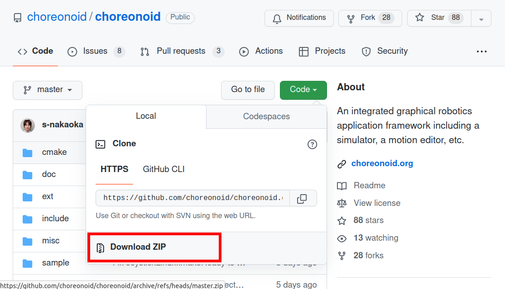

Building and Installing from Source Code (Windows)
==================================================

.. contents:: Table of Contents
   :local:

This document explains how to build Choreonoid from source code on Windows.

This document is written based on the latest information as of March 2024 and has been tested on Windows 11. Depending on your environment, some procedures described here may not work properly. If your environment is old or you want to use older versions of compilers or libraries, please also refer to the :doc:`previous documentation <build-windows-old>`.

Preparation
-----------

To build and install Choreonoid from source code, you need to prepare the necessary tools and libraries in advance.

* Required tools

  * Visual Studio (Visual C++) 2022 (2019 is also available)
    
  * `CMake <http://www.cmake.org/>`_ (3.28.3)

- Required libraries

  * `Qt <http://www.qt.io/download-open-source/>`_ (6.6.3 or 5.15.2)

.. note:: Support for Qt version 6 (Qt6), the latest major version of Qt, was added from commit fc6ea898 on June 27, 2024. Qt version 5 (Qt5) continues to be supported.

.. note:: Qt6 versions 6.7 and later currently seem to have a bug related to spin box display on Windows, so please use versions up to 6.6 for the time being.

.. note:: Previous versions depended on Boost C++ Libraries, but as of commit f40ea6fc on March 11, 2024, Boost C++ Libraries are no longer required. However, plugins distributed separately from Choreonoid itself may still require Boost C++ Libraries.

First, please install the above tools and libraries. The numbers in parentheses for each library are the versions tested in March 2024 and serve as a reference at that time. Except for libraries with specified minimum versions, older versions are not necessarily incompatible, and conversely, newer versions may also fail to build. (Please forgive this description as it is difficult to accurately specify compatible versions.)

Please install these tools and libraries according to the following instructions.

Note that administrator privileges may be required for installation. Execute with an account that has administrator privileges, and if User Account Control appears as shown below, click **Yes** to proceed.

.. figure:: images/userAccount.png

.. _install_visualc++:

Visual Studio (Visual C++)
~~~~~~~~~~~~~~~~~~~~~~~~~~~

As the C++ compiler for compiling Choreonoid, you can use Microsoft's Visual C++ (the C++ compiler included in Visual Studio).

Visual Studio has several editions, and you can download and use the `free Visual Studio Community <https://visualstudio.microsoft.com/vs/community/>`_. The current latest version is 2022, and we have confirmed that Choreonoid can be built and run using it. You can also build with Visual Studio 2019, which is one version older.

When you run the downloaded installer, a screen will appear to select items to install. Among these, make sure to check **"Desktop development with C++"**. After installation is complete, you will be asked to restart Windows, so please follow the instructions and restart.

CMake
~~~~~

This is a tool for describing build procedures. Choreonoid's build procedure is written in this tool's format, and on Windows, it is possible to generate Visual Studio project files from it.

CMake can be obtained from the `CMake download page <https://cmake.org/download/>`_. Installers for each platform (OS) are available, and for Windows, use **"Windows x64 Installer"**.

The download page allows you to install several versions, with the latest version at the top. If the latest version is marked as "Release Candidate", there may be one marked as "Latest Release" below it, which might be safer to use.

The file name will be **"cmake-version-number-windows-x86_64.msi"**, so click on it to download, and run it after downloading to install.

During installation, you will see a screen to select path-related options from the following:

* Do not add CMake to the system PATH
* Add CMake to the system PATH for all users
* Add CMake to the system PATH for the current user

If you select **"Add CMake to the system PATH for all users"** here, you will be able to use CMake from the command line terminal described later. This document uses this option, so please select it. If you want to limit the available users to the current user, select **"Add CMake to the system PATH for the current user"**.

Also, if you check **"Create CMake Desktop Icon"** on this settings screen, a CMake desktop icon will be created, allowing you to launch the CMake GUI from the desktop.

Qt
~~

Qt is a comprehensive framework library including GUI, and Choreonoid uses it as the base for its GUI.

The Qt installer can be obtained from the `Download Qt for open source use <https://www.qt.io/download-qt-installer-oss>`_ page. What you can get here is the open source version that can be used free of charge, and you should use this unless there is a specific reason not to. Download the installer executable from the "Qt Online Installer for Windows" link on this page. (The Qt site frequently changes its structure, so the above link may no longer be available. In that case, try to find the download page from `Qt for Open Source Development <http://www.qt.io/download-open-source/>`_ or similar.)

When you run the downloaded file, you will be asked to log in with a Qt account. You can create an account with **Sign up** or **Register**, so create an account and log in to proceed with the installation. Continue following the installer's instructions to proceed with the installation.

In the "Installation Folder" section, first specify the installation destination. By default, it will be a folder like "C:\\Qt". If you don't change this, CMake will automatically detect Qt. If you change it, you will need to manually specify the folder, so remember it.

.. note:: If Qt is already installed in the same directory, you may see a message saying "The selected directory already exists and contains installation content. Please select another target for installation." and cannot proceed. In this case, you can perform the installation again by launching an app called "Qt Maintenance Tool". However, if you installed with an old installer, this app may not exist, so in that case, please delete what has already been installed.

Here, "Custom Installation" is selected by default, so proceed to the next step.

In "Select Components", you select the Qt version and components to install.
Expanding the "Qt" tree will display several Qt versions that can be installed. As of June 2024, the following items were available:

* Qt 6.8.0-beta1
* Qt 6.7.2
* Qt 6.6.3
* Qt 6.5.3
* Developer and Designer Tools

As we have confirmed, Qt 6.7 and 6.8 have a `bug where spin box display becomes incorrect <https://forum.qt.io/topic/156001/style-mistake-in-win11-with-qt-6-7-mingw-11-2-official-online-release>`_ on Windows, so please use Qt 6.6.3 for now. You can install this version by checking Qt 6.6.3.

Further expanding the tree of the checked Qt version will display items like:

* WebAssembly (multi-threaded)
* WebAssembly (single-threaded)
* MSVC 2019 ARM64 (TP)
* LLVM-MinGW 17.0.6.64-bit
* MSVC 2019 64-bit
* MinGW 11.2.0 64-bit
* Android
* Sources
* Qt Quick 3D
* Qt 5 Compatibility Module
* Qt Shader Tools
* Additional Libraries
* Qt Debug Information Files
* Qt Quick Timeline

From these, make sure to check and select "MSVC 2019 64-bit". There doesn't seem to be an item directly corresponding to the latest Visual Studio 2022, but "MSVC 2019 64-bit" seems to work with Visual Studio 2022 as well, so there's no problem using this even when using Visual Studio 2022. Other items are not necessary for building Choreonoid, so uncheck them unless there's a specific reason.

The "Qt" tree also has an item called "Developer and Designer Tools", and expanding it further shows several tools checked by default. These are also unnecessary for building Choreonoid or may already be installed, so it's better to uncheck all of them unless there's a specific reason. CMake may be checked by default, but since we've installed CMake independently using the procedure above, it might be better not to include it in the Qt installation to avoid conflicts.

.. note:: If you want to use the older version 5 of Qt (Qt5) for some reason, check "Archive" on the right side of "Select Components" and press the "Filter" button. This will display older versions like "Qt 5.15.2" as "Qt" items, and you can install older versions by checking them.

Continue following the installer's instructions to complete the installation.

Obtaining Source Code
---------------------

Development Version
~~~~~~~~~~~~~~~~~~~

Choreonoid development is conducted on `github <https://github.com/>`_, and you can obtain the latest source code from the following repository:

- https://github.com/choreonoid/choreonoid

The source code is managed as a `Git <http://git-scm.com/>`_ repository.

There are two ways to obtain the source code from here:

* Obtain as a Git repository
* Obtain as a Zip file

.. _build-windows-use-git:

Obtaining as a Git Repository
^^^^^^^^^^^^^^^^^^^^^^^^^^^^^

A Git repository is a source code management method that includes the history of code modifications. This has various advantages, and even when just using Choreonoid, it has the advantage of making it easier to update to the latest source code.

Obtaining a Git repository is usually done using the git command. The Windows version of this command is packaged as Git for Windows.

To use this, download and run the installer file from "Download" on the `Git for Windows official site <https://gitforwindows.org/>`_ to install it. The settings during installation can basically be left at their defaults. If you check **"Additional icons"** and **"On the Desktop"** in the **"Select Components"** settings, you will be able to launch the Git terminal from a desktop icon, which may be convenient.

Git is basically used by executing git commands from a command line terminal. As a terminal, you can use Windows' standard "Command Prompt", or you can use the terminal installed by Git for Windows. For the former, launch it by searching from the Start menu. For the latter, it is installed with the name "Git Bash", so search for it from the Start menu or double-click the desktop icon created by the installer to launch it.

Once you can enter commands, enter the following command: ::

 git clone https://github.com/choreonoid/choreonoid.git

This will clone the repository managed on the web server to a directory on your PC. This not only allows you to access files such as source code on your PC, but also makes it easy to retrieve past versions and update to the latest version. The name of the cloned directory is "choreonoid" by default.

This operation creates a repository in the current directory of the command line terminal. In practice, decide on a directory to create the repository in advance and clone it there. For example, creating a directory "C:\\src" for storing source code and cloning into it might be clear and good. To do this from the command line: ::

 cd c:/
 mkdir src
 cd src
 git clone https://github.com/choreonoid/choreonoid.git

This will store Choreonoid's source code in the directory "C:\\src\\choreonoid".

.. note:: As a basic matter, "cd" is a command to move to a specified directory, and "mkdir" is a command to create a directory. The directory separator in Windows is usually the "\\" symbol (which may be "￥" in Japanese environments), but since the Git for Windows command line terminal (Git Bash) is Unix-derived, it uses "/" as the separator. Windows' standard "Command Prompt" can use either separator. Here we will use "/" consistently.

You only need to clone the repository once initially. After that, within that repository directory: ::

 git pull

will update to the latest source code at that time.

This completes obtaining the source code. For detailed usage of Git, please refer to Git manuals and explanatory articles.

This document also introduces methods to obtain source code without using Git, and we will call the directory containing the source code the **source directory**. In this document, we will proceed with the explanation using **"C:\\src\\choreonoid"** as the source directory.

.. note:: Recent versions of Git for Windows seem to allow Git operations from Windows' standard Explorer. Visual Studio also allows integrated Git-related operations within the IDE. For details, please refer to the Git for Windows and Visual Studio manuals.

.. _build-windows-use-github-zipfile:

Obtaining as a Zip File
^^^^^^^^^^^^^^^^^^^^^^^

It is also possible to obtain the latest source code without using Git.
Open the `Choreonoid repository <https://github.com/choreonoid/choreonoid/>`_ using a web browser, click the green "Code" button, and click "Download ZIP" in the menu that appears.

A download dialog will appear, and you can download a Zip file of the latest source code. The file name will be something like "choreonoid-master.zip" with the branch name added to the software name.

This method is simple for initial acquisition, but you need to download and extract the Zip file every time you update the source code. When using a Git repository, you can update with just the git pull command as mentioned above, so using a Git repository is recommended for continuous use.

Release Version
~~~~~~~~~~~~~~~

The source code for Choreonoid release versions can be downloaded from the `Downloads <http://choreonoid.org/en/downloads.html>`_ page. Download the appropriate version from the "Source Package" on this page. The file is in ZIP format, so extract it in an appropriate directory: ::

 unzip choreonoid-2.2.0.zip

After extraction, a directory like choreonoid-2.2.0 will be created. This directory is also the **"source directory"** containing the source code.

.. note:: For release versions, the procedures in this manual targeting the development version may differ. For example, versions 2.0.0 and earlier also require installation of Boost C++ Libraries. For installation methods for release versions, please refer to the `manuals for each release version <http://choreonoid.org/en/documents/index.html>`_.

Building Choreonoid
-------------------

Once you have the Choreonoid source code and the necessary tools and libraries ready, you can build to make Choreonoid executable.
There are two main ways to build:

* Build using command line (CUI)
* Build using GUI

Here we will first introduce the method of building using the command line. The GUI method will be introduced on a separate page.

.. _build-windows-command-line:

Building from Command Line
~~~~~~~~~~~~~~~~~~~~~~~~~~

You can build Choreonoid from the command line using CMake commands.

First, launch a command line terminal. If using Windows' standard "Command Prompt", search for it from the Start menu with keywords like "command" and run it. Alternatively, you can use the "Git Bash" terminal installed with Git for Windows. The latter is more feature-rich and allows Unix (Linux)-like command line operations.

Once the terminal is launched: ::

 cd source_directory

to move to the source directory. If the source directory is "c:\\src\\choreonoid": ::

 cd c:/src/choreonoid

(As mentioned in the note in :ref:`build-windows-use-git`, we will use "/" as the directory separator.)

Then enter the following command: ::

 cmake -B build -G "Visual Studio 17 2022" -A x64

This command generates files for building with Visual Studio 2022 under the "build" directory. If the necessary compilers and libraries are not properly installed, an error will occur.

The meaning of each option is as follows:

* "-B"

  * Specifies the "build directory" where build files will be generated.

* "-G"

  * Specifies the generator for build files. When using Visual Studio (Visual C++), specify the following strings for each version:

    * Visual Studio 2022: **"Visual Studio 17 2022"**
    * Visual Studio 2019: **"Visual Studio 16 2019"**

* "-A"

  * Specifies the platform of the program to build. Specifying "x64" makes it x64 (64-bit version of x86) architecture. Specifying "Win32" generates a 32-bit version. However, we are not currently testing the 32-bit version, so please build and use the 64-bit version unless there is a specific reason.

.. note:: The architecture specified with the "-A" option defaults to the same architecture as the host OS. Therefore, if you are building 64-bit Choreonoid binaries on 64-bit Windows, this option can be omitted. However, with Visual Studio 2019 and earlier, if you don't specify x64 for this option, the default installation destination (CMAKE_INSTALL_PREFIX) will be "C:\\Program Files (x86)" for 32-bit, even if the generated binaries are 64-bit. This behavior probably occurs when Visual Studio itself is a 32-bit version. To avoid this behavior, you need to specify "-A x64".

If the build file generation is successful, enter the following command to build: ::

 cmake --build build --config Release -- -m

The meaning of each option is as follows:

* "--build"

  * Option to execute the build. Specify the build directory as an argument.

* "--config"

  * Specifies the configuration. For Visual Studio, this corresponds to "Solution Configuration". Specifying "Release" here results in a release build, so normally specify this. You can also specify "Debug" here to generate debug binaries.

* "--"

  * Passes subsequent options to the native build tool. Here, options specified after this will be passed to the Visual C++ compiler.

* "-m"

  * An option passed to the Visual C++ compiler that enables parallel building. With this, builds will be faster on multi-core CPUs.

During the build, compile commands and messages from the compiler will be displayed on the terminal. If the build fails, error messages will be displayed, so check the messages to determine whether the build was successful.

If the build is successful, install the built files with the following command: ::

 cmake --install build --config Release --prefix c:/choreonoid

Running this command installs the build artifacts to "c:\\choreonoid".

The meaning of each option is as follows:

* "--install"

  * Option to execute installation. Specify the build directory as an argument.

* "--prefix"

  * Specifies the installation destination. The default is "C:\\Program Files\\choreonoid", but installation under "C:\\Program Files" requires administrator privileges, so it's good to specify a directory that is easy to install and access, like "c:/choreonoid" above.

.. note:: In cmake command options, both "\\" and "/" can be used as directory separators. Following what was mentioned in the note in :ref:`build-windows-use-git`, we will also use "/" in cmake commands.

If no errors are displayed during installation, the build and installation are complete.

The Choreonoid executable "choreonoid.exe" is stored in the bin directory of the installation destination, so you can launch Choreonoid by running this. For example, you can double-click "choreonoid.exe" from Explorer to launch it. From Windows' standard Command Prompt: ::

 c:\choreonoid\bin\choreonoid.exe

to launch it. (In this case, only "\\" can be used as the directory separator.) From the Git Bash terminal, use "/" as the directory separator: ::

 c:/choreonoid/bin/choreonoid.exe

In either case, the extension ".exe" can be omitted. If the installation destination is not "c:\\choreonoid", replace that part with the actual installation destination.

Building with GUI
~~~~~~~~~~~~~~~~~

For building with GUI, please refer to :doc:`build-windows-gui`.

.. _build-windows-options:

Building Optional Features
--------------------------

In addition to what is enabled by default in the above procedure, Choreonoid has several modules, plugins, samples, etc. These can be built by enabling them in CMake settings.
Here we describe building some of these optional features.
Please also refer to :doc:`options` which summarizes other options.

Basic Procedure for Enabling Options
~~~~~~~~~~~~~~~~~~~~~~~~~~~~~~~~~~~~

The procedure for enabling optional features is basically as follows:

1. Install necessary libraries
2. Enable the corresponding option in CMake build settings
3. Re-execute the Choreonoid build

For step 2, there are CMake variables corresponding to options, so set them to "ON".
To do this when building from the command line above, enter the CMake command as follows: ::

 cmake -B build -G "Visual Studio 17 2022" -DBUILD_POSE_SEQ_PLUGIN=ON

Here, the "-DBUILD_POSE_SEQ_PLUGIN=ON" part corresponds to enabling the option. "-D" is an option to set the following variable, and here we enable building this plugin by setting "BUILD_POSE_SEQ_PLUGIN" corresponding to the "PoseSeq plugin" to "ON".

Conversely, to disable an option, set the corresponding variable to "OFF". For example: ::

 cmake -B build -G "Visual Studio 17 2022" -DENABLE_SAMPLES=OFF

will configure not to build samples.

The same applies when using GUI for configuration. You can enable/disable by toggling the check for the corresponding variable in CMake GUI, then pressing the **Configure** and **Generate** buttons.

.. _build-assimp-plugin-windows:

Building PoseSeq Plugin and Balancer Plugin
~~~~~~~~~~~~~~~~~~~~~~~~~~~~~~~~~~~~~~~~~~~~

Choreonoid has a function for choreographing robot movements using key poses.
This function is treated as optional in the latest version, and you need to enable the corresponding plugins to use it.

Specifically, enable the "PoseSeq plugin" and "Balancer plugin" mentioned above. They correspond to CMake's **"BUILD_POSE_SEQ_PLUGIN"** and **"BUILD_BALANCER_PLUGIN"** variables respectively, so when configuring with CMake: ::

 cmake -B build -G "Visual Studio 17 2022" -DBUILD_POSE_SEQ_PLUGIN=ON -DBUILD_BALANCER_PLUGIN=ON

and then build and install to enable the choreography function.

Building Assimp Plugin
~~~~~~~~~~~~~~~~~~~~~~

This is a plugin that allows Choreonoid to use the `Open Asset Import Library (Assimp) <https://github.com/assimp/assimp>`_, a library for loading 3D model data in various formats.
To use this plugin, you need to build and install the Assimp library from source.

Some samples included with Choreonoid use COLLADA format (.dae) as model mesh files, and the Assimp plugin is also required to load such samples.

To use the Assimp plugin, you first need to install Assimp's development libraries and header files.
This method is explained on the `Build / Install Instructions <https://github.com/assimp/assimp/blob/master/Build.md>`_ page of the above repository, so please refer to it.
Here we briefly summarize the procedure.

Assimp is currently published as a Git repository on github, so you can obtain it like Choreonoid source code using :ref:`build-windows-use-git` or :ref:`build-windows-use-github-zipfile`. Below we explain the procedure for obtaining it as a Git repository.

Decide on a directory to create the Assimp repository, and there: ::

 git clone https://github.com/assimp/assimp.git

to obtain the Assimp Git repository. ::

 cd assimp

to enter this directory. In this state, the source code is the latest version of the master branch, but the latest version may not always work stably. Tags corresponding to each release version are set, so for stability, it might be better to specify those versions. As of February 2023, the latest release version is 5.2.5, so we'll use that here. In that case: ::

 git checkout v5.2.5

will switch the source code to this version.

When building from the command line, execute CMake commands similar to building Choreonoid: ::

 cmake -B build -G "Visual Studio 17 2022" -A x64
 cmake --build build --config Release -- -m
 cmake --install build --config Release --prefix c:/local/assimp

For cmake command options, please set them appropriately as explained in :ref:`build-windows-command-line`. If you also need debug binaries, also build and install with "--config Debug". (※ With Assimp 5.0.x, if you don't build and install the debug version as well, an error will occur when CMake detects Assimp for Choreonoid. There is no such problem with Assimp 5.1 and later.)

The last "--prefix c:/local/assimp" sets the installation destination to "c:\\local\\assimp". If you use this directory, Assimp will be automatically detected during Choreonoid's CMake configuration. The Boost library is also installed under "c:\\local" by default, so this matches that.

If you don't set the installation destination, it will be installed to the default "c:\\Program Files\\Assimp". However, in that case, administrator privileges are required, so launch the command line terminal with administrator privileges in advance. This default installation destination will also be automatically detected during Choreonoid's CMake configuration.

If you are building Choreonoid for the first time with Assimp installed using the above procedure, Assimp will be automatically detected and the Assimp plugin will be built with the normal Choreonoid build procedure. If Choreonoid has already been built, you need to rebuild Choreonoid itself. First, you need to explicitly enable Assimp as follows: ::

 cmake -B build -DENABLE_ASSIMP=ON

After making this setting, perform the CMake build and install operations again.

If Assimp is installed in a directory other than the above and is not automatically detected, also set the assimp_DIR variable in CMake as follows: ::

 cmake -B build -DENABLE_ASSIMP=ON -Dassimp_DIR=Assimp_CMake_file_directory

Here, "Assimp CMake file directory" is the "lib\\cmake\\assimp-x.x" directory under the Assimp installation destination. "x.x" is replaced with the Assimp version number.

.. _build-windows-freetype:

Enabling FreeType Library
~~~~~~~~~~~~~~~~~~~~~~~~~

Choreonoid has a function to draw text on the scene view. However, to use this, you need to enable the FreeType library. Currently, this function can be used with the distance measurement function.

To enable the FreeType library, you first need to make the FreeType library available. This is done with the following steps:

1. Obtain the library source code from the FreeType official site https://freetype.org
2. Extract the obtained source code to an appropriate directory and build/install using CMake
3. Set **ENABLE_FREE_TYPE** to **ON** in CMake settings when building Choreonoid

For step 1, go to the page linked from "Stable Releases" on the official site's "Download" page and obtain the source code archive there. As of March 2023, there are two download site links:

* https://savannah.nongnu.org/download/freetype/
* https://sourceforge.net/projects/freetype/files/

Since we couldn't download from the first site once, it might be safer to download from the second sourceforge site. In the case of sourceforge, it is further divided into hierarchies, and you can download from the "freetype" item by selecting the version number. As of March 2023, version 2.13.0 is the latest version, and we have confirmed operation with this version. There are several types of archive files, and when using on Windows, zip files are easy to handle. In this case, download an archive file like "ft2130.zip".

For step 2, the work is similar to the Assimp installation above.
Open a command line terminal and move to the directory where you extracted the archive. Execute the following commands there: ::

 cmake -B build -G "Visual Studio 17 2022" -A x64
 cmake --build build --config Release -- -m
 cmake --install build --config Release --prefix c:/local/freetype

FreeType is built as a static library by default, and when using it with Choreonoid, you should normally use the static library. FreeType can also be built as a dynamic link library (DLL) by setting "-DBUILD_SHARED_LIBS=true" as a CMake option, but using that may cause conflicts if additional Choreonoid plugins are using FreeType, so normally do not use the DLL version of the library.

The last "--prefix c:/local/freetype" sets the installation destination to "c:\\local\\freetype". If you use this directory, FreeType will be automatically detected during Choreonoid's CMake configuration. If you don't set the installation destination, it will be installed to the default "c:\\Program Files\\freetype". However, in that case, administrator privileges are required, so launch the command line terminal with administrator privileges in advance. This default installation destination will also be automatically detected during Choreonoid's CMake configuration. If installing to a directory other than the above, set the freetype_DIR variable in CMake when building Choreonoid to the directory up to "lib\\cmake\\freetype" under the FreeType installation destination. These configuration methods are all the same as for Assimp.

With FreeType installed, you can build and install Choreonoid with FreeType enabled by setting **ENABLE_FREE_TYPE** to **ON** in Choreonoid's CMake configuration and building.

As a sample of text display, there is a file called "text.scen" under "share\\model\\misc". Launch Choreonoid and load this file from "File" - "Load" - "Scene" and check it. If "Choreonoid" text is displayed on the scene view, FreeType has been successfully enabled.

Building Media Plugin
~~~~~~~~~~~~~~~~~~~~~

This is a plugin for playing media files. It can be built by turning ON **BUILD_MEDIA_PLUGIN** in CMake.

Some media file formats, such as MPEG-4 files, cannot be played by default. Such files can be played by installing codec packs that support the file format. You can find codec packs by searching online. However, some may affect other video software, so we won't go into details here. Please use one that suits your system.

Building ODE Plugin
~~~~~~~~~~~~~~~~~~~~

This is a plugin that enables the use of `Open Dynamics Engine (ODE) <http://www.ode.org/>`_, an open source physics calculation library, as a physics engine for Choreonoid's simulation function.

To build and use this plugin, you need to install the ODE library.
As of February 2023, you can download the latest source archive ode-0.16.3.tar.gz from the `download page in Bitbucket <https://bitbucket.org/odedevs/ode/downloads/>`_. The following explanation assumes this version.

This file is a tar.gz format archive, so first extract the file.
To extract on Windows, you need software for that purpose.
For example, you can use software called `7-Zip <https://sevenzip.osdn.jp/>`_, so use such software to extract the file.

ODE can also be built using CMake.
For example, execute the following commands in the ODE source directory: ::

 cmake -B build -G "Visual Studio 17 2022" -A x64
 cmake --build build --config Release -- -m
 cmake --install build --config Release --prefix c:/local/ode

This operation installs the built ODE library under "C:\\local\\ode".
The default installation destination is "C:\\Program Files\\ODE", and it's OK to install there.

Build Choreonoid in an environment where ODE is installed. In CMake settings: ::

 cmake -B build -DBUILD_ODE_PLUGIN=ON 

Set "BUILD_ODE_PLUGIN" to "ON" and then build.

If you have installed ODE in a directory other than the above directories, set that directory to CMake's ODE_DIR variable.

Building Python Plugin
~~~~~~~~~~~~~~~~~~~~~~

This is a plugin for loading and executing Python scripts and using the Python console that runs on Choreonoid.

To build and use this plugin, you need to install Python. If you haven't installed it yet, download **"Windows installer (64-bit)"** from the `Windows download page <https://www.python.org/downloads/windows/>`_ of the `Python official site <http://www.python.org/>`_ and install it. The latest Python version confirmed to work as of April 2021 is 3.11.1.

When you launch the installer, you will see the following screen:

.. figure:: images/Python3install1.png
   :width: 600px

Here, usually check **Add Python 3.x to PATH**. Then click **Install Now** to install.

To use the Python plugin, you also need `NumPy <https://numpy.org/>`_, a numerical calculation library for Python, so install that as well. This can be done by executing the following command from the command prompt after installing Python: ::

  python -m pip install numpy

In an environment where Python itself and NumPy are installed, you can build the Python plugin by setting **ENABLE_PYTHON** to **ON** in Choreonoid's CMake configuration. To be precise, this option enables Choreonoid's Python support features, and the Python plugin included in those features is also enabled.

Enabling Multiple Plugins
~~~~~~~~~~~~~~~~~~~~~~~~~

The above explanation introduced procedures for enabling each plugin individually. In CMake, when setting variables with the "-D" option, the contents are recorded in the build directory, so it's possible to write only the variables you want to change additionally.

On the other hand, since you can specify any number of "-D" options, it's also possible to enable multiple plugins simultaneously. If you know in advance which optional plugins you want to use, you can specify all of them and build them together.

For example, as the initial CMake configuration: ::

 cmake -B build -G "Visual Studio 17 2022" -A x64 -DBUILD_POSE_SEQ_PLUGIN=ON -DBUILD_BALANCER_PLUGIN=ON -DENABLE_ASSIMP=ON -DBUILD_MEDIA_PLUGIN=ON -DBUILD_ODE_PLUGIN=ON -DENABLE_PYTHON=ON

will enable and build all the plugins explained here at once.

Uninstalling Plugins
~~~~~~~~~~~~~~~~~~~~

Plugins installed with **BUILD_XXX_PLUGIN** options turned on will not be deleted even if you turn off the option and install again. If you want to delete a plugin, such as when operation becomes unstable after adding a plugin, manually delete the files. The XXX plugin is installed as **"CnoidXXXPlugin.dll"** in **"(Choreonoid installation destination)/lib/choreonoid-1.7"**.