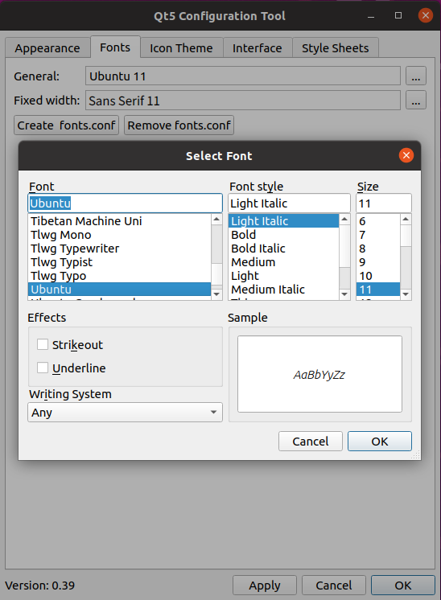
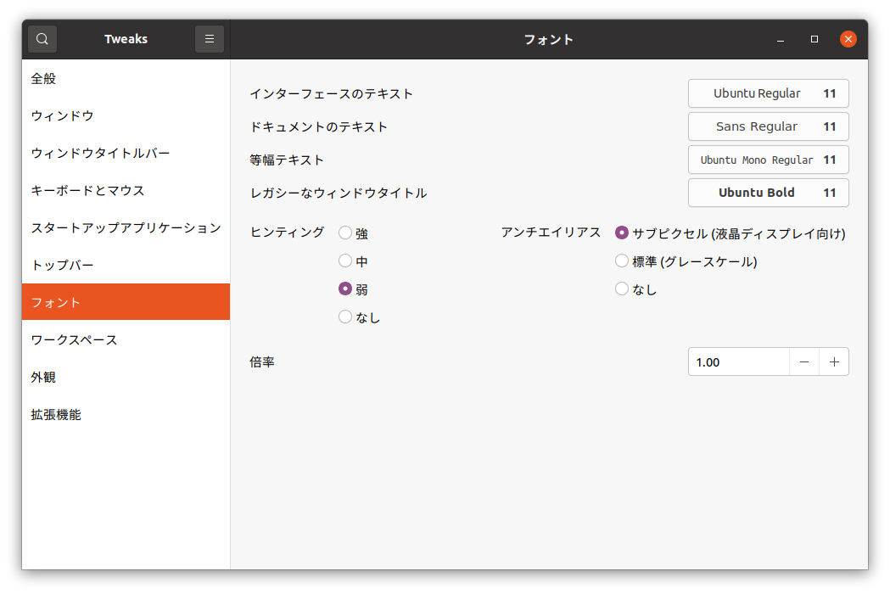

Qt-related Settings
==============

.. contents::
   :local:
   :depth: 2

.. highlight:: sh

.. _build_ubuntu_qt_style:

Overview
--------

Choreonoid uses a framework called Qt (pronounced "cute") for GUI implementation. Qt is a framework that supports multiple platforms including Windows and Linux, and has a high level of completeness. Choreonoid uses this framework to efficiently implement a high-functionality GUI with multi-platform support.

However, since Qt supports multiple platforms, it uses its own implementation for GUI rendering in some areas. For this reason, there may be cases where fonts and drawing styles used in the GUI cannot be configured using the OS's standard configuration features. This section explains Qt-specific configuration methods that can be used in such cases. If the default fonts and appearance of the GUI are not problematic, this is fine, but if you want to change the settings, please try these methods.

Font Configuration
------------------

For comfortable use of GUI applications like Choreonoid, it is desirable that the font type and style are appropriate and do not feel awkward. Normally, the OS has standard fonts configured, and applications use them as well. If there are problems, the settings can be changed using OS-standard methods. However, in applications built with Qt, fonts may be configured using methods different from the OS standard.

According to our investigation, when using Windows or when using Qt version 6 (Qt6) on Ubuntu Linux, the OS standard fonts appear to be used. On the other hand, when using Qt version 5 (Qt5) on Ubuntu Linux 20.04 and later, fonts specifically configured for Qt appear to be used. (For Ubuntu 20.04, it seems that OS standard fonts were used at the initial release, but the specification appears to have changed with updates from 2021 onwards.)

When OS standard fonts are used, there should be no particular problems. If there are problems, please change the OS font settings. On the other hand, when fonts specifically configured for Qt are used, they may be displayed with different types or sizes from the OS standard ones, which may cause awkwardness or poor usability. In such cases, please adjust the fonts using the Qt-specific methods introduced below.

Font Size Adjustment Using the QT_FONT_DPI Environment Variable
~~~~~~~~~~~~~~~~~~~~~~~~~~~~~~~~~~~~~~~~~~~~~~~~~~~~~~~~~~~~~~~

When adjusting font size, you can use an environment variable called QT_FONT_DPI. Normally, this variable is set to the DPI value of the display, but by appropriately changing this value, you can adjust the actual size when displayed on the screen. This method is available for both Qt5 and Qt6.

For example, when starting Choreonoid, enter the following: ::

 QT_FONT_DPI=96 choreonoid

This adjusts the actual font size so that it is displayed at Qt standard size for a display with 96 DPI. If the font is too small with this value, increase the DPI value setting. For example, the following should make the font display slightly larger than before: ::

 QT_FONT_DPI=120 choreonoid

This value can be set freely, so please adjust it to achieve a readable font size.

Once you find an appropriate value, executing: ::

 export QT_FONT_DPI=120

will eliminate the need to include this description every time you start choreonoid thereafter. However, in this case, it will also affect other applications that use Qt, so please be careful. If this is not a problem, you may want to write it in .profile or similar.

Font Configuration Using qt5ct
~~~~~~~~~~~~~~~~~~~~~~~~~

When using Qt5 on Ubuntu Linux 20.04 and later, a tool called qt5ct is provided for Qt configuration, and you can use this to configure fonts. In this case, you can change not only the font size but also the font type.

To use this tool, first install the qt5ct package: ::

 sudo apt install qt5ct

Then, set the environment variable "QT_QPA_PLATFORMTHEME" to "qt5ct": ::

 export QT_QPA_PLATFORMTHEME=qt5ct

If you plan to use this tool regularly, you should write the above command in .profile or similar.

Once installation and configuration are complete, you can start the configuration tool with the following command: ::

 qt5ct

This tool appears to be registered in the desktop environment's application menu under a name like "Qt5 Settings", so you can also start it from that menu.

The qt5ct window has tabs at the top, and you can configure various items for each tab. By selecting the "Fonts" tab, you can configure fonts as shown in the screen below.

After changing settings, press "Apply" or "OK" at the bottom of the qt5ct window to apply the settings immediately.

Note that qt5ct settings can be used in combination with the QT_FONT_DPI setting mentioned above. Depending on the display being used, basically setting the QT_FONT_DPI value to 96 should result in the size configured in qt5ct.

.. note:: Even in environments like Ubuntu 18.04 where OS standard fonts are used by default, it is possible to introduce qt5ct. In that case, the settings will switch to those controlled by qt5ct.

Supplement: OS Standard Font Configuration in Ubuntu
~~~~~~~~~~~~~~~~~~~~~~~~~~~~~~~~~~~~~~~~~~~~~~~~~~~~~

In environments where OS standard fonts are also used in Qt applications, changing the OS standard font settings (without using QT_FONT_DPI or qt5ct) will be reflected in Choreonoid as well. However, in Ubuntu, OS standard font settings are not included in the normal settings panel, making it unclear where to configure them. This can be configured from an optional tool called "gnome-tweaks", so the following introduces how to use it.

gnome-tweaks can be installed with: ::

 sudo apt install gnome-tweaks

After installation, it can be started with the following command: ::

 gnome-tweaks

This tool includes "Fonts" in its configuration items. The screen is shown below.

This allows you to configure OS standard font settings.

.. Button and other GUI component appearance can be customized using the "style" feature. In Ubuntu's default state, this Qt style is configured to match the appearance of "GTK+", which is Linux's standard GUI library. GTK+ itself also has features for customizing appearance, but Qt's GTK+ style dynamically reflects the appearance customized in GTK+.

.. This is an excellent feature in terms of appearance unification, but dynamically reflecting GTK+'s dynamic style settings in Qt seems to come with a cost, and in this default state, Qt GUI component rendering becomes very slow. While this is not much of a problem for normal applications, Choreonoid has GUI features for displaying and changing robot joint angles, and when linking these with robot movements, smooth rendering of many GUI components is required. However, when Qt's style is GTK+ style, rendering becomes less smooth in such cases.

.. To solve this, we recommend changing Qt's style to a non-GTK+ style.

Appearance Configuration
------------------------

Qt also has functionality for configuring GUI appearance, which can be utilized in Choreonoid as well. Normally there is no need to change from the default appearance, but since this functionality is one of the advantages of using Qt, we will introduce it.

About Styles
~~~~~~~~~~~~

The central concept in appearance configuration is "style". This corresponds to the drawing program for GUI components, and the basic appearance is first determined by this style. Usually several types of styles are available, so you first select the desired one from among them. On top of that, it is possible to change colors, fonts, icons, etc. as additional configuration items.

In Windows, the following styles are available by default:

* windowsvista
* Windows
* Fusion

By default, windowsvista is used. This provides an appearance similar to current Windows GUI.

In Ubuntu, the following styles are available when Qt is installed:

* Windows
* Fusion

Here, Fusion is used by default. This is Qt's proprietary style.

When using Qt5 in Ubuntu, by installing the qt5-style-plugins package, the following styles also become available:

* cleanlooks
* gtk2
* cde
* motif
* plastique

The actually available styles can be confirmed with Choreonoid's "--list-qt-styles" option. Execute Choreonoid as follows: ::

 choreonoid --list-qt-styles

Instead of starting the Choreonoid window, a list of available styles will be output to the console.

Changing Styles
~~~~~~~~~~~~~~~

Style changes can be made using the command line option "-style" when starting Choreonoid or the environment variable "QT_STYLE_OVERRIDE". When using the command line option, start Choreonoid as follows, for example: ::

 choreonoid -style style_name

Incidentally, writing "--style style_name" or "-style=style_name" also appears to be valid.

When using environment variables, for example in Linux, by setting: ::

 export QT_STYLE_OVERRIDE=style_name

in advance, the configured style will be effective for all subsequent Choreonoid startups.

Note that in environments where the above qt5ct is available, style changes can also be made from qt5ct's "Appearance" tab.
In qt5ct, you can configure various appearance elements beyond basic style settings, allowing you to approach your desired appearance.

High DPI Display Support
-------------------------

Qt applications can apply scaling to the GUI to support high DPI displays. This section introduces this functionality.

What are High DPI Displays
~~~~~~~~~~~~~~~~~~~~~~~~~~~

High DPI displays refer to displays with pixel density significantly finer than conventional standard displays. Pixel density is generally expressed as the number of dots present in one inch width, which is called DPI (Dots per inch).

For example, if a notebook PC is equipped with a 4K resolution display, it would likely qualify as high DPI. Even with the same 4K display, when using a large desktop version, it might not qualify as high DPI.

The problem occurs when applications developed assuming conventional standard resolutions are displayed and used on high DPI displays. Conventionally, 96 DPI was considered standard in Windows. On the other hand, for a 4K display of about 14 inches, the DPI becomes around 300. In this case, the DPI is too fine compared to expectations, causing application text, icons, images, etc. to be displayed very small, making them difficult to see and operate.

To address this, it becomes necessary to enlarge text, icons, and images according to the DPI increase. Conventional OSes and applications were not designed to handle this, but recent OSes and applications are becoming capable of this. In other words, by scaling (enlarging/reducing) the drawing content according to pixel density, the size when actually displayed on the display can be made appropriate.

Qt's High DPI Display Support Functionality
~~~~~~~~~~~~~~~~~~~~~~~~~~~~~~~~~~~~~~~~~~~~

Qt also gained scaling functionality for high DPI display support starting from version 5.6. The explanation is available here:

* `High DIP Displays <https://doc.qt.io/qt-5/highdpi.html>`_ 

With this functionality, even applications implemented assuming standard resolution can automatically have their display size enlarged by Qt in high DPI display environments, enabling display and operation similar to when used at standard resolution.

If display and operation work as expected, this is fine, but if display or operation does not work as intended, you can control this functionality with the following environment variables:

* QT_AUTO_SCREEN_SCALE_FACTOR
* QT_SCALE_FACTOR
* QT_SCREEN_SCALE_FACTORS

These variables may be set automatically depending on the OS, but you can also manually override them to change the behavior. Basically, QT_SCALE_FACTOR contains the display magnification ratio, which is normally 1, but becomes 2 for high DPI displays. In the latter case, the application display is enlarged to twice the original size. If this becomes problematic, you can disable this functionality by setting QT_SCALE_FACTOR to 1.

For details about each variable, please refer to the above page.