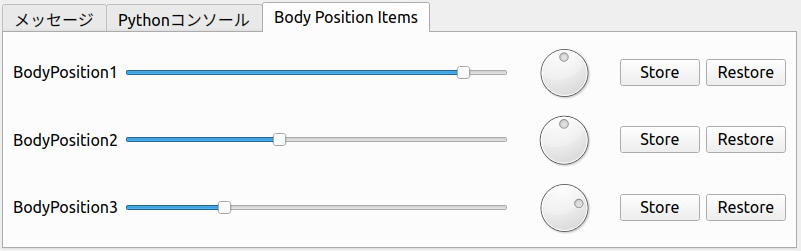
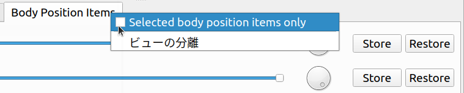

==========================
Custom View Sample (S11)
==========================

.. contents:: Table of Contents
   :local:

Overview
--------

In this section, we present a sample of :doc:`create-view` that adds a custom view for manipulating BodyPosition items to :doc:`item-creation-io-customization-sample`.

Source Code
-----------

.. highlight:: cpp

The source code for this sample consists of the following files:

* DevGuidePlugin.cpp

* BodyPositionItem.h

* BodyPositionItem.cpp

* BodyPositionItemRegistration.cpp

* BodyPositionItemView.h

* BodyPositionItemView.cpp

The first four are the same configuration as :doc:`item-creation-io-customization-sample`.
The last two are source files added in this sample, containing the source code for the custom view.
Below we show the changes to existing files and the contents of the added files.

BodyPositionItem.h
~~~~~~~~~~~~~~~~~~

In the BodyPositionItem definition, we've added three member functions. Everything else is the same as the previous sample. The added parts are highlighted below.

.. code-block:: cpp
 :emphasize-lines: 36,37,47,48,49

 #ifndef DEVGUIDE_PLUGIN_BODY_POSITION_ITEM_H
 #define DEVGUIDE_PLUGIN_BODY_POSITION_ITEM_H
 
 #include <cnoid/Item>
 #include <cnoid/RenderableItem>
 #include <cnoid/BodyItem>
 #include <cnoid/SceneGraph>
 #include <cnoid/SceneDrawables>
 #include <cnoid/Selection>
 
 class BodyPositionItem : public cnoid::Item, public cnoid::RenderableItem
 {
 public:
     static void initializeClass(cnoid::ExtensionManager* ext);

     BodyPositionItem();
     BodyPositionItem(const BodyPositionItem& org);
     void setPosition(const cnoid::Isometry3& T);
     const cnoid::Isometry3& position() const { return position_; }
     void storeBodyPosition();
     void restoreBodyPosition();
     virtual cnoid::SgNode* getScene() override;
     bool setFlagHeight(double height);
     double flagHeight() const { return flagHeight_; }
     enum ColorId { Red, Green, Blue };
     bool setFlagColor(int colorId);
     double flagColor() const { return flagColorSelection.which(); }
 
     enum LengthUnit { Meter, Millimeter };
     enum AngleUnit { Degree, Radian };
     bool loadBodyPosition(
         const std::string& filename, LengthUnit lengthUnit, AngleUnit anguleUnit, std::ostream& os);
     bool saveBodyPosition(
         const std::string& filename, LengthUnit lengthUnit, AngleUnit anguleUnit, std::ostream& os);
 
     // Added
     static cnoid::SignalProxy<void()> sigItemsInProjectChanged();
 
 protected:
     virtual Item* doDuplicate() const override;
     virtual void onTreePathChanged() override;
     virtual void doPutProperties(cnoid::PutPropertyFunction& putProperty) override;
     virtual void notifyUpdate() override;
     virtual bool store(cnoid::Archive& archive) override;
     virtual bool restore(const cnoid::Archive& archive) override;

     // Added
     virtual void onConnectedToRoot() override;
     virtual void onDisconnectedFromRoot() override;
     
 private:
     void createFlag();
     void updateFlagPosition();
     void updateFlagMaterial();
 
     cnoid::BodyItem* bodyItem;
     cnoid::Isometry3 position_;
     cnoid::SgPosTransformPtr flag;
     double flagHeight_;
     cnoid::Selection flagColorSelection;
     cnoid::SgMaterialPtr flagMaterial;
 };
 
 typedef cnoid::ref_ptr<BodyPositionItem> BodyPositionItemPtr;
 
 #endif // DEVGUIDE_PLUGIN_BODY_POSITION_ITEM_H

BodyPositionItem.cpp
~~~~~~~~~~~~~~~~~~~~

In BodyPositionItem.cpp, we add the following code at the end of the file to implement the added signal.
Everything else is the same as the previous sample.

.. code-block:: cpp

 namespace {
 
 Signal<void()> sigItemsInProjectChanged_;
 
 }
 
 SignalProxy<void()> BodyPositionItem::sigItemsInProjectChanged()
 {
     return sigItemsInProjectChanged_;
 }
 
 void BodyPositionItem::onConnectedToRoot()
 {
     sigItemsInProjectChanged_();
 }
 
 void BodyPositionItem::onDisconnectedFromRoot()
 {
     sigItemsInProjectChanged_();
 }

BodyPositionItemRegistration.cpp
~~~~~~~~~~~~~~~~~~~~~~~~~~~~~~~~

This file has the same content as the previous sample.

BodyPositionItemView.h
~~~~~~~~~~~~~~~~~~~~~~

Header file for the BodyPositionItemView class, which is the custom view: ::

 #ifndef DEVGUIDE_PLUGIN_BODY_POSITION_ITEM_VIEW_H
 #define DEVGUIDE_PLUGIN_BODY_POSITION_ITEM_VIEW_H
 
 #include "BodyPositionItem.h"
 #include <cnoid/View>
 #include <cnoid/ConnectionSet>
 #include <cnoid/Slider>
 #include <cnoid/Dial>
 #include <cnoid/Buttons>
 #include <QLabel>
 #include <QGridLayout>
 #include <vector>
 #include <memory>
 
 class BodyPositionItemView : public cnoid::View
 {
 public:
     BodyPositionItemView();
 
 protected:
     virtual void onActivated() override;
     virtual void onDeactivated() override;
     virtual void onAttachedMenuRequest(cnoid::MenuManager& menuManager) override;
     virtual bool storeState(cnoid::Archive& archive) override;
     virtual bool restoreState(const cnoid::Archive& archive) override;
 
 private:
     enum TargetMode { All, Selected };
     void setTargetMode(TargetMode mode);
     void updateTargetItems();
     void updateInterface(int index);
     void onHeightSliderValueChanged(int index, int value);
     void onOrientationDialValueChanged(int index, int value);
     void onStoreButtonClicked(int index);
     void onRestoreButtonClicked(int index);
     
     TargetMode targetMode;
     cnoid::Connection connectionForTargetDetection;
     cnoid::ScopedConnectionSet itemConnections;
 
     struct InterfaceUnit
     {
         BodyPositionItemPtr item;
         QLabel* nameLabel;
         cnoid::Slider* heightSlider;
         cnoid::Dial* orientationDial;
         cnoid::PushButton* storeButton;
         cnoid::PushButton* restoreButton;
         cnoid::ConnectionSet connections;
 
         ~InterfaceUnit();
     };

     std::vector<std::unique_ptr<InterfaceUnit>> interfaceUnits;

     QGridLayout* grid;
 };
 
 #endif // DEVGUIDE_PLUGIN_BODY_POSITION_ITEM_VIEW_H

BodyPositionItemView.cpp
~~~~~~~~~~~~~~~~~~~~~~~~

Implementation file for the BodyPositionItemView class, which is the custom view: ::

 #include "BodyPositionItemView.h"
 #include <cnoid/RootItem>
 #include <cnoid/ItemList>
 #include <cnoid/EigenUtil>
 #include <cnoid/MenuManager>
 #include <cnoid/Archive>
 
 using namespace std;
 using namespace cnoid;
 
 BodyPositionItemView::BodyPositionItemView()
 {
     setDefaultLayoutArea(BottomCenterArea);
 
     grid = new QGridLayout;
     setLayout(grid, 1.0);
 
     targetMode = All;
 }
 
 void BodyPositionItemView::onActivated()
 {
     setTargetMode(targetMode);
 }
 
 void BodyPositionItemView::setTargetMode(TargetMode mode)
 {
     if(mode != targetMode || !connectionForTargetDetection.connected()){
         targetMode = mode;
         if(isActive()){
             if(mode == All){
                 connectionForTargetDetection =
                     BodyPositionItem::sigItemsInProjectChanged().connect(
                         [this](){ updateTargetItems(); });
             } else if(mode == Selected){
                 connectionForTargetDetection =
                     RootItem::instance()->sigSelectedItemsChanged().connect(
                         [this](const ItemList<>&){ updateTargetItems(); });
             }
             updateTargetItems();
         }
     }
 }
 
 void BodyPositionItemView::onDeactivated()
 {
     connectionForTargetDetection.disconnect();
 }
 
 void BodyPositionItemView::updateTargetItems()
 {
     ItemList<BodyPositionItem> items;
     if(targetMode == All){
         items = RootItem::instance()->descendantItems<BodyPositionItem>();
     } else if(targetMode == Selected){
         items = RootItem::instance()->selectedItems<BodyPositionItem>();
     }
 
     size_t prevSize = interfaceUnits.size();
     interfaceUnits.resize(items.size());
 
     for(size_t i = prevSize; i < interfaceUnits.size(); ++i){
         auto& unit = interfaceUnits[i];
         unit.reset(new InterfaceUnit);
 
         unit->nameLabel = new QLabel(this);
         
         unit->heightSlider = new Slider(Qt::Horizontal, this);
         unit->heightSlider->setRange(1, 3000);
         unit->connections.add(
             unit->heightSlider->sigValueChanged().connect(
                 [=](int value){ onHeightSliderValueChanged(i, value); }));
 
         unit->orientationDial = new Dial(this);
         unit->orientationDial->setRange(-180, 180);
         unit->connections.add(
             unit->orientationDial->sigValueChanged().connect(
                 [=](int value){ onOrientationDialValueChanged(i, value); }));
  
         unit->storeButton = new PushButton("Store", this);
         unit->storeButton->sigClicked().connect(
             [=](){ onStoreButtonClicked(i); });
         
         unit->restoreButton = new PushButton("Restore", this);
         unit->restoreButton->sigClicked().connect(
             [=](){ onRestoreButtonClicked(i); });
 
         grid->addWidget(unit->nameLabel, i, 0);
         grid->addWidget(unit->heightSlider, i, 1);
         grid->addWidget(unit->orientationDial, i, 2);
         grid->addWidget(unit->storeButton, i, 3);
         grid->addWidget(unit->restoreButton, i, 4);
     }
 
     itemConnections.disconnect();
     for(size_t i =0; i < items.size(); ++i){
         auto& item = items[i];
         auto& unit = interfaceUnits[i];
         unit->item = item;
         unit->nameLabel->setText(item->name().c_str());
         itemConnections.add(
             item->sigUpdated().connect(
                 [=](){ updateInterface(i); }));
         updateInterface(i);
     }
 }
 
 void BodyPositionItemView::updateInterface(int index)
 {
     auto& unit = interfaceUnits[index];
     auto& item = unit->item;
     unit->connections.block();
     unit->heightSlider->setValue(item->flagHeight() * 1000);
     auto rpy = rpyFromRot(item->position().linear());
     unit->orientationDial->setValue(degree(rpy.z()));
     unit->connections.unblock();
 }
 
 void BodyPositionItemView::onHeightSliderValueChanged(int index, int value)
 {
     interfaceUnits[index]->item->setFlagHeight(value / 1000.0);
 }
 
 void BodyPositionItemView::onOrientationDialValueChanged(int index, int value)
 {
     auto item = interfaceUnits[index]->item;
     auto T = item->position();
     auto rpy = rpyFromRot(T.linear());
     rpy.z() = radian(value);
     T.linear() = rotFromRpy(rpy);
     item->setPosition(T);
 }
 
 void BodyPositionItemView::onStoreButtonClicked(int index)
 {
     interfaceUnits[index]->item->storeBodyPosition();
 }
 
 void BodyPositionItemView::onRestoreButtonClicked(int index)
 {
     interfaceUnits[index]->item->restoreBodyPosition();
 }
 
 void BodyPositionItemView::onAttachedMenuRequest(cnoid::MenuManager& menuManager)
 {
     auto modeCheck = menuManager.addCheckItem("Selected body position items only");
     modeCheck->setChecked(targetMode == Selected);
     modeCheck->sigToggled().connect(
         [this](bool on){ setTargetMode(on ? Selected : All); });
     menuManager.addSeparator();
 }
 
 bool BodyPositionItemView::storeState(cnoid::Archive& archive)
 {
     archive.write("target_mode", (targetMode == All) ? "all" : "selected");
     return true;
 }
 
 bool BodyPositionItemView::restoreState(const cnoid::Archive& archive)
 {
     string mode;
     if(archive.read("target_mode", mode)){
         if(mode == "all"){
             setTargetMode(All);
         } else if(mode == "selected"){
             setTargetMode(Selected);
         }
     }
     return true;
 }
 
 BodyPositionItemView::InterfaceUnit::~InterfaceUnit()
 {
     delete nameLabel;
     delete heightSlider;
     delete orientationDial;
     delete storeButton;
     delete restoreButton;
 }

DevGuidePlugin.cpp
~~~~~~~~~~~~~~~~~~

This file is almost the same as previous samples, but we've added code for registering the custom view BodyPositionItemView.
The added parts are highlighted below.

.. code-block:: cpp
 :emphasize-lines: 3,4,11,12,29,30,31

 #include "BodyPositionItem.h"

 // Added
 #include "BodyPositionItemView.h"

 #include <cnoid/Plugin>
 #include <cnoid/ToolBar>
 #include <cnoid/RootItem>
 #include <cnoid/ItemList>
 
 // Added
 #include <cnoid/ViewManager>

 using namespace cnoid;
 
 class DevGuidePlugin : public Plugin
 {
 public:
     DevGuidePlugin()
         : Plugin("DevGuide")
     {
         require("Body");
     }
         
     virtual bool initialize() override
     {
         BodyPositionItem::initializeClass(this);

         // Added
         viewManager().registerClass<BodyPositionItemView>(
             "BodyPositionItemView", "Body Position Items");
         
         auto toolBar = new ToolBar("BodyPositionBar");
         toolBar->addButton("Store Body Positions")->sigClicked().connect(
             [this](){ storeBodyPositions(); });
         toolBar->addButton("Restore Body Positions")->sigClicked().connect(
             [this](){ restoreBodyPositions(); });
         toolBar->setVisibleByDefault();
         addToolBar(toolBar);
 
         return true;
     }
             
     void storeBodyPositions()
     {
         for(auto& item : RootItem::instance()->selectedItems<BodyPositionItem>()){
             item->storeBodyPosition();
         }
     }
     
     void restoreBodyPositions()
     {
         for(auto& item : RootItem::instance()->selectedItems<BodyPositionItem>()){
             item->restoreBodyPosition();
         }
     }
 };
 
 CNOID_IMPLEMENT_PLUGIN_ENTRY(DevGuidePlugin)

CMakeLists.txt
~~~~~~~~~~~~~~

For CMakeLists.txt, we just need to add BodyPositionItemView.cpp as a file to build to what we created in :doc:`item-creation-io-customization-sample`. For example, when building in the Choreonoid build environment: ::

 set(sources
   DevGuidePlugin.cpp
   BodyPositionItem.cpp
   BodyPositionItemCusomization.cpp
   BodyPositionItemView.cpp)

 choreonoid_add_plugin(CnoidDevGuidePlugin ${sources})
 target_link_libraries(CnoidDevGuidePlugin PUBLIC CnoidBodyPlugin)

Since the number of files to set in sources has increased, we've added line breaks for each file here.

Using the BodyPositionItem View
-------------------------------

When you introduce this sample, a view called "BodyPositionItem View" becomes available.
After starting Choreonoid, you can display it by checking "Body Position Items" from the main menu "View" - "Show View". It is usually displayed in the bottom center area of the main window where the message view is displayed.

Let's try this with the PA10Pickup sample as before.
Load the project and assume that several BodyPosition items have been introduced.
When you display the BodyPositionItem view in this situation, you should see something like the following in that area:

Here, three BodyPosition items have been introduced to the project, and interfaces corresponding to each are arranged horizontally with item name labels. The slider to the right of the item name corresponds to the flag height, and you can change the flag height of the corresponding item by operating this slider. The dial further to the right corresponds to the yaw axis orientation of the recorded pose, and you can also change the orientation of the corresponding item by operating the dial. These operations link the movement of sliders and dials with the flag display in the scene view, so please try them out.

Finally, there are two buttons for Store operation to record the current position of the model and Restore operation to recall the recorded position to the model. These have the same functions as the "BodyPosition Bar" toolbar introduced in :doc:`new-item-type-sample`, but differ in that they can be operated individually for each BodyPosition item.

Furthermore, this view has two modes for determining target BodyPosition items.
In the default mode, all BodyPosition items included in the project are targeted, as in the above example.
A mode that "targets only selected BodyPosition items" is also available.
To switch to this mode, use the view's "attached menu".
This is a menu that appears when you right-click on the view's tab area, and for BodyPositionItem view, the following menu is displayed:

When you check "Selected body position item only" here, only selected BodyPosition items become targets of this view. If no BodyPosition items are selected when you check this, the view display should become empty, but select an appropriate item and confirm that it becomes the operation target of the view.

Finally, let's save the project with the view displayed.
First, check whether "File" - "Project File Options" - "Layout" is checked in the main menu.
If this check is not present, make sure to check it.
This will record the display position of views when saving projects.

Save the project in this state and reload the saved project. The BodyPositionItem view should also be displayed in the same position as when saved. The target item mode will also be in the same state as when saved.

Source Code Explanation
-----------------------

Let's explain the source code of this sample file by file.
For parts that improve existing sources, we'll only explain the improved parts.

BodyPositionItem.h
~~~~~~~~~~~~~~~~~~

In the BodyPositionItem class, we've added a signal to notify changes in instances that currently exist in the project (= exist in the item tree) and implemented processing related to that signal. Using this signal, we implement the "target all BodyPosition items" mode in the BodyPositionItem view.

First: ::

 static cnoid::SignalProxy<void()> sigItemsInProjectChanged();

is the signal added this time. This is emitted when the existence of BodyPosition items in the project changes.
Since this is a static member function, it can be used independently of instances.

And we've added overrides of the following two functions that are virtual functions of the Item class: ::

 virtual void onConnectedToRoot() override;
 virtual void onDisconnectedFromRoot() override;

The meaning and processing content of these functions will be explained in the next implementation file section.

BodyPositionItem.cpp
~~~~~~~~~~~~~~~~~~~~

Let's explain the parts added to BodyPositionItem.cpp.

First, we define the entity of the above signal in the following part: ::

 namespace {
 
 Signal<void()> sigItemsInProjectChanged_;
 
 }

We've added an underscore at the end to avoid name conflicts with functions.
Also, by enclosing it in an anonymous namespace, we make it local to this implementation file. ::

 SignalProxy<void()> BodyPositionItem::sigItemsInProjectChanged()
 {
     return sigItemsInProjectChanged_;
 }

Implementing the member function that returns the signal as a Proxy. ::

 void BodyPositionItem::onConnectedToRoot()
 {
     sigItemsInProjectChanged_();
 }

Here we override the onConnectedToRoot function as one of the Item class virtual functions related to :ref:`plugin-dev-item-virtual-function-on-item-tree`. This is a function called when an item is connected to the root item, and at this time the item can be considered added to the project. We emit the signal at this timing to notify that an item has been added. ::

 void BodyPositionItem::onDisconnectedFromRoot()
 {
     sigItemsInProjectChanged_();
 }

This is also a :ref:`virtual function related to the item tree`, called when an item is disconnected from the root item. At this time, the item is removed from the project. We emit the signal at this timing to notify that an item has been removed.

.. note:: Even without using this signal, you can detect changes in items existing in the project using the sigItemAdded and sigItemRemoved signals of the RootItem class introduced in :ref:`plugin-dev-item-operations-signals`. However, those signals target all item types, so slot functions are called even for items other than BodyPosition items. In contrast, the signal we implemented this time only targets BodyPositionItems, so it can be processed more efficiently.

BodyPositionItemView.h
~~~~~~~~~~~~~~~~~~~~~~

For this file, we'll mainly explain the included headers and member variables.
Member functions will be explained in the next implementation file section. ::

 #include "BodyPositionItem.h"
 #include <cnoid/View>
 #include <cnoid/ConnectionSet>

Including headers for BodyPositionItem, View, and ConnectionSet classes necessary for class definition. ::

 #include <cnoid/Slider>
 #include <cnoid/Dial>
 #include <cnoid/Buttons>
 #include <QLabel>
 #include <QGridLayout>

These are headers for Qt classes used in implementing the view interface.
Slider, Dial, and Buttons are Choreonoid extensions of corresponding Qt classes that can use Choreonoid-style signals. These are defined in the Base module. ::

 #include <vector>
 #include <memory>
 
Standard C++ library headers. Included to use std::vector and std::unique_ptr.
These are actually included when including other headers, so compilation works without writing them, but it's good to explicitly include classes that are explicitly used in member variables. ::

 enum TargetMode { All, Selected };

Enumeration representing modes for getting target items. All represents a mode where all BodyPosition items are targeted, and Selected represents a mode where only selected items are targeted. ::

 TargetMode targetMode;

Variable to store the above mode. ::

 cnoid::Connection connectionForTargetDetection;

Variable to hold the connection with signals related to getting target items. ::

 cnoid::ScopedConnectionSet itemConnections;

Variable to hold connections with signals that notify updates of each item. ::

 struct InterfaceUnit
 {
     BodyPositionItemPtr item;
     QLabel* nameLabel;
     cnoid::Slider* heightSlider;
     cnoid::Dial* orientationDial;
     cnoid::PushButton* storeButton;
     cnoid::PushButton* restoreButton;
     cnoid::ConnectionSet connections;
     
     ~InterfaceUnit();
 };

Structure to store a set of interfaces for each item.
It also has a destructor to destroy stored objects. ::

 std::vector<std::unique_ptr<InterfaceUnit>> interfaceUnits;

Array to store the above structures for the number of target items. Elements are unique_ptr so that the InterfaceUnit destructor is called when elements are deleted. ::

 QGridLayout* grid;

Grid layout for arranging interfaces on the view.

BodyPositionItemView.cpp
~~~~~~~~~~~~~~~~~~~~~~~~

Let's explain the implementation content of the BodyPositionItemView class. ::

 #include "BodyPositionItemView.h"
 #include <cnoid/RootItem>
 #include <cnoid/ItemList>
 #include <cnoid/EigenUtil>
 #include <cnoid/MenuManager>
 #include <cnoid/Archive>

The headers included here have been used in previous samples. ::

 BodyPositionItemView::BodyPositionItemView()
 {
     setDefaultLayoutArea(BottomCenterArea);
 
     grid = new QGridLayout;
     setLayout(grid, 1.0);
 
     targetMode = All;
 }

View constructor.
Here we use the setDefaultLayout function introduced in :ref:`plugin-dev-view-initialization` to set the default display area to the bottom center of the main window (BottomCenterArea).
We create and set a QGridLayout as the top-level layout object for the view.
We also initialize the target item acquisition mode to "All", which targets all BodyPosition items. ::

 void BodyPositionItemView::onActivated()
 {
     setTargetMode(targetMode);
 }

As introduced in :ref:`plugin-dev-view-state-detection`, this function is called when the view is displayed and becomes active.
At this timing, we execute the setTargetMode function to start target item detection processing. ::

 void BodyPositionItemView::setTargetMode(TargetMode mode)
 {
     if(mode != targetMode || !connectionForTargetDetection.connected()){
         targetMode = mode;
         if(isActive()){
             ...
         }
     }
 }

Sets the target item acquisition mode and starts target item detection processing corresponding to the mode.
Mode update is performed when the mode specified by the argument differs from the current mode or when detection processing hasn't started yet (not connected to the detection signal). After updating the targetMode mode variable, we check whether the view is currently active with the isActive function and start detection processing only when active. This is because if it's not active, the view is neither displayed nor operated, so detection processing would be wasted.
Even if this function is called when not active, there's no problem because this function will be called again by onActivated above when it becomes active later.

The processing content when the view is active is as follows: ::

 if(mode == All){
     connectionForTargetDetection =
         BodyPositionItem::sigItemsInProjectChanged().connect(
             [this](){ updateTargetItems(); });
 } else if(mode == Selected){
     connectionForTargetDetection =
         RootItem::instance()->sigSelectedItemsChanged().connect(
             [this](const ItemList<>&){ updateTargetItems(); });
 }
 updateTargetItems();

Here we set up different detection processing for each mode.
When mode is All, we use the sigItemsInProjectChanged signal added to BodyPositionItem to detect additions and deletions of BodyPositionItems, and execute updateTargetItems each time to update target items. When mode is Selected, we use RootItem's sigSelectedItemsChanged signal (see :ref:`plugin-dev-item-operations-signals`) to detect changes in selected items and also update target items each time.
In either case, we directly execute updateTargetItems at the end to update target items with the state at the time this function is called. ::

 void BodyPositionItemView::onDeactivated()
 {
     connectionForTargetDetection.disconnect();
 }

Function called when the view becomes inactive.
Here we disconnect from the signal used for target item detection and stop detection processing.
This avoids unnecessary detection processing. ::

 void BodyPositionItemView::updateTargetItems()
 {
     ...
 }

Function to update target items. Let's explain its content below. ::

 ItemList<BodyPositionItem> items;
 if(targetMode == All){
     items = RootItem::instance()->descendantItems<BodyPositionItem>();
 } else if(targetMode == Selected){
     items = RootItem::instance()->selectedItems<BodyPositionItem>();
 }

Store target items in items, an ItemList for BodyPositionItem.
When mode is All, we execute the descendantItems function introduced in :ref:`plugin-dev-item-detection` on RootItem to get BodyPositionItem type items from all items under root. When mode is Selected, we get selected BodyPositionItems under RootItem. ::

 size_t prevSize = interfaceUnits.size();
 interfaceUnits.resize(items.size());

Resize the array storing interfaces to the number of target items.
Additional interfaces are created below. ::

 for(size_t i = prevSize; i < interfaceUnits.size(); ++i){
     auto& unit = interfaceUnits[i];
     unit.reset(new InterfaceUnit);
 
     unit->nameLabel = new QLabel(this);
         
     unit->heightSlider = new Slider(Qt::Horizontal, this);
     unit->heightSlider->setRange(1, 3000);
     unit->connections.add(
         unit->heightSlider->sigValueChanged().connect(
             [=](int value){ onHeightSliderValueChanged(i, value); }));
 
     unit->orientationDial = new Dial(this);
     unit->orientationDial->setRange(-180, 180);
     unit->connections.add(
         unit->orientationDial->sigValueChanged().connect(
             [=](int value){ onOrientationDialValueChanged(i, value); }));
  
     unit->storeButton = new PushButton("Store", this);
     unit->storeButton->sigClicked().connect(
         [=](){ onStoreButtonClicked(i); });
         
     unit->restoreButton = new PushButton("Restore", this);
     unit->restoreButton->sigClicked().connect(
         [=](){ onRestoreButtonClicked(i); });
 
     grid->addWidget(unit->nameLabel, i, 0);
     grid->addWidget(unit->heightSlider, i, 1);
     grid->addWidget(unit->orientationDial, i, 2);
     grid->addWidget(unit->storeButton, i, 3);
     grid->addWidget(unit->restoreButton, i, 4);
 }
 
Creating and initializing widgets that are components of the interface for each target item.
For user-operated items, we connect processing functions to signals that notify operations.
Since slider positions are expressed as integer values, we set the value range to 1-3000 here to correspond to millimeter values. Dial positions are also expressed as integer values, so we correspond them to degree values rather than radians.

Finally, we arrange the created widgets using the grid layout. For the i-th element of the array, which is the i-th item, we place it at row i position. ::

 itemConnections.disconnect();
 for(size_t i =0; i < items.size(); ++i){
     auto& item = items[i];
     auto& unit = interfaceUnits[i];
     unit->item = item;
     unit->nameLabel->setText(item->name().c_str());
     itemConnections.add(
         item->sigUpdated().connect(
             [=](){ updateInterface(i); }));
     updateInterface(i);
 }

Setting up items corresponding to each interface.
Update the name label with the item name and connect the updateInterface function to the sigUpdated signal that notifies item updates.
Finally, directly execute this function to reflect the item state at this point in the interface. ::

 void BodyPositionItemView::updateInterface(int index)
 {
     auto& unit = interfaceUnits[index];
     auto& item = unit->item;
     unit->connections.block();
     unit->heightSlider->setValue(item->flagHeight() * 1000);
     auto rpy = rpyFromRot(item->position().linear());
     unit->orientationDial->setValue(degree(rpy.z()));
     unit->connections.unblock();
 }

Function to update the interface with the current item state. Set the flag height and yaw axis angle of the recorded pose to the corresponding slider and dial respectively. At this time, we block connections that store widget operation signal connections to prevent widget update processing from going back to item update processing and making the processing redundant. ::

 void BodyPositionItemView::onHeightSliderValueChanged(int index, int value)
 {
     interfaceUnits[index]->item->setFlagHeight(value / 1000.0);
 }

Function called when the slider is operated and its current position changes.
Since the slider position unit is millimeters, we convert that value to meters before setting it to the target item. ::

 void BodyPositionItemView::onOrientationDialValueChanged(int index, int value)
 {
     auto item = interfaceUnits[index]->item;
     auto T = item->position();
     auto rpy = rpyFromRot(T.linear());
     rpy.z() = radian(value);
     T.linear() = rotFromRpy(rpy);
     item->setPosition(T);
 }

Function called when the dial is operated and its rotation position changes.
Since the rotation position unit is degrees, we convert that value to radians before setting it to the target item. ::

 void BodyPositionItemView::onStoreButtonClicked(int index)
 {
     interfaceUnits[index]->item->storeBodyPosition();
 }
 
 void BodyPositionItemView::onRestoreButtonClicked(int index)
 {
     interfaceUnits[index]->item->restoreBodyPosition();
 }

Processing when Store and Restore buttons are pressed. Execute the corresponding functions of the target items respectively. ::

 void BodyPositionItemView::onAttachedMenuRequest(cnoid::MenuManager& menuManager)
 {
     auto modeCheck = menuManager.addCheckItem("Selected body position items only");
     modeCheck->setChecked(targetMode == Selected);
     modeCheck->sigToggled().connect(
         [this](bool on){ setTargetMode(on ? Selected : All); });
     menuManager.addSeparator();
 }

Function introduced in :ref:`plugin-dev-view-attached-menu`, called when the menu attached to the view is displayed. Here we add an item to switch target items to selected items mode as a checked item to the menu. Processing when the check is toggled is set using the check item's sigToggled signal. Here we switch modes with the setTargetMode function. Finally, we add a separator that serves as a menu divider. For attached menus, it's good to add a separator at the end like this to distinguish from built-in items. ::

 bool BodyPositionItemView::storeState(cnoid::Archive& archive)
 {
     archive.write("target_mode", (targetMode == All) ? "all" : "selected");
     return true;
 }

Function that performs :ref:`plugin-dev-view-project-save`.
Here we record the target item acquisition mode. ::

 bool BodyPositionItemView::restoreState(const cnoid::Archive& archive)
 {
     string mode;
     if(archive.read("target_mode", mode)){
         if(mode == "all"){
             setTargetMode(All);
         } else if(mode == "selected"){
             setTargetMode(Selected);
         }
     }
     return true;
 }

This is a function for view state restoration that describes processing to restore the view state recorded in the project file.
Here we restore the target item acquisition mode. ::

 BodyPositionItemView::InterfaceUnit::~InterfaceUnit()
 {
     delete nameLabel;
     delete heightSlider;
     delete orientationDial;
     delete storeButton;
     delete restoreButton;
 }

Destructor for the InterfaceUnit structure.
This is executed when executing ::

 interfaceUnits.resize(items.size());

in the updateTargetItems function of BodyPositionItemView main body, when the array size becomes smaller and existing elements are deleted.
Widgets managed by the structure are stored as pointers, and we delete those objects.
This causes widgets that are no longer needed to stop being displayed.

.. note:: There is no mechanism to manage Qt objects with smart pointers. Qt objects have parent-child relationships, and when a parent object is deleted, child objects are usually deleted as well. For dynamically created Qt objects, if there is no parent object or if you want to delete them at a different timing than parent deletion, you need to explicitly delete them as in this example.

DevGuidePlugin.cpp
~~~~~~~~~~~~~~~~~~

Plugin class implementation file.
Here we add ::

 viewManager().registerClass<BodyPositionItemView>(
     "BodyPositionItemView", "Body Position Items");

to the initialize function to register the above BodyPositionItemView with the system.
By performing this registration process, this view becomes available.

This registration code uses ViewManager and also requires the definition of BodyPositionItemView to register, so at the beginning of the file: ::

 #include "BodyPositionItem.h"
 ...
 #include <cnoid/ViewManager>
 ...

we include the corresponding headers.