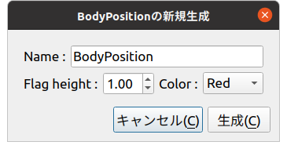
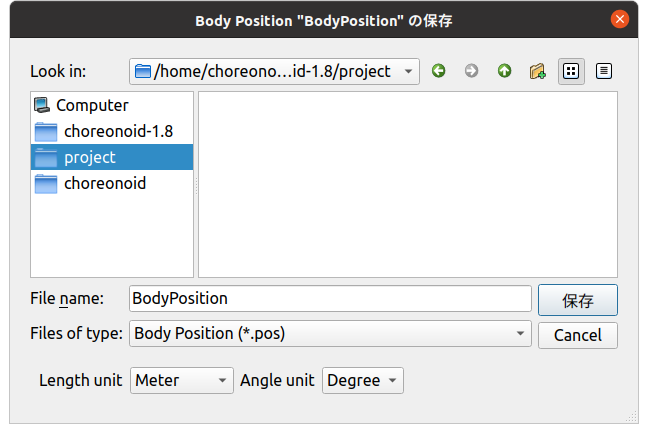
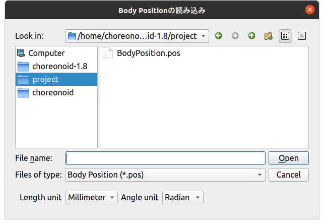

====================================================
Item Creation and File I/O Customization Sample (S10)
====================================================

.. contents:: Table of Contents
   :local:

Overview
--------

In this section, as an example of :doc:`item-creation-io-customization`, we present an improvement of :doc:`item-file-io-sample` that:

* Allows specifying flag height and color when creating new items
* Allows specifying length and angle units when saving/loading item files

Source Code
-----------

.. highlight:: cpp

This sample's source code adds a new file called BodyPositionItemCustomization.cpp to :doc:`item-file-io-sample`, implementing and registering options there. Accordingly, the registration processing previously written in BodyPositionItem.cpp is removed. CMakeLists.txt is also modified to match the added source file.

Below we show the modified parts of the source files and the source code of the added BodyPositionItemCustomization.cpp.

BodyPositionItem.cpp
~~~~~~~~~~~~~~~~~~~~
 
BodyPositionItem.cpp is almost the same as :doc:`item-file-io-sample`, but the initializeClass function that performs item registration has been **removed**. Therefore, the beginning of the source looks like this: ::

 #include "BodyPositionItem.h"
 #include <cnoid/ItemManager>
 #include <cnoid/MeshGenerator>
 #include <cnoid/EigenUtil>
 #include <cnoid/PutPropertyFunction>
 #include <cnoid/Archive>
 #include <cnoid/EigenArchive>
 #include <cnoid/YAMLReader>
 #include <cnoid/YAMLWriter>
 #include <fmt/format.h>

 using namespace std;
 using namespace fmt;
 using namespace cnoid;

 // The following function that was written here has been removed
 // void BodyPositionItem::initializeClass(ItemManager& manager)
 // {
 //     ...
 // }

 BodyPositionItem::BodyPositionItem()
 {
     ...

Note that in this sample, the loadBodyPosition and saveBodyPosition functions of the BodyPositionItem class are also no longer used, but they don't necessarily need to be deleted.

BodyPositionItemCusomization.cpp
~~~~~~~~~~~~~~~~~~~~~~~~~~~~~~~~

This file contains the following source code: ::
  
 #include "BodyPositionItem.h"
 #include <cnoid/ItemManager>
 #include <cnoid/ItemFileIO>
 #include <cnoid/ValueTree>
 #include <cnoid/EigenArchive>
 #include <cnoid/YAMLReader>
 #include <cnoid/YAMLWriter>
 #include <fmt/format.h>
 #include <QBoxLayout>
 #include <QLabel>
 #include <QLineEdit>
 #include <QDoubleSpinBox>
 #include <QComboBox>

 using namespace std;
 using namespace fmt;
 using namespace cnoid;

 namespace {

 class BodyPositionItemCreationPanel : public ItemCreationPanelBase<BodyPositionItem>
 {
     QLineEdit* nameEntry;
     QDoubleSpinBox* heightSpin;
     QComboBox* colorCombo;

 public:
     BodyPositionItemCreationPanel()
     {
	 auto vbox = new QVBoxLayout;
	 setLayout(vbox);

	 auto hbox1 = new QHBoxLayout;
	 hbox1->addWidget(new QLabel("Name :"));
	 nameEntry = new QLineEdit;
	 hbox1->addWidget(nameEntry);
	 vbox->addLayout(hbox1);

	 auto hbox2 = new QHBoxLayout;

	 hbox2->addWidget(new QLabel("Flag height :"));
	 heightSpin = new QDoubleSpinBox;
	 heightSpin->setRange(0.01, 9.99);
	 heightSpin->setDecimals(2);
	 heightSpin->setValue(1.0);
	 hbox2->addWidget(heightSpin);

	 hbox2->addWidget(new QLabel("Color :"));
	 colorCombo = new QComboBox;
	 colorCombo->addItem("Red");
	 colorCombo->addItem("Green");
	 colorCombo->addItem("Blue");
	 hbox2->addWidget(colorCombo);

	 vbox->addLayout(hbox2);
     }

     virtual bool initializeCreation(BodyPositionItem* protoItem, Item* parentItem) override
     {
	 nameEntry->setText(protoItem->name().c_str());
	 return true;
     }

     virtual bool updateItem(BodyPositionItem* protoItem, Item* parentItem) override
     {
	 protoItem->setName(nameEntry->text().toStdString());
	 protoItem->setFlagHeight(heightSpin->value());
	 protoItem->setFlagColor(colorCombo->currentIndex());

	 if(auto bodyItem = dynamic_cast<BodyItem*>(parentItem)){
	     protoItem->setPosition(bodyItem->body()->rootLink()->position());
	 }

	 return true;
     }
 };

 class BodyPositionItemFileIO : public ItemFileIoBase<BodyPositionItem>
 {
     enum LengthUnit { Meter, Millimeter } lengthUnit;
     enum AngleUnit { Degree, Radian } angleUnit;
     QWidget* panel;
     QComboBox* lengthUnitCombo;
     QComboBox* angleUnitCombo;

 public:
     BodyPositionItemFileIO()
	 : ItemFileIoBase<BodyPositionItem>(
	     "BODY-POSITION",
	     Load | Save | Options | OptionPanelForLoading | OptionPanelForSaving)
     {
	 setCaption("Body Position");
	 setExtension("pos");
	 resetOptions();
	 panel = nullptr;
     }

     virtual void resetOptions() override
     {
	 lengthUnit = Meter;
	 angleUnit = Degree;
     }

     virtual void storeOptions(Mapping* options) override
     {
	 if(lengthUnit == Millimeter){
	     options->write("length_unit", "millimeter");
	 } else {
	     options->write("length_unit", "meter");
	 }
	 if(angleUnit == Radian){
	     options->write("angle_unit", "radian");
	 } else {
	     options->write("angle_unit", "degree");
	 }
     }

     virtual bool restoreOptions(const Mapping* options) override
     {
	 string unit;
	 options->read("length_unit", unit);
	 if(unit == "millimeter"){
	     lengthUnit = Millimeter;
	 } else {
	     lengthUnit = Meter;
	 }
	 options->read("angle_unit", unit);
	 if(unit == "radian"){
	     angleUnit = Radian;
	 } else {
	     angleUnit = Degree;
	 }
	 return true;
     }

     QWidget* getOrCreateOptionPanel()
     {
	 if(!panel){
	     panel = new QWidget;
	     auto hbox = new QHBoxLayout;
	     panel->setLayout(hbox);

	     hbox->addWidget(new QLabel("Length unit"));
	     lengthUnitCombo = new QComboBox;
	     lengthUnitCombo->addItem("Meter");
	     lengthUnitCombo->addItem("Millimeter");
	     hbox->addWidget(lengthUnitCombo);

	     hbox->addWidget(new QLabel("Angle unit"));
	     angleUnitCombo = new QComboBox;
	     angleUnitCombo->addItem("Degree");
	     angleUnitCombo->addItem("Radian");
	     hbox->addWidget(angleUnitCombo);
	 }
	 return panel;
     }

     void fetchOptionPanel()
     {
	 if(lengthUnitCombo->currentIndex() == 0){
	     lengthUnit = Meter;
	 } else {
	     lengthUnit = Millimeter;
	 }
	 if(angleUnitCombo->currentIndex() == 0){
	     angleUnit = Degree;
	 } else {
	     angleUnit = Radian;
	 }
     }

     virtual QWidget* getOptionPanelForLoading() override
     {
	 return getOrCreateOptionPanel();
     }

     virtual void fetchOptionPanelForLoading() override
     {
	 fetchOptionPanel();
     }

     virtual bool load(BodyPositionItem* item, const std::string& filename) override
     {
	 YAMLReader reader;
	 MappingPtr archive;
	 try {
	     archive = reader.loadDocument(filename)->toMapping();
	 }
	 catch(const ValueNode::Exception& ex){
	     os() << ex.message() << endl;
	 }
	 double lengthRatio = 1.0;
	 if(lengthUnit == Millimeter){
	     lengthRatio /= 1000.0;
	 }

	 Isometry3 T = item->position();
	 Vector3 v;
	 if(read(archive, "translation", v)){
	     T.translation() = lengthRatio * v;
	 }
	 if(read(archive, "rotation", v)){
	     if(angleUnit == Degree){
		 v = radian(v);
	     }
	     T.linear() = rotFromRpy(v);
	 }
	 item->setPosition(T);

	 double height;
	 if(archive->read("flag_height", height)){
	     item->setFlagHeight(lengthRatio * height);
	 }
	 string color;
	 if(archive->read("flag_color", color)){
	     if(color == "red"){
		 item->setFlagColor(BodyPositionItem::Red);
	     } else if(color == "green"){
		 item->setFlagColor(BodyPositionItem::Green);
	     } else if(color == "blue"){
		 item->setFlagColor(BodyPositionItem::Blue);
	     }
	 }
	 return true;
     }

     virtual QWidget* getOptionPanelForSaving(BodyPositionItem* /* item */) override
     {
	 return getOrCreateOptionPanel();
     }

     virtual void fetchOptionPanelForSaving() override
     {
	 fetchOptionPanel();
     }

     virtual bool save(BodyPositionItem* item, const std::string& filename) override
     {
	 YAMLWriter writer;
	 if(!writer.openFile(filename)){
	     os() << format("Failed to open \"{0}\".", filename) << endl;
	     return false;
	 }

	 MappingPtr archive = new Mapping;
	 double lengthRatio = 1.0;
	 if(lengthUnit == Millimeter){
	     lengthRatio = 1000.0;
	 }
	 write(archive, "translation", Vector3(lengthRatio * item->position().translation()));
	 Vector3 rpy = rpyFromRot(item->position().linear());
	 if(angleUnit == Degree){
	     rpy = degree(rpy);
	 }
	 write(archive, "rotation", rpy);
	 archive->write("flag_height", lengthRatio * item->flagHeight());

	 switch(static_cast<int>(item->flagColor())){
	 case BodyPositionItem::Red:
	     archive->write("flag_color", "red");
	     break;
	 case BodyPositionItem::Green:
	     archive->write("flag_color", "green");
	     break;
	 case BodyPositionItem::Blue:
	     archive->write("flag_color", "blue");
	     break;
	 }

	 writer.putNode(archive);

	 return true;
     }
 };

 }

 void BodyPositionItem::initializeClass(ExtensionManager* ext)
 {
     ext->itemManager()
	 .registerClass<BodyPositionItem>("BodyPositionItem")
	 .addCreationPanel<BodyPositionItem>(new BodyPositionItemCreationPanel)
	 .addFileIO<BodyPositionItem>(new BodyPositionItemFileIO);
 }
 
CMakeLists.txt
~~~~~~~~~~~~~~

.. highlight:: cmake

CMakeLists.txt is basically the same as before, but we need to include the newly added source file.

For building in Choreonoid's build environment: ::

 set(sources DevGuidePlugin.cpp BodyPositionItem.cpp BodyPositionItemCusomization.cpp)
 choreonoid_add_plugin(CnoidDevGuidePlugin ${sources})
 target_link_libraries(CnoidDevGuidePlugin PUBLIC CnoidBodyPlugin)

Since the source files have increased, we store the list of source files in a variable called sources.

For building independently from Choreonoid: ::

 cmake_minimum_required(VERSION 3.10)
 project(DevGuidePlugin)
 find_package(Choreonoid REQUIRED)
 set(CMAKE_CXX_STANDARD ${CHOREONOID_CXX_STANDARD})
 set(sources DevGuidePlugin.cpp BodyPositionItem.cpp BodyPositionItemCusomization.cpp)
 choreonoid_add_plugin(CnoidDevGuidePlugin ${sources})
 target_link_libraries(CnoidDevGuidePlugin PUBLIC Choreonoid::CnoidBodyPlugin)

Using Additional Configuration Items
------------------------------------

When you load this plugin, configuration items are added to item creation and file input/output. Let's try this.

As before, load an appropriate project like PA10Pickup and create a BodyPosition item for a Body item.
Select the target body item and select "File" - "New" - "BodyPosition" from the main menu.
The following creation dialog will be displayed:

While previous creation dialogs only allowed specifying the item name, this dialog also allows specifying "Flag height" and "Color". These are the configuration items we implemented this time. They correspond to flag height and color respectively, where height can be entered using a numeric input spin box. For color, clicking the combo box displays choices from which you can select.

Once you've finished setting the name and options, press the "Create" button to create the BodyPositionItem.
Check the created item to display the flag.
You should be able to confirm that the flag height and color are initially in the state set in the dialog.
Furthermore, when created with a Body item selected (Body item as parent), the BodyPositionItem's recorded position initially matches the parent Body item's position. This behavior was added along with the configuration items.
Such initialization processing can also be implemented through :doc:`item-creation-io-customization`.

Next, let's try saving a BodyPositionItem file.
Select the item and execute "File" - "Save Selected Items As", and the following save dialog will be displayed:

Notice the bottom of the dialog.
You can confirm that combo boxes for selecting "Length unit" and "Angle unit" are displayed.
These combo boxes allow you to specify the units used in the file.
For length and angle units, the defaults are Meter and Degree, but you can also select Millimeter and Radian respectively.

Actually try changing these settings and saving, then check the file contents.
For example, suppose the following state is saved with meters and degrees:

.. code-block:: yaml

 flag_color: red
 flag_height: 1
 rotation: [ 0, -0, 90 ]
 translation: [ 0.9, 0, 0.035 ]

If you save the same state with units changed to millimeters and radians, the file is saved as:

.. code-block:: yaml

 flag_color: red
 flag_height: 1000
 rotation: [ 0, -0, 1.5708 ]
 translation: [ 900, 0, 35 ]

Now let's load a BodyPositionItem from a file. When you select "Body Position" from the "File" - "Load" menu, the following file loading dialog is displayed:

For loading as well, combo boxes for specifying units are displayed like this.
Here you should specify the same units as when the target file was saved.
Then the BodyPositionItem's position and orientation will be loaded correctly.
If you load with different units specified, the position and orientation will differ from the original state.

Note that specifying units used in files this way is not desirable for file formats used in reality. It's difficult to know what units were used when creating the file, and if you load with the wrong units, it won't load correctly, causing confusion. Being able to specify units in this way is not particularly helpful and is actually an unfriendly design. Please understand that we did this intentionally to make it easy to understand as an option implementation sample.

However, similar options may be necessary even for existing file formats used in reality.
For example, some file formats that store 3D model data don't particularly specify length units, so units vary depending on when the file was created. In such cases, you have no choice but to deal with it using options like in this sample.
In fact, when loading Body items from mesh files in Choreonoid, you can select length units from meters, millimeters, and inches. You can also select whether to use the Z-axis or Y-axis as the upward direction for coordinate axes.
Of course, those options are also implemented using ItemFileIO.

Source Code Explanation
-----------------------

.. highlight:: cpp

Almost all the code newly added in this sample is contained in BodyPositionItemCustomization.cpp.
This part doesn't necessarily need to be in a separate file from the BodyMotionItem class implementation, but we structured it this way to clarify the additions to :doc:`item-file-io-sample`. Below we explain the implementation content of this file. 

First, in the header file's class definition, we define the following enumeration types for specifying units: ::

 enum LengthUnit { Meter, Millimeter };
 enum AngleUnit { Degree, Radian };

These are enumeration types for specifying length units and angle units respectively.

We add arguments to specify units with these enumeration types to the loading and saving functions: ::

 bool loadBodyPosition(
     const std::string& filename, LengthUnit lengthUnit, AngleUnit anguleUnit, std::ostream& os);
 bool saveBodyPosition(
     const std::string& filename, LengthUnit lengthUnit, AngleUnit anguleUnit, std::ostream& os);

The arguments lengthUnit and angleUnit are relevant.

In the implementation file, we basically modify the content of these functions.
Please check the actual content in the source code shown at the beginning.
When the lengthUnit argument is Meter, the processing is the same as before, but when it's Millimeter, we divide values read from files by 1000, and conversely multiply by 1000 when saving to files.
Similarly for the angleUnit argument, when the value is Degree, we convert between radians and degrees as before, but when it's Degree, we read and write without conversion.

This prepares us to add options to file input/output.

Content of BodyMotionItemRegistration.cpp
~~~~~~~~~~~~~~~~~~~~~~~~~~~~~~~~~~~~~~~~~

First, regarding headers, what we're newly including this time is: ::

 #include <cnoid/ItemFileIO>

We're incorporating the ItemFileIO class that can implement file input/output details. ::

 #include <QBoxLayout>
 #include <QLabel>
 #include <QLineEdit>
 #include <QDoubleSpinBox>
 #include <QComboBox>

Headers related to Qt classes.
These are necessary for building the GUI for option settings.

Next, we implement ItemCreationPanel to customize the creation panel: ::

 class BodyPositionItemCreationPanel : public ItemCreationPanelBase<BodyPositionItem>

We define a creation panel for BodyPositionItem based on the ItemCreationPanelBase template. ::

 QLineEdit* nameEntry;
 QDoubleSpinBox* heightSpin;
 QComboBox* colorCombo;

Variables corresponding to Qt widgets that compose the configuration GUI.
We define those that need to be referenced after creation as member variables like this. ::

 BodyPositionItemCreationPanel()
 {
     auto vbox = new QVBoxLayout;
     setLayout(vbox);
      
     auto hbox1 = new QHBoxLayout;
     hbox1->addWidget(new QLabel("Name:"));
     nameEntry = new QLineEdit;
     hbox1->addWidget(nameEntry);
     vbox->addLayout(hbox1);
 
     auto hbox2 = new QHBoxLayout;
 
     hbox2->addWidget(new QLabel("Flag height:"));
     heightSpin = new QDoubleSpinBox;
     heightSpin->setRange(0.01, 9.99);
     heightSpin->setDecimals(2);
     heightSpin->setValue(1.0);
     hbox2->addWidget(heightSpin);
 
     hbox2->addWidget(new QLabel("Color:"));
     colorCombo = new QComboBox;
     colorCombo->addItem("Red");
     colorCombo->addItem("Green");
     colorCombo->addItem("Blue");
     hbox2->addWidget(colorCombo);
 
     vbox->addLayout(hbox2);
 }

Building the configuration GUI in the constructor.
Here we use common Qt classes with common code, and there are no particular Choreonoid-specific points, so we'll skip detailed explanation.
As mentioned in :ref:`plugin-dev-toolbar-use-qt-classes` of :doc:`toolbar`, implementing GUI-related parts in plugins requires knowledge about Qt. Please learn about that from Qt manuals, etc.

The main components of the GUI we're building here are:
We store pointers in corresponding member variables because we need to reference input content during item creation.

* Create a text input area for setting names as QLineEdit

* Create a numeric input area for setting flag height as QDoubleSpinBox

* Create an interface for selecting flag color as QComboBox

We also add labels to these and arrange them appropriately within the panel using layout classes. ::

 virtual bool initializeCreation(BodyPositionItem* protoItem, Item* parentItem) override
 {
     nameEntry->setText(protoItem->name().c_str());
     return true;
 }

Overriding initializeCreation, which is a virtual function of ItemCreationPanelBase.
This function implements initialization processing when the item creation panel is displayed.
Here we set the prototype item's name in the name input field, making it have the default name entered. ::

 virtual bool updateItem(BodyPositionItem* protoItem, Item* parentItem) override
 {
     ...
 }

Overriding the updateItem function, which is a virtual function of ItemCreationPanelBase.
This function implements processing to update the prototype item's content when creating items.
Since new item creation is done by duplicating the prototype item, the content of the prototype item updated here becomes the content of the new item as is.
Below is the implementation content of this function. ::

 protoItem->setName(nameEntry->text().toStdString());
 protoItem->setFlagHeight(heightSpin->value());
 protoItem->setFlagColor(colorCombo->currentIndex());

Setting the content entered in the creation panel to the prototype item for each attribute: name, flag height, and flag color. ::

 if(auto bodyItem = dynamic_cast<BodyItem*>(parentItem)){
     protoItem->setPosition(bodyItem->body()->rootLink()->position());
 }

If the parent item of the created item is a BodyItem, we set the current position of the corresponding Body object's root link as the BodyPositionItem's recorded position. This makes the created item's recorded position automatically match the target Body object's position. ::

 return true;

Return true when update succeeds.
If there's a problem, you can cancel item creation by returning false.

Next, we implement ItemFileIO to customize file input/output: ::

 class BodyPositionItemFileIO : public ItemFileIoBase<BodyPositionItem>

Define ItemFileIO for BodyPositionItem based on the ItemFileIoBase template. ::

 enum LengthUnit { Meter, Millimeter } lengthUnit;
 enum AngleUnit { Degree, Radian } angleUnit;

Define enumeration types for storing option settings and make them member variables.
They are values specifying length units and angle units respectively. ::

 QWidget* panel;
 QComboBox* lengthUnitCombo;
 QComboBox* angleUnitCombo;

Define pointers to widgets composing the option setting panel as member variables. ::

 BodyPositionItemFileIO()
     : ItemFileIoBase<BodyPositionItem>(
         "BODY-POSITION",
         Load | Save | Options | OptionPanelForLoading | OptionPanelForSaving)
 {
     setCaption("Body Position");
     setExtension("pos");
     resetOptions();
     panel = nullptr;
 }

Constructor.
First, in the base class constructor, we specify the file format identifier (format) and the APIs this object supports as fundamental attributes of ItemFileIO. Also, in the constructor body, we set the caption and extension, and initialize option settings with the next resetOptions function. While we could create the panel GUI in the constructor, here we initialize the corresponding panel variable with nullptr and create the actual panel on-demand when first displaying the file dialog. ::

 virtual void resetOptions() override
 {
     lengthUnit = Meter;
     angleUnit = Degree;
 }

Implementing resetOptions, which is a virtual function of ItemFileIO.
This is a function for initializing option settings, initializing length units to meters and angle units to degrees.
As mentioned above, we also use it for initialization from the constructor. ::

 virtual void storeOptions(Mapping* options) override
 {
     if(lengthUnit == Millimeter){
         options->write("length_unit", "millimeter");
     } else {
         options->write("length_unit", "meter");
     }
     if(angleUnit == Radian){
         options->write("angle_unit", "radian");
     } else {
         options->write("angle_unit", "degree");
     }
 }

Implementing storeOptions, which is a virtual function of ItemFileIO.
In this function, output the option setting state inside the ItemFileIO object to the argument options.
Specifically, we output the current length unit with the key "length_unit" and angle unit with the key "angle_unit".
The value of "length_unit" is "meter" if the unit is meters, "millimeter" if millimeters.
The value of "angle_unit" is "degree" if the unit is degrees, "radian" if radians. ::

 virtual bool restoreOptions(const Mapping* options) override
 {
     string unit;
     options->read("length_unit", unit);
     if(unit == "millimeter"){
         lengthUnit = Millimeter;
     } else {
         lengthUnit = Meter;
     }
     options->read("angle_unit", unit);
     if(unit == "radian"){
         angleUnit = Radian;
     } else {
         angleUnit = Degree;
     }
     return true;
 }

Implementing restoreOptions, which is a virtual function of ItemFileIO.
In this function, as the reverse process of storeOptions, interpret the content of the argument options and update the option setting state inside the ItemFileIO object.
Specifically, if the string "millimeter" is stored with the key "length_unit" in options, set the length unit to millimeters, otherwise default to meters. Also, if the string "radian" is stored with the key "angle_unit", set the angle unit to radians, otherwise default to degrees. ::

 QWidget* getOrCreateOptionPanel()
 {
     if(!panel){
         panel = new QWidget;
         auto hbox = new QHBoxLayout;
         panel->setLayout(hbox);
 
         hbox->addWidget(new QLabel("Length unit"));
         lengthUnitCombo = new QComboBox;
         lengthUnitCombo->addItem("Meter");
         lengthUnitCombo->addItem("Millimeter");
         hbox->addWidget(lengthUnitCombo);
 
         hbox->addWidget(new QLabel("Angle unit"));
         angleUnitCombo = new QComboBox;
         angleUnitCombo->addItem("Degree");
         angleUnitCombo->addItem("Radian");
         hbox->addWidget(angleUnitCombo);
     }
     return panel;
 }

Function that returns the option setting panel.
If the panel hasn't been created yet, create it before returning.
This function creates the panel on-demand.
The panel content consists of combo boxes for selecting length units and angle units, each with labels arranged.
We store the QWidget instance with these arranged in the member variable panel and return it.
Since the BodyPositionItemFileIO we implemented provides the same configuration items for file loading and saving, the panel created here is shared by both. ::

 void fetchOptionPanel()
 {
     if(lengthUnitCombo->currentIndex() == 0){
         lengthUnit = Meter;
     } else {
         lengthUnit = Millimeter;
     }
     if(angleUnitCombo->currentIndex() == 0){
         angleUnit = Degree;
     } else {
         angleUnit = Radian;
     }
 }

Function to reflect the option panel's input state to the option settings inside the ItemFileIO object.
For length and angle units, we reference the corresponding combo box selections and update the values of the corresponding member variables.
We also share this processing between file loading and saving. ::

 virtual QWidget* getOptionPanelForLoading() override
 {
     return getOrCreateOptionPanel();
 }

Implementing the virtual function for getting the option panel for file loading.
We directly call the getOrCreateOptionPanel function, which is the substance of this processing. ::

 virtual void fetchOptionPanelForLoading() override
 {
     fetchOptionPanel();
 }

Implementing the virtual function to reflect the input state of the file loading option panel.
This also directly calls the fetchOptionPanel function, which is the substance of the processing. ::

  virtual bool load(BodyPositionItem* item, const std::string& filename) override
  {
      YAMLReader reader;
      MappingPtr archive;
      try {
	  archive = reader.loadDocument(filename)->toMapping();
      }
      catch(const ValueNode::Exception& ex){
	  os() << ex.message() << endl;
      }
      double lengthRatio = 1.0;
      if(lengthUnit == Millimeter){
	  lengthRatio /= 1000.0;
      }

      Isometry3 T = item->position();
      Vector3 v;
      if(read(archive, "translation", v)){
	  T.translation() = lengthRatio * v;
      }
      if(read(archive, "rotation", v)){
	  if(angleUnit == Degree){
	      v = radian(v);
	  }
	  T.linear() = rotFromRpy(v);
      }
      item->setPosition(T);

      double height;
      if(archive->read("flag_height", height)){
	  item->setFlagHeight(lengthRatio * height);
      }
      string color;
      if(archive->read("flag_color", color)){
	  if(color == "red"){
	      item->setFlagColor(BodyPositionItem::Red);
	  } else if(color == "green"){
	      item->setFlagColor(BodyPositionItem::Green);
	  } else if(color == "blue"){
	      item->setFlagColor(BodyPositionItem::Blue);
	  }
      }
      return true;
  }

Implementing the load function, which is the virtual function that actually performs file loading processing.
The implementation content introduces unit conversion to the BodyPositionItem class's loadBodyPosition function.
The currently set unit types are stored in the above member variables lengthUnit and angleUnit, so we branch the unit conversion processing based on those values. This reflects the unit settings in the actual loading processing.
Also, since this function is not a member function of BodyPositionItem, we implement it using only BodyPositionItem's public functions. ::

 virtual QWidget* getOptionPanelForSaving(BodyPositionItem* /* item */) override
 {
     return getOrCreateOptionPanel();
 }
 
 virtual void fetchOptionPanelForSaving() override
 {
     fetchOptionPanel();
 }

Implementing virtual functions for processing file saving options.
As described above, since BodyPositionItemFileIO shares the same configuration items for file loading and saving, the implementation of these functions is the same as for loading. ::

  virtual bool save(BodyPositionItem* item, const std::string& filename) override
  {
      YAMLWriter writer;
      if(!writer.openFile(filename)){
	  os() << format("Failed to open \"{0}\".", filename) << endl;
	  return false;
      }

      MappingPtr archive = new Mapping;
      double lengthRatio = 1.0;
      if(lengthUnit == Millimeter){
	  lengthRatio = 1000.0;
      }
      write(archive, "translation", Vector3(lengthRatio * item->position().translation()));
      Vector3 rpy = rpyFromRot(item->position().linear());
      if(angleUnit == Degree){
	  rpy = degree(rpy);
      }
      write(archive, "rotation", rpy);
      archive->write("flag_height", lengthRatio * item->flagHeight());

      switch(static_cast<int>(item->flagColor())){
      case BodyPositionItem::Red:
	  archive->write("flag_color", "red");
	  break;
      case BodyPositionItem::Green:
	  archive->write("flag_color", "green");
	  break;
      case BodyPositionItem::Blue:
	  archive->write("flag_color", "blue");
	  break;
      }

      writer.putNode(archive);

      return true;
  }

Implementing the save function, which is the virtual function that actually performs file saving processing.
Similarly to the load function, this introduces unit conversion to the BodyPositionItem class's saveBodyPosition function. ::

 void BodyPositionItem::initializeClass(ExtensionManager* ext)
 {
     ext->itemManager()
	 .registerClass<BodyPositionItem>("BodyPositionItem")
	 .addCreationPanel<BodyPositionItem>(new BodyPositionItemCreationPanel)
	 .addFileIO<BodyPositionItem>(new BodyPositionItemFileIO);
 }

Function to register the BodyPositionItem class with the system.
We register BodyPositionItemCreationPanel and BodyPositionItemFileIO implemented in this file to be used for creation and file input/output respectively.