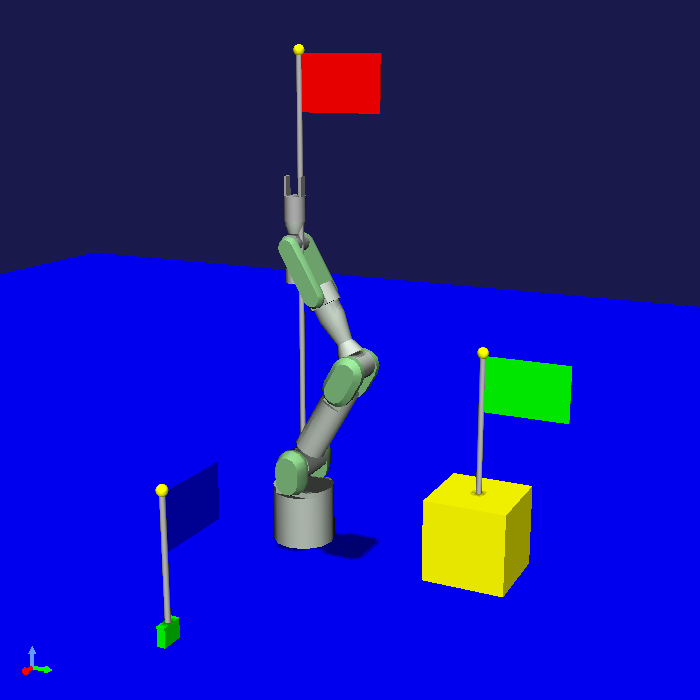

==================================================
File I/O Sample for Project Items (S09)
==================================================

.. contents:: Table of Contents
   :local:

Overview
--------

In this section, as a sample related to :doc:`item-file-io`, we present an improvement of :doc:`item-project-save-sample` that saves item states to files.

Source Code
-----------

.. highlight:: cpp

This sample's source code adds file input/output functions to the code from :doc:`item-project-save-sample` and registers them. The item's :ref:`plugin-dev-state-store-restore-functions` content is also modified to accommodate file input/output. Most of the source code is the same as S08, with changes from S08 highlighted with comments. The modified files are the BodyPositionItem header and implementation files, while DevGuidePlugin.cpp and CMakeLists.txt remain the same.

BodyPositionItem.h
~~~~~~~~~~~~~~~~~~

.. code-block:: cpp
 :emphasize-lines: 29,30,44,45,46

 #ifndef DEVGUIDE_PLUGIN_BODY_POSITION_ITEM_H
 #define DEVGUIDE_PLUGIN_BODY_POSITION_ITEM_H

 #include <cnoid/Item>
 #include <cnoid/RenderableItem>
 #include <cnoid/BodyItem>
 #include <cnoid/SceneGraph>
 #include <cnoid/SceneDrawables>
 #include <cnoid/Selection>

 class BodyPositionItem : public cnoid::Item, public cnoid::RenderableItem
 {
 public:
     static void initializeClass(cnoid::ExtensionManager* ext);

     BodyPositionItem();
     BodyPositionItem(const BodyPositionItem& org);
     void storeBodyPosition();
     void restoreBodyPosition();
     virtual cnoid::SgNode* getScene() override;
     void setPosition(const cnoid::Isometry3& T);
     const cnoid::Isometry3& position() const { return position_; }
     bool setFlagHeight(double height);
     double flagHeight() const { return flagHeight_; }
     enum ColorId { Red, Green, Blue };
     bool setFlagColor(int colorId);
     double flagColor() const { return flagColorSelection.which(); }

     // Added
     virtual void notifyUpdate() override;

 protected:
     virtual Item* doDuplicate() const override;
     virtual void onTreePathChanged() override;
     virtual void doPutProperties(cnoid::PutPropertyFunction& putProperty) override;
     virtual bool store(cnoid::Archive& archive) override;
     virtual bool restore(const cnoid::Archive& archive) override;

 private:
     void createFlag();
     void updateFlagPosition();
     void updateFlagMaterial();

     // Added the following two functions
     bool loadBodyPosition(const std::string& filename, std::ostream& os);
     bool saveBodyPosition(const std::string& filename, std::ostream& os);

     cnoid::BodyItem* bodyItem;
     cnoid::Isometry3 position_;
     cnoid::SgPosTransformPtr flag;
     double flagHeight_;
     cnoid::Selection flagColorSelection;
     cnoid::SgMaterialPtr flagMaterial;
 };

 typedef cnoid::ref_ptr<BodyPositionItem> BodyPositionItemPtr;

 #endif // DEVGUIDE_PLUGIN_BODY_POSITION_ITEM_H

 }

BodyPositionItem.cpp
~~~~~~~~~~~~~~~~~~~~

.. code-block:: cpp
 :emphasize-lines: 9,10,11,25,26,27,28,29,30,31,32,33,239,240,241,242,243,244,245,246,247,248,249,250,252,253,254,255,256,257,258,259,260,261,262,263,264,265,266,267,268,269,270,271,272,273,274,275,276,277,278,279,280,281,282,283,284,285,286,287,288,289,290,291,292,293,294,295,296,297,298,299,300,301,302,303,304,305

 #include "BodyPositionItem.h"
 #include <cnoid/ItemManager>
 #include <cnoid/MeshGenerator>
 #include <cnoid/EigenUtil>
 #include <cnoid/PutPropertyFunction>
 #include <cnoid/Archive>
 #include <cnoid/EigenArchive>

 // Added the following two headers
 #include <cnoid/YAMLReader>
 #include <cnoid/YAMLWriter>

 #include <fmt/format.h>

 using namespace std;
 using namespace fmt;
 using namespace cnoid;

 void BodyPositionItem::initializeClass(ExtensionManager* ext)
 {
     ext->itemManager()
	 .registerClass<BodyPositionItem>("BodyPositionItem")
	 .addCreationPanel<BodyPositionItem>()

	 // Added the following     
	 .addLoaderAndSaver<BodyPositionItem>(
	     "Body Position", "BODY-POSITION", "pos",
	     {
		 return item->loadBodyPosition(filename, os);
	     },
	     {
		 return item->saveBodyPosition(filename, os);
	     });
 }

 BodyPositionItem::BodyPositionItem()
 {
     bodyItem = nullptr;
     position_.setIdentity();
     flagColorSelection.setSymbol(Red, "red");
     flagColorSelection.setSymbol(Green, "green");
     flagColorSelection.setSymbol(Blue, "blue");
     flagColorSelection.select(Red);
     flagHeight_ = 1.8;
 }

 BodyPositionItem::BodyPositionItem(const BodyPositionItem& org)
     : Item(org)
 {
     bodyItem = nullptr;
     position_ = org.position_;
     flagHeight_ = org.flagHeight_;
     flagColorSelection = org.flagColorSelection;
 }

 Item* BodyPositionItem::doDuplicate() const
 {
     return new BodyPositionItem(*this);
 }

 void BodyPositionItem::onTreePathChanged()
 {
     auto newBodyItem = findOwnerItem<BodyItem>();
     if(newBodyItem && newBodyItem != bodyItem){
	 bodyItem = newBodyItem;
	 mvout()
	     << format("BodyPositionItem \"{0}\" has been attached to {1}.",
		       name(), bodyItem->name())
	     << endl;
     }
 }

 void BodyPositionItem::storeBodyPosition()
 {
     if(bodyItem){
	 position_ = bodyItem->body()->rootLink()->position();
	 updateFlagPosition();
	 mvout()
	     << format("The current position of {0} has been stored to {1}.",
		       bodyItem->name(), name())
	     << endl;
     }
 }

 void BodyPositionItem::restoreBodyPosition()
 {
     if(bodyItem){
	 bodyItem->body()->rootLink()->position() = position_;
	 bodyItem->notifyKinematicStateChange(true);
	 mvout()
	     << format("The position of {0} has been restored from {1}.",
		       bodyItem->name(), name())
	     << endl;
     }
 }

 SgNode* BodyPositionItem::getScene()
 {
     if(!flag){
	 createFlag();
     }
     return flag;
 }

 void BodyPositionItem::createFlag()
 {
     if(!flag){
	 flag = new SgPosTransform;
	 updateFlagPosition();
	 flagMaterial = new SgMaterial;
	 updateFlagMaterial();
     } else {
	 flag->clearChildren();
     }

     MeshGenerator meshGenerator;

     auto pole = new SgShape;
     pole->setMesh(meshGenerator.generateCylinder(0.01, flagHeight_));
     pole->getOrCreateMaterial()->setDiffuseColor(Vector3f(0.7f, 0.7f, 0.7f));
     auto polePos = new SgPosTransform;
     polePos->setRotation(AngleAxis(radian(90.0), Vector3::UnitX()));
     polePos->setTranslation(Vector3(0.0, 0.0, flagHeight_ / 2.0));
     polePos->addChild(pole);
     flag->addChild(polePos);

     auto ornament = new SgShape;
     ornament->setMesh(meshGenerator.generateSphere(0.02));
     ornament->getOrCreateMaterial()->setDiffuseColor(Vector3f(1.0f, 1.0f, 0.0f));
     auto ornamentPos = new SgPosTransform;
     ornamentPos->setTranslation(Vector3(0.0, 0.0, flagHeight_ + 0.01));
     ornamentPos->addChild(ornament);
     flag->addChild(ornamentPos);

     auto banner = new SgShape;
     banner->setMesh(meshGenerator.generateBox(Vector3(0.002, 0.3, 0.2)));
     banner->setMaterial(flagMaterial);
     auto bannerPos = new SgPosTransform;
     bannerPos->setTranslation(Vector3(0.0, 0.16, flagHeight_ - 0.1));
     bannerPos->addChild(banner);
     flag->addChild(bannerPos);
 }

 void BodyPositionItem::updateFlagPosition()
 {
     if(flag){
	 auto p = position_.translation();
	 flag->setTranslation(Vector3(p.x(), p.y(), 0.0));
	 auto rpy = rpyFromRot(position_.linear());
	 flag->setRotation(AngleAxis(rpy.z(), Vector3::UnitZ()));
	 flag->notifyUpdate();
     }
 }

 void BodyPositionItem::updateFlagMaterial()
 {
     if(flagMaterial){
	 switch(flagColorSelection.which()){
	 case Red:
	     flagMaterial->setDiffuseColor(Vector3f(1.0f, 0.0f, 0.0f));
	     break;
	 case Green:
	     flagMaterial->setDiffuseColor(Vector3f(0.0f, 1.0f, 0.0f));
	     break;
	 case Blue:
	     flagMaterial->setDiffuseColor(Vector3f(0.0f, 0.0f, 1.0f));
	     break;
	 default:
	     break;
	 }
	 flagMaterial->notifyUpdate();
     }
 }        

 void BodyPositionItem::setPosition(const Isometry3& T)
 {
     position_ = T;
     updateFlagPosition();
     notifyUpdate();
 }

 bool BodyPositionItem::setFlagHeight(double height)
 {
     if(height <= 0.0){
	 return false;
     }
     flagHeight_ = height;
     if(flag){
	 createFlag();
	 flag->notifyUpdate();
     }
     notifyUpdate();
     return true;
 }

 bool BodyPositionItem::setFlagColor(int colorId)
 {
     if(!flagColorSelection.select(colorId)){
	 return false;
     }
     updateFlagMaterial();
     notifyUpdate();
     return true;
 }

 void BodyPositionItem::doPutProperties(PutPropertyFunction& putProperty)
 {
     auto p = position_.translation();
     putProperty("Translation", format("{0:.3g} {1:.3g} {2:.3g}", p.x(), p.y(), p.z()),
		 [this](const string& text){
		     Vector3 p;
		     if(toVector3(text, p)){
			 position_.translation() = p;
			 setPosition(position_);
			 return true;
		     }
		     return false;
		 });

     auto r = degree(rpyFromRot(position_.linear()));
     putProperty("Rotation", format("{0:.0f} {1:.0f} {2:.0f}", r.x(), r.y(), r.z()),
		 [this](const string& text){
		     Vector3 rpy;
		     if(toVector3(text, rpy)){
			 position_.linear() = rotFromRpy(radian(rpy));
			 setPosition(position_);
			 return true;
		     }
		     return false;
		 });

     putProperty.min(0.1)("Flag height", flagHeight_,
		 [this](double height){ return setFlagHeight(height); });

     putProperty("Flag color", flagColorSelection,
		 [this](int which){ return setFlagColor(which); });
 }

 // Added the following function
 void BodyPositionItem::notifyUpdate()
 {
     Item::notifyUpdate();
     suggestFileUpdate();
 }

 // Modified the following function
 bool BodyPositionItem::store(Archive& archive)
 {
     bool stored = false;
     if(overwrite()){
	  stored = archive.writeFileInformation(this);
     }
     return stored;
 }

 // Modified the following function
 bool BodyPositionItem::restore(const Archive& archive)
 {
     return archive.loadFileTo(this);
 }

 // Added the following function
 bool BodyPositionItem::loadBodyPosition(const std::string& filename, std::ostream& os)
 {
     YAMLReader reader;
     MappingPtr archive;
     try {
	 archive = reader.loadDocument(filename)->toMapping();
     }
     catch(const ValueNode::Exception& ex){
	 os << ex.message() << endl;
     }
     Vector3 v;
     if(read(archive, "translation", v)){
	 position_.translation() = v;
     }
     if(read(archive, "rotation", v)){
	 position_.linear() = rotFromRpy(radian(v));
     }
     archive->read("flag_height", flagHeight_);
     string color;
     if(archive->read("flag_color", color)){
	 flagColorSelection.select(color);
     }
     return true;
 }

 // Added the following function
 bool BodyPositionItem::saveBodyPosition(const std::string& filename, std::ostream& os)
 {
     YAMLWriter writer;
     if(!writer.openFile(filename)){
	 os << format("Failed to open \"{0}\".", filename) << endl;
	 return false;
     }

     MappingPtr archive = new Mapping;
     write(archive, "translation", Vector3(position_.translation()));
     write(archive, "rotation", degree(rpyFromRot(position_.linear())));
     archive->write("flag_height", flagHeight_);
     archive->write("flag_color", flagColorSelection.selectedSymbol());
     writer.putNode(archive);

     return true;
 }

Saving and Loading BodyPosition Files
-------------------------------------

When you load this plugin, BodyPositionItem settings can be saved to dedicated files.
The operation method is as shown in :ref:`plugin-dev-item-file-io-example`, so please try it similarly.
You should be able to save settings to a file with "Save Selected Items" from the "File" menu, and load (create) BodyPositionItems from files with "Load" - "BodyPosition" from the same menu.

Note that due to the introduction of file input/output, the content saved to project files differs from previous samples, so BodyPositionItems cannot be loaded from project files saved using previous sample plugins.
Therefore, you need to create BodyPositionItems anew, so please be aware of this.

While item file input/output can be performed individually for each item as described above, it can also be linked to project saving/loading. This is not difficult at all - item content is saved to separate files when saving projects, and content is loaded from corresponding files for each item when loading projects.
Since Choreonoid is typically used by creating projects, this usage method is probably common.
To deepen understanding of file input/output, please try this usage method in this sample as well.

For example, similarly to before, if you introduce BodyPositionItem to the PA10Pickup project and set it to the following state shown in :ref:`plugin-dev-item-property-sample-howto` of :doc:`item-property-sample`:

Let's save the project here. Select "Save Project As" from the main menu "File" and specify the project file name in the save dialog.

In this case, in :doc:`item-project-save-sample`, all information including BodyPositionItem content was saved to the project file and completed. However, in this sample, you should see file save dialogs for each BodyPositionItem. This behavior corresponds to condition 3 explained in :ref:`plugin-dev-item-file-io-overwrite`. If you save with the default file names in each dialog, the following files are output in addition to the project file:

* BodyPosition1.pos
* BodyPosition2.pos
* BodyPosition3.pos

These files are output by the saver function registered for BodyPositionItem and correspond to the settings of each BodyPositionItem. You can confirm that these files are output by the following messages displayed in the message view during project saving:

.. code-block:: text
 :emphasize-lines: 2,3

 Writing BodyPositionItem "BodyPosition1"
 Saving Body Position "BodyPosition1" to "/home/nakaoka/choreonoid/BodyPosition1.pos"
  -> Completed!

The highlighted part is the message about file output.

As a result of file output, for example, BodyPosition3.pos becomes a file with the following content:

.. code-block:: yaml

 flag_color: blue
 flag_height: 0.5
 rotation: [ 0, -0, 90 ]
 translation: [ 0.9, 0, 0.035 ]

This is a YAML format file. In this sample, we used YAML format like this, but there are no particular rules for the file format targeted by item input/output, and you can use any format. In fact, if the purpose is to be able to read existing files, you would match that file format. On the other hand, if it's newly designed data including the file format, YAML is a strong candidate. YAML is an excellent description format that is simple, highly readable, and capable of handling various data structures, and the Choreonoid SDK also provides classes for handling YAML. In fact, many item files that handle Choreonoid's own data are written in YAML.

Since :ref:`plugin-dev-item-file-io-overwrite` is executed only when file updates are necessary, if you save the project again without changing BodyPositionItem settings, files are not output. In this case, only the message

.. code-block:: text

 Writing BodyPositionItem "BodyPosition1"

is displayed during project saving. Of course, if you update the item content afterwards, file overwrite processing will be performed at the next project save.

Once you can save files, exit Choreonoid temporarily and try loading the saved project file.
The same state as before should be reproduced.
And the messages during loading are

.. code-block:: text
 :emphasize-lines: 2,3

 Reading BodyPositionItem "BodyPosition1"
 Loading Body Position "/home/nakaoka/choreonoid/BodyPosition1.pos"
  -> Completed!

etc., indicating that item content is actually loaded from files.

Source Code Explanation
-----------------------

We'll explain the parts added from :doc:`item-project-save-sample` in the BodyPositionItem implementation file.

First, since this sample uses YAML as the file format for input/output, we include the following headers for reading and writing YAML: ::

 #include <cnoid/YAMLReader>
 #include <cnoid/YAMLWriter>

These correspond to the YAMLReader class for reading YAML and the YAMLWriter class for writing YAML, respectively.
We use these classes in the implementation of file input/output functions.

Next, we add file input/output function registration to the BodyPositionItem class registration process in the initializeClass function: ::

 .addLoaderAndSaver<BodyPositionItem>(
     "Body Position", "BODY-POSITION", "pos",
     {
	 return item->loadBodyPosition(filename, os);
     },
     {
	 return item->saveBodyPosition(filename, os);
     });

Here we use the addLoaderAndSaver function introduced in :ref:`plugin-dev-item-io-function-registration` to register both input (loader) and output (saver) functions at once. Each function is implemented as a BodyPositionItem member function this time. The registered functions can be member functions like this or functions in other forms.
Since we assume this will be the standard file format for BodyPositionItem, we implement the input/output functions as member functions of the same class, but when adding file formats to existing item classes, they would be functions external to the class.

The file format caption is "Body Position" and the format is "BODY-POSITION".
You can set arbitrary strings for these.
Generally, captions should be user-friendly.
There are no particular rules for the format, but it's important to set it to distinguish it from other formats.

The file extension is pos. Since this is a YAML format file, you might set this as yaml. Or if you want to support both extensions, set it as "pos;yaml".

The parent item is passed as the last argument to the loader and saver functions, but since we don't need parent item information this time, we omit the corresponding parameter in the lambda expression. ::

 void BodyPositionItem::notifyUpdate()
 {
     Item::notifyUpdate();
     suggestFileUpdate();
 }

Here we override the notifyUpdate function originally provided in the Item class.
notifyUpdate is a function that notifies that the item content has been updated, and when executed, the item's sigUpdated signal is emitted, allowing other objects to detect item updates.
This function is a virtual function and can be overridden in custom item types to customize update notification processing.

What we want to do here is notify that "the item content has been updated after the last file input/output", which is necessary for :ref:`plugin-dev-item-file-io-overwrite` to function properly. We link the suggestFileUpdate function that performs this with the notifyUpdate function. This always indicates that files also need to be updated when items are updated.

While suggestFileUpdate execution can be linked with notifyUpdate like this, this implementation may not necessarily be appropriate for all items that perform file input/output. For example, if only part of an item's data or state is saved to a file, it's appropriate to execute suggestFileUpdate only for updates related to that. Please use suggestFileUpdate at appropriate timing while paying attention to such matters. ::

 bool BodyPositionItem::store(Archive& archive)
 {
     bool stored = false;
     if(overwrite()){
          stored = archive.writeFileInformation(this);
     }
     return stored;
 }

We also modified the store function for project saving along with the introduction of file input/output.
Here we perform coding as shown in :ref:`plugin-dev-item-file-info-project-save`.
This records file information in the project file. ::

 bool BodyPositionItem::restore(const Archive& archive)
 {
     return archive.loadFileTo(this);
 }

We also modify the restore function for the same reason. This also performs coding as shown in :ref:`plugin-dev-item-file-info-project-save`.

Next, we implement the function that actually reads files ::

 bool BodyPositionItem::loadBodyPosition(const std::string& filename, std::ostream& os)
 {
    ...
 }

The following explains its content. ::

 YAMLReader reader;

We create a `YAMLReader <https://choreonoid.org/en/documents/reference/latest/classcnoid_1_1YAMLReader.html>`_ to use for reading YAML files. ::

 MappingPtr archive;

A variable to store the mapping node read from the YAML file. ::

 try {
     archive = reader.loadDocument(filename)->toMapping();
 }
 catch(const ValueNode::Exception& ex){
     os << ex.message() << endl;
 }

We read the file.
By giving the filename to YAMLReader's loadDocument function, if reading succeeds, a ValueNode pointer corresponding to the top-level node is returned.
Here, assuming the top level is a mapping, we convert the ValueNode pointer to a mapping pointer and store it in the archive variable.
If there's an error during this reading process, YAMLReader throws a ValueNode::Exception type exception.
We catch this exception and output error messages when errors occur.
The std::ostream object available as an argument to the reading function can be used to output messages related to reading like this. ::

 Vector3 v;
 if(read(archive, "translation", v)){
     position_.translation() = v;
 }
 if(read(archive, "rotation", v)){
     position_.linear() = rotFromRpy(radian(v));
 }
 archive->read("flag_height", flagHeight_);
 string color;
 if(archive->read("flag_color", color)){
     flagColorSelection.select(color);
 }

This part is the same as the restore function implementation in :doc:`item-project-save-sample`. In the previous sample, the target was the project file, but in this sample it just changed to a dedicated file.

Finally, we implement the function that actually writes to files ::

 bool BodyPositionItem::saveBodyPosition(const std::string& filename, std::ostream& os)
 {
     ...
 }

The following explains its content. ::

 YAMLWriter writer;

We use the `YAMLWriter class <https://choreonoid.org/en/documents/reference/latest/classcnoid_1_1YAMLWriter.html>`_ for writing YAML. ::

 if(!writer.openFile(filename)){
     os << format("Failed to open \"{0}\".", filename) << endl;
     return false;
 }

We open the file for writing. If it fails, we output a message to that effect and exit. ::
     
 MappingPtr archive = new Mapping;

Here we temporarily construct :ref:`YAML type structured data <plugin-dev-yaml-structured-data-classes>` for writing.
We create a Mapping that becomes the top node. ::

 write(archive, "translation", Vector3(position_.translation()));
 write(archive, "rotation", degree(rpyFromRot(position_.linear())));
 archive->write("flag_height", flagHeight_);
 archive->write("flag_color", flagColorSelection.selectedSymbol());

This part is the same as the store function implementation in :doc:`item-project-save-sample`. This also just changed from the project file to a dedicated file. ::

 writer.putNode(archive);

We output the constructed data to the file using the writer.

Finally, returning true from the function indicates successful processing.
This completes the file saving.