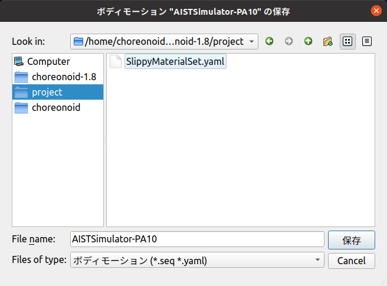

====================================
File I/O for Project Items
====================================

.. contents:: Table of Contents
   :local:

.. highlight:: cpp

Overview
--------

Sometimes you may want to load project item states and data from files, or save them to files.
This is different from the project file that is the target of :doc:`item-project-save`, and targets independent files specialized for certain data. This section explains how to implement such file input/output for project items.

.. _plugin-dev-item-file-io-example:

Examples of File Input/Output
-----------------------------

To understand the implementation method for file input/output, let's first introduce examples of file input/output in existing project items to grasp the implementation image.

The first existing item that uses file input (loading) is the Body Item.
As you may already know if you've used Choreonoid, Body Items are usually created by loading :doc:`../handling-models/modelfile/index`. This operation can be performed through the file dialog displayed from the main menu "File" - "Load" - "Body".

For Body Items, when saving a project, they don't save their model data directly to the project file, but only record referential information such as the model file name. When reloading the project, the same model is restored by loading model data from the external model file.

In this way, file input plays an important role in Body Items, and it's no exaggeration to say that items exist because of this. (Note that Body Items can also output files in the latest version of Choreonoid, but we'll omit details here as it becomes somewhat complex.)

There are also items that perform file output (writing) in addition to input. For example, the "Body Motion Item" that stores motion trajectories such as simulation results has the functionality to output motion trajectories to dedicated "Body Motion Files". The output file can be loaded later to reproduce the same motion trajectory.

Let's try this. First, load a project to perform simulation. It can be anything, but here we'll use PA10Pickup, which is often used in this guide, as an example. When you run a simulation with PA10Pickup, the items under PA10 will have the following structure:

.. code-block:: text

 + PA10
   + SimpleController
     + AISTSimulator-PA10

Here "AISTSimulator-PA10" is the Body Motion Item containing the simulation results. Select this item and execute "Save Selected Item" from the main menu "File". The following file save dialog will be displayed:

Select an appropriate directory and press the "Save" button. The motion trajectory data will be saved to a file. In this case, the default file name is "AISTSimulator-PA10.seq". The file format is :doc:`../reference/body-motion`.

Next, let's load the saved motion file. Delete the Body Motion Item or reload the project to get to a state without the Body Motion Item. Then select the PA10 or SimpleController item and execute "File" - "Load" - "Body Motion" from the main menu. The following file load dialog will be displayed:

.. image:: images/load-bodymotion.png
    :scale: 70%

Select the previously saved motion file "AISTSimulator-PA10.seq" and press the "Load" button. The Body Motion Item will be loaded under PA10, and the item tree will be in the same state as right after the simulation. The loaded item actually contains the same motion trajectory data as before. You can confirm this by selecting the item and operating the time bar.

Furthermore, let's save the project in this state. Information about the Body Motion Item "AISTSimulator-PA10" being "loaded from motion file 'AISTSimulator-PA10.seq'" will be saved to the project file. When you reload the saved project file, the body motion file will be loaded into the generated Body Motion Item, restoring the same data as before.

.. note:: If you save the project immediately after simulation, the Body Motion Item "AISTSimulator-PA10" will not be saved to the project. This is because the Body Motion Item from simulation results has the "Temporal" attribute by default, making it a temporary item. (See :ref:`plugin-dev-item-basic-attributes`.) By performing the "Save Selected Item" operation, the Temporal attribute is removed and it can be saved to the project file.

As seen in this Body Motion Item example, when items support both file input and output, it becomes possible to retain data generated in Choreonoid.

We've introduced two item types that perform file input/output, but many other items available in Choreonoid also have file input/output functionality. The main applicable item types are shown below. (The types of target files are in parentheses.)

* Items that perform file input

  * Body Item (model files)

  * Material Item (material files)

  * Scene Item (3D model/mesh files)

  * Python Script Item (Python scripts)

  * Media Item (video/audio files)

* Items that perform file input/output

  * Body Motion Item (body motion files)

  * Pose Sequence Item (pose sequence files)

  * Point Set Item (point cloud files)

Note that if you only need to save and restore item states, :doc:`item-project-save` can handle this, so file input/output is not necessarily required. Whether an item should support file input/output can be determined by the following criteria:

1. When you want to use existing files
2. When you want to use data outside of Choreonoid
3. When the data size is large

For 1, making the item able to load that file is the quickest solution.
Among the item types above, many including Body Item, Scene Item, Python Script Item, Media Item, and Point Set Item fall into this category. This can be said to be the popular reason for items to support file input.

For 2, which is the reverse of 1, when data generated in Choreonoid is useful externally, it's common to make it available externally through files. It's also possible to edit with external tools and use again in Choreonoid. Among the item types above, Body Motion Item particularly applies. For example, you might display or analyze simulation results with external tools.

For 3, although 1 and 2 often apply simultaneously, it's still an item to consider even when they don't necessarily apply. If you only need to save and restore projects, you could save all data within the project file using :doc:`item-project-save`. However, when data size is large, writing that part to external files makes projects easier to handle. Also, while project files are YAML format text data, binary format may be more suitable for large data.

For custom item types introduced in plugins, if the above items apply, please consider implementing file input/output.

.. _plugin-dev-item-io-function-registration:

Registering File Input/Output Functions
---------------------------------------

To make an item type support file input/output, use the `ItemManager <https://choreonoid.org/en/documents/reference/latest/classcnoid_1_1ItemManager.html>`_ used in :ref:`plugin-dev-item-type-registration` to register input (loading) and output (saving) functions.

First, file loading functions (loaders) can be registered with the following template function: ::

 template <class ItemType>
 ItemManager& addLoader(
     const std::string& caption, const std::string& format, const std::string& extensions, 
     typename FileFunction<ItemType>::Function function, int usage = Standard);

The meaning of each argument is shown below:

* **ItemType** (template argument)

  * Specifies the target item class.

* **caption**

  * Specifies a string representing the file type.

* **format**

  * Specifies a string representing the file format.

* **extensions**

  * Specifies file extensions (omit the leading dot).

  * If multiple apply, separate with semicolons.

* **function**

  * Specifies the file loading function (loader).

* **usage**

  * Specifies how the registered loader is used. The value is one of the following defined in ItemManager's enumeration type IoUsageType:

    * **Standard**: Standard usage.

    * **Conversion**: Conversion usage. For loading, this is so-called "import".

    * **Internal**: Mainly used from plugin program code.

The loader format is specified by the FileFunction class. When the item type is ItemType, it becomes the following function object: ::

 std::function<bool(ItemType* item, const std::string& filename, std::ostream& os, Item* parentItem)

The meaning of each argument of this function is shown below:

* **item**

  * The item to load the file into.

* **filename**

  * The filename (filepath) of the target file.

* **os**

  * Output stream for outputting messages.

  * Used to output text messages notifying status, warnings, errors, etc. during file loading.

* **parentItem**

  * Set to this argument if there is a parent item.

  * Includes cases where it becomes the parent after successful loading.

The function's return value indicates the success or failure of file loading. Return true for success, false for failure.

Loader function registration is usually done from the plugin's initialize function, similar to :ref:`plugin-dev-item-type-registration`. For example, suppose the following function is defined to load FooItem data from a file: ::

 bool loadFooData(FooItem* item, const std::string& filename, std::ostream& os, Item* parentItem);

The content of this function can be implemented in any way as long as it loads the file specified by filename as data for item.

This can be registered as a FooItem loader with code like: ::

 itemManager().addLoader<FooItem>("Foo Data", "FOO-DATA", "dat", loadFooData);

Note that the target item type itself must be registered with ItemManager before registering the loader. Also, multiple loaders can be registered for the same item type. This allows you to register loaders for each file format and support multiple file formats.

File writing (saving) functions (savers) can be registered with the following template function: ::

 template<class ItemType>
 ItemManager& addSaver(
     const std::string& caption, const std::string& format, const std::string& extensions,
     typename FileFunction<ItemType>::Function function, int usage = Standard);

The arguments are the same as the addLoader function. The only difference is that the registered function is for writing rather than loading. The type of function specified in function is also the same as addLoader.

When registering both a loader and saver for the same file format, you can register them simultaneously with the following ItemManager function: ::

 template<class ItemType>
 ItemManager& addLoaderAndSaver(
     const std::string& caption, const std::string& format, const std::string& extensions,
     typename FileFunction<ItemType>::Function loaderFunction,
     typename FileFunction<ItemType>::Function saverFunction,
     int usage = Standard);

Specify the loading function and saving function in loaderFunction and saverFunction respectively.
Other arguments are common specifications for both.

Usage from GUI
--------------

When you register input/output functions, users can load and save items using them from Choreonoid's GUI.

First, for input functions (loaders), the registered loader's caption is added to the "File" - "Load" category in the main menu. By selecting it and choosing a file from the displayed dialog, item loading is performed using the corresponding loader. For output functions (savers), they become available from "File" - "Save Selected Items As". These are similar to what was shown in :ref:`plugin-dev-item-file-io-example`.

Note that when multiple savers are registered for an item type, the registered savers are included in the "Files of type" combo box in the save dialog for "Save Selected Items As" targeting that item type. Users can specify the file format when saving by selecting from this combo box.

The above is the behavior when the usage argument is set to the default "Standard" during registration. On the other hand, when registering with "Conversion" specified for usage, it will be used from different menu items than the Standard case. Specifically, for loaders, the registered loader item is added to the "File" - "Import" category in the main menu, so use it from there. For savers, items are added to "File" - "Export Selected Items", so use them from there. Unlike "Save Selected Items As", even when multiple savers are registered as Conversion, they are separated at the menu item level. Therefore, even when there are multiple export formats, which format to use is determined at the time of menu selection.

Whether to register as Standard or Conversion is left to the developer's judgment. If you can judge that the target file format of the loader or saver to register is a standard file format when used in Choreonoid, register it as Standard. On the other hand, if you judge it's not a standard format in Choreonoid, making it Conversion allows users to have the same recognition. This is effective in avoiding confusion when many file formats are available for a certain item type.

Note that if "Internal" is specified as an argument during registration, it cannot be used from the GUI. In this case, it can only be used through "Usage from Programs" explained next.

.. _plugin-dev-item-file-io-function-program-use:

Usage from Programs
-------------------

Registered loaders and savers can also be used from programs. At that time, rather than directly executing the loader or saver functions themselves, by executing through prescribed functions of the Item class, you can load and save items using a unified method integrated with the Choreonoid framework. This allows unified management of file-related information and makes program code consistent, so normally use this method.

.. _plugin-dev-item-file-loading-function:

Loading Files
~~~~~~~~~~~~~

Item loading can be achieved with the following functions of the `Item class <https://choreonoid.org/en/documents/reference/latest/classcnoid_1_1Item.html>`_: ::

 bool load(const std::string& filename,
           Item* parent,
           const std::string& format = std::string(),
           const Mapping* options = nullptr);

The meaning of each argument of this function is shown below:

* **filename**

  * Specifies the filename (filepath) to load.

* **parent**

  * Specifies the parent item.

  * When the item has just been created and doesn't belong to the item tree yet, and will be added to the tree after successful loading, specify the item to add to.

  * If file loading is complete with just the item alone, this argument has no particular meaning, but for some item types where loading depends on higher-level items, it needs to be specified.

* **format**

  * Specifies the string representing the file format specified during registration.

  * If omitted, one matching the file extension is selected.

  * An error occurs if the file format cannot be determined.

* **options**

  * Specifies options related to loading in Mapping format.

  * Specify nullptr if there are no options. The default value is also nullptr, which is usually fine.

  * Details of this argument are explained in :ref:`plugin-dev-itemfileio` in :doc:`item-creation-io-customization`.

Regarding the parent argument, as you can understand from the above explanation, it's not always necessary. If you know in advance that it's not needed, you can also use the following overloaded function that omits the parent argument: ::

 bool load(const std::string& filename,
           const std::string& format = std::string(),
           const Mapping* options = nullptr);

These load functions internally call the corresponding loader function to perform file loading processing. On successful loading, the item content is updated and true is returned. On failure, false is returned. Loaders with usage set to Internal during registration can also be used through these functions.

For example, program code to create a Body Item and load a model file would be: ::

 BodyItemPtr bodyItem = new BodyItem;
 bodyItem->load("robot.body");

Here we omit format since the filename includes an extension. Also, parent item information is not needed for model loading, so that's omitted too. Many items can load files with such simple notation. Note that we haven't particularly considered file paths here, assuming the file exists in the current directory, but of course you need to specify appropriately including file paths in actual use.

Saving Files
~~~~~~~~~~~~

For items with registered saver functions, you can save their content to files with the following function: ::

 bool save(const std::string& filename,
           const std::string& format = std::string(),
           const Mapping* options = nullptr);

This function can be used similarly to the load function. Unlike the load function, when saving files the item is usually already incorporated into the item tree, so you don't explicitly specify a parent item. Specify other arguments the same as the load function. When executing the function, the corresponding saver function is called internally to perform file writing processing, and true is returned on success.

Getting File Information
~~~~~~~~~~~~~~~~~~~~~~~~

For items that have performed file input/output in the prescribed way (using the GUI usage above or load/save functions), you can get information about the (last input/output) file with the following functions of the `Item class <https://choreonoid.org/en/documents/reference/latest/classcnoid_1_1Item.html>`_:

* **const std::string& filePath() const**

  * Returns the file path.

* **std::string fileName() const**

  * Returns only the filename part (without directory).

* **const std::string& fileFormat() const**

  * Returns the string representing the file format (specified as format during registration).

* **const Mapping* fileOptions() const**

  * Returns options during file loading/writing.

* **std::time_t fileModificationTime() const**

  * Returns the file modification time.

This information can be referenced and used from any location as needed.

.. _plugin-dev-item-file-io-overwrite:

File Overwrite Processing
-------------------------

When an item type supports both file input and output, you can perform a file "overwrite" operation.
This overwrites the file that was the target of the last input/output for an item that has performed file input/output in the prescribed way with the current item content. This is actually the same as saving the item to the same file.

First, to perform an overwrite operation from the GUI, select the target item and execute "Save Selected Item" from the main menu "File". If the item meets the above conditions, the target file will be overwritten.

This operation can also be performed from programs. In that case, use the following function of the `Item class <https://choreonoid.org/en/documents/reference/latest/classcnoid_1_1Item.html>`_: ::

 bool overwrite(bool forceOverwrite = false, const std::string& format = std::string());

Usually execute with all default arguments (i.e., no arguments). Then overwriting is actually executed "only when overwriting is necessary".

The conditions for needing overwriting are any of the following:

1. The item content was updated after the last file input/output
2. The current file's last update time is later than when the last file input/output was performed
3. The item has never been saved to a file after being newly created

Condition 1 means that operations that change the item content were performed in Choreonoid after file input/output, and the content of the file where the item was saved also changes. However, it's difficult to automatically determine whether such things were actually done.
Therefore, when the program side that operates items performs updates that affect file content, notify this with the following Item class function: ::

 void suggestFileUpdate();

Executing this function updates a flag inside the item, recording that there's a difference between the item content and file content. This can be determined with the following Item class function: ::

 bool isConsistentWithFile() const;

When this function returns true, it means the file from the last input/output and the item content are the same. When false, it means there's a difference between them.

Condition 2 means the file was updated from outside Choreonoid after file input/output. It's judged that due to that update, there's a high possibility that the content in Choreonoid and the file content differ.

When conditions 1 or 2 above hold, it's judged that "file overwriting is necessary", and the overwrite function actually performs overwrite processing. If the conditions don't hold, overwrite processing is skipped.

For 3, since an existing file doesn't exist yet, it's not actually "overwriting", but this also becomes a target of the "overwrite operation". In this case, when performing an overwrite operation, a file save dialog is displayed, and when you specify a filename there, the file is saved. In the sense that the current item content is written to a file, the behavior is the same as overwriting.

When the "forceOverwrite" argument of the above overwrite function is true, overwrite processing is always executed. The overwrite function can also specify the file format with the format argument, and overwrite processing is executed when the specified file format differs from the last input/output file format.

Item file overwriting also applies in :ref:`basics_project_save`. When saving a project, if there are items that meet the above "conditions for needing overwriting", file overwrite processing is automatically executed for each applicable item. (When condition 3 applies, a file save dialog is displayed, so it's not completely automatic.) With this processing, when editing operations are performed on items included in a project, the editing results can be saved all at once with project saving. This is the most effective use of overwrite processing and is a frequently executed process in actual Choreonoid usage.

To make such overwrite processing function correctly, it's necessary to appropriately execute the suggestFileUpdate function mentioned above.
When operating items that can perform file input/output in plugin implementation, please pay careful attention to this.
This applies not only when adding custom item types in plugins but also when operating existing items.

.. _plugin-dev-item-file-info-project-save:

Recording File Information to Project Files
-------------------------------------------

Even when introducing file input/output to items, :doc:`item-project-save` is still necessary. Even if all item data is saved to files, you can't restore items without loading those files. And to load files, you first need the target item, and also need information such as file paths and file formats. That information still needs to be saved in the project file, and when restoring the project, items are created and files are loaded based on that information.

To achieve this, you need to record file information and load files in the item's :ref:`plugin-dev-state-store-restore-functions`. Below we explain this method. The explanatory code is an example of an item type called FooItem.

First, the store function for state saving requires the following implementation: ::

 bool FooItem::store(Archive& archive)
 {
     bool stored = false;
     if(overwrite()){
         if(archive.writeRelocatablePath("file", filePath())){
             archive.write("format", fileFormat());
             stored = true;
         }
     }
     return stored;
 }

Here we first attempt file overwriting with: ::

 if(overwrite()){

Items that perform both file input and output usually perform this file overwrite processing in the store function. If the item only supports file input, this processing is not necessary.

When overwriting succeeds: ::

 archive.writeRelocatablePath("file", filePath())

converts the file path to a relocatable format and records it in the project file with the key "file".
Here we achieve this with the writeRelocatablePath function introduced in :ref:`plugin-dev-relocatable-filepath-functions` of :ref:`plugin-dev-archive-class`. Furthermore: ::

 archive.write("format", fileFormat());

also records the file format.
You may not feel the necessity for this since only one file format is registered this time.
Multiple file formats may exist, and to distinguish file formats even in that case, we usually record this information in the project file.

In Choreonoid project files, it's customary to use the key "file" for file paths and "format" for file formats. Using the same keys for custom item types you create will help maintain consistency.

Note that this implementation can also be written as follows using the writeFileInformation function introduced in :ref:`plugin-dev-file-io-functions` of :ref:`plugin-dev-archive-class`: ::

 bool FooItem::store(Archive& archive)
 {
     bool stored = false;
     if(overwrite()){
         stored = archive.writeFileInformation(this);
     }
     return stored;
 }

The writeFileInformation function writes file path and file format information the same as above.
Using this function allows more concise notation. When the target item type only supports file input, the overwrite processing is omitted, so: ::

 bool FooItem::store(Archive& archive)
 {
     return archive.writeFileInformation(this);
 }

can output all necessary information (regarding files).

The restore function for state restoration requires the following implementation: ::

 bool FooItem::restore(const Archive& archive)
 {
     bool restored = false;
     string file;
     if(archive.readRelocatablePath("file", file)){
         string format;
         archive.read("format", format);
         restored = load(file, format);
     }
     return restored;
 }

Here we perform almost the reverse processing of the store function. First: ::

 string file;
 if(archive.readRelocatablePath("file", file)){

assumes a relocatable file path is stored with the key "file" and expands any path variables.
This uses the readRelocatablePath function introduced in :ref:`plugin-dev-relocatable-filepath-functions` of :ref:`plugin-dev-archive-class`. When this succeeds: ::

 string format;
 archive.read("format", format);

loads the file format. Using this information: ::

 restored = load(file, format);

performs file loading.
Here we use the load function introduced in :doc:`item-file-io` - :ref:`plugin-dev-item-file-loading-function`.

This processing can also be written more concisely.
That uses the loadFileTo function introduced in :ref:`plugin-dev-file-io-functions` of :ref:`plugin-dev-archive-class`.
Using this, the restore function can be written as: ::

 bool FooItem::restore(const Archive& archive)
 {
     return archive.loadFileTo(this);
 }

This notation can execute all necessary processing (regarding files).

The above code assumes typical items that perform file input/output, but depending on the configuration of file input/output related to items, the above code may not be simply applicable. Even in such cases, referring to the above code, perform information recording and file loading according to the situation.