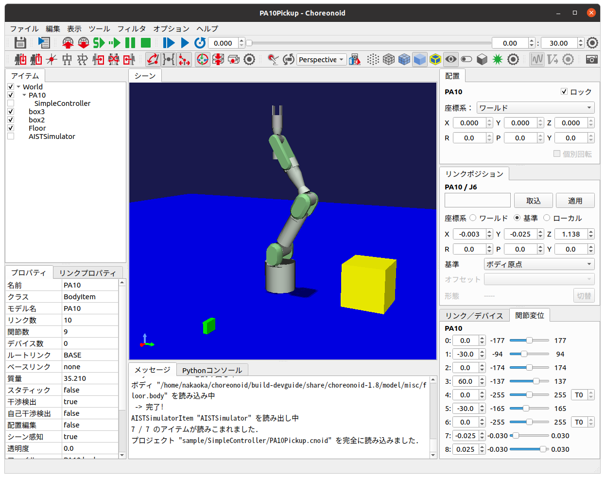

Project Item Operation Sample (S03)
===================================

.. contents:: Table of Contents
   :local:

Overview
--------

Here we present a simple sample that manipulates project items. This sample includes examples of the three levels of item utilization mentioned in the previous section:

1. Perform basic item operations using Item class functionality
2. Perform operations related to specific data and processing using individual item type functionality
3. Define and implement your own item types to enable custom data and processing

This example includes levels 1 and 2.

For level 1 operation, we "get items of a specific item type that are selected". The target item type here is Body items that correspond to robot and environment models. As an example of level 2, we rotate the models of the obtained Body items in synchronization with the time bar. This part is developed from the previously presented :doc:`signal-sample`.

Through this sample, you can learn how to manipulate existing items while utilizing signals.

Source Code
-----------

.. highlight:: cpp

As with previous samples, create a plugin source directory and create the following source code with the filename DevGuidePlugin.cpp: ::

 #include <cnoid/Plugin>
 #include <cnoid/ConnectionSet>
 #include <cnoid/ItemList>
 #include <cnoid/RootItem>
 #include <cnoid/BodyItem>
 #include <cnoid/TimeBar>
 #include <cnoid/EigenTypes>
 #include <vector>
 
 using namespace cnoid;
 
 class DevGuidePlugin : public Plugin
 {
    ScopedConnectionSet connections;
    ItemList<BodyItem> bodyItems;
    std::vector<Matrix3> initialRotations;
 
 public:
     DevGuidePlugin() : Plugin("DevGuide")
     {
         require("Body");
     }
 
     virtual bool initialize() override
     {
         connections.add(
             RootItem::instance()->sigSelectedItemsChanged().connect(
                 [this](const ItemList<>& selectedItems){
                     onSelectedItemsChanged(selectedItems);
                 }));
 
         connections.add(
             TimeBar::instance()->sigTimeChanged().connect(
                 [this](double time){
                     return onTimeChanged(time);
                 }));
 
         return true;
     }

     void onSelectedItemsChanged(ItemList<BodyItem> selectedBodyItems)
     {
         if(selectedBodyItems != bodyItems){
             bodyItems = selectedBodyItems;
             initialRotations.clear();
             for(auto& bodyItem : bodyItems){
                 Body* body = bodyItem->body();
                 Link* rootLink = body->rootLink();
                 initialRotations.push_back(rootLink->rotation());
             }
         }
     }
 
     bool onTimeChanged(double time)
     {
         for(size_t i=0; i < bodyItems.size(); ++i){
             auto bodyItem = bodyItems[i];
             Matrix3 R = AngleAxis(time, Vector3::UnitZ()) * initialRotations[i];
             bodyItem->body()->rootLink()->setRotation(R);
             bodyItem->notifyKinematicStateChange(true);
         }
 
         return !bodyItems.empty();
     }
 };
 
 CNOID_IMPLEMENT_PLUGIN_ENTRY(DevGuidePlugin)

For building, the CMakeLists.txt when building in the Choreonoid build environment should be written as follows:

.. code-block:: cmake

 choreonoid_add_plugin(CnoidDevGuidePlugin DevGuidePlugin.cpp)
 target_link_libraries(CnoidDevGuidePlugin PUBLIC CnoidBodyPlugin)

Note that one line has been added compared to what we've used in previous samples.

When building independently from Choreonoid, use the following:

.. code-block:: cmake

 cmake_minimum_required(VERSION 3.10)
 project(DevGuidePlugin)
 find_package(Choreonoid REQUIRED)
 set(CMAKE_CXX_STANDARD ${CHOREONOID_CXX_STANDARD})
 choreonoid_add_plugin(CnoidDevGuidePlugin DevGuidePlugin.cpp)
 target_link_libraries(CnoidDevGuidePlugin PUBLIC Choreonoid::CnoidBodyPlugin)

Running the Plugin
------------------

To execute this plugin's functionality, first load a project that includes Body items. Basically any project containing Body items will work. You can create a new project and load appropriate Body files, or load existing project files. Preferably, having multiple Body items loaded will make the plugin's behavior clearer.

If you're not sure what to load, loading PA10Pickup.cnoid, a sample included with Choreonoid, would be good. This file is in the sample/SimpleController directory of the source directory. If installed, it's in the project directory under the share directory of the installation destination. Loading this sample results in the following screen:

Below, we'll explain the operation method using this sample.

First, click on PA10 in the item tree view to select it. In that state, operate the time bar slider. The PA10 model will spin according to the slider operation.

The rotation target is the selected item. Next, hold the Ctrl key and click box3 in the item tree view to additionally select box3. Then operate the time bar. This time, PA10 and the green box rotate simultaneously.

Similarly, try additionally selecting box2 and Floor. All selected items should spin.

This behavior is linked to the current time of the time bar, so it works even when changing the time with other time bar operations. For example, entering an appropriate value in the time input spinbox of the time bar will directly change to the rotation position corresponding to that time. Also, pressing the play button on the time bar will animate the selected models rotating.

In this way, we've been able to implement the function of "rotating selected Body items in synchronization with the time bar" through the plugin. While this function itself doesn't have much meaning, this can be applied to add various other operations and processing to models in Choreonoid through plugins.

Source Code Explanation
-----------------------

For this sample as well, we'll skip explanations of parts covered in previous samples and explain newly introduced parts. ::

 #include <cnoid/ConnectionSet>

Since this sample uses the ScopedConnectionSet class, we need to include this header.
This makes the ConnectionSet and ScopedConnectionSet classes available. ::

 #include <cnoid/ItemList>

We include this header to use :ref:`plugin-dev-item-operations-item-list` for getting and storing target items. ::

 #include <cnoid/RootItem>

Header for RootItem used to get selected items. ::

 #include <cnoid/BodyItem>

Header for Body items that are the operation targets in this example. ::

 #include <cnoid/EigenTypes>

Includes matrix and vector related definitions needed to rotate model poses. Choreonoid uses the linear algebra library Eigen for storing and calculating matrices and vectors, and this header defines the main Eigen-related types used in Choreonoid. This is also included when including the BodyItem header, but we explicitly include it here. Eigen will be explained separately. ::

 #include <vector>

This sample also uses std::vector. This is actually included from other headers as well, but we explicitly include it.

The following is code within the plugin class. First, we define three member variables: ::

 ScopedConnectionSet connections;

Since this sample connects two signals to the plugin's slot functions, we use ScopedConnectionSet for connection management to handle multiple Connection objects. ::

 ItemList<BodyItem> bodyItems;

ItemList for storing Body items that are operation targets. Since BodyItem is specified as the template argument, this becomes a list that stores only this type. ::

 std::vector<Matrix3> initialRotations;

Array of 3x3 matrices to store the initial poses (rotations) of Body models that are operation targets. The matrix type is Matrix3, defined in the EigenTypes header mentioned above. ::

 DevGuidePlugin() : Plugin("DevGuide")
 {
     require("Body");
 }

Constructor. While previous samples only initialized the Plugin class, this sample adds: ::

 require("Body");

This tells the system that this plugin depends on the Body plugin. Since the Body items used in this sample are defined in the Body plugin, there is a dependency on it. When a plugin depends on another plugin like this, you need to inform the system using the require function in the plugin's constructor. The dependent plugin is specified by a string containing only the main part of the plugin name (only the ~ part of ~Plugin).

As a result, this plugin's initialize function will always be executed after the Body plugin's initialize function. Incidentally, if the Body plugin initialization fails, this plugin will also become unavailable.

Next, let's look at the code in the initialize function: ::

 connections.add(
      RootItem::instance()->sigSelectedItemsChanged().connect(
          [this](const ItemList<>& selectedItems){
              onSelectedItemsChanged(selectedItems);
          }));

Here we connect the signal that notifies changes in selected items to the plugin class's onSelectedItemsChanged function. We use sigSelectedItemsChanged, a RootItem signal introduced in :doc:`item-operations` under :ref:`plugin-dev-item-operations-signals`. When item selection states change due to user operations, this signal is emitted and the currently selected items are passed in an ItemList. We also add the Connection object returned by the connect function to connections for connection management using ScopedConnectionSet.

Let's first look at the onSelectedItemsChanged function connected to this signal: ::

 void onSelectedItemsChanged(ItemList<BodyItem> selectedBodyItems)
 {
     if(selectedBodyItems != bodyItems){
         bodyItems = selectedBodyItems;
         initialRotations.clear();
         for(auto& bodyItem : bodyItems){
             Body* body = bodyItem->body();
             Link* rootLink = body->rootLink();
             initialRotations.push_back(rootLink->rotation());
         }
     }
 }

First, the argument of this function is ItemList<BodyItem>. The signal's argument is ItemList<>, so the types differ, but as explained in :ref:`plugin-dev-item-operations-item-list`, in this case only BodyItem type items are copied and passed during argument passing. ::

 if(selectedBodyItems != bodyItems){

bodyItems is the list of Body items that were operation targets until now. We compare this with the detected selectedBodyItems, and if they differ, we perform update processing for bodyItems. ::

 bodyItems = selectedBodyItems;

Update bodyItems with the selected Body items. These become the new operation targets. ::

 initialRotations.clear();

Clear the initial pose list to reset initial poses for the new operation target models. ::

 for(auto& bodyItem : bodyItems){

Repeat the following for all Body items that are operation targets: ::

 Body* body = bodyItem->body();

The `BodyItem class <https://choreonoid.org/en/documents/reference/latest/classcnoid_1_1BodyItem.html>`_ has an object of the `Body class <https://choreonoid.org/en/documents/reference/latest/classcnoid_1_1Body.html>`_ as a member, which can be obtained through the getter function body. This object is the actual :doc:`../handling-models/bodymodel`, and Body items can be said to be for making Body objects available as project items. Operations on the Body model itself are performed by first getting the body object like this. ::

 Link* rootLink = body->rootLink();

Since this sample manipulates the position of the entire Body model, i.e., the position of the root link, we get the root link object here. This is an object of the `Link class <https://choreonoid.org/en/documents/reference/latest/classcnoid_1_1Link.html>`_. ::

 initialRotations.push_back(rootLink->rotation());

The Link class member function rotation can get the current pose (rotation) of that link as a Matrix3 type 3x3 matrix value. Here we add that value to the initialRotations array. These are stored for the number of selected Body items. Using this array, we save the state when item selection changes as the initial state and apply rotation processing to them. This allows rotation to start smoothly from the current pose regardless of the time bar time.

Returning to the initialize function, let's look at the remaining initialization processing: ::

 connections.add(
     TimeBar::instance()->sigTimeChanged().connect(
         [this](double time){
             return onTimeChanged(time);
         }));

We also use the time bar's sigTimeChanged signal used in :doc:`signal-sample` in this sample. In this sample as well, onTimeChanged is called when the time bar time changes. We also manage this connection with connections.

The connected function is as follows: ::

 bool onTimeChanged(double time)
 {
     for(size_t i=0; i < bodyItems.size(); ++i){
         auto bodyItem = bodyItems[i];
         Matrix3 R = AngleAxis(time, Vector3::UnitZ()) * initialRotations[i];
         bodyItem->body()->rootLink()->setRotation(R);
         bodyItem->notifyKinematicStateChange(true);
     }
 
     return !bodyItems.empty();
 }

Here we perform rotation processing for the target Body items. First: ::

 for(size_t i=0; i < bodyItems.size(); ++i){
     ...

repeats the following processing for the number of target items. ::

 auto bodyItem = bodyItems[i];

Gets the i-th BodyItem object stored in bodyItems.

.. note:: Since ItemList has ref_ptr type as elements, the above code is actually processed as: ::

  ref_ptr<BodyItem> bodyItem = bodyItems[i];

 On the other hand, writing: ::

  auto bodyItem = bodyItems[i].get();

 extracts a raw pointer. That is: ::

  BodyItem* bodyItem = bodyItems[i].get();

 However, ref_ptr can be implicitly converted to raw pointers, so you can also write without get: ::

  BodyItem* bodyItem = bodyItems[i];

 In this way, ref_ptr can be treated like raw pointers.
 For items already held by ref_ptr (from parent items, ItemList, etc.), there's no problem using raw pointers for temporary references. This makes the notation more concise and eliminates reference counter processing overhead. This applies not only to items but to all Referenced type objects. In fact, Body and Link used in this sample are also Referenced type classes, and the same applies.

.. note:: However, implicit conversion from smart pointers to raw pointers is generally considered bad practice. Mixing both is also generally not good. Referenced types have built-in reference counters, so problems are less likely compared to other types, but it's desirable to use them understanding what's actually happening.

Next, we calculate the pose after rotation with the following code: ::

 Matrix3 R = AngleAxis(time, Vector3::UnitZ()) * initialRotations[i];

Here we add rotation using AngleAxis, an Eigen type. AngleAxis can be created with the constructor: ::

 AngleAxis(rotation angle, rotation axis)

Give a scalar value in radians for the rotation angle and a 3D vector for the rotation axis.

Here we use the current time directly as the angle value, give a unit vector in the Z-axis direction with Vector3::UnitZ(), and generate a transformation that rotates time radians around the Z-axis.
Then by applying this rotation to each body's initial pose initialRotations[i], we determine the pose corresponding to the current time. ::

 bodyItem->body()->rootLink()->setRotation(R);

Reset the calculated pose as the root link's pose. ::

 bodyItem->notifyKinematicStateChange(true);

Notify that the pose has changed. The BodyItem class has a signal as a member: ::

 SignalProxy<void()> sigKinematicStateChanged();

This signal is emitted when the kinematic state of the Body model, i.e., position, velocity, pose, etc., changes. notifyKinematicStateChange causes this signal to be emitted. Various view update processes that display and edit the model state, and processes that update the model drawing in the scene view, are connected as slots to this signal. Therefore, when this signal is emitted, those related processes are also executed, and the latest state of the model is reflected. Here, the pose with rotation applied will actually be reflected in the scene view, etc.

Note that notifyKinematicStateChange can also be called without arguments, but by giving true as the first argument as in this example, forward kinematics calculation from the root link is performed before signal emission. When the Body model is a multi-link model with joints, adding this processing correctly updates the positions of links after the root. This is the same processing as: ::

 bodyItem->body()->calcForwardKinematics();
 bodyItem->notifyKinematicStateChange();

This function returns the following return value: ::

 return !bodyItems.empty();

This becomes true when there are target Body items, but false when there are no targets.
With this return value, animation continues as long as there are target Body items.

Adding Dependent Libraries in CMakeLists.txt
--------------------------------------------

.. highlight:: cmake

In the CMakeLists.txt for building this sample, in addition to previous samples, we need to add: ::

 target_link_libraries(CnoidDevGuidePlugin PUBLIC CnoidBodyPlugin)

This is a description for linking with the Body plugin library. As mentioned above, this sample depends on the Body plugin. This means that this plugin's binary also depends on the Body plugin's binary. That is, it must link with the Body plugin library file. However, since not all plugins necessarily depend on the Body plugin, just writing choreonoid_add_plugin doesn't link to the Body plugin.

Therefore, we use target_link_libraries, a built-in CMake command, to explicitly specify libraries to link.
In this command, specify the target as the first argument, then list targets or libraries to link.
As supplemented in :ref:`plugin-dev-cmake-description-basics`, you need to write either "PUBLIC" or "PRIVATE" keyword before targets or libraries to link.

Here, since we're building the plugin simultaneously in the Choreonoid build environment, the Body plugin is also being built simultaneously as a CMake build target.
Its name is "CnoidBodyPlugin", so by specifying it this way, it links to the Body plugin.

When building independently from Choreonoid, we're doing the same thing. However, the target name is specified as: ::

 Choreonoid::CnoidBodyPlugin

which is slightly different from when building in the main build environment.

This is because when obtaining library information through find_package, Choreonoid's config file provides information in the form of CMake's "imported library". For imported libraries, it's CMake convention to use "package_name::library_name" like this.