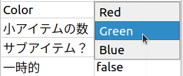
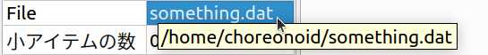
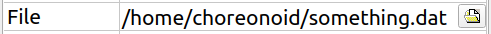
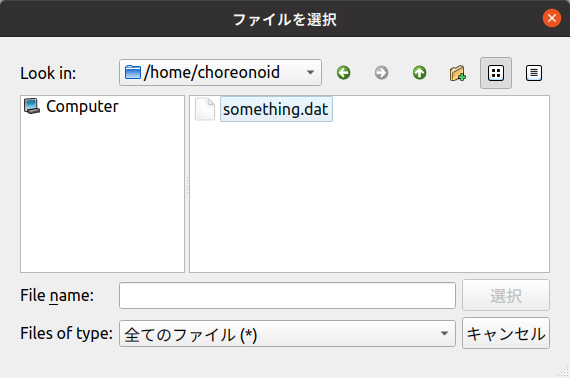
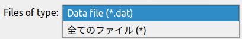

================================
Project Item Properties
================================

.. contents:: Table of Contents
   :local:

.. highlight:: cpp

Overview
--------

Project items have a mechanism called "properties" for accessing their internal states and settings.
Using this mechanism, any item type can have its states and settings viewed/edited through the unified interface of the :ref:`basics_mainwindow_item_property_view`.
Properties are easy to implement and can be conveniently viewed and edited in the property view, making them a convenient mechanism for both developers and users of items.

This section explains how to implement properties in items based on this mechanism.

Property Output Function
------------------------

The central role in the property mechanism is played by the following function of the `Item class <https://choreonoid.org/en/documents/reference/latest/classcnoid_1_1Item.html>`_: ::

 void putProperties(PutPropertyFunction& putProperty);

This is a function called when accessing properties, and item properties are output through the putProperty object argument from this function. The item property view also uses this function to get property information.

The Item class also defines another property-related function: ::
  
 virtual void doPutProperties(PutPropertyFunction& putProperty);

This is a virtual function that is overridden and implemented in subclasses of the Item class.
It is called from inside the putProperties function.
By implementing this function, you can output properties specific to each item type.

The above configuration can be summarized as follows:

* Project item properties are output by the putProperties function of the Item class.

* Properties specific to each item type are implemented by overriding the virtual function doPutProperties of the Item class.

* The putProperties function outputs properties common to item types and also executes the doPutProperties function to output properties specific to individual item types.

Therefore, to implement properties specific to an item type, you just need to implement the doPutProperties function in the corresponding class.

.. _plugin-dev-put-property-function:

Outputting Properties with PutPropertyFunction
----------------------------------------------

Properties are output through the putProperty object argument of the doPutProperties function.
This is an object of the `PutPropertyFunction class <https://choreonoid.org/en/documents/reference/latest/classcnoid_1_1PutPropertyFunction.html>`_. This class is an abstract class that functions as an interface class, with various functions for property output defined in the form of function call operators.

This class is defined in the PutPropertyFunction header, so include this header as follows when using it: ::

 #include <cnoid/PutPropertyFunction>

PutPropertyFunction defines the following functions (function call operators) for simply outputting property values:

* **void operator() (const std::string& name, bool value)**

  * Outputs a bool type property.
  * name is the property name, value is the value to output (same below).
  
* **void operator() (const std::string& name, int value)**

  * Outputs an int type property.

* **void operator() (const std::string& name, double value)**

  * Outputs a double type property.

* **void operator() (const std::string& name, const std::string& value)**

  * Outputs a string (std::string) type property.
  
* **void operator() (const std::string& name, const Selection& selection)**

  * Outputs a property that selects one from several choices.

  * Outputs as a value of the `Selection class <https://choreonoid.org/en/documents/reference/latest/classcnoid_1_1Selection.html>`_.

* **void operator() (const std::string& name, const FilePathProperty& filepath)**

  * Outputs a file path property.

  * Outputs as a value of the `FilePathProperty class <https://choreonoid.org/en/documents/reference/latest/classcnoid_1_1FilePathProperty.html>`_.

For example, suppose an int type property "id" is stored in a member variable id. To output this in the doPutProperties function: ::

 virtual void doPutProperties(PutPropertyFunction& putProperty) override
 {
     putProperty("id", id);
 }

For numeric properties, you can also set value ranges. ::
      
 putProperty.min(0).max(10);
 putProperty("id", id);

This sets id to a range from 0 to 10. Since min and max return references to the object itself, you can also write: ::

 putProperty.min(0).max(10)("id", id);

For double types, you can also specify numeric precision. For example, for a double type property ratio: ::

 putProperty.min(0.0).max(1.0).decimals(1)("ratio", ratio);

This property will be displayed with a range from 0.0 to 1.0 and precision to one decimal place.

Value ranges and precision remain effective for subsequent outputs once set, but: ::

 putProperty.reset();

resets the settings.

Note that if the target item type does not directly inherit from the Item class but inherits from another item type, you need to inherit the superclass's property output for doPutProperties. For example, suppose there is a FooItem that inherits from Item, which is further inherited by BarItem, each implementing the doPutProperties function: ::

 class FooItem : public Item
 {
     ...
 
     virtual void doPutProperties(PutPropertyFunction& putProperty) override
     {
         ...
     }
 };

 class BarItem : public FooItem
 {
     ...
 
     virtual void doPutProperties(PutPropertyFunction& putProperty) override
     {
         ...
     }
 };

In this case, for BarItem to inherit FooItem's properties, make BarItem's doPutProperties function like this: ::

 virtual void doPutProperties(PutPropertyFunction& putProperty) override
 {
     FooItem::doPutProperties(putProperty);

     ...
 };

If there are circumstances where BarItem should not inherit FooItem's properties, this is not necessarily required.

Outputting Editable Properties
------------------------------

Properties can not only output current values but also be edited and updated by users.
You may know that there are properties that can be set on the item property view.

To achieve this, use the following functions (function call operators) of PutPropertyFunction.
Each is a version corresponding to editing operations for the output functions mentioned earlier.

* **void operator() (const std::string& name, bool value, const std::function<bool(bool)>& changeFunc)**

  * Outputs a bool type property including its update processing.
  
* **void operator() (const std::string& name, int value, const std::function<bool(int)>& changeFunc)**

  * Outputs an int type property including its update processing.

* **void operator() (const std::string& name, double value, const std::function< bool(double)>& changeFunc)**

  * Outputs a double type property including its update processing.

* **void operator() (const std::string& name, const std::string& value, const std::function< bool(const std::string &)>& changeFunc)**

  * Outputs a string (std::string) type property including its update processing.
  
* **void operator() (const std::string& name, const Selection& selection, const std::function< bool(int which)>& changeFunc)**

  * Outputs a Selection type property including its update processing.

* **void operator() (const std::string& name, const FilePathProperty& filepath, const std::function< bool(const std::string &)>& changeFunc)**

  * Outputs a file path property including its update processing.

For properties output with these functions, when a user inputs a value, the function object changeFunc is executed with that value as an argument. By providing property update processing to changeFunc, you can realize property editing. All changeFuncs have bool return values, returning true if the value could be updated, false if not.

Similar to before, if an int type "ID" property is stored in member variable id, you can realize id editing operations as follows: ::

 putProperty("ID", id, [this](int value){ id = value; return true; });

This allows you to edit this property value on the item property view, for example.
When true is returned here, it tells the property editing side that this value was actually updated, and the value is confirmed and displayed.
Note that in this case, the variable id needs to continue existing while handling this property.
There's no problem if it's an item member variable.

When "always updating a variable's value with the input value" like this, you can also use the changeProperty function: ::

 putProperty("ID", id, changeProperty(id));

changeProperty implements the same processing as the previous lambda expression.
As with the previous lambda expression, the variable id needs to continue existing while handling the property.

Suppose a certain id value cannot be used because it duplicates others. In such cases, you can reject updates as follows: ::

 putProperty("ID", id,
             [this](int value){
                 if(value == 5){
                     return false;
                 }
                 id = value;
                 return true;
             });

Here, id is not updated when the input value is 5.

.. _plugin-dev-item-properties-selection:

Using Selection Type
--------------------

The `Selection type <https://choreonoid.org/en/documents/reference/latest/classcnoid_1_1Selection.html>`_ mentioned in the list of PutPropertyFunction output formats realizes properties that select one from several choices. Here we explain how to use it.

The Selection type stores symbols (strings) of multiple choices and also holds information about which choice is currently selected.
First, set the symbols that become choices, then specify or reference the current choice according to the situation.

As an example, consider selecting a color from choices of red, green, and blue. Create a Selection type value colorSelection for this as follows: ::

 Selection colorSelection({ "Red", "Green", "Blue" });

This registers the symbols Red, Green, and Blue corresponding to red, green, and blue.

Here, if you do: ::

 colorSelection.select("Green");

the current selection becomes Green. And you can get the currently selected symbol as follows: ::

 std::string symbol = colorSelection.selectedSymbol();

.. note:: Each symbol can also be associated with strings translated into various languages. In that case, you can get the translated text with the selectedLabel function. Strings translated into various languages are created using the internationalization feature. Details will be explained separately.

In practice, selection and reference are commonly done with integer index values rather than symbol strings.
Indices are assigned in the order of symbol registration, in this example:

0. Red
1. Green
2. Blue

To select Green, you can also use this index: ::

 colorSelection.select(1);

And the currently selected index can be obtained with: ::

 int index = colorSelection.selectedIndex();

or: ::

 int index = colorSelection.which();

If you define an enumeration type corresponding to the choices, you can replace index numbers with symbols. For example: ::

 enum Color { Red, Green, Blue };

Then you can select with: ::

 colorSelection.select(Green);

and write descriptions like: ::

 if(colorSelection.which() == Green){
     ...
 }

To output as a property, simply output this value. In the doPutProperties function: ::

 putProperty("Color", colorSelection);

This outputs this Selection's information. In the item property view, the symbol of the selected choice is displayed.

However, just outputting may not be much different from string output. That is: ::

 putProperty("Color", colorSelection.selectedSymbol());

would show the same display on the item property view. (More precisely, it becomes the same as the string output by selectedLabel.)

Selection type shows its true value when editing properties. This can be realized with: ::

 putProperty("Color", colorSelection, [this](int which){ return colorSelection.select(which); });

The Selection type's select function returns true if the argument which is within the range of choices, otherwise returns false (without changing the selection), which matches the changeFunc function specification.

When done this way, choices are displayed in a combo box when editing on the item property view:

With the above method, you can realize properties that select values from predetermined choices.

.. note:: Selection type is a general-purpose type defined independently of the property feature and can be used anywhere, not limited to properties. Since it can store choices, their symbols, and the current selection together, it may be useful in various situations. And if you're already using Selection type to hold an item's internal state, it can be used as-is for properties as well.

Using FilePathProperty Type
---------------------------

The list of PutPropertyFunction output formats also mentioned taking `FilePathProperty type <https://choreonoid.org/en/documents/reference/latest/classcnoid_1_1FilePathProperty.html>`_ values as arguments. This can be used when outputting file names or file paths as properties.

This type can be created by specifying a file name or file path string in the constructor. Suppose the path of a file used by an item is stored in a string type member variable filepath. This file path information can be output using putProperty as follows: ::

 putProperty("File", FilePathProperty(filepath));

When output through this type, by default only the file name part with the directory removed from the file path is displayed. For example, if the content of filepath is "/home/choreonoid/something.dat", the item property view displays "something.dat". Then, when you hover the mouse pointer over the displayed file name for a while, a string representing the entire path is displayed as a tooltip:

In this way, even when the entire path is long, it normally shows only the file name in a compact display, while allowing you to check the entire path when needed. This is one advantage of using FilePathProperty instead of a plain string for file name display.

Incidentally, this behavior can be switched with FilePathProperty's setFullpathDisplayMode function, and it's also possible to always display the entire path.

And like Selection, FilePathProperty shows its true value when editing properties. This can be realized with: ::

 putProperty("File", FilePathProperty(filepath),
             [this](const std::string& value){
                 filepath = value;
                 return true;
             });

When output this way, it displays as follows when editing on the item property view:

The entire path is displayed in the editing input area. This area is a text input form, so you can edit directly here, but additionally a file icon is displayed at the right end. Clicking this icon displays a file selection dialog:

The dialog opens the directory of the currently set file path by default.
When you select a file in this dialog, it's input as the property edit result.
By using the file dialog this way, users can efficiently select files.

FilePathProperty can also set filters for target files. Set them as follows: ::

 FilePathProperty property(filepath);
 property.setFilters({ "Data file (*.dat)" });

※ The content of setFilters can also be set as the second argument of FilePathProperty's constructor.

When output this way, the filter content is added to the file type specification item in the file dialog:

Files listed in the file dialog correspond to this filter, allowing you to display only target file types. Multiple filters can be set, in which case the first filter is applied by default.

FilePathProperty has other features to make file selection easier.
Please refer to the reference manual for details.

Properties Common to All Item Types
-----------------------------------

With the methods explained so far, you can add properties to newly defined item types. In addition to this, the following properties are defined for the Item class, which is the base of all item types. These are properties common to all item types:

* **Name**

  * Item name

* **Class**

  * Item class name

* **Num children**

  * Number of child items the item has

* **Sub item?**

  * Whether the item has the SubItem attribute

* **Temporal**

  * Whether the item has the Temporal attribute

* **Refs**

  * Number of ref_ptr holding the item

These properties are always output regardless of the implementation of the doPutProperties function in each item type.
This shows the basic attributes and states of items.

.. note:: Some of these properties have debugging implications and are not necessarily needed by general users, so we are considering making the display switchable in future Choreonoid improvements.

.. Note: About ItemPropertyView Customization
.. ------------------------------------------