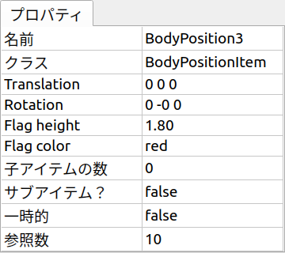
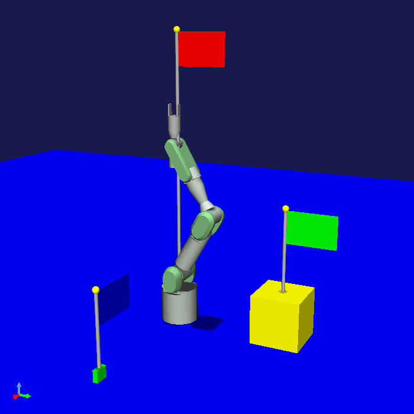

==================================================
Project Item Property Implementation Sample (S07)
==================================================

.. contents:: Table of Contents
   :local:

Overview
--------

In this section, as a sample related to :doc:`item-properties`, we implement properties for :doc:`item-scene-sample`.
This allows users to view and set the position recorded in BodyPositionItem as properties.
Also, for the flag that visualizes the recorded position, we enable changing its height and color through properties.

Source Code
-----------

.. highlight:: cpp

Previous samples have kept the source code in a single file for simplicity, but since the implementation of this sample has become more complex, we will split the source code into several files. In actual plugin implementation, it is common to implement with multiple files like this. Subsequent samples will also be implemented in this form.

Specifically, this sample consists of the following files:

* BodyPositionItem.h

  * Header file for the BodyPositionItem class

* BodyPositionItem.cpp

  * Implementation file for the BodyPositionItem class

* DevGuidePlugin.cpp

  * Implementation file for the plugin class

The contents of each source file are shown below.
Note that this sample is an improvement of :doc:`item-scene-sample`, and the basic implementation is almost the same.
Added/modified parts are highlighted.

BodyPositionItem.h
~~~~~~~~~~~~~~~~~~

Header file for the BodyPositionItem class. Only the class definition is described.

.. code-block:: cpp
 :emphasize-lines: 1,2,9,14,21,22,23,24,25,26,27,32,35,37,38,40,42,43,44,47,49

 #ifndef DEVGUIDE_PLUGIN_BODY_POSITION_ITEM_H
 #define DEVGUIDE_PLUGIN_BODY_POSITION_ITEM_H

 #include <cnoid/Item>
 #include <cnoid/RenderableItem>
 #include <cnoid/BodyItem>
 #include <cnoid/SceneGraph>
 #include <cnoid/SceneDrawables>
 #include <cnoid/Selection>
 
 class BodyPositionItem : public cnoid::Item, public cnoid::RenderableItem
 {
 public:
     static void initializeClass(cnoid::ExtensionManager* ext);
 
     BodyPositionItem();
     BodyPositionItem(const BodyPositionItem& org);
     void storeBodyPosition();
     void restoreBodyPosition();
     virtual cnoid::SgNode* getScene() override;
     void setPosition(const cnoid::Isometry3& T);
     const cnoid::Isometry3& position() const { return position_; }
     bool setFlagHeight(double height);
     double flagHeight() const { return flagHeight_; }
     enum ColorId { Red, Green, Blue };
     bool setFlagColor(int colorId);
     double flagColor() const { return flagColorSelection.which(); }
 
 protected:
     virtual Item* doDuplicate() const override;
     virtual void onTreePathChanged() override;
     virtual void doPutProperties(PutPropertyFunction& putProperty) override;
 
 private:
     void createFlag();
     void updateFlagPosition();
     void updateFlagMaterial();
 
     cnoid::BodyItem* bodyItem;
     cnoid::Isometry3 position_;
     cnoid::SgPosTransformPtr flag;
     double flagHeight_;
     cnoid::Selection flagColorSelection;
     cnoid::SgMaterialPtr flagMaterial;
 };
 
 typedef cnoid::ref_ptr<BodyPositionItem> BodyPositionItemPtr;
 
 #endif // DEVGUIDE_PLUGIN_BODY_POSITION_ITEM_H

BodyPositionItem.cpp
~~~~~~~~~~~~~~~~~~~~

Implementation file for BodyPositionItem.

.. code-block:: cpp
 :emphasize-lines: 5,12,13,14,15,16,17,22,23,24,25,26,27,34,35,36,83,88,89,90,91,92,93,94,95,96,97,102,114,122,130,132,138,139,140,141,142,143,144,145,146,147,148,149,150,151,152,153,154,155,156,158,159,160,161,162,163,165,166,167,168,169,170,172,173,174,175,176,177,179,180,181,182,183,184,186,187,189,190,191,192,193,194,196,197,198,199,200,201,202,203,204,205,206,207,208,209,210,211,212,213,214,215,216,217,218,219,220

 #include "BodyPositionItem.h"
 #include <cnoid/ItemManager>
 #include <cnoid/MeshGenerator>
 #include <cnoid/EigenUtil>
 #include <cnoid/PutPropertyFunction>
 #include <fmt/format.h>
 
 using namespace std;
 using namespace fmt;
 using namespace cnoid;

 void BodyPositionItem::initializeClass(ExtensionManager* ext)
 {
     ext->itemManager()
         .registerClass<BodyPositionItem>("BodyPositionItem")
         .addCreationPanel<BodyPositionItem>();
 }
 
 BodyPositionItem::BodyPositionItem()
 {
     bodyItem = nullptr;
     position_.setIdentity();
     flagColorSelection.setSymbol(Red, "red");
     flagColorSelection.setSymbol(Green, "green");
     flagColorSelection.setSymbol(Blue, "blue");
     flagColorSelection.select(Red);
     flagHeight_ = 1.8;
 }

 BodyPositionItem::BodyPositionItem(const BodyPositionItem& org)
     : Item(org)
 {
     bodyItem = nullptr;
     position_ = org.position_;
     flagHeight_ = org.flagHeight_;
     flagColorSelection = org.flagColorSelection;
 }

 Item* BodyPositionItem::doDuplicate() const
 {
     return new BodyPositionItem(*this);
 }

 void BodyPositionItem::onTreePathChanged()
 {
     auto newBodyItem = findOwnerItem<BodyItem>();
     if(newBodyItem && newBodyItem != bodyItem){
         bodyItem = newBodyItem;
         mvout()
             << format("BodyPositionItem \"{0}\" has been attached to {1}.",
                       name(), bodyItem->name())
             << endl;
     }
 }

 void BodyPositionItem::storeBodyPosition()
 {
     if(bodyItem){
         position_ = bodyItem->body()->rootLink()->position();
         updateFlagPosition();
         mvout()
             << format("The current position of {0} has been stored to {1}.",
                       bodyItem->name(), name())
             << endl;
     }
 }

 void BodyPositionItem::restoreBodyPosition()
 {
     if(bodyItem){
         bodyItem->body()->rootLink()->position() = position_;
         bodyItem->notifyKinematicStateChange(true);
         mvout()
             << format("The position of {0} has been restored from {1}.",
                       bodyItem->name(), name())
             << endl;
     }
 }

 SgNode* BodyPositionItem::getScene()
 {
     if(!flag){
         createFlag();
     }
     return flag;
 }

 void BodyPositionItem::createFlag()
 {
     if(!flag){
         flag = new SgPosTransform;
         updateFlagPosition();
         flagMaterial = new SgMaterial;
         updateFlagMaterial();
     } else {
         flag->clearChildren();
     }

     MeshGenerator meshGenerator;

     auto pole = new SgShape;
     pole->setMesh(meshGenerator.generateCylinder(0.01, flagHeight_));
     pole->getOrCreateMaterial()->setDiffuseColor(Vector3f(0.7f, 0.7f, 0.7f));
     auto polePos = new SgPosTransform;
     polePos->setRotation(AngleAxis(radian(90.0), Vector3::UnitX()));
     polePos->setTranslation(Vector3(0.0, 0.0, flagHeight_ / 2.0));
     polePos->addChild(pole);
     flag->addChild(polePos);

     auto ornament = new SgShape;
     ornament->setMesh(meshGenerator.generateSphere(0.02));
     ornament->getOrCreateMaterial()->setDiffuseColor(Vector3f(1.0f, 1.0f, 0.0f));
     auto ornamentPos = new SgPosTransform;
     ornamentPos->setTranslation(Vector3(0.0, 0.0, flagHeight_ + 0.01));
     ornamentPos->addChild(ornament);
     flag->addChild(ornamentPos);

     auto banner = new SgShape;
     banner->setMesh(meshGenerator.generateBox(Vector3(0.002, 0.3, 0.2)));
     banner->setMaterial(flagMaterial);
     auto bannerPos = new SgPosTransform;
     bannerPos->setTranslation(Vector3(0.0, 0.16, flagHeight_ - 0.1));
     bannerPos->addChild(banner);
     flag->addChild(bannerPos);
 }

 void BodyPositionItem::updateFlagPosition()
 {
     if(flag){
         auto p = position_.translation();
         flag->setTranslation(Vector3(p.x(), p.y(), 0.0));
         auto rpy = rpyFromRot(position_.linear());
         flag->setRotation(AngleAxis(rpy.z(), Vector3::UnitZ()));
         flag->notifyUpdate();
     }
 }

 void BodyPositionItem::updateFlagMaterial()
 {
     if(flagMaterial){
         switch(flagColorSelection.which()){
         case Red:
             flagMaterial->setDiffuseColor(Vector3f(1.0f, 0.0f, 0.0f));
             break;
         case Green:
             flagMaterial->setDiffuseColor(Vector3f(0.0f, 1.0f, 0.0f));
             break;
         case Blue:
             flagMaterial->setDiffuseColor(Vector3f(0.0f, 0.0f, 1.0f));
             break;
         default:
             break;
         }
         flagMaterial->notifyUpdate();
     }
 }        

 void BodyPositionItem::setPosition(const Isometry3& T)
 {
     position_ = T;
     updateFlagPosition();
     notifyUpdate();
 }

 bool BodyPositionItem::setFlagHeight(double height)
 {
     if(height <= 0.0){
         return false;
     }
     flagHeight_ = height;
     if(flag){
         createFlag();
         flag->notifyUpdate();
     }
     notifyUpdate();
     return true;
 }

 bool BodyPositionItem::setFlagColor(int colorId)
 {
     if(!flagColorSelection.select(colorId)){
         return false;
     }
     updateFlagMaterial();
     notifyUpdate();
     return true;
 }

 void BodyPositionItem::doPutProperties(PutPropertyFunction& putProperty)
 {
     auto p = position_.translation();
     putProperty("Translation", format("{0:.3g} {1:.3g} {2:.3g}", p.x(), p.y(), p.z()),
                 [this](const string& text){
                     Vector3 p;
                     if(toVector3(text, p)){
                         position_.translation() = p;
                         setPosition(position_);
                         return true;
                     }
                     return false;
                 });

     auto r = degree(rpyFromRot(position_.linear()));
     putProperty("Rotation", format("{0:.0f} {1:.0f} {2:.0f}", r.x(), r.y(), r.z()),
                 [this](const string& text){
                     Vector3 rpy;
                     if(toVector3(text, rpy)){
                         position_.linear() = rotFromRpy(radian(rpy));
                         setPosition(position_);
                         return true;
                     }
                     return false;
                 });

     putProperty.min(0.1)("Flag height", flagHeight_,
                 [this](double height){ return setFlagHeight(height); });

     putProperty("Flag color", flagColorSelection,
                 [this](int which){ return setFlagColor(which); });
 }

DevGuidePlugin.cpp
~~~~~~~~~~~~~~~~~~

Source code for DevGuidePlugin.cpp that implements the plugin class.
This is separated from the plugin class implementation part of :doc:`item-scene-sample`.

.. code-block:: cpp
 :emphasize-lines: 20

 #include "BodyPositionItem.h"
 #include <cnoid/Plugin>
 #include <cnoid/ToolBar>
 #include <cnoid/RootItem>
 #include <cnoid/ItemList>
 
 using namespace cnoid;
 
 class DevGuidePlugin : public Plugin
 {
 public:
     DevGuidePlugin()
         : Plugin("DevGuide")
     {
         require("Body");
     }
        
     virtual bool initialize() override
     {
         BodyPositionItem::initializeClass(this);
        
         auto toolBar = new ToolBar("BodyPositionBar");
         toolBar->addButton("Store Body Positions")->sigClicked().connect(
             [this](){ storeBodyPositions(); });
         toolBar->addButton("Restore Body Positions")->sigClicked().connect(
             [this](){ restoreBodyPositions(); });
         toolBar->setVisibleByDefault();
         addToolBar(toolBar);
 
         return true;
     }
            
     void storeBodyPositions()
     {
         for(auto& item : RootItem::instance()->selectedItems<BodyPositionItem>()){
             item->storeBodyPosition();
         }
     }
    
     void restoreBodyPositions()
     {
         for(auto& item : RootItem::instance()->selectedItems<BodyPositionItem>()){
             item->restoreBodyPosition();
         }
     }
 };
 
 CNOID_IMPLEMENT_PLUGIN_ENTRY(DevGuidePlugin)

CMakeLists.txt
~~~~~~~~~~~~~~

.. highlight:: cmake

Since we split the source files, CMakeLists.txt is also modified accordingly.
The content is almost the same as presented in :doc:`item-operation-sample`, but differs in specifying multiple source files to choreonoid_add_plugin.

For building in Choreonoid's build environment: ::

 choreonoid_add_plugin(CnoidDevGuidePlugin DevGuidePlugin.cpp BodyPositionItem.cpp)
 target_link_libraries(CnoidDevGuidePlugin PUBLIC CnoidBodyPlugin)

For building independently from Choreonoid: ::

 cmake_minimum_required(VERSION 3.10)
 project(DevGuidePlugin)
 find_package(Choreonoid REQUIRED)
 set(CMAKE_CXX_STANDARD ${CHOREONOID_CXX_STANDARD})
 choreonoid_add_plugin(CnoidDevGuidePlugin DevGuidePlugin.cpp BodyPositionItem.cpp)
 target_link_libraries(CnoidDevGuidePlugin PUBLIC Choreonoid::CnoidBodyPlugin)

.. _plugin-dev-item-property-sample-howto:

How to Use Properties
---------------------

When you load this plugin, the following properties are added to BodyPositionItem:

* **Translation**

 * Translation component of recorded position
 * Display and set 3 elements: X, Y, Z

* **Rotation**

 * Rotation component of recorded position
 * Display and set 3 elements: Roll, Pitch, Yaw

* **Flag height**

  * Height of the flag
  * Specified as a number (meters)

* **Flag color**

  * Color of the flag
  * Select from red, green, blue

Create a BodyPositionItem in the same way as previous samples and select it in the item tree view.
These properties will then be displayed in the item property view as follows:

Here, clicking on the value part of each property allows you to edit it, so try changing them appropriately.
For flag height and color, if BodyPositionItem is checked, the set values are reflected in the scene view display.

For example, similar to :ref:`plugin-dev-item-scene-sample-body-position-item-visualization` presented in :doc:`item-scene-sample`, attach BodyPositionItems to three PA10Pickup models, record current positions, and display flags. Then set different heights and colors for each item. Here's an example:

Here we set the properties of each BodyPositionItem as follows:

* BodyPosition1

  * Translation: 0 0 0
  
  * Rotation: 0 0 0

  * Flag height: 1.8

  * Flag color: red

* BodyPosition2

  * Translation: 0 0.7 0.15
  
  * Rotation: 0 0 0

  * Flag height: 0.8

  * Flag color: green

* BodyPosition3

  * Translation: 0.9 0 0.035
  
  * Rotation: 0 0 90

  * Flag height: 0.5

  * Flag color: blue

By introducing properties to items this way, users can easily change item data and settings.

Source Code Explanation
-----------------------

.. highlight:: cpp

We explain the source code of this sample by file.

BodyPositionItem.h
~~~~~~~~~~~~~~~~~~

This file defines the BodyPositionItem class.

First, to make this file usable from anywhere as a header file for the BodyPositionItem class, we introduce the following include guard: ::

 #ifndef DEVGUIDE_PLUGIN_BODY_POSITION_ITEM_H
 #define DEVGUIDE_PLUGIN_BODY_POSITION_ITEM_H
 ...

 #endif // DEVGUIDE_PLUGIN_BODY_POSITION_ITEM_H

The included header files are those used in previous samples. ::

 class BodyPositionItem : public cnoid::Item, public cnoid::RenderableItem

Starting the definition of the BodyPositionItem class. Here we attach the scope resolution operator of namespace cnoid to the base classes.
 
In this file, we define the BodyPositionItem class in the global namespace.
However, unlike previous samples, since this is a header file, using directives like ::

 using namespace cnoid;

within this file is not recommended.
Therefore, we explicitly specify namespace cnoid for Choreonoid SDK classes as shown above.
This applies to other Choreonoid SDK classes used in this file as well.

.. note:: Explicit specification of namespace cnoid becomes unnecessary if you define the class within namespace cnoid. However, since namespace cnoid is for the Choreonoid SDK, it's usually better not to use it for custom plugins. Using this namespace is basically limited to plugins included in Choreonoid itself or officially certified plugins.

As an addition from :doc:`item-scene-sample`, the BodyPositionItem class first adds the following static function: ::

 static void initializeClass(cnoid::ExtensionManager* ext);

This is a function to initialize the BodyPositionItem class.

Other additions enable setting and getting the recorded position, flag height, and flag color.

First, for the recorded position, we define the following member functions: ::

 void setPosition(const cnoid::Isometry3& T);
 const cnoid::Isometry3& position() const { return position_; }

These are functions to set and get the recorded position, respectively. So-called setter and getter functions.
The getter function is not named getPosition but has the same name as the variable. In that case, the getter function and variable would have a name collision, so we add an underscore to the variable name and define it as ::

 cnoid::Isometry3 position_;

to avoid name collision. There are many places in Choreonoid's implementation that define member variables and getter functions in the same form, and we follow that pattern here.

For flag height, we enable setting and getting with the functions: ::

 bool setFlagHeight(double height);
 double flagHeight() const { return flagHeight_; }

and define the variable as: ::

 double flagHeight_;

For flag color, we first use the enumeration: ::

 enum ColorId { Red, Green, Blue };

to choose from three options. This is stored in a :ref:`Selection type <plugin-dev-item-properties-selection>` variable: ::

 Selection flagColorSelection;

And we define member functions to set and get the color as: ::

  bool setFlagColor(int colorId);
  double flagColor() const { return flagColorSelection.which(); }

Also, as a variable for the material that determines the flag color: ::

 SgMaterialPtr flagMaterial;

This is a smart pointer like flag, and once created, it's always held by this item.
The color property is reflected by changing the color element of this material.

Additionally, to implement properties: ::

 virtual void doPutProperties(PutPropertyFunction& putProperty) override;

is defined, and we also add createFlag and updateFlagMaterial functions for internal implementation.

After the BodyPositionItem class definition: ::

 typedef cnoid::ref_ptr<BodyPositionItem> BodyPositionItemPtr;

typedefs the smart pointer of BodyPositionItem with the name BodyPositionItemPtr.
This is not used in this sample but will be used in future situations where we want to hold BodyPositionItem instances.
In Choreonoid, for classes where smart pointer usage is expected to be common, it's customary to typedef the smart pointer type with the name "ClassName + Ptr" and use it in coding.

BodyPositionItem.cpp
~~~~~~~~~~~~~~~~~~~~

This file implements the BodyPositionItem class.
We'll explain focusing on parts added or changed from :doc:`item-scene-sample`. ::

 #include <cnoid/PutPropertyFunction>     

Including the PutPropertyFunction header necessary to implement item properties. ::

 void BodyPositionItem::initializeClass(ExtensionManager* ext)
 {
     ext->itemManager()
         .registerClass<BodyPositionItem>("BodyPositionItem")
         .addCreationPanel<BodyPositionItem>();
 }

Function to register the BodyPositionItem class.
We moved the processing previously written in the plugin class's initialize function here.
This way we try to gather BodyPositionItem-related processing in this file as much as possible. ::

 BodyPositionItem::BodyPositionItem()
 {
     bodyItem = nullptr;
     position_.setIdentity();
     flagColorSelection.setSymbol(Red, "red");
     flagColorSelection.setSymbol(Green, "green");
     flagColorSelection.setSymbol(Blue, "blue");
     flagColorSelection.select(Red);
     flagHeight_ = 1.8;
 }

BodyPositionItem's default constructor.
We set red (Red), green (Green), and blue (Blue) choices in flagColorSelection and set the default selection to red.
Also setting the default flag height to 1.8. ::

 BodyPositionItem::BodyPositionItem(const BodyPositionItem& org)
     : Item(org)
 {
     bodyItem = nullptr;
     position_ = org.position_;
     flagHeight_ = org.flagHeight_;
     flagColorSelection = org.flagColorSelection;
 }
  
BodyPositionItem's copy constructor.
Also copying flag height and color. ::

 SgNode* BodyPositionItem::getScene()
 {
     if(!flag){
         createFlag();
     }
     return flag;
 } 

The getScene function of the RenderableItem interface.
We changed the structure from :doc:`item-scene-sample` to generate the actual flag scene model in the createFlag function. ::

 void BodyPositionItem::createFlag()
 {
     ...
 }

Function to generate the flag scene model. This function is also executed when the flag height is changed.
It regenerates the flag with the current parameters each time it's executed. Below we look at the code inside this function. ::

  if(!flag){
      flag = new SgPosTransform;
      updateFlagPosition();
      flagMaterial = new SgMaterial;
      updateFlagMaterial();
  } else {
      flag->clearChildren();
  }

Separating processing for when generating the model for the first time and when regenerating.
When generating for the first time, we generate flag which becomes the model's top node and flagMaterial which handles color changes.
These are retained even when regenerating the model.
The generated objects are initialized with updateFlagPosition and updateFlagMaterial functions respectively.
When regenerating the model, we remove all child nodes of flag so they can be replaced with the regenerated model. ::

 MeshGenerator meshGenerator;
 
 auto pole = new SgShape;
 pole->setMesh(meshGenerator.generateCylinder(0.01, flagHeight_));
 pole->getOrCreateMaterial()->setDiffuseColor(Vector3f(0.7f, 0.7f, 0.7f));
 auto polePos = new SgPosTransform;
 polePos->setRotation(AngleAxis(radian(90.0), Vector3::UnitX()));
 polePos->setTranslation(Vector3(0.0, 0.0, flagHeight_ / 2.0));
 polePos->addChild(pole);
 flag->addChild(polePos);
 
 auto ornament = new SgShape;
 ornament->setMesh(meshGenerator.generateSphere(0.02));
 ornament->getOrCreateMaterial()->setDiffuseColor(Vector3f(1.0f, 1.0f, 0.0f));
 auto ornamentPos = new SgPosTransform;
 ornamentPos->setTranslation(Vector3(0.0, 0.0, flagHeight_ + 0.01));
 ornamentPos->addChild(ornament);
 flag->addChild(ornamentPos);
 
 auto banner = new SgShape;
 banner->setMesh(meshGenerator.generateBox(Vector3(0.002, 0.3, 0.2)));
 banner->setMaterial(flagMaterial);
 auto bannerPos = new SgPosTransform;
 bannerPos->setTranslation(Vector3(0.0, 0.16, flagHeight_ - 0.1));
 bannerPos->addChild(banner);
 flag->addChild(bannerPos);

Code to generate the flag model. This is also basically the same as the corresponding code in :doc:`item-scene-sample`, but supports property changes with the following modifications:

* Set flag height with member variable flagHeight_

* Set member variable flagMaterial as the material for the banner part

This way, when you change the value of flagHeight_ and regenerate, that value is reflected. Also, changing flagMaterial attributes reflects them in the flag's appearance. ::

 void BodyPositionItem::updateFlagMaterial()
 {
     if(flagMaterial){
         switch(flagColorSelection.which()){
         case Red:
             flagMaterial->setDiffuseColor(Vector3f(1.0f, 0.0f, 0.0f));
             break;
         case Green:
             flagMaterial->setDiffuseColor(Vector3f(0.0f, 1.0f, 0.0f));
             break;
         case Blue:
             flagMaterial->setDiffuseColor(Vector3f(0.0f, 0.0f, 1.0f));
             break;
         default:
             break;
         }
         flagMaterial->notifyUpdate();
     }
 }        

Function to update the flag material.
For the flag color property, sets the currently selected color as the material's diffuse color.
By executing notifyUpdate on this material, we notify the scene graph of color changes. ::

 void BodyPositionItem::setPosition(const Isometry3& T)
 {
     position_ = T;
     updateFlagPosition();
     notifyUpdate();
 }
  
Function to set the recorded position.
The argument is an Isometry3 type (reference) same as member variable position_, a transformation type value (equivalent to 4x4 homogeneous transformation matrix) containing both translation and rotation components.
After updating the member variable position corresponding to the recorded position, we update the flag display position with updateFlagPosition.
Furthermore, we execute the notifyUpdate function to indicate that the item itself has been updated.
This emits the sigUpdated signal introduced in :ref:`plugin-dev-item-operations-signals`.
If you want to detect updates to this item from outside, use this signal. ::

 bool BodyPositionItem::setFlagHeight(double height)
 {
     if(height <= 0.0){
         return false;
     }
     flagHeight_ = height;
     if(flag){
         createFlag();
         flag->notifyUpdate();
     }
     notifyUpdate();
     return true;
 }

Function to change flag height. We reset the value of flagHeight_ and regenerate the model with createFlag function.
After generation, we execute notifyUpdate function on the model's top node to notify the scene graph of changes.
Also, since changing flagHeight_ updates the item's state, we also execute the item's notifyUpdate function to notify item updates.
Note that this function returns a bool value indicating whether the input value is valid.
If the specified height is invalid (0 or less), it returns false and doesn't accept the change.
With this form, this function can be used as-is as a property update function. ::

 bool BodyPositionItem::setFlagColor(int colorId)
 {
     if(!flagColorSelection.select(colorId)){
         return false;
     }
     updateFlagMaterial();
     notifyUpdate();
     return true;
 }

Function to change flag color. Specifies color with the enumeration defined in the header file: ::

  enum ColorId { Red, Green, Blue };

When a color is set, we also update the color in scene display with updateFlagMaterial function.
And like setFlagHeight, we notify item updates with notifyUpdate function.

This function also returns a bool value to be usable as-is as a property update function.
Returns false if the color ID is invalid. ::

 void BodyPositionItem::doPutProperties(PutPropertyFunction& putProperty)
 {
     ...
 }

This is the main topic for this time.
Using the doPutProperties override explained in :doc:`item-properties`, we implement four properties.
Below we explain the corresponding code for each property. ::

 auto p = position.translation();
 putProperty("Translation", format("{0:.3g} {1:.3g} {2:.3g}", p.x(), p.y(), p.z()),
             [this](const string& text){
                 Vector3 p;
                 if(toVector3(text, p)){
                     position_.translation() = p;
                     setPosition(position_);
                     return true;
                 }
                 return false;
             });

Outputting the translation component of the recorded position as a property.
Since PutPropertyFunction doesn't have functionality to output vectors, we output as a string here.
Formatting with format, making it a string with X, Y, Z three elements in order.
And to accept editing operations, we also provide an update function.

In the update function, since the input is a string, we first convert it to a 3D vector type Vector3 value using the toVector3 function.
This function is defined in EigenUtil.
If conversion succeeds, true is returned, so in that case we update the translation component of the position_ variable recording the position with this value and give it to the aforementioned setPosition function. Since the setPosition function ultimately updates the position_ variable, looking at just that part, there's no need to execute this function. However, the setPosition function also updates the flag display position and notifies item updates with signals, which are also necessary, so we execute it here.

When the translation position update ultimately succeeds, the update function returns true, but if the user's input string cannot be converted to a 3D vector value, it returns false. ::
  
 auto r = degree(rpyFromRot(position_.linear()));
 putProperty("Rotation", format("{0:.0f} {1:.0f} {2:.0f}", r.x(), r.y(), r.z()),
             [this](const string& text){
                 Vector3 rpy;
                 if(toVector3(text, rpy)){
                     position_.linear() = rotFromRpy(radian(rpy));
                     setPosition(position_);
                     return true;
                 }
                 return false;
             });

Outputting the rotation component of the recorded position as a property.
The rotation component is expressed in roll-pitch-yaw (RPY), calculating values from the rotation component of the position_ variable.
At that time, we convert radian values to degree values.
This is to make property values easier for users to understand.
Since RPY also becomes a 3D vector, its output and update are processed similarly to the translation component.
In the update function, after converting RPY values back to radians, we calculate the rotation matrix with rotFromRpy function and assign it to the rotation component of the position_ variable.
Here too, we perform necessary processing for position updates with the setPosition function. ::

 putProperty.min(0.1)("Flag height", flagHeight_,
             [this](double height){ return setFlagHeight(height); });

Outputting flag height as a property and associating setFlagHeight as its update function. ::
 
 putProperty("Flag color", flagColorSelection,
             [this](int which){ return setFlagColor(which); });

Outputting flag color as a property and associating setFlagColor as its update function.

DevGuidePlugin.cpp
~~~~~~~~~~~~~~~~~~

This source file defines and implements the DevGuidePlugin class.
The content is the same as the corresponding part in :doc:`item-scene-sample`.

This time we separated the BodyPositionItem class definition and implementation into separate files and also implemented the registration process in BodyPositionItem's initializeClass function. So from this file we: ::

 #include "BodyPositionItem.h"

include the BodyPositionItem header, and in the plugin's initialize function: ::

 BodyPositionItem::initializeClass(this);

register the BodyPositionItem class.

The toolbar creation and processing when buttons are pressed continue to be implemented within the plugin class, but if the toolbar content becomes complex, it might be good to separate it into another file.

Actual plugins may consist of multiple components such as items and toolbars. In such cases, it's good to implement each component in separate files as much as possible like this BodyPositionItem, and only call their initialization functions from the plugin class. By doing so, the implementation of each component is organized, and the plugin class implementation becomes concise, making plugin development and maintenance easier.