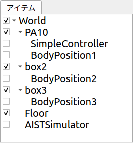
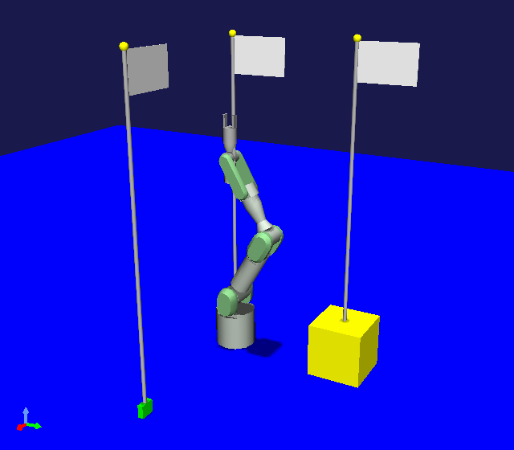

========================
Scene Display Sample (S06)
========================

.. contents:: Table of Contents
   :local:

.. highlight:: cpp

Overview
--------

In this section, we will introduce a sample that adds scene display capability to the sample from :doc:`new-item-type-sample` as an example related to :doc:`item-scene`.
For the BodyPosition item created in the previous sample, we will display the recorded position as a flag in the scene view, allowing visual confirmation.

Source Code
-----------

Here is the source code for this sample. As before, create a plugin source directory and store the following source code with the filename DevGuidePlugin.cpp. The CMakeLists.txt for building is the same as before.

This source code adds some code to :doc:`new-item-type-sample`. The added parts are highlighted with comments indicating the additions.

.. code-block:: cpp
 :emphasize-lines: 9,10,11,12,13,21,22,27,28,66,67,88,89,90,91,92,93,94,95,96,97,98,99,100,101,102,103,104,105,106,107,108,109,110,111,112,113,114,115,116,117,118,119,120,121,122,123,124,126,127,128,129,130,131,132,133,134,135,136,137

 #include <cnoid/Plugin>
 #include <cnoid/ItemManager>
 #include <cnoid/Item>
 #include <cnoid/RootItem>
 #include <cnoid/BodyItem>
 #include <cnoid/ItemList>
 #include <cnoid/ToolBar>
 
 // Add the following 4 headers
 #include <cnoid/RenderableItem>
 #include <cnoid/SceneDrawables>
 #include <cnoid/MeshGenerator>
 #include <cnoid/EigenUtil>
 
 #include <fmt/format.h>
 
 using namespace std;
 using namespace fmt;
 using namespace cnoid;
 
 // Add RenderableItem inheritance
 class BodyPositionItem : public Item, public RenderableItem
 {
     BodyItem* bodyItem;
     Isometry3 position;
 
     // Added
     SgPosTransformPtr flag;
    
 public:
     BodyPositionItem()
     {
         bodyItem = nullptr;
         position.setIdentity();
     }
    
     BodyPositionItem(const BodyPositionItem& org)
         : Item(org)
     {
         bodyItem = nullptr;
         position = org.position;
     }
    
     virtual Item* doDuplicate() const override
     {
         return new BodyPositionItem(*this);
     }
 
     virtual void onTreePathChanged() override
     {
         auto newBodyItem = findOwnerItem<BodyItem>();
         if(newBodyItem && newBodyItem != bodyItem){
             bodyItem = newBodyItem;
             mvout()
                 << format("BodyPositionItem \"{0}\" has been attached to {1}.",
                           name(), bodyItem->name())
                 << endl;
         }
     }
 
     void storeBodyPosition()
     {
         if(bodyItem){
             position = bodyItem->body()->rootLink()->position();

             // Added
             updateFlagPosition();
	     
             mvout()
                 << format("The current position of {0} has been stored to {1}.",
                           bodyItem->name(), name())
                 << endl;
         }
     }
            
     void restoreBodyPosition()
     {
         if(bodyItem){
             bodyItem->body()->rootLink()->position() = position;
             bodyItem->notifyKinematicStateChange(true);
             mvout()
                 << format("The position of {0} has been restored from {1}.",
                           bodyItem->name(), name())
                 << endl;
         }
     }
 
     // Add the following function
     virtual SgNode* getScene() override
     {
         if(!flag){
             flag = new SgPosTransform;
             MeshGenerator meshGenerator;
             constexpr double height = 1.8;
 
             auto pole = new SgShape;
             pole->setMesh(meshGenerator.generateCylinder(0.01, height));
             pole->getOrCreateMaterial()->setDiffuseColor(Vector3f(0.7f, 0.7f, 0.7f));
             auto polePos = new SgPosTransform;
             polePos->setRotation(AngleAxis(radian(90.0), Vector3::UnitX()));
             polePos->setTranslation(Vector3(0.0, 0.0, height / 2.0));
             polePos->addChild(pole);
             flag->addChild(polePos);
 
             auto ornament = new SgShape;
             ornament->setMesh(meshGenerator.generateSphere(0.02));
             ornament->getOrCreateMaterial()->setDiffuseColor(Vector3f(1.0f, 1.0f, 0.0f));
             auto ornamentPos = new SgPosTransform;
             ornamentPos->setTranslation(Vector3(0.0, 0.0, height + 0.01));
             ornamentPos->addChild(ornament);
             flag->addChild(ornamentPos);
 
             auto banner = new SgShape;
             banner->setMesh(meshGenerator.generateBox(Vector3(0.002, 0.3, 0.2)));
             banner->getOrCreateMaterial()->setDiffuseColor(Vector3f(1.0f, 1.0f, 1.0f));
             auto bannerPos = new SgPosTransform;
             bannerPos->setTranslation(Vector3(0.0, 0.16, height - 0.1));
             bannerPos->addChild(banner);
             flag->addChild(bannerPos);
         }
 
         updateFlagPosition();
         return flag;
     }
 
     // Add the following function
     void updateFlagPosition()
     {
         if(flag){
             auto p = position.translation();
             flag->setTranslation(Vector3(p.x(), p.y(), 0.0));
             auto rpy = rpyFromRot(position.linear());
             flag->setRotation(AngleAxis(rpy.z(), Vector3::UnitZ()));
             flag->notifyUpdate();
         }
     }
 };

 class DevGuidePlugin : public Plugin
 {
 public:
     DevGuidePlugin()
         : Plugin("DevGuide")
     {
         require("Body");
     }
        
     virtual bool initialize() override
     {
         itemManager()
             .registerClass<BodyPositionItem>("BodyPositionItem")
             .addCreationPanel<BodyPositionItem>();
        
         auto toolBar = new ToolBar("BodyPositionBar");
         toolBar->addButton("Store Body Positions")->sigClicked().connect(
             [this](){ storeBodyPositions(); });
         toolBar->addButton("Restore Body Positions")->sigClicked().connect(
             [this](){ restoreBodyPositions(); });
         toolBar->setVisibleByDefault();
         addToolBar(toolBar);
 
         return true;
     }
            
     void storeBodyPositions()
     {
         for(auto& item : RootItem::instance()->selectedItems<BodyPositionItem>()){
             item->storeBodyPosition();
         }
     }
    
     void restoreBodyPositions()
     {
         for(auto& item : RootItem::instance()->selectedItems<BodyPositionItem>()){
             item->restoreBodyPosition();
         }
     }
 };
 
 CNOID_IMPLEMENT_PLUGIN_ENTRY(DevGuidePlugin)

.. _plugin-dev-item-scene-sample-body-position-item-visualization:

Displaying the Saved Position of BodyPosition Items
---------------------------------------------------

This sample adds a saved position display feature to the :ref:`plugin-dev-body-position-item`.
First, make sure the BodyPosition item is ready to use.
If you have the project created in the previous sample, you can load it.

Here, for explanation purposes, we will use the PA10Pickup project as in the previous sample.
After loading the project, let's assume we have created one BodyPositionItem for each body item and recorded the current position for each.
At this point, the item tree view should be in the following state:

Now click the checkbox for each BodyPosition item to check it.
When all BodyPosition items are checked, it will look like this:

Then the scene view should display as follows:

The flags displayed here indicate the positions recorded by each BodyPosition item.
The flags are placed on the floor where the X and Y coordinates match the recorded position, aligned with the horizontal orientation of the recorded pose.
You can see that turning on/off the check for each BodyPosition item switches the display of the flag corresponding to each recorded position.
Also, when you change the recorded position of a BodyPosition item, the flag position follows it, so please try that as well.

The flag models displayed here are provided by the BodyPosition items using the method explained in :doc:`item-scene`.

Source Code Explanation
----------------------

Let's explain the parts added to the above source code from :doc:`new-item-type-sample`.

First, we include the following additional headers: ::

 #include <cnoid/RenderableItem>

This enables the use of the interface class <https://choreonoid.org/en/documents/reference/latest/classcnoid_1_1RenderableItem.html>`_ for making items compatible with scene display. ::

 #include <cnoid/SceneDrawables>

This is a header that defines scene object/node types related to drawing meshes and other elements.
By including this header, classes such as SgShape, SgMesh, and SgMaterial become available.
This header also internally includes the SceneGraph header which defines basic scene object/node types. ::

 #include <cnoid/MeshGenerator>

Header that defines the :ref:`plugin-dev-mesh-generator`. ::

 #include <cnoid/EigenUtil>

Header that provides various definitions/functions related to Eigen, the matrix and vector library.
In this sample, we use the radian function to convert from degrees to radians, which is defined in this header.

Next is the item class definition: ::

 class BodyPositionItem : public Item, public RenderableItem

While the previous sample only inherited from the Item class, this sample additionally inherits from RenderableItem, making it a multiple inheritance definition.
This implements :ref:`plugin-dev-renderable-item`. ::

 SgPosTransformPtr flag;

We define a smart pointer flag of type SgPosTransform.
This variable holds the top-level node of the flag model. ::

 void storeBodyPosition()
 {
     if(bodyItem){
         position = bodyItem->body()->rootLink()->position();
 
         // Added to S05
         updateFlagPosition();

         ...
 }

In the storeBodyPosition function, after saving the current position of the body item, we execute the updateFlagPosition function to update the flag position.
This ensures that the flag position always follows the saved position of the BodyPosition item. ::

 virtual SgNode* getScene() override
 {
     ...
 }

We override the getScene function defined in RenderableItem to implement the scene node provided by this item.
This function returns the node object held in the member variable flag: ::

  if(!flag){
      flag = new SgPosTransform;
      ...
  }
  ...

  return flag;

With this structure, if flag has not been created yet, it is created first before being returned.

Scene model construction could be done in the item class constructor, but the model created there might not necessarily be used. The model is only used when the item's checkbox is turned on and the getScene function is called.
Therefore, by constructing the model on demand when the getScene function is called, we avoid unnecessary processing.

Now let's look at the construction of the flag model held in the flag variable: ::

 flag = new SgPosTransform;

We create the top-level node of the model as an SgPosTransform type node and set it to flag.
This node aligns the position and orientation of the flag in the scene graph with the recorded position of the BodyPosition item.
Since flag is a smart pointer, once we set the generated node like this, it will be retained until this item is destroyed.
Also, the nodes that will be generated as components of the flag from here on will be added as child nodes of this top-level node.
In that case, the child nodes will also be retained by the parent node's smart pointer. ::

 MeshGenerator meshGenerator;

We create a :ref:`plugin-dev-mesh-generator` for :ref:`plugin-dev-use-primitive-shapes`.
Since MeshGenerator only needs to be used temporarily during model generation, we make it an automatic variable in the local scope.
In this case, the MeshGenerator object will be released when exiting the if statement scope. ::

 constexpr double height = 1.8;
 
Defines the height of the flag pole. ::

 auto pole = new SgShape;
 pole->setMesh(meshGenerator.generateCylinder(0.01, height));
 pole->getOrCreateMaterial()->setDiffuseColor(Vector3f(0.7f, 0.7f, 0.7f));

Creating the flag pole part.
We generate an SgShape node, set a cylinder shape generated by MeshGenerator to it, create a material, and set the color to gray. ::

 auto polePos = new SgPosTransform;
 polePos->setRotation(AngleAxis(radian(90.0), Vector3::UnitX()));
 polePos->setTranslation(Vector3(0.0, 0.0, height / 2.0));
 polePos->addChild(pole);

We generate an SgPosTransform node to adjust the position and orientation of the pole part, and add the pole shape as its child node.
The cylinder generated by MeshGenerator has its axis along the Y-axis, but to align it with the Z-axis, we rotate it 90 degrees around the X-axis.
Also, to make the local coordinate origin of the model coincide with the bottom of the pole, we move it by half the cylinder height in the Z-axis direction. ::

 flag->addChild(polePos);

Adding the pole part to flag, the SgPosTransform node that groups the entire flag. ::

 auto ornament = new SgShape;
 ornament->setMesh(meshGenerator.generateSphere(0.02));
 ornament->getOrCreateMaterial()->setDiffuseColor(Vector3f(1.0f, 1.0f, 0.0f));
 auto ornamentPos = new SgPosTransform;
 ornamentPos->setTranslation(Vector3(0.0, 0.0, height + 0.01));
 ornamentPos->addChild(ornament);
 flag->addChild(ornamentPos);

In the same manner as the pole, we create a spherical ornament to be attached to the top of the pole, set its color to yellow, adjust its position, and add it to flag. ::

 auto banner = new SgShape;
 banner->setMesh(meshGenerator.generateBox(Vector3(0.002, 0.3, 0.2)));
 banner->getOrCreateMaterial()->setDiffuseColor(Vector3f(1.0f, 1.0f, 1.0f));
 auto bannerPos = new SgPosTransform;
 bannerPos->setTranslation(Vector3(0.0, 0.16, height - 0.1));
 bannerPos->addChild(banner);
 flag->addChild(bannerPos);

In the same manner as the pole and ornament, we create the main part of the flag (banner).

This completes the creation of the flag model.
The remaining processing is executed each time the getScene function is called. ::

 updateFlagPosition();

Updates the flag position to the current recorded position of the BodyPosition item. ::

 return flag;

Returns the flag model. This model is used for display in the scene view, etc. ::

 void updateFlagPosition()
 {
     if(flag){
         auto p = position.translation();
         flag->setTranslation(Vector3(p.x(), p.y(), 0.0));
         auto rpy = rpyFromRot(position.linear());
         flag->setRotation(AngleAxis(rpy.z(), Vector3::UnitZ()));
         flag->notifyUpdate();
     }
 }

Function that updates the flag position.
If flag has been generated, the update process is performed within the if statement.

In the update, we extract the X and Y coordinates of the recorded position and set the flag position with Z coordinate as 0 (= floor level).
Since the flag model has its local coordinate origin aligned with the bottom of the pole, the flag stands at this position.
Also, using the rpyFromRot function defined in EigenUtil, we calculate the roll-pitch-yaw values from the rotation component of the recorded position matrix (position.linear()). We apply rotation to the flag model using only the yaw axis component (rpy.z()).

Finally, by executing the notifyUpdate() function of the flag node, we communicate the update of this node to the scene graph.
This ultimately propagates to the root node of the scene graph, and through its update signal, the update is also communicated to the scene view and the display is updated.