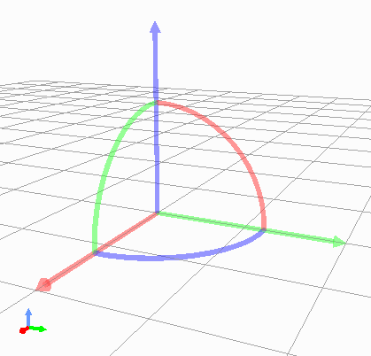

================================
Scene Integration for Project Items
================================

.. contents:: Table of Contents
   :local:

.. highlight:: cpp

Overview
--------

Choreonoid provides :ref:`basics_sceneview_sceneview` that displays three-dimensional scenes constructed with :doc:`scenegraph`, allowing users to check and edit the virtual world handled in Choreonoid. The components of the virtual world are mainly provided by project items, and display in the scene view is basically realized by introducing those scene elements into the scene graph of the entire virtual world.

This section explains how project items provide scene elements.
This allows functions and data newly introduced by plugins to be compatible with Choreonoid's scene display functionality.

.. _plugin-dev-renderable-items:

Project Items that Provide Scene Elements
-----------------------------------------

Among Choreonoid's existing project items, the following provide scene elements:

* Body Item

  * Provides robot and environment models

* World Item

  * Provides collision data between body models

* Body Tracking Camera Item

  * Provides a camera that tracks a specific body model

* Sensor Visualizer Item

  * Provides information about sensors mounted on body models

* Scene Item

  * Provides scene models for display

* Lighting Item

  * Provides light sources that illuminate the scene

* Point Set Item

  * Provides point cloud data

For each item, by turning on the checkbox in the item tree view, the corresponding scene element is introduced to the scene view. As a result, body models are displayed, and body tracking cameras can be selected as viewpoints.

Some items can also be edited by mouse operations in the scene view. For example, for body items, you can move the model's position or change its posture by moving joints.

Furthermore, the provided scene elements can work with other functions. For example, introducing the GL Vision Simulator Item to simulations enables simulation of visual sensors such as cameras by incorporating scene elements provided by body items and scene items.

In this way, by having items provide scene elements, they can be made compatible with various operations and processes through scenes.
And providing scene elements is also possible for custom project item types.

.. _plugin-dev-renderable-item:
	       
Providing Scene Elements with RenderableItem
--------------------------------------------

Item types that provide scene elements should inherit from the `RenderableItem class <https://choreonoid.org/en/documents/reference/latest/classcnoid_1_1RenderableItem.html>`_.

This class itself is not an item type and does not inherit from the Item class. In fact, this class is what's called an "interface class," used to implement specific functionality in classes. Interface classes are generally used in the following form:

* Virtual functions related to the functionality are defined, and functionality is implemented by overriding them.
* When the using class inherits from other classes, it uses multiple inheritance to add this.
* A class may introduce multiple interface classes simultaneously as needed.

Let's look at this specifically. First, extracting the main parts of RenderableItem's definition: ::

 class RenderableItem
 {
 public:
     virtual SgNode* getScene() = 0;
 };

This is defined in the Base module and can be used by including the RenderableItem header.

And an item class that implements this RenderableItem interface is defined as follows: ::

 class FooItem : public Item, public RenderableItem
 {
     ...
     
     SgNodePtr scene;
 
 public:
     FooItem();

     ...
      
     virtual SgNode* getScene() override
     {
         if(!scene){
             scene = new SgXXX;
             ...
         }
	 return scene;
     }
 }

First, the base classes should be multiple inheritance of the base item type and the RenderableItem interface like this.
Then, while implementing the functions necessary for the item type, also implement RenderableItem's getScene function.
In the getScene function, return the scene element provided by the item as an SgNode type.
There are no particular rules about the content; anything that can be used as a scene element is fine.
Usually, you hold the generated scene in a smart pointer type member variable and return the same instance in getScene.

For item types that inherit the RenderableItem interface like this, the Choreonoid framework detects that they are RenderableItem when items are created. When the RenderableItem's checkbox is turned ON, the scene view detects this and obtains the scene element through the item's getScene function. The obtained scene element is added to the scene graph managed by the scene view and introduced into the scene to be displayed.

All existing :ref:`plugin-dev-renderable-items` are implemented in this form.
And custom project item types can also provide scene elements by implementing them in the same form.

Implementing Operation Functions with SceneWidgetEventHandler
-------------------------------------------------------------

Scene elements provided through RenderableItem's getScene function can also be interactively operated in the scene view.
To do this, define nodes you want to operate within the scene elements as node types that inherit from the `SceneWidgetEventHandler class <https://choreonoid.org/en/documents/reference/latest/classcnoid_1_1SceneWidgetEventHandler.html>`_. This is also an interface class and is used in the same form as RenderableItem. However, classes that inherit SceneWidgetEventHandler are scene node types. SceneWidgetEventHandler defines virtual functions corresponding to operation events in the scene view, and you implement operations in the scene view by overriding the virtual functions for operations you want to handle.

.. note:: The "SceneWidget" in SceneWidgetEventHandler's name is a widget used internally by SceneView that provides basic scene graph rendering and operation functionality.

Let's look at this specifically too. First, the SceneWidgetEditable interface is defined as follows: ::

 class SceneWidgetEventHandler
 {
 public:
     // Scene view mode (view, edit, etc.) has changed
     virtual void onSceneModeChanged(SceneWidgetEvent* event);
     // Mouse button was pressed
     virtual bool onButtonPressEvent(SceneWidgetEvent* event);
     // Mouse button was released
     virtual bool onButtonReleaseEvent(SceneWidgetEvent* event);
     // Mouse was double-clicked
     virtual bool onDoubleClickEvent(SceneWidgetEvent* event);
     // Mouse pointer moved
     virtual bool onPointerMoveEvent(SceneWidgetEvent* event);
     // Mouse pointer left the view
     virtual void onPointerLeaveEvent(SceneWidgetEvent* event);
     // Mouse scroll operation was performed
     virtual bool onScrollEvent(SceneWidgetEvent* event);
     // Keyboard key was pressed
     virtual bool onKeyPressEvent(SceneWidgetEvent* event);
     // Keyboard key was released
     virtual bool onKeyReleaseEvent(SceneWidgetEvent* event);
     // Focus changed
     virtual void onFocusChanged(SceneWidgetEvent* event, bool on);
     // Context menu was requested
     virtual bool onContextMenuRequest(SceneWidgetEvent* event, MenuManager* menu);
 };

The comments above each function indicate the event (timing) when that function is called.
Functions are actually called when the following conditions are met:

* onSceneModeChanged

  * Called for all SceneWidgetEventHandlers when the scene view mode changes

* Other events

  * Scene view is in edit mode

  * Mouse pointer is pointing at the target node or its subordinate objects in the scene view

For functions with bool return values, return true if processing was actually performed, false otherwise.

The argument event is an object of the `SceneWidgetEvent class <https://choreonoid.org/en/documents/reference/latest/classcnoid_1_1SceneWidgetEvent.html>`_, through which you can get the state when the event occurred. Specifically, you can get information with the following functions:

* **const Vector3& point() const**

  * Returns the three-dimensional position the mouse pointer is pointing to.
    
* **const SgNodePath& nodePath() const**

  * Returns the :ref:`path <plugin-dev-scenegraph-path>` in the scene graph of the node the mouse pointer is pointing to.

* **double x() const**

  * Returns the X coordinate of the mouse pointer on the 2D pixel screen.

* **double y() const**

  * Returns the Y coordinate of the mouse pointer on the 2D pixel screen.

* **double pixelSizeRatio() const**

  * Returns the ratio between 3D space size and pixel size of the point the mouse pointer is pointing to.

* **int key() const**

  * Returns the pressed key. This is a value defined in Qt's enumeration type Qt::Key.

* **int button() const**

  * Returns the pressed mouse button. This is a value defined in Qt's enumeration type Qt::MouseButton.
  * Left, middle, and right buttons are Qt::LeftButton, Qt::MidButton, and Qt::RightButton respectively.
    
* **int modifiers() const**

  * Returns the value of pressed keyboard modifiers (Shift, Ctrl, Alt, etc. keys).
  * This is a value defined in Qt's enumeration type Qt::KeyboardModifiers.
  * Shift, Ctrl, Alt are Qt::ShiftModifier, Qt::ControlModifier, Qt::AltModifier respectively.
  * When multiple modifiers are active, the corresponding values are stored as a logical OR.
  
* **double wheelSteps() const**

  * Returns the up/down movement of the mouse wheel.
  * Usually +1 or -1.

* **const SgCamera* camera() const**

  * Returns the camera used in the view where the event occurred.

* **int cameraIndex() const**

  * Returns the camera index.
    
* **const SgNodePath& cameraPath() const**

  * Returns the camera's node path.

* **const Isometry3& cameraPosition() const**
  
  * Returns the camera's three-dimensional position.

* **bool getRay(Vector3& out_origin, Vector3& out_direction) const**

  * Returns the camera's ray (viewing direction) as origin and direction vectors.

* **SceneWidget* sceneWidget() const**

  * Returns the SceneWidget object where the event occurred.
  * The view mode can be obtained from this object.
  * For SceneWidget details, see the `SceneWidget class <https://choreonoid.org/en/documents/reference/latest/classcnoid_1_1SceneWidget.html>`_.
  
* **void updateIndicator(const std::string& message) const**
  
  * Updates the message displayed in the status bar at the bottom of the main window.

Nodes you want to make operable in the scene view are defined, for example, as follows: ::

 #include <cnoid/SceneGraph>
 #include <cnoid/SceneWidgetEventHandler>

 using namespace cnoid;

 class OperableGroup : public SgGroup, public SceneWidgetEventHandler
 {
 public:
     ...

     virtual bool onButtonPressEvent(SceneWidgetEvent* event) override
     {
         // Describe processing when a button is pressed on child nodes
         ...
         return true;
     }
  };

This way, OperableGroup becomes a group node with an event handler.
Since group nodes themselves have no substance in the scene, they are not direct targets of mouse operations, but if they have child nodes like SgShape, operations performed on those parts are communicated through this class's functions. The node and coordinates actually pointed to by the mouse can be obtained with the corresponding functions of the event argument.

SceneWidgetEventHandler implementation is often implemented in group nodes like SgGroup and SgPosTransform like this, but it can be implemented in any type that is a scene node, so it's possible to implement it in SgShape, for example. However, implementing it for scene objects that are not scene nodes (not inheriting from SgNode) will not be effective.

Using Existing Operation Nodes
------------------------------

The Choreonoid SDK also provides node types that allow specific operations in the scene view.
Specifically, the following two node types are currently available:

* `PositionDragger <https://choreonoid.org/en/documents/reference/latest/classcnoid_1_1PositionDragger.html>`_ 

  * Draggable coordinate axes

* `RectRegionMarker <https://choreonoid.org/en/documents/reference/latest/classcnoid_1_1RectRegionMarker.html>`_ 

  * 2D rectangular marker for cutting out regions in space

These node types inherit from SceneWidgetEventHandler and already have reactions to operations in the scene view implemented.
Each is defined in the Base module and can be used by including the header with the same name.

PositionDragger
~~~~~~~~~~~~~~~

`PositionDragger <https://choreonoid.org/en/documents/reference/latest/classcnoid_1_1PositionDragger.html>`_ (dragger) is a node type that inherits from SgPosTransform and has position and orientation.
It has handle shapes for moving in the X, Y, Z translation directions and rotating around each axis, and users can manipulate position and orientation by dragging them in the scene view.
The default handle shape looks like the following figure:

Here, the straight arrows are handles for translation, and the curves connecting them are handles for rotation.
Each is highlighted when pointed to with the mouse pointer and can be moved by dragging while pressing the left mouse button.

PositionDragger has various configuration items and can be customized according to usage.
For example, the shape and size of handles can also be configured.
The main functions for configuration are shown below:

* **PositionDragger(int axes = AllAxes, int handleType = StandardHandle)** (constructor)

  * The constructor can specify handle axes to display and handle shape.

  * By default, all axes of standard shape handles are displayed.
    
  * Elements that can be specified for axes are elements of PositionDragger's enumeration type AxisBit.
    
  * Shape type is selected from PositionDragger's enumeration type HandleType.

* **void setDisplayMode(DisplayMode mode, SgUpdateRef update = nullptr)**

  * Sets the display mode.

  * Select from the enumeration type DisplayMode defined in PositionDragger. Values are DisplayAlways (always display), DisplayInEditMode (display only in edit mode), DisplayInFocus (display only when focused), DisplayNever (never display).

  * Default is DisplayInEditMode.

* **void setHandleSize(double s)**

  * Sets the handle size.
    
  * The size set is the size in virtual space, and the size on screen changes with changes in scene display zoom.

* **bool adjustSize(const BoundingBox& bb)**

  * Adjusts the handle size to fit the local bounding box specified by bb.
  
* **bool adjustSize()**
 
  * Gets the bounding box of child nodes and executes the above adjustSize based on it to adjust to a size that fits the child node objects.

* **void setPixelSize(int length, int width)**

  * Sets the handle pixel size.

  * Unlike setHandleSize, this specifies size in 2D pixels on the display screen. The size on screen remains constant even when scene display zoom changes.

  * Executing the above adjustSize cancels this setting.

* **void setTransparency(float t)**

  * Sets handle transparency.

  * Value is 0-1, default is 0.4.

* **void setOverlayMode(bool on)**

  * Sets overlay mode.

  * When this mode is on, dragger handles are always displayed in their entirety regardless of the front-back relationship with surrounding objects. This allows handles to always be operable without being hidden by other objects.

  * Default is off (false).

* **void setDragEnabled(bool on)**

  * Sets whether mouse drag operations are enabled.

  * Turn this off if you only want to display the dragger for position/orientation confirmation.

  * Default is on (true).

* **void setContainerMode(bool on)**

  * Sets container mode.

  * In container mode, it's assumed that child nodes are added and their position/orientation is displayed/operated. In this case, when handles are operated, the dragger's position/orientation automatically changes, and the child nodes' position/orientation changes accordingly.

  * When not in container mode, the dragger's position/orientation doesn't change directly when handles are operated. Handle operations are reflected using signals described later. This is used when attaching a dragger as a child item to existing nodes or when coordinating without a parent-child relationship with existing nodes. Also use this when some internal processing is needed for handle operations.

  * Container mode is off (false) by default.

* **void setContentsDragEnabled(bool on)**

  * In container mode, sets whether child node objects can be directly dragged with the mouse.

  * Drag operation itself must also be enabled for this mode to be effective.

  * Default is on (true).

The status of drag operations can be detected with the following signals and functions:

* **SignalProxy<void()> sigDragStarted()**

  * Signal emitted when dragging starts.

* **SignalProxy<void()> sigPositionDragged()**

  * Signal emitted each time position/orientation changes by dragging.

* **SignalProxy<void()> sigDragFinished()**

  * Signal emitted when dragging ends.

* **Isometry3 draggingPosition() const**

  * Returns the position/orientation during dragging. Coordinates are local coordinates from the dragger's parent node.

  * When container mode is off, the dragger's position/orientation doesn't change just by dragging handles, but even in that case, you can get the drag destination position/orientation with this function. By setting this value as the dragger's position/orientation during dragging, dragger movement linked to drag operations is also possible.

* **Isometry3 globalDraggingPosition () const**

  * Returns the position/orientation during dragging in global coordinates.

    
RectRegionMarker
~~~~~~~~~~~~~~~~

`RectRegionMarker <https://choreonoid.org/en/documents/reference/latest/classcnoid_1_1RectRegionMarker.html>`_ is a 2D rectangular marker for cutting out regions in space.
Using this allows you to specify a rectangular region by mouse dragging in the scene view.
The specified rectangular region can be obtained from the program and used to calculate the three-dimensional region corresponding to the specified rectangle.
The obtained region can be used for object selection, cutting out, etc.

This marker is implemented by inheriting from the `SgViewportOverlay class <https://choreonoid.org/en/documents/reference/latest/classcnoid_1_1RectRegionMarker.html>`_, which is a node for drawing 2D objects on the scene display screen. It also implements SceneWidgetEventHandler to implement operations for specifying rectangular regions.

The main functions of RectRegionMarker are shown below:

* **void startEditing(SceneWidget* sceneWidget)**

  * Starts the operation to specify a rectangular region. Specify the target SceneWidget.

* **SignalProxy<void(const PolyhedralRegion& region)> sigRegionFixed()**

  * This signal is emitted when a rectangular region is specified. The PolyhedralRegion type argument region contains information about the corresponding three-dimensional region. Using this allows region determination.

* **const PolyhedralRegion& region() const**

  * Function that returns the PolyhedralRegion of the specified region.

* **void finishEditing()**

  * Ends the rectangular region specification operation.

RectRegionMarker is used in Choreonoid's existing project item `PointSetItem <https://choreonoid.org/en/documents/reference/latest/classcnoid_1_1PointSetItem.html>`_, allowing deletion of points within the region specified by RectRegionMarker from the item's point cloud. This item is implemented in the Base module, and its source code can serve as a reference example for using RectRegionMarker.