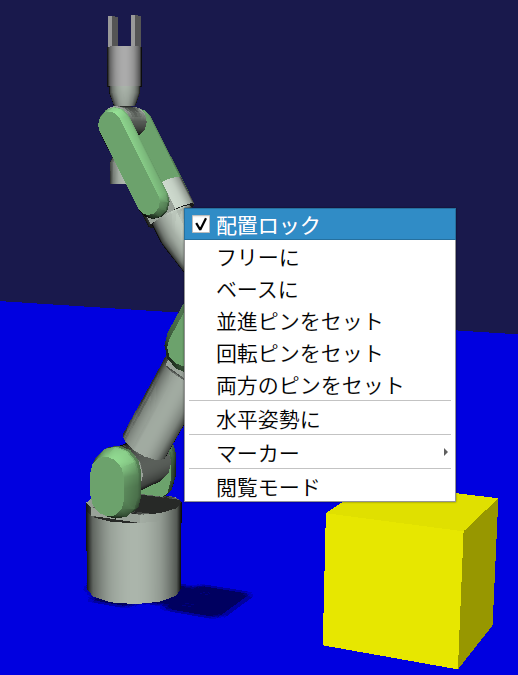

==========================================
Custom Project Item Type Sample (S05)
==========================================

.. contents:: Table of Contents
   :local:

Overview
--------

This section presents a sample related to :doc:`new-item-type`. In this sample, we create a new item type called "BodyPositionItem" and use it to save and restore model positions. This item type will continue to be extended in future sections, and this time we will build its foundation.

Source Code
-----------

.. highlight:: cpp

Here is the source code for this sample. As before, create a plugin source directory and store the following source code with the filename DevGuidePlugin.cpp: ::

 #include <cnoid/Plugin>
 #include <cnoid/ItemManager>
 #include <cnoid/Item>
 #include <cnoid/RootItem>
 #include <cnoid/BodyItem>
 #include <cnoid/ItemList>
 #include <cnoid/ToolBar>
 #include <fmt/format.h>
 
 using namespace std;
 using namespace fmt;
 using namespace cnoid;
 
 class BodyPositionItem : public Item
 {
     BodyItem* bodyItem;
     Isometry3 position;
 
 public:
     BodyPositionItem()
     {
         bodyItem = nullptr;
         position.setIdentity();
     }
    
     BodyPositionItem(const BodyPositionItem& org)
         : Item(org)
     {
         bodyItem = nullptr;
         position = org.position;
     }
    
     virtual Item* doDuplicate() const override
     {
         return new BodyPositionItem(*this);
     }
 
     virtual void onTreePathChanged() override
     {
         auto newBodyItem = findOwnerItem<BodyItem>();
         if(newBodyItem && newBodyItem != bodyItem){
             bodyItem = newBodyItem;
             mvout()
                 << format("BodyPositionItem \"{0}\" has been attached to {1}.",
                           name(), bodyItem->name())
                 << endl;
         }
     }
 
     void storeBodyPosition()
     {
         if(bodyItem){
             position = bodyItem->body()->rootLink()->position();
             mvout()
                 << format("The current position of {0} has been stored to {1}.",
                           bodyItem->name(), name())
                 << endl;
         }
     }
            
     void restoreBodyPosition()
     {
         if(bodyItem){
             bodyItem->body()->rootLink()->position() = position;
             bodyItem->notifyKinematicStateChange(true);
             mvout()
                 << format("The position of {0} has been restored from {1}.",
                           bodyItem->name(), name())
                 << endl;
         }
     }
 };
 
 class DevGuidePlugin : public Plugin
 {
 public:
     DevGuidePlugin()
         : Plugin("DevGuide")
     {
         require("Body");
     }
        
     virtual bool initialize() override
     {
         itemManager()
             .registerClass<BodyPositionItem>("BodyPositionItem")
             .addCreationPanel<BodyPositionItem>();
        
         auto toolBar = new ToolBar("DevGuideBar");
         toolBar->addButton("Store Body Positions")->sigClicked().connect(
             [this](){ storeBodyPositions(); });
         toolBar->addButton("Restore Body Positions")->sigClicked().connect(
             [this](){ restoreBodyPositions(); });
         toolBar->setVisibleByDefault();
         addToolBar(toolBar);
 
         return true;
     }
            
     void storeBodyPositions()
     {
         for(auto& item : RootItem::instance()->selectedItems<BodyPositionItem>()){
             item->storeBodyPosition();
         }
     }
    
     void restoreBodyPositions()
     {
         for(auto& item : RootItem::instance()->selectedItems<BodyPositionItem>()){
             item->restoreBodyPosition();
         }
     }
 };
 
 CNOID_IMPLEMENT_PLUGIN_ENTRY(DevGuidePlugin)

The CMakeLists.txt for building is the same as :doc:`item-operation-sample`.

.. _plugin-dev-body-position-item:

BodyPosition Item Functionality
-------------------------------

.. highlight:: text

The BodyPositionItem created in this sample is an item that saves and restores the position of BodyItem models.
Let's first explain how to use it.

As with previous samples, first load some model as a BodyItem.
If you don't have a particular model to try, let's load the same PA10Pickup.cnoid project file as before.

BodyPositionItem is used in association with BodyItem.
This is achieved by placing the BodyPositionItem as a child item of the target BodyItem.
To do this, first select an appropriate BodyItem, then select "BodyPosition" from the main menu "File" - "New".
If this plugin is loaded properly, you should be able to select this item.
If you can't find this item, the plugin build or installation has failed, so please check that.

This will display the following creation dialog. Enter a name here and press the "Create" button to create the item.

To make it clearer later, let's add number 1 to the name and set it as "BodyPosition1".
When doing this for PA10 in the PA10Pickup sample, the item tree looks like this: ::

 + World
   + PA10
     + SimpleController
     + BodyPosition1
   + box2
   + box3
   + floor
   + AISTSimulator

At this time, the following is displayed in the message view: ::

 BodyPositionItem "BodyPosition1" has been attached to PA10.

This shows that the "BodyPosition1" we created has been associated with PA10.

If the item was created in a different location, drag the item in the item tree view so that it becomes a child item of PA10.
If you do this and see the above message, that's OK.

Next, perform the position recording operation. This operation is performed from "BodyPositionBar", which is a toolbar introduced by this plugin.
The image of this toolbar is shown below.

This toolbar has two buttons. Position recording is done with the first button, "Store Body Positions".

First, select the BodyPositionItem you want to record the position of. Let's select "BodyPosition1" here. Then click the "Store Body Positions" button.
The message view will display the following, showing that the position has been recorded: ::

 The current position of PA10 has been stored to BodyPosition1.

Next, let's move the model and record its position in another BodyPositionItem.
If you're familiar with Choreonoid operations, moving models should be no problem, but here we'll explain how to move the PA10 model in the PA10Pickup sample.

First, the PA10 model in this sample is in a "locked" state for movement, so let's unlock it.
To do this in the scene view, first put the scene view in edit mode, then right-click with the mouse cursor pointing at the PA10 model.
This displays the following context menu, where you can unlock by unchecking "Position Lock".

After unlocking and clicking the robot's base part, drag handles are displayed as shown below.

In this state, you can move the model by dragging the base part or handles. You can also rotate the model by dragging the fan-shaped handles.

Let's move PA10 by dragging appropriately. It can be anything, but for example, let's move it to the following position.

.. note:: Choreonoid provides various interfaces for model manipulation, and you can move models by means other than dragging in the scene view introduced here. For example, you can also move models in the "Location View" usually placed in the upper right of the main window.

Now let's create a second BodyPositionItem. As before, select PA10 and create it from the main menu "File" - "New" - "BodyPosition". This time, name it "BodyPosition2". The item arrangement under PA10 becomes: ::

 + World
   + PA10
     + SimpleController
     + BodyPosition1
     + BodyPosition2
  
.. note:: It's also OK to create the second BodyPositionItem by copying BodyPosition1. In that case, execute "Copy (Single)" from the right-click menu of BodyPosition1, then execute "Paste" from the right-click menu of the copy destination item. After that, change the name of the pasted item to BodyPosition2.

Once BodyPosition2 is placed, select it and click "Store Body Positions" on the BodyPositionBar. The message view displays: ::

 The current position of PA10 has been stored to BodyPosition2.

Now two different positions have been recorded in BodyPosition1 and BodyPosition2 respectively.

Next, let's restore the recorded positions. Select BodyPosition1 and click "Restore Body Positions" on the BodyPositionBar.
The model returns to the first recorded position. Next, select BodyPosition2 and click "Restore Body Positions" again, and it moves to that recorded position.
In this way, BodyPositionItem can record model positions and recall them later.

The position recorded in BodyPositionItem is information independent of the model, so it can be applied to other models.
For example, drag BodyPosition2 in the item tree view to make it a child item of box2, creating the following tree structure: ::

 + World
   + PA10
     + SimpleController
     + BodyPosition1
   + box2
     + BodyPosition2
   + box3

The message view will display: ::

  BodyPositionItem "BodyPosition2" has been attached to box2.
       
In this state, select BodyPosition1 and click "Restore Body Positions". The yellow box moves to PA10's initial position, resulting in the following arrangement.

In this way, recorded position information can be reused between models.

You can also record and restore positions for multiple models simultaneously. In that case, prepare a BodyPositionItem for each model, select all BodyPositionItems you want to record or restore, and click "Store Body Positions" or "Restore Body Positions".

Source Code Explanation
-----------------------

.. highlight:: cpp

Based on the explanations of previous samples, we'll focus on parts specific to this sample. ::

 #include <cnoid/ItemManager>

Including the ItemManager header for registering item types. ::

 #include <cnoid/Item>

The Item class header. Since custom items are defined by inheriting from the Item class, this is necessary.
Actually, this header is included from the ItemManager header above, so we don't need to write it here, but we're deliberately writing it to make it clear that the Item class is necessary for defining custom items. ::

 using namespace std;
 using namespace fmt;
 using namespace cnoid;

In this sample, we import these three namespaces to make the description concise.
Note that in header files for exposing created classes externally, we usually don't import namespaces like this to prevent name collisions. ::

 class BodyPositionItem : public Item
 {
     ...
 };

Definition of the BodyPositionItem type we're creating. ::

 BodyItem* bodyItem;

We have a pointer to a BodyItem as a member variable. This is used to reference the BodyItem that is the target for position save/restore. ::
 
 Isometry3 position;

A variable of type Isometry3 for storing the model position.
This is a customized type from the Eigen library, basically corresponding to a 4x4 homogeneous transformation matrix for performing coordinate transformations in 3D space.
However, for the 3x3 linear transformation elements of the matrix, it's a type that assumes it's a rotation matrix (orthonormal matrix).
In short, this type is a matrix for representing position and orientation (rotation) in 3D space, and Choreonoid uses it as a variable to store the position and orientation of rigid bodies that make up models. ::

 BodyPositionItem()
 {
     bodyItem = nullptr;
     position.setIdentity();
 }

The item's default constructor.
Since no target BodyItem has been set yet, we initialize bodyItem with nullptr.
For position, we initialize it to the identity matrix with the setIdentity function. This corresponds to the global coordinate origin position. ::

 BodyPositionItem(const BodyPositionItem& org)
     : Item(org)
 {
     bodyItem = nullptr;
     position = org.position;
 }

Defining a copy constructor.
A copy constructor is not necessarily required, but since the duplicate function for duplicating item instances is required, we usually define a copy constructor for its implementation.
We're also executing the parent class Item's copy constructor in the initializer list. In copy constructor implementation, always make sure to execute the parent class's copy constructor like this.
Here we're also copying the contents of position. ::
  
 virtual Item* doDuplicate() const override
 {
     return new BodyPositionItem(*this);
 }

Override and implement the doDuplicate function that returns a duplicate of the instance.
The implementation simply generates a duplicate of the same type using the copy constructor.
The Item class is a Referenced type object and needs to be held with smart pointer ref_ptr after creation, but for the doDuplicate function, it's OK to return the created instance as a raw pointer. ::

 virtual void onTreePathChanged() override
 {
     ...
 }

A virtual function executed when the path to this item in the item tree changes.
By overriding this function, you can implement processing when the positional relationship between items changes.
Below is the description inside this function. ::

 auto newBodyItem = findOwnerItem<BodyItem>();

findOwnerItem is a member function of the Item class that traverses parent items to find an item of a specific type.
Specify the item type you want to find as a template parameter.
Here we're looking for a BodyItem placed above this BodyPositionItem.
If found, it returns that item; if not found, it returns nullptr. 

.. note:: Since findOwnerItem traverses parent items up to the root, it targets upper items that are not necessarily the immediate parent, such as parent's parent. If you want to limit the target to the immediate parent, you can do: ::
	  
       auto newBodyItem = dynamic_cast<BodyItem>(parentItem());

::
  
 if(newBodyItem && newBodyItem != bodyItem){
     bodyItem = newBodyItem;
     ...

If a Body item exists above and it's different from the current target body item, update the target body item. ::

     ...
     mvout()
         << format("BodyPositionItem \"{0}\" has been attached to {1}.",
                   name(), bodyItem->name())
         << endl;
 }

Outputting a message that the BodyPositionItem has been associated with a BodyItem.

In previous samples, we output to the message view through an instance of the MessageView class, but as another output method, you can also use this mvout function. This function returns a reference to std::ostream, and outputting to this stream results in output to the message view. In other words, you can output to the message view in the style of C++ standard input/output streams.

And here we're also using the fmt library for message formatting. The {0} and {1} used here are replacement fields with number specifications, where {0} and {1} are replaced with the contents of subsequent arguments in the order of these numbers. Here we specify name() as the argument corresponding to {0}, which is replaced with the BodyPositionItem's name. And for {1}, bodyItem->name() corresponds, which is replaced with the BodyItem's name.

Next we define a function to save the position. ::

 void storeBodyPosition()
 {
     if(bodyItem){
         position = bodyItem->body()->rootLink()->position();
         mvout()
             << format("The current position of {0} has been stored to {1}.",
                       bodyItem->name(), name())
             << endl;
     }
 }
  
This is a function executed for the selected BodyPositionItem when "Store Body Positions" on the toolbar is clicked.
If the target BodyItem bodyItem is valid, then ::
  
 position = bodyItem->body()->rootLink()->position();

copies the current position and orientation of the Body model's root link to the position variable.
After that, it outputs a message that the position has been saved. ::

 void restoreBodyPosition()
 {
     if(bodyItem){
         bodyItem->body()->rootLink()->position() = position;
         bodyItem->notifyKinematicStateChange(true);
         mvout()
             << format("The position of {0} has been restored from {1}.",
                       bodyItem->name(), name())
             << endl;
     }
 }

This is a function for restoring the position.
It's executed for the selected BodyPositionItem when "Restore Body Positions" on the toolbar is clicked.
As the reverse process of storeBodyPosition, ::

 bodyItem->body()->rootLink()->position() = position;

sets the position and orientation saved in the position variable to the position and orientation of the target Body model's root link.
However, this only updates the variable value, and the GUI display is not updated with just this, but ::
  
  bodyItem->notifyKinematicStateChange(true);
  
updates the GUI display.
This process is the same as in previous samples.
And this function also outputs a message that the position and orientation have been restored.

That's the implementation of BodyPositionItem.

Next, we enter the plugin implementation. First in the initialize function: ::

 itemManager()
     .registerClass<BodyPositionItem>("BodyPositionItem")
     .addCreationPanel<BodyPositionItem>();

we register the BodyPositionItem class.
This is the process explained in :ref:`plugin-dev-item-type-registration`.
However, here we're writing multiple functions consecutively for the instance obtained with itemManager().
Basically, ItemManager functions return their own reference, so you can write the necessary registration processes together like this. ::

 auto toolBar = new ToolBar("DevGuideBar");
 toolBar->addButton("Store Body Positions")->sigClicked().connect(
     [this](){ storeBodyPositions(); });
 toolBar->addButton("Restore Body Positions")->sigClicked().connect(
     [this](){ restoreBodyPositions(); });
 toolBar->setVisibleByDefault();
 addToolBar(toolBar);

Creating a toolbar.
Using the methods introduced in :doc:`toolbar` and :doc:`toolbar-sample`, we generate a toolbar, add buttons to it, and finally register it.
For each button, we connect functions to the sigClicked signal so that the corresponding function is executed when clicked. ::

 void storeBodyPositions()
 {
     for(auto& item : RootItem::instance()->selectedItems<BodyPositionItem>()){
         item->storeBodyPosition();
     }
 }

A function executed when the "Store body positions" button on the toolbar is clicked. ::
  
 RootItem::instance()->selectedItems<BodyPositionItem>()

returns selected BodyPositionItem type items as ItemList<BodyPositionItem>. We iterate through this with a for loop, and for each element: ::
  
 item->storeBodyPosition();

executes the BodyPositionItem's storeBodyPosition function.
This performs position recording.

Also, when the "Restore body positions" button on the toolbar is clicked, the following is executed: ::

 void restoreBodyPositions()
 {
     for(auto& item : RootItem::instance()->selectedItems<BodyPositionItem>()){
         item->restoreBodyPosition();
     }
 }

This also executes the restoreBodyPosition function of selected BodyPositionItems, similar to the storeBodyPositions function.
This performs position restoration.