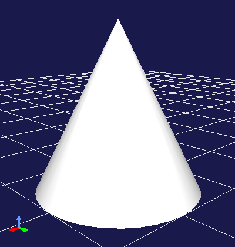

====================
Scene Creation Helpers
====================

.. contents:: Table of Contents
   :local:

.. highlight:: cpp  

Overview
--------

While the classes introduced in :ref:`plugin-dev-scene-node-classes` have the ability to represent diverse shapes and scenes, it is often not practical to directly write all scene data including meshes in code. As solutions to this, you can use primitive shapes for relatively simple shapes and scenes, and for complex shapes and scenes, it is common to load model files created with dedicated tools. This section introduces how to use these methods in Choreonoid.

.. _plugin-dev-use-primitive-shapes:

Using Primitive Shapes
----------------------

Geometric shapes that can be directly generated and edited in graphics and physics calculation systems are called "geometric primitives" or "primitive shapes". Primitive shapes generally include simple shapes defined by a small number of parameters such as boxes, spheres, and cylinders. You can use primitive shapes as-is for objects in a scene, or combine them to express more complex shapes. Primitive shapes can also be used in Choreonoid's scene graph.

.. _plugin-dev-mesh-generator:

MeshGenerator
~~~~~~~~~~~~~

In the Choreonoid SDK, you can generate primitive shapes for scene graphs using the `MeshGenerator class <https://choreonoid.org/en/documents/reference/latest/classcnoid_1_1MeshGenerator.html>`_. This class is defined in the Util library and becomes available by including the MeshGenerator header.

The shapes that can be generated are box (rectangular parallelepiped), sphere, cylinder, cone, capsule, arrow, and torus. You can generate the corresponding mesh (SgMesh object) for each using the following member functions of MeshGenerator:

* **SgMesh* generateBox(const Vector3& size)**

  * Generates a box

  * Specify lengths in X, Y, and Z axis directions as parameters

* **SgMesh* generateSphere(double radius)**

  * Generates a sphere

  * Specify radius as parameter

* **SgMesh* generateCylinder(double radius, double height)**

  * Generates a cylinder

  * Specify radius and height as parameters

* **SgMesh* generateCone(double radius, double height)**

  * Generates a cone

  * Specify radius and height as parameters

* **SgMesh* generateCapsule(double radius, double height)**

  * Generates a capsule

  * Specify radius and height as parameters

* **SgMesh* generateArrow (double cylinderRadius, double cylinderHeight, double coneRadius, double coneHeight)**

  * Generates an arrow

  * Specify the size of the cylinder body and the cone tip as parameters
  
The generated mesh has its origin at the center of the shape in local coordinates.
For cylinders, cones, capsules, and arrows, the height direction aligns with the Y-axis.
To change the center or orientation of a shape, use :ref:`plugin-dev-scenegraph-sgpostransform` or use the transform, translate, and rotate functions of `SgMesh <https://choreonoid.org/en/documents/reference/latest/classcnoid_1_1SgMesh.html>`_.

.. note:: A capsule is a shape that combines a cylinder with two hemispheres, essentially a cylinder with rounded ends. The specified radius and length parameters are applied to both the cylinder and hemispheres. The radius of the hemispheres at both ends matches the radius of the cylinder. An arrow combines a cylinder and cone to create an arrow shape, which can be used for displaying coordinate axes.

For primitives other than boxes, the parts that should originally be spherical surfaces are approximated with meshes. You can adjust how finely these parts are divided using the divisionNumber parameter. The divisionNumber defaults to 20 and can be set and retrieved using the following MeshGenerator functions:

* **void setDivisionNumber(int n)**

  Sets the mesh division number to n.

* **int divisionNumber() const**

  Returns the mesh division number.

The division number corresponds to divisions in latitude and longitude directions for spheres. For cylinders and cones, it's the division number of the outer circumference of the cross-section. Increasing the division number results in smoother display but makes the data and rendering heavier, so adjust it to an appropriate value as needed.

Here's an example of code that generates primitive shapes: ::

 #include <cnoid/MeshGenerator>
 #include <cnoid/EigenUtil>

 using namespace cnoid;
 
 SgNode* generateCone()
 {
     MeshGenerator meshGenerator;
     meshGenerator.setDivisionNumber(36);
     auto shape = new SgShape;
     shape->setMesh(meshGenerator.generateCone(0.5, 1.0));
     auto cone = new SgPosTransform;
     cone->setTranslation(Vector3(0.0, 0.0, 0.5));
     // The radian function is defined in EigenUtil
     cone->setRotation(AngleAxis(radian(90.0), Vector3::UnitX()));
     cone->addChild(shape);
     return cone;
 }
 
Here we apply a coordinate transformation to the cone mesh generated by MeshGenerator so that the base of the cone coincides with the XY plane. When you add the node returned by the generateCone function to the scene, it displays as follows:

.. note:: MeshGenerator also provides the generateExtrusion function for generating extruded shapes and the generateElevationGrid function for generating grid shapes with unevenness. These shapes are more general mesh shapes rather than primitive shapes, but you can use them as needed. These correspond to the Extrusion and ElevationGrid nodes in `VRML97 <https://tecfa.unige.ch/guides/vrml/vrml97/spec/>`_, so please refer to that for usage.

.. _plugin-dev-sgmesh-primitive-information:
	  
SgMesh Primitive Information
~~~~~~~~~~~~~~~~~~~~~~~~~~~~

The SgMesh class that stores mesh information can also have primitive information attached.
When the mesh content corresponds to a primitive shape, this allows recording the primitive type and dimensions.
Currently supported primitives are box, sphere, cylinder, cone, and capsule.

When a mesh generated by MeshGenerator is one of the above primitives, the primitive information is also attached to the SgMesh.

The settable primitive types are defined as the following enumeration in the SgMesh class: ::

 enum PrimitiveType {
    // General mesh (not necessarily a primitive)
    MeshType,
    // Box
    BoxType,
    // Sphere
    SphereType,
    // Cylinder
    CylinderType,
    // Cone
    ConeType,
    // Capsule
    CapsuleType
 };

You can retrieve the currently set primitive using the following SgMesh function:

* **const int primitiveType() const**

The parameters for each primitive are stored as values of the following nested classes (primitive types) defined in the SgMesh class: ::

 class Box {
 public:
     Box() : Box(Vector3(1.0, 1.0, 1.0)) { }
     Box(Vector3 size) : size(size) { }
     Vector3 size;
 };

 class Sphere {
 public:
     Sphere() : Sphere(1.0) { }
     Sphere(double radius) : radius(radius) { }
     double radius;
 };

 class Cylinder {
 public:
     Cylinder() : Cylinder(1.0, 1.0) { }
     Cylinder(double radius, double height)
         : radius(radius), height(height), top(true), bottom(true), side(true) { }
     double radius;
     double height;
     bool top;
     bool bottom;
     bool side;
 };

 class Cone {
 public:
     Cone() : Cone(1.0, 1.0) { }
     Cone(double radius, double height)
         : radius(radius), height(height), bottom(true), side(true) { }
     double radius;
     double height;
     bool bottom;
     bool side;
 };

 class Capsule {
    public:
        Capsule() : Capsule(1.0, 1.0) { }
        Capsule(double radius, double height)
            : radius(radius), height(height) { }
        double radius;
        double height;
    };

 // Type indicating a general mesh, used when clearing primitive information
 class Mesh { };

An SgMesh object stores only the value of the class corresponding to primitiveType among these primitive types.
To retrieve it, use the following function:

* **template<class TPrimitive> const TPrimitive& primitive() const**

  * Returns the settings for the specified primitive type

For example, code to retrieve information when the primitive is a box would be: ::

 if(mesh->primitiveType() == SgMesh::BoxType){
     auto& box = mesh->primitive<SgMesh::Box>();
     double x = box.size().x();
     ...
 }

Note that an exception will be thrown if you try to retrieve primitive type information different from the primitiveType value.

As mentioned above, when generating supported primitive shapes using MeshGenerator, this information is also attached to the generated SgMesh object.
On the other hand, you can also attach primitive information to meshes you construct yourself.
In that case, set the primitive information using the following function:

* **void setPrimitive(Primitive prim)**

Here, the prim argument can be a value of any of the primitive types mentioned above. For example, to set box primitive information to an SgMesh object mesh: ::

 mesh->setPrimitive(SgMesh::Box(1.0, 2.0, 3.0));

Note that the primitive information in SgMesh is merely auxiliary, and even when setting it, the mesh body data (vertices, etc.) is always required.
Since mesh information is set independently from the mesh body data, it's not necessarily guaranteed that they match.
This is the responsibility of the side constructing the SgMesh object, and the user side trusts that they match when using them.

Primitive information is commonly used in processes like collision detection and model editing.
These processes can achieve efficiency and simplification for shapes known to be primitives, but obtaining this from mesh body data is not easy, and having the mesh object also carry primitive information is a great help.

Loading Model Files
-------------------

When scene elements are relatively simple or need to be constructed dynamically, it may be suitable to construct them in program code, utilizing primitive shapes as described above. On the other hand, when using predetermined models, it's suitable to load models created with dedicated tools from files. This is also possible with the Choreonoid SDK. Note that while files that store three-dimensional models only in mesh format are sometimes called "mesh files", here we'll call all three-dimensional model data files "model files", including mesh files.

SceneLoader
~~~~~~~~~~~

Model file loading is performed using the `SceneLoader class <https://choreonoid.org/en/documents/reference/latest/classcnoid_1_1SceneLoader.html>`_. This class is also defined in the Util library and becomes available by including the SceneLoader header. Generate it with the default constructor and use the following functions:

* **void setMessageSink(std::ostream& os)**

  Sets the standard output stream for outputting messages such as errors during loading.
  By default, nothing is output.

* **void setDefaultDivisionNumber(int n)**

  Sets the default division number when loading primitives. The initial setting is the default value of MeshGenerator.

* **void setDefaultCreaseAngle(double theta)**

  Sets the default crease angle when automatically generating normals.

* **SgNode* load(const std::string& filename)**

  Loads the model file specified by filename. Returns the scene node that becomes the root of the loaded model. Returns nullptr if loading fails.

* **SgNode* load(const std::string& filename, bool& out_isSupportedFormat)**

  Attempts to load similarly to the above function. Additionally, returns whether the specified file is in a supported format in out_isSupportedFormat.

Basically, you can load by using the load function, and execute other function settings as needed.
For example, to load a model file called "model.obj": ::

  #include <cnoid/SceneLoader>
  ...

  SceneLoader sceneLoader;

  // Output messages to MessageView if any
  sceneLoader.setMessageSink(MessageView::instance()->cout());

  auto node = sceneLoader.load("model.obj");
  
This loads the contents of model.obj into node.
If loading fails, node becomes nullptr, and (in some cases) the cause of failure is output to MessageView.

File Formats Supported by SceneLoader
~~~~~~~~~~~~~~~~~~~~~~~~~~~~~~~~~~~~~

SceneLoader supports the following file formats by default (standard file extensions in parentheses):

* STL (.stl)
* Wavefront OBJ (.obj)
* VRML97 (.wrl)
* Collada (.dae)
* DirectX .x file (.x)
* Blender (.blend)
* DXF (.dxf)

For STL, OBJ, and VRML97, Choreonoid has native loader implementations. These are implemented in the Util library.
File formats from Collada onwards are loaded by the `Open Asset Import Library (Assimp) <https://github.com/assimp/assimp>`_, a library for loading model files. Therefore, the Assimp plugin must be installed for these file formats.

In addition to these, Choreonoid's standard model file format is also defined and can be loaded. This is called the "standard scene file" with the extension .scen. Since this is specific to Choreonoid and not widely used, we'll omit details here.

For file formats that support primitive shapes, if the file contains primitive shapes that are supported by :ref:`plugin-dev-sgmesh-primitive-information`, the primitive information is also loaded. For example, among the above file formats, VRML97 supports this, and primitive information is also loaded by SceneLoader. Of course, the "standard scene file" also supports primitive information.

Each file format is actually loaded by a dedicated loader class. As the base class hierarchy for this, the `AbstractSceneLoader class <https://choreonoid.org/en/documents/reference/latest/classcnoid_1_1AbstractSceneLoader.html>`_ is defined first. This is defined as an abstract class, and a loader class inheriting this class is implemented for each file format. Choreonoid implements the following loader classes corresponding to the above file formats:

* STLSceneLoader
* ObjSceneLoader
* VRMLSceneLoader
* AssimpSceneLoader

SceneLoader is also a loader class that inherits AbstractSceneLoader, but it doesn't target a specific file format and actually uses the above loaders internally for the loading process. It determines the file format from the extension given to the load function and selects the actual loader to use. In most cases, you should use this SceneLoader, but you can also use dedicated loaders when loading files of specific formats.
  
Other file formats can also be supported by implementing additional loaders. We won't go into details here, but you can create a loader class that inherits AbstractSceneLoader and register it with SceneLoader's static function registerLoader.

.. note:: The Assimp library itself supports quite a number of file formats besides those listed above, but AssimpSceneLoader is currently configured to only load formats that have been confirmed to load properly as Choreonoid scene graphs.