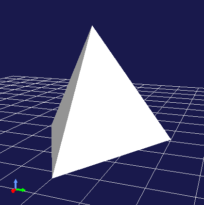
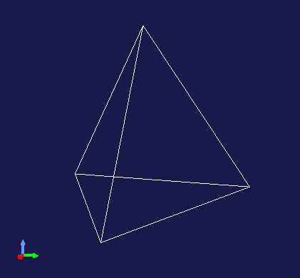

============
Scene Graph
============

.. contents:: Table of Contents
   :local:

Overview
--------

Choreonoid is a framework for handling virtual worlds containing robots, with functionality to store model data of objects and mechanisms that make up the virtual world and render them as three-dimensional computer graphics. In the Choreonoid SDK, the virtual world that is the target of such rendering is collectively called a "scene", and it is stored in a data structure called a `scene graph <https://en.wikipedia.org/wiki/Scene_graph>`_.

To render your own models and data as scenes in plugins, knowledge of this scene graph is essential.
Therefore, this section explains the concept and usage of this scene graph.

.. _plugin-dev-about-scenegraph:

What is a Scene Graph
---------------------

.. highlight:: text

A scene graph is a graph structure with scene components as nodes, constructing the entire scene by combining multiple nodes. Although it is called a graph, the actual structure is more like a tree, with a root node that serves as the starting point of the entire scene, and other nodes are introduced into the scene in a hierarchical (parent-child relationship) structure from the root. However, the same node can be shared as a child node by multiple nodes, or conversely, a node can have multiple parents. In that case, it exceeds the scope of a tree structure, but a graph, which is a more general data structure, can cover this case.

There are various types of nodes that make up a scene graph. Basically, there are nodes corresponding to objects (shapes) that exist in the scene, and object nodes are structured by group nodes that organize them and coordinate transformation nodes that build their relative positional relationships. In addition, nodes that add light sources (lights) and nodes for defining viewpoints can also be used.

Here, we will show a very simple example to help those learning about scene graphs for the first time get an image.
First, imagine that there is one spherical object in the scene.
If the corresponding node is called Sphere, the scene graph is represented as follows: ::

 + Root
   - Sphere

Here, the node called Root is the root node that serves as the starting point of the entire scene. Sphere is a child node of Root.

Let's add an object there. For example, imagine a box-shaped object. If this is a Box node, the scene graph is represented as follows: ::

 + Root
   + Group1
     - Sphere
     - Box

The two objects are grouped together by a group node called Group1. Both Sphere and Box grouped together are child nodes of Group1.

In this case, the positions of each object are fixed, but let's say we want to move each to an arbitrary position. In that case, we introduce coordinate transformation nodes and do the following: ::

 + Root
   + Group1
     + Position1
       - Sphere
     + Position2
       - Box

Here, Position1 and Position2 are coordinate transformation nodes related to position. This node has position parameters, and that coordinate transformation is applied to nodes below the child nodes. In this case, you can change the positions of Sphere and Box respectively by changing the parameters of Position1 and Position2.

Furthermore, let's add an object and fix it to Box. Assuming the added object is cylindrical, and this node is Cylinder, the scene graph can be configured as follows: ::

 + Root
   + Group1
     + Position1
       - Sphere
     + Position2
       - Box
       + Position3
         - Cylinder

Here, Position3 is introduced to fix Cylinder to any location on Box. Position3 sets the position in relative coordinates from Box.
Also, in this situation, if you change the position parameter of Position2, Box and Cylinder will move together (simultaneously).

So far, everything has been a tree structure, but here's an example where it's no longer a tree structure: ::

 + Root
   + Group1
     + Position1
       - Sphere
     + Position2
       - Box
       + Position3
         - Sphere

Here we've replaced the previous Cylinder with Sphere. And this Sphere is the same node as the Sphere introduced first (which is a child node of Position1). That is, this is precisely represented as: ::

 + Root
   + Group1
     + Position1
       - --------------+ 
     + Position2       |
       - Box           +- Sphere
       + Position3     |
         - ------------+

By doing this, Sphere data can be shared from two places in the scene. However, since the paths of nodes from the root are different for the two places, the effects they receive are different. In this example, the position of Sphere will be different in the two places.

By sharing nodes in this way, you can reduce the data amount of the entire scene. This has a great effect when shapes are complex or when there are many of the same shape. Also, for shared nodes, you can update multiple places in the scene with a single operation.

.. note:: The structure of a scene graph is also very similar to the structure of a robot. The Body class for representing robot models in Choreonoid also has a tree structure with Link class objects representing the links that make up the robot as nodes. There, parent-child relationships of links are built for each joint, which defines the relative positional relationships between links, and each link also has a shape. However, while scene graphs only store information related to appearance, robot models differ in that they also have physical parameters such as mass and center of gravity, as well as other information related to robot mechanisms. On top of that, the Link class has data corresponding to its shape and appearance in the form of a scene graph.

That's the overview of scene graphs. Scene graphs are popular as rendering systems for three-dimensional computer graphics, and there are many implementations of rendering libraries and game engines based on this structure. Among them, a classic one is the `Open Inventor <https://en.wikipedia.org/wiki/Open_Inventor>`_ library developed by Silicon Graphics in the 1990s. This library is explained in detail in a book called `Inventor Mentor <https://www.amazon.com/Inventor-Mentor-Programming-Object-Oriented-Graphics/dp/0201624958/>`_, and `its web version <https://developer9.openinventor.com/UserGuides/9.9/Inventor_Mentor/index.html>`_ is also available, so please refer to it if you're interested. Although it's an old library now, much of the content is still relevant today. Incidentally, an implementation called `Coin3D <https://www.coin3d.org/>`_ is still available today.

Overview of Choreonoid's Scene Graph
------------------------------------

Choreonoid uses its own scene graph implementation. This was built to match Choreonoid's functions and uses while referring to existing libraries and three-dimensional modeling languages including Open Inventor. This implementation is relatively simple, does not particularly depend on external libraries, and almost all of the implementation is complete within Choreonoid. The data structure of the scene graph body is designed not to depend on specific rendering APIs.

Of course, actual rendering needs to be done using some rendering API, and a rendering class called a renderer is prepared for that. Currently, `GLSLSceneRenderer <https://choreonoid.org/en/documents/reference/latest/classcnoid_1_1GLSLSceneRenderer.html>`_ which uses OpenGL version 3.3 is used as the default renderer.

The scene graph design also refers to parts of the three-dimensional modeling language VRML97, so the `VRML97 specification <https://tecfa.unige.ch/guides/vrml/vrml97/spec/>`_ and various documents may be helpful when using scene graphs.

Scene Graph Class Hierarchy
---------------------------

The minimum unit of objects that make up a scene graph is the `SgObject class <https://choreonoid.org/en/documents/reference/latest/classcnoid_1_1SgObject.html>`_. This is a :doc:`Referenced type <referenced>` class, which is dynamically created and shared by pointers, and references are held by ref_ptr smart pointers as needed.

Among SgObjects, those that can be introduced into the scene graph independently are defined as the `SgNode class <https://choreonoid.org/en/documents/reference/latest/classcnoid_1_1SgNode.html>`_ that inherits from SgObject.

To summarize, there are SgObject and SgNode as the base classes of the scene graph, and they are defined in the following class hierarchy: ::

 + Referenced
   + ClonableReferenced
     + SgObject
       + SgNode

SgObject and SgNode hold basic attributes as scene components, but you cannot build any meaningful scene with just these classes. In practice, many classes that inherit from these classes are defined, and scenes are built using those derived classes. Below, we will call all objects based on SgObject "scene objects".

All scene objects can be said to be "nodes" that make up the scene graph in a broad sense. However, there are objects that can only be introduced into the scene graph as child elements of other objects. On the other hand, there are objects that can be introduced into the scene graph independently. Since the processing methods differ in some situations, we distinguish the latter as "nodes" in a narrow sense from the former. SgNode is defined as the base for that, and objects that inherit from it are called "scene nodes".

.. note:: `ClonableReferenced <https://choreonoid.org/en/documents/reference/latest/classcnoid_1_1ClonableReferenced.html>`_ included in the above class hierarchy is a class for standardizing the API related to copying Referenced type objects. For classes that inherit from this, you can collectively copy groups of objects that reference each other using the `CloneMap class <https://choreonoid.org/en/documents/reference/latest/classcnoid_1_1CloneMap.html>`_. We introduce this because such processing is often needed when handling scene graphs.

These classes are implemented in the Util library of the Choreonoid SDK, and

.. code-block:: cpp

 #include <cnoid/SceneGraph>

They become available by including the SceneGraph header.

Basic types of scene objects are defined in the Util library, but there are also types defined in other libraries and plugins. For example, those that coordinate with the GUI are defined in the Base module, and those that coordinate with robot models are defined in the Body library and Body plugin. Of course, it's also possible to define and use new scene object types in your own plugins.

Headers for scene objects are divided by object category.
The following shows an overview of headers included in the Util library:

* **SceneGraph**

  * Basic objects
  * Nodes related to grouping and coordinate transformation

* **SceneDrawables**

  * Objects/nodes related to shapes and appearances that are the substance of rendering

* **SceneLights**

  * Nodes related to light sources (lights)

* **SceneCameras**

  * Nodes related to viewpoints (cameras)
  
* **SceneEffects**

  * Nodes that give some additional effects to rendering

The following shows the class hierarchy of major node types included in these headers. The contents in parentheses are an overview of each class: ::

 + SgNode
   + SgShape (shape)
   + SgPlot (plot target data)
     + SgLineSet (line group)
     + SgPointSet (point group)
   + SgGroup (grouping)
     + SgTransform (coordinate transformation)
       + SgPosTransform (rotation + translation)
       + SgScaleTransform (scaling)
       + SgAffineTransform (general affine transformation)
     + SgSwitchableGroup (on/off switching)
     + SgBoundingBox (bounding box display)
     + SgHighlight (highlight display)
     + SgTransparentGroup (transparency)
     + SgOverlay (overlay display)
       + SgViewportOverlay (overlay display on viewport)
   + SgPreprocessed (nodes requiring preprocessing during rendering)
     + SgLight (light source)
       + SgDirectionalLight (directional light)
       + SgPointLight (point light)
         + SgSpotLight (spotlight)
     + SgCamera (camera)
       + SgPerspectiveCamera (perspective projection camera)
       + SgOrthographicCamera (orthographic projection camera)
     + SgFog (fog)

Also, the following shows the main scene object types that are not node types. These are used as components of specific node types: ::
     
 + SgObject
   + SgMeshBase (common information for mesh types)
     + SgMesh (standard mesh information)
     + SgPolygonMesh (mesh information consisting of arbitrary polygons)
   + SgMaterial (material information such as color)
   + SgTexture (texture information)
   + SgTextureTransform (texture coordinate transformation)
   + SgImage (image data)
   + SgVertexArray (vertex array)
   + SgNormalArray (normal array)
   + SgColorArray (color array)
   + SgIndexArray (index array)
   + SgSwitch (on/off state)

.. note:: As can be seen from these hierarchy diagrams, the type names of objects that are components of scene graphs are given the prefix "Sg". This is derived from "Scene Graph" and is given to avoid name conflicts and clarify that they are scene graph elements for element types that often have general names. This could be handled by adding namespaces, but since these are basic classes of the Choreonoid SDK already in the cnoid namespace, we avoid using additional namespaces to allow more concise descriptions. Note that even for scene graph elements, some more applied/composite classes do not have this prefix.

.. _plugin-dev-scene-node-classes:

How to Use Scene Objects
------------------------

We introduced the main scene object types and an overview of each type in the class hierarchy diagram above, but here we explain how to use the most basic types among them. Most scenes can be built using these object types.

SgShape
~~~~~~~

`SgShape <https://choreonoid.org/en/documents/reference/latest/classcnoid_1_1SgShape.html>`_ is a node that represents shape. This node is basically the main body of the scene, and the entire scene is built by arranging this node with other nodes.

This node is a node that brings together the following three objects related to shape rendering:

* Mesh (SgMesh)
* Material (SgMaterial)
* Texture (SgTexture)

The mesh object can be get/set with the following functions of SgShape:

* **SgMesh* mesh()**

  * Returns the currently set mesh. Returns nullptr if there is none.

* **SgMesh* setMesh(SgMesh* mesh)**

  * Sets the specified mesh.

* **SgMesh* getOrCreateMesh()**

  * Returns the already set mesh if there is one, otherwise creates a new one, sets it, and returns it.

Materials and textures can also be get/set with the following functions:

* **SgMaterial* material()**
* **SgMaterial* setMaterial(SgMaterial* material)**
* **SgMaterial* getOrCreateMaterial()**

* **SgTexture* texture()**
* **SgTexture* setTexture(SgTexture* texture)**
* **SgTexture* getOrCreateTexture()**

These objects are all held by smart pointers. Therefore, the existence of the held objects is guaranteed while SgShape exists.
  
For SgShape to be rendered, at least a mesh must be set, but materials and textures are not required.
If no material is set, the default material is used and the color is gray.
However, the mesh may have color information, in which case coloring is done based on that.

.. _plugin-dev-scenegraph-sgmesh:

SgMesh
~~~~~~

`SgMesh <https://choreonoid.org/en/documents/reference/latest/classcnoid_1_1SgMesh.html>`_ is an object that stores mesh information. It is not introduced into the scene graph by itself, but is always set in SgShape and introduced. This class also inherits from `SgMeshBase <https://choreonoid.org/en/documents/reference/latest/classcnoid_1_1SgMeshBase.html>`_ and uses the information defined there as well.

SgMesh can store the following data:

* **Vertices**

  * Array of 3D vectors
  * Holds array object SgVertexArray with Vector3f type elements as smart pointer
  * Get/set using functions vertices, setVertices, getOrCreateVertices

* **Faces**

  * Composed of triangular polygons
  * Array of integer index values
  * Specifies 3 vertices of triangle by indices in vertex array
  * Holds vertex index values of number of faces x 3
  * Directly holds array object SgIndexArray with int type elements
  * Access array with function faceVertexIndices
  * Reference values for each face with function triangle
  * Add faces with functions newTriangle, addTriangle

* **Normals**

  * Array of 3D vectors
  * Holds array object SgNormalArray with Vector3f type elements as smart pointer
  * Get/set using functions normals, setNormals, getOrCreateNormals

* **Normal indices**

  * Can be used to associate vertices with normals
  * Array of integer index values
  * Specifies normals by indices in normal array
  * Stored to match the order of vertex indices in face data
  * Directly holds array object SgIndexArray with int type elements
  * Access with function normalIndices

* **Colors**

  * Array of 3D vectors storing R, G, B three elements
  * Holds array object SgColorArray with Vector3f type elements as smart pointer
  * Get/set using functions colors, setColors, getOrCreateColors

* **Color indices**

  * Can be used to associate vertices of each face with colors
  * Array of integer index values
  * Specifies colors by indices in color array
  * Stored to match the order of indices in face data
  * Directly holds array object SgIndexArray with int type elements
  * Access with function colorIndices

* **Texture coordinates**

  * Array of 2D vectors storing texture UV coordinates
  * Holds array object SgTexCoordArray with Vector2f type elements as smart pointer
  * Get/set using functions texCoords, setTexCoords, getOrCreateTexCoords

* **Texture coordinate indices**

  * Can be used to associate vertices of each face with texture coordinates
  * Array of integer index values
  * Specifies coordinates by indices in texture coordinate array
  * Stored to match the order of indices in face data
  * Directly holds array object SgIndexArray with int type elements
  * Access with function texCoordIndices

The minimum required for rendering is vertex and face data.
Normals are usually also required, but normals are not necessary when not performing lighting.
Colors are usually set for the entire mesh with SgMaterial, so there's no need to set them in SgMesh.
Only set color information when you want to change colors for each vertex.
Texture coordinates are required when using textures.

Normal, color, and texture coordinate data each have two types of data: the data body and indices.
Index data is used to associate each data body with face data.
By associating through indices, it's possible to avoid duplication of identical elements in the data body, which can reduce the overall data size.
However, index data doesn't necessarily need to be set.
If not set, elements of the data body are assumed to directly correspond to the arrangement of face vertices.

.. note:: What we refer to as "array objects" in the above explanation are specifically instantiations of the `SgVectorArray template class <https://choreonoid.org/en/documents/reference/latest/classcnoid_1_1SgVectorArray.html>`_ defined in the SceneDrawables header with the target element type. This template class allows functionality similar to std::vector to be used as scene objects.

As an example of mesh construction, here is code that constructs a regular tetrahedron mesh:

.. code-block:: cpp

 auto mesh = new SgMesh;

 mesh->setVertices(
     new SgVertexArray(
         { {  1.154700f,  0.0f, 0.0f },
           { -0.577350f, -1.0f, 0.0f },
           { -0.577350f,  1.0f, 0.0f },
           {  0.0f,       0.0f, 1.632993f }
         }));
 
 mesh->setNormals(
     new SgNormalArray(
         { {  0.0,       0.0,      -1.0      },
           {  0.471405, -0.816497,  0.333333 },
           {  0.471405,  0.816497,  0.333333 },
           { -0.942801,  0.0,       0.333333 }
         }));
 
 mesh->faceVertexIndices() =
     { 0, 1, 2,
       0, 3, 1,
       0, 2, 3,
       1, 3, 2  };
 
 mesh->normalIndices() =
     { 0, 0, 0,
       1, 1, 1,
       2, 2, 2,
       3, 3, 3 };

Each edge of the regular tetrahedron has a length of 1. When this mesh is set in SgShape and rendered, it is displayed as follows:

In the above code, we set the following in order to SgMesh:

* Coordinates of the 4 vertices of the tetrahedron
* 4 normals corresponding to each face
* Indices of vertices that make up each face (triangle)
* Normal indices corresponding to vertex indices for each face

SgMesh also has a "solid attribute" which can be referenced and set with the following functions:

* **bool isSolid() const**

  * Returns the set solid attribute.

* **void setSolid(bool on)**

  * Sets the solid attribute.

The solid attribute represents whether the shape is filled inside or not. If this is true, it is filled, and if false, it is hollow inside. However, as mesh data only has face data, it's not actually filled inside. This attribute is merely about which to assume, and is actually used to decide whether to render the back side of faces. The default is false.

Generally, each face of a mesh has a front and back. In SgMesh, the direction where the vertex order appears counter-clockwise (CCW) when looking at the face is the front surface. And for faces that are on the back side when viewed from the viewpoint, rendering is performed when the solid attribute is false, but not when true. When false, it's assumed that the inside is hollow, so the back side of faces may be visible. On the other hand, when true, it's assumed that the inside is filled, so the back side cannot be seen in the first place (= no need to render the back side). Conversely, for objects where the back side of faces should not be visible, set this attribute to true. Then back face rendering is skipped, resulting in slightly faster rendering.

SgMaterial
~~~~~~~~~~

`SgMaterial <https://choreonoid.org/en/documents/reference/latest/classcnoid_1_1SgMaterial.html>`_ is an object that represents the material of object surfaces and is set in SgShape for use. This object has the following attributes:

.. list-table::
 :widths: 24,14,24,20,18
 :header-rows: 1

 * - Attribute
   - Value Type
   - Meaning
   - Value Range
   - Default Value
 * - **ambientIntensity**
   - float
   - Ambient light intensity
   - 0.0~1.0
   - 1.0
 * - **diffuseColor**
   - Vector3f
   - Diffuse light color
   - 0.0~1.0 (each element)
   - (1, 1, 1)
 * - **emissiveColor**
   - Vector3f
   - Emissive light color
   - 0.0~1.0 (each element)
   - (0, 0, 0)
 * - **specularColor**
   - Vector3f
   - Specular light color
   - 0.0~1.0 (each element)
   - (0, 0, 0)
 * - **specularExponent**
   - float
   - Specular reflection exponent (shininess)
   - 0.0~
   - 25.0
 * - **transparency**
   - float
   - Transparency
   - 0.0~1.0
   - 0.0

The values of each attribute can be obtained with the following member functions:

* **float ambientIntensity() const**
* **const Vector3f& diffuseColor() const**
* **const Vector3f& emissiveColor() const**
* **const Vector3f& specularColor() const**
* **float specularExponent() const**
* **float transparency() const**
        
Also, values can be set with the following member functions:

* **void setAmbientIntensity(float intensity)**
* **void setDiffuseColor(const Vector3f& color)**
* **void setEmissiveColor(const Vector3f& color)**
* **void setSpecularColor(const Vector3f& color)**
* **void setSpecularExponent(float e)**
* **void setTransparency(float t)**

.. note:: The color arguments of the above functions are actually defined as templates and can set values with any Eigen vector type, but here we've shown them with the corresponding member variable types for clarity.
  
By creating and setting SgMaterial and setting it in SgShape, the set material attributes are reflected in shape rendering.

SgTexture
~~~~~~~~~

`SgTexture <https://choreonoid.org/en/documents/reference/latest/classcnoid_1_1SgTexture.html>`_ is an object that stores texture information and is set in SgShape for use. This object consists of the following objects:

* Texture image (SgImage)
* Texture coordinate transformation (SgTextureTransform)

The texture image is stored as a scene object of `SgImage type <https://choreonoid.org/en/documents/reference/latest/classcnoid_1_1SgImage.html>`_. This is get/set with the following functions:

* **SgImage* image()**

  * Returns the currently set image. Returns nullptr if there is none.

* **SgImage* setImage(SgImage* image)**

  * Sets the image.

* **SgImage* getOrCreateImage()**

  * Returns the already set image if there is one, otherwise creates an empty image, sets it, and returns it.

SgImage is a wrapper that makes the `Image class <https://choreonoid.org/en/documents/reference/latest/classcnoid_1_1Image.html>`_ available as a scene object. This can be accessed with the following functions of SgImage:

* **Image& image()**

  * Returns the Image object.
    
* **const Image& constImage() const**

  * Returns a const Image object. Use this when not updating the image.

The Image class is a general-purpose two-dimensional image class, and the image data body is stored here. This class has functions to change image size and access pixel data, and can also input/output image files.

For example, the following code can load a texture file and set it in an SgShape node: ::

  auto shape = new SgShape;
  ...
  shape->getOrCreateTexture()->getOrCreateImage()->image().load("texture.png");
  

Coordinate transformation can also be applied to texture images.
In that case, coordinate transformation information is stored as a scene object of `SgTextureTransform type <https://choreonoid.org/en/documents/reference/latest/classcnoid_1_1SgTextureTransform.html>`_.
Similar to texture images, coordinate transformation objects can be get/set using the following functions:

* **SgTextureTransform* textureTransform()**
* **SgTextureTransform* setTextureTransform(SgTextureTransform* image)**
* **SgTextureTransform* getOrCreateTextureTransform()**

SgTextureTransform allows setting rotation and scaling. Please refer to the reference manual for details.

SgLineSet
~~~~~~~~~

`SgLineSet <https://choreonoid.org/en/documents/reference/latest/classcnoid_1_1SgLineSet.html>`_ is a node that stores line groups. This allows expressing figures that combine multiple line segments.

This node would be used as an auxiliary expression to make the scene visually easier to understand, rather than as an object.
An example of use is the floor grid lines displayed by default in Choreonoid's scene view.

This class inherits from `SgPlot class <https://choreonoid.org/en/documents/reference/latest/classcnoid_1_1SgPlot.html>`_, and much of the information needed for constructing line groups is defined there. SgPlot is also inherited by SgPointSet explained next, and is a class that defines the common parts of SgLineSet and SgPointSet.

The usage of SgLineSet has some common parts with the usage of SgShape and SgMesh. Such parts include:

* Setting vertex data
* Setting materials
* Setting color data for each vertex (if necessary)

These can be set using the same functions/data types as SgShape and SgMesh.
Those functions are defined in the SgPlot class.

On the other hand, unlike SgShape and SgMesh, you need to set line segment data instead of face data.
This can be get/set using the following functions of SgLineSet:

* **SgIndexArray& lineVertexIndices()**

  * Returns the array object that specifies points at both ends of line segments by indices in the vertex array.
  * Stores 2 elements per line segment x index values for all line segments.

* **void addLine(int v0, int v1)**

  * Adds a line segment.
  * Specifies indices of vertices at both ends of the line segment.
  * The specified index pair is added to lineVertexIndices.

* **int numLines() const**

  * Returns the number of currently set line segments.

* **LineRef line(int i)**

  * Returns an array containing 2 vertex indices of the i-th line segment

As an example, here is code that stores the edges of the regular tetrahedron sample introduced in the explanation of :ref:`plugin-dev-scenegraph-sgmesh` in SgLineSet:

.. code-block:: cpp  

 auto lineSet = new SgLineSet;
 
 lineSet->setVertices(
     new SgVertexArray(
         { {  1.154700f,  0.0f, 0.0f },
           { -0.577350f, -1.0f, 0.0f },
           { -0.577350f,  1.0f, 0.0f },
           {  0.0f,       0.0f, 1.632993f }
         }));
 
 lineSet->lineVertexIndices() =
     { 0, 1,
       0, 2,
       0, 3,
       1, 2,
       1, 3,
       2, 3 };

When this node is rendered, it is displayed as follows:

SgLineSet can also set and reference line width with the following functions:

* **void setLineWidth(float width)**

  * Sets the line width. The default is 1.

* **float lineWidth() const**

  * Returns the currently set line width.

SgPointSet
~~~~~~~~~~

`SgPointSet <https://choreonoid.org/en/documents/reference/latest/classcnoid_1_1SgPointSet.html>`_ is a node that stores point groups.
This node is often used for visualizing data obtained from 3D distance measurement sensors using lasers or stereo cameras.

This class also inherits from `SgPlot class <https://choreonoid.org/en/documents/reference/latest/classcnoid_1_1SgPlot.html>`_ like SgLineSet. Most of the data required for point groups is defined in SgPlot, and only the following functions related to point size are additionally defined in SgPointSet:

* **void setPointSize(double size)**

  * Sets the size (point size) of each point during rendering. The default is 1.

* **double pointSize() const**

  * Returns the currently set point size.

When vertex data is set, each vertex is rendered as a point as is.
On top of that, if you want to set colors for each vertex, also set color data.
If you want to set colors for all vertices at once, you can also set them with materials.

SgGroup
~~~~~~~

`SgGroup <https://choreonoid.org/en/documents/reference/latest/classcnoid_1_1SgGroup.html>`_ is a node that stores multiple nodes as child nodes and hierarchizes the scene graph.

SgGroup has many functions for handling child nodes. Among them, the following can be listed as basic functions:

* **void addChild(SgNode* node, SgUpdateRef update = nullptr)**

  * Adds a child node.

* **bool removeChild(SgNode* node, SgUpdateRef update=nullptr)**

  * Removes a child node.

* **int numChildren() const**

  * Returns the number of child nodes held.

* **SgNode* child(int i)**

  * Returns the i-th child node.

Using these functions, you can build hierarchical scene graphs as described in :ref:`plugin-dev-about-scenegraph` or search for nodes within the scene graph.

For searching, depth-first search can be done with the following code:

.. code-block:: cpp

 void traverse(SgNode* node)
 {
     // do something for node
     ...

     if(node->isGroupNode()){
         auto group = node->toGroupNode();
         int n = group->numChildren();
         for(int i=0; i < n; ++i){
             traverse(group->child(i));
         }
     }
 }

Note that SgGroup also has begin and end functions that return iterators for child items, so the above for statement can be replaced with a range-based for statement as follows:

.. code-block:: cpp

 for(auto& child : *group){
     ...
 }

The update argument defined in the above functions addChild and removeChild is used when notifying external parties of child node addition or removal.
Details of this are explained in :ref:`plugin-dev-scenegraph-update-notification`.

.. _plugin-dev-scenegraph-sgpostransform:

SgPosTransform
~~~~~~~~~~~~~~

`SgPosTransform <https://choreonoid.org/en/documents/reference/latest/classcnoid_1_1SgPosTransform.html>`_ is a coordinate transformation node consisting of translation and rotation. Translation and rotation essentially mean moving the position (including orientation) of an object. The "Pos" included in the class name is an abbreviation for Position, indicating that it is a coordinate transformation related to position.

This node inherits from SgGroup and can have child nodes like SgGroup. At that time, the set coordinate transformation is applied to the child nodes. As a result, the relative position between parent and child nodes changes.

.. note:: To be precise, SgPosTransform inherits from `SgTransform class <https://choreonoid.org/en/documents/reference/latest/classcnoid_1_1SgTransform.html>`_, and SgTransform inherits from SgGroup. There are other nodes that perform coordinate transformation, but they all inherit from SgTransform, which is the abstract base class for coordinate transformation nodes. As concrete classes of coordinate transformation nodes, there are SgScaleTransform and SgAffineTransform in addition to SgPosTransform.

The coordinate transformation of SgPosTransform can be set with the following member functions:

1. **void setPosition(const Isometry3& T)**
2. **void setTranslation(const Vector3& p)**
3. **void setRotation(const Matrix3& R)**
4. **void setRotation(const AngleAxis& aa)**
5. **void setRotation(const Quaternion& q)**

1 sets position (translation component) and orientation (rotation component) at once. Isometry3 is an Eigen Transform type equivalent to a 4x4 homogeneous transformation matrix, and is used as a standard type for representing position and orientation in Choreonoid.

2 sets the translation component. Set with Eigen's three-dimensional vector type.

3-5 set the rotation component. 3 sets with a 3x3 rotation matrix. 4 sets using Eigen's AngleAxis type. This represents the coordinate transformation of rotation by a rotation axis and rotation angle, and can be created with AngleAxis(rotation angle scalar value, 3D vector of rotation axis). 5 sets rotation with a quaternion.

The coordinate transformation is applied to the local coordinates of child nodes, and the result becomes the position in this node's (= parent node's) coordinate system.
If the position in the child node's local coordinate system is p, the coordinate transformation matrix is T, and the transformed position in the parent node coordinate system is p', this transformation can be expressed as: ::

 p' = T * p;

.. note:: The above functions are actually all defined as template functions and can set values with the same kind of Eigen types, but here we've shown them fixed to standard types for clarity.

You can obtain a reference to the coordinate transformation set in the SgPosTransform node with the following functions:

1. **Isometry3& T()**
2. **Isometry3& position()**
3. **Isometry3::TranslationPart translation()**
4. **Isometry3::LinearPart rotation()**

1 and 2 collectively reference position and orientation in Isometry3 format.

3 is the translation component. Isometry3::TranslationPart is a temporary object that references the translation component of Isometry3 and can be treated like a Vector3 reference.

4 is the rotation component. Isometry3::LinearPart is a temporary object that references the 3x3 matrix of the linear transformation part of Isometry3 and can be treated like a Matrix3 reference.

Since these are reference types, values can also be updated through the return values. Also, const function versions that return const references are defined for each function.

SgScaleTransform
~~~~~~~~~~~~~~~~

`SgScaleTransform <https://choreonoid.org/en/documents/reference/latest/classcnoid_1_1SgScaleTransform.html>`_ is a node that performs scaling (enlargement/reduction) coordinate transformation. This node is also derived from SgGroup and applies coordinate transformation to child items.

Scaling is set with the following functions:

1. **void setScale(double s)**
2. **void setScale(const Vector3& s)**

1 sets the same scaling factor for all axes.

2 sets the scale independently for each X, Y, Z axis.
Each x, y, z element of the vector becomes the scaling factor for the corresponding axis.

.. note:: This function is also actually defined as a template function and can set values with the same kind of Eigen vector types.

The currently set scaling value can be obtained with the following function:

* **Vector3& scale()**

Each x, y, z element of the return vector is the scale of the corresponding axis.
This is also a reference type, so values can also be updated through the return value. There is also a const version.

As an example of using scaling, for existing models loaded from files etc., if the dimension units don't match, you can collectively match the units without modifying the model body. Also, in the use of primitive shapes described later in this section, you can increase shape variations by setting different scaling for each axis.

While scaling can be conveniently used in this way, caution is needed in its use.
For example, applying scaling can cause inconsistency between mesh shape and normal data.
The effect is particularly large when setting different scales for each axis.
Because of such issues, don't use this node carelessly and consider achieving your goals by other means.
Even in the above usage examples, you can avoid using this node by adjusting and modifying the shape data to be applied.

SgLight
~~~~~~~

`SgLight <https://choreonoid.org/en/documents/reference/latest/classcnoid_1_1SgLight.html>`_ is a light source (lighting) node.
This node illuminates objects in the scene, changing the brightness and shading of surfaces.
Multiple instances of this node can be introduced into the scene graph.
In that case, objects are illuminated by overlapping light from the number of light sources.

SgLight itself is a base class for light sources, and specific light source classes that inherit from it are actually used.
The following three classes are available:

* **SgDirectionalLight**

  * A light source that emits parallel rays. Parallel rays are like sunlight that falls parallel from the sky to the ground, illuminating all places in the scene in the same direction.

* **SgPointLight**

  * A point light source. It emits radially from a point, and the intensity generally attenuates with distance. This causes the direction and intensity of illumination to change depending on the location in the scene.

* **SgSpotLight**

  * A spotlight. It inherits from SgPointLight and has the same characteristics as a point light source, but the illuminated area is limited to a conical area with the light source position as the apex.

The base SgLight inherits from the Preprocessed class, which is a node type.
Preprocessed is a node that requires preprocessing during rendering.
During scene rendering, all light sources are detected by searching the scene graph in advance, and scene lighting is performed based on that information.
Light source nodes are Preprocessed nodes for this detection process.

The class hierarchy of light-related nodes is as follows: ::

 + SgNode
   + SgPreprocessed
     + SgLight
       + SgDirectionalLight
       + SgPointLight
         + SgSpotLight

SgLight has the following attributes common to all light sources:

.. list-table::
 :widths: 24,14,24,20,18
 :header-rows: 1

 * - Attribute
   - Value Type
   - Meaning
   - Value Range
   - Default Value
 * - **on**
   - bool
   - On/Off
   - 
   - true
 * - **intensity**
   - float
   - Light intensity
   - 0.0~1.0
   - 1.0
 * - **ambientIntensity**
   - float
   - Ambient light intensity
   - 0.0~1.0
   - 0.0
 * - **color**
   - Vector3f
   - Color
   - 0.0~1.0 (each element)
   - (1, 1, 1)

The values of each attribute can be obtained with the following member functions:

* **bool on() const**
* **float intensity() const**
* **float ambientIntensity() const**
* **const Vector3f& color() const**

Also, values can be set with the following member functions:  

* **void on(bool on)**
* **void setIntensity(float intensity)**
* **void setAmbientIntensity(float intensity)**
* **void setColor(const Vector3f& c)**

`SgDirectionalLight <https://choreonoid.org/en/documents/reference/latest/classcnoid_1_1SgDirectionalLight.html>`_ has the following attribute in addition to SgLight:

.. list-table::
 :widths: 24,14,24,20,18
 :header-rows: 1

 * - Attribute
   - Value Type
   - Meaning
   - Value Range
   - Default Value
 * - **direction**
   - Vector3
   - Light ray direction
   - Unit vector
   - (0, 0, -1)

This attribute can be obtained and set with the following member functions:

* **const Vector3& direction() const**
* **void setDirection(const Vector3& d)**  

`SgPointLight <https://choreonoid.org/en/documents/reference/latest/classcnoid_1_1SgPointLight.html>`_ has the following attributes in addition to SgLight:

.. list-table::
 :widths: 24,14,24,20,18
 :header-rows: 1

 * - Attribute
   - Value Type
   - Meaning
   - Value Range
   - Default Value
 * - **constantAttenuation**
   - float
   - Attenuation formula constant term
   - 0.0~1.0
   - 1.0
 * - **linearAttenuation**
   - float
   - Attenuation formula linear coefficient
   - 0.0~1.0
   - 0.0
 * - **quadraticAttenuation**
   - float
   - Attenuation formula quadratic coefficient
   - 0.0~1.0
   - 0.0

These attributes set the light attenuation with distance from the light source.
The attenuation ratio a is calculated by the following formula: ::
     
 a = 1 / max(constantAttenuation + linearAttenuation × r + quadraticAttenuation × r^2, 1)

Here r is the distance from the light source. r^2 represents r squared.

The values of these attributes can be obtained with the following member functions:

* **float constantAttenuation() const**
* **float linearAttenuation() const**
* **float quadraticAttenuation() const**

Also, values can be set with the following member functions:

* **void setConstantAttenuation(float a)**
* **void setLinearAttenuation(float a)**
* **void setQuadraticAttenuation(float a)**

`SgSpotLight <https://choreonoid.org/en/documents/reference/latest/classcnoid_1_1SgSpotLight.html>`_ has the following attributes in addition to SgPointLight:

.. list-table::
 :widths: 20,20,24,20,18
 :header-rows: 1

 * - Attribute
   - Value Type
   - Meaning
   - Value Range
   - Default Value
 * - **direction**
   - Vector3
   - Light ray direction
   - Unit vector
   - (0, 0, -1)
 * - **beamWidth**
   - float (radians)
   - Beam width angle
   - 0°~180°
   - 90°
 * - **cutOffAngle**
   - float (radians)
   - Cutoff angle
   - 0°~180°
   - 90°
 * - **cutOffExponent**
   - float (radians)
   - Cutoff attenuation exponent
   - 0~
   - 1

Spotlights first determine direction with direction. Areas within the beam width angle from that direction are illuminated like a point light source. Light attenuates in areas beyond that range up to the cutoff angle, and areas outside the cutoff angle are not illuminated at all. The degree of attenuation from beam width angle to cutoff angle can be adjusted with the cutoff attenuation exponent. A value of 0 results in no attenuation, and larger values increase the degree of attenuation.

The values of these attributes can be obtained with the following member functions:

* **const Vector3& direction() const**
* **float beamWidth() const**
* **float cutOffAngle() const**
* **float cutOffExponent() const**

Also, values can be set with the following member functions:

* **void setDirection(const Vector3& d)**
* **void setBeamWidth(float w)**
* **void setCutOffAngle(float a)**
* **void setCutOffExponent(float e)**

.. note:: Some of the functions for setting camera node attributes introduced in this section are actually defined as template functions, like other node types. Here we've rewritten such functions to target standard types to make the description clearer. Please check the reference manual for accurate definitions.
       
SgCamera
~~~~~~~~

`SgCamera <https://choreonoid.org/en/documents/reference/latest/classcnoid_1_1SgCamera.html>`_ is a node corresponding to a camera that determines the viewpoint when rendering a scene. The position of the camera node in space becomes the viewpoint position, and the orientation determines the direction of the line of sight. Multiple instances of this node can be introduced into the scene graph, in which case you can render the scene from any camera.

SgCamera itself is a base class for cameras, and specific camera classes that inherit from it are actually used.
The following two classes are available:

* **SgPerspectiveCamera**

  * A camera that obtains images by perspective projection. You can obtain images with perspective. This camera is usually used.

* **SgOrthographicCamera**

  * A camera that obtains images by parallel projection (orthographic projection). You can obtain images without perspective. Used when you want to accurately grasp dimensions and shapes.

SgCamera also inherits from Preprocessed like SgLight.
For cameras as well, it's necessary to detect cameras in the scene and calculate their positions and orientations as preprocessing before rendering.

The class hierarchy of camera-related nodes is as follows: ::

 + SgNode
   + SgPreprocessed
     + SgCamera
       + SgPerspectiveCamera
       + SgOrthographicCamera

SgCamera has the following functions as common camera APIs:

* **static Isometry3 positionLookingFor(const Vector3& eye, const Vector3& direction, const Vector3& up)**

  * Returns the coordinate transformation matrix corresponding to the camera's position and orientation. Specify the viewpoint position in eye, viewing direction in direction, and up direction in up to obtain the corresponding Isometry3 type value.

* **static Isometry3 positionLookingAt(const Vector3& eye, const Vector3& center, const Vector3& up)**
  
  * Returns the coordinate transformation matrix corresponding to the camera's position and orientation. Specify the viewpoint position in eye, point of focus in center, and up direction in up to obtain the corresponding Isometry3 type value.

* **void setNearClipDistance(double d)**

  * Sets the near clip distance that defines the near plane of the area visible to the camera. Objects closer than this will not be visible.
  
* **double nearClipDistance() const**

  * Returns the currently set near clip distance.
  
* **void setFarClipDistance(double d)**

  * Sets the far clip distance that defines the far plane of the area visible to the camera. Objects beyond this will not be visible.
  
* **double farClipDistance() const**

  * Returns the currently set far clip distance.

SgPerspectiveCamera can use the following in addition to the above functions:

* **void setFieldOfView(double fov)**

  * Sets the field of view (camera angle of view) in radians. By default, 0.785398 (≈45 degrees) is set. Note that the field of view is for the smaller of the vertical and horizontal directions of the projection plane.

* **double fieldOfView() const**

  * Returns the currently set field of view. The value is in radians.

SgOrthographicCamera can use the following functions:

* **void setHeight(double h)**

  * Sets the height of the view volume. The horizontal size of the view volume is determined from this value and the aspect ratio of the projection plane.

* **double height() const**

  * Returns the currently set height of the view volume.

The camera orientation has the positive Y-axis direction as vertically upward and the negative Z-axis direction as the viewing direction.
When setting the camera's position and orientation, set the corresponding coordinate transformation in SgPosTransform and make the camera its child node.
The coordinate transformation to set in SgPosTransform can be easily calculated using the static functions positionLookingFor and positionLookingAt of SgCamera.

For example:

.. code-block:: cpp

 auto T = SgCamera::positionLookingAt(
     Vector3(1.0, 1.0, 1.0), Vector3(0.0, 0.0, 0.0), Vector3(0.0, 0.0, 1.0));
 auto cameraPosition = new SgPosTransform;
 cameraPosition->setPosition(T);
 cameraPosition->addChild(new SgPerspectiveCamera);

By adding this cameraPosition to the scene graph, you can introduce a perspective projection camera looking at the origin from the position (1.0, 1.0, 1.0).

Note that in Choreonoid, a camera that can be operated with the mouse is built into the scene view by default, so if you use that, you don't need to add a camera specifically. Introduce your own camera when you need a viewpoint different from the built-in camera.
Introduced cameras can be selected on the scene view with :ref:`basics_sceneview_change_camera`.
Then the view rendering will be done from that camera's viewpoint.

.. _plugin-dev-scenegraph-path:

Object/Node Paths
-----------------

In a scene graph starting from the root node, the path from the root to a certain object is called an "object path" or "node path". Each is represented by an array of objects, and the following definitions are usually used:

.. code-block:: cpp

  // Object path
  typedef std::vector<SgObject*> SgObjectPath;

  // Node path  
  typedef std::vector<SgNode*> SgNodePath;
  
These paths allow you to identify the position of a certain object within the scene graph.

One thing to note about paths is that even for the same object, multiple paths can exist. For example, for the following scene graph introduced at the beginning in :ref:`plugin-dev-about-scenegraph`: ::

 + Root
   + Group1
     + Position1
       - --------------+ 
     + Position2       |
       - Box           +- Sphere
       + Position3     |
         - ------------+

Sphere is a single object, but there are two paths from Root to here:

* Root - Group1 - Position1 - Sphere
* Root - Group1 - Position2 - Position3 - Sphere

Having two paths means that Sphere actually exists in two places in the scene, and their positions are also different.
In this way, since a single object and its existence in the scene graph are different, paths are needed to represent the latter.

.. _plugin-dev-scenegraph-update-notification:

Update Notification
-------------------

The scene graph has a function to notify as a signal when objects contained in it are updated.
This allows programs that reference the scene graph to perform processing in conjunction with scene graph updates.
For example, a class called a renderer that renders the scene graph performs rendering every time the scene graph is updated, ensuring that the latest state of the scene graph is always displayed.
Robot model animation and mouse interaction on the scene view are also realized using this mechanism.
Here we explain this mechanism.

Update Notification Signal
~~~~~~~~~~~~~~~~~~~~~~~~~~

.. highlight:: cpp

Update notification is performed by the sigUpdated signal defined in the SgObject class.
This signal can be accessed with the following member function: ::

 SignalProxy<void(const SgUpdate& update)> sigUpdated();

This signal is applied hierarchically not only to the object that actually performed the update, but also to all its upper (parent side) objects.
The side receiving notifications connects this signal to the topmost object (node) that affects its processing.
Then all updates contained there are notified, while updates of objects not contained there are not notified, so processing coordination for partial updates in the scene graph can be performed efficiently without waste.

Update Information Object
~~~~~~~~~~~~~~~~~~~~~~~~~

The sigUpdated signal has an object of `SgUpdate type <https://choreonoid.org/en/documents/reference/latest/classcnoid_1_1SgUpdate.html>`_ as an argument as an "update information object" that conveys the content of the update. This object has two pieces of information to convey the update content:

* Action
* Object path

The action conveys the type of update and is represented by the following symbols defined in SgUpdate:

* **Added**

  * An object was added

* **Removed**

  * An object was removed

* **GeometryModified**

  * Geometry elements such as position or shape were changed

* **AppearanceModified**

  * Elements related to appearance such as color or lighting were changed

* **Modified**

  * Some element (related to geometry or appearance) was updated

This information can be obtained and checked with the following functions of SgObject:

* **int action() const**

  * Returns the action value.

* **bool hasAction(int act) const**

  * Returns true if it is the specified action.

The object path is the path in the scene graph from the update source object to the signal issuing object (node), and can be obtained with the following function:

* **const Path& path() const**

Here the return type Path is defined within SgUpdate as follows: ::

  typedef std::vector<SgObject*> Path;
  
Note that the order of objects contained in this path is the reverse of the general one starting from the root, going from the updated object upward to the root. Also, the path obtained from the update argument of the sigUpdated signal doesn't necessarily reach the root, but is a path to the signal's belonging object.

Update Notification
~~~~~~~~~~~~~~~~~~~

Update notification is performed with either of the following member functions of SgObject:

1. **void notifyUpdate(int action = SgUpdate::Modified)**
2. **void notifyUpdate(SgUpdate& update)**

In format 1, specify one of the above actions in the action argument. Modified is specified by default.

In format 2, specify an update object. Set the action in the update object in advance with the following functions:

* **SgUpdate(int action)** (constructor)
* **void setAction(int act)**
* **SgUpdate& withAction(int act)**

withAction sets the action and returns a reference to itself.
This function can simultaneously set the action to an existing SgUpdate object and pass it to the update argument.
Note that you don't need to do anything special about the path as notifyUpdate handles it.

When you execute this function, sigUpdated is sequentially emitted from all objects in the path from the execution target object to its upper nodes.
If there are objects with multiple parents during path search, the path also branches at that point and each is processed.

When updating scene graph objects, make sure to properly notify updates.
By doing so, updates are also reflected in the display on the scene view.

Update Notification Arguments
~~~~~~~~~~~~~~~~~~~~~~~~~~~~~

For update notification, you don't necessarily need to execute the notifyUpdate function; it can sometimes be done simultaneously when executing other functions on scene objects.

Such functions are defined to take a value of SgUpdateRef type as the last argument. For example, the addChild function of SgGroup is defined as follows: ::

 void addChild(SgNode* node, SgUpdateRef update = nullptr);

With the default argument: ::

 group->addChild(node);

Just adds the node. In this case, update notification needs to be done separately.

On the other hand: ::

 group->addChild(node, true);

The update notification corresponding to this operation is made at the same time. In this case, the action is Added.
The SgUpdate object is created internally.

When there is an existing SgUpdate object: ::

 group->addChild(node, update);

You can specify it like this. In this case, update notification is performed using the update information object given as an argument.
The action and path of the update information object are set automatically.
Since there's no need to create a new SgUpdate object internally, it can be processed slightly more efficiently than the previous method.
If you perform updates frequently, it's good to prepare an SgUpdate object and use it this way.
(This also applies when using the notifyUpdate function.)

With the above approach, you can make the description for update notification slightly more concise.
However, update notification is a fairly costly process, so when updating multiple elements of the same node, it's better to notify collectively at the end. Please use the method introduced here appropriately with this in mind.

Update Notification Example
~~~~~~~~~~~~~~~~~~~~~~~~~~~

Let's explain the update notification process with an example. Assume the following scene graph mentioned at the beginning: ::

 + Root
   + Group1
     + Position1
       - --------------+ 
     + Position2       |
       - Box           +- Sphere
       + Position3     |
         - ------------+
  
Let's say we change the shape of Sphere and notify updates to Sphere. Then the nodes from which sigUpdated signals are emitted and their paths are as follows:

* Sphere
  
  * Sphere

* Position1
   
  * Sphere - Position1
    
* Group1
   
  * Sphere - Position1 - Group1
    
* Root
   
  * Sphere - Position1 - Group1 - Root
    
* Position3
   
  * Sphere - Position3
    
* Position2
   
  * Sphere - Position3 - Position2
    
* Group1
   
  * Sphere - Position3 - Position2 - Group1
    
* Root
   
  * Sphere - Position3 - Position2 - Group1 - Root

In this situation, you can see that signals are emitted from many nodes with a single update notification.
These are all nodes that may be affected by the Sphere update.

The side receiving update notifications needs to connect to the signal of the appropriate node for processing.
For example, processing that is only interested in Sphere's shape connects to Sphere's signal.
On the other hand, processing related to the entire scene connects to Root's signal.