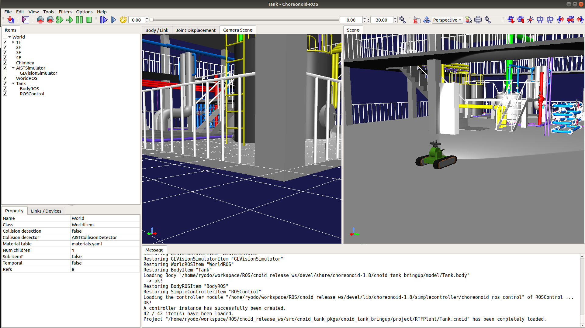
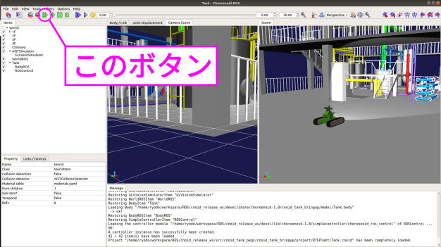
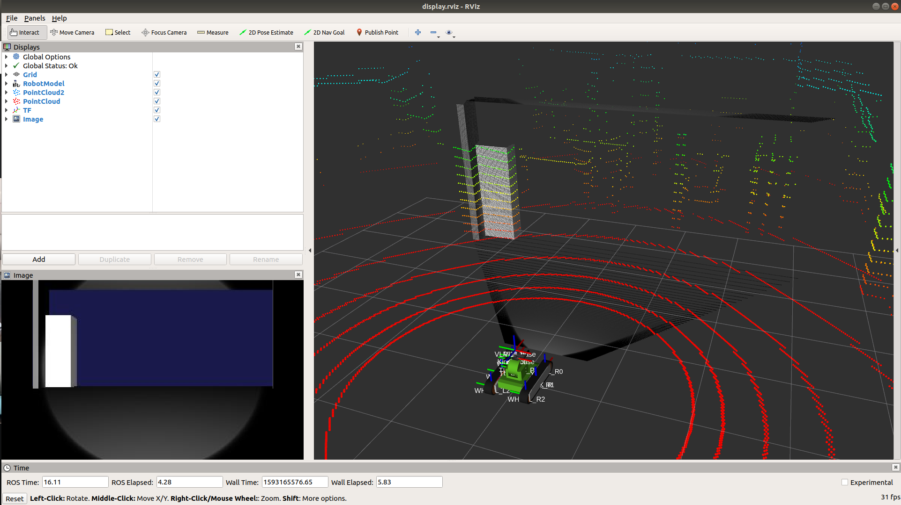
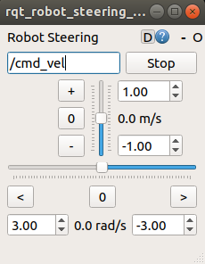
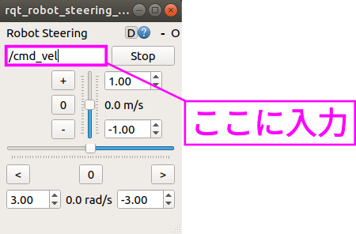
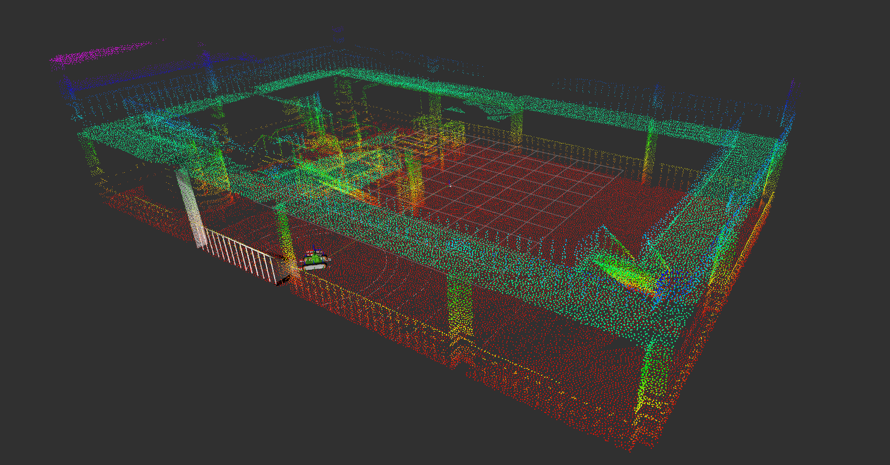

Execution 
=======================================================

Here, we will use a pre-prepared `launch file <http://wiki.ros.org/roslaunch>`_ to spawn the "Tank" model on the test field, subscribe to sensor information using ROS's Pub/Sub functionality, and control its motion.

.. contents::
   :local:

.. _ros_cnoid_tank_ex1:

Startup
----------------------

.. highlight:: sh

After completing the explanations in the previous sections, first set the path to the workspace with the following command: ::

  cd <catkin_ws>
  source devel/setup.bash

Once completed, let's launch using the launch file. (This is a 2-step process)
First, start Choreonoid and ros_control with the following command: ::

  roslaunch cnoid_tank_bringup rtf_plant.launch

If successful, Choreonoid will start as shown in the figure below.

Finally, press the play button shown in the figure below to run the simulation.

            
That completes the startup!!
If you are familiar with ROS, you can now perform Pub/Sub operations to move the robot.
For ROS beginners, this tutorial will introduce how to display sensor information using `rviz <http://wiki.ros.org/rviz>`_ and how to teleoperate the robot using `rqt_robot_steering <http://wiki.ros.org/rqt_robot_steering>`_.

Simple ROS Integration
---------------------------------

Continuing from the previous steps, open a terminal separate from the one running Choreonoid and start `rviz <http://wiki.ros.org/rviz>`_ with the following command. Note that this launch file simply starts `rviz <http://wiki.ros.org/rviz>`_ by loading a pre-configured display settings file: ::

  cd <catkin_ws>
  source devel/setup.bash
  roslaunch cnoid_tank_bringup display.launch

If successful, a screen (RViz) like the one shown below will be displayed.

Next, let's use `rqt_robot_steering <http://wiki.ros.org/rqt_robot_steering>`_ to control the "Tank" robot in the simulator via ROS topics.
First, install `rqt_robot_steering <http://wiki.ros.org/rqt_robot_steering>`_ with the following command (skip this if you've already installed it): ::

  sudo apt install ros-melodic-rqt-robot-steering

Once completed, launch it with the following command: ::

  rosrun rqt_robot_steering rqt_robot_steering 
  
If successful, a window like the one shown below will be displayed.

Finally, enter the Topic name in the location shown in the figure below.
Here, enter "/Tank/base_controller/cmd_vel" (you can copy and paste).

That completes all the startup steps!!
Now try moving the scroll bars in the window to control the "Tank" model and have fun!!

And More...?
-------------------------

From here on, try various features using ROS's rich ecosystem.
For example, it might be interesting to try SLAM...!
 
