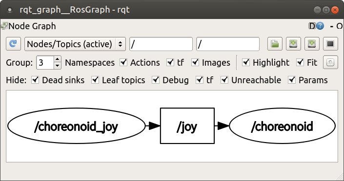

Step 1: Controlling Tank by Subscribing to the Joy Topic
========================================================

In Step 1, we'll explain how to send commands to a robot's controller through ROS-based communication and control the robot based on those commands. Specifically, we'll transmit the joystick state as a Joy topic and receive it on the controller side, enabling joystick control of the Tank robot.

.. contents::
   :local:

.. _ros_tank_tutorial_invoke_choreonoid_node:

Starting the Choreonoid Node
----------------------------

.. highlight:: sh

Once you've completed the preparations described in the previous section, start Choreonoid.

Please note that you need to start Choreonoid as a ROS node. As explained in :doc:`../run-choreonoid`, you can start the ROS Choreonoid node with the following command: ::

 rosrun choreonoid_ros choreonoid

Upon successful startup, Choreonoid's main window will appear.

Creating a Simulation Project
-----------------------------

Let's load the models to be simulated in Choreonoid and build a project. This tutorial uses the tank-like :ref:`tank_model` as the robot model. After starting Choreonoid, follow these steps to create a :doc:`../../simulation/simulation-project` for this model:

1. Create a World item
2. Load the Tank model as a child item of the World item
3. Load an appropriate environment model as a child item of the World item
4. Create an AIST Simulator item as a child item of the World item
5. Configure the AIST Simulator properties (set "Self Collision Detection" to true)

This process is essentially the same as :doc:`../../simulation/tank-tutorial/step1` in :doc:`../../simulation/tank-tutorial/index`, so please refer to that for the detailed procedure.

While that tutorial uses a simple floor model as the environment, you can also use the plant model from :ref:`tank_tutorial_use_labo_model`. This will provide more realistic images when communicating camera images later in this tutorial. (However, the model is heavier, so depending on your PC environment, a simple floor model might be easier to handle.) The repository for this tutorial published on GitHub uses the plant model.

Once you've built the project, save it as a project file using "File" - "Save Project As" from the main menu. Create a subdirectory called "project" in the directory created for this tutorial and save it there with the name "step1.cnoid".

This results in the following directory/file structure for the tutorial package:

.. code-block:: none

 + choreonoid_ros_tank_tutorial
   - CMakeLists.txt
   - package.xml
   + project
     - step1.cnoid

When reloading the project after closing Choreonoid, add the project filename as an option to the command used in :ref:`ros_tank_tutorial_invoke_choreonoid_node`. For example: ::

 roscd choreonoid_ros_tank_tutorial

to navigate to the tutorial directory, then: ::

 rosrun choreonoid_ros choreonoid project/step1.cnoid

This starts the Choreonoid node with the step1 project loaded.

Until we perform :ref:`ros_tank_tutorial_introduce_launch_file` below, it's recommended to use this method to start Choreonoid and load the project.

Once you've built the project, start the simulation as described in :ref:`tank-tutorial-step1-start-simulation` of :doc:`../../simulation/tank-tutorial/index`. As explained there, the turret will fall due to gravity, and the chassis won't move. This is natural since the Tank merely exists without any controller to control it.

The goal of Step 1 is to enable free control of this Tank robot.

Preparing the Gamepad
---------------------

For freely controlling the Tank robot, this tutorial uses an input device called a joystick. While there are various types of joysticks, a device called a gamepad is ideal for controlling this type of robot. Please prepare an appropriate gamepad for the tutorial. Most USB-connected types should work. However, using a gamepad compatible with :ref:`ros_tank_tutorial_choreonoid_joy` (explained later) will enable smooth robot operation. For supported gamepads, refer to :ref:`simulation-tank-tutorial-gamepad` in :doc:`../../simulation/tank-tutorial/index`.

Once you have a gamepad ready, connect it to your PC beforehand.

Transmitting Gamepad State via Joy Node
----------------------------------------

Since this tutorial focuses on utilizing ROS, we'll also use ROS functionality to exchange gamepad state. This approach enables the use of various ROS-compatible devices and allows remote control through communication between remote hosts. Here we'll first prepare to transmit the gamepad state.

Publishing the Joy Topic
~~~~~~~~~~~~~~~~~~~~~~~~

In ROS, you can define various data as "messages" and transmit them as "topics". Topic transmission in ROS is called "Publishing", and receiving published topics is called "Subscribing". This is based on the "Publish-Subscribe model" software design pattern, where data is published without specifying recipients and can be subscribed to from anywhere. ROS users should be familiar with this mechanism, but if not, please refer to ROS documentation.

In this tutorial, we'll publish the gamepad state as a ROS topic and subscribe to it from the robot controller. To achieve this, we first need a program that publishes the gamepad state. Such ROS communication programs are called "ROS nodes". Actually, there's a ROS node called "Joy node" available as a standard ROS package for publishing joystick (gamepad) state, so let's try that first.

Below, we'll explain how to start the Joy node and understand what ROS topics and messages actually are. If you're already familiar with ROS basics, you can skip ahead to :ref:`ros_tank_tutorial_choreonoid_joy`.

Installing and Starting the Joy Node
~~~~~~~~~~~~~~~~~~~~~~~~~~~~~~~~~~~~

First, install the corresponding "Joy package" to use the Joy node: ::

 sudo apt install ros-melodic-joy

This is the package name for Ubuntu 18.04 (Melodic). For Ubuntu 16.04 (Kinetic), install with: ::

 sudo apt install ros-kinetic-joy

If the Joy package installation succeeds, you can start the Joy node with: ::

 rosrun joy joy_node

However, make sure your joystick is connected to the PC before running this. Most standard USB-connected joysticks should work.

.. _ros_tank_tutorial_check_joy_topic:

Checking the Joy Topic
~~~~~~~~~~~~~~~~~~~~~~

When the Joy node starts and successfully detects the joystick, it generates a topic that publishes the joystick's axis and button states. You can check this with: ::

 rostopic list

This command displays a list of topics currently available in the system. Check if: ::

 /joy

appears here. This is the topic that the Joy node publishes, named "/joy". Topic names can be managed hierarchically like a filesystem, with the leading slash indicating a top-level definition.

Let's examine what this joy topic contains. Try running: ::

 rostopic info /joy

This displays information about the /joy topic. You should see something like:

.. code-block:: none

 Type: sensor_msgs/Joy
 
 Publishers: 
  * /joy_node (http://hostname:34541/)
 
 Subscribers: None

The "sensor_msgs/Joy" shown in the Type field is this topic's message type, indicating what kind of data this topic contains. It also shows that the node publishing this topic is /joy_node, and currently no nodes are subscribing to it.

Let's check the message type content. Run: ::

 rosmsg show sensor_msgs/Joy

You should see:

.. code-block:: none

 std_msgs/Header header
   uint32 seq
   time stamp
   string frame_id
 float32[] axes
 int32[] buttons

This represents the data structure of the "sensor_msgs/Joy" message type. Specifically, "axes" stores joystick axis positions as a 32-bit floating-point array, and "buttons" stores button states (pressed or not) as a 32-bit integer array. Additionally, the message's timestamp and ID values are stored under "header". This data structure maps to corresponding types in each ROS coding language (like std::vector<float> in C++), making it accessible.

Let's check the actual published message content. Run: ::

 rostopic echo /joy

This command displays the specified topic's content as text in the console. After running this, try moving the gamepad axes or pressing buttons. You should see output like:

.. code-block:: none

 header: 
   seq: 1
   stamp: 
     secs: 1585302374
     nsecs: 941266549
   frame_id: ''
 axes: [0.0, 0.03420161083340645, 0.0, 0.0, 0.0, 0.0]
 buttons: [0, 1, 0, 0, 0, 0, 0, 0, 0, 0, 0, 0]

The current values of each member are displayed corresponding to the message type shown earlier. Here, for example, the second element of "buttons" is "1", indicating the second button is pressed.

To exit this command, press Ctrl + C. If you don't see the above display, your gamepad might not be connected properly. Please ensure this works correctly before proceeding with the tutorial.

.. _ros_tank_tutorial_choreonoid_joy:

Choreonoid Version Joy Node
---------------------------

While the Joy node introduced in the previous section can publish gamepad state, this tutorial uses the "Choreonoid version Joy node" instead. This is provided by the "choreonoid_joy" package introduced in :ref:`ros_tank_tutorial_package_setup`, and can be started with: ::

 rosrun choreonoid_joy node

Functionally, it's almost identical to the standard Joy node, but it differs in standardizing the gamepad axis and button mappings.

Let me explain this. As mentioned, gamepad state is stored in Joy messages, but the order of actual axes and buttons in the "axes" and "buttons" arrays varies by gamepad model. This is because different hardware devices return data in different orders through their drivers, and the standard ROS Joy node stores them in the order received. However, this makes it difficult to use various gamepad models consistently. Despite recent gamepads having similar axes and buttons, operating the same controls would result in different robot movements.

Therefore, the Choreonoid Joy node defines a standard ordering (mapping) for axes and buttons, converting each gamepad model to this mapping before storing in the Joy message. This allows Joy message subscribers to handle various gamepad models uniformly by simply reading according to the standard mapping.

For tutorials, sample programs should be as simple as possible while operating consistently. Therefore, this tutorial uses the Choreonoid version Joy node for publishing Joy topics. To proceed with the tutorial, please start the choreonoid_joy node with the above command. You can verify operation the same way as with the standard Joy node.

Note that while described as supporting various models, only the models listed in :ref:`simulation-tank-tutorial-gamepad` are actually supported. For other models, Joy topics will be published but without mapping standardization, producing the same output as the ROS standard Joy node.

Building the Controller
-----------------------

Now that gamepad state is being published, let's introduce a controller that enables gamepad control of the Tank robot. What we'll do below is essentially the same build process as in :doc:`../../simulation/tank-tutorial/step2` of :doc:`../../simulation/tank-tutorial/index`. However, since we need to build and use the controller in the ROS catkin environment for this tutorial, the specific build methods and descriptions will differ. Here we'll first present the controller source code and build method.

.. _ros_tank_tutorial_step1_source:

Controller Source Code
~~~~~~~~~~~~~~~~~~~~~~

.. highlight:: c++
   :linenothreshold: 7

Here's the controller source code. This controller inherits from SimpleController, like the controller created in :doc:`../../simulation/tank-tutorial/index`. SimpleController itself is independent of ROS, but by simply adding ROS code to it, you can utilize ROS functionality. ::

 #include <cnoid/SimpleController>
 #include <cnoid/Joystick>
 #include <ros/node_handle.h>
 #include <sensor_msgs/Joy.h>
 #include <mutex>

 using namespace cnoid;

 class RttTankController : public SimpleController
 {
     std::unique_ptr<ros::NodeHandle> node;
     ros::Subscriber subscriber;
     sensor_msgs::Joy latestJoystickState;
     std::mutex joystickMutex;

     Link* trackL;
     Link* trackR;
     Link* turretJoint[2];
     double qref[2];
     double qprev[2];
     double dt;

 public:
     virtual bool configure(SimpleControllerConfig* config) override
     {
	 node.reset(new ros::NodeHandle);
	 return true;
     }

     virtual bool initialize(SimpleControllerIO* io) override
     {
	 std::ostream& os = io->os();
	 Body* body = io->body();
	 dt = io->timeStep();

	 trackL = body->link("TRACK_L");
	 trackR = body->link("TRACK_R");
	 io->enableOutput(trackL, JointVelocity);
	 io->enableOutput(trackR, JointVelocity);

	 turretJoint[0] = body->link("TURRET_Y");
	 turretJoint[1] = body->link("TURRET_P");
	 for(int i=0; i < 2; ++i){
	     Link* joint = turretJoint[i];
	     qref[i] = qprev[i] = joint->q();
	     joint->setActuationMode(JointTorque);
	     io->enableIO(joint);
	 }

	 subscriber = node->subscribe(
	     "joy", 1, &RttTankController::joystickCallback, this);

	 return true;
     }

     void joystickCallback(const sensor_msgs::Joy& msg)
     {
	 std::lock_guard<std::mutex> lock(joystickMutex);
	 latestJoystickState = msg;
     }

     virtual bool control() override
     {
	 sensor_msgs::Joy joystick;
	 {
	     std::lock_guard<std::mutex> lock(joystickMutex);
	     joystick = latestJoystickState;
	 }
	 joystick.axes.resize(Joystick::NUM_STD_AXES, 0.0f);
	 joystick.buttons.resize(Joystick::NUM_STD_BUTTONS, 0);

	 static const int trackAxisID[] =
	     { Joystick::L_STICK_H_AXIS, Joystick::L_STICK_V_AXIS };
	 static const int turretAxisID[] =
	     { Joystick::R_STICK_H_AXIS, Joystick::R_STICK_V_AXIS };

	 double pos[2];
	 for(int i=0; i < 2; ++i){
	     pos[i] = joystick.axes[trackAxisID[i]];
	     if(fabs(pos[i]) < 0.2){
		 pos[i] = 0.0;
	     }
	 }
	 // set the velocity of each tracks
	 trackL->dq_target() = -2.0 * pos[1] + pos[0];
	 trackR->dq_target() = -2.0 * pos[1] - pos[0];

	 static const double P = 200.0;
	 static const double D = 50.0;

	 for(int i=0; i < 2; ++i){
	     Link* joint = turretJoint[i];
	     double pos = joystick.axes[turretAxisID[i]];
	     if(fabs(pos) < 0.15){
		 pos = 0.0;
	     }
	     double q = joint->q();
	     double dq = (q - qprev[i]) / dt;
	     double dqref = 0.0;
	     double deltaq = 0.002 * pos;
	     qref[i] += deltaq;
	     dqref = deltaq / dt;
	     joint->u() = P * (qref[i] - q) + D * (dqref - dq);
	     qprev[i] = q;
	 }

	 return true;
     }

     virtual void stop() override
     {
	 subscriber.shutdown();
     }
 };

 CNOID_IMPLEMENT_SIMPLE_CONTROLLER_FACTORY(RttTankController)

Create a subdirectory called "src" in the package directory and save this source code there with the filename "RttTankController.cpp". The package file structure then becomes:

.. code-block:: none

 + choreonoid_ros_tank_tutorial
   - CMakeLists.txt
   - package.xml
   + project
     - step1.cnoid
   + src
     - RttTankController.cpp

.. note:: The "Rtt" prefix added to the controller class name and source filename stands for "ROS Tank Tutorial". Since some classes created in this tutorial are relatively generic, similar ones might be created or provided elsewhere. To distinguish them, we'll add this prefix to classes and files created in this tutorial.

Below, we'll first explain how to build this source code and run it in simulation, then explain the source code content.

Editing CMakeLists.txt
~~~~~~~~~~~~~~~~~~~~~~

.. highlight:: cmake

In :ref:`ros_tank_tutorial_edit_package_xml`, we explained that an XML file called "package.xml" is needed to build a Catkin package. Another required file for package building is "CMakeLists.txt". This is a file for CMake, a build system, used when build processing is needed, such as when the package contains C++ source code.

For details about CMake and CMakeLists.txt, please refer to the CMake manual. CMake is a very popular tool used by both ROS and Choreonoid, so we'll assume basic understanding of it.

A template CMakeLists.txt was automatically generated in :ref:`ros_tank_tutorial_make_package` and saved in the project directory root. Edit this file to match the following content: ::

 cmake_minimum_required(VERSION 3.5.0)
 project(choreonoid_ros_tank_tutorial)

 find_package(catkin REQUIRED COMPONENTS
   roscpp
   std_msgs
   sensor_msgs
   image_transport
   choreonoid
   )

 catkin_package(SKIP_CMAKE_CONFIG_GENERATION SKIP_PKG_CONFIG_GENERATION)

 set(CMAKE_CXX_STANDARD ${CHOREONOID_CXX_STANDARD})
 set(CMAKE_CXX_EXTENSIONS OFF)

 include_directories(${catkin_INCLUDE_DIRS})

 add_subdirectory(src)

Let me explain this content. First: ::

 cmake_minimum_required(VERSION 3.5.0)

requires CMake version 3.5.0 or higher. The current latest Choreonoid development version requires at least this version due to internal CMake commands used. The auto-generated CMakeLists.txt might specify a lower version, but in that case, Choreonoid-related packages cannot be built, so ensure this specifies 3.5.0 or higher. Ubuntu 16.04 and later include CMake versions that meet this requirement by default.

Next: ::

 project(choreonoid_ros_tank_tutorial)

sets this package's project name. This should usually match the package name. ::

 find_package(catkin REQUIRED COMPONENTS
   roscpp
   std_msgs
   sensor_msgs
   image_transport
   choreonoid
   )

detects dependent packages. Here we specify the following dependencies:

* roscpp: ROS C++ library
* std_msgs: ROS standard messages
* sensor_msgs: Sensor-related messages
* image_transport: Library for image transfer
* choreonoid: Choreonoid core

The content described here largely overlaps with the dependent packages described in :ref:`ros_tank_tutorial_edit_package_xml`. However, what's written here is specifically libraries needed for building C++ programs, so they're not completely identical. ::

 catkin_package(SKIP_CMAKE_CONFIG_GENERATION SKIP_PKG_CONFIG_GENERATION)

prevents Catkin from generating CMake Config files and pkg-config files. These files are needed when using packages created here from other packages, mainly for libraries. Since we're not creating such packages, this generation process isn't necessary. Also, as mentioned in :ref:`ros_tank_tutorial_edit_package_xml`, we're using the "cmake" build type for the package, and it seems Config file generation doesn't work well with this build type. For these reasons, we include this statement in this package. ::

 set(CMAKE_CXX_STANDARD ${CHOREONOID_CXX_STANDARD})
 set(CMAKE_CXX_EXTENSIONS OFF)

Here we set the C++ version for compilation. Choreonoid is coded assuming C++11 or higher, including the library's public API, and users must build with an equivalent or higher C++ version. However, some compilers default to older C++ versions. Since Catkin doesn't seem to set this, C++ version configuration is necessary.

When specifying choreonoid in find_package, the C++ version used in Choreonoid core is set in the CHOREONOID_CXX_STANDARD variable, so we basically match this setting. CMake allows setting the C++ version with the CMAKE_CXX_STANDARD variable. Setting CMAKE_CXX_EXTENSIONS to OFF disables compiler-specific extensions. Without this, GCC enables its own extensions, but we include this for better maintainability. Building is possible without this statement.

Note that GCC version 6 and higher defaults to C++14. Ubuntu 18.04's GCC is version 7, so Ubuntu 18.04 can build without this statement. However, GCC installed on Ubuntu 16.04 is an older version that doesn't default to C++11 or higher, so compilation errors occur without this statement. ::

 include_directories(${catkin_INCLUDE_DIRS})

specifies additional include directories. The catkin_INCLUDE_DIRS variable contains include directories needed when using dependent packages specified by find_package. This statement allows using header files included in those packages. If using other libraries, specify their corresponding include directories here. Note that include directories for Choreonoid-provided libraries don't necessarily need specification here, as they're automatically set when describing commands for building Choreonoid plugins, controllers, etc. ::

 add_subdirectory(src)

In this tutorial, we store C++ controller source files separately in the "src" directory. Following this structure, we write CMake descriptions directly corresponding to each source file in the src directory's CMakeLists.txt, which we import here.

Adding CMakeLists.txt to the src Directory
~~~~~~~~~~~~~~~~~~~~~~~~~~~~~~~~~~~~~~~~~~~

For the "CMakeLists.txt in the src directory" mentioned above, create and add it with the following content: ::

 choreonoid_add_simple_controller(RttTankController RttTankController.cpp)
 target_link_libraries(RttTankController ${roscpp_LIBRARIES})

choreonoid_add_simple_controller becomes available when choreonoid is detected by find_package. This function builds Choreonoid's simple controller binaries and can be used like CMake's built-in functions such as add_executable and add_library. Here we set the target name as RttTankController and specify RttTankController.cpp as the source file.

Additionally, target_link_libraries specifies links to dependent libraries. Here we specify links to libraries composing roscpp for using ROS with C++. This is set in the roscpp_LIBRARIES variable when specifying roscpp in find_package, so we use this variable.

Note that building simple controllers also requires other Choreonoid libraries, but basic ones like CnoidUtil and CnoidBody are automatically set by choreonoid_add_simple_controller, so they don't need specification here. Include directories and compile options related to these libraries are also automatically set by choreonoid_add_simple_controller.

Building the Controller
~~~~~~~~~~~~~~~~~~~~~~~

.. highlight:: sh

Once you've written the controller source code and CMakeLists.txt, you're ready to build. Build using Catkin's command: ::

 catkin build

This command can be run from any directory within the Catkin workspace. For build methods, also refer to the :ref:`ros_catkin_build_command` section in :doc:`../build-choreonoid`.

When building, it's good to also perform :ref:`ros_catkin_config_cmake_build_type`. Usually set the build type to "Release". This can be configured with: ::

 catkin config --cmake-args -DCMAKE_BUILD_TYPE=Release

Building with this setting enables compilation optimizations, producing more efficient binaries. Note that optimizations aren't enabled without this setting.

You can also specify the default build type on the package side by adding to CMakeLists.txt. In that case, add the following to the main CMakeLists.txt:

.. code-block:: cmake

 if(NOT CMAKE_BUILD_TYPE)
   set(CMAKE_BUILD_TYPE Release CACHE STRING
     "Choose the type of build, options are: None Debug Release RelWithDebInfo MinSizeRel."
     FORCE)
 endif()

The appropriate place to add this is immediately after setting the project name with the project function. With this description, optimized Release builds are applied even without setting CMake's build type in Catkin.

After running catkin build, if you see console output like the following, the build succeeded:

.. code-block:: none

 ...
 Starting  >>> choreonoid_ros_tank_tutorial
 Finished  <<< choreonoid_ros_tank_tutorial                [ 3.0 seconds ]
 ...
 [build] Summary: All ? packages succeeded!                                  
 ...

If the build fails, compilation errors will be displayed, so please fix the source code or CMakeLists.txt according to those messages.

.. _ros_tank_tutorial_step1_introduce_controller:

Introducing the Controller
--------------------------

After successfully building the controller, let's introduce it into the simulation project.

Introduction follows the same procedure as :ref:`simulation-tank-tutorial-introduce-controller` in :doc:`../../simulation/tank-tutorial/index`. Since the controller created this time is named "RttTankController", it's good to use the same name for the item. For :ref:`simulation-tank-tutorial-set-controller`, select "RttTankController.so" generated by this build. This file should be generated in the standard controller directory, but if you can't find it, the build failed, so please check the previous steps.

After this work, the item tree should have the following structure:

.. code-block:: none

 + World
   + Tank
     - RttTankController
   - Labo1
   - AISTSimulator

"Labo1" can be Floor or another environment model.

This completes the Step 1 simulation project. Save the project by overwriting it.

Running the Simulation and Controlling the Tank Robot with the Gamepad
----------------------------------------------------------------------

Let's run the simulation.

If :ref:`ros_tank_tutorial_choreonoid_joy` is running, you should be able to control the Tank robot with the connected gamepad. This is achieved by the controller subscribing to the gamepad state that the Joy node publishes as a Joy topic.

With a standard gamepad supported by Choreonoid, the left analog stick controls the chassis (crawler) forward/backward movement and left/right turning. The right analog stick controls turret and barrel rotation.

Checking Joy Topic Connection Status
------------------------------------

.. highlight:: sh

While the simulation is running, let's check the Joy topic connection status.

First, run the command we tried in :ref:`ros_tank_tutorial_check_joy_topic` again: ::

 rostopic info /joy

The Subscribers field, which was previously "None", should now show:

.. code-block:: none

 Subscribers: 
  * /choreonoid (http://host:37373/)

/choreonoid has been added as a Subscriber. This represents the node subscribing to this topic. While the actual subscribing object is RttTankController, it's shown as choreonoid here. This is because ROS nodes are created per OS process, and everything running in the Choreonoid process is a choreonoid node. Since the simple controller also runs in the Choreonoid process, it's a choreonoid node.

Next, let's visualize the connection status graphically. ROS has a tool called "rqt_graph" for this, so let's start it: ::

 rosrun rqt_graph rqt_graph

You'll see something like:

The actual display depends on rqt_graph settings. If you set the combo box in rqt_graph's upper left and the checkboxes below it to match the figure above, you should see a similar graph.

In any case, this graph shows that the joy topic published by the choreonoid_joy node is subscribed by the choreonoid node, with a connection between the two nodes.

Using ROS for control communication like this not only enables communication but also allows leveraging ROS tools. Many useful tools are available in ROS, and being able to utilize them is a major advantage of introducing ROS.

.. _ros_tank_tutorial_introduce_launch_file:

Introducing a Launch File
-------------------------

In Step 1, we've run the following ROS nodes so far:

* choreonoid itself (step1.cnoid project)
* choreonoid_joy
* rqt_graph

We've started each by entering corresponding commands from terminals, but entering three commands to repeat the same process is tedious, and we might not remember each one. The roslaunch command provided with ROS allows performing these operations together.

.. highlight:: xml

How to launch nodes is described in an XML file called a launch file. To launch these three nodes, create the following launch file: ::

 <launch>
   <node pkg="choreonoid_joy" name="choreonoid_joy" type="node" />
   <node pkg="choreonoid_ros" name="choreonoid" type="choreonoid"
         args="$(find choreonoid_ros_tank_tutorial)/project/step1.cnoid --start-simulation" />
   <node pkg="rqt_graph" name="rqt_graph" type="rqt_graph" />
 </launch>

For launch file details, refer to the ROS manual. Basically, you write as many node tags as needed to start ROS nodes within the launch tag. Here each performs the following: ::

 <node pkg="choreonoid_joy" name="choreonoid_joy" type="node" />

Executes the node command to start the choreonoid_joy node from the choreonoid_joy package. ::

 <node pkg="choreonoid_ros" name="choreonoid" type="choreonoid"
       args="$(find choreonoid_ros_tank_tutorial)/project/step1.cnoid --start-simulation" />

Executes the choreonoid command to start the choreonoid node from the choreonoid_ros package. This starts Choreonoid itself.

The args attribute specifies arguments for the choreonoid command. First, it specifies the project file as an argument. ::

 $(find choreonoid_ros_tank_tutorial)

returns the choreonoid_ros_tank_tutorial package directory. It specifies the step1.cnoid project file in the project directory within. Also: ::

 --start-simulation

is an option to automatically start simulation after loading the project. With this, just executing the launch file also starts the simulation.

Finally: ::

 <node pkg="rqt_graph" name="rqt_graph" type="rqt_graph" />

also runs rqt_graph.

.. highlight:: sh

Save this launch file in the "launch" directory of the choreonoid_ros_tank_tutorial package. The tutorial package then has this file structure:

.. code-block:: none

 + choreonoid_ros_tank_tutorial
   - CMakeLists.txt
   - package.xml
   + launch
     - step1.launch
   + project
     - step1.cnoid
   + src
     - CMakeLists.txt
     - RttTankController.cpp

With this setup, you can execute this launch file by entering the following command from a terminal: ::

 roslaunch choreonoid_ros_tank_tutorial step1.launch

Executing the launch file this way allows repeating what we've done in Step 1. ROS often combines many nodes to build systems, making roslaunch indispensable in such cases.

To quit roslaunch, press Ctrl + C in the terminal running roslaunch. This terminates all nodes started by roslaunch.

Source Code Explanation
-----------------------

Finally, let's explain the :ref:`ros_tank_tutorial_step1_source`. The joint control portions of this controller are almost the same as those created in:

* :doc:`../../simulation/tank-tutorial/step2` ( :ref:`tank_tutorial_step2_implementation` )
* :doc:`../../simulation/tank-tutorial/step3` ( :ref:`simulation-tank-tutorial-step3-implementation` )

of :doc:`../../simulation/tank-tutorial/index`. This controller differs in obtaining control command values by subscribing to the Joy topic, so we'll focus on explaining that part below.

.. highlight:: c++

First, we include the following headers from roscpp, the C++ ROS library: ::

 #include <ros/node_handle.h>
 #include <sensor_msgs/Joy.h>

Including <ros/node_handle.h> enables using roscpp's NodeHandle class. This corresponds to a ROS node, allowing you to publish and subscribe to topics through objects of this class.

Also, <sensor_msgs/Joy.h> is the header corresponding to Joy messages. Including it allows accessing Joy messages in C++. ::

 #include <mutex>

Enables using the mutex class from the standard C++ library. Topic communication is asynchronous, requiring mutual exclusion when passing received state to the control loop. We need mutex for this.

Let's explain variables related to Joy topic subscription. First: ::

 std::unique_ptr<ros::NodeHandle> node;

is a variable corresponding to the ROS node. Precisely, ROS nodes are assigned per process, and this is a node handle that can be created and used multiple times within a process. Here we manage it as a pointer using std::unique_ptr, with actual object creation done in the initialization function described below. ::

 ros::Subscriber subscriber;

To subscribe to topics, you need to create a Subscriber. This variable stores the created Subscriber. ::

 sensor_msgs::Joy latestJoystickState;

A variable to store Joy type messages. It's defined in <sensor_msgs/Joy.h>. ::

 std::mutex joystickMutex;

A mutex for mutual exclusion in Joy message exchange.

The ROS NodeHandle is created in the following function: ::

 virtual bool configure(SimpleControllerConfig* config) override
 {
     node.reset(new ros::NodeHandle);
     return true;
 }

The NodeHandle created here needs deletion after use. To do this automatically, we use a std::unique_ptr smart pointer.

The configure function implemented here is one of the initialization functions defined in the SimpleController class ( :ref:`simulation-implement-controller-simple-controller-class-supplement` ). It's defined as a virtual function, and by overriding it, you can implement initialization processing. SimpleController actually provides three virtual functions for initialization, each called at these times:

* configure: Called when the controller is introduced to the project
* initialize: Called just before simulation starts
* start: Called when the controller starts operating after simulation initialization completes

Usually initialization is done in the initialize function, but that's only processed when simulation starts, so initialization needed before simulation start must be written in the configure function. With ROS, node connections are important, and we may want to confirm or complete them before simulation starts. To achieve this, the NodeHandle must be created before simulation starts, so we do it in the configure function.

Normal initialization processing is implemented in the initialize function. Most of it is preparation for crawler control and turret/barrel axis control, detailed in :doc:`../../simulation/tank-tutorial/index`, so we'll omit details here. For ROS-related parts, we write the following: ::

 subscriber = node->subscribe(
     "joy", 1, &RttTankController::joystickCallback, this);

This initializes subscription to the joy topic. We create a Subscriber by specifying the target topic name in NodeHandle's subscribe function. The created Subscriber is stored in a Subscriber type variable. This is a reference to the actual Subscriber, used to manage the Subscriber's lifetime.

The second argument specifies the queue size for topic reception. Increasing this value can reduce missed received messages. However, since this sample only needs the latest joystick state, we don't care about missing intermediate messages and specify a queue size of 1.

The third and fourth arguments specify the callback function for subscription. There are several ways to specify callback functions; here we use one targeting member functions, specifying RttTankController's joystickCallback function.

With this description, when a joy topic is published, it's received by Choreonoid's ROS node, and the received Joy message is passed to the joystickCallback function. This reception processing is done asynchronously, with the callback function called from a thread different from the controller's control function, so be aware of this.

The callback function is implemented as follows: ::

 void joystickCallback(const sensor_msgs::Joy& msg)
 {
     std::lock_guard<std::mutex> lock(joystickMutex);
     latestJoystickState = msg;
 }

The callback function's argument is the target topic's message type. Here a sensor_msgs::Joy type message is passed as the argument.

What we want to do here is pass this message content (gamepad state) to the simple controller's control code. For this, we use a variable called "latestJoystickState" of the same message type, copying the received message content to this variable. By referencing this variable in the control function, we reflect the gamepad state in control.

However, as mentioned, this callback function is called from a different thread than the controller's control function at arbitrary timing. In this case, overwriting latestJoystickState by this function and referencing the same variable by the control function might conflict timing-wise. To avoid this, we need mutual exclusion for variable access. We achieve this with joystickMutex.

The part of the control function referencing this variable is: ::

 virtual bool control() override
 {
     sensor_msgs::Joy joystick;
     {
         std::lock_guard<std::mutex> lock(joystickMutex);
         joystick = latestJoystickState;
     }
     joystick.axes.resize(Joystick::NUM_STD_AXES, 0.0f);
     joystick.buttons.resize(Joystick::NUM_STD_BUTTONS, 0);
     ....

Here we prepare a joystick variable of the same Joy type and copy latestJoystickState's content to it. We also apply mutual exclusion using joystickMutex here to avoid conflicts with the callback function regarding the latestJoystickState variable.

To minimize the scope of mutual exclusion, we deliberately introduce the joystick variable so we only need to apply mutual exclusion to copying to this variable. In this sample, the control function implementation is very simple and doesn't take long to execute, so there wouldn't be particular problems even applying mutual exclusion to the entire control function and directly referencing latestJoystickState. However, as control becomes more complex and takes longer to execute, it's desirable to minimize the scope (time) of mutual exclusion as much as possible, as in this sample.

Note that: ::

 joystick.axes.resize(Joystick::NUM_STD_AXES, 0.0f);
 joystick.buttons.resize(Joystick::NUM_STD_BUTTONS, 0);

isn't necessary when using the choreonoid_joy node. When using the ROS standard joy node, the number of axes and buttons varies depending on the connected joystick, so we include this processing just in case they're less than expected.

After this, we get the current gamepad state from the copied joystick variable, calculate command values from it, and use them to command crawler drive speeds and perform PD control of the turret and barrel axes. The specific control content is the same as explained in :doc:`../../simulation/tank-tutorial/index`, so we'll omit details here.

Finally: ::

 virtual void stop() override
 {
     subscriber.shutdown();
 }

describes processing when the controller stops. Once the controller stops, there's no need to subscribe to the joy topic anymore, so we terminate the subscription processing with the subscriber's shutdown function.

Note: Confirming ROS Environment Execution
------------------------------------------

The above controller code assumes ROS is available and Choreonoid is running as a ROS node. However, you might accidentally load this controller in a non-ROS environment or in a normal Choreonoid process that isn't a ROS node. In such cases, roscpp isn't initialized, so it will crash at: ::

 node.reset(new ros::NodeHandle);

when executing the configure function.

To avoid this and make a safer controller binary, you could add code to check ROS state to the configure function like this: ::

 virtual bool configure(SimpleControllerConfig* config) override
 {
     if(!ros::isInitialized()){
         config->os() << config->controllerName()
                      << " cannot be configured because ROS is not initialized." << std::endl;
         return false;
     }
     node.reset(new ros::NodeHandle);
     return true;
 }

ros::isInitialized() returns true if roscpp is properly initialized in the ROS environment, otherwise false. Therefore, if this function returns false, output an appropriate message and exit the configure function with false. In this case, other parts of the controller won't execute, avoiding crashes and reliably informing the user that this controller cannot be used.

However, using a controller developed for ROS in a non-ROS environment might be considered outside the expected scope, so if you're not publishing it externally, you might not need to go this far. To keep the code simple and the explanation concise, this tutorial doesn't include such processing in the sample code.