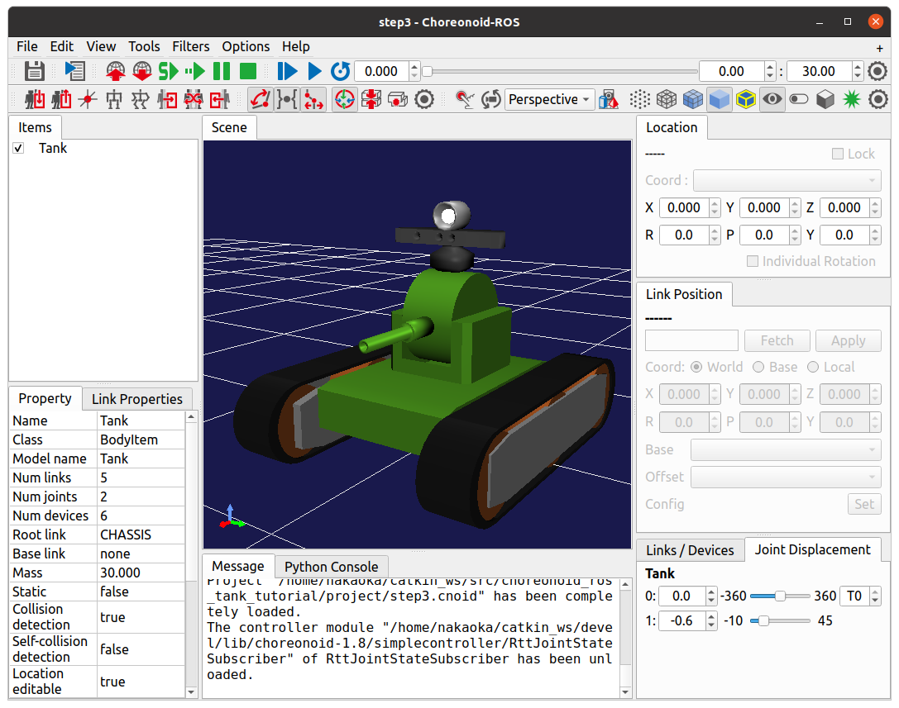
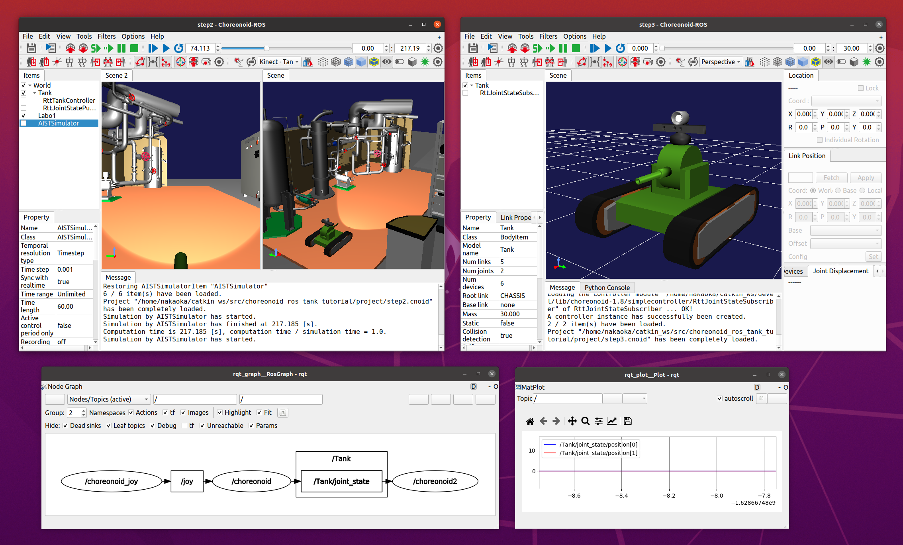

Step 3: Subscribe to the JointState topic to display the state of Tank
======================================================================

In Step 3, we will create a program that subscribes to and uses the ROS topic of the joint state.

.. contents::
   :local:

Overview
--------

In Step 2, we implemented a function that publishes the joint state of the Tank robot as a JointState type ROS topic and outputs it to the outside. In step 3, we will create a program that subscribes to this topic and uses it. Specifically, we start another Choreonoid separate from the simulation, and implement a viewer-like function to visualize the current state of the joints. Such a function can be applied to monitoring and teleoperation of the robot.

.. At the end of this tutorial, we will also introduce the remote communication method that leads to such applications.

Creating a Choreonoid project for state visualization
-----------------------------------------------------

In this step, we will start another Choreonoid process and use it for visualizing the robot's status.
To prepare the Choreonoid used for this visualization, let's create a project template.

All you need to do is to create a project with one Tank model loaded, which is the same model used for the simulation.
A simulator item is not neccessary since simulations are not carried out, and environment models are not necessary as well since our goal is to display the state of the Tank's joints. You also don't need a world item to organize them.

Therefore, the item tree of the project template is simply as follows.

.. code-block:: none

 - Tank

You can start the Choreonoid node without a project and load the body items, or you can copy the project file up to step 2 and create it by deleting all items except the Tank model from it. The screen of this project will look like this

You may want to adjust the zoom of the Tank model so that it appears a little larger like this.

Save this project in the "project" directory with the file name "step3.cnoid".

Introducing a controller for state visualization
------------------------------------------------

It is not possible to visualize the state of the Tank robot only with the project template.
In order to achieve the visualization, you need to introduce a process somewhere to subscribe to the JointState topic and update the state of the Tank model for visualization based on it.

There are various ways to implement this process, but in this tutorial, we will use a simple controller that is also used in the simulation. The simple controller is designed to be flexible, and can be used not only to control the robot in the simulation, but also to process models that are just loaded and displayed as body items.

In this section, we will first present the source code of the controller for state visualization.
Let's build it, introduce it to the project, and try to run the joint state visualization first.
By doing so, you will be able to understand the function of this controller first, and then the implementation details are explained.

Source code
~~~~~~~~~~~~

.. highlight:: c++
   :linenothreshold: 7

The source code of the controller for state visualization is shown below. ::

 #include <cnoid/SimpleController>
 #include <cnoid/BodyItem>
 #include <cnoid/LazyCaller>
 #include <ros/node_handle.h>
 #include <sensor_msgs/JointState.h>
 
 using namespace std;
 using namespace cnoid;
 
 class RttJointStateSubscriber : public SimpleController
 {
     std::unique_ptr<ros::NodeHandle> node;
     ros::Subscriber subscriber;
     BodyItemPtr bodyItem;
 
 public:
     virtual bool configure(SimpleControllerConfig* config) override
     {
         bodyItem = static_cast<BodyItem*>(config->bodyItem());
         node.reset(new ros::NodeHandle(bodyItem->name()));
         subscriber = node->subscribe(
            string("/") + bodyItem->name() + "/joint_state",
            1,
            &RttJointStateSubscriber::jointStateCallback, this);
         return true;
     }
 
     void jointStateCallback(const sensor_msgs::JointState& state)
     {
         callLater([this, state](){ updateJointState(state); });
     }
 
     void updateJointState(const sensor_msgs::JointState& state)
     {
         auto body = bodyItem->body();
         auto& names = state.name;
         auto& positions = state.position;
         int size = std::min(names.size(), positions.size());
         int n = std::min(body->numJoints(), size);
         for(int i=0; i < n; ++i){
             auto joint = body->joint(i);
             if(joint->jointName() == names[i]){
                 joint->q() = positions[i];
             }
         }
         bodyItem->notifyKinematicStateChange(true);
     }
 
     virtual void unconfigure() override
     {
         bodyItem.reset();
         node.reset();
         subscriber = ros::Subscriber();
     }
 };
 
 CNOID_IMPLEMENT_SIMPLE_CONTROLLER_FACTORY(RttJointStateSubscriber)

.. _ros_tank_tutorial_step3_build:

Building the controller
~~~~~~~~~~~~~~~~~~~~~~~

Create this source code in the src directory with the file name **"RttJointStateSubscriber.cpp"** . Then write the following build process in CMakeLists.txt in the src directory.

.. code-block:: cmake

 choreonoid_add_simple_controller(RttJointStateSubscriber RttJointStateSubscriber.cpp)
 target_link_libraries(RttJointStateSubscriber ${roscpp_LIBRARIES} Choreonoid::CnoidBodyPlugin)

As a difference from the previous step 2, **Choreonoid::CnoidBodyPlugin** is added to target_link_libraries. This is called an "import library" in CMake, and it can be used as if this library is built in the same CMake project. In this example, the CnoidBodyPlugin library corresponding to the Choreonoid Body plugin is specified, and this will provide a link to the library and other settings necessary for the build (include directory, compile options, etc.). Such imported libraries provided by Choreonoid can be used by specifying choreonoid in find_package. They are all defined in the form **"Choreonoid::library name"**.

Depending on the library of the Body plugin specified here, the classes and functions defined in the Body plugin and its dependent libraries can be used. In this controller, the BodyItem class and the callLater function related to the GUI of Choreonoid are used for visualization, and the above description is necessary.
Note that the callLater function is defined in the Base library of Choreonoid, and if it is explicitly included, the description is as follows: ::

 target_link_libraries(RttJointStateSubscriber ${roscpp_LIBRARIES} Choreonoid::CnoidBase Choreonoid::CnoidBodyPlugin)

However, since CnoidBodyPlugin depends on CnoidBase, the latter is automatically included by writing only the former.

After creating the source file and writing the CMakeLists.txt file, let's build the program with catkin build. If the build is successful, a binary file of the simple controller will be generated with the file name "RttJointStateSubscriber.so".

Introducing in the project
~~~~~~~~~~~~~~~~~~~~~~~~~~

Let's introduce the built controller into the project to complete the project. As in the previous steps, create a simple controller item as a child item of the Tank item and specify "RttJointStateSubscriber.so" as the controller module. The item name should also be "RttJointStateSubscriber". The item tree will look like the following.

.. code-block:: none

 + Tank
   - RttJointStateSubscriber

Save the project in this state by overwriting step3.cnoid.

Running the simulation & visualization project
----------------------------------------------

.. highlight:: sh

In this sample, the following two Choreonoid nodes are invoked.

* **Choreonoid node for simulation** (step2.cnoid created in step 2)
* **Choreonoid node for state visualization (viewer)** (step3.cnoid created in this step)

It should be noted that the duplication of node names must be avoided.
When a Choreonoid node is invoked, the node name is usually "choreonoid". 
However, if two Choreonoid nodes are invoked with the same name, it will be impossible to distinguish them in ROS communication.
Therefore, the node name of one of the nodes must be different from the default.

With this in mind, let's start the two Choreonoid nodes.

First, we start the Choreonoid node for simulation and its related nodes with the launch file for step 2. ::

 roslaunch choreonoid_ros_tank_tutorial step2.launch

The node name here is the default "choreonoid".

Next, let's directly launch the Choreonoid node for visualization from another terminal with the rosrun command. ::

 roscd choreonoid_ros_tank_tutorial/project
 rosrun choreonoid_ros choreonoid step3.cnoid __name:=choreonoid2

Here, the node name is changed to **"choreonoid2"** by **"__name:=choreonoid2"**, which is given as a startup option for the choreonoid node. This way of writing is the standard option when starting a ROS node; see the `"Nodes" section of the ROS Wiki <http://wiki.ros.org/Nodes>`_ for details on the options available for starting ROS nodes.

After running this far, you may see two Choreonoid windows on your desktop screen as shown below.

Now, from another terminal, run ::

 rosnode list

and the following will be displayed.

.. code-block:: none

 /choreonoid
 /choreonoid2
 /choreonoid_joy
 /rosout
 /rqt_graph
 /rqt_plot

Here, /choreonoid corresponds to the Choreonoid node for simulation and /choreonoid2 corresponds to the Choreonodi node for visualization. It is OK if the two Choreonoid nodes are displayed like this.

Now, let's try moving the Tank robot with the gamepad. When the gun barrel is moved, the joint angle of the Tank model on the visualization Choreonoid will change along with the movement. In addition, when you move the Tank robot and hit the barrel against the wall, the joints of the barrel will move a little due to the reaction force, and this movement will also be displayed on the visualization Choreonoid. If this is the case, this project is working well.

Creating the launch file
------------------------

.. highlight:: xml

Although the Choreonoid node for visualization was directly launched by the rosrun command in the previous section, let's put this operation into a launch file so that all the nodes used in the execution of this sample can be launched at once. Create a file named "step3.launch" in the launch directory with the following contents. ::

 <launch>
   <node pkg="choreonoid_joy" name="choreonoid_joy" type="node" />
   <node pkg="choreonoid_ros" name="choreonoid" type="choreonoid"
         args="$(find choreonoid_ros_tank_tutorial)/project/step2.cnoid --start-simulation" />
   <node pkg="rqt_graph" name="rqt_graph" type="rqt_graph" />
   <node pkg="choreonoid_ros" name="choreonoid2" type="choreonoid"
         args="$(find choreonoid_ros_tank_tutorial)/project/step3.cnoid" />
 </launch>

The description in the last node tag corresponds to the Choreonoid node for visualization. Here ::

 name="choreonoid2"

is used to rename this node. In this way, the node name change can be described concisely in the launch file.

.. highlight:: sh

You can run this sample by using the launch file as ::

 roslaunch choreonoid_ros_tank_tutorial step3.launch

Note that the rqt_plot node for displaying joint orbits, which was included in step2.launch, is not included in this launch file.

After this process, the package for this tutorial will have the following file structure.

.. code-block:: none

 + choreonoid_ros_tank_tutorial
   + launch
     - step1.launch
     - step2.launch
     - step3.launch
   + project
     - step1.cnoid
     - step2.cnoid
     - step3.cnoid
   + src
     - CMakeLists.txt
     - RttTankController.cpp
     - RttJointStatePublisher.cpp
     - RttJointStateSubscriber.cpp

Source code description
-----------------------

.. highlight:: c++

This section describes the source code of the RttJointStateSubscriber controller.

Like RttTankController in Step 1, this controller uses the Subscriber class in roscpp to subscribe to topics. Therefore, they are essentially the same in terms of coding subscribers in roscpp. However, while RttTankController controls the tank robot, RttJointStateSubscriber does not control the tank robot but directly updates the model state, which is different in the way it is used in Choreonoid, and there are some differences in the code in this respect. If you read this article with the awareness that Choreonoid can be used not only for controlling the robot to be simulated but also for visualization as shown in this article, the following explanation will be more useful.

Header inclusion
~~~~~~~~~~~~~~~~

In this source, two new headers are introduced. First ::

 #include <cnoid/BodyItem>.

enables the use of the BodyItem class, which is defined in the Body plugin, and is used to manipulate the body object corresponding to the robot model on the GUI of Choreonoid. Normally, controllers are implemented in such a way that they do not depend on a specific GUI, but in this case, BodyItem is used since the original purpose is to directly update the model on the GUI.

In addition, we will use ::

 #include <cnoid/LazyCaller>.

to use the callLater function. This function is also related to GUI and is defined in the Base module of Choreonoid, which will be explained later.

In order to use the class and function, the corresponding libraries must be additionally linked. Specifically, these libraries are libCnoidBase and libCnoidBodyPlugin. This is the reason why the libraries to be linked were added in :ref:`ros_tank_tutorial_step3_build` .

Member Variables
~~~~~~~~~~~~~~~~

Among the member variables ::

 std::unique_ptr<ros::NodeHandle> node;
 ros::Subscriber subscriber;

are the same as those used in the RttTankController in Step 1, corresponding to the node handle and subscriber of ROS, and these objects are used to handle the subscribing process. ::

 BodyItemPtr bodyItem;

is a pointer variable corresponding to the BodyItem described above; the pointer type of BodyItem is usually expressed as::

 BodyItem*

. BodyItemPtr is a smart pointer version of this type, and by using this type, the pointed object is maintained. 
Although it may not happen very often, the smart pointer version is used just in case the model update process may be called after deleting the Tank item on the Choreonoid node for visualization while communication is in progress, depending on the timing.

Initialization by the configure function
~~~~~~~~~~~~~~~~~~~~~~~~~~~~~~~~~~~~~~~~

In this controller, the initialization process is performed by the "configure" function, which is one of the virtual functions of SimpleController. ::

 virtual bool configure(SimpleControllerConfig* config) override
 {
     ...
 }

The configure function is called when a controller is introduced into the project and associated with the target body item.
When controlling a robot during simulation, initialization is done with the "initialize" function, but in this case, instead, we will directly update the state of the model that is loaded as a body item. The initialization for this can be done with the configure function.

In this example,the body item to be updated is obtained by the following code. ::

 bodyItem = static_cast<BodyItem*>(config->bodyItem());

This part is a bit tricky to write using static_cast, but this is because the simple controller is originally defined as a class that does not depend on the GUI. Even for such a simple controller, it is sometimes useful to be able to work with the GUI as in this example. Therefore, although it is an exception, the "bodyItem" function of SimpleControllerConfig can be used to acquire the BodyItem object. However, since it is not possible to return the types contained in libraries that do not directly depend on it, this function returns a pointer to the base Reference type, and the user must cast it to the BodyItem type. It is a little complicated, but if you want to use BodyItem from a simple controller, you will have to write it like this for now. ::

 node.reset(new ros::NodeHandle(bodyItem->name()));

As in the previous steps, we are creating a handle for the ROS node.
Next, we create a subscriber. ::

 subscriber = node->subscribe(
     string("/") + bodyItem->name() + "/joint_state",
     1,
     &RttJointStateSubscriber::jointStateCallback, this);

The topic name given as the first argument is "/Tank/joint_state", which matches the name of the topic to be published by RttJointStatePublisher in Step 2. The reason why the topic name is determined based on the name of the target Body item is so that it can be applied to other models.

The second argument is the queue size, which, as in Step 1, is set to 1 as long as the latest information is available.

As in Step 1, the third argument is a callback function in the form of a member function. The callback function is implemented as follows ::

 void jointStateCallback(const sensor_msgs::JointState& state)
 {
     callLater([this, state](){ updateJointState(state); });
 }

This function is called every time a new JointState is subscribed to.

This is where the process differs from that of RttTankController in Step 1: in RttTankController, the control function that performs control is called periodically, so the callback function only updates the variables for data exchange. In RttTankController, the control function is called periodically, so the callback function only updates the variables for data exchange, but this controller updates the model regardless of the robot control, so the process for that needs to be executed from here. However, the update process must not be done directly in this function. The reason is that the thread where the callback is called is different from the normal (main) thread. Subscribing is an asynchronous process triggered by input to the receiving port, and is handled by a dedicated thread for that purpose. On the other hand, the model for visualization is managed in the main thread running the GUI. In this case, the thread of the callback function cannot directly access objects in the main thread.As a solution to this problem, the main thread has an event loop to run the GUI, and by throwing an event into it, you can transfer the process from another thread to the main thread. The function to do this is callLater, which can be executed from any thread, and the function given as an argument will be executed on the main thread via the event loop.

The subscribed data of the JointState type is captured by the lambda expression given to callLater, and the data is copied to another variable used for the capture. Due to this copy process, there is no need to perform exclusive control for JointState data.

.. note:: When controlling the robot under simulation, the robot model to be controlled cannot be accessed in the same way. This is because the physics calculations in the simulation are also handled in a separate thread, and the body object used there is copied from the main thread during simulation initialization. The body object used in the simulation is copied from the main thread during simulation initialization, which is different from the body object managed by the main thread, and thus cannot be processed from the main thread. For this reason, the simple controller accesses the body object via dedicated :ref:`simulation-implement-controller-simple-controller-io` .

Updating the model state
~~~~~~~~~~~~~~~~~~~~~~~~

Let's take a look at the model state update process executed from the main thread. This process is implemented in the following function. ::

 void updateJointState(const sensor_msgs::JointState& state)
 {
     ...
 }

First, the body object to be updated is obtained. ::

 auto body = bodyItem->body();

By the way, this body object is the same as the one obtained from the config object in the configure function as ::

 config->body()

.

Next ::

 auto& names = state.name;
 auto& positions = state.position;

defines references to the array of names and the array of joint displacements that the data of the JointState type has.
This is simply to make the following code more concise. ::

 int size = std::min(names.size(), positions.size());
 int n = std::min(body->numJoints(), size);

In this code, we determine the number of joints to be updated. Of course, the number of joints is fixed for the same model, and in the case of the Tank model, there are two axes, yaw and pitch, for moving the gun barrel. So it is possible to fix the number to 2, but to avoid crashing when the size of each data is unexpected, we try to access the data within the minimum value of each data size.

In reality, we don't know what's in the data we get as ROS topics; there may be a glitch on the part of the publisher, the model used may not be exactly the same, or we may have subscribed to the wrong target in the first place.
In a system like ROS, where multiple components are connected via network communication, it is desirable to have a program that is as robust as possible in consideration of this point. ::

 for(int i=0; i < n; ++i){
     auto joint = body->joint(i);
     if(joint->jointName() == names[i]){
         joint->q() = positions[i];
     }
 }

The loop is run for the number of joints n determined in the above code, and the current value of the joint angle of each joint is set in the model. Here, the names of the joints are also checked to make sure they are the same, which is another measure to make the program as robust as possible. If the received data is for a different model than expected, applying the joint angles as they are does not make much sense, and often results in an impossible posture. ::

 bodyItem->notifyKinematicStateChange(true);

This notifies the GUI of Choreonoid that the model state has been updated. The reason why the BodyItem object is obtained in the configure function is to perform this notification. The first argument, true, also applies the forward kinematics calculation before the notification. This is same as the following code. ::

 body->calcForwardKinematics();
 bodyItem->notifyKinematicStateChange();

Finalization Process
~~~~~~~~~~~~~~~~~~~~

The finalization process of the controller is done by the "unconfigure" function. ::

 virtual void unconfigure() override
 {
     bodyItem.reset();
     node.reset();
     subscriber = ros::Subscriber();
 }

This is another virtual function of SimpleController, which is called when the controller is detached from the target model or the entire project. The finalization process corresponding to the initialization process done in the configure function is usually written in this function.

After the controller is finalized, there is no need to subscribe to the topic anymore, so the subscriber is cleared and the pointers to the related objects are also cleared. It is advisable to implement this kind of cleanup process properly.
