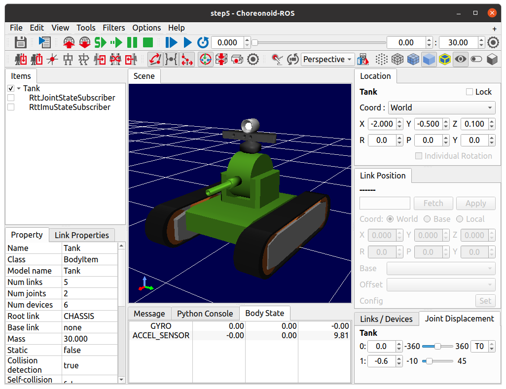
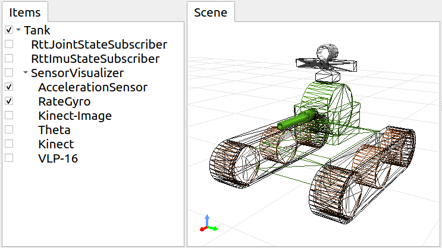
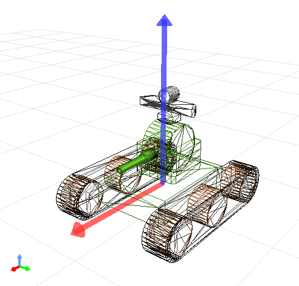

Step 5: Enhance the Tank state display by subscribing to sensor information topic
=================================================================================

In Step 5, we will create a program that subscribes to the sensor information topic.

.. contents::
   :local:

Overview
--------

In Step 4, we implemented a function that outputs the states of the accelerometer and rate gyro that the Tank robot is equipped with as a ROS topic of the sensor_msgs/Imu type. By subscribing to this topic, it is possible to obtain the states of the sensors via the network and utilize it in various processes.
In Step 5, as an example of this, we will make the Choreonoid node for state visualization constructed in Step 3 subscribe to the sensor information topic to enhance the display of the Tank state.

Controller for obtaining sensor states
--------------------------------------
  
First, we implement the function to subscribe to the sensor information topic in the Choreonoid node for state visualization.
This function can be realized by a simple controller in the same way as the joint state visualization introduced in Step 3.
The source code is shown below.

.. code-block:: c++
 :linenos:

 #include <cnoid/SimpleController>
 #include <cnoid/BodyItem>
 #include <cnoid/AccelerationSensor>
 #include <cnoid/RateGyroSensor>
 #include <cnoid/LazyCaller>
 #include <cnoid/Timer>
 #include <ros/node_handle.h>
 #include <sensor_msgs/Imu.h>
 #include <random>

 using namespace std;
 using namespace cnoid;

 class RttImuStateSubscriber : public SimpleController
 {
     unique_ptr<ros::NodeHandle> node;
     ros::Subscriber subscriber;
     BodyItemPtr bodyItem;
     AccelerationSensorPtr accelSensor;
     RateGyroSensorPtr gyro;
     Timer bodyShakeTimer;
     double bodyShakeDuration;
     Isometry3 bodyPosition;
     mt19937 mt;
     uniform_real_distribution<> rand;

 public:
     virtual bool configure(SimpleControllerConfig* config) override
     {
	 bodyItem = static_cast<BodyItem*>(config->bodyItem());

	 auto body = bodyItem->body();

	 accelSensor = body->findDevice<AccelerationSensor>();
	 if(accelSensor){
	     auto sigTimeout = bodyShakeTimer.sigTimeout();
	     if(!sigTimeout.hasConnections()){
		 sigTimeout.connect([this](){ onBodyShakeTimerTimeout(); });
		 bodyShakeTimer.setInterval(20);
	     }
	 }

	 gyro = body->findDevice<RateGyroSensor>();

	 node.reset(new ros::NodeHandle(bodyItem->name()));
	 subscriber = node->subscribe(
	     string("/") + bodyItem->name() + "/imu",
	     1,
	     &RttImuStateSubscriber::imuStateCallback, this);

	 return true;
     }

     void imuStateCallback(const sensor_msgs::Imu& state)
     {
	 callLater([this, state](){ updateImuState(state); });
     }

     void updateImuState(const sensor_msgs::Imu& state)
     {
	 if(accelSensor){
	     auto& dv = state.linear_acceleration;
	     accelSensor->dv() << dv.x, dv.y, dv.z;
	     accelSensor->notifyStateChange();
	     if(accelSensor->dv().head<2>().norm() > 20.0){
		 startBodyShake();
	     }
	 }
	 if(gyro){
	     auto& w = state.angular_velocity;
	     gyro->w() << w.x, w.y, w.z;
	     gyro->notifyStateChange();
	 }
     }

     void startBodyShake()
     {
	 bodyShakeDuration = 0.5;
	 if(!bodyShakeTimer.isActive()){
	     bodyPosition = bodyItem->body()->rootLink()->position();
	     rand.param(uniform_real_distribution<>::param_type(-0.02, 0.02));
	     bodyShakeTimer.start();
	 }
     }

     void onBodyShakeTimerTimeout()
     {
	 if(bodyShakeDuration > 0.0){
	     auto T = bodyPosition;
	     T.translation() += Vector3(rand(mt), rand(mt), rand(mt));
	     bodyItem->body()->rootLink()->setPosition(T);
	 } else {
	     bodyShakeTimer.stop();
	     bodyItem->body()->rootLink()->setPosition(bodyPosition);
	 }
	 bodyItem->notifyKinematicStateChange();
	 bodyShakeDuration -= 0.02;
     }

     virtual void unconfigure() override
     {
	 node.reset();
	 subscriber = ros::Subscriber();
	 bodyItem.reset();
	 accelSensor.reset();
	 gyro.reset();
         bodyShakeTimer.stop();
     }
 };

 CNOID_IMPLEMENT_SIMPLE_CONTROLLER_FACTORY(RttImuStateSubscriber)

Create this source code in the src directory with the file name "RttImuStateSubscriber.cpp" and build it by adding the following description to CMakeLists.txt in the same directory.

.. code-block:: cmake

 choreonoid_add_simple_controller(RttImuStateSubscriber RttImuStateSubscriber.cpp)
 target_link_libraries(RttImuStateSubscriber ${roscpp_LIBRARIES} Choreonoid::CnoidBodyPlugin)

You need to specify "Choreonoid::CnoidBodyPlugin" as a library to link for the same reason as in step 3.

If the build is successful, a binary file of the simple controller with the file name "RttImuStateSubscriber.so" is generated.

Introducing the controller for obtaining sensor states
------------------------------------------------------

This controller is introduced and used in the Choreonoid node for state visualization created in Step 3.
The Choreonoid node for simulation used in combination with it is the one in Step 4.

First, copy the project file of step 3, "step3.cnoid", to a file named "step5.cnoid" for this step.

Then, create a launch file with the file name "step5.launch" to start the project together with "step4.cnoid" for simulation.
The contents of this file should be as follows.

.. code-block:: xml

 <launch>
   <node pkg="choreonoid_joy" name="choreonoid_joy" type="node" />
   <node pkg="choreonoid_ros" name="choreonoid" type="choreonoid"
	 args="$(find choreonoid_ros_tank_tutorial)/project/step4.cnoid --start-simulation" />
   <node pkg="rqt_graph" name="rqt_graph" type="rqt_graph" />
   <node pkg="choreonoid_ros" name="choreonoid2" type="choreonoid"
	 args="$(find choreonoid_ros_tank_tutorial)/project/step5.cnoid" />
 </launch>

After working up to this point, the package for this tutorial will have the following file structure.

.. code-block:: none

 + choreonoid_ros_tank_tutorial
   + launch
     - step1.launch
     - step2.launch
     - step3.launch
     - step4.launch
     - step5.launch
   + project
     - step1.cnoid
     - step2.cnoid
     - step3.cnoid
     - step4.cnoid
     - step5.cnoid
   + src
     - CMakeLists.txt
     - RttTankController.cpp
     - RttJointStatePublisher.cpp
     - RttJointStateSubscriber.cpp
     - RttImuStatePublisher.cpp
     - RttImuStateSubscriber.cpp

Launch the created launch file for step 5 with the following command.

.. code-block:: sh

 roslaunch choreonoid_ros_tank_tutorial step5.launch

Then the main windows corresponding to the two Choreonoid nodes are displayed.
The project structure of each Choreonoid node should be as follows.

**Choreonoid node for simulation (step4.cnoid)**

.. code-block:: none

 + World
   + Tank
     - RttTankController
     - RttJointStatePublisher
     - RttImuStatePublisher
   - Labo1
   - AISTSimulator

**Choreonoid node for state visualization (step5.cnoid)**

.. code-block:: none

 + Tank
   - RttJointStateSubscriber

Introduce the above "RttImuStateSubscriber" to the Choreonoid node for state visualization in the same way as the "RttJointStateSubscriber" was introduced in step 3. Select the Tank item, and create a SimpleController item from the main menu "File" - "New" - "SimpleController", and specify "RttImuStateSubscriber.so" in its "Controller module".
This will make the item tree look like the following.

.. code-block:: none

 + Tank
   - RttJointStateSubscriber
   - RttImuStateSubscriber

Now, the acceleration sensor and rate gyro states are reflected in the Tank model for state visualization.
Be sure to perform the project saving operation on the Choreonoid node for state visualization to save this configuration in step5.cnoid.

Displaying sensor state values by the body state view
-----------------------------------------------------

Although the sensor states are now reflected in the Tank model for state visualization by the above operations, the sensor states cannot be checked only by this operation. The the joint states we targeted in Step 3 could be confirmed from their appearance by reflecting the joint angles in the model. However, the sensors we are interested in this time only have their own internal state values, and they do not directly affect the appearance of the model itself.

There are many ways to present the states of the sensors, but first we will try to display the state values of the sensor as they are. This can be achieved by using the "Body state view" provided by Choreonoid as a standard feature (via the Body plugin).

In the Choreonoid node for state visualization, select "View" - "Show View" - "Body State" from the main menu to show this view. By default, this view is mounted in the area overlapping the message view in the lower center of the main window. If necessary, move it to another area to achieve a better view.

The following figure shows the state in which this view is displayed in the Choreonoid node for state visualization.

As shown in this figure, the state values of the rate gyro "GYRO" and the acceleration sensor "ACCEL_SENSOR" of the Tank robot are displayed on the body state view.

Now try to move the chassis of the Tank robot by operating the gamepad. You will see the values of the sensors change. As in :ref:`ros_tank_tutorial_step3_check_topic_values` in Step 4, turning the chassis and moving it back and forth will change the Z-axis element of GYRO (the third column element in the body state view) and the X-axis element of ACCEL_SENSOR (the first column), respectively. These changes will be relatively easy to understand, so please check them out.

In this way, we can see that the sensor state can actually be obtained by "RttImuStateSubscriber", the controller for obtaining the sensor states. This is internally achieved by subscribing to the sensor states published by "RttImuStatePublisher" from the Tank robot being simulated in the Choreonoid node for simulation.

Now that the view has been added, let's save the project so that the body state view will be displayed the next time it is started. For saving the view layout, it is necessary to check the "Project File Options" - "Perspective" item in the "File" menu, so please make sure that is checked as well.

Action on collision
-------------------

In this controller for obtaining the sensor statest, we have included a function to present the collisions of the robot in animation as an example of using the obtained sensor information. This function judges a situation where a large acceleration is applied to the robot as a collision, and vibrates the position of the Tank model for visualization randomly for a certain period of time.

Let's try this feature in practice. Using the gamepad, move the Tank robot on the Choreonoid node for simulation and make it intentionally collide with the pipes or equipment in the environment model. It is easier to trigger this function if the collision is made at a certain speed. If the collision causes an acceleration of 20 [m/s^2] or more in the horizontal direction of the tank body, this function will be activated and the Tank model for visualization will shake as if it has collided in the Choreonoid node for state visualization.

Since we are using a simple controller to obtain the sensor state, this kind of state presentation is also possible by implementing the processing in the controller. The implementation details for this function will be explained later.

Introducing the sensor visualizer item
--------------------------------------

As a further way to present sensor information, let's display the acceleration and angular velocity information obtained by the sensor visually on the scene view.
Choreonoid also provides "sensor visualizer item" as a standard feature (via the Body plugin) to achieve this.

The sensor visualizer item can be created from "File" - "New" - "SensorVisualizer" in the main menu.
This item works by placing it as a child item of the target body item.
So, please create this item with Tank item selected in the item tree view so that it can be placed as a child item of the Tank item. The name of the item can be the default one.

When this item is introduced to the Choreonoid node for state visualization, the item tree will look like this.

.. code-block:: none

 + Tank
   - RttJointStateSubscriber
   - RttImuStateSubscriber
   + SensorVisualizer

The SensorVisualizer item is designed to work as a composite item, which generates a corresponding sub-item for each sensor in the target model. So, let's expand the SensorVisualizer item in the item tree view and show its sub-items. You can see that the tree structure is actually as follows.

.. code-block:: none

 + Tank
   - RttJointStateSubscriber
   - RttImuStateSubscriber
   + SensorVisualizer
     - AccelerationSensor
     - RateGyro
     - Kinect-Image
     - Theta
     - Kinect-Image Theta
     - VLP-16

The first two sub-items shown here correspond to the acceleration sensor and rate gyro. Below that are the sub-items corresponding to the vision sensors, where each vision sensor on the Tank robot is assigned a name. When each of these sub-items is checked, the item will be visualized. However, since the controller does not obtain data for the visual sensors, nothing will be displayed even if these items are checked. The visualization of visual sensor data will be introduced in another article.

Since we will be visualizing the acceleration sensor and rate gyro this time, check the corresponding checkboxes of "AccelerationSensor" and "RateGyro". Then the current acceleration and angular velocity will be visualized as arrow-shaped markers in the scene view.

Note that these markers overlap with the Tank model, and when the values are not very large, they are hidden in the Tank model.
To make it easier to see the markers, let's switch the scene view to wireframe view.
To do this, turn on the "Wireframe rendering" button in the scene view toolbar as shown below.

.. image:: images/wireframe-setting.png

To make the markers even easier to see, you may also want to change the background color of the scene view.
This can be changed in the configuration dialog that appears by clicking the configuration button on the right side of the scene view toolbar.
Click on the "Background color" button on the dialog to display the color selection dialog, and select a suitable color.
In this case, it is best to set it to white.

The item tree view and scene view with the above configurations applied are shown below.

Now let's move the Tank robot in the simulation by using the gamepad.
You will see red and blue arrows in the scene view.
The red one corresponds to acceleration, and the blue one to angular velocity.
For example, when you accelerate forward while turning left, the marker will look like this.

The direction and length of the red arrow corresponds to the direction and magnitude of acceleration.
Here, you can visually grasp the fact that you are accelerating forward at a glance.
The angular velocity indicated by the blue arrow is the so-called rotation vector. The direction of the arrow is the direction of the right-hand screw of rotation, and the length corresponds to the angular velocity magunitude of rotation.

Note that in the acceleration visualization, an offset corresponding to the gravitational acceleration is given in the Z-axis direction by default. This ensures that the length of the arrow marker (the magnitude of acceleration) becomes zero when the accelerometer is stationary. This is configured in the "Offset" propertiy of the AccelerationSensorVisualizer item, which defaults to

.. code-block:: none

 0.0 0.0 -9.8

. These values correspond to the X, Y, and Z axes of the sensor local coordinates, respectively, and adding an offset of -9.8 to the Z axis cancels the acceleration component measured by gravity.

The sub-items for sensor visualization have the following three properties related to visualization, including the the offset.
By adjusting these properties as needed, the sensor status can be displayed in a more visible manner.

* Display ratio

  * Specify the ratio of the length of the marker on the scene view to the magnitute of a sensor state vector.

* Display threshold

  * The marker is displyaed only when the magnitude of a sensor state vector is greater than or equal to this threshold.

* Offset

  * Specify the offset vector above.

Apply project save to the state after the SensorVisualizer item is introduced, and save this state to the project file.

Source Code Description
-----------------------

The following is a description of the source code of the controller RttImuStateSubscriber that we introduced.

The basic structure of the source code is the same as the RttJointStatePublisher in Step 3.
In RttJointStatePublisher, the input is a JointState topic that stores joint displacements, etc., and the joint displacements of the body model for visualization are the target of updates.
On the other hand, in this controller, the input target is a topic of type Imu that stores angular velocity and acceleration, and the device object of the body model for visualization is the target of update.
In addition to this process, a process to vibrate the body model is added when an acceleration of a certain magnitude is detected.

.. highlight:: c++

Header inclusion
~~~~~~~~~~~~~~~~

First of all, since the acceleration sensor and the rate gyro are to be updated by the controller, the corresponding headers are included. ::

 #include <cnoid/AccelerationSensor>.
 #include <cnoid/RateGyroSensor>.

Also, the header of the Imu type, which is the message type to be subscribed, is included. ::

 #include <sensor_msgs/Imu.h>

These headers are the same as Step 4 in which the target data type and object are the same.

In addition, since timers and random numbers are used in the process of vibrating the model, the corresponding headers are included. ::

 #include <cnoid/Timer>.
 ...

 #include <random>

The rest of the headers are required for subscribing to the topic as in step 3.

Member variables
~~~~~~~~~~~~~~~~

There are some new member variables introduced for the controller in step 3, which will be explained below.
First ::

 AccelerationSensorPtr accelSensor;
 RateGyroSensorPtr gyro;

are variables that store the sensor object to be updated.

In addition, the following variables are necessary for the process of vibrating the model at the time of collision detection. ::

 Timer bodyShakeTimer;
 double bodyShakeDuration;
 Isometry3 bodyPosition;
 mt19937 mt;
 uniform_real_distribution<> rand;

These details will be explained later.

Initialization process
~~~~~~~~~~~~~~~~~~~~~~

The initialization process is implemented in the "configure" function as in Step 3.

The acceleration sensor is obtained by the following code. ::

 accelSensor = body->findDevice<AccelerationSensor>();

If the acceleration sensor is found, prepare for the model vibration process. ::

  if(accelSensor){
      auto sigTimeout = bodyShakeTimer.sigTimeout();
      if(!sigTimeout.hasConnections()){
	  sigTimeout.connect([this](){ onBodyShakeTimerTimeout(); });
	  bodyShakeTimer.setInterval(20);
      }
  }

bodyShakerTimer is an object of the Timer type.
It is an extension of Qt's QTimer class to be able to use Choreonoid's signal type.
The sigTimeout used here is a signal that is emitted when the timer reaches the specified time interval.
(This signals corresponds to the original "timeout" signal of QTimer.)
Here this signal is connected to the onBodyShakeTimerTimeout function so that it will be called when the timer times out.
We also set the time interval of the timer to 20 milliseconds.
This timer will vibrate the model at regular intervals to create an animation to show that the model has collided.

Note that this initialization process only needs to be done once after the generation of this controller, so if the controller has already been initialized, this process is skipped.
To check if it has already been initialized or not, the following condition is used. ::

 if(!sigTimeout.hasConnections()){
     ...
 }

This judgment is necessary because the configure function may be called multiple times as controller items are moved.

The rate gyro is also obtained by the following code. ::

 gyro = body->findDevice<RateGyroSensor>();

Create a node handle and then create a subscriber using the handle. ::

 node.reset(new ros::NodeHandle(bodyItem->name()));
 subscriber = node->subscriber(
     string("/") + bodyItem->name() + "/imu",
     1,
     &RttImuStateSubscriber::imuStateCallback, this);

This process is the same as step 3.

The topic name is "/(model name)/imu", which is actually "/Tank/imu".
This is the same name as the topic that the controller created in Step 4 publishes.

The following function is specified as a callback function when the topic is subscribed. ::

 void imuStateCallback(const sensor_msgs::Imu& state)
 {
     callLater([this, state](){ updateImuState(state); });
 }

Here, the callLater function is used to call the updateImuState function from the main thread.

Updating the states of sensor objects
~~~~~~~~~~~~~~~~~~~~~~~~~~~~~~~~~~~~~

The updateImuState function is executed when the topic is subscribed, and updates the states of the sensor objects that the model for visualization has. ::

 if(accelSensor){
     auto& dv = state.linear_acceleration;
     accelSensor->dv() << dv.x, dv.y, dv.z;
     accelSensor->notifyStateChange();
     ...

If there is an acceleration sensor, update its acceleration value with the subsribed value.
After the update, the notifyStateChange function of the sensor object will be executed to notify this update.
The notification of the update is done using the sigStateChanged signal of the sensor object.
The body state view and the sensor visualizer item are observing this signal, and their displays will be updated along with the notification. ::

     ...

     if(accelSensor->dv().head<2>().norm() > 20.0){
	 startBodyShake();
     }
 }

If the magnitude of the horizontal (X, Y) element vector of the acceleration is greater than 20.0 [m/s^2], the Tank robot is assumed to have collided and the animation to shake the model for visualization is started.

The same update process is applied to the rate gyro. ::

  if(gyro){
      auto& w = state.angular_velocity;
      gyro->w() << w.x, w.y, w.z;
      gyro->notifyStateChange();
  }

There is no additional processing here as with the acceleration sensor.

Model vibration animation
~~~~~~~~~~~~~~~~~~~~~~~~~

The animation to vibrate the model is started by executing the following function. ::

 void startBodyShake()
 {
     bodyShakeDuration = 0.5;
     if(!bodyShakeTimer.isActive()){
	 bodyPosition = bodyItem->body()->rootLink()->position();
	 rand.param(uniform_real_distribution<>::param_type(-0.02, 0.02));
	 bodyShakeTimer.start();
     }
 }

bodyShakeDuration is the duration of the animation. Here, it is set to 0.5 seconds.

Next, the timer is checked to see if it is running or not. If the timer's isActive function returns true, then the timer is active and the animation is currently running, so it will continue.

If the isActive function returns false, the timer is not running yet, and the timer's start function is executed to activate the timer. At that time, the bodyPosition, which stores the center position of the vibration, is initialized with the current model position, and the random number object used to determine the relative position of the vibration is also initialized. The random number object is configured to return a double type value in the range of -0.02 to 0.02. ::

 void onBodyShakeTimerTimeout()
 {
     ...
 }

This function is called periodically by the timer for the animation. This is where we actually shake the model. ::

 if(bodyShakeDuration > 0.0){
     auto T = bodyPosition;
     T.translation() += Vector3(rand(mt), rand(mt), rand(mt));
     bodyItem->body()->rootLink()->setPosition(T);
 } ...

If the animation is in progress, a position shifted by a randomly generated value for each of the X, Y, and Z axes from the vibration center position is generated, and the model position is updated at that position. This is repeated every 20 milliseconds for 0.5 seconds, so that the model appears to be vibrating. ::

     ...

 } else {
     bodyShakeTimer.stop();
     bodyItem->body()->rootLink()->setPosition(bodyPosition);
 }

When bodyShakeDuration becomes less than or equal to 0, the animation will be stopped.
At this time, the timer is stopped and the position of the model is restored to the original position (the vibration center position). ::

 bodyItem->notifyKinematicStateChange();

This notifies the system that the model has been updated. ::

 bodyShakeDuration -= 0.02;

This decreases the time contained in bodyShakeDuration until the end of the animation by the period of the timer.
When this value is less than 0 or equal to 0, as shown above, the animation will be stopped.

Finalization process
~~~~~~~~~~~~~~~~~~~~

As in Step 3, the "unconfigure" function is used to finalize the controller. ::

 virtual void unconfigure() override
 {
     node.reset();
     subscriber = ros::Subscriber();
     bodyItem.reset();
     accelSensor.reset();
     gyro.reset();
     bodyShakeTimer.stop();
 }

This function stops subscribing and clears the pointers of the related objects, and stops the timer for animation.
