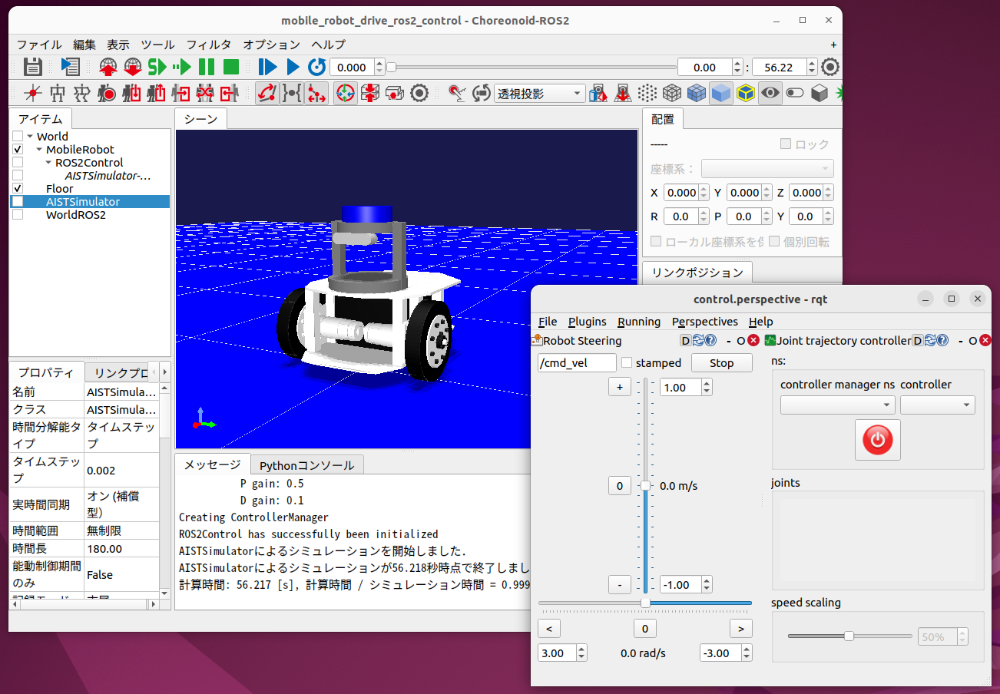
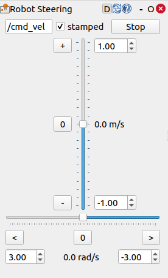
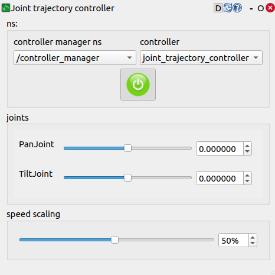

Using ros2_control
==================

`ros2_control <https://control.ros.org/humble/index.html>`_ is a framework for robot control in the ROS 2 environment. Featuring hardware abstraction and modular design, it provides various types of standard controllers. By selecting and combining controllers suited to your purpose, such as position control, velocity control, and trajectory control, you can efficiently build robot control systems without developing custom controllers. Additionally, its plugin structure makes it easy to add new controllers as needed. This allows developers to focus on developing robot applications without worrying about hardware details.

We are currently working on improvements to enable the use of ros2_control with Choreonoid.
This will allow virtual robots to be controlled with ros2_control in simulations on Choreonoid.
This feature is currently available as a beta version for ROS 2 Humble.
Here we introduce the steps to run samples with the beta version.

.. contents::
   :local:

.. highlight:: sh

Beta Branch with ros2_control Support
-------------------------------------

The ROS2 plugin that supports ros2_control is currently being developed in the "feature/ros2-control-beta" branch of the choreonoid_ros package.
Update the choreonoid_ros package repository to the latest version and in your local repository execute: ::

  git checkout feature/ros2-control-beta

to switch to the ros2_control-compatible branch.

In this state, execute :ref:`install-choreonoid-ros2-dependencies` and :ref:`build choreonoid_ros <ros2_colcon_build_command>` to enable the use of ros2_control.

.. _ros2_control_item:

ROS2Control Item
----------------

The ros2_control-compatible version of the ROS2 plugin allows you to use the "ROS2Control Item".
The ROS2Control item is generated from the main menu "File" - "New" - "ROS2Control".
By placing the generated item as a child item of the robot, you can control the robot with ros2_control.

Setting up ros2_control
-----------------------

Once you have prepared a simulation project with the ROS2Control item placed as described above, import the ros2_control settings into Choreonoid using the following procedure:

* Prepare the robot's URDF
   * ros2_control requires a URDF of the robot to be controlled.
* Describe ros2_control parameters in a YAML file
   * ros2_control settings are given as ROS 2 parameters. To do this, first describe the parameters in a YAML file.
* Create a launch file
   * Create a launch file that starts Choreonoid with the robot's URDF and ros2_control parameters available

Describe the following processes in the launch file:

* Start Choreonoid. At this time, perform the following:
   * Load the target simulation project
   * Set ROS 2 parameters for ros2_control
* Start robot_state_publisher to publish the robot's URDF
* Use the spawner from the controller_manager package to load necessary controllers onto the manager
* Start any other necessary ROS nodes or tools

For specific descriptions of these, please refer to the samples introduced below.

Sample Using ros2_control
-------------------------

As a sample of controlling a virtual robot on Choreonoid using ros2_control, we have prepared a sample that replaces the robot control in :doc:`ros2-mobile-robot-tutorial` with ros2_control. The sample is included in the tutorial repository and can be used by switching the branch to "ros2-control".

Building and running the sample basically follows the same procedure as :doc:`ros2-mobile-robot-tutorial`, so please refer to the explanation slides there as well. Below, we briefly explain the steps to run the sample. It is assumed that the Choreonoid main body and choreonoid_ros packages on the workspace are up to date.

First, clone the tutorial package (repository) to the src directory of the ROS 2 workspace: ::

  cd ~/ros2_ws/src
  git clone https://github.com/choreonoid/choreonoid_ros2_mobile_robot_tutorial

(If you have already obtained the repository under src, please update it to the latest version.)

Switch the repository branch to "ros2-control": ::

  cd choreonoid_ros2_mobile_robot_tutorial
  git checkout ros2-control

Build: ::

  cd ~/ros2_ws
  colcon build --symlink-install

Start the sample launch file with the following command: ::

  ros2 launch choreonoid_ros2_mobile_robot_tutorial sensors_display_ros2_control_pid_launch.xml

This will start Choreonoid and rqt as shown in the screen below, and the mobile robot simulation will begin.

This sample follows :doc:`ros2-mobile-robot-tutorial`, and the mobile robot body is controlled via the "/cmd_vel" topic. This can be done through the rqt_robot_steering interface launched by the launch file.

However, for the /cmd_vel topic, it needs to be a "TwistStamped" type message with a timestamp. Therefore, check the "stamped" checkbox in rqt_robot_steering as shown in the figure below to use this message type.

With this setup, you can move the body forward/backward and rotate it by operating the vertical and horizontal sliders in rqt_robot_steering.

The body control uses ros2_control's "diff_drive_controller". The diff_drive_controller is a controller for differential drive (two-wheeled) robots that receives cmd_vel (velocity commands) and converts them into left and right wheel velocities for control. It allows configuration of wheel diameter and wheelbase, and also calculates and publishes odometry information.

In this sample, you can also control the robot's pan-tilt joints. Use the rqt_joint_trajectory_controller displayed simultaneously in rqt.

To do this, first click the "controller manager ns" combo and select "/controller_manager", then click the "controller" combo and select "joint_trajectory_controller". In that state, click the power button icon, and the button will change from red to green, resulting in the state shown in the figure below.

In this state, moving the "PanJoint" or "TiltJoint" sliders will move the robot's pan-tilt axes accordingly. You can also adjust the operation speed by changing the "speed scaling" value.

The pan-tilt axis control uses ros2_control's "joint_trajectory_controller". The joint_trajectory_controller is a controller for controlling the position and velocity of multiple joints in time series. It receives "trajectory_msgs/JointTrajectory" messages and moves each joint to the target position/velocity according to the set time. It is widely used for coordinated control of multi-joint mechanisms such as robot arms.

About Actuation Mode Selection
------------------------------

This sample provides two versions of launch files:

1. sensors_display_ros2_control_pid_launch.xml
2. sensors_display_ros2_control_launch.xml

While the control commands to the robot are the same in both, the output (command values) to the virtual robot on Choreonoid's physics engine side differs. Version 1 outputs torque values to the physics engine, calculating torque command values through PID control based on the angular velocity command values calculated by the ros2_control controller, and outputs these to the physics engine. On the other hand, version 2 directly outputs the angular velocity command values calculated by the ros2_control controller to the physics engine.

This corresponds to different :ref:`simulation-implement-controller-actuation-mode` as explained in :doc:`../simulation/howto-implement-controller`. Version 1 uses JointEffort mode, while version 2 uses JointVelocity mode. There is also a JointDisplacement mode that uses joint angles as command values.

For this actuation mode, it's best to use the mode that is easiest to control, but the appropriate mode may differ depending on the physics engine. Specifically, for the AIST engine (AIST Simulator Item), physics calculations are basically performed with force/torque, so it's preferable to use JointEffort mode. JointVelocity and JointDisplacement use a special calculation method (high-gain mode) that always achieves the command value at each simulation calculation step, which may result in unexpected behavior. On the other hand, several physics engines (simulator items) including AGXDynamics can perform stable simulations even when using JointVelocity or JointDisplacement.

For this reason, this sample provides the two versions mentioned above. When performing simulations using the AIST Simulator Item, it's appropriate to use version 1. When using the AIST Simulator Item in your own simulations, please use similar settings to version 1.