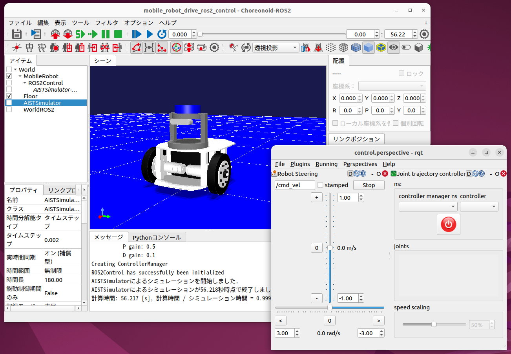
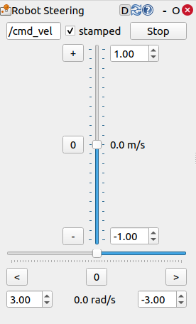
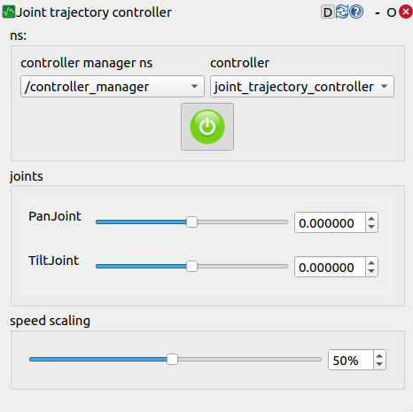

Using ros2_control
==================

`ros2_control <https://control.ros.org/humble/index.html>`_ is a framework for robot control in ROS 2 environments. It features hardware abstraction and modular design, with various types of standard controllers available. By selecting and combining controllers suitable for specific purposes—such as position control, velocity control, and trajectory control—you can efficiently build a robot control system without developing custom controllers. Additionally, its plugin architecture makes it easy to add new controllers as needed. This allows developers to focus on robot application development without worrying about hardware details.

We are currently working on enhancements to enable the use of ros2_control in Choreonoid.
This will allow virtual robots in Choreonoid simulations to be controlled with ros2_control.
The basic functionality is now implemented and available on ROS 2 Humble (Ubuntu 22.04).
Here we introduce the steps to run the samples.

.. note:: We are also working on support for ROS 2 Jazzy (Ubuntu 24.04), but the ros2_control API has changed significantly from Humble, and we have not been able to get it working properly at this time.

.. note:: Previously, this feature was made available in a separate branch called feature/ros2-control-beta, but as of October 17, 2025, it is now available in the master branch.

.. contents::
   :local:

.. highlight:: sh

.. _ros2_control_item:

ROS2Control Item
----------------

The "ROS2Control Item" provided by the ROS2 plugin enables the use of ros2_control in Choreonoid.
The ROS2Control item is created from the main menu: "File" - "New" - "ROS2Control".
By placing the created item as a child item of a robot, the robot can be controlled with ros2_control.

Configuring ros2_control
------------------------

Once you have prepared a simulation project with a ROS2Control item placed as described above, configure ros2_control to be loaded into Choreonoid using the following steps.

* Prepare the robot's URDF
   * ros2_control requires a URDF of the robot to be controlled.
* Describe ros2_control parameters in a YAML file
   * ros2_control configuration is provided as ROS2 parameters. To do this, first describe the parameters in a YAML file.
* Create a launch file
   * Create a launch file that starts Choreonoid in a state where the robot's URDF and ros2_control parameters are available

The launch file should include the following processes:

* Start Choreonoid. In doing so, perform the following:
   * Load the target simulation project
   * Set ROS2 parameters for ros2_control
* Start robot_state_publisher to publish the robot's URDF
* Use the spawner from the controller_manager package to load the necessary controllers onto the manager
* Start any other required ROS nodes or tools

For specific descriptions of these, please refer to the sample introduced below.

ros2_control Usage Sample
-------------------------

A sample for controlling virtual robots in Choreonoid using ros2_control has been introduced in :doc:`ros2-mobile-robot-tutorial`.

.. note:: Previously, this was made available in the "ros2-control" branch of the :doc:`ros2-mobile-robot-tutorial` repository, but as of October 17, 2025, it is now available in the main branch.

Building and running the sample basically follows the same procedures as :doc:`ros2-mobile-robot-tutorial`, so please also refer to the explanation slides there. Below, we briefly explain the steps to run the sample. We assume that the Choreonoid main body and choreonoid_ros packages in the workspace are up to date.

First, clone the tutorial package (repository) into the src directory of the ROS2 workspace. ::

  cd ~/ros2_ws/src
  git clone https://github.com/choreonoid/choreonoid_ros2_mobile_robot_tutorial

(If you have already obtained the repository under src, please update it to the latest version.)

Build it. ::

  cd ~/ros2_ws
  colcon build --symlink-install

Launch the sample launch file with the following command. ::

  ros2 launch choreonoid_ros2_mobile_robot_tutorial drive_ros2_control_pid_launch.xml

This will start Choreonoid and rqt as shown in the screen below, and the mobile robot simulation will begin.

This sample is based on :doc:`ros2-mobile-robot-tutorial`, and the mobile robot's body is controlled via the "/base_controller/cmd_vel" topic. The rqt_robot_steering interface launched by the launch file can be used for this purpose.

However, for the "/base_controller/cmd_vel" topic, the message must be of type "TwistStamped" with a timestamp. Therefore, check the "stamped" checkbox in rqt_robot_steering as shown below to use this message type.

With this setting, you can move the robot forward/backward and turn it by operating the vertical and horizontal sliders in rqt_robot_steering.

The robot's body control uses ros2_control's "diff_drive_controller". The diff_drive_controller is a controller for differential drive (two-wheel) robots that receives cmd_vel (velocity commands), converts them to left and right wheel velocities, and performs control. It allows configuration of wheel diameter, wheelbase distance, etc., and also calculates and publishes odometry information.

This sample also allows you to control the robot's pan-tilt joints. To do this, use the rqt_joint_trajectory_controller displayed simultaneously in rqt.

To do this, first click the "controller manager ns" combo and select "/controller_manager", then click the "controller" combo and select "joint_trajectory_controller". In that state, click the power button icon, and the button will change from red to green, resulting in the state shown in the figure below.

In this state, moving the "PanJoint" or "TiltJoint" sliders will move the robot's pan-tilt axes accordingly. Also, by changing the "speed scaling" value, you can adjust the movement speed.

The pan-tilt axis control uses ros2_control's "joint_trajectory_controller". The joint_trajectory_controller is a controller for controlling the positions and velocities of multiple joints in a time series. It receives "trajectory_msgs/JointTrajectory" messages and moves each joint to the target position and velocity according to the set time. It is widely used for coordinated control of multi-joint mechanisms such as robot arms.

Using Different Actuation Modes
--------------------------------

This sample provides two versions of launch files:

1. drive_ros2_control_pid_launch.xml
2. drive_ros2_control_launch.xml

While these provide the same control commands to the robot, the output (command values) to the virtual robot in Choreonoid's physics engine differs. Version 1 outputs torque values to the physics engine, calculating torque command values from angular velocity command values computed by the ros2_control controller using PID control, and outputs them to the physics engine. On the other hand, version 2 outputs the angular velocity command values computed by the ros2_control controller directly to the physics engine.

This corresponds to using different :ref:`simulation-implement-controller-actuation-mode` as explained in :doc:`../simulation/howto-implement-controller`. Version 1 uses the JointEffort mode, while version 2 uses the JointVelocity mode. There is also a JointDisplacement mode that uses joint angles as command values.

For the actuation mode, it is best to use a mode that is easy to control, but the appropriate mode may differ depending on the physics engine. Specifically, for the AIST engine (AIST Simulator Item), physics calculations are basically performed based on force/torque, so it is preferable to use the JointEffort mode. For JointVelocity and JointDisplacement, the calculation method (high-gain mode) ensures that the command values are realized at every simulation calculation step, which may result in unexpected behavior. On the other hand, for several physics engines (simulator items) including AGXDynamics, simulations can be performed stably even when using JointVelocity or JointDisplacement.

For this reason, this sample provides the two versions mentioned above. When performing simulations using the AIST Simulator Item, it is appropriate to use version 1. When using the AIST Simulator Item in your own simulations, please configure it the same way as version 1.
