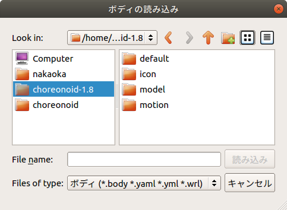

Step 1: Creating a Simulation Project
=====================================

First, let's load the model to be simulated into Choreonoid and create a simulation project. For details on this procedure, see :doc:`../simulation-project`. Here we will specifically explain the necessary work for this time.

.. contents:: Table of Contents
   :local:
   :depth: 2

.. highlight:: sh

.. _simulation-tank-tutorial-invoke-choreonoid:

Launching Choreonoid
--------------------

First, let's launch Choreonoid.

For the purposes of this tutorial, we'll launch it from the command line terminal. Also, to keep the explanation concise, we'll directly execute the executable file generated in the build directory when building Choreonoid. In this case, you don't need to perform the installation operation with "make install".

For example, if you built in a build directory called "build", you can launch Choreonoid from the terminal as follows: ::

 cd [source directory]
 ./build/bin/choreonoid

In this case, the model files included with Choreonoid and the controller files we'll create in this tutorial will use those within the Choreonoid source/build directory. This way, everything is organized in one directory, which should be easier to understand.

.. note:: Of course, you can also use files installed in directories like "/usr/local" through "make install", so please do so if necessary. In this case, when creating controllers, you'll also need to execute "make install", and the controller files to be used will be those stored in the installation destination, so please be aware of this.
.. note:: For basic Linux usage, see :doc:`../../tips/howto-use-commands`.

Creating a World Item
---------------------

Once Choreonoid is launched, first create a World item. From the main menu, select "File" - "New" - "World". The "Generate New World Item" dialog will appear, so click the "Generate" button here. Then, as shown in the figure below, an item named "World" should be displayed in the :ref:`basics_mainwindow_itemtreeview`.

.. image:: ../images/simproject-item1.png

The World item corresponds to one virtual world and must be generated when running a simulation.

Loading the Tank Model
----------------------

Let's load the :ref:`tank_model`, which will be the target of this simulation. As the name suggests, the Tank model is a tank-like model consisting of a two-axis gun turret and left and right crawlers. It also includes a light (light source) and camera.

First, click on the World item created earlier in the Item Tree View to select it. By doing this, newly loaded items will become child items of World.

Next, from the main menu, select "File" - "Load" - "Body". A file loading dialog will be displayed, so select the model file here. The Tank model is described in a file called "Tank.body" stored in the "share/model/Tank" directory of the Choreonoid installation directory, so find and load this.

When opening the model file location in the dialog, make use of the sidebar on the left side of the dialog. Here, you should see a directory called "choreonoid-x.x" (x.x is the version number) or "choreonoid" as shown in the figure below.

Here we're selecting "choreonoid-1.8", which corresponds to the Choreonoid share directory. When you select this, the contents of the share directory will be displayed on the right side of the dialog, so from there, select "model" and then "Tank" in sequence. You should see a file called "Tank.body". By selecting it, you can load the Tank model.

When the model file is loaded successfully, the Item Tree View should display as follows.

.. image:: images/tankitem.png

In Choreonoid, robot and environmental models are called :doc:`../../handling-models/bodymodel`, and these are managed as "Body Items" in the Item Tree View. The body item corresponding to the loaded Tank model is displayed as "Tank" in the Item Tree View.

Here, it's important that the Tank item is displayed one level to the right of the World item (= it's a child item of the World item). With this arrangement relationship, the Tank model is recognized as belonging to the virtual world of World. If the World item was selected when loading the Tank model, it should have this arrangement, but if not, perform the :ref:`basics_item_move` operation (drag the Tank model and drop it at the World item position) to achieve this arrangement.

Also, check whether the Tank item has a checkmark as shown in the figure above. If it doesn't, click the item's checkbox to add a check.

When the Tank item is checked, this model is displayed in the Scene View.

.. image:: images/tankscene.png

Here, it would be good to perform :ref:`basics_sceneview_viewpoint` operations on the Scene View to make the Tank model easier to see. For example, by operating the mouse wheel on the Scene View, you can move the viewpoint forward and backward to display the model larger. The figure above also shows the result of applying such operations.

Note that we explain how to create model files in :doc:`../../handling-models/modelfile/modelfile-newformat` using "SimpleTank" model, a simplified version of the Tank model. The Tank model is created by replacing the SimpleTank shape with one created in an external modeling tool, and this method is introduced in :doc:`../../handling-models/modelfile/tank-blender`.

.. note:: The Tank model uses COLLADA format mesh files, and the "Assimp Plugin" is required to load them. If the Assimp plugin is not built, when loading the model, the message "The file format of 'tank.dae' is not supported by the scene loader." will be displayed, and even if you check the loaded model, it won't be displayed in the Scene View. In this case, install the Assimp library by running :ref:`build-ubuntu-install-packages` again, then set **BUILD_ASSIMP_PLUGIN** to ON in :ref:`build-ubuntu-cmake` and rebuild. If it still doesn't display properly, try loading the simplified version of the Tank model at "share/model/tank/simpletank.body".

.. note:: This tutorial was originally targeted at SimpleTank, so please note that the Tank model figures in the following explanations are SimpleTank. Since the basic content of the models is the same, there's no problem using either model.
	  

Loading the Floor Model
-----------------------

We've loaded the Tank model, but if we run the simulation as is, the Tank will keep falling due to gravity. So let's also load a floor model as an environmental model to support the Tank model.

Similar to before, with the World item selected, select "File" - "Load" - "Body" from the main menu, and load the "floor.body" file in the "share/model/misc" directory of the Choreonoid installation directory. The Item Tree View should then look like this:

.. image:: images/flooritem.png

Similar to the Tank item,

* Is it a child item of the World item?
* Is the Floor item checked?

Please confirm these points.

If it's checked, the floor model (blue part) should also be displayed in the Scene View as shown in the figure below.

.. image:: images/tankfloorscene.png

This completes the preparation of the models.

Note that we're using the default (at loading time) initial state (position and orientation) for each model as is, but if you want to change the initial state, please refer to :ref:`simulation_setting_initial_status`.

.. note:: The floor model doesn't necessarily need to be displayed in the Scene View. Since the Floor model used this time is a simple one corresponding to a plane at Z=0, the default floor grid display might be sufficient. In that case, it's OK to uncheck the Floor item to turn off the display. If the model item is a child item of the World item, it's considered to exist in the simulation regardless of whether it's displayed or not.

Creating a Simulator Item
-------------------------

To perform simulation, you need to create a :ref:`simulation_simulator_item`.

Let's use the standard simulator item "AIST Simulator". Select "AIST Simulator" from "File" - "New" in the main menu to generate the item.

The generated simulator item should be placed as a child item of the World item, similar to model items. This specifies the world that will be the simulation target of the simulator item. Therefore, when performing the above item generation operation, it's good to have the World item selected. If the generated item is displayed in the Item Tree View as follows, it's OK.

.. image:: images/simulatoritem.png

Setting Properties
------------------

To execute the simulation properly, let's set the item properties.

First, let's set the Tank item properties. When you select the Tank item, the property list for this item is displayed in the :ref:`basics_mainwindow_item_property_view` as shown in the figure below.

.. image:: images/tank-item-properties.png

The body item property related to performing simulation is "Self-collision detection". By default, this is false, and even if links in the model collide with each other, they won't stop there but will pass through. In this tutorial, since collision between the Tank model's gun barrel and body is expected, let's set this property to true to enable self-collision detection.

Double-clicking on the part where the "Self-collision detection" property value shows false will display a combo box to select true or false, so select true there.

When performing simulation, you also need to set the simulator item properties appropriately. The default settings are OK for now, but you can configure settings such as :ref:`simulation-time-step`, :ref:`simulation-time-range`, :ref:`simulation-realtime-sync`, :ref:`simulation-result-recording`, :ref:`simulation-device-state-recording`, etc.

.. _tank-tutorial-step1-save-project:

Saving the Project
------------------

With the work so far, we've been able to build the foundation of the simulation project. It would be good to perform :ref:`basics_project_save` at this timing.

Select "File" - "Save Project As" from the main menu, and in the displayed dialog, specify the directory and filename to save. For the filename, let's use something like "step1.cnoid" this time, and it would be good to save with different filenames for each step of this tutorial. Also, after changing project settings, it's good to frequently overwrite and save. The "Save Project" button shown in the figure below is convenient for this.

.. figure:: ../../basics/images/FileBar_x2.png

.. note:: Under "sample/tutorial/Tank" in the Choreonoid source, files step1.cnoid through step6.cnoid are included, which save the project contents for each step of this tutorial.

.. _tank-tutorial-step1-start-simulation:

Running the Simulation
----------------------

Let's try running the simulation in this state for now.

Press the "Start Simulation" button on the simulation bar shown below to start the simulation.

.. image:: ../../basics/images/SimulationBar_StartButton.png

Then, the Tank model's gun barrel should fall downward as shown in the figure below and stop when it hits the body.

.. image:: images/nocontroller.png

This is because there is no :ref:`simulation_controller` to control the Tank model's turret joints. In this case, the joints are in a free state, so the pitch axis rotates due to the moment from gravity.

You can also directly confirm that the joints are in a free state using :doc:`../interaction`. Set the Scene View to edit mode and try dragging the gun barrel with the mouse. You should be able to confirm that you can easily move it by pulling the gun barrel.

In this way, without a controller, you can't even maintain the model's posture. As introduced in :ref:`controller-no-controller-case` of :doc:`../howto-use-controller`, in the case of humanoid robots, the robot collapses forward.

As expected, a controller that performs control is necessary to move the robot, so we'll create controllers from the next step.

Stopping the Simulation
-----------------------

Before moving to the next step, let's stop the simulation. Press the "Stop Simulation" button shown below to end the simulation.

.. image:: ../images/simbar-stop-button.png

From now on, please end the simulation after running it, and then proceed to build the next project.