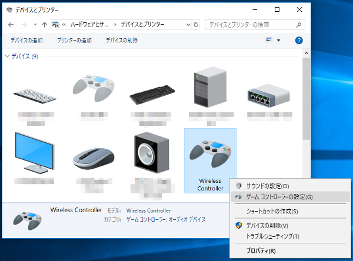
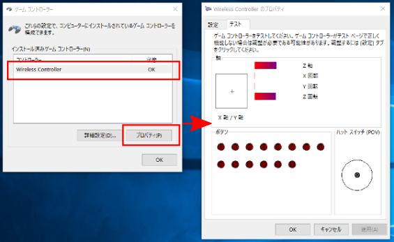
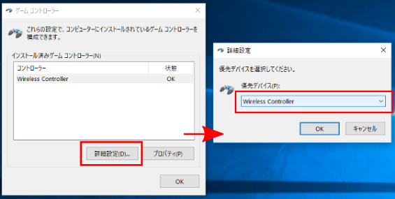
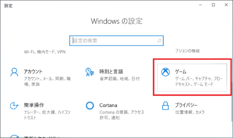
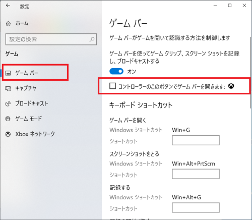
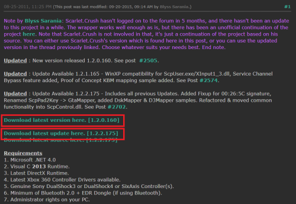
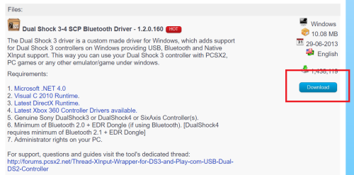
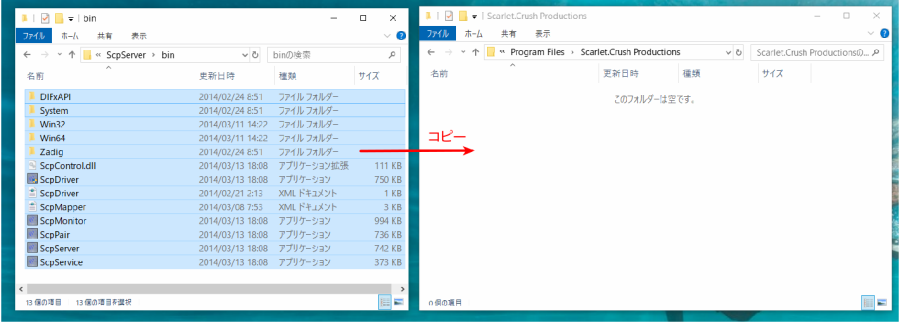
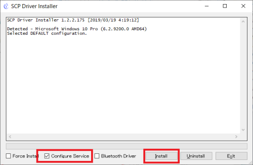
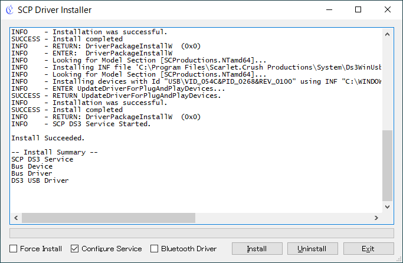

Step 3: Controlling the Gun Turret with a Gamepad
==================================================

In Step 2, we created a controller that performs minimal control and learned how to introduce controllers. In Step 3, let's create a slightly more complex controller.

.. contents:: Table of Contents
   :local:
   :depth: 2

.. _simulation-tank-tutorial-gamepad:

Preparing the Gamepad
---------------------

.. highlight:: sh

The controller we'll create in this step moves the Tank model's gun turret by operating a gamepad (joystick). As preparation for this, prepare a gamepad and connect it to your PC.

Actually, **it's fine even without a gamepad**. In that case, you can use Choreonoid's "Virtual Joystick View" function as a substitute, so please proceed to the next section (:ref:`tank-tutorial-virtual-joystick-view`). The following is an explanation for when using an actual gamepad.

This tutorial assumes a gamepad with the configuration shown in the figure below.

.. image:: images/f310.jpg

This is a product called the `Logitech F310 <http://gaming.logicool.co.jp/ja-jp/product/f310-gamepad>`_. Other gamepads with similar configurations that can be used include the `DUALSHOCK4 <http://www.jp.playstation.com/ps4/peripheral/cuhzct1j.html>`_ for PlayStation 4, DUALSHOCK3 for PlayStation 3, and the `Xbox controller <https://www.xbox.com/ja-JP/xbox-one/accessories/controllers/xbox-black-wireless-controller>`_ or Xbox 360 controller.

These gamepads are usually connected to the PC using USB. For DUALSHOCK4, connection via `USB Wireless Adapter <http://www.jp.playstation.com/ps4/peripheral/cuhzwa1j.html>`_ is also possible.

If you use other models, the axis and button layout may not be appropriate, making it difficult to operate. In that case, please change the axis and button ID values written in the source code. There is an explanation about this at the end of this step in :ref:`simulation-tank-tutorial-step3-implementation`.

Checking Gamepad Operation
--------------------------

Next, check whether the gamepad is recognized by the OS and what the axis and button layout is.

For Ubuntu
~~~~~~~~~~

In Ubuntu, there is a command called "jstest". If the gamepad doesn't work well, please check with this command. From the command line: ::

 sudo apt-get install joystick
  
to install it, and execute it by entering: ::
   
 jstest /dev/input/js0
  
etc.

The command argument represents the gamepad device file. Here "js0" means the first connected gamepad with ID 0, which is usually what you'll use. If you want to use a second or subsequent gamepad, you'll use devices like js1, js2, but please note that this requires changes to the source code.

.. note:: For Dualshock3 and 4, with recent Linux kernels (we've confirmed with version 4.13.0 and later), two device files are generated for one gamepad, with the first corresponding to the touchpad part and the second to other axes and buttons. The first one moves the mouse cursor by default, and touching the Dualshock touchpad moves the mouse cursor. (This moves with the absolute coordinates of the touchpad and is very difficult to operate.) For general gamepad input, use the second device file. If you have only one gamepad connected, you'll use "/dev/input/js1". Note that Choreonoid's joystick library automatically recognizes this Dualshock specification and loads the appropriate device file by default.

When you connect the gamepad and execute the above command, you'll see output like:

.. code-block:: text

 Driver version is 2.1.0.
 Joystick (Logitech Gamepad F310) has 8 axes (X, Y, Z, Rx, Ry, Rz, Hat0X, Hat0Y)
 and 11 buttons (BtnX, BtnY, BtnTL, BtnTR, BtnTR2, BtnSelect, BtnThumbL, BtnThumbR, ?, ?, ?).
 Testing ... (interrupt to exit)
 Axes:  0:     0  1:     0  2:-32767  3:     0  4:     0  5:-32767  6:     0  7:     0 Buttons:  0:off  1:off  2:off  3:off  4:off  5:off  6:off  7:off  8:off  9:off 10:off

This information is output to the console. When you operate the gamepad's axes or buttons here, the output content changes, allowing you to check the connection status and axis/button layout. If such output doesn't appear or the output doesn't change when you operate the gamepad, it's not connected properly, so please check the connection method and gamepad status.

.. note:: The Joystick class used below for joystick input has a function to correct the axis and button layout (ID value correspondence) for each gamepad model to a common layout. This allows the same program to be used for the gamepads mentioned above, but please note that the ID values used in the program don't necessarily match those output by jstest.

.. _tank-tutorial-virtual-joystick-view:

For Windows 10
~~~~~~~~~~~~~~

Open the Control Panel and select Devices and Printers. Right-click on the displayed gamepad as shown below and open the game controller settings.

Select the controller and click Properties to open the test screen. Operate the gamepad and confirm that the screen display changes. If the output doesn't change, it's not connected properly, so please check the connection method and gamepad status.

Next, return to the game controller settings and click Advanced settings. In Preferred device, select the gamepad you want to use. Be sure to do this if you have multiple gamepads connected.

.. note:: If you connect or disconnect multiple gamepads, Choreonoid may not recognize the gamepad even if you specify the preferred device. In such cases, restart Windows and try connecting only one gamepad.

Disabling the Game Bar in Windows 10
""""""""""""""""""""""""""""""""""""

In Windows 10, when using an Xbox gamepad, pressing the button with the logo in the center of the gamepad may launch an app called the Game Bar. You can prevent it from launching by configuring the following settings.

Open Windows Settings and select **Games**.

Select **Game bar** and uncheck **Open Game bar using this button on a controller:**.

Using a PS3 Gamepad in Windows 10
""""""""""""""""""""""""""""""""""

PS3 gamepads cannot be used just by connecting them. There are several free software options available for using them, and here we'll introduce software called "XInput Wrapper for DS3". Using this software, you can operate Choreonoid samples without changing the axis and button settings.

First, connect the PS3 gamepad. You should see **PLAYSTATION(R)3 Controller** displayed in Devices and Printers.

"XInput Wrapper for DS3" can be downloaded from `here <https://forums.pcsx2.net/Thread-XInput-Wrapper-for-DS3-and-Play-com-USB-Dual-DS2-Controller>`_.

When displayed as shown in the figure, click **Download latest version here.**

Click **Download**. Go back to the previous page and also download **Download latest update here**.

.. note:: Several required libraries are displayed, but if you have the latest version of Windows 10 with Visual Studio 2015 or similar installed, they should already be installed. If libraries are missing, please handle them accordingly.

Create a new folder called **Scarlet.Crush Productions** in the Program Files folder.

Extract the downloaded "latest version" file (the file is in **7z** format, so you'll need extraction software) and copy the contents of "bin" inside "ScpServer" to "Scarlet.Crush Productions".

Writing to the Program Files folder requires administrator privileges, so select **Continue** when the message appears. Also extract the "latest update" file and copy the contents of "bin" in the same way. There are files with the same names, so replace them with the update files.

Next, right-click the **ScpDriver.exe** file and select Run as administrator to launch it.

Check **Configure Service** and click **Install**. A Windows Security message will appear, but continue with the installation.

When displayed like this, you're done.

Preparing the Virtual Joystick View
-----------------------------------

If you don't have a gamepad, use the "Virtual Joystick View". This is displayed by selecting "View" - "Show View" - "Virtual Joystick" from the main menu. The appearance is as shown in the figure below.

.. image:: images/joystickview.png

This is usually displayed in the same area as the message view at the bottom of the main window. Since messages become invisible in this state, it's good to perform :ref:`basics_modify_view_layout` so you can use both the message view and virtual joystick view simultaneously. For example, create a layout like the figure below.

.. image:: images/joystickview-layout.png

If an actual gamepad is connected, its input takes priority, so please don't connect a gamepad when using the virtual joystick view.

This completes the preparation.

Controller Source Code
----------------------

.. highlight:: C++
   :linenothreshold: 7

The source code for the controller we'll create this time is shown below. This adds gun turret yaw axis control and command value changes via gamepad input to TurretController1 from Step 2. ::

 #include <cnoid/SimpleController>
 #include <cnoid/Joystick>
 
 using namespace cnoid;
 
 class TurretController2 : public SimpleController
 { 
     Link* joints[2];
     double q_ref[2];
     double q_prev[2];
     double dt;
     Joystick joystick;
 
 public:
     virtual bool initialize(SimpleControllerIO* io) override
     {
         joints[0] = io->body()->link("TURRET_Y");
         joints[1] = io->body()->link("TURRET_P");
 
         for(int i=0; i < 2; ++i){
             Link* joint = joints[i];
             joint->setActuationMode(Link::JOINT_TORQUE);
             io->enableIO(joint);
             q_ref[i] = q_prev[i] = joint->q();
         }
 
         dt = io->timeStep();
       
         return true;
     }
 
     virtual bool control() override
     {
         static const double P = 200.0;
         static const double D = 50.0;
         static const int axisID[] = { 2, 3 };
 
         joystick.readCurrentState();
 
         for(int i=0; i < 2; ++i){
             Link* joint = joints[i];
             double q = joint->q();
             double dq = (q - q_prev[i]) / dt;
             double dq_ref = 0.0;
 
             double pos = joystick.getPosition(axisID[i]);
             if(fabs(pos) > 0.25){
                 double deltaq = 0.002 * pos;
                 q_ref[i] += deltaq;
                 dq_ref = deltaq / dt;
             }
      
             joint->u() = P * (q_ref[i] - q) + D * (dq_ref - dq);
             q_prev[i] = q;
         }
 
         return true;
     }
 };
 
 CNOID_IMPLEMENT_SIMPLE_CONTROLLER_FACTORY(TurretController2)

Compiling the Controller
------------------------

Enter and save the above source code, and compile it.

The procedure is the same as in Step 2. Save the source code with the filename "TurretController2.cpp" in the project directory, and add the following to CMakeLists.txt.

.. code-block:: cmake

 choreonoid_add_simple_controller(TankTutorial_TurretController2 TurretController2.cpp)

When you perform the Choreonoid compilation operation with this, this controller will also be compiled simultaneously, and a file called "TankTutorial_TurretController2.so" will be generated in the controller directory.

Replacing the Controller
------------------------

Now let's use this controller as the controller for the Tank model.

You should have the project created in Step 2, so let's just change the controller settings there. Perform the :ref:`simulation-tank-tutorial-set-controller` explained in Step 2 again, and replace it with the "TankTutorial_TurretController2.so" controller file created this time.

This completes the controller preparation. In this state, it's good to save the project again with a filename like "step3.cnoid".

When using the virtual joystick view, be sure to save the project with the view displayed. The Joystick object checks the state of connected joysticks when it's created. If the virtual joystick view settings are saved in the project file, the virtual joystick view will be restored when loading the project, then the controller will be created, and the controller will recognize the virtual joystick view. Also, by setting the Reload property of the controller item to True, you can configure it to recreate the controller each time the simulation starts.

Operating the Gun Turret
------------------------

Let's run the simulation.

This time you should be able to move the Tank model's gun turret with the gamepad, so try moving it. For the F310, the lower right analog stick corresponds to gun turret operation, so operate this axis. For other models, try moving various axes to see which ones correspond. If it doesn't work well, let's change the axis settings in the source code. This will be explained in the next section.

When using the virtual joystick view, operate with the keyboard. The buttons displayed in the view correspond to the gamepad's directional pad, each axis of the analog sticks, and each button. The correspondence is shown in the figure below.

.. image:: images/joystickview-mapping.png

If you compare this figure with the F310 gamepad, you can see that it corresponds to the main axes and buttons of the F310. This time, you can operate the gun turret's yaw axis rotation with the keyboard's "J" and "L", and pitch axis rotation with "I" and "K".

As a note, the virtual joystick view **doesn't function unless keyboard focus is on it.** Therefore, when using it, you need to click this view with the mouse once to give it focus. If you perform operations like changing the viewpoint of the scene view while operating, the focus goes there, so you need to click the virtual joystick view again to refocus it.

Were you able to move the Tank model's gun turret successfully? In this way, various operations become possible depending on the controller. By incorporating input from external devices, the range of controllers also expands.

.. _simulation-tank-tutorial-step3-implementation:

Explanation of Implementation Details
-------------------------------------

TurretController2 this time, like TurretController1 created in Step 2, controls the gun turret axes with PD control, and that part is basically unchanged.

However, based on this, it differs in that the following two points have been extended:

1. In addition to the "TURRET_Y" joint corresponding to the gun turret yaw axis, it now also controls the "TURRET_P" joint corresponding to the pitch axis.
2. Instead of fixing the target joint angle for PD control to the model's initial angle, it changes according to input from the gamepad (joystick).

For point 1, we simply made the related variables into arrays and performed the same processing for each using a for loop.

For point 2, we used the "Joystick" class provided by Choreonoid to obtain input from the joystick. Let's explain this.

First, ::

 #include <cnoid/Joystick>

includes the header where the Joystick class is defined.

The Joystick class object is defined as a member variable of TurretController2: ::

 Joystick joystick;

We're using the default constructor, and in this case, the device file "/dev/input/js0" becomes the joystick input source. Also, if this device file doesn't exist, if there's a virtual joystick view, that becomes the input source.

To obtain the joystick state, first execute: ::

 joystick.readCurrentState();

This reads the current state of the joystick from the device file or virtual joystick view.

Then you can get the axis state (how much it's tilted) as a value from -1.0 to +1.0 with: ::

 joystick.getPosition(axis ID)

And you can get whether a button is pressed as a bool value with: ::

 joystick.getButtonState(button ID)

We'll use buttons in controllers from Step 5 onwards.

As a note, regarding the analog stick axis state values, 0 is the neutral point, but the value may not always be 0 even when the stick isn't being moved. Therefore, it's necessary to apply a certain threshold for determining whether it's being moved. This processing is done in the control function of the above source code with: ::

 if(fabs(pos) > 0.25){
  
The joystick axis correspondence is set in the control function with: ::

 static const int axisID[] = { 3, 4 };

Here, 3 and 4 are the axis ID values corresponding to the gun turret yaw axis and pitch axis respectively, and for the F310, they correspond to the right analog stick. For other gamepads, please check the output of the jstest command to map them to appropriate axes.

The part that actually sets the target joint angle is in the control function: ::

 double pos = joystick.getPosition(axisID[i]);
 if(fabs(pos) > 0.25){
     double deltaq = 0.002 * pos;
     q_ref[i] += deltaq;
     dq_ref = deltaq / dt;
 }

Here, q_ref[i] is the variable corresponding to the target joint angle, and dq_ref is the variable corresponding to the target joint angular velocity. Then, using these target values, we perform PD control similar to Part 1.