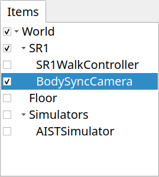
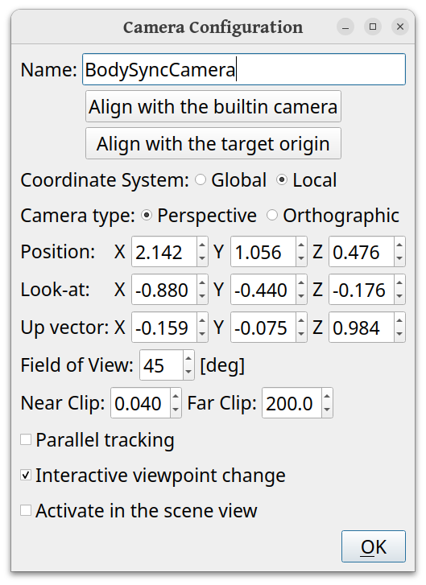

How to use BodySyncCamera
==========================

BodySyncCamera is a camera that moves in accordance with the movement of body models such as robots.
When a body model moves during simulation or other operations, selecting this camera for scene view rendering causes the camera to move along with the body's movement, providing a tracking view of the robot. This section explains how to use this camera.

Creating a BodySyncCamera item
-------------------------------

From the menu, select **File** - **New** - **BodySyncCamera** to create a BodySyncCamera item,
and place it as a child item of the body item you want to synchronize with.
Give the item a name to distinguish it from other cameras.
Also, make sure to check the item.

The following shows the state of the item tree view when introducing a BodySyncCamera to the "SR1Walk.cnoid" sample.

Since we are trying to synchronize with the SR1 robot's movement here, we have introduced the camera item as a child item of the SR1 item.
Please note that if it is not a child item of the target body item, it will not synchronize with the body's movement.

.. _body_sync_camera_selection:

Selecting the BodySyncCamera
-----------------------------

When you check the BodySyncCamera item, the camera corresponding to the item will be displayed in the "Drawing camera selection combo" in the scene bar, so select it. For information on selecting cameras in the scene view, see :ref:`basics_sceneview_change_camera`.

The following is an example of camera selection in the SR1Walk project.

.. image:: images/body_sync_camera_selection.png

In this state, you can also change the viewpoint using mouse operations, so adjust it to a viewpoint that is easy to see.

Camera synchronization
----------------------

When the target body moves, the camera also moves in conjunction with it.
More precisely, the relative positional relationship between the body's root link and the camera is maintained.

For example, in the SR1Walk project, when you start the simulation and the SR1 robot walks, the camera will follow its movement.

Since the camera synchronizes when the position of the target body model changes, it will synchronize not only during simulation but also when the body position changes through operations such as the time bar or placement view.

Context menu
------------

Right-clicking on an item in the item tree view displays a context menu.
The following three items appear at the top of the BodySyncCamera context menu:

* Activate camera
* Apply to built-in camera
* Camera configuration

Selecting "Activate camera" makes that camera the camera used in the scene view.
This produces the same result as selecting from the camera selection combo explained in :ref:`body_sync_camera_selection`.

Selecting "Apply to built-in camera" applies the BodySyncCamera viewpoint to the cameras built into the scene view by default ("Perspective" and "Orthographic" cameras), and then switches the camera used in the scene view to the built-in camera.

"Camera configuration" is explained in the next section.

Camera configuration
--------------------

Selecting "Camera configuration" from the context menu displays the camera configuration dialog shown below.

The configurable items are as follows.

.. tabularcolumns:: |p{3.5cm}|p{11.5cm}|

.. list-table::
 :widths: 25,75
 :header-rows: 1

 * - Setting Item
   - Meaning
 * - Name
   - The name of the item. Also used as the camera name.
 * - Align with the builtin camera
   - Pressing this button sets the camera configuration to match the built-in camera.
 * - Align with the target origin
   - Sets the camera position to the origin position of the target (target body/link).
 * - Coordinate System
   - Selects whether the coordinate system for the camera position and orientation set in this dialog should be global or local coordinates from the target.
 * - Camera type
   - Selects the camera projection type.
 * - Position
   - Sets the camera position.
 * - Look-at
   - Sets the camera's line of sight direction.
 * - Up vector
   - Sets the camera's upward direction.
 * - Field of View
   - Sets the camera's field of view.
 * - Near Clip
   - Sets the near clipping distance.
 * - Far Clip
   - Sets the far clipping distance.
 * - Parallel tracking
   - When checked, only the camera position is synchronized with the target without changing the camera orientation (direction).
 * - Interactive viewpoint change
   - When checked, you can interactively change the camera position and orientation through mouse viewpoint change operations.
 * - Activate in the scene view
   - When checked, this becomes the camera used in the scene view.

Properties
----------

The BodySyncCamera can also be configured with the following properties.

* Camera type
* Field of View
* Near clip distance
* Far clip distance
* Interactive viewpoint change
* Target link
* Parallel tracking

By specifying a link name in "Target link", you can make links other than the target body's root link the synchronization target.
The other properties are the same as the items in the configuration dialog.