Gamepad Usage
==============

In Choreonoid, you can change the command values sent to the robot from the controller by using gamepad inputs. This section explains how to use the gamepad and the "Joystick" class provided by Choreonoid.

Verifying the Gamepad Operation
---------------------------------

Check if the gamepad is recognized by the OS and the layout of the axes and buttons.

For Ubuntu
~~~~~~~~~~~

On Ubuntu, you can use the "jstest-gtk" application. If the gamepad does not work properly, please check it using this application. To install it, run the following command in the terminal::

 sudo apt install jstest-gtk

Once installed, run it by typing::

 jstest-gtk

Here is an example of the screen when the Xbox Wireless Controller is connected and jstest-gtk is started.

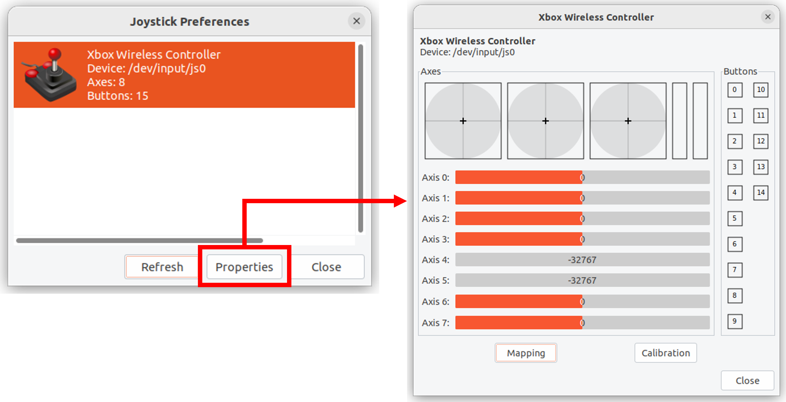

Here, **Device:** refers to the gamepad's device file. The "js0" indicates the first connected gamepad with ID 0, and usually, you will use this. If you want to use the second or subsequent gamepads, you can use devices like js1, js2, etc., but please note that changes in the source code may be necessary for this.

When you open the properties, the gamepad's information is displayed. If you operate the gamepad's axes or buttons here, the output will change, allowing you to check the connection status and axis/button layout. If no output is shown or the output does not change when operating the gamepad, the gamepad is not properly connected, so please check the connection method and the gamepad's status.

For Windows 11
~~~~~~~~~~~~~~

Open the Control Panel and select Devices and Printers. Right-click on the gamepad displayed as shown below and open the "Game controller Settings." Here is an example when the Xbox Wireless Controller is connected.

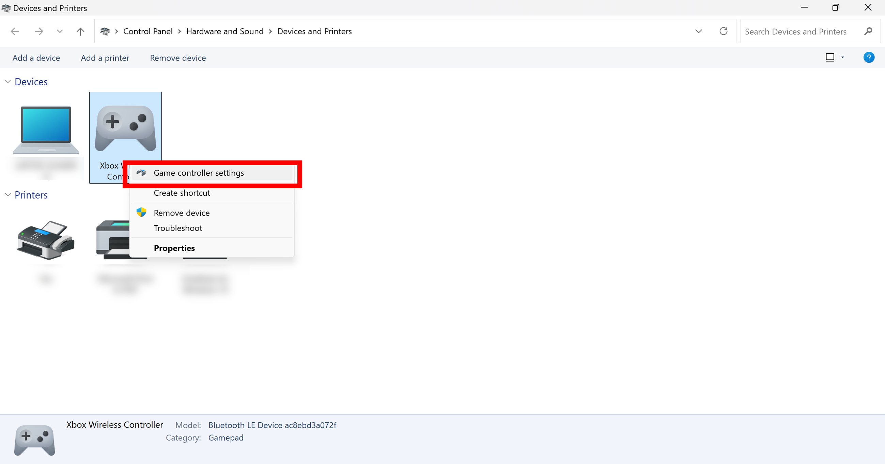

Select the controller and click on "Properties" to open the test screen. Check that the screen display changes when you operate the gamepad. If the output does not change, the gamepad is not properly connected, so please check the connection method and the gamepad's status.

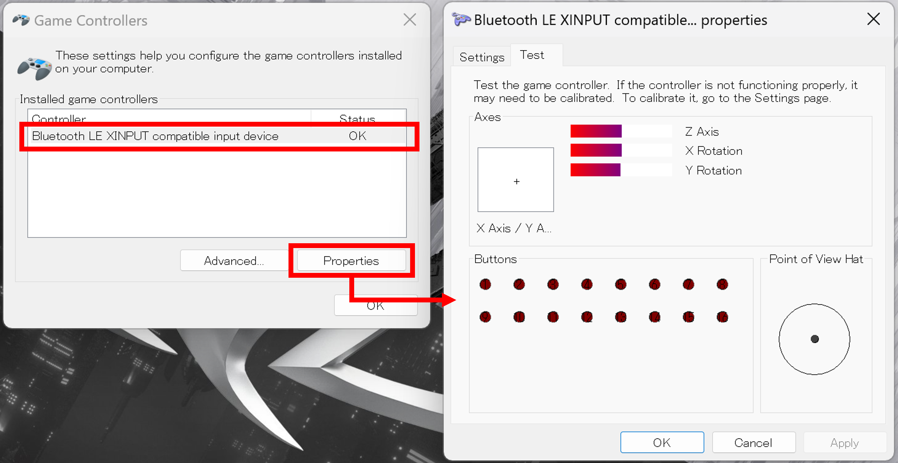

Next, return to the "Game Controller Settings" and click on "Advanced..." In the "Preferred Device," select the gamepad you want to use. You must do this if you have multiple gamepads connected.

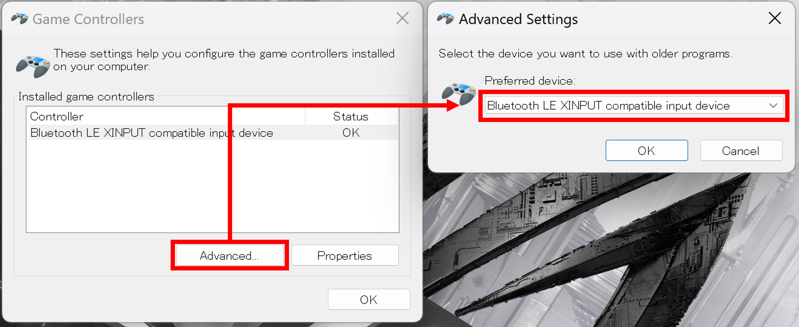

.. note:: When connecting or disconnecting multiple gamepads, even if you specify the preferred device, Choreonoid may not recognize the gamepad. In such cases, please restart Windows and try connecting only one gamepad.

Disable the Game Bar in Windows 11
--------------------------------------

When using an Xbox gamepad in Windows 11, pressing the button with the logo in the center of the gamepad may launch the Game Bar app. You can prevent it from launching by changing the following settings:

Open Windows Settings and select **Gaming**.

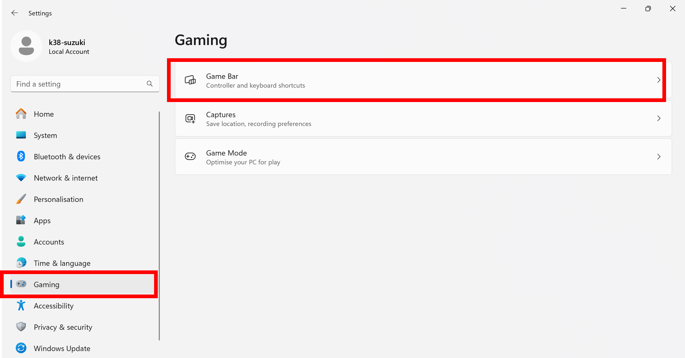

Select **Game Bar** and turn off **Allow your controller to open Game Bar**.

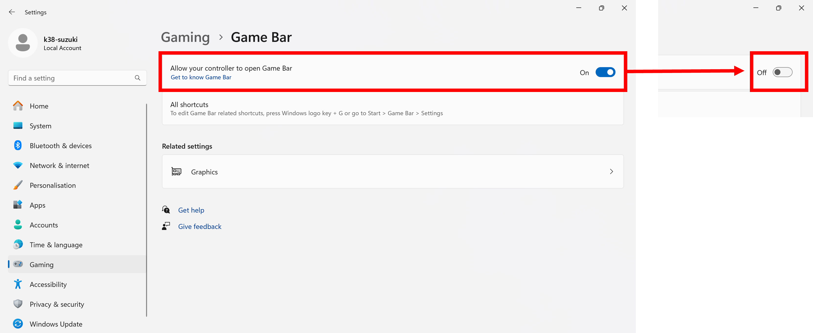

Joystick Class
--------------

Gamepad mappings (axis and button layout) may vary by model. Here we will explain the usage with examples of the **DUALSHOCK 4** and **Xbox Wireless Controller**.

.. image:: images/controllers.png

When these gamepads are connected, jstest-gtk will display the gamepad information as follows.

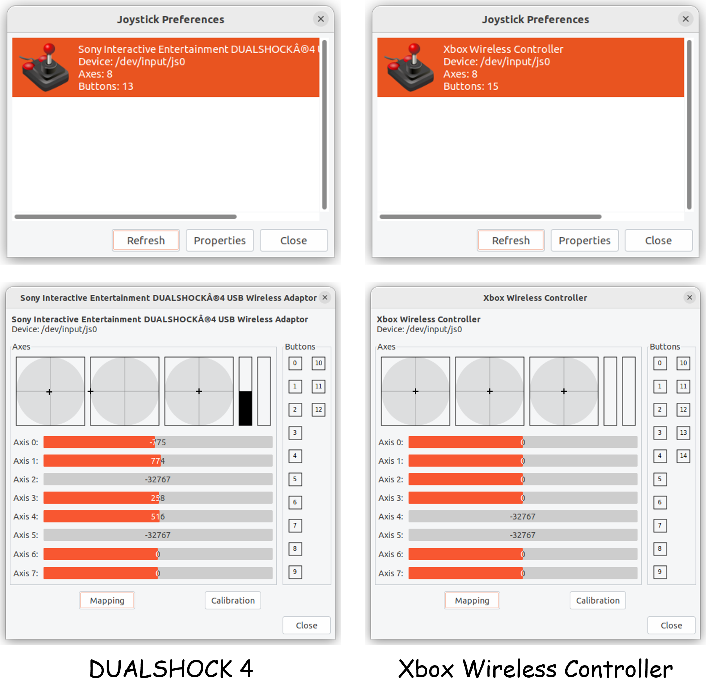

The mappings of the gamepad at this time are as follows, showing that the axis and button layouts differ.

.. image:: images/axis_map_raw.png

.. image:: images/button_map_raw.png

When the gamepad mappings differ like this, it may become difficult to properly control the robot in the simulation.

To address these differences in mapping, Choreonoid provides a "Joystick" class that corrects the mappings of gamepads to a common layout. The Joystick class is used to obtain inputs from the gamepad and modify the command values sent to the robot from a simple controller. With this class, the mappings of the gamepad are corrected as follows.

.. image:: images/axis_map_cnoid.png

.. image:: images/button_map_cnoid.png

By correcting the mappings like this, Choreonoid ensures that inputs from different gamepad models can be correctly received.

As of March 2025, the following gamepads are supported by the Choreonoid Joystick class. Other gamepads are not supported. If using any other models, the axis and button layout may not work properly, and inputs may not be properly received.

.. list-table:: **Recommended Gamepad List**
 :widths: 50,50,30,30,30,30
 :header-rows: 1

 * - Model Name
   - Model Number
   - Ubuntu (USB)
   - Ubuntu (Bluetooth)
   - Windows (USB)
   - Windows (Bluetooth)
 * - DUALSHOCK 4
   - CUH-ZCT2J
   - O
   - O
   - O
   - O
 * - DUALSHOCK 4 USB Wireless Adapter
   - CUH-ZWA1J
   - O
   - O
   - O
   - O
 * - Wireless Controller (DUALSHOCK 3)
   - CECH-ZC2J
   - O
   - X
   - O
   - X
 * - DualSense Wireless Controller
   - CFI-ZCT1J
   - O
   - O
   - X
   - X
 * - DualSense Edge Wireless Controller
   - CFI-ZCP1J
   - O
   - O
   - X
   - X
 * - Xbox 360 Controller for Windows Liquid Black
   - 52A-00006
   - O
   - X
   - O
   - X
 * - Xbox Wireless Controller
   - QAS-00006
   - O
   - O
   - O
   - O
 * - Xbox Elite Wireless Controller Series 2
   - FST-00009
   - O
   - O
   - O
   - O
 * - F310 Gamepad
   - F310r
   - O
   - X
   - O
   - X
 * - F710 Wireless Gamepad
   - F710r
   - O
   - X
   - O
   - X
 * - Logitech Dual Action PC Game Controller
   - GPX-450BK
   - O
   - X
   - O
   - X

.. note:: Nintendo's Joy-Con and Nintendo Switch Pro Controllers are available in the consumer market but are not supported by the Choreonoid Joystick class. Specifically, the Joy-Con requires 1) Bluetooth connections for the left and right controllers separately when connecting to the PC, and 2) since they are recognized as separate devices, the above-mentioned correction cannot be applied. Also, the Nintendo Switch Pro Controller does not generate a device file when connected to the PC, so it is not recognized as a gamepad. If you wish to use these gamepads, you will need to either create your own program or use an external library that supports them.

.. note:: When connecting a DualSense or DualSense Edge, the built-in motion sensor is also recognized as a separate gamepad. For example, when the first gamepad, DualSense, is connected, it will be recognized as /dev/input/js0 (controller) and /dev/input/js1 (motion sensor). If a second gamepad is connected afterward, it will be recognized as /dev/input/js2, so please be aware of this. Below are examples of jstest-gtk when **only DualSense** is connected and when **both DualSense and DualSense Edge** are connected.

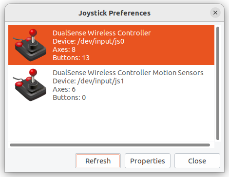

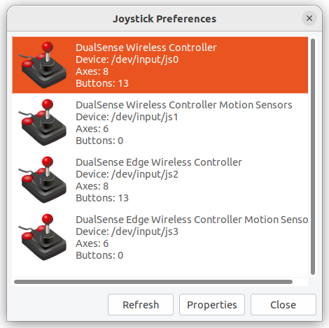

When using the Joystick class inside a controller, the corrected axis and button ID values can easily be specified using the following enumerations.

.. list-table:: **Enumeration and Corrected Axis ID Values**
 :widths: 50,30,30
 :header-rows: 1

 * - Enumeration
   - Corresponding Axis
   - ID Value
 * - Joystick::L_STICK_H_AXIS
   - Left Stick (Horizontal)
   - 0
 * - Joystick::L_STICK_V_AXIS
   - Left Stick (Vertical)
   - 1
 * - Joystick::R_STICK_H_AXIS
   - Right Stick (Horizontal)
   - 2
 * - Joystick::R_STICK_V_AXIS
   - Right Stick (Vertical)
   - 3
 * - Joystick::DIRECTIONAL_PAD_H_AXIS
   - D-pad (Horizontal)
   - 4
 * - Joystick::DIRECTIONAL_PAD_V_AXIS
   - D-pad (Vertical)
   - 5
 * - Joystick::L_TRIGGER_AXIS
   - Left Trigger
   - 6
 * - Joystick::R_TRIGGER_AXIS
   - Right Trigger
   - 7
 * - Joystick::NUM_STD_AXES
   - Total Axes
   - 8

.. list-table:: **Enumeration and Corrected Button ID Values**
 :widths: 50,30,30
 :header-rows: 1

 * - Enumeration
   - Corresponding Button (PS-style)
   - ID Value
 * - Joystick::A_BUTTON
   - A (Cross) Button
   - 0
 * - Joystick::B_BUTTON
   - B (Circle) Button
   - 1
 * - Joystick::X_BUTTON
   - X (Square) Button
   - 2
 * - Joystick::Y_BUTTON
   - Y (Triangle) Button
   - 3
 * - Joystick::L_BUTTON
   - L (L1) Button
   - 4
 * - Joystick::R_BUTTON
   - R (R1) Button
   - 5
 * - Joystick::SELECT_BUTTON
   - Select (Share) Button
   - 6
 * - Joystick::START_BUTTON
   - Start (Options) Button
   - 7
 * - Joystick::L_STICK_BUTTON
   - Left Stick Button (Press)
   - 8
 * - Joystick::R_STICK_BUTTON
   - Right Stick Button (Press)
   - 9
 * - Joystick::LOGO_BUTTON
   - Logo (PS) Button
   - 10
 * - Joystick::NUM_STD_BUTTONS
   - Total Buttons
   - 11

Virtual Joystick View
----------------------

If there is no physical gamepad, you can use the "Virtual Joystick View." This can be displayed by selecting "Virtual Joystick" from the "View" menu in the main menu.

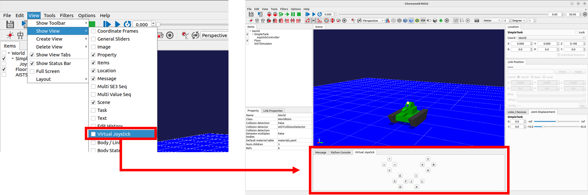

The appearance of the Virtual Joystick View is as shown below.

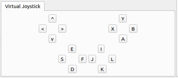

This will normally be displayed in the same area as the message view at the bottom of the main window. To make sure the message view and virtual joystick view are visible at the same time, you can modify the layout as described in :ref:`basics_modify_view_layout`. For example, adjust the layout as shown in the figure below.

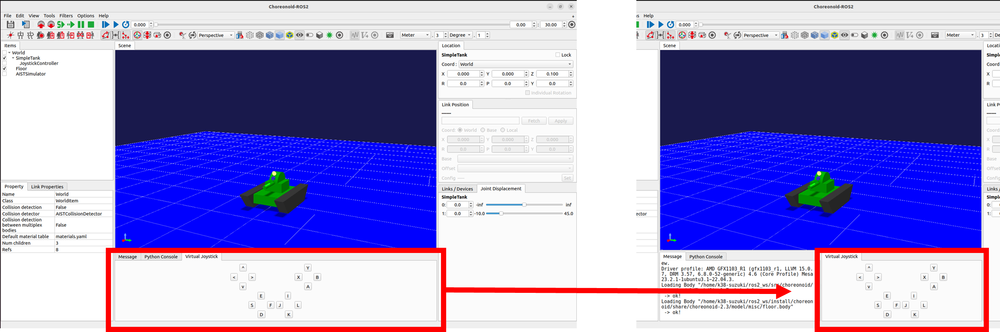

If a physical gamepad is connected, its input will take priority, so do not connect a gamepad when using the Virtual Joystick View.

When using the Virtual Joystick View, you can control it via the keyboard. The buttons shown in the view correspond to the D-pad, analog stick axes, and various buttons on the gamepad. The following diagram shows the mapping.

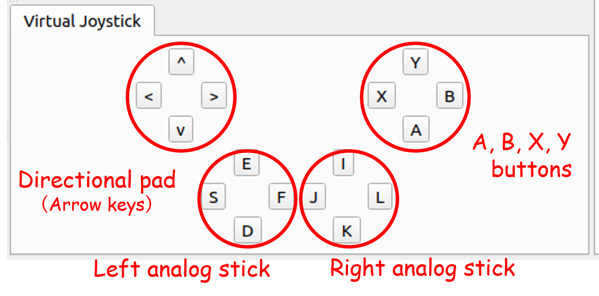

Please note that the **Virtual Joystick View will not function unless it has keyboard focus.** Therefore, you need to click the view with the mouse to set focus on it. If you change the scene view during operation, the focus will shift, and you will need to click the Virtual Joystick View again to restore focus.

