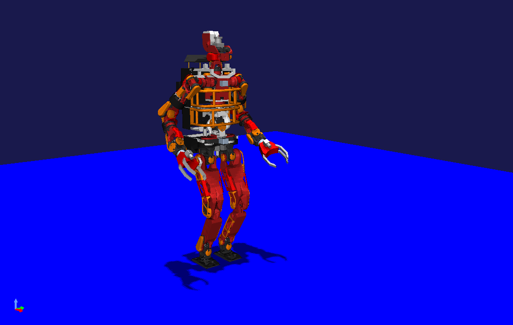

JAXON2 Sample
=============

In Choreonoid, you can use the model of the full-sized humanoid robot "JAXON2" developed by JSK (Jouhou System Kougaku Laboratory) at the University of Tokyo. The model and complete set of samples are available in the following GitHub repository:

* https://github.com/choreonoid/jaxon2-draft

As samples that perform walking motion with this model, we also provide implementation examples of ZMP-based standing stabilization control and walking stabilization control using trunk compliance control.

The original JAXON2 model is published under the Creative Commons License (Attribution-ShareAlike 4.0) in the `JSK GitHub repository <https://github.com/start-jsk/rtmros_choreonoid>`_. The model in this sample has been re-edited for Choreonoid with permission from JSK based on the above model.

.. contents::
    :local:

How to Use
----------

Clone the jaxon2-draft repository under the ext directory of the Choreonoid main body. ::

  cd Choreonoid main source directory/ext
  git clone https://github.com/choreonoid/jaxon2-draft.git

When building Choreonoid, if you set the CMake option **BUILD_JAXON2_SAMPLES** to ON, the JAXON2 model and samples will be installed. Add ``-DBUILD_JAXON2_SAMPLES=ON`` as an argument to the cmake command, or use the ccmake command to turn this option ON in the GUI.

Introduction to Sample Projects
-------------------------------

The following three sample projects are provided. All of them are stored in the "sample" directory of the jaxon2-draft repository.

* Jaxon2WalkPatternController.cnoid
* Jaxon2WalkStabilizer.cnoid
* Jaxon2StandingStabilizer.cnoid

In Jaxon2WalkPatternController.cnoid, JAXON2 executes a pre-prepared walking pattern under ideal joint position control. Since each joint follows the target angle without delay, it faithfully reproduces the prepared walking pattern. Therefore, if the walking pattern is well-designed, walking motion will be achieved. On the other hand, when unexpected events occur, such as external forces being applied to the arms or torso, the robot will easily fall over because there is no control to maintain balance.

In Jaxon2WalkStabilizer.cnoid, each joint of JAXON2 follows the target position through PD control. The behavior of joint angles reflects mechanical characteristics such as inertia, and there may be delays and errors in tracking, making it closer to an actual robot. Therefore, the controller used here implements stabilization control to maintain balance, allowing walking even if the joints do not move ideally. The details of the stabilization control will be explained in the next section.

In Jaxon2StandingStabilizer.cnoid, JAXON2 continues to stand with stabilization control enabled. Right-click on the robot and select edit mode. You can then apply external forces by dragging each link of the robot. Of course, stabilization control has its limits, so for example, if you apply a large force to the torso or head, or apply force repeatedly in a short time, it will fall over. However, in many cases, you will be able to observe the robot slowly converging back to its original posture through stabilization control.

.. note:: The walking motion data referenced in Jaxon2WalkPatternController and Jaxon2WalkStabilizer was created using Choreonoid's motion choreography function. As a project for editing this motion data, we also provide a project called Jaxon2SampleWalkPattern.cnoid. To use this project, turn on **BUILD_POSE_SEQ_PLUGIN** and **BUILD_BALANCER_PLUGIN** when building Choreonoid to enable the PoseSeq plugin and BalancerPlugin.

Stabilization Based on Trunk Position Compliance Control
--------------------------------------------------------

This section introduces the trunk position compliance control used as the stabilization control law in this sample.

Let :math:`x` be the position of the center of mass on the plane perpendicular to the horizontal plane, and let :math:`p` be the ZMP (Zero Moment Point), which is the center of action of the floor reaction force. Then the following ZMP equation holds:

.. math::
    p = x - \frac{z_c}{g} \ddot{x}

Here, :math:`z_c` is assumed to be the constant height of the center of mass from the floor, and :math:`g` represents the gravitational acceleration constant. If we view this equation as a linear system with the acceleration of the center of mass :math:`\ddot{x}` as input, feedback stabilization can be performed with the following input:

.. math::
    \ddot{x} = - k_1 p - k_2 x - k_3 \dot{x}

To actually achieve feedback stabilization, the constants :math:`k_1, \ k_2, \ k_3` need to satisfy several conditions, but we will omit that explanation here. The ZMP equation with this feedback applied can be described as follows:

.. math::
    p = x - \frac{z_c}{g} \left( - k_1 p - k_2 x - k_3 \dot{x} \right)

.. math::
    \Leftrightarrow \dot{x} = \frac{1}{k_3} \left( \frac{g}{z_c} - k_1 \right) p - \frac{1}{k_3} \left( \frac{g}{z_c} + k_2 \right) x

The stabilization control law in this sample numerically integrates the center of mass velocity :math:`\dot{x}` that satisfies this equation and provides the target value for the center of mass position. However, in practice, we make an approximation by controlling the trunk (waist link) instead of controlling the center of mass position.

In the program, the coefficients for ZMP and center of mass position are defined as :math:`K_1 = \frac{1}{k_3} \left( \frac{g}{z_c} - k_1 \right), \ K_2 = \frac{1}{k_3} \left( \frac{g}{z_c} + k_2 \right)`, respectively, and stabilization is performed for both the front-back and left-right directions of the robot. The simple standing stabilization code is implemented in "Jaxon2StandingStabilizer.cpp" or "Jaxon2WalkStabilizer.cpp" under the samples directory.

*Note*: This explanation derives the control law through a different interpretation from Nagasaka et al.'s paper. For those interested, please refer to Chapter 4 of the book by Kajita et al.

References
----------

* Kojima et al.: Development of High-Speed High-Output Humanoid Research Platform JAXON, Journal of the Robotics Society of Japan, Vol. 34, No. 7, 2016 ( `J-STAGE <https://www.jstage.jst.go.jp/article/jrsj/34/7/34_34_458/_article/-char/ja/>`_ ).
* Nagasaka, Inaba, Inoue: Walking Stabilization of Humanoid Robot Using Trunk Position Compliance Control, Proceedings of the 17th Annual Conference of the Robotics Society of Japan, pp. 1193-1194, 1999.
* Nagasaka: Whole-Body Motion Generation for Humanoid Robots by Dynamics Filter, Chapter 6: Motion Generation by Geometric Constraint Type Dynamics Filter, Doctoral Dissertation, University of Tokyo, 2000.
* Kajita (ed.): Humanoid Robot Revised 2nd Edition, Chapter 4: Biped Walking, Ohmsha, 2020.