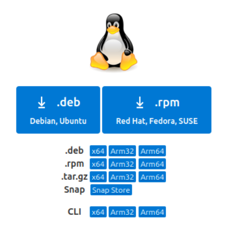
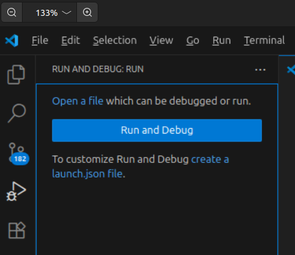
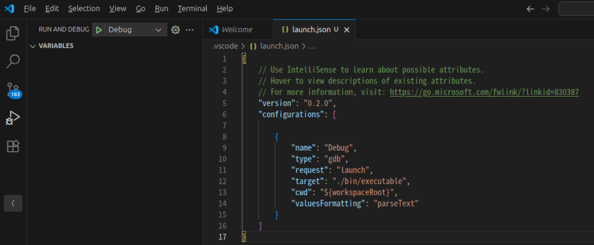
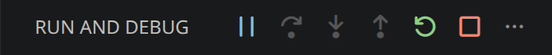
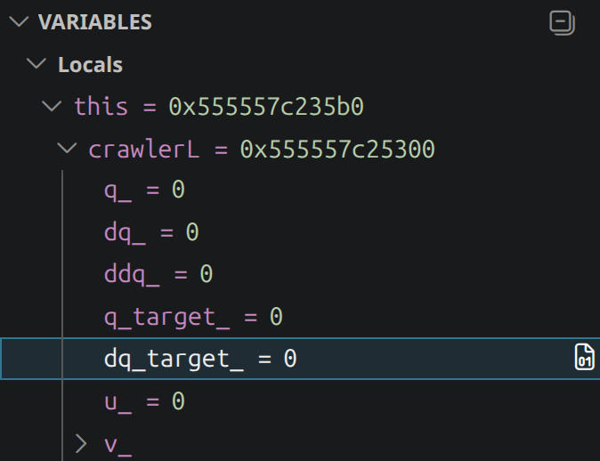

How to Debug Choreonoid Using Visual Studio Code
================================================

This section explains how to debug Choreonoid programs using Visual Studio Code.

This document describes a debugging method that combines GNU Debugger (GDB) with Microsoft's C/C++ extension. When debugging Choreonoid built with gcc on Linux, this combination is the most stable and feature-rich.

.. contents::
   :local:
   :depth: 1

Installing Visual Studio Code and the Extension
-----------------------------------------------

First, install Visual Studio Code itself, and then install the C/C++ extension. You only need to do this once; you will not need to repeat it for subsequent debugging work.

Installing Visual Studio Code
~~~~~~~~~~~~~~~~~~~~~~~~~~~~~

If you are already using Visual Studio Code, you can use your existing installation.

Here we describe the case of installing Visual Studio Code on Ubuntu 24.04 LTS (64-bit).

Open the Visual Studio Code home page at https://azure.microsoft.com/en-us/products/visual-studio-code and click the **Download VS Code** button.

.. image:: images/01_install_vscode.png
   :scale: 80

On the download page that appears, click the **.deb Debian, Ubuntu** button to download the .deb file (for example, **code_1.102.0-1752099874_amd64.deb**).

Open a terminal in the directory where the .deb file was saved, and run ::

 sudo dpkg -i code_1.102.0-1752099874_amd64.deb

to start the installation (replace the filename according to the version you downloaded).
Follow the installer's instructions. If the following screen appears during installation, select either <Yes>/<No> to continue the installation.

.. image:: images/03_install_vscode.png
   :scale: 50

Installing the C/C++ Extension
~~~~~~~~~~~~~~~~~~~~~~~~~~~~~~

Launch Visual Studio Code. Open a terminal and run ::

 code

to launch Visual Studio Code.

If you do not need to change any settings, press the **Mark Done** button to complete the initial setup.

.. image:: images/04_launch_vscode.png
   :scale: 50

Next, install the C/C++ extension in Visual Studio Code. Click the **Extensions (Ctrl+Shift+K)** button on the left side of the window, search for **C/C++** in the search bar at the top of the EXTENSIONS panel, and install the extension provided by Microsoft.

.. image:: images/06_install_c_cpp.png
   :scale: 50

This extension includes a debugger (cppdbg) that allows you to use GDB from Visual Studio Code.

.. note::
   There are many other extensions for debugging C/C++ in Visual Studio Code. Representative ones include **CodeLLDB**, which uses LLDB, **Native Debug**, which provides a lightweight GDB interface, and **GDB Debugger - Beyond**, each with its own characteristics. In this document we adopt Microsoft's C/C++ extension because it works most stably when debugging Choreonoid built with gcc on Linux, and we do not cover the configuration or usage of other extensions. Since the syntax of launch.json and the usability differ between extensions, refer to the documentation of each extension when using other options.

This completes the installation of Visual Studio Code and the extension.

Preparing a Debug Build of Choreonoid
-------------------------------------

To perform debugging, you need a Choreonoid executable that has been built with debug information.

We recommend performing the debug build in a different build directory from the regular release build. If you reuse the same directory for both release and debug builds, you will have to rebuild all sources every time you switch settings, which is inefficient. By keeping the directories separate, you can switch between debugging and regular use as you work, and start debugging immediately when needed.

This document explains an example in which a directory named **build-debug** is created directly under Choreonoid's top directory and the debug build is performed there. All subsequent configuration and command examples also assume this directory name. If you use a different name, read accordingly.

For the overall procedure of building Choreonoid from source code, refer to :doc:`../../install/build-ubuntu`. Here we describe only the steps specific to debug builds.

First, create the build-debug directory inside Choreonoid's top directory. ::

 mkdir build-debug
 cd build-debug

Next, run CMake in this directory to configure the build. To make it a debug build, you need to set **CMAKE_BUILD_TYPE** to **Debug**. When specifying on the command line, run cmake with the **-DCMAKE_BUILD_TYPE=Debug** option, like this: ::

 cmake -DCMAKE_BUILD_TYPE=Debug ..

Alternatively, you can configure it interactively using ccmake. Run ::

 ccmake ..

change the value of **CMAKE_BUILD_TYPE** to **Debug**, then **configure** and **generate**, and exit.

Once the CMake configuration is complete, build Choreonoid by running the following in the build-debug directory: ::

 cmake --build .

For a parallel build, you can specify the number of parallel jobs with the **--parallel** option, like this: ::

 cmake --build . --parallel <number-of-jobs>

For details of the build and other build methods, refer to :ref:`install_build-ubuntu_build`.

This completes the preparation of the debug build.

Sample to Debug
---------------

Here we use the sample ``sample/SimpleController/SampleCrawler.cnoid`` bundled with Choreonoid as the target of debugging. This project is controlled by the ``SampleCrawlerController`` class, and its source code is located in ``sample/SimpleController/SampleCrawlerController.cpp``. In the following, we set breakpoints in this controller's code and follow the program's behavior while checking variable values.

Creating launch.json
--------------------

To perform debugging with Visual Studio Code, you need to create a file named **launch.json** that describes the executable to debug, the arguments to pass at startup, and so on.

First, open Choreonoid in Visual Studio Code. Press **Open Folder...** and specify Choreonoid's top directory. If questions are displayed, answer them as appropriate. Here we check **Trust the authors of all files in the parent folder '<username>'** and answer **Yes, I trust the authors**.

Next, create launch.json. Click the **Run and Debug (Ctrl+Shift+D)** button on the left side of the window, and then click **create a launch json file** in the RUN AND DEBUG: RUN panel.

Select **C/C++: (gdb) Launch** from the **Select debugger** menu displayed at the top of the window, and a launch.json file will be created.

The created launch.json file is saved inside Choreonoid's top directory as follows: ::

 - choreonoid
   +- .vscode
     +- launch.json

Then edit the launch.json file as follows: ::

 {
     "version": "0.2.0",
     "configurations": [
         {
             "name": "(gdb) Launch",
             "type": "cppdbg",
             "request": "launch",
             "program": "${workspaceFolder}/build-debug/bin/choreonoid",
             "args": [ "${workspaceFolder}/sample/SimpleController/SampleCrawler.cnoid" ],
             "cwd": "${workspaceFolder}",
             "MIMode": "gdb"
         }
     ]
 }

Here, **program** specifies the path to the Choreonoid executable to debug. **args** specifies the arguments to pass to Choreonoid at startup. In the example above, we specify that the sample project described earlier is loaded at startup.

.. note::
   The initial settings automatically generated by Visual Studio Code may include ``-enable-pretty-printing`` as a ``setupCommands`` entry. Enabling this setting has the advantage of displaying STL containers such as ``std::vector`` and ``std::string`` in a more readable form, but in applications that load many plugins such as Choreonoid, it significantly increases the startup time and also has the side effect that the contents of base classes cannot be expanded in the variables panel. For this reason, the example configuration above does not include it. For the contents of STL containers, we recommend checking them using the Watch expressions described later.

This completes the configuration of launch.json.

Running the Debugger
--------------------

Let us actually debug the sample. Here we explain the following:

 * Setting breakpoints
 * Starting the debugger
 * Displaying variables
 * Stepping through code

Setting Breakpoints
~~~~~~~~~~~~~~~~~~~

Open the file you want to debug and click on the area to the left of the line number where you want to set a breakpoint. When a breakpoint is set, a red circle appears. Here we set a breakpoint at line 40 of ``sample/SimpleController/SampleCrawlerController.cpp``.

.. image:: images/10_check_breakpoint.png
   :scale: 50

Starting the Debugger
~~~~~~~~~~~~~~~~~~~~~

Start Choreonoid in Debug mode.

Click the **Run and Debug (Ctrl+Shift+D)** button on the left side of the window, and then press the ▶ button at the top of the RUN AND DEBUG panel. Choreonoid will start according to the settings in launch.json. While Choreonoid is running in Debug mode, the following debug button group is displayed at the top of the Visual Studio Code window.

From left to right, the buttons are **Continue (F5)**, **Step Over (F10)**, **Step Into (F11)**, **Step Out (Shift+F11)**, **Restart (Ctrl+Shift+F5)**, and **Stop (Shift+F5)**.

Once Choreonoid has started, run the simulation from the simulation bar as usual.

When you run the simulation, the program pauses at the breakpoint (line 40).

Displaying Variables
~~~~~~~~~~~~~~~~~~~~

When the program stops at the breakpoint, the screen appears as shown below, and a **VARIABLES** panel is displayed on the left side of Visual Studio Code.

.. image:: images/12_input_var.png
   :scale: 50

The VARIABLES panel lists the variables accessible at the point where execution stopped at the breakpoint (local variables, members of the ``this`` pointer, and so on). Objects can be expanded to check their contents. For objects that have a base class, the base class is also displayed as a node and its members can be expanded.

Here let us check the value of ``crawlerL`` that appears on line 40. Since ``crawlerL`` is a member variable of the ``SampleCrawlerController`` class, it is contained within the expansion of ``this``. Click the ▸ to the left of ``this`` in the VARIABLES panel to expand it, and then further expand ``crawlerL`` inside it. You can check the member variables of ``crawlerL`` as shown below. Among them, ``dq_target_`` is the value referenced by ``crawlerL->dq_target()`` in the code, and at this point it is 0.

Stepping Through Code
~~~~~~~~~~~~~~~~~~~~~

From the state where execution is stopped at the breakpoint, let us execute the program one line at a time.

Press **Step Over (F10)** in the debug button group at the top of the Visual Studio Code window. After line 40 is executed, execution stops again at the next line.

If you now check the value of ``dq_target_`` in ``crawlerL`` in the VARIABLES panel in the same way as before, you will see that the value is 1.5, indicating that the value was updated by the processing on line 40.

.. image:: images/14_show_var.png
   :scale: 50

Tips for Displaying Variables
-----------------------------

In addition to the basic operations above, this section describes more convenient features for checking variables and techniques for special cases.

Using the WATCH Panel
~~~~~~~~~~~~~~~~~~~~~

When you want to continuously monitor the value of a specific expression, it is convenient to register the expression in the **WATCH** panel. Press the **+** button on the WATCH panel and enter an expression; the expression will be evaluated and its value displayed each time the program stops.

For example, the ``dq_target_`` of ``crawlerL`` that we checked earlier by traversing the VARIABLES panel can be displayed directly as the return value of the accessor function ``dq_target()`` by registering ::

 this->crawlerL->dq_target()

in the WATCH panel. You no longer need to expand ``this`` in the VARIABLES panel each time, which is effective when there are values you want to monitor frequently.

In particular, the WATCH panel makes it easy to reference values that are difficult to check directly in the VARIABLES panel, such as those described below.

Displaying the Contents of STL Containers
~~~~~~~~~~~~~~~~~~~~~~~~~~~~~~~~~~~~~~~~~

When ``-enable-pretty-printing`` is not enabled, STL containers such as ``std::string`` and ``std::vector`` are displayed as their internal structure, and expanding them in the VARIABLES panel does not make the contents intuitively readable. You can check their contents by registering expressions like the following in the WATCH panel.

Example of displaying the string content of ``std::string`` ::

 str.c_str()

Example of displaying all elements of ``std::vector`` (using gdb's array display notation) ::

 vec._M_impl._M_start@vec.size()

Example of displaying what ``std::shared_ptr`` or ``std::unique_ptr`` points to ::

 ptr.get()

Members of Classes Implemented with the Pimpl Idiom
~~~~~~~~~~~~~~~~~~~~~~~~~~~~~~~~~~~~~~~~~~~~~~~~~~

Some classes in Choreonoid adopt the Pimpl idiom to hide implementation details, separating member variables into an ``Impl`` class. Because the ``Impl`` class is only forward-declared in the header file and defined in the ``.cpp`` file, its type information is not visible from other translation units, and the variables panel cannot show the contents even if you expand the ``impl`` pointer.

This restriction stems from the format of the debug information (on Linux, DWARF is split per translation unit) and cannot be resolved by changing debuggers. As workarounds, you can do either of the following:

 * Place a breakpoint inside the ``.cpp`` file of the class in question, and check the variables when execution stops there
 * If the class provides accessor functions, register calls to those functions in the WATCH panel (e.g., ``item->name()``)

Calling Accessor Functions of Objects
~~~~~~~~~~~~~~~~~~~~~~~~~~~~~~~~~~~~~

In an expression registered in the WATCH panel, you can also call functions inside the process being debugged and display the result. You can use this to check the state of an object through its accessor functions. ::

 item->name()
 item->filePath()
 body->link(0)->p()

However, note that if the function being called has side effects (modifying members, acquiring locks, throwing exceptions, and so on), it may affect the state of the process being debugged. Basically, it is safe to call only const functions that do not change state.
