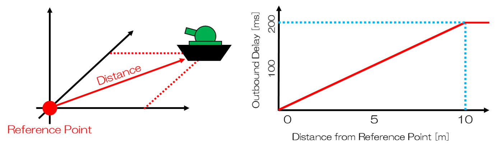

TrafficControl Plugin
=====================

The TrafficControl plugin is a plugin for simulating communication failures (communication delay, bandwidth limitation, packet loss) that can occur when remotely controlling robots. This plugin uses "iproute2", a network configuration tool for Linux, to control communication between Ethernet-connected computers and simulate communication failures.

Here, we will explain the communication failure simulation that applies fixed communication failure effects during simulation based on specified parameters, and the dynamic communication failure simulation that applies communication failure effects dynamically during simulation, divided into the following items in order.

.. contents:: Table of Contents
   :local:

Presetting
----------

The TrafficControl plugin uses the ifb module (virtual communication port) to simulate inbound communication failures.
(In this manual, "inbound" refers to the direction in which the computer running this plugin receives packets, and "outbound" refers to the direction in which the computer running this plugin sends packets.)

.. note:: Virtual communication ports can be configured using the "modprobe" and "ip" commands, but these settings typically require administrator privileges. If administrator privileges have not been granted, please check with the administrator of the computer you are using.

Here, we will explain how to set up virtual communication ports using the example of using two communication ports. (If only one communication port is used, the ifb1 configuration is not necessary.)

First, create the same number of virtual communication ports as the communication ports to control. ::

 $ modprobe ifb numifbs=2
 $ modprobe act_mirred

The commands on lines 1 and 2 load the modules necessary for using the "tc" command (used to apply communication failure effects) with the ifb module.
Here, numifbs=2 on line 1 indicates that two virtual communication ports will be created.

Next, enable the created communication ports. Typically, the generated ifb names are assigned numbers in ascending order starting from 0, such as ifb0, ifb1. Since we are using two communication ports here, we enable ifb0 and ifb1. ::

 $ ip link set dev ifb0 up
 $ ip link set dev ifb1 up

Next, create a directory to store the configuration file. Please create the directory cnoid-conf under /usr/local/share/.
Then, create the configuration file. The configuration file is necessary to associate inbound and outbound communication ports one-to-one. Using any text editor, create a file named "tc.conf" in the cnoid-conf directory you created, referring to the following. Below is an example description for associating eth0 with ifb0 and eth1 with ifb1. ::

 Port,ifb
 eth0,ifb0
 eth1,ifb1

Here, the first line represents the file header. Please be sure to include this file header. The second line onward contains the description for associating communication ports, with the communication port on the left and the associated virtual communication port on the right, separated by commas.
Note that the communication port names described as eth0 and eth1 in the example differ depending on the computer used, so please check them with the "ifconfig" command or similar.

Finally, set permissions for using the tc command. Execute visudo and add the following line. Note that the example below is for when the username is "user", so please change it to your username as appropriate. ::

 user ALL=(ALL:ALL) NOPASSWD: /sbin/tc

Unsetting the Presetting
------------------------

To unset the presetting, execute the following commands with administrator privileges to delete the tc settings and virtual communication ports. ::

 // delete tc setting
 $ tc qdisc del dev eth0 root
 $ tc qdisc del dev eth1 root
 $ tc qdisc del dev eth0 ingress
 $ tc qdisc del dev eth1 ingress
 $ tc qdisc del dev ifb0 root
 $ tc qdisc del dev ifb1 root

 // unload ifb module
 $ rmmod ifb

Finally, manually delete or modify the files and directories created or edited in the presetting.

Introducing TrafficControl Plugin
---------------------------------

When building, please turn ON the following option in the CMake configuration.

* BUILD_TRAFFIC_CONTROL_PLUGIN

How to Set TCSimulatorItem
--------------------------

The communication failure simulation uses TCSimulatorItem.
Communication failure effects are set according to the property settings of TCSimulatorItem. Note that settings cannot be changed during simulation.
Select "TCSimulator" from "File" - "New..." in the main menu to create a TCSimulatorItem. The default name is "TCSimulator". Place this as a child item of the simulator item in the item tree view.

Example of TCSimulatorItem configuration) ::

 [ ] - World
 [/]   + Tank
 [/]   + floor
 [ ]   + AISTSimulator
 [ ]     + TCSimulatorItem

Setting Items of TCSimulator
^^^^^^^^^^^^^^^^^^^^^^^^^^^^

To perform communication failure simulation, you need to set the properties of TCSimulatorItem. The contents of each property are shown below.

.. csv-table::
    :header: "Property", "Unit", "Function"
    :widths: 16, 8, 32

    "EnableTrafficControl", "[-]", "Specifies enable/disable of communication failure effects."
    "Port", "[-]", "Specifies the communication port. Select the port to use from the list."
    "InboundDelay", "[ms]", "Specifies the delay time applied to inbound communication. If 0, it is not set."
    "InboundBandWidth", "[kbit/s]", "Specifies the upper limit of communication speed applied to inbound communication. If 0, it is not set."
    "InboundLoss", "[%]", "Specifies the percentage of packet loss applied to inbound communication. If 0, it is not set."
    "OutboundDelay", "[ms]", "Specifies the delay time applied to outbound communication. If 0, it is not set."
    "OutboundBandWidth", "[kbit/s]", "Specifies the upper limit of communication speed applied to outbound communication. If 0, it is not set."
    "OutboundLoss", "[%]", "Specifies the percentage of packet loss applied to outbound communication. If 0, it is not set."
    "IP Address", "[-]", "Specifies the IP address and subnet mask of the destination computer to which communication failure effects are applied. If you do not specify a destination computer or network, this setting is not necessary. In that case, communication failure effects are applied to all packets passing through the communication port specified in ``Port``. Input example) 192.168.0.1/24"

.. Introducing Dynamic Communication Failure Simulation Plugin
.. --------------------------------------------------------
.. To use the dynamic communication failure simulation plugin, the above communication failure simulation plugin must be introduced.
.. Therefore, after confirming that BUILD_TRAFFIC_CONTROL_PLUGIN is ON in the CMake configuration during build, please turn ON the following option.
.. 
.. * BUILD_DYNAMIC_TRAFFIC_CONTROL_PLUGIN

How to Set DynamicTCSimulatorItem
---------------------------------

The dynamic communication failure simulation uses DynamicTCSimulatorItem and the TCSimulatorItem from the communication failure simulation plugin described above.
Select "DynamicTCSimulator" from "File" - "New..." in the main menu to create a DynamicTCSimulatorItem. The default name is "DynamicTCSimulator". Place this as a child item of the simulator item in the item tree view. If TCSimulatorItem is not registered in the item tree view, please register TCSimulatorItem in the item tree view by referring to the TCSimulatorItem setup method described above.

Example of DynamicTCSimulatorItem configuration) ::

 [ ] - World
 [/]   + Tank
 [/]   + floor
 [ ]   + AISTSimulator
 [ ]     + TCSimulatorItem
 [ ]     + DynamicTCSimulatorItem

When performing dynamic communication failure simulation, set the TCSimulatorItem property "EnableTrafficControl" to "false" and ensure that the "Port" properties of TCSimulatorItem and DynamicTCSimulatorItem match.
During simulation, communication failure effects corresponding to the distance between the target Body model and the reference point are updated at each time step set in the DynamicTCSimulatorItem properties. Note that since the communication failure effects are directly written in the source code, it is also possible to change the degree of communication failure effects.

Setting Items of DynamicTCSimulatorItem
^^^^^^^^^^^^^^^^^^^^^^^^^^^^^^^^^^^^^^^
To perform dynamic communication failure simulation, you need to set the properties of DynamicTCSimulatorItem. The contents of each property are shown below.

.. csv-table::
    :header: "Property", "Unit", "Function"
    :widths: 16, 8, 32

    "Port", "[-]", "Specifies the communication port. Select the port to use from the list."
    "EnableDynamicTrafficControl", "[-]", "Specifies enable/disable of communication failure effects."
    "ReferencePoint", "[m, m, m]", "Specifies the coordinates of the reference point in global coordinates."
    "TargetBody", "[-]", "Specifies the target Body model."
    "TimeStep", "[s]", "Specifies the time interval for updating communication failure effects."

Sample
------

As a sample, DynamicTCSimulatorItem is configured to dynamically apply a maximum communication delay of 200ms within a 10m radius centered at the reference point (0,0,0).

