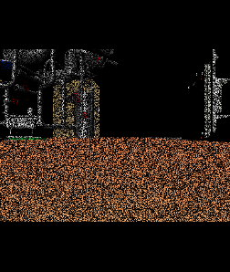

Camera Effect Simulation
========================

.. contents:: Table of Contents
   :local:

.. highlight:: cpp

Camera Effects
--------------

In Choreonoid, the following camera effects (visual effects) can be applied to the 2D image data acquired by a Camera:

* Salt noise
* Pepper noise
* HSV (hue, saturation, value)
* RGB (red, green, blue)
* Gaussian noise
* Barrel distortion
* Block noise

These camera effects simulate degraded 2D image data that is presented to an operator during teleoperation of a robot. This section explains how to simulate these camera effects in Choreonoid.

Camera Effect Configuration
---------------------------

To apply camera effects to the image data of a Camera device,
add the following keys to the Camera node.

.. list-table:: Additional keys for the Camera node
 :widths: 30,100
 :header-rows: 1
 :align: left

 * - Key
   - Description
 * - apply_camera_effect
   - true

 * - salt_amount
   - Total amount of salt noise in the image (0.0 to 1.0). Specify together with salt_chance.
 * - salt_chance
   - Probability of salt noise occurrence (0.0 to 1.0). Specify together with salt_amount.
 * - pepper_amount
   - Total amount of pepper noise in the image (0.0 to 1.0). Specify together with pepper_chance.
 * - pepper_chance
   - Probability of pepper noise occurrence (0.0 to 1.0). Specify together with pepper_amount.
 * - hsv
   - Hue (0.0 to 1.0), saturation (0.0 to 1.0), value (0.0 to 1.0).
 * - rgb
   - R increment (0.0 to 1.0), G increment (0.0 to 1.0), B increment (0.0 to 1.0).
 * - std_dev
   - Standard deviation of Gaussian noise (0.0 to 1.0).
 * - coef_b
   - Coefficient of barrel distortion (-1.0 to 0.0).
 * - coef_d
   - Image magnification (1.0 to 32.0).
 * - mosaic_chance
   - Probability of block noise occurrence (0.0 to 1.0). Specify together with kernel.
 * - kernel
   - Block size (8 to 64). Specify together with mosaic_chance.

Using Camera Effects
--------------------

Camera effects are applied individually to each camera by setting the above keys in the Camera node.

The values of keys set in a Camera node can also be changed dynamically during simulation by accessing the Camera node from a controller or subsimulator.

Below, as an example of dynamically changing camera effects, we introduce a sample in which a controller accesses a camera in a body model and dynamically changes the probability of pepper noise occurrence.

Preparing the Body Model
~~~~~~~~~~~~~~~~~~~~~~~~

First, prepare a body model that has a Camera device as the target. As an example of such a model, we'll use a box camera model below.

In the box camera model, stored under sample/CameraEffect, vision sensors are defined as follows in its model file "box.body":

.. code-block:: yaml

      - &camera
        type: Camera
        name: Nofilter
        translation: [ 0.06, 0, 0 ]
        rotation: [ [ 1, 0, 0, 90 ], [ 0, 1, 0, -90 ] ]
        format: COLOR
        fieldOfView: 62
        nearClipDistance: 0.02
        width: 640
        height: 480
        frameRate: 30
        apply_camera_effect: true
        elements:
          -
            type: Shape
            rotation: [ 1, 0, 0, 90 ]
            geometry: { type: Cylinder, radius: 0.03, height: 0.02 }
            appearance: { material: { diffuseColor: [ 0.2, 0.2, 0.8 ], transparency: 0.5 } }
      - { <<: *camera, name: Salt, salt_amount: 0.3, salt_chance: 1.0 }
      - { <<: *camera, name: Pepper, pepper_amount: 0.3, pepper_chance: 1.0 }
      - { <<: *camera, name: HSV, hsv: [ 0.3, 0.0, 0.0 ] }
      - { <<: *camera, name: RGB, rgb: [ 0.3, 0.0, 0.0 ] }
      - { <<: *camera, name: Barrel, coef_b: -1.0, coef_d: 1.5 }
      - { <<: *camera, name: Mosaic, mosaic_chance: 0.5, kernel: 16 }

Here, multiple cameras are configured using YAML anchors and aliases. Among them, the camera that applies pepper noise is defined as "Pepper", with the total amount of pepper noise in the image set to 0.3 (= 30%) and the probability of pepper noise occurrence set to 1.0 (= 100%).

Without using YAML anchors and aliases, the same configuration looks like this:

.. code-block:: yaml

      -
        type: Camera
        name: Pepper
        translation: [ 0.06, 0, 0 ]
        rotation: [ [ 1, 0, 0, 90 ], [ 0, 1, 0, -90 ] ]
        format: COLOR
        fieldOfView: 62
        nearClipDistance: 0.02
        width: 640
        height: 480
        frameRate: 30
        apply_camera_effect: true
        pepper_amount: 0.3
        pepper_chance: 1.0
        elements:
          -
            type: Shape
            rotation: [ 1, 0, 0, 90 ]
            geometry: { type: Cylinder, radius: 0.03, height: 0.02 }
            appearance: { material: { diffuseColor: [ 0.2, 0.2, 0.8 ], transparency: 0.5 } }

Creating a Simulation Project
~~~~~~~~~~~~~~~~~~~~~~~~~~~~~

Next, let's create a simulation project for this model.

Arrange the items as follows.

| + World
|   + Box
|     + SensorVisualizer
|   + Labo1
|   + AISTSimulator
|     + **GLVisionSimulator**

Once each item is placed, expand SensorVisualizer in the item tree view and check its child item "Pepper".

Then select "GLVisionSimulator" in the item tree view and set "Record vision data" to "True" in the property view.

Sample Controller
~~~~~~~~~~~~~~~~~

As a sample controller that accesses camera images, we'll use "SampleCameraEffectController". This controller accesses the Camera device "Pepper" owned by the body model, and increases or decreases the probability of pepper noise applied to its image data.

.. note:: The source for this controller is "sample/CameraEffect/SampleCameraEffectController.cpp". To build this sample, turn on **BUILD_GL_CAMERA_EFFECT_PLUGIN**.

Add this controller to the project. Similar to the examples in :ref:`simulation-create-controller-item` and :ref:`simulation-set-controller-to-controller-item`, generate a "Simple Controller" item and arrange it as follows:

| + World
|   + Box
|     + SensorVisualizer
|     + **CameraEffectController**
|   + Labo1
|   + AISTSimulator
|     + GLVisionSimulator

The name of the added controller item is "CameraEffectController" here.

Next, write "SampleCameraEffectController" in the "Controller" property of the added controller item to set the controller body.

Note that this sample project is stored as "CameraEffect.cnoid" under sample/CameraEffect.

Running the Simulation
~~~~~~~~~~~~~~~~~~~~~~

Start the simulation in the above state. Then, pressing the A button on a gamepad connected to the PC decreases the probability of pepper noise occurrence, and pressing the B button increases it.

Examples of each are shown below.

.. image:: images/pepper-low.png

This shows that camera effect simulation is working and that the values of keys set in the Camera node can be changed dynamically from a controller during simulation.

Sample Controller Implementation Details
----------------------------------------

The source code for CameraEffectController is shown below: ::

 #include <cnoid/SimpleController>
 #include <cnoid/Camera>
 #include <cnoid/Joystick>

 using namespace cnoid;

 class SampleCameraEffectController : public SimpleController
 {
     Camera* camera;
     Joystick joystick;

 public:
     virtual bool initialize(SimpleControllerIO* io) override
     {
         camera = io->body()->findDevice<Camera>("Pepper");
         io->enableInput(camera);
         joystick.makeReady();
         return true;
     }

     virtual bool control() override
     {
         joystick.readCurrentState();

         if(camera) {
             bool stateChanged = false;
             double pepper_amount = camera->info()->get("pepper_amount", 0.0);
             if(joystick.getButtonState(Joystick::A_BUTTON)) {
                 camera->info()->write("pepper_amount", std::max(0.0, pepper_amount - 0.001));
                 stateChanged = true;
             } else if(joystick.getButtonState(Joystick::B_BUTTON)) {
                 camera->info()->write("pepper_amount", std::min(1.0, pepper_amount + 0.001));
                 stateChanged = true;
             }
             if(stateChanged) {
                 camera->notifyInfoChange();
             }
         }

         return true;
     }
 };

 CNOID_IMPLEMENT_SIMPLE_CONTROLLER_FACTORY(SampleCameraEffectController)

For using Camera devices, ::

 #include <cnoid/Camera>

includes the Camera class definition, and for ::

 Camera* camera;

the statement ::

 camera = io->body()->findDevice<Camera>("Pepper");

obtains the Camera device "Pepper" owned by the body model.

For the Camera device obtained this way, in the initialize function ::

 io->enableInput(camera);

enables input from the camera.

In the control function ::

 camera->info()->write("pepper_amount", std::max(0.0, pepper_amount - 0.001));

overwrites the value of the "pepper_amount" key, which is the probability of pepper noise occurrence applied to the camera.
