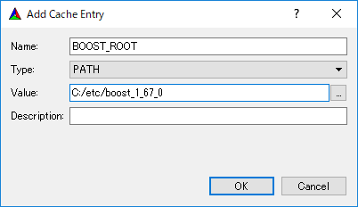
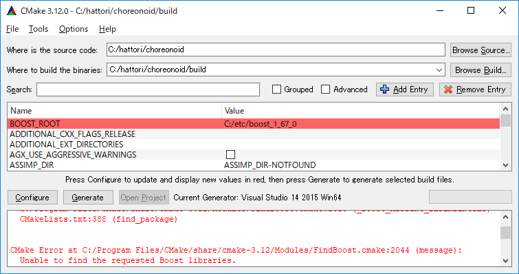

CMakeとVisual StudioのGUIを用いたビルド方法
===========================================

.. contents:: 目次
   :local:

ここではWindows上でCMakeとVisual StudioのGUIを用いてChoreonoidをビルドする方法について解説します。

.. _build-windows-cmake:

CMakeによるビルド設定
---------------------

まず、スタートメニューもしくはデスクトップアイコンからCMakeを起動します。すると下記のようなCMakeのウィンドウが表示されます。

.. figure:: images/cmake0.png
   :width: 600px

次に、上図の赤枠①で示された **where is the source code** の右側の入力ボックスにコレオノイドのソースディレクトリを入力します。 **Browse Source...** をクリックすると、ディレクトリ選択ダイアログが開くので、そこから選択してもいいです。次に **where is build the binaries** の右側の入力ボックスにコレオノイドをビルドするディレクトリを入力します。ビルドするディレクトリはソースコードと同じでも構いませんが、わかりにくくなるかもしれませんので、ソースディレクトリの下にbuildというディレクトリを作成して、そこを入力することにします。入力したら、赤枠②の "Configure" を押します。

ビルドするディレクトリが予め作成されていない場合、ここで作成するか否かの確認のダイアログが表示されます。

次に、下図のようなダイアログが開きます。赤枠のプルダウンメニューから、コンパイラを選びます。

.. figure:: images/cmake1.png

例えば Visual C++ 2022を使用する場合は

* **Visual Studio 17 2022 Win64**

を選択します。

この項目の下に "Optional platform for generator" という項目があり、ここでアーキテクチャを選択できるようになっています。デフォルトではx64が選択されており、そのままで構いません。

選択が完了したら **Finish** ボタンを押します。すると、CMakeのConfigureが進行し、コンパイラやライブラリ等の検出が行われます。

.. note:: この際に "The C compiler identification is unkown", "The CXX compiler identification is unkown" というメッセージが表示されるかもしれません。この場合は、Visual C++ のコンパイラが正しく検出されていません。原因は不明ですが、開発者の環境のひとつでこの症状が発生したことがあります。この場合、これ以降の処理を正しく進めることができません。

 これについては、CMakeを管理者権限で実行したところコンパイラも検出されるようになり、その後の処理も進めることができるようになりました。これを行うには、CMakeのアイコンを右クリックすると出るメニューで「管理者として実行」を選択するなどします。もしこの不具合が発生した場合は、この対処法を試してみてください。
 
.. note:: Windows環境に、pkg-config.exe というプログラムがインストールされている場合、この作業中にエラーが起きることがあります。そのような場合は、pkg-config.exeをアンインストールして頂けますようお願いいたします。

ライブラリのインストールで、デフォルトのディレクトリを選択している場合、自動的にライブラリが検出され、次のように最後の行に **Configuring done** と表示されると思います。

.. figure:: images/cmake2.png

（他のディレクトリにインストールしている場合は、エラーが表示されると思います。その場合の設定は、後で説明します。）

次にインストール先を設定します。 下図のように中央の表示をスクロールして **CMAKE_INSTALL_PREFIX** という項目を表示します。

.. figure:: images/cmake3.png

デフォルトでは "c:\\Program Files\\Choreonoid" になっています。しかし、Windowsでは "c:\\Program Files" 以下は、管理者以外はアクセス不可になっているようですので、インストール時に失敗する可能性があります。管理者権限で実行してそこにインストールしてもよいのですが、他のディレクトリにインストールした方が扱いやすい場合もあります。
その場合は、 **CMAKE_INSTALL_PREFIX** に適当な、例えば "c:\\choreonoid\\program"といったディレクトリを指定してください。

設定を終えたら、**Configure** ボタンを押して、再度 **Configuring done** と表示されることを確認してください。

.. figure:: images/cmake4.png

次にVisual Studio のプロジェクトファイルを生成するために、"Generate" を押します。"Generate"のボタンが押せるようになっていない場合は、再度"Configure"を押します。

ソリューションファイルの生成が終了すれば、メッセージ出力部に “Generating done” と表示されます。

次にエラー表示が出た場合や、他の設定を変更したい場合の手順について説明します。ここまで、エラーが表示されなかった方は、 :ref:`build-windows-visualstudio` に進まれた後に読んでくださっても結構です。

ライブラリの検出が自動で出来なかった場合、図のようなエラーダイアログが表示されます。

.. figure:: images/cmake5.png

**OK** を押してダイアログを消します。下の段のメッセージが表示されているウィンドウを上からスクロールして、Errorが表示されているところをみつけます。Warningは
無視してください。下の方に表示されているエラーは上のエラーが原因でおきていることがあるので、上から探してください。

下図では、Boostライブラリがみつからなかったエラーが出ています。

.. figure:: images/cmake6.png

上の設定項目にはBOOST_ROOTがありません。この場合は、赤丸で示した **Add Entry** ボタンを押します。ダイアログが表示されるので下図のように入力します。

**Value** の欄にBoostライブラリのインストールディレクトリを指定します。 **OK** を押してダイアログを閉じ、下図のようにBOOST_ROOTが追加されていることを確認してください。

**Configure** ボタンを押して下さい。

QT5に関するエラーが表示されたら、 **Qt5Core_DIR** に Qt5CoreConfig.cmake というファイルの保存場所を入力してください。このファイルは **"Qtのインストール先)/バージョン番号/Visual Studioのバージョン識別子/lib/cmake/Qt5Core"** といったディレクトリにあります。

QT5の他のライブラリについてもエラーが表示されているかと思いますので、同じように入力してください。警告（Warning）は無視して大丈夫です。

後は、必要に応じてビルドに関する他の様々なオプションを設定することが可能となっています。
例えば、コレオノイドが備えているいくつかの機能はデフォルトではオフになっていますが、
BUILD_で始まるオプションを、必要に応じてそれらをオンにすることができます。

必要なライブラリのインストール先が全て特定され、エラーが出なくなるまで、上記と同様の設定を繰り返してください。

必要な設定を終えたら、"Generate" を押して下さい。

.. note:: 他のライブラリに関しても、CMakeのバージョンやインストールしたライブラリのバージョン、インストール箇所などによっては、検出できずに同様のエラーが出ることがあります。また、以下で説明するオプションの選択によっても、エラーが出る場合があります。エラーがでる順番も、インストールの状況によってかわります。この場合、上記と同様に、エラー箇所を探し、手動でインストール先を入力するようにしてください。

.. note:: 設定した内容は、 **Where to build the binaries** で指定した箇所に、 **CMakeCache.txt** というファイルで保存されています。設定を初めからやり直したい場合は、このファイルを削除してください。CMakeのメニューから **File** - **Delete Cache** としても削除されます。

.. note:: Gitと同様に、CMakeに関してもVisual Studioの最近のバージョンではIDE上で操作を行えるようになっているようです。こちらも興味のある方はVisual Studioのマニュアルをご参照ください。

.. _build-windows-visualstudio:

Visual Studio の起動とソリューションの読み込み
----------------------------------------------

次はコレオノイドのビルドを行います。 

これまでの操作で、**CMake** の **where is build the binaries** で指定した場所に Visual Studio のソリューションファイル **Choreonoid.sln** が生成されているはずです。これをダブルクリックして下さい。

Visual Studio が起動し、ソリューションファイルがオープンされていると思います。

もし Visual Studio が起動しない場合には、インストール時に何かあったかもしれませんので、Visual Studio を再インストールするか、関連付けを修正してみてください。あるいは、まず Visual Studio を起動し、その後 Visual Studio のメニューからソリューションファイルを読み込めばうまくいくかもしれません。

Visual Studio 2017と2019でのビルド操作は同じですので、以下の説明では、どちらのバージョンかを特定していません。従いまして、画面デザインなどは異なる場合があります。

コンパイル
----------

ソリューションの読み込みが終われば、下図のような画面になります。
ここで、赤枠の部分を **"Release"** に変更し、 **x64** と表示されていることを確認して下さい。
なお、"Debug"にすると、デバッグ可能なバイナリを生成することができます。ただしこれは"Relese"でコンパイルしたものと比べて圧倒的に遅くなってしまうので、デバッグが必要な時以外は、"Release"でコンパイルしたバイナリを使うようにします。

.. figure:: images/VS1.png

次に、コレオノイドのビルドを実行します。メニューのビルドをクリックすると下図のようなプルダウンメニューが出てきますので、赤枠にあるように "ソリューションのビルド(B)" を選択して下さい。
すると、コレオノイドのビルドが開始されます。
下部のメッセージウィンドウで最後に、 **“0 失敗”** と出てくればコンパイルは終了です。

.. figure:: images/VS2.png

.. _build-windows-install:

インストール
------------

コレオノイドのビルドが終了したら、最後にインストールを実行します。
インストールは、下図にあるように、上段左の "ソリューションエクスプローラ" で "INSTALL" のプロジェクトの部分を右クリクするとメニューが表示されます。このメニューの最上部に "ビルド(U)" がありますので(下図の赤枠部分です)、それを選択して下さい。正常に終了すれば、CMakeの時の **CMAKE_INSTALL_PREFIX** で指定されたディレクトリの下に、コレオノイドのバイナリがコピーされます。CMakeによるソリューションファイル生成時に **INSTALL_DEPENDENCIES** の項目にチェックを入れておけば、依存ライブラリのバイナリもコピーされます。

.. figure:: images/VS3.png

以上でコレオノイド のインストールは終了です。
