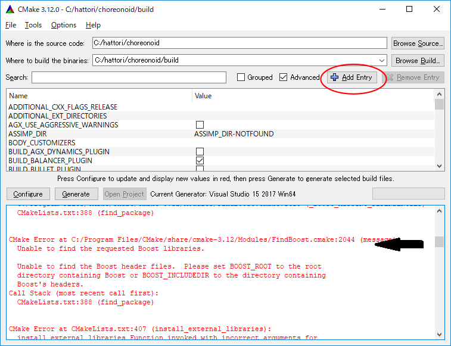
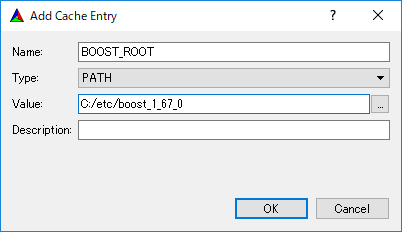
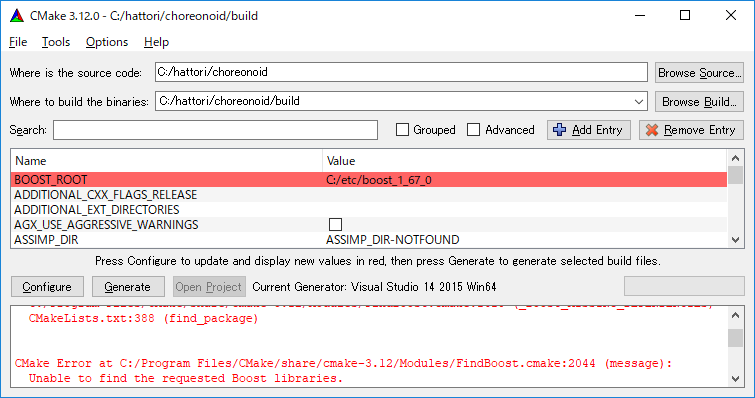

ソースコードからのビルドとインストール (Windows編)
==================================================

.. sectionauthor:: 中岡 慎一郎 <s.nakaoka@aist.go.jp>

.. contents:: 目次
   :local:

準備
----

コレオノイドをソースコードからビルドしてインストールするには、ビルドに必要なツールとライブラリを予め準備する必要があります。

* 必要なツール

  * Visual Studio (C++) 2019
    
  * `CMake <http://www.cmake.org/>`_ (3.21.3)

- 必要なライブラリ

  * `Boost <http://www.boost.org/>`_ (1.77.0)
  * `Qt <http://www.qt.io/download-open-source/>`_ (5.15.2) ※ 5.10以上必須

まず、上記のツールとライブラリをインストールして下さい。各ライブラリの括弧内の数値は、当方で利用し動作を確認したバージョンで、2021年9月時点での目安となるものです。最低のバージョンを指定しているライブラリ以外は、これらより古いバージョンのものに必ずしも対応しないわけではありませんし、一方でこれらよりバージョンが上のものでもビルドに失敗することもあり得ます。（正確に対応バージョンを特定するのは困難ですので、このような記述をご容赦ください。）一般的にはバージョン番号の２番目の値までが同じであれば、同様に使えると考えてよろしいかと思います。

各ツール・ライブラリのインストールに関する補足を以下に述べます。インストールは管理者権限を持つアカウントで行ってください。また、下図のようなユーザアカウントコントロールが表示された場合は、 **はい** をクリックして先に進めてください。

.. figure:: images/userAccount.png

.. note:: 以前のバージョンでは別途 `Eigenライブラリ <http://eigen.tuxfamily.org/>`_ のインストールも必要でしたが、最新の開発版（次期バージョン1.8.0）では、Choreonoidのソースに付属のものをデフォルトで使用するようになりました。その場合Eigenを別途インストールする必要はありません。

.. _install_visualc++:

Visual C++
~~~~~~~~~~

ChoreonoidをコンパイルするためのC++コンパイラとして、Microsoft製のVisual C++ (Visual Studioに含まれるC++コンパイラ）を用いることができます。

Visual Studioにはいくつかのエディションがありますが、 `無料版のVisual Studio Community <https://visualstudio.microsoft.com/ja/vs/community/>`_ をダウンロードして使用することも可能です。現在の最新版は2019であり、それを使用してChoreonoidをビルドして実行できることを確認しています。

.. 2017については、 `以前のVisual Studio ソフトウェアのダウンロード <https://visualstudio.microsoft.com/ja/vs/older-downloads/>`_ からダウンロードできます。

ダウンロードしたインストーラを起動すると、インストールする項目を選択する画面が表示されます。この中で、 **「C++によるデスクトップ開発」** にチェックを入れるようにしてください。インストールが完了するとWindowsを再起動するように要求されますので、それに従って再起動を行ってください。

CMake
~~~~~

ビルド方法を記述するためのツールです。Choreonoidのビルド方法は本ツールの形式で記述されており、WindowsにおいてはそこからVisual Studio のプロジェクトファイルを生成することが可能です。 

CMakeは `CMakeのダウンロードページ <https://cmake.org/download/>`_ より取得できます。各プラットフォーム（OS）用のインストーラが用意されており、Windowsで使用する場合は **"Windows x64 Installer"** を使用します。

.. figure:: images/CMakeInstall1.png

該当する **cmake-x.xx.x-windows-x86_64.msi** をクリックしてダウンロードし、これを実行してインストールを行ってください。表示されるメッセージに従って進め、

.. figure:: images/CMakeInstall2.png

図のような画面になったら、 **Add CMake to the system PATH for all users** を選択してください。

他の設定はデフォルトのままで大丈夫です。

Boost
~~~~~

C++の便利なライブラリ集です。ダウンロードは `Boost Downloads <http://www.boost.org/users/download/>`_ のページから行うことができます。

ソースをダウンロードした場合はコンパイルが必要となります。あらかじめWindows用にコンパイルされたバイナリを入れてくれるインストーラがありますので、そちらを使うのが簡単です。上記ページに `Prebuilt windows binaries <https://sourceforge.net/projects/boost/files/boost-binaries/>`_ というリンクがあるので、そちらを開いてください。

バージョンは基本的には新しいものを使用しますが、新しいバージョンでChoreonoidのビルドに失敗する可能性もあります。参考までに、2021年9月時点での（ベータ版ではない）最新版は 1.77.0 で、このバージョンでChoreonoidをビルド・実行できることを確認しています。

ダウンロードするバージョンのフォルダをクリックして開き、中にある

* **boost_1_xx_0-msvc-14.2-64.exe**

といったファイルをダウンロードしてください。ここで "msvc-14.2" が Visual Studio 2019 に該当し、最後の64は64ビット版であることを示しています。上記と異なるバージョンを使用する場合も、これらの表記が同じものを使用するようにしてください。

.. Visual C++ 2017の場合は、

.. * **boost_1_75_0-msvc-14.1-64.ext**
 
.. といった名称のファイルを使用します。ここで "msvc-14.1" が Visual C++ 2017に対応しています。

ダウンロードしたファイルを実行することで、インストールを行うことができます。インストール先はデフォルトでは **"C:\\local\\boost_1_xx_0"** といったフォルダになります。これを変更しなければ、後ほど行うCMakeの設定においてBoostのディレクトリが自動で検出されます。何らかの事情によりインストール先を変更する場合は、CMakeの設定においてインストール先を手動で指定する必要がありますので、ご注意ください。
 
Qt
~~

QtはGUIを含む総合的なフレームワークライブラリで、ChoreonoidでもGUIのベースとして使っています。

Qtのインストーラは `Qtのダウンロードページ <https://www.qt.io/download>`_ にて取得できます。無償で使用可能なオープンソース版がありますので、特に理由がなければそれを使うようにします。 **"Download for open source users"** を選択すると `Download Qt Open Source <https://www.qt.io/download-open-source>`_ のページが開きますので、そこで **"Download the Qt Online Installer"** をクリックし、次に表示されるページの **"Download"** からインストーラのダウンロードを行います。（このダウンロードまでの過程が多少異なったものとなっている可能性もありますが、その場合でも同様の操作でダウンロードするようにしてください。）

ダウンロードしたファイルを実行すると、Qtアカウントによるログインを求められます。アカウントは "Sign up" で作成できますので、インストールを進めるためにアカウントの作成とログインを行ってください。その後もインストーラの指示に従ってインストールを進めます。

インストール先はデフォルトでは "C:\\Qt" といったフォルダになります。これを変更しなければ、CMakeが自動的にQtを検出するようになります。変更する場合は、フォルダを手動で指定する必要があるので覚えておいてください。

インストールするQtのバージョンを選択する画面では、デフォルトの **"Custom installation"** が選択された状態で次に進みます。

次にインストールするコンポーネントを選択する画面になります。ここでまずQtのバージョンを選択しますが、特に理由が無ければバージョン5の最新版を使用するようにします。2021年4月時点ではバージョン5.15.2がこれに該当しており、このバージョンでChoreonoidをビルド・実行できることを確認しています。

ここではバージョンと共にバイナリのタイプも選択します。このためバージョン番号のツリーを展開して、その中の **"MSVC 2019 64bit"** にチェックを入れるようにします。これ以外のコンポーネントについては、特に理由がなければ含めなくてOKです。

また、**"Developer and Designer Tools"** という項目があり、そのツリーを展開するとCMakeの項目があってそこにもチェックが付いているようです。CMakeについては上述の手順で独立してインストールしており、それとの競合を避けるためQtのインストールでは含めないようにした方がよいかもしれません。その場合CMakeに付いているチェックを外しておきます。

その後もインストーラの指示に従って進めて、インストールを完了させてください。

.. 途中、下図のようなコンポーネントの選択画面で、インストールするライブラリを選択します。

.. figure images/QtInstall3.png

.. 最新バージョンの **5.13.0** を選択します。

.. さらにその中から使用するVisual C++のバージョンにあったものを選択します。

.. 現時点では Visual C++ 2019用のものは無いようなのですが、試したところ2019でも2017用のものが使えるようです。Visual C++ 2017, 2019いずれの場合も **MSVC2017 64bit** を選択してください。

.. 後はインストーラの指示に従って進めます。

ソースコードの取得
------------------

リリース版
~~~~~~~~~~

Choreonoidのリリース版のソースコードは、 `ダウンロード <http://choreonoid.org/ja/download.html>`_ のページからダウンロードすることが可能です。このページにある「ソースパッケージ」の該当するバージョンをダウンロードしてください。ファイルはZIPファイルになっていますので、エクスプローラ等を用いて適当なディレクトリに展開してください。

展開すると choreonoid-1.7.0 といったディレクトリが生成されます。このディレクトリの中にソースコード一式が格納されており、本マニュアルではこれを今後 **「ソースディレクトリ」** と呼ぶことにします。

開発版
~~~~~~

Choreonoid開発版も利用可能です。これは `git <http://git-scm.com/>`_ リポジトリとして管理されており、 `github <https://github.com/>`_ の以下のアドレスにて公開されています。

- https://github.com/choreonoid/choreonoid

ここからソースコードを取得する形態として以下の2つがあります。

* Gitリポジトリとして取得する
* Zipファイルで取得する

Gitリポジトリとして取得する
^^^^^^^^^^^^^^^^^^^^^^^^^^^

Gitリポジトリは、コード改変の履歴を含む形態のソースコード管理方式です。これには様々な利点がありますが、Choreonoidを利用するだけの場合でも、最新のソースコードに更新しやすくなるという利点があります。

Gitリポジトリの取得は通常gitコマンドを用いて行います。このコマンドのWindows版については Git for Windows というパッケージにまとめられています。

これを利用する場合は、 `Git for Windows 公式サイト <https://gitforwindows.org/>`_ からファイルをダウンロードしてインストールを行ってください。インストール時の設定はデフォルトのままでよいと思いますが、途中下図の様に表示されたら **"Use Git from the Windows Command Prompt"** を選ぶと、コマンドプロンプトからこのコマンドを実行するためのPATHを通してくれます。また **"Configuring the line ending vonversions"** については、Choreonoidのソースコードを編集して改良等を行う場合は、使用する開発環境も踏まえて、適切なものを選択するようにしてください。

.. figure:: images/GitSetup.png

インストールが終了したら、コマンドプロンプトを開いて、choreonoidのソースを保存したいディレクトリに移動して、以下のコマンドを実行します。::

 git clone https://github.com/choreonoid/choreonoid.git

これによってリポジトリを格納した "choreonoid" というディレクトリが生成されます。以降はこのディレクトリ内で ::

 git pull

などとすることにより、その時点での最新のソースコードに更新できます。

以上でソースコードの取得はできますが、gitの詳しい使用方法についてはgitのマニュアルや解説記事を参照してください。

.. note:: Visual Studioの最近のバージョンではGit関連の操作をIDE上で統合的に行えるようになっています。この機能に興味のある方はVisual Studioのマニュアルをご参照ください。

Zipファイルで取得する
^^^^^^^^^^^^^^^^^^^^^

ウェブブラウザを使用して `Choreonoidのリポジトリ <https://github.com/choreonoid/choreonoid/>`_ を開き、赤四角で示した緑の **Clone or download** ボタンをクリックすると、次のように表示されます。

.. figure:: images/downloadZip.png
   :width: 600px

赤丸で示した、青の **Download ZIP** をクリックすると、最新の内容がZip形式でダウンロードできます。ダウンロードしたファイルをソースを置くディレクトリに展開します。
 
この方法は最初の取得に関しては簡単ですが、 ソースコードの更新にあたっては毎回Zipファイルをダウンロードして展開しなおす必要があります。Gitリポジトリを利用する場合は上記のように git pull コマンドだけで更新を行うことができますので、継続的に利用する場合はGitリポジトリを使用する方法がおすすめです。

.. _build-windows-cmake:

CMakeによるビルド設定
---------------------

まず、スタートメニューからCMake(cmake-gui)を起動します。すると下記のようなダイアログが表示されます。

.. figure:: images/cmake0.png
   :width: 600px

次に、上図の赤枠①で示された **where is the source code** の右側の入力ボックスにコレオノイドのソースディレクトリを入力します。 **Browse Source...** をクリックすると、ディレクトリ選択ダイアログが開くので、そこから選択してもいいです。次に **where is build the binaries** の右側の入力ボックスにコレオノイドをビルドするディレクトリを入力します。ビルドするディレクトリはソースコードと同じでも構いませんが、わかりにくくなるかもしれませんので、ソースディレクトリの下にbuildというディレクトリを作成して、そこを入力することにします。入力したら、赤枠②の "Configure" を押します。

ビルドするディレクトリが予め作成されていない場合、ここで作成するか否かの確認のダイアログが表示されます。

次に、下図のようなダイアログが開きます。赤枠のプルダウンメニューから、コンパイラを選びます。

.. figure:: images/cmake1.png

Visual C++ 2019を使用する場合は

* **Visual Studio 16 2019 Win64**

を選択します。

この項目の下に "Optional platform for generator" という項目があり、ここでアーキテクチャを選択できるようになっています。デフォルトではx64が選択されており、そのままで構いません。

選択が完了したら **Finish** ボタンを押します。すると、CMakeのConfigureが進行し、コンパイラやライブラリ等の検出が行われます。

.. note:: この際に "The C compiler identification is unkown", "The CXX compiler identification is unkown" というメッセージが表示されるかもしれません。この場合は、Visual C++ のコンパイラが正しく検出されていません。原因は不明ですが、開発者の環境のひとつでこの症状が発生したことがあります。この場合、これ以降の処理を正しく進めることができません。

 これについては、CMakeを管理者権限で実行したところコンパイラも検出されるようになり、その後の処理も進めることができるようになりました。これを行うには、CMakeのアイコンを右クリックすると出るメニューで「管理者として実行」を選択するなどします。もしこの不具合が発生した場合は、この対処法を試してみてください。
 
.. note:: Windows環境に、pkg-config.exe というプログラムがインストールされている場合、この作業中にエラーが起きることがあります。そのような場合は、pkg-config.exeをアンインストールして頂けますようお願いいたします。

ライブラリのインストールで、デフォルトのディレクトリを選択している場合、自動的にライブラリが検出され、次のように最後の行に **Configuring done** と表示されると思います。

.. figure:: images/cmake2.png

（他のディレクトリにインストールしている場合は、エラーが表示されると思います。その場合の設定は、後で説明します。）

次にインストール先を設定します。 下図のように中央の表示をスクロールして **CMAKE_INSTALL_PREFIX** という項目を表示します。

.. figure:: images/cmake3.png

デフォルトでは "c:\\Program Files\\Choreonoid" になっています。しかし、Windowsでは "c:\\Program Files" 以下は、管理者以外はアクセス不可になっているようですので、インストール時に失敗する可能性があります。管理者権限で実行してそこにインストールしてもよいのですが、他のディレクトリにインストールした方が扱いやすい場合もあります。
その場合は、 **CMAKE_INSTALL_PREFIX** に適当な、例えば "c:\\choreonoid\\program"といったディレクトリを指定してください。

設定を終えたら、**Configure** ボタンを押して、再度 **Configuring done** と表示されることを確認してください。

.. figure:: images/cmake4.png

次にVisual Studio のプロジェクトファイルを生成するために、"Generate" を押します。"Generate"のボタンが押せるようになっていない場合は、再度"Configure"を押します。

ソリューションファイルの生成が終了すれば、メッセージ出力部に “Generating done” と表示されます。

次にエラー表示が出た場合や、他の設定を変更したい場合の手順について説明します。ここまで、エラーが表示されなかった方は、 :ref:`build-windows-visualstudio` に進まれた後に読んでくださっても結構です。

ライブラリの検出が自動で出来なかった場合、図のようなエラーダイアログが表示されます。

.. figure:: images/cmake5.png

**OK** を押してダイアログを消します。下の段のメッセージが表示されているウィンドウを上からスクロールして、Errorが表示されているところをみつけます。Warningは
無視してください。下の方に表示されているエラーは上のエラーが原因でおきていることがあるので、上から探してください。

下図では、Boostライブラリがみつからなかったエラーが出ています。

上の設定項目にはBOOST_ROOTがありません。この場合は、赤丸で示した **Add Entry** ボタンを押します。ダイアログが表示されるので下図のように入力します。

**Value** の欄にBoostライブラリのインストールディレクトリを指定します。 **OK** を押してダイアログを閉じ、下図のようにBOOST_ROOTが追加されていることを確認してください。

**Configure** ボタンを押して下さい。

QT5に関するエラーが表示されたら、 **Qt5Core_DIR** に Qt5CoreConfig.cmake というファイルの保存場所（おそらく(Qtのインストール先)/5.11/msvc201x_64/lib/cmake/Qt5Coreにあります。）を入力してください。QT5の他のライブラリについてもエラーが表示されているかと思いますので、同じように入力してください。警告（Warning）は無視して大丈夫です。

後は、必要に応じてビルドに関する他の様々なオプションを設定することが可能となっています。
例えば、コレオノイドが備えているいくつかの機能はデフォルトではオフになっていますが、
BUILD_で始まるオプションを、必要に応じてそれらをオンにすることができます。

必要なライブラリのインストール先が全て特定され、エラーが出なくなるまで、上記と同様の設定を繰り返してください。

必要な設定を終えたら、"Generate" を押して下さい。

.. note:: 他のライブラリに関しても、CMakeのバージョンやインストールしたライブラリのバージョン、インストール箇所などによっては、検出できずに同様のエラーが出ることがあります。また、以下で説明するオプションの選択によっても、エラーが出る場合があります。エラーがでる順番も、インストールの状況によってかわります。この場合、上記と同様に、エラー箇所を探し、手動でインストール先を入力するようにしてください。

.. note:: 設定した内容は、 **Where to build the binaries** で指定した箇所に、 **CMakeCache.txt** というファイルで保存されています。設定を初めからやり直したい場合は、このファイルを削除してください。CMakeのメニューから **File** - **Delete Cache** としても削除されます。

.. note:: Gitと同様に、CMakeに関してもVisual Studioの最近のバージョンではIDE上で操作を行えるようになっているようです。こちらも興味のある方はVisual Studioのマニュアルをご参照ください。

.. _build-windows-visualstudio:

Visual Studio の起動とソリューションの読み込み
----------------------------------------------

次はコレオノイドのビルドを行います。 

これまでの操作で、**CMake** の **where is build the binaries** で指定した場所に Visual Studio のソリューションファイル **Choreonoid.sln** が生成されているはずです。これをダブルクリックして下さい。

Visual Studio が起動し、ソリューションファイルがオープンされていると思います。

もし Visual Studio が起動しない場合には、インストール時に何かあったかもしれませんので、Visual Studio を再インストールするか、関連付けを修正してみてください。あるいは、まず Visual Studio を起動し、その後 Visual Studio のメニューからソリューションファイルを読み込めばうまくいくかもしれません。

Visual Studio 2017と2019でのビルド操作は同じですので、以下の説明では、どちらのバージョンかを特定していません。従いまして、画面デザインなどは異なる場合があります。

コンパイル
----------

ソリューションの読み込みが終われば、下図のような画面になります。
ここで、赤枠の部分を **"Release"** に変更し、 **x64** と表示されていることを確認して下さい。
なお、"Debug"にすると、デバッグ可能なバイナリを生成することができます。ただしこれは"Relese"でコンパイルしたものと比べて圧倒的に遅くなってしまうので、デバッグが必要な時以外は、"Release"でコンパイルしたバイナリを使うようにします。

.. figure:: images/VS1.png

次に、コレオノイドのビルドを実行します。メニューのビルドをクリックすると下図のようなプルダウンメニューが出てきますので、赤枠にあるように "ソリューションのビルド(B)" を選択して下さい。
すると、コレオノイドのビルドが開始されます。
下部のメッセージウィンドウで最後に、 **“0 失敗”** と出てくればコンパイルは終了です。

.. figure:: images/VS2.png

.. _build-windows-install:

インストール
------------

コレオノイドのビルドが終了したら、最後にインストールを実行します。
インストールは、下図にあるように、上段左の "ソリューションエクスプローラ" で "INSTALL" のプロジェクトの部分を右クリクするとメニューが表示されます。このメニューの最上部に "ビルド(U)" がありますので(下図の赤枠部分です)、それを選択して下さい。正常に終了すれば、CMakeの時の **CMAKE_INSTALL_PREFIX** で指定されたディレクトリの下に、コレオノイドのバイナリがコピーされます。CMakeによるソリューションファイル生成時に **INSTALL_DEPENDENCIES** の項目にチェックを入れておけば、依存ライブラリのバイナリもコピーされます。

.. figure:: images/VS3.png

以上でコレオノイド のインストールは終了です。

インストール先の **bin** ディレクトリにある **choreonoid.exe** をダブルクリックすることで、コレオノイドが起動します。

.. _build-windows-options:

オプション機能のビルド
----------------------

コレオノイドでは、上記手順のデフォルト状態で有効になるもの以外にも、いくつかのモジュールやプラグイン、サンプル等があります。それらは、CMakeの設定で有効にすることで、ビルドすることができます。
ここではそれらオプション機能のうちいくつかのビルドについて述べます。
:doc:`options` にて他のオプションについてもまとめてありますので、そちらもご参照ください。

各プラグインが使用しているライブラリのインストール方法も簡単に説明していますが、ライブラリのバージョンアップなどにより大きく変更されている場合もあります。
また、開発元のホームページが更新され、リンク先が変更されている場合もあります。
そのような場合は、ライブラリ名、「インストール」、等をキーワードにしてネット検索して頂くと、新しい情報を見つけることができるかと思います。

.. note:: CMakeでオプション機能の設定を行った上で **Configure**, **Generate** ボタンを押すとソリューションファイルが更新されます。このファイルを用いてVisual Studioでコンパイル、インストールを行うことでオプションのプラグインが生成されます。CMakeでオプションの変更を行った後は、必ずコンパイル、インストールの作業を行ってください。

Assimpプラグイン
~~~~~~~~~~~~~~~~

様々な形式の３次元モデルデータを読み込むためのライブラリ `Open Asset Import Library (Assimp) <https://www.assimp.org/>`_  をコレオノイドで使用するためのプラグインです。
このプラグインを利用するためには、Assimpライブラリをソースからビルドしてインストールしておく必要があります。

まずAssimp公式サイトの `Downloads <https://www.assimp.org/>`_ のページから、ソースコードをダウンロードします。
2021年9月現在の最新版は5.0.1で、このバージョンでの動作確認ができています。
ソースコード一式をまとめたzipアーカイブが提供されていますので、そちらをダウンロードして展開します。

Choreonoidのビルドと同様に、AssimpのビルドにはCMakeを利用します。Choreonoidのビルドと同様にCMakeを操作し、Visual Studio のプロジェクトファイルを生成して、ビルドを行ってください。CMakeのオプションについてはデフォルトのままでも問題ありません。

ただしインストール先を指定する **CMAKE_INSTALL_PREFIX** については注意が必要です。
この項目はデフォルトで **c:\\Program Files\\Assimp** になっていますが、このディレクトリにインストールする場合は管理者権限が必要になります。Visual Studioからのインストールでこれを実現する場合、Visual Studioを管理者権限付きで起動しておく必要があります。
そのようにすればデフォルトのインストール先でも問題ありませんが、インストール先を変更すれば管理者権限付きで実行しなくてもインストールすることが可能となります。その場合は **CMAKE_INSTALL_PREFIX** に **c:\\local** を設定しておきます。
このように設定しておけば、デフォルトのインストール先と同様に、Choreonoid本体のビルド時にAssimpの自動検出が有効となります。

Visual Studioを用いたビルド・インストールの操作もChoreonoidの場合と同様に行ってください。
ただしビルドタイプは **Debug** と **Release** の両方をビルド・インストールしておく必要があります。
（そのようにしておかないと、CMakeからAssimpを利用する際にエラーとなります。）
これらは同時には処理できませんので、まず **Debug** を指定してビルド・インストールを行い、次に **Release** に切り替えてビルド・インストールを行うようにします。

Assimpがインストールされていれば、ChoreonoidのAssimpプラグインもビルドできます。
最初からAssimpがインストールされている状態でChoreonoidをビルドする場合は、Choreonoidを通常の方法でビルドすればOKです。
その場合、ChoreonoidのCMake実行時にAssimpが自動で検出され、Assimpプラグインもビルドされます。

既にChoreonoidをビルドしている状態で、Assimpを追加でインストールし、Assimpプラグインを有効にしたい場合は、Choreonoid本体の再ビルドが必要となります。その場合はChoreonoid本体のCMake設定で、 **ASSIMP_DIR** と **ENABLE_ASSIMP** の項目を設定します。

.. figure:: images/assimp4.png

図のように **ASSIMP_DIR** の値は **ASSIMP_DIR-NOTFOUND** と表示されているかと思います。

.. figure:: images/assimp5.png

その下の方に **ENABLE_ASSIMP** という項目があるのでこれを選択し、**Remove Entry** ボタンを押して、この項目を削除します。その後、 **Configure** を押すと、Assimpが自動で検出されるはずです。

自動検出に失敗する場合は、 **ENABLE_ASSIMP** を **ON** にして **ASSIMP_DIR** に手動で入力します。この時、Assimpのインストール先のトップディレクトリではなく、AssimpのCMakeファイルが入っているディレクトリを指定する必要があります。 **インストール先\\Assimp\\lib\\cmake\\assimp-5.1** にあると思います。

後は、choreonoidのビルド手順を行ってください。

メディアプラグイン
~~~~~~~~~~~~~~~~~~

メディアファイルの再生を行うプラグインです。CMake上で **BUILD_MEDIA_PLUGIN** をONにしてください。

MPEG-4ファイルなどメディアファイルの形式によっては、再生できないものがありますが、ファイル形式に対応したコーデックパックをインストールすることで、できるようになります。コーデックパックは、ネット上で検索すれば無料のものが、すぐに見つかると思いますが、他の動画ソフトなどに影響を与えるものもあるようなので、ここでは特に指定しません。ご自身のシステムにあったものをご利用ください。

ODEプラグイン
~~~~~~~~~~~~~

オープンソースーの動力学計算ライブラリである"Open Dynamics Engine (ODE)"を、コレオノイドのシミュレーション機能の計算エンジンとして利用できるよにするプラグインです。

本プラグインをビルドして利用するためには、ODEライブラリのインストールが必要です。ビルド済みのライブラリは公開されていないようなので、ソースからビルドする必要があります。
`Open Dynamics Engine <http://www.ode.org/>`_ のサイトからファイルをダウンロードして展開してください。現在当方でテストを行ったバージョンは0.12になります。（0.13では動作しない不具合が報告されています。）

.. figure:: images/ODEinstall1.png
   :width: 700px

**Get the source code here.** をクリックします。

.. figure:: images/ODEinstall2.png
   :width: 800px

**ODE** - **0.12** と進んで、 **ode-0.12.tar.gz** をクリックすると、ファイルがダウンロードされます。

(tar.gz形式のファイルですので、windowsでは解凍用のソフトが必要です。インストールされていない場合は、 **Lhaplus** など無料で使用できるソフトがありますので、インストールしてください。)

ファイルを展開して、ビルドします。

ODEのビルドにはpremakeというコマンドを使用します。コマンドプロンプトを起動し、展開したディレクトリの下のbuildというディレクトリに移動します。
そこで ::

 premake4.exe --with-libccd --platform=x64 vs2008
 
を実行します。すると、vs2008というディレクトリが作成され、中にode.slnが作成されます。(ode0.12ではvs2008までしかサポートされていないので、2008用のソリューションファイルを作成します。)
Visual Studioを起動して、このファイルを開くと、ソリューションを変換するダイアログが開きます。**OK** ボタンを押して実行してください。

.. figure:: images/ODEbuild1.png
   :width: 600px

警告（Warning）がいくつか表示されますが、無視しても大丈夫なようです。

.. figure:: images/ODEbuild2.png
   :width: 600px
   
変換されたソリューションファイルを用いて、ビルドします。ソリューション構成で **ReleaseDoubleDLL** と **x64** を選択、確認してください。ビルドが成功すると **lib\\ReleaseDoubleDLL** に **ode_double.*** というファイルが作成されます。

後はコレオノイドのビルドに関するCMakeの設定で、 **BUILD_ODE_PLUGIN** という項目を "ON" にし、 **ODE_DIR** にODEのlibの上のディレクトリを指定してください。

Pythonプラグイン
~~~~~~~~~~~~~~~~

Pythonスクリプトの読み込み・実行や、コレオノイド上で動作するPythonコンソール等の機能を使用するためのプラグインです。

本プラグインをビルドして利用するためには、Pythonのインストールが必要です。まだインストールされていない場合は、 `Python公式サイト <http://www.python.org/>`_ の `Windows版ダウンロードページ <https://www.python.org/downloads/windows/>`_ から **"Windows installer (64-bit)"** をダウンロードして、インストールを行ってください。

2021年4月現在動作確認がとれている最新のPythonバージョンは3.9.4になります。なお、Python2についてもまだ利用できないことはないと思われますが、既にほとんどの環境でPython3への移行がなされましたので、現在Python2を対象とした動作確認は行っておりません。どうしても利用する必要がある場合は、Choreonoidの以前のバージョン用のマニュアルなどを参考にしていただければと思います。

インストーラを起動すると以下のような画面になります。

.. figure:: images/Python3install1.png
   :width: 600px

ここで **Add Python 3.x to PATH** には通常チェックを入れておきます。そして **Install Now** をクリックして、インストールを行います。

Pythonプラグインを利用するためには、他に **Numpy** というPython用の数値計算ライブラリも必要ですので、そちらもインストールします。これはPythonのインストール後にコマンドプロンプトから以下のコマンドを実行することで行なえます。 ::

  python -m pip install numpy
 
Numpyのインストールが完了したら、再度Choreonoid用のCMakeを開き、

* **ENABLE_PYTHON**

をONにしてください。

.. note:: Python3にPATHが通っていない場合、choreonoidの起動時にPATHを通す必要があります。 ::

              set PATH=(Python3のインストール先);%PATH%
              choreonoid
          
          のように記述したバッチファイルを準備して、これを実行するようにすると簡単かと思います。

プラグインのアンインストール
~~~~~~~~~~~~~~~~~~~~~~~~~~~~

**BUILD_XXX_PLUGIN** のオプションをオンにしてインストールしたプラグインは、その後オプションをオフにしてインストールしても削除されません。プラグインを追加して動作が不安定になった場合など、プラグインを削除したい場合は、手動でファイルを削除してください。プラグインは(コレオノイドのインストール先)/lib/choreonoid-1.7にCnoid***Plugin.dllとしてインストールされています。
