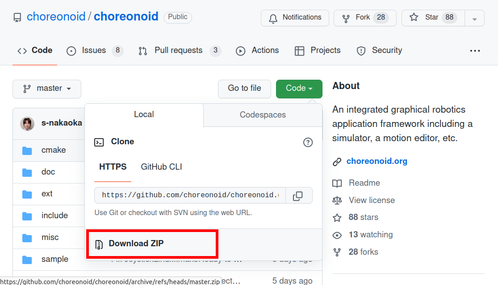

ソースコードからのビルドとインストール (Windows編)
==================================================

.. contents:: 目次
   :local:

本ドキュメントではWindowsにおけるChoreonoidのソースコードからのビルド方法について説明します。

本ドキュメントは2024年3月時点での最新の情報に基づき記載されており、Windows11を対象に動作を確認しています。環境によってはここに記載された手順でうまくいかない部分もあるかもしれません。環境が古い場合や、あえて古いバージョンのコンパイラやライブラリを使いたい場合は、 :doc:`以前のドキュメント <build-windows-old>` も参考にしてみてください。

準備
----

コレオノイドをソースコードからビルドしてインストールするには、ビルドに必要なツールとライブラリを予め準備する必要があります。

* 必要なツール

  * Visual Studio (Visual C++) 2022（2019も利用可能）
    
  * `CMake <http://www.cmake.org/>`_ (3.28.3)

- 必要なライブラリ

  * `Qt <http://www.qt.io/download-open-source/>`_ (6.6.3 もしくは 5.15.2)

.. note:: Qtの最新のメジャーバージョンであるバージョン6（Qt6）には、2024年6月27日のコミットfc6ea898より対応しました。Qtバージョン5（Qt5）についても引き続き対応しています。

.. note:: Qt6のバージョン6.7以降は現状ではWindowsにおいてスピンボックスの表示に関するバグがあるようですので、当面は6.6までのバージョンを使うようにしてください。

.. note:: 以前のバージョンではBoost C++ Librariesにも依存していましたが、2024年3月11日のコミットf40ea6fcよりBoost C++ Librariesは不要となりました。ただし、Choreonoid本体とは別に配布されているプラグインがBoost C++ Librariesを必要とする場合はあるかもしれません。

まず、上記のツールとライブラリをインストールして下さい。各ライブラリの括弧内の数値は、2024年3月に動作を確認したバージョンで、この時点での目安となるものです。最低のバージョンを指定しているライブラリ以外は、これらより古いバージョンのものに必ずしも対応しないわけではありませんし、一方でこれらよりバージョンが上のものでもビルドに失敗することもあり得ます。（正確に対応バージョンを特定するのは困難ですので、このような記述をご容赦ください。）

これらのツール・ライブラリを以下の説明に従ってインストールしてください。

なお、インストールには管理者権限を求められる場合があります。管理者権限を有するアカウントで実行し、下図のようなユーザアカウントコントロールが表示された場合は、 **はい** をクリックして先に進めてください。

.. figure:: images/userAccount.png

.. _install_visualc++:

Visual Studio (Visual C++)
~~~~~~~~~~~~~~~~~~~~~~~~~~~

ChoreonoidをコンパイルするためのC++コンパイラとして、Microsoft製のVisual C++ (Visual Studioに含まれるC++コンパイラ）を用いることができます。

Visual Studioにはいくつかのエディションがあり、 `無料版のVisual Studio Community <https://visualstudio.microsoft.com/ja/vs/community/>`_ をダウンロードして使用することも可能です。現在の最新版は2022であり、それを使用してChoreonoidをビルドして実行できることを確認しています。また、それよりひとつ前のバージョンであるVisual Studio 2019でもビルドすることができます。

ダウンロードしたインストーラを起動すると、インストールする項目を選択する画面が表示されます。この中で、 **「C++によるデスクトップ開発」** にチェックを入れるようにしてください。インストールが完了するとWindowsを再起動するように要求されますので、それに従って再起動を行ってください。

CMake
~~~~~

ビルド手順を記述するためのツールです。Choreonoidのビルド手順は本ツールの形式で記述されており、WindowsにおいてはそこからVisual Studio のプロジェクトファイルを生成することが可能です。 

CMakeは `CMakeのダウンロードページ <https://cmake.org/download/>`_ より取得できます。各プラットフォーム（OS）用のインストーラが用意されており、Windowsで使用する場合は **"Windows x64 Installer"** を使用します。

ダウンロードページでは最新版を筆頭にいくつかのバージョンをインストールできるようになっています。最新版が "Release Candidate" となっている場合は、その下に "Latest Release" と表記されているものもあるかと思いますので、そちらを利用する方が無難かと思われます。

ファイル名は **"cmake-バージョン番号-windows-x86_64.msi"** となりますので、そちらをクリックしてダウンロードし、ダウンロード後に実行してインストールを行ってください。

インストールの途中で、パスに関するオプションを以下から選択する画面になります。

* Do not add Cmake to the system PATH
* Add CMake to the system PATH for all users
* Add CMake to the system PATH for the current user

ここで **"Add CMake to the system PATH for all users"** を選択しておくと、後述するコマンドライン端末でCMakeを利用できるようになります。本ドキュメントではそちらを利用しますので、このオプションを選択しておきます。利用できるユーザを現在のユーザに限定したい場合は、 **"Add CMake to the system PATH for the current user"** を選択しておきます。

またこの設定画面で **"Create CMake Desktop Icon"** にチェックを入れておくと、CMakeのデスクトップアイコンが作成され、CMakeのGUIをデスクトップ上から起動できるようになります。

Qt
~~

QtはGUIを含む総合的なフレームワークライブラリで、ChoreonoidでもGUIのベースとして使っています。

Qtのインストーラは `Download Qt for open source use <https://www.qt.io/download-qt-installer-oss>`_ のページから取得できます。ここで取得できるのは無償で使用可能なオープンソース版で、特に理由がなければこれを使うようにします。 このページの "Qt Online Installer for Windows" のリンクからインストーラの実行ファイルをダウンロードしてください。（Qtのサイトは頻繁に構成が変わるので、上記のリンクか利用できなくなっている可能性もあります。その場合は `Qt for Open Source Development <http://www.qt.io/download-open-source/>`_ などからダウンロードのページを探してみてください。）

ダウンロードしたファイルを実行すると、Qtアカウントによるログインを求められます。アカウントは **Sign up** もしくは **登録** で作成できますので、インストールを進めるためにアカウントの作成とログインを行ってください。その後もインストーラの指示に従ってインストールを進めます。

「インストールフォルダー」の項目では、まずインストール先を指定します。デフォルトでは "C:\\Qt" といったフォルダになります。これを変更しなければ、CMakeが自動的にQtを検出するようになります。変更する場合は、フォルダを手動で指定する必要があるので覚えておいてください。

.. note:: 同じディレクトリに既にQtがインストールされている場合、「選択したディレクトリはすでに存在し、インストール内容が含まれています。別のターゲットをインストール用に選択してください。」というメッセージが表示され、先に進めないことがあります。この場合は "Qt Maintenance Tool" というアプリを起動することで、再度インストール作業を行うことができます。ただし、古いインストーラでインストールしていた場合はこのアプリが存在しない場合もありますので、その場合はインストール済みのものを一旦削除するなどしてください。

ここでは他にデフォルトで「カスタムインストール」または "Custom Installation" が選択されており、そのまま次へ進みます。

「コンポーネントの選択」ではインストールするQtのバージョンやコンポーネントを選択します。
"Qt" のツリーを展開すると、インストールできるQtのバージョンがいくつか表示されます。2024年6月時点では、以下の項目が選択可能となっていました。

* Qt 6.8.0-beta1
* Qt 6.7.2
* Qt 6.6.3
* Qt 6.5.3
* Developer and Designer Tools

当方で確認したところ、Qt 6.7 と 6.8 ではWindowsにおいて `スピンボックスの表示がおかしくなるバグ <https://forum.qt.io/topic/156001/style-mistake-in-win11-with-qt-6-7-mingw-11-2-official-online-release>`_ がありますので、現状では Qt 6.6.3 を使うようにしてください。Qt 6.6.3 にチェックを入れることで、このバージョンをインストールできます。

チェックを入れたQtバージョンのツリーを更に展開すると、以下のような項目が表示されます。

* WebAssembly (multi-threaded)
* WebAssembly (single-threaded)
* MSVC 2019 ARM64 (TP)
* LLVM-MinGW 17.0.6.64-bit
* MSVC 2019 64-bit
* MinGW 11.2.0 64-bit
* Android
* Sources
* Qt Quick 3D
* Qt 5 Compatibility Module
* Qt Shader Tools
* Additional Libraries
* Qt Debug Information Files
* Qt Quick Timeline

この中から、"MSVC 2019 64-bit" にチェックを入れて選択するようにします。最新のVisual Studio 2022に直接対応する項目は無いようですが、"MSVC 2019 64-bit" はVisual Studio 2022でも使えるようですので、Visual Studio 2022を使用する場合でもこちらで問題ありません。他の項目についてはChoreonoidのビルドには必要ないので、特に理由がなければチェックを外すようにします。

"Qt" のツリーには、 "Developer and Designer Tools" という項目もあり、そこを更に展開すると、デフォルトでいくつかのツールにチェックが入っています。それらもChoreonoidのビルドにおいては必要ないものだったり、既にインストールしているものもあるので、特に理由がなければ全てチェックを外して選択を解除しておくのがよいでしょう。デフォルトでCMakeのチェックが入っていることもありますが、CMakeについては上述の手順で独立してインストールしており、それとの競合を避けるためQtのインストールでは含めないようにした方がよいかもしれません。

.. note:: 何らかの理由でQtの古いバージョンであるバージョン5（Qt5）を使用したい場合は、「コンポーネントの選択」の右側にある "Archive" のチェックを入れて、「フィルター」というボタンを押すようにします。すると "Qt" の項目として "Qt 5.15.2" などの古いバージョンも表示されるようになり、それをチェックすることで古いバージョンもインストールすることができます。

その後もインストーラの指示に従って進めて、インストールを完了させてください。

ソースコードの取得
------------------

開発版
~~~~~~

Choreonoidの開発は `github <https://github.com/>`_ 上で行われており、以下のリポジトリから最新のソースコードを取得可能です。

- https://github.com/choreonoid/choreonoid

ソースコードは `Git <http://git-scm.com/>`_ リポジトリとして管理されています。

ここからソースコードを取得する形態として以下の2つがあります。

* Gitリポジトリとして取得する
* Zipファイルで取得する

.. _build-windows-use-git:

Gitリポジトリとして取得する
^^^^^^^^^^^^^^^^^^^^^^^^^^^

Gitリポジトリは、コード改変の履歴を含む形態のソースコード管理方式です。これには様々な利点があり、Choreonoidを利用するだけの場合でも、最新のソースコードに更新しやすくなるという利点があります。

Gitリポジトリの取得は通常gitコマンドを用いて行います。このコマンドのWindows版についてはGit for Windowsというパッケージにまとめられています。

これを利用する場合は、 `Git for Windows 公式サイト <https://gitforwindows.org/>`_ の "Download" からインストーラのファイルをダウンロードして実行し、インストールを行ってください。インストール時の設定は基本的にはデフォルトのままでよいかと思います。 **"Select Components"** の設定で **"Additional icons"** と **"On the Desktop"** のチェックを入れておくと、デスクトップ上のアイコンからGitの端末を起動できるようになるので、便利かもしれません。

Gitは基本的にはコマンドライン端末からgitコマンドを実行して使用します。端末としては、Windows標準の「コマンドプロンプト」も利用できますし、Git for Windowsによってインストールされる端末を用いることもできます。前者についてはスタートメニューから検索するなどして起動します。後者については "Git Bash" という名称でインストールされるので、スタートメニューからそちらを検索するか、インストーラが作成するデスクトップアイコンをダブルクリックするなどして起動してください。

コマンドを入力できる状態になりましたら、以下のコマンドを入力します。 ::

 git clone https://github.com/choreonoid/choreonoid.git

するとWebサーバで管理されているリポジトリが、対象PCのディレクトリに複製（クローン）されます。これによってPC上でソースコード等のファイルにアクセスできるだけでなく、それらの過去のバージョンを取り出したり、最新版に更新したりすることが容易にできるようになります。クローンされるディレクトリの名前はデフォルトでは "choreoonoid" となります。

この操作ではコマンドライン端末でカレントディレクトリとなっているディレクトリにリポジトリが作成されます。実際にはリポジトリを作成するディレクトリを事前に決めた上で、そこにクローンするようにしましょう。例えばソースコードを格納するための "C:\\src" というディレクトリを作成し、その中にクローンすると分かりやすくてよいかもしれません。これをコマンドラインから行う場合は、 ::

 cd c:/
 mkdir src
 cd src
 git clone https://github.com/choreonoid/choreonoid.git

などとします。これによって、"C:\\src\\choreonoid" というディレクトリ内にChoreonoidのソースコードが格納されるようになります。

.. note:: 基本的な事柄として、ここで "cd" は指定したディレクトリに移動するコマンドで、"mkdir" はディレクトリを作成するコマンドになります。ディレクトリの区切り文字はWindowsでは通常 "\\" 記号（日本語環境では "￥" となることもある）が使われますが、Git for Windowsのコマンドライン端末（Git Bash）はUnix由来のものになりますので、区切り文字には "/" を使用します。Windows標準の「コマンドプロンプト」ではどちらの区切り文字も使用できます。ここでは "/" に統一して記述することにします。

リポジトリのクローンは最初に１回行えばOKです。以降はそのリポジトリのディレクトリ内で ::

 git pull

とすることにより、その時点での最新のソースコードに更新できます。

以上でソースコードの取得ができます。Gitの詳しい使用方法についてはGitのマニュアルや解説記事を参照してください。

本ドキュメントではGitを用いずにソースコードを取得する手法も紹介しており、ソースコードを格納したディレクトリを **ソースディレクトリ** と呼ぶことにします。本ドキュメントでは、上記の **"C:\\src\\choreonoid"** をソースディレクトリとして使うものとして説明を進めます。

.. note:: Gir for Windowsの最近のバージョンではWindows標準のエクスプローラからもGitの操作ができるようです。またVisual StudioでもGit関連の操作をIDE上で統合的に行えるようになっています。詳細についてはGit for WindowsやVisual Studioのマニュアルをご参照ください。

.. _build-windows-use-github-zipfile:

Zipファイルで取得する
^^^^^^^^^^^^^^^^^^^^^

Gitを使用せずに最新のソースコードを取得することも可能です。
ウェブブラウザを使用して `Choreonoidのリポジトリ <https://github.com/choreonoid/choreonoid/>`_ を開き、緑色の"Code"のボタンをクリックし、そこで表示されるメニューの "Download ZIP" をクリックします。

するとダウンロード用ダイアログが表示され、最新のソースコードのZipファイルをダウンロードできます。ファイル名はソフトウェアの名前にブランチ名が追加された "choreonoid-master.zip" といった名称になります。

この方法は最初の取得に関しては簡単ですが、 ソースコードの更新にあたっては毎回Zipファイルをダウンロードして展開しなおす必要があります。Gitリポジトリを利用する場合は上記のように git pull コマンドだけで更新を行うことができますので、継続的に利用する場合はGitリポジトリを使用する方法がおすすめです。

リリース版
~~~~~~~~~~

Choreonoidのリリース版のソースコードは、 `ダウンロード <http://choreonoid.org/ja/downloads.html>`_ のページからダウンロードすることが可能です。このページにある「ソースパッケージ」の該当するバージョンをダウンロードしてください。ファイルはZIPファイルになっていますので、適当なディレクトリで ::

 unzip choreonoid-2.2.0.zip

などとして展開してください。

展開すると choreonoid-2.2.0 といったディレクトリが生成されます。このディレクトリもソースコード一が格納された **「ソースディレクトリ」** となります。

.. note:: リリース版については、開発版を対象とした本マニュアルの手順が異なる場合があります。例えば、2.0.0以前のバージョンでは、Boost C++ Librariesのインストールも必要となります。リリース版のインストール方法については、　`各リリース版のマニュアル <http://choreonoid.org/ja/documents/index.html>`_ を参照するようにしてください。

Choreonoidのビルド
------------------

Choreonoidのソースコードを必要なツールやライブラリが用意できたら、Choreonoidを実行できるようにするためのビルドを行います。
ビルドする方法は大きく分けて以下の2つがあります。

* コマンドライン（CUI）を用いてビルドする
* GUIを用いてビルドする

ここではまずコマンドラインを用いてビルドする方法を紹介します。GUIについてはページを分けて紹介します。

.. _build-windows-command-line:

コマンドラインによるビルド
~~~~~~~~~~~~~~~~~~~~~~~~~~

CMakeのコマンドを用いることで、Choreonoidをコマンドラインからビルドすることができます。

まずコマンドライン端末を起動します。Windows標準の「コマンドプロンプト」を使用する場合は、スタートメニューから "command" 等のキーワードで検索して実行するなどします。それかGit for Windowsでインストールされる "Git Bash" の端末を使用してもOKです。後者の方が高機能でUnix（Linux）と同様のコマンドライン操作ができます。

端末が起動したら、 ::

 cd ソースディレクトリ

としてソースディレクトリに移動しておきます。ソースディレクトリが "c:\\src\\choreonoid" である場合は、 ::

 cd c:/src/choreonoid

とします。（ :ref:`build-windows-use-git` の注釈で述べたように、ディレクトリの区切り文字には "/" を使うことにします。）

そこで以下のコマンドを入力します。 ::

 cmake -B build -G "Visual Studio 17 2022" -A x64

このコマンドにより、Visual Studio 2022用を用いてビルドするためのファイルが "build" ディレクトリ以下に生成されます。必要なコンパイラやライブラリが適切にインストールされていな場合はエラーになります。

各オプションの意味は以下のとおりです。

* "-B"

  * ビルド用のファイルを生成する「ビルドディレクトリ」を指定します。

* "-G"

  * ビルド用ファイルのジェネレータを指定します。Visual Studio (Visual C++) を使用する場合は、各バージョンごとに以下の文字列を指定します。

    * Visual Studio 2022: **"Visual Studio 17 2022"**
    * Visual Studio 2019: **"Visual Studio 16 2019"**

* "-A"

  * ビルドするプログラムのプラットフォームを指定します。"x64" を指定することでx64（x86の64ビット版）アーキテクチャとなります。"Win32" を指定すると32ビットで生成されます。ただし現在32ビット版の動作確認は行っておりませんので、特に理由が無ければ64ビット版をビルドして使用するようにしてください。

.. note:: "-A" オプションで指定するアーキテクチャは、デフォルトではホストOSと同じアーキテクチャとなります。従って64ビット版のWindowsで64ビットのChoreonoidバイナリをビルドする場合、このオプションは省略できます。ただしVisual Studio 2019以前では、このオプションにx64を指定しないと、生成されるバイナリが64ビットだったとしても、デフォルトのインストール先（CMAKE_INSTALL_PREFIX）が32ビット用の "C:\\Program Files (x86)" となってしまうようです。恐らくVisual Studioの本体が32ビット版であると、このような挙動になってしまうのでしょう。この挙動を避けるためには、 "-A x64" を指定しておく必要があります。

ビルド用ファイルの生成に成功したら、以下のコマンドを入力し、ビルドを行います。 ::

 cmake --build build --config Release -- -m

各オプションの意味は以下のとおりです。

* "--build"

  * ビルドを実行するオプションです。引数としてビルドディレクトリを指定します。

* "--config"

  * コンフィギュレーションを指定します。Visual Studioの場合は「ソリューション構成」に対応します。これに "Release" を指定するとリリース版のビルドになりますので、通常はそちらを指定します。ここに "Debug" を指定してデバッグ用のバイナリを生成することもできます。

* "--"

  * これ以降のオプションをネイティブのビルドツールに渡します。ここではVisual C++のコンパイラに渡されるオプションをこれ以降で指定することになります。

* "-m"

  * Visual C++のコンパイラに渡すオプションで、並列ビルドを有効化します。これを付けておくと、マルチコアCPUの場合はビルドが速くなります。

ビルド時にはコンパイルのコマンドやコンパイラからのメッセージが端末上に表示されます。ビルドに失敗するとエラーメッセージが表示されますので、メッセージを確認してビルドが成功したかどうか判断します。

ビルドに成功したら、以下のコマンドでビルドされたファイルをインストールします。 ::

 cmake --install build --config Release --prefix c:/choreonoid

このコマンドを実行すると、"c:\\choreonoid" にビルドの成果物がインストールされます。

各オプションの意味は以下のとおりです。

* "--install"

  * インストールを実行するオプションです。引数としてビルドディレクトリを指定します。

* "--prefix"

  * インストール先を指定します。デフォルトでは "C:\\Program Files\\choreonoid" になりますが、"C:\\Program Files" 以下へのインストールには管理者権限が必要ですので、上記の "c:/choreonoid" のようにインストールやアクセスがしやすいディレクトリを指定するとよいでしょう。

.. note:: cmakeコマンドのオプションでも、ディレクトリの区切り文字には "\\" と "/" のどちらも利用可能です。:ref:`build-windows-use-git` の注釈で述べたことを踏襲して、cmakeコマンドでも "/" を使用することにします。

インストール時にエラーが表示されなければ、ビルド・インストールは完了です。

Choreonoidの実行ファイル "choreonoid.exe" がインストール先のbinディレクトリに格納されているので、これを実行することでChoreonoidを起動できます。例えばエクスプローラ上から "choreonoid.exe" をダブルクリックして起動することが可能です。Windows標準のコマンドプロンプトからは ::

 c:\choreonoid\bin\choreonoid.exe

として起動します。（この場合はディレクトリの区切り文字として "\\" しか使用できません。）Git Bash端末の場合は、ディレクトリ区切り文字として "/" を用いて ::

 c:/choreonoid/bin/choreonoid.exe

とします。どちらの場合も、拡張子の ".exe" は省略可能です。インストール先が "c:\\choreonoid" でない場合は、その部分を実際のインストール先に置き換えるようにしてください。

GUIによるビルド
~~~~~~~~~~~~~~~

GUIによるビルドは :doc:`build-windows-gui` を参照してください。

.. _build-windows-options:

オプション機能のビルド
----------------------

コレオノイドでは、上記手順のデフォルト状態で有効になるもの以外にも、いくつかのモジュールやプラグイン、サンプル等があります。それらは、CMakeの設定で有効にすることで、ビルドすることができます。
ここではそれらオプション機能のうちいくつかのビルドについて述べます。
:doc:`options` にて他のオプションについてもまとめてありますので、そちらもご参照ください。

オプション有効化の基本的な手順
~~~~~~~~~~~~~~~~~~~~~~~~~~~~~~

オプション機能を有効にする手順は、基本的に以下のようになります。

1. 必要なライブラリをインストールする
2. CMakeのビルド設定で該当するオプションを有効化する
3. Choreonoidのビルドを再度実行する

2については、オプションに対応するCMakeの変数がありますので、そちらを "ON" に設定します。
上記のコマンドラインからのビルドでこれを行う場合は、以下のようにCMakeのコマンドを入力します。 ::

 cmake -B build -G "Visual Studio 17 2022" -DBUILD_POSE_SEQ_PLUGIN=ON

ここで "-DBUILD_POSE_SEQ_PLUGIN=ON" の部分がオプションの有効化に対応します。"-D" はこれに続く変数を設定するオプションで、ここでは「PoseSeqプラグイン」に対応する "BUILD_POSE_SEQ_PLUGIN" に "ON" を設定することで、このプラグインをビルドするようにしています。

逆にあるオプションを無効化する場合は、対応する変数に "OFF" を設定します。例えば ::

 cmake -B build -G "Visual Studio 17 2022" -DENABLE_SAMPLES=OFF

とすることで、サンプルをビルドしないように設定することができます。

GUIを用いて設定する場合もやることは同じです。CMakeのGUIで該当する変数のチェックを切り替えてから、 **Configure**, **Generate** の各ボタンを押すことで、有効化／無効化を行うことができます。

.. _build-assimp-plugin-windows:

PoseSeqプラグイン、Balancerプラグインのビルド
~~~~~~~~~~~~~~~~~~~~~~~~~~~~~~~~~~~~~~~~~~~~

Choreonoidではキーポーズを用いてロボット動作の振り付けを行う機能があります。
この機能は最新のバージョンではオプション扱いとなっており、利用にあたっては対応するプラグインを有効化する必要があります。

具体的には、上でも触れた「PoseSeqプラグイン」と「Balancerプラグイン」を有効化します。それぞれCMakeの **"BUILD_POSE_SEQ_PLUGIN"** と **"BUILD_BALANCER_PLUGIN"** 変数に対応するので、CMakeでの設定時に ::

 cmake -B build -G "Visual Studio 17 2022" -DBUILD_POSE_SEQ_PLUGIN=ON -DBUILD_BALANCER_PLUGIN=ON

とし、その後ビルド・インストールを行うことで、振り付け機能を利用できるようになります。

Assimpプラグインのビルド
~~~~~~~~~~~~~~~~~~~~~~~~

様々な形式の３次元モデルデータを読み込むためのライブラリ `Open Asset Import Library (Assimp) <https://github.com/assimp/assimp>`_  をコレオノイドで使用するためのプラグインです。
このプラグインを利用するためには、Assimpライブラリをソースからビルドしてインストールしておく必要があります。

Choreonoidに付属の一部のサンプルは、モデルのメッシュファイルとしてCOLLADA形式（.dae）を使用しており、そのようなサンプルを読み込む場合もAssimpプラグインが必要となります。

Assimpプラグインを利用するにあたっては、まずAssimpの開発用のライブラリ・ヘッダファイルをインストールしておく必要があります。
この方法は上記のリポジトリの `Build / Install Instructions <https://github.com/assimp/assimp/blob/master/Build.md>`_ のページで解説されていますので、そちらを参照してください。
ここではその手順を簡単にまとめておきます。

Assimpは現在github上でGitリポジトリとして公開されていますので、Choreonoidのソースコードと同様に :ref:`build-windows-use-git` か :ref:`build-windows-use-github-zipfile` ようにします。以下ではGitリポジトリとして取得する手順を説明します。

Assimpのリポジトリを生成するディレクトリを決めて、そこで ::

 git clone https://github.com/assimp/assimp.git

とし、AssimpのGitリポジトリを取得します。 ::

 cd assimp

としてこのディレクトリに入ります。この状態でソースコードはmasterブランチの最新版となりますが、最新版は必ずしも安定に動作するとは限りません。各リリースのバージョンに対応するタグが設定されていますので、安定性を考えるとそれらのバージョンを指定した方がよいかもしれません。2023年2月の時点で最新のリリースバージョンは5.2.5となっていますので、ここではそれを利用することにします。その場合、 ::

 git checkout v5.2.5

とすることでソースコードをこのバージョンに切り替えることができます。

コマンドラインからビルドする場合は、Choreonoidのビルドと同様に、以下のようにCMakeコマンドを実行します。 ::

 cmake -B build -G "Visual Studio 17 2022" -A x64
 cmake --build build --config Release -- -m
 cmake --install --config Release --prefix c:/local/assimp

cmakeコマンドのオプションについては、:ref:`build-windows-command-line` で説明したとおりですので、適切に設定してください。デバッグ用のバイナリも必要な場合は、"--config Debug" でのビルド・インストールもしておきます。（※ Assimp 5.0.x ではデバッグ用もビルド・インストールしておかないと、ChoreonoidのCMakeでAssimpを検出する際にエラーになってしまうようです。Assimp 5.1以降ではそのような問題はありません。）

最後の "--prefix c:/local/assimp" によって、インストール先を "c:\\local\\assimp" にしています。このディレクトリにしておけば、Choreonoid本体のCMake設定時に、Assimpが自動で検出されます。Boostライブラリもデフォルトで "c:\\local" 以下にインストールされますので、それに合わせています。

インストール先を設定しない場合はデフォルトの "c:\\Program Files\\Assimp" にインストールされます。ただしその場合は管理者権限が必要ですので、コマンドライン端末を予め管理者権限で起動しておきます。このデフォルトのインストール先でも、ChoreonoidのCMake設定時に自動で検出されます。

上記の手順でAssimpがインストールされている状態で、Choreonoidを初めてビルドするのであれば、Choreonoidの通常のビルド手順で自動的にAssimpが検出され、Assimpプラグインもビルドされます。既にChoreonoidがビルド済みの場合は、Choreonoid本体を再ビルドする必要があります。その際まず以下のようにしてAssimpを明示的に有効化する必要があります。 ::

 cmake -B build -DENABLE_ASSIMP=ON

この設定をしてから再度CMakeのbuildとinstallの操作を行ってください。

なお、Assimpが上記のディレクトリ以外にインストールしてあって自動で検出されない場合は、CMakeで以下のようにassimp_DIR変数も設定します。 ::

 cmake -B build -DENABLE_ASSIMP=ON -Dassimp_DIR=AssimpのCMakeファイルのディレクトリ

ここで「AssimpのCMakeファイルのディレクトリ」は、Assimpインストール先の "lib\\cmake\\assimp-x.x" というディレクトリになります。"x.x" のところにはAssimpのバージョン番号が入ります。

.. _build-windows-freetype:

FreeTypeライブラリの有効化
~~~~~~~~~~~~~~~~~~~~~~~~~~

Choreonoidではシーンビュー上にテキストを描画する機能があります。ただしこれを利用するためにはFreeTypeライブラリを有効化する必要があります。現状ではこの機能は距離計測機能で利用できます。

FreeTypeライブラリを有効化するにあたっては、まずFreeTypeライブラリを利用可能としておく必要があります。これは以下の手順で行います。

1. FreeTypeの公式サイト https://freetype.org からライブラリのソースコードを取得する。
2. 取得したソースコードを適当なディレクトリに展開し、CMakeを利用してビルド・インストールを行う
3. Choreonoidのビルド時にCMakeの設定で **ENABLE_FREE_TYPE** を **ON** にする

1については、公式サイトの "Download" のページから "Stable Releases" にリンクされているページに行き、そこでソースコードのアーカイブを取得します。2023年3月の時点では、ダウンロードサイトについて

* https://savannah.nongnu.org/download/freetype/
* https://sourceforge.net/projects/freetype/files/

の2つのリンクがあります。一番目のサイトでダウンロードできなかったことがありましたので、二番目のsourceforgeのサイトからダウンロードするのが無難かもしれません。sourceforgeの場合は更に階層が分かれており、その中の "freetype" という項目からバージョン番号をたとってダウンロードできます。2023年3月時点ではバージョン2.13.0が最新版となっており、このバージョンでの動作確認をしています。アーカイブファイルはいくつかのタイプがあり、Windowsで使用する場合はzipファイルが扱いやすいかと思います。この場合、"ft2130.zip" といったアーカイブファイルをダウンロードします。

2については、上記のAssimpのインストールと同様の作業になります。
コマンドライン端末を開き、アーカイブを展開したディレクトリに移動します。そこで以下のコマンドを実行します。 ::

 cmake -B build -G "Visual Studio 17 2022" -A x64
 cmake --build build --config Release -- -m
 cmake --install build --config Release --prefix c:/local/freetype

FreeTypeはデフォルトではスタティックライブラリとしてビルドされるようになっており、Choreonoidで利用する場合も通常はスタティックライブラリを用いるようにします。FreeTypeはCMakeのオプションで "-DBUILD_SHARED_LIBS=true" とすることでダイナミックリンクライブラリ（DLL）としてビルドすることも可能ですが、それを用いるとChoreonoidの追加のプラグインがFreeTypeを利用している場合に競合を起こす可能性がありますので、通常はDLL版のライブラリは用いないようにします。

最後の "--prefix c:/local/freetype" によって、インストール先を "c:\\local\\freetype" にしています。このディレクトリにしておけば、Choreonoid本体のCMake設定時に、FreeTypeが自動で検出されます。インストール先を設定しない場合はデフォルトの "c:\\Program Files\\freetype" にインストールされます。ただしその場合は管理者権限が必要ですので、コマンドライン端末を予め管理者権限で起動しておきます。このデフォルトのインストール先でも、ChoreonoidのCMake設定時に自動で検出されます。また、上記のディレクトリ以外にインストールする場合は、Choreonoidビルド時のCMakeでfeetype_DIR変数にFreeTypeインストール先の "lib\\cmake\\freetype" までのディレクトリを設定しておきます。これらの設定方法は全てAssimpの場合と同様です。

FreeTypeがインストールされている状態で、Choreonoid本体のCMake設定で **ENABLE_FREE_TYPE** を **ON** にしてビルドを行うことにより、FreeTypeが有効化されたChoreonoidをビルド・インストールすることができます。

テキスト表示のサンプルとして、"share\\model\\misc" 以下に "text.scen" というファイルがあります。Choreonoidを起動して「ファイル」-「読み込み」-「シーン」からこのファイルを読み込んでチェックを入れて、シーンビュー上に "Choreonoid" というテキストが表示されれば、FreeTypeが有効化ができています。

Mediaプラグインのビルド
~~~~~~~~~~~~~~~~~~~~~~

メディアファイルの再生を行うプラグインです。CMake上で **BUILD_MEDIA_PLUGIN** をONにすることでビルドできます。

MPEG-4ファイルなどメディアファイルの形式によっては、デフォルトでは再生できないものがあります。そのようなファイルについても、ファイル形式に対応したコーデックパックをインストールすることで再生できるようになります。コーデックパックはネット上で検索すれば見つかるかと思います。ただし他の動画ソフトなどに影響を与えるものもあるようなので、ここでは詳細には触れません。ご自身のシステムにあったものをご利用ください。

ODEプラグインのビルド
~~~~~~~~~~~~~~~~~~~~~

オープンソースーの物理計算ライブラリである `Open Dynamics Engine (ODE) <http://www.ode.org/>`_ を、コレオノイドのシミュレーション機能の物理エンジンとして利用できるよにするプラグインです。

本プラグインをビルドして利用するためには、ODEライブラリのインストールが必要です。
2023年2月時点では `Bitbucket内のダウンロードページ <https://bitbucket.org/odedevs/ode/downloads/>`_ から最新のソースアーカイブであるode-0.16.3.tar.gzをダウンロードすることができます。以下はこのバージョンを想定した説明になります。

このファイルはtar.gz形式のアーカイブですので、まずファイルの展開を行います。
Windows上で展開するにはそのためのソフトが必要となります。
これには例えば `7-Zip <https://sevenzip.osdn.jp/>`_ というソフトを用いることができますので、そのようなソフトを用いてファイルを展開しておきます。

ODEのビルドもCMakeを用いて行うことができます。
例えばODEのソースディレクトリで以下のコマンドを実行します。 ::

 cmake -B build -G "Visual Studio 17 2022" -A x64
 cmake --build build --config Release -- -m
 cmake --install --config Release --prefix c:/local/ode

この操作により、"C:\\local\\ode" 以下にビルド済みのODEライブラリがインストールされます。
インストール先はデフォルトでは "C:\\Program Files\\ODE" となっており、そちらにインストールしてもOKです。

ODEがインストールされている環境で、Choreonoidをビルドします。CMakeの設定で ::

 cmake -B build -DBUILD_ODE_PLUGIN=ON 

などとして、"BUILD_ODE_PLUGIN" を "ON" に設定した上で、ビルドを行います。

ODEを上記のディレクトリ以外のディレクトリにインストールしている場合は、そのディレクトリをCMakeのODE_DIR変数に設定するようにしてください。

Pythonプラグインのビルド
~~~~~~~~~~~~~~~~~~~~~~~~

Pythonスクリプトの読み込み・実行や、コレオノイド上で動作するPythonコンソール等の機能を使用するためのプラグインです。

本プラグインをビルドして利用するためには、Pythonのインストールが必要です。まだインストールしていない場合は、 `Python公式サイト <http://www.python.org/>`_ の `Windows版ダウンロードページ <https://www.python.org/downloads/windows/>`_ から **"Windows installer (64-bit)"** をダウンロードして、インストールを行ってください。2021年4月現在動作確認がとれている最新のPythonバージョンは3.11.1になります。

インストーラを起動すると以下のような画面になります。

.. figure:: images/Python3install1.png
   :width: 600px

ここで **Add Python 3.x to PATH** には通常チェックを入れておきます。そして **Install Now** をクリックして、インストールを行います。

Pythonプラグインを利用するためには、他に `NumPy <https://numpy.org/>`_ というPython用の数値計算ライブラリも必要ですので、そちらもインストールします。これはPythonのインストール後にコマンドプロンプトから以下のコマンドを実行することで行なえます。 ::

  python -m pip install numpy

Python本体とNumPyがインストールされている環境で、Choreonoid本体のCMake設定で **ENABLE_PYTHON** を **ON** に設定することで、Pythonプラグインをビルドできます。正確には、このオプションによってChoreonoidのPython対応機能が有効化され、その上でその機能に含まれるPythonプラグインも有効化されることになります。

複数のプラグインの有効化
~~~~~~~~~~~~~~~~~~~~~~~~

上記の説明では、各プラグインを個別に有効化する手順を紹介しました。CMakeでは "-D" オプションで変数を設定する場合、その内容がビルドディレクトリ内に記録されるので、追加で変更する変数のみを記述することが可能となっています。

一方で、"-D" オプションは任意の数を指定できますので、複数のプラグインを同時に有効化することも可能です。オプションのプラグインで利用したいものが予め分かっている場合は、それらを全て指定してまとめてビルドを行うことが可能です。

例えばCMakeの最初の設定として ::

 cmake -B build -G "Visual Studio 17 2022" -A x64 -DBUILD_POSE_SEQ_PLUGIN=ON -DBUILD_BALANCER_PLUGIN=ON -DENABLE_ASSIMP=ON -DBUILD_MEDIA_PLUGIN=ON -DBUILD_ODE_PLUGIN=ON -DENABLE_PYTHON=ON

とすることで、ここで解説した全てのプラグインを一度に有効化し、ビルドすることができます。

プラグインのアンインストール
~~~~~~~~~~~~~~~~~~~~~~~~~~~~

**BUILD_XXX_PLUGIN** のオプションをオンにしてインストールしたプラグインは、その後オプションをオフにしてインストールしても削除されません。プラグインを追加して動作が不安定になった場合など、プラグインを削除したい場合は、手動でファイルを削除してください。XXXプラグインは **"(コレオノイドのインストール先)/lib/choreonoid-1.7"** に **"CnoidXXXPlugin.dll"** としてインストールされています。
