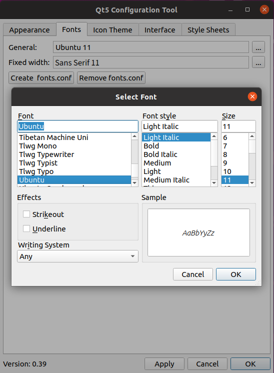
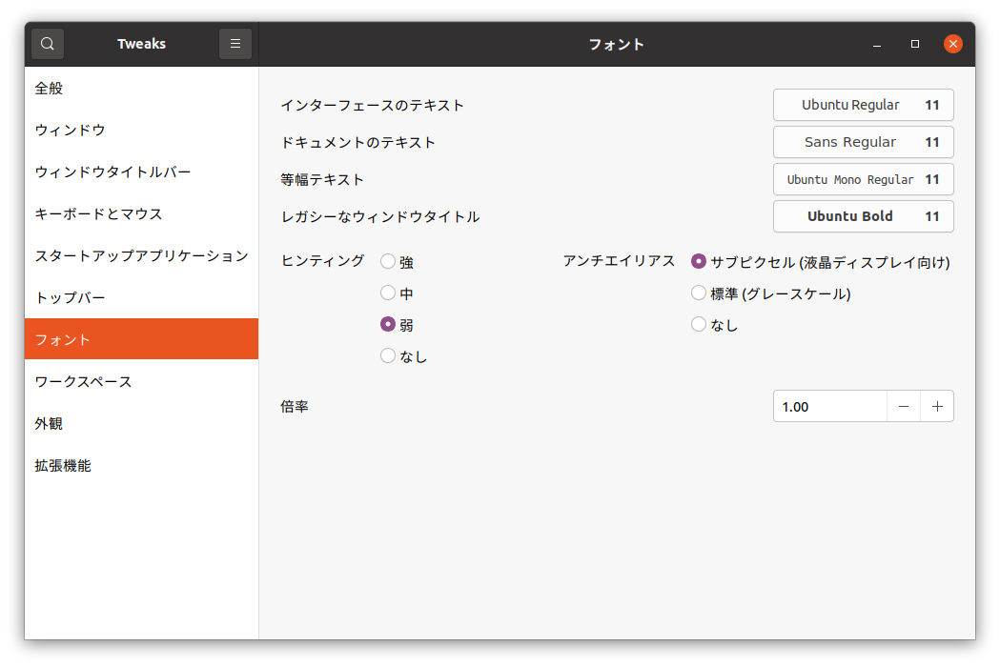
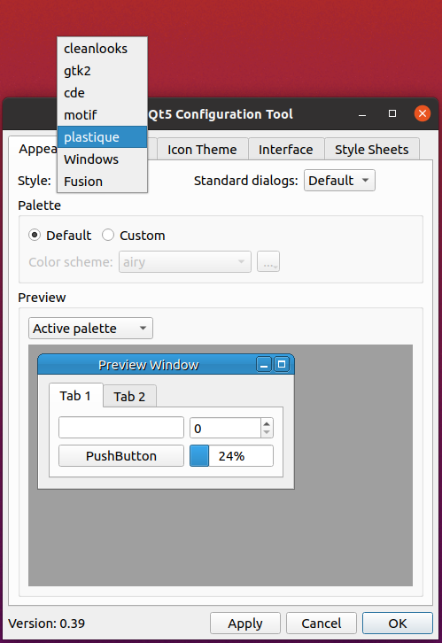

Qt関連の設定
============

.. contents::
   :local:
   :depth: 2

.. highlight:: sh

.. _build_ubuntu_qt_style:

概要
----

ChoreonoidではGUIの実装にQt（キュート）というフレームワークを利用しています。QtはWindowsやLinuxをはじめとするマルチプラットフォームに対応するフレームワークで、完成度も高く、Choreonoidもこれを用いることでマルチプラットフォーム対応の高機能なGUIを効率的に実装しています。

ただしQtはマルチプラットフォーム対応のため、GUIの描画に独自の実装を用いているところもあります。このため、OS標準の設定機能ではGUIで使用するフォントや描画スタイルなどを設定できない場合があります。本節ではそのような場合に使用可能なQt独自の設定方法について解説します。GUIについてデフォルトのフォントや外観で問題ない場合はよいのですが、もし設定を変更したくなった場合は、こちらの方法を試してみてください。

フォントの設定
--------------

ChoreonoidのようなGUIのアプリケーションを快適に使用するにあたっては、フォントのタイプや種類が違和感のないものになっていることが望ましいです。通常はOSで標準のフォントが設定されていて、アプリケーションでもそれが使用されますし、問題があればOS標準の方法で設定を変更することができます。しかしながら、Qtで構築されたアプリケーションでは、OS標準とは異なる方法でフォントが設定されている場合があります。

当方で調査したところ、Choreonoidの現行バージョンの対象プラットフォームについて、Qtのアプリケーションで利用されるフォントは2021年4月の時点で以下のようになっていました。

* OS標準のフォントが使用される

  * Windows 10
  * Ubuntu 18.04

* Qt独自に設定されたフォントが使用される

  * Ubuntu 20.04

.. note:: Ubuntu 20.04については、リリース当初はOSの標準フォントが使用されていたようですが、2021年以降のアップデートで変更されたようです。本節の説明はこのバージョンが対象となります。

OS標準のフォントが使用されるWindows10やUbuntu 18.04では特に問題ないかと思われます。もし問題がある場合はOSのフォント設定を変更するようにしてください。一方で、Ubuntu 20.04の場合はQtで独自に設定されたフォントが使用されるようになっており、実際にOS標準のものと比べて若干小さいサイズのフォントで表示されることが多いようです。そのようにOS標準とは異なる表示になっていると、違和感や使い勝手の悪さを感じることもあるかと思います。そのような場合は、以下では紹介するQt独自の方法でフォントの調整をするようにしてください。

環境変数 QT_FONT_DPI によるフォントサイズの調整
~~~~~~~~~~~~~~~~~~~~~~~~~~~~~~~~~~~~~~~~~~~~~~~

フォントのサイズを調整する場合、QT_FONT_DPI という環境変数を使用することができます。通常この変数にはディスプレイのDPI値を設定しますが、その値を適当に変更することで、画面に表示される際の実際のサイズを調整することができます。

例えばChoreonoid起動時に以下のように入力します。 ::

 QT_FONT_DPI=96 choreonoid

するとDPIが96のディスプレイでQt標準のサイズで表示されるように実際のフォントサイズが調整されます。この値でフォントが小さければ、設定するDPI値を大きめにします。例えば以下のようにすればフォントが先程よりも若干大きく表示されるはずです。 ::

 QT_FONT_DPI=120 choreonoid

この値は自由に設定できるようですので、見やすいフォントサイズになるように調整してください。

適切な値がみつかったら、  ::

 export QT_FONT_DPI=120

を実行しておけば、それ以降はchoreonoid起動の度にこの記述を入れる必要はなくなります。ただしこの場合は他にQtを利用したアプリケーションがあればそちらにも影響しますので、ご注意ください。それで問題なければ、.profile などに記述しておくのもよいかと思います。

qt5ctによるフォントの設定
~~~~~~~~~~~~~~~~~~~~~~~~~

LinuxであればQtの設定を行うためのqt5ctというツールが用意されていて、これを用いることでフォントの設定を行うことも可能です。その場合は、フォントサイズだけでなく、フォントの種類も変更することができます。

.. note:: 筆者の知る限りこのツールはWindows用には用意されていないようです。以下はUbuntu Linuxでの使用を想定しています。

このツールを利用するにあたっては、まずqt5ctのパッケージをインストールします。 ::

 sudo apt install qt5ct

そして、"QT_QPA_PLATFORMTHEME" という環境変数に "qt5ct" を設定しておきます。 ::

 export QT_QPA_PLATFORMTHEME=qt5ct

このツールを常用する場合はやはり .profile などに上記コマンドを記述しておくとよいでしょう。

インストール・設定が完了したら、以下のコマンドで設定ツールを起動できます。 ::

 qt5ct

このツールはデスクトップ環境のアプリケーションメニューにおいて "Qt5 Settings" といった名前で登録されるようですので、そちらのメニューから起動してもOKです。

qt5ctのウィンドウには上部にタブがあり、タブごとに様々な項目の設定ができるようになっています。その中の "Fonts" というタブを選択することで、以下の画面に示すようにフォントの設定ができます。

設定を変更したらqt5ctのウィンドウの下部にある "Apply" または "OK" を押せば、その場で設定が反映されます。

なお、qt5ctによる設定は上述のQT_FONT_DPIの設定と併用できます。使用するディスプレイにもよるかと思いますが、基本的にはQT_FONT_DPIの値を96に設定すると、qt5ctで設定したサイズになるようです。

.. note:: Ubuntu 18.04のようにデフォルトでOSの標準フォントが使用される環境でも、qt5ctを導入することが可能です。その場合は設定がqt5ctによるものに切り替わります。

補足： UbuntuにおけるOS標準フォントの設定
~~~~~~~~~~~~~~~~~~~~~~~~~~~~~~~~~~~~~~~~~

Ubuntu 18.04のように、QtアプリでもOSの標準フォントが使用される環境があります。この場合、（QT_FONT_DPIやqt5ctを使用しなければ）OS標準のフォント設定を変更すれば、それがChoreonoidにも反映されます。ただしUbuntuではOS標準フォントの設定が通常の設定パネルに含まれておらず、どこで設定をすれば分かりにくいかと思います。これについては "gnome-tweaks" というオプションのツールから設定することが可能ですので、以下ではその使用方法を紹介します。

gnome-tweaks は以下でインストールできます。 ::

 sudo apt install gnome-tweaks

インストール後は以下のコマンドで起動できます。 ::

 gnome-tweaks

このツールの設定項目に「フォント」が含まれています。以下にその画面を示します。

これによってOS標準フォントの設定を行うことができます。

.. ボタン等のGUI部品の外観をカスタマイズする「スタイル」機能が備わっています。そして、Ubuntuのデフォルト状態では、このQtのスタイルが、Linuxの標準GUIライブラリである "GTK+" の外観と同じになるように設定されています。実はGTK+自体も見た目をカスタマイズする機能を備えているのですが、QtのGTK+スタイルは、GTK+においてカスタマイズされた見た目もダイナミックに反映してくれます。

.. これは外観の統一という点で大変素晴らしい機能なのですが、GTK+の動的なスタイル設定をQtでも反映させることにはやはりコストがかかってしまうようで、このデフォルト状態ではQtのGUI部品の描画が大変遅くなってしまいます。それでも通常のアプリケーションではさほど問題にならないのですが、Choreonoidでは例えばロボットの関節角の表示や変更を行うGUI機能があり、これをロボットの動きと連動させる場合などには、多くのGUI部品をスムーズに描画することが求められます。しかしQtのスタイルがGTK+スタイルであると、このような場合に描画がスムーズでなくなってしまいます。

.. これを解決するため、QtのスタイルをGTK+でないスタイルに変更しておくことをお勧めします。

外観の設定
----------

QtはGUIの外観を設定する機能も有しており、Choreonoidにおいてもこれを利用することが可能です。通常はデフォルトの外観から変更する必要はありませんが、この機能はQtを利用する利点のひとつでもあるので、紹介します。

スタイルについて
~~~~~~~~~~~~~~~~

外観の設定で中心となる概念に「スタイル」があります。これはGUI部品の描画プログラムに対応するもので、まずはこのスタイルで基本的な外観が決まります。スタイルは通常何種類か用意されているので、まずはその中から希望のものを選択します。その上で更なる設定項目として色やフォント、アイコン等を変更することが可能となっています。

Windowsではデフォルトで以下のスタイルが使えるようです。

* windowsvista
* Windows
* Fusion

デフォルトではwindowsvistaが使用されます。これは現行のWindowsのGUIと同様の外観になるものです。

UbuntuではQtをインストールすると以下のスタイルが使用できます。

* Windows
* Fusion

こちらはデフォルトでFusionが使用されます。これはQt独自のスタイルです。

Ubuntuでは qt5-style-plugins というパッケージをインストールすることで、以下のスタイルも利用できるようになります。

* cleanlooks
* gtk2
* cde
* motif
* plastique

実際に利用できるスタイルは、Choreonoidの "--list-qt-styles" オプションで確認できます。Choreonoidを以下のように実行してください。 ::

 choreonoid --list-qt-styles

するとChoreonoidのウィンドウが起動する代わりに、コンソールに利用できるスタイルの一覧が出力されます。

スタイルの変更
~~~~~~~~~~~~~~

スタイルを変更する簡単な方法は、上述のqt5ctを用いる方法です。qt5ctではフォント以外にも様々な項目をGUI上で設定することが可能となっており、スタイルの変更も行うことができます。これはqt5ctの"Appearance"タブが該当します。

qt5ctでは基本となるスタイル設定以外にも様々な外観要素を設定することができ、希望の外観に近づけることができます。

スタイルの設定はコマンドラインオプション "-style" もしくは環境変数 "QT_STYLE_OVERRIDE" によって行うこともできます。コマンドラインオプションを使う場合は、例えば以下のようにしてChoreonoidを起動します。 ::

 choreonoid -style スタイル名

ちなみに "--style スタイル名" や "-style=スタイル名" という書き方も有効なようです。

環境変数を使用する場合は、例えばLinuxでしたら、予め ::

 export QT_STYLE_OVERRIDE=スタイル名

として設定しておけば、それ以降のChoreonoidの起動で常に設定したスタイルが有効となります。

.. note:: Ubuntuで利用可能なgtk2は若干注意が必要なスタイルです。このスタイルはQtのGUIをUbuntu標準のGUIと同じ外観にするためのもので、実際にUbuntu標準のGUIに使用されているGtkというライブラリのコードを内部で呼び出すことでこれを実現しています。この実現方法により、外観はUbuntu標準と完全に一致するのですが、該当コードの呼び出しがオーバーヘッドとなるため、他のスタイルと比べてGUI部品の描画が重くなります。これはChoreonoidの「関節変位」ビューのように、多数のGUI部品を連動させて動かすようなGUIでは影響が大きく、実際に動作が重くなってしまいますので、Choreonoidでの使用は避けたほうがよいかと思います。

  Ubuntu 16.04まではこのgtk2がデフォルトのスタイルとなっていましたが、この問題があるためか、Ubuntu 18.04以降ではデフォルトのスタイルがFusionに変更されたようです。

高DPIディスプレイへの対応
-------------------------

Qtアプリでは、高DPIディスプレイに対応するため、GUIにスケーリングを適用することができます。本節ではこの機能について紹介します。

高DPIディスプレイとは
~~~~~~~~~~~~~~~~~~~~~

高DPIディスプレイ（High DPI Display）とは、ピクセル密度が従来の標準的なディスプレイよりも大幅に細かいディスプレイを意味します。ピクセル密度は一般的に1インチの幅に存在するドットの数で表現され、これをDPI（Dots per inch）と呼びます。

例えば、ノートPCに4K解像度のディスプレイが搭載されている場合は、高DPIに該当することになるでしょう。同じ4Kディスプレイでも、デスクトップ用の大型のものを使う場合は、高DPIには当てはまらないかもしれません。

問題は、従来標準的な解像度を想定して開発されたアプリケーションを、高DPIのディスプレイに表示して使用する場合に発生します。従来Windowsでは96DPIが標準とされていました。一方で14インチ程度の4Kディスプレイの場合、DPIは300程度になります。この場合はDPIが想定よりも細かすぎて、アプリケーションの文字やアイコン、画像などがとても小さく表示されてしまい、そのままでは見づらいですし操作もしにくくなってしまいます。

これに対処するためには、DPIの増加に応じて文字やアイコン、画像の拡大をすることが必要となります。従来のOSやアプリケーションではこれに対応できる設計にはなっていませんでしたが、最近のOSやアプリケーションではこれが可能となりつつあります。つまり、ピクセル密度に応じて描画内容を拡大縮小（スケーリング）して、ディスプレイに実際に表示される際の大きさを適切にすればよいわけです。

Qtの高DPIディスプレイ対応機能
~~~~~~~~~~~~~~~~~~~~~~~~~~~~~

Qtもバージョン5.6から高DPIディスプレイ対応のためのスケーリング機能が備わりました。以下にその説明があります。

* `High DIP Displays <https://doc.qt.io/qt-5/highdpi.html>`_ 

この機能により、標準的な解像度を想定して実装されたアプリケーションであっても、高DPIディスプレイ環境ではQtの側で自動的に表示サイズを拡大し、標準的な解像度で使用する場合と同様の表示や操作が可能となっています。Ubuntuの場合、バージョン18.04以降ではこの機能が有効になるようです。

これで問題なく表示や操作ができる場合はよいのですが、もし表示や操作が想定どおりにならない場合は、以下の環境変数でこの機能の制御を行うことができます。

* QT_AUTO_SCREEN_SCALE_FACTOR
* QT_SCALE_FACTOR
* QT_SCREEN_SCALE_FACTORS

これらの変数はOSによっては自動で設定されるようですが、手動で上書きを行うことで、挙動を変えることもできます。基本的には QT_SCALE_FACTOR に表示の拡大率が入っていて、通常はこれが 1 になりますが、高DPIディスプレイに対しては2になります。後者の場合、アプリケーションの表示が元の２倍のサイズに拡大して表示されます。もしこれが問題になる場合は、QT_SCALE_FACTOR に 1 を設定すれば、この機能を無効にできます。

各変数の詳細については上記のページをご参照ください。

.. note:: 高DPIディスプレイへの対応はまだ過渡的な状況であり、環境によっては高DPIディスプレイへの対応がうまく機能しない場合もあるようです。一方で、最新のバージョンのQtでは上記の変数に1.5といった中間の値を設定することも可能なようで、対応具合も進歩し続けています。

高DPI対応時のChoreonoidの挙動について
~~~~~~~~~~~~~~~~~~~~~~~~~~~~~~~~~~~~~

Qtの高DPIディスプレイ対応機能については、アプリケーションの実装においても考慮すべき点があり、現在Choreonoidでもこの対応を進めています。しかしながら、Choreonoidではまだこの機能への対応が十分でない可能性があり、高DPI環境では一部の機能が正常に動作しない可能性があります。この機能ではプログラム側からみたら従来と同様の解像度で処理しているように見えるのですが、実際には拡大された（高解像度の）処理がなされるので、従来のコードのままでは両者の間で整合性がとれなくなることがあるのです。

例えばシーンビュー上での操作について、スケーリングの設定状況によっては、マウスカーソルの位置とシーン内での位置の対応がズレてしまい、想定通りに操作できなくなる可能性があります。（上記の変数が1か2の場合は問題ないのですが、半端な値にはまだ対応しておりません。）そのような場合は、上記の変数に1を設定して、高DPIディスプレイ対応機能をオフにして使用する必要があります。
