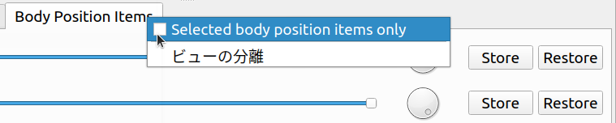

==========================
独自ビューのサンプル（S11）
==========================

.. contents:: 目次
   :local:

概要
----

本節では :doc:`create-view` のサンプルとして、 :doc:`item-creation-io-customization-sample` にBodyPositionアイテムを操作するための独自のビューを追加したものを提示します。

ソースコード
------------

.. highlight:: cpp

本サンプルのソースコードは以下のファイルで構成されています。

* DevGuidePlugin.cpp

* BodyPositionItem.h

* BodyPositionItem.cpp

* BodyPositionItemRegistration.cpp

* BodyPositionItemView.h

* BodyPositionItemView.cpp

最初の4つについては :doc:`item-creation-io-customization-sample` の構成と同じです。
最後の2つが今回のサンプルで追加されたソースファイルで、独自ビューのソースコードになります。
以下では既存ファイルの変更点と、追加ファイルの内容を掲載します。

BodyPositionItem.h
~~~~~~~~~~~~~~~~~~

BodyPositionItemの定義では、メンバ関数を3つ追加しています。それ以外は先のサンプルと同じです。以下では追加部分を強調表示しています。

.. code-block:: cpp
 :emphasize-lines: 36,37,47,48,49

 #ifndef DEVGUIDE_PLUGIN_BODY_POSITION_ITEM_H
 #define DEVGUIDE_PLUGIN_BODY_POSITION_ITEM_H
 
 #include <cnoid/Item>
 #include <cnoid/RenderableItem>
 #include <cnoid/BodyItem>
 #include <cnoid/SceneGraph>
 #include <cnoid/SceneDrawables>
 #include <cnoid/Selection>
 
 class BodyPositionItem : public cnoid::Item, public cnoid::RenderableItem
 {
 public:
     static void initializeClass(cnoid::ExtensionManager* ext);

     BodyPositionItem();
     BodyPositionItem(const BodyPositionItem& org);
     void setPosition(const cnoid::Isometry3& T);
     const cnoid::Isometry3& position() const { return position_; }
     void storeBodyPosition();
     void restoreBodyPosition();
     virtual cnoid::SgNode* getScene() override;
     bool setFlagHeight(double height);
     double flagHeight() const { return flagHeight_; }
     enum ColorId { Red, Green, Blue };
     bool setFlagColor(int colorId);
     double flagColor() const { return flagColorSelection.which(); }
 
     enum LengthUnit { Meter, Millimeter };
     enum AngleUnit { Degree, Radian };
     bool loadBodyPosition(
         const std::string& filename, LengthUnit lengthUnit, AngleUnit anguleUnit, std::ostream& os);
     bool saveBodyPosition(
         const std::string& filename, LengthUnit lengthUnit, AngleUnit anguleUnit, std::ostream& os);
 
     // 以下を追加
     static cnoid::SignalProxy<void()> sigItemsInProjectChanged();
 
 protected:
     virtual Item* doDuplicate() const override;
     virtual void onTreePathChanged() override;
     virtual void doPutProperties(cnoid::PutPropertyFunction& putProperty) override;
     virtual void notifyUpdate() override;
     virtual bool store(cnoid::Archive& archive) override;
     virtual bool restore(const cnoid::Archive& archive) override;

     // 以下を追加
     virtual void onConnectedToRoot() override;
     virtual void onDisconnectedFromRoot() override;
     
 private:
     void createFlag();
     void updateFlagPosition();
     void updateFlagMaterial();
 
     cnoid::BodyItem* bodyItem;
     cnoid::Isometry3 position_;
     cnoid::SgPosTransformPtr flag;
     double flagHeight_;
     cnoid::Selection flagColorSelection;
     cnoid::SgMaterialPtr flagMaterial;
 };
 
 typedef cnoid::ref_ptr<BodyPositionItem> BodyPositionItemPtr;
 
 #endif // DEVGUIDE_PLUGIN_BODY_POSITION_ITEM_H

BodyPositionItem.cpp
~~~~~~~~~~~~~~~~~~~~

BodyPositionItem.cppでは、追加したシグナルの実装のため以下のコードをファイルの最後に追加します。
それ以外は先のサンプルと同じです。

.. code-block:: cpp

 namespace {
 
 Signal<void()> sigItemsInProjectChanged_;
 
 }
 
 SignalProxy<void()> BodyPositionItem::sigItemsInProjectChanged()
 {
     return sigItemsInProjectChanged_;
 }
 
 void BodyPositionItem::onConnectedToRoot()
 {
     sigItemsInProjectChanged_();
 }
 
 void BodyPositionItem::onDisconnectedFromRoot()
 {
     sigItemsInProjectChanged_();
 }

BodyPositionItemRegistration.cpp
~~~~~~~~~~~~~~~~~~~~~~~~~~~~~~~~

このファイルは先のサンプルと同じ内容です。

BodyPositionItemView.h
~~~~~~~~~~~~~~~~~~~~~~

独自ビューであるBodyPositionItemViewクラスのヘッダファイルです。 ::

 #ifndef DEVGUIDE_PLUGIN_BODY_POSITION_ITEM_VIEW_H
 #define DEVGUIDE_PLUGIN_BODY_POSITION_ITEM_VIEW_H
 
 #include "BodyPositionItem.h"
 #include <cnoid/View>
 #include <cnoid/ConnectionSet>
 #include <cnoid/Slider>
 #include <cnoid/Dial>
 #include <cnoid/Buttons>
 #include <QLabel>
 #include <QGridLayout>
 #include <vector>
 #include <memory>
 
 class BodyPositionItemView : public cnoid::View
 {
 public:
     BodyPositionItemView();
 
 protected:
     virtual void onActivated() override;
     virtual void onDeactivated() override;
     virtual void onAttachedMenuRequest(cnoid::MenuManager& menuManager) override;
     virtual bool storeState(cnoid::Archive& archive) override;
     virtual bool restoreState(const cnoid::Archive& archive) override;
 
 private:
     enum TargetMode { All, Selected };
     void setTargetMode(TargetMode mode);
     void updateTargetItems();
     void updateInterface(int index);
     void onHeightSliderValueChanged(int index, int value);
     void onOrientationDialValueChanged(int index, int value);
     void onStoreButtonClicked(int index);
     void onRestoreButtonClicked(int index);
     
     TargetMode targetMode;
     cnoid::Connection connectionForTargetDetection;
     cnoid::ScopedConnectionSet itemConnections;
 
     struct InterfaceUnit
     {
         BodyPositionItemPtr item;
         QLabel* nameLabel;
         cnoid::Slider* heightSlider;
         cnoid::Dial* orientationDial;
         cnoid::PushButton* storeButton;
         cnoid::PushButton* restoreButton;
         cnoid::ConnectionSet connections;
 
         ~InterfaceUnit();
     };

     std::vector<std::unique_ptr<InterfaceUnit>> interfaceUnits;

     QGridLayout* grid;
 };
 
 #endif // DEVGUIDE_PLUGIN_BODY_POSITION_ITEM_VIEW_H

BodyPositionItemView.cpp
~~~~~~~~~~~~~~~~~~~~~~~~

独自ビューであるBodyPositionItemViewクラスの実装ファイルです。 ::

 #include "BodyPositionItemView.h"
 #include <cnoid/RootItem>
 #include <cnoid/ItemList>
 #include <cnoid/EigenUtil>
 #include <cnoid/MenuManager>
 #include <cnoid/Archive>
 
 using namespace std;
 using namespace cnoid;
 
 BodyPositionItemView::BodyPositionItemView()
 {
     setDefaultLayoutArea(BottomCenterArea);
 
     grid = new QGridLayout;
     setLayout(grid, 1.0);
 
     targetMode = All;
 }
 
 void BodyPositionItemView::onActivated()
 {
     setTargetMode(targetMode);
 }
 
 void BodyPositionItemView::setTargetMode(TargetMode mode)
 {
     if(mode != targetMode || !connectionForTargetDetection.connected()){
         targetMode = mode;
         if(isActive()){
             if(mode == All){
                 connectionForTargetDetection =
                     BodyPositionItem::sigItemsInProjectChanged().connect(
                         [this](){ updateTargetItems(); });
             } else if(mode == Selected){
                 connectionForTargetDetection =
                     RootItem::instance()->sigSelectedItemsChanged().connect(
                         [this](const ItemList<>&){ updateTargetItems(); });
             }
             updateTargetItems();
         }
     }
 }
 
 void BodyPositionItemView::onDeactivated()
 {
     connectionForTargetDetection.disconnect();
 }
 
 void BodyPositionItemView::updateTargetItems()
 {
     ItemList<BodyPositionItem> items;
     if(targetMode == All){
         items = RootItem::instance()->descendantItems<BodyPositionItem>();
     } else if(targetMode == Selected){
         items = RootItem::instance()->selectedItems<BodyPositionItem>();
     }
 
     size_t prevSize = interfaceUnits.size();
     interfaceUnits.resize(items.size());
 
     for(size_t i = prevSize; i < interfaceUnits.size(); ++i){
         auto& unit = interfaceUnits[i];
         unit.reset(new InterfaceUnit);
 
         unit->nameLabel = new QLabel(this);
         
         unit->heightSlider = new Slider(Qt::Horizontal, this);
         unit->heightSlider->setRange(1, 3000);
         unit->connections.add(
             unit->heightSlider->sigValueChanged().connect(
                 [=](int value){ onHeightSliderValueChanged(i, value); }));
 
         unit->orientationDial = new Dial(this);
         unit->orientationDial->setRange(-180, 180);
         unit->connections.add(
             unit->orientationDial->sigValueChanged().connect(
                 [=](int value){ onOrientationDialValueChanged(i, value); }));
  
         unit->storeButton = new PushButton("Store", this);
         unit->storeButton->sigClicked().connect(
             [=](){ onStoreButtonClicked(i); });
         
         unit->restoreButton = new PushButton("Restore", this);
         unit->restoreButton->sigClicked().connect(
             [=](){ onRestoreButtonClicked(i); });
 
         grid->addWidget(unit->nameLabel, i, 0);
         grid->addWidget(unit->heightSlider, i, 1);
         grid->addWidget(unit->orientationDial, i, 2);
         grid->addWidget(unit->storeButton, i, 3);
         grid->addWidget(unit->restoreButton, i, 4);
     }
 
     itemConnections.disconnect();
     for(size_t i =0; i < items.size(); ++i){
         auto& item = items[i];
         auto& unit = interfaceUnits[i];
         unit->item = item;
         unit->nameLabel->setText(item->name().c_str());
         itemConnections.add(
             item->sigUpdated().connect(
                 [=](){ updateInterface(i); }));
         updateInterface(i);
     }
 }
 
 void BodyPositionItemView::updateInterface(int index)
 {
     auto& unit = interfaceUnits[index];
     auto& item = unit->item;
     unit->connections.block();
     unit->heightSlider->setValue(item->flagHeight() * 1000);
     auto rpy = rpyFromRot(item->position().linear());
     unit->orientationDial->setValue(degree(rpy.z()));
     unit->connections.unblock();
 }
 
 void BodyPositionItemView::onHeightSliderValueChanged(int index, int value)
 {
     interfaceUnits[index]->item->setFlagHeight(value / 1000.0);
 }
 
 void BodyPositionItemView::onOrientationDialValueChanged(int index, int value)
 {
     auto item = interfaceUnits[index]->item;
     auto T = item->position();
     auto rpy = rpyFromRot(T.linear());
     rpy.z() = radian(value);
     T.linear() = rotFromRpy(rpy);
     item->setPosition(T);
 }
 
 void BodyPositionItemView::onStoreButtonClicked(int index)
 {
     interfaceUnits[index]->item->storeBodyPosition();
 }
 
 void BodyPositionItemView::onRestoreButtonClicked(int index)
 {
     interfaceUnits[index]->item->restoreBodyPosition();
 }
 
 void BodyPositionItemView::onAttachedMenuRequest(cnoid::MenuManager& menuManager)
 {
     auto modeCheck = menuManager.addCheckItem("Selected body position items only");
     modeCheck->setChecked(targetMode == Selected);
     modeCheck->sigToggled().connect(
         [this](bool on){ setTargetMode(on ? Selected : All); });
     menuManager.addSeparator();
 }
 
 bool BodyPositionItemView::storeState(cnoid::Archive& archive)
 {
     archive.write("target_mode", (targetMode == All) ? "all" : "selected");
     return true;
 }
 
 bool BodyPositionItemView::restoreState(const cnoid::Archive& archive)
 {
     string mode;
     if(archive.read("target_mode", mode)){
         if(mode == "all"){
             setTargetMode(All);
         } else if(mode == "selected"){
             setTargetMode(Selected);
         }
     }
     return true;
 }
 
 BodyPositionItemView::InterfaceUnit::~InterfaceUnit()
 {
     delete nameLabel;
     delete heightSlider;
     delete orientationDial;
     delete storeButton;
     delete restoreButton;
 }

DevGuidePlugin.cpp
~~~~~~~~~~~~~~~~~~

このファイルはこれまでのサンプルとほぼ同じですが、独自ビューであるBodyPositionItemViewの登録のためのコードを追加しています。
以下では追加部分を強調表示しています。

.. code-block:: cpp
 :emphasize-lines: 3,4,11,12,29,30,31

 #include "BodyPositionItem.h"

 // 以下を追加
 #include "BodyPositionItemView.h"

 #include <cnoid/Plugin>
 #include <cnoid/ToolBar>
 #include <cnoid/RootItem>
 #include <cnoid/ItemList>
 
 // 以下を追加
 #include <cnoid/ViewManager>

 using namespace cnoid;
 
 class DevGuidePlugin : public Plugin
 {
 public:
     DevGuidePlugin()
         : Plugin("DevGuide")
     {
         require("Body");
     }
         
     virtual bool initialize() override
     {
         BodyPositionItem::initializeClass(this);

         // 以下を追加 
         viewManager().registerClass<BodyPositionItemView>(
             "BodyPositionItemView", "Body Position Items");
         
         auto toolBar = new ToolBar("BodyPositionBar");
         toolBar->addButton("Store Body Positions")->sigClicked().connect(
             [this](){ storeBodyPositions(); });
         toolBar->addButton("Restore Body Positions")->sigClicked().connect(
             [this](){ restoreBodyPositions(); });
         toolBar->setVisibleByDefault();
         addToolBar(toolBar);
 
         return true;
     }
             
     void storeBodyPositions()
     {
         for(auto& item : RootItem::instance()->selectedItems<BodyPositionItem>()){
             item->storeBodyPosition();
         }
     }
     
     void restoreBodyPositions()
     {
         for(auto& item : RootItem::instance()->selectedItems<BodyPositionItem>()){
             item->restoreBodyPosition();
         }
     }
 };
 
 CNOID_IMPLEMENT_PLUGIN_ENTRY(DevGuidePlugin)

CMakeLists.txt
~~~~~~~~~~~~~~

CMakeLists.txtについては、 :doc:`item-creation-io-customization-sample` で作成したものに、BodyPositionItemView.cppもビルド対象のファイルとして加えるだけです。例えばChoreonoid本体のビルド環境でビルドする場合は以下になります。 ::

 set(sources
   DevGuidePlugin.cpp
   BodyPositionItem.cpp
   BodyPositionItemCusomization.cpp
   BodyPositionItemView.cpp)

 choreonoid_add_plugin(CnoidDevGuidePlugin ${sources})
 target_link_libraries(CnoidDevGuidePlugin CnoidBodyPlugin)

sourcesに設定するファイルの数が多くなってきたので、ここではファイルごとに改行を入れるようにしています。

BodyPositionItemビューの使い方
------------------------------

本サンプルを導入すると、"BodyPositionItemビュー" というビューを利用できるようになります。
これはChoreonoid起動後にメインメニューの「表示」−「ビューの表示」から「Body Position Items」のチェックを入れることで表示されます。通常はメインウィンドウ上でメッセージビューが表示されている中央下部の領域に表示されます。

これまでと同様にPA10Pickupのサンプルでこれを試してみましょう。
プロジェクトを読み込んで、そこにいくつかのBodyPositionアイテムが導入されているとしましょう。
この状況でBodyPositionItemビューを表示すると、その領域には以下のような表示がされるかと思います。

.. image:: images/body-position-item-view.png
    :scale: 70%

ここではプロジェクトに3つのBodyPositionアイテムが導入されており、それぞれに対応するインタフェースがアイテム名のラベルとともに横に並んでいます。ここでアイテム名の右隣のスライダーは、旗の高さに対応するもので、このスライダーを操作することで該当アイテムの旗の高さを変えることができます。また、そのさらに右隣のダイアルは、記録姿勢のヨー軸向きに対応するもので、こちらもダイアルを操作することで該当アイテムの向きを変えることができます。これらの操作ではスライダやダイアルの動きとシーンビュー上の旗の表示が連動しますので、試してみてください。

そして最後に2つのボタンがあり、それぞれモデルの現在位置を記録するStore操作と、記録された位置をモデルに呼び出すRestore操作になります。これらは :doc:`new-item-type-sample` で導入したツールバーである「BodyPositionバー」と同じ機能になりますが、各BodyPositionアイテムごとに個別に操作できる点が異なります。

さらにこのビューは対象とするBodyPositionアイテムの決定について2つのモードを有しています。
デフォルトのモードでは、上記の例のように、プロジェクトに含まれる全てのBodyPositionアイテムが対象となります。
これについて、「選択しているBodyPositionアイテムのみを対象とする」モードも利用可能です。
このモードに切り替える場合は、ビューの「付属メニュー」を使用します。
これはビューのタブ部分を右クリックすると表示されるメニューで、BodyPositionItemビューでは以下のようなメニューが表示されます。

ここで "Selected body position item only" のチェックを入れると、選択しているBodyPositionアイテムのみがこのビューの対象となります。チェックを入れたときにBodyPositionアイテムが何も選択されていなければ、ビューの表示が空になるかと思いますが、適当なアイテムを選択して、それがビューの操作対象になることを確認してください。

最後にビューを表示した状態でプロジェクトを保存しましょう。
まずメインメニューの「ファイル」−「プロジェクトファイルオプション」−「レイアウト」のチェックが入っているか確認してください。
このチェックが入っていない場合は、入れておくようにします。
するとプロジェクト保存時にビューの表示位置も記録されるようになります。

その状態でプロジェクトを保存し、保存したプロジェクトを読み込みなおしてください。するとBodyPositionItemビューについても保存時と同じ位置に表示されるかと思います。そして対象アイテムのモードについても保存時と同じ状態になります。

ソースコードの解説
------------------

本サンプルのソースコードについて、ファイルごとに解説します。
なお、既存のソースを改良した部分については、改良部分だけ解説します。

BodyPositionItem.h
~~~~~~~~~~~~~~~~~~

BodyPositionItemクラスでは、現在プロジェクトに存在する（＝アイテムツリー内に存在する）インスタンスの変化を通知するためのシグナルを追加し、そのシグナルに関わる処理を実装しています。このシグナルを用いて、BodyPositionItemビューで「全てのBodyPositionアイテムを対象とする」モードを実現しています。

まず ::

 static cnoid::SignalProxy<void()> sigItemsInProjectChanged();

が今回追加したシグナルです。これはプロジェクト内のBodyPositionアイテムの存在が変化したときに送出されます。
これは静的メンバ関数なので、インスタンスとは独立して利用することができます。

そしてItemクラスのvirtual関数である以下の2つの関数のオーバーライドを追加しています。 ::

 virtual void onConnectedToRoot() override;
 virtual void onDisconnectedFromRoot() override;

これらの関数の意味と処理内容については次の実装ファイルのところで解説します。

BodyPositionItem.cpp
~~~~~~~~~~~~~~~~~~~~

BodyPositionItem.cppに追加された部分を解説します。

まず以下の部分で上記のシグナルの実体を定義しています。 ::

 namespace {
 
 Signal<void()> sigItemsInProjectChanged_;
 
 }

こちらは関数と名前が衝突しないように、最後にアンダースコアを付与しています。
また無名名前空間で囲うことで、この実装ファイルにローカルの定義としています。 ::

 SignalProxy<void()> BodyPositionItem::sigItemsInProjectChanged()
 {
     return sigItemsInProjectChanged_;
 }

シグナルをProxyとして返すメンバ関数を実装しています。 ::

 void BodyPositionItem::onConnectedToRoot()
 {
     sigItemsInProjectChanged_();
 }

ここではItemクラスのvirtual関数のうち :ref:`plugin-dev-item-virtual-function-on-item-tree` として、onConnectedToRoot関数をオーバーライドしています。これはアイテムがルートアイテムと接続された時に呼ばれる関数で、このときアイテムがプロジェクトに追加されたとみなすことができます。このタイミングでシグナルを送出して、アイテムが追加されたことを通知しています。 ::

 void BodyPositionItem::onDisconnectedFromRoot()
 {
     sigItemsInProjectChanged_();
 }

こちらも :ref:`アイテムツリーに関するvirtual関数` で、アイテムがルートアイテムから切り離された時に呼ばれます。このときアイテムがプロジェクトから削除されたことになります。そしてこのタイミングでシグナルを送出して、アイテムが削除されたことを通知しています。

.. note:: このシグナルを使わなくても、 :ref:`plugin-dev-item-operations-signals` で紹介したRootItemクラスのsigItemAddedシグナルとsigItemRemovedシグナルを利用することでも、プロジェクト内に存在するアイテムの変化を検知することができます。ただしそれらのシグナルは全てのアイテム型が対象となるため、BodyPositionアイテム以外のアイテムでもスロット関数が呼ばれることになります。これに対して今回実装したシグナルでは、BodyPositionItemのみが処理の対象となるので、より効率的に処理できます。

BodyPositionItemView.h
~~~~~~~~~~~~~~~~~~~~~~

このファイルについては、主にインクルードしているヘッダとメンバ変数について解説します。
メンバ関数については次の実装ファイルのところで解説します。 ::

 #include "BodyPositionItem.h"
 #include <cnoid/View>
 #include <cnoid/ConnectionSet>

クラスの定義に必要なBodyPositionItem、View、ConnectionSetの各クラスのヘッダをインクルードしています。 ::

 #include <cnoid/Slider>
 #include <cnoid/Dial>
 #include <cnoid/Buttons>
 #include <QLabel>
 #include <QGridLayout>

これらはビューのインタフェースの実装に使用しているQtのクラスのヘッダです。
Slider、Dial、Buttonsについては、Qtの対応するクラスをChoreonoid用に拡張したもので、Choreonoid形式のシグナルを利用できるようになっています。これらはBaseモジュールで定義されています。 ::

 #include <vector>
 #include <memory>
 
標準C++ライブラリのヘッダです。std::vectorとstd::unique_ptrを使用するためにインクルードしています。
これらは実際には他のヘッダのインクルード時にインクルードされるので、書かなくてもコンパイルはできますが、メンバ変数等で明示的に利用しているクラスについては、このように明示的にインクルードするのがよいかと思います。 ::

 enum TargetMode { All, Selected };

対象アイテムの取得に関するモードを表す列挙型です。Allは全てのBodyPositionアイテムが対象となるモードを表していて、Selectedは選択しているアイテムのみが対象となるモードを表しています。 ::

 TargetMode targetMode;

上記モードを格納する変数です。 ::

 cnoid::Connection connectionForTargetDetection;

対象アイテムの取得に関わるシグナルとの接続を保持する変数です。 ::

 cnoid::ScopedConnectionSet itemConnections;

各アイテムの更新を伝えるシグナルとの接続を保有する変数です。 ::

 struct InterfaceUnit
 {
     BodyPositionItemPtr item;
     QLabel* nameLabel;
     cnoid::Slider* heightSlider;
     cnoid::Dial* orientationDial;
     cnoid::PushButton* storeButton;
     cnoid::PushButton* restoreButton;
     cnoid::ConnectionSet connections;
     
     ~InterfaceUnit();
 };

アイテムごとのインタフェース一式を格納する構造体です。
格納しているオブジェクトの破棄を行うデストラクタも備えています。 ::

 std::vector<std::unique_ptr<InterfaceUnit>> interfaceUnits;

対象アイテムの数だけ上記構造体を格納する配列です。要素はunique_ptrとして、要素が削除される際にInterfaceUnitのデストラクタが呼ばれるようにしています。 ::

 QGridLayout* grid;

インタフェースをビュー上に配置するためのグリッドレイアウトです。

BodyPositionItemView.cpp
~~~~~~~~~~~~~~~~~~~~~~~~

BodyPositionItemViewクラスの実装内容について解説します。 ::

 #include "BodyPositionItemView.h"
 #include <cnoid/RootItem>
 #include <cnoid/ItemList>
 #include <cnoid/EigenUtil>
 #include <cnoid/MenuManager>
 #include <cnoid/Archive>

ここでインクルードしているヘッダについては、これまでのサンプルで使用してきたものになります。 ::

 BodyPositionItemView::BodyPositionItemView()
 {
     setDefaultLayoutArea(BottomCenterArea);
 
     grid = new QGridLayout;
     setLayout(grid, 1.0);
 
     targetMode = All;
 }

ビューのコンストラクタです。
ここでは :ref:`plugin-dev-view-initialization` で紹介したsetDefaultLayout関数を用いて、デフォルトで表示される領域をメインウィンドウの中央下部（BottomCenterArea）としています。
そしてビューのトップレベルのレイアウトオブジェクトとして、QGridLayoutを生成しセットしています。
また対象アイテム取得モードを「全てのBodyPositionアイテムを対象とする」モードである "All" に初期化しています。 ::

 void BodyPositionItemView::onActivated()
 {
     setTargetMode(targetMode);
 }

:ref:`plugin-dev-view-state-detection` で紹介したように、ビューが表示されてアクティブになったときにこの関数が呼ばれます。
このタイミングでsetTargetMode関数を実行して、対象アイテムの検知処理を開始します。 ::

 void BodyPositionItemView::setTargetMode(TargetMode mode)
 {
     if(mode != targetMode || !connectionForTargetDetection.connected()){
         targetMode = mode;
         if(isActive()){
             ...
         }
     }
 }

対象アイテムの取得モードを設定し、モードに対応した対象アイテム検知処理を開始します。 
まずモードの更新は引数で指定されたモードが現在のモードと異なるか、まだ検知処理が開始していない（検知用のシグナルと接続されていない）場合に行います。モード変数targetModeの更新後、isActive関数によってビューが現在アクティブかどうかをチェックし、アクティブの場合にのみ検知処理を開始します。アクティブでなければビューの表示も操作もされないので、検知処理をしても無駄になるからです。
アクティブでないときにこの関数が呼ばれたとしても、その後アクティブになれば上記のonActivatedで再度この関数が呼ばれるので、問題ありません。

ビューがアクティブのときの処理内容は以下になります。 ::

 if(mode == All){
     connectionForTargetDetection =
         BodyPositionItem::sigItemsInProjectChanged().connect(
             [this](){ updateTargetItems(); });
 } else if(mode == Selected){
     connectionForTargetDetection =
         RootItem::instance()->sigSelectedItemsChanged().connect(
             [this](const ItemList<>&){ updateTargetItems(); });
 }
 updateTargetItems();

ここではモードごとに異なる検知処理を仕掛けています。
modeがAllのときは、BodyPositionItemに追加したsigItemsInProjectChangedシグナルを使用して、BodyPositionItemの追加や削除を検知し、その度にupdateTragetItemsを実行して対象アイテムを更新します。modeがSelectedのときは、RootItemのsigSelectedItemsChangedシグナル（ :ref:`plugin-dev-item-operations-signals` 参照）を用いて、選択されているアイテムの変化を検知し、その度にやはり対象アイテムを更新します。
いずれの場合も、この関数が呼ばれた時点での状態で対象アイテムを更新するため、最後に直接updateTargetItemsを実行しています。 ::

 void BodyPositionItemView::onDeactivated()
 {
     connectionForTargetDetection.disconnect();
 }

ビューがアクティブでなくなったときに呼ばれる関数です。
ここで対象アイテムの検知に用いているシグナルとの接続を解除し、検知処理を停止します。
これによって無駄な検知処理を避けるようにしています。 ::

 void BodyPositionItemView::updateTargetItems()
 {
     ...
 }

対象アイテムを更新する関数です。以下でその内容を解説します。 ::

 ItemList<BodyPositionItem> items;
 if(targetMode == All){
     items = RootItem::instance()->descendantItems<BodyPositionItem>();
 } else if(targetMode == Selected){
     items = RootItem::instance()->selectedItems<BodyPositionItem>();
 }

BodyPositionItemを対象としたItemListであるitemsに対象アイテムを格納します。
モードがAllのときは :ref:`plugin-dev-item-detection` で紹介したdescendantItems関数をRootItemに対して実行して、ルート以下の全アイテムからBodyPositionItem型のものを取得します。モードがSelectedであるときは、RootItem以下で選択されているBodyPositionItemを取得します。 ::

 size_t prevSize = interfaceUnits.size();
 interfaceUnits.resize(items.size());

インタフェースを格納する配列のサイズを対象アイテムの数にリサイズしています。
追加分になるインタフェースは以下で生成します。 ::

 for(size_t i = prevSize; i < interfaceUnits.size(); ++i){
     auto& unit = interfaceUnits[i];
     unit.reset(new InterfaceUnit);
 
     unit->nameLabel = new QLabel(this);
         
     unit->heightSlider = new Slider(Qt::Horizontal, this);
     unit->heightSlider->setRange(1, 3000);
     unit->connections.add(
         unit->heightSlider->sigValueChanged().connect(
             [=](int value){ onHeightSliderValueChanged(i, value); }));
 
     unit->orientationDial = new Dial(this);
     unit->orientationDial->setRange(-180, 180);
     unit->connections.add(
         unit->orientationDial->sigValueChanged().connect(
             [=](int value){ onOrientationDialValueChanged(i, value); }));
  
     unit->storeButton = new PushButton("Store", this);
     unit->storeButton->sigClicked().connect(
         [=](){ onStoreButtonClicked(i); });
         
     unit->restoreButton = new PushButton("Restore", this);
     unit->restoreButton->sigClicked().connect(
         [=](){ onRestoreButtonClicked(i); });
 
     grid->addWidget(unit->nameLabel, i, 0);
     grid->addWidget(unit->heightSlider, i, 1);
     grid->addWidget(unit->orientationDial, i, 2);
     grid->addWidget(unit->storeButton, i, 3);
     grid->addWidget(unit->restoreButton, i, 4);
 }
 
対象アイテムごとのインタフェースの構成要素のウィジェットを生成して、初期化しています。
ユーザが操作するものについては、操作を知らせるシグナルに処理関数を接続しています。
なおスライダの位置については整数値で表現されるので、ここでは値の範囲を1〜3000として、ミリメートルの値に対応させるようにしています。またダイアルの位置についても整数値で表現されるので、ラジアンではなく度の値に対応させるようにしています。

最後にgridレイアウトを用いて生成したウィジェットを配置しています。配列のi番目の要素であるi番目のアイテムに対して、i行の位置に配置して並べています。 ::

 itemConnections.disconnect();
 for(size_t i =0; i < items.size(); ++i){
     auto& item = items[i];
     auto& unit = interfaceUnits[i];
     unit->item = item;
     unit->nameLabel->setText(item->name().c_str());
     itemConnections.add(
         item->sigUpdated().connect(
             [=](){ updateInterface(i); }));
     updateInterface(i);
 }

各インタフェースに対応するアイテムの設定をしています。
名前のラベルをアイテムの名前で更新し、アイテムの更新を知らせるsigUpdatedシグナルにupdateInterface関数を結びつけています。
最後にこの関数を直接実行して、この時点でのアイテムの状態をインタフェースに反映させています。 ::

 void BodyPositionItemView::updateInterface(int index)
 {
     auto& unit = interfaceUnits[index];
     auto& item = unit->item;
     unit->connections.block();
     unit->heightSlider->setValue(item->flagHeight() * 1000);
     auto rpy = rpyFromRot(item->position().linear());
     unit->orientationDial->setValue(degree(rpy.z()));
     unit->connections.unblock();
 }

現在のアイテムの状態でインタフェースを更新する関数です。旗の高さと記録姿勢のYaw軸角度をそれぞれ対応するスライダとダイアルに設定しています。この際ウィジェット操作のシグナル接続を格納しているconnectionsにブロックをかけて、ウィジェットの更新処理が再度アイテムの更新処理にまわって、処理が冗長になることを防いでいます。 ::

 void BodyPositionItemView::onHeightSliderValueChanged(int index, int value)
 {
     interfaceUnits[index]->item->setFlagHeight(value / 1000.0);
 }

スライダが操作されてその現在位置が変化したときに呼ばれる関数です。
スライダ位置の単位はミリメートルとしたので、その値をメートルに変換した上で対象アイテムに設定しています。 ::

 void BodyPositionItemView::onOrientationDialValueChanged(int index, int value)
 {
     auto item = interfaceUnits[index]->item;
     auto T = item->position();
     auto rpy = rpyFromRot(T.linear());
     rpy.z() = radian(value);
     T.linear() = rotFromRpy(rpy);
     item->setPosition(T);
 }

ダイアルが操作されてその回転位置が変化したときに呼ばれる関数です。
回転位置の単位は度としたので、その値をラジアンに変換した上で対象アイテムに設定しています。 ::

 void BodyPositionItemView::onStoreButtonClicked(int index)
 {
     interfaceUnits[index]->item->storeBodyPosition();
 }
 
 void BodyPositionItemView::onRestoreButtonClicked(int index)
 {
     interfaceUnits[index]->item->restoreBodyPosition();
 }

Storeボタン、Restoreボタンが押された時の処理です。それぞれ対象アイテムの対応する関数を実行しています。 ::

 void BodyPositionItemView::onAttachedMenuRequest(cnoid::MenuManager& menuManager)
 {
     auto modeCheck = menuManager.addCheckItem("Selected body position items only");
     modeCheck->setChecked(targetMode == Selected);
     modeCheck->sigToggled().connect(
         [this](bool on){ setTargetMode(on ? Selected : All); });
     menuManager.addSeparator();
 }

:ref:`plugin-dev-view-attached-menu` で紹介した関数で、ビューに付属するメニューが表示される際に呼ばれます。ここで対象アイテムを選択アイテムのモードに切り替える項目をチェック付きの項目としてメニューに追加しています。チェックが切り替えられた時の処理はチェック項目のsigToggledシグナルを用いて設定します。ここではsetTargetMode関数によってモードを切り替えるようにしています。最後にメニューの区切りとなるセパレータを追加しています。付属メニューについてはこのように最後にセパレータを追加して、組み込みの項目と区別できるようにするとよいでしょう。 ::

 bool BodyPositionItemView::storeState(cnoid::Archive& archive)
 {
     archive.write("target_mode", (targetMode == All) ? "all" : "selected");
     return true;
 }

:ref:`plugin-dev-view-project-save` を行う関数です。
ここで対象アイテム取得モードを記録するようにしています。 ::

 bool BodyPositionItemView::restoreState(const cnoid::Archive& archive)
 {
     string mode;
     if(archive.read("target_mode", mode)){
         if(mode == "all"){
             setTargetMode(All);
         } else if(mode == "selected"){
             setTargetMode(Selected);
         }
     }
     return true;
 }

こちらはビューの状態復帰用の関数で、プロジェクトファイルに記録されたビューの状態を復帰する処理を記述します。
ここでは対象アイテム取得モードを復帰するようにしています。 ::

 BodyPositionItemView::InterfaceUnit::~InterfaceUnit()
 {
     delete nameLabel;
     delete heightSlider;
     delete orientationDial;
     delete storeButton;
     delete restoreButton;
 }

InterfaceUnit構造体のデストラクタです。
こちらはBodyPositionItemView本体のupdateTargetItems関数で ::

 interfaceUnits.resize(items.size());

を実行する際に、配列サイズが小さくなって既存の要素が削除される際に実行されます。
構造体が管理しているウィジェットはポインタで格納されており、それらのオブジェクトを削除するようにしています。
これによって必要のなくなったウィジェットが表示されなくなります。

.. note:: Qtのオブジェクトについてはスマートポインタで管理する仕組みはありません。Qtのオブジェクトには親子関係があり、通常親オブジェクトが削除される際に子オブジェクトも削除される仕組みとなっています。動的に生成されたQtのオブジェクトについて、親オブジェクトが無い場合や、親の削除とは異なるタイミングで削除したい場合は、今回の例のように明示的にdeleteする必要があります。

DevGuidePlugin.cpp
~~~~~~~~~~~~~~~~~~

プラグインクラスの実装ファイルです。
ここではinitialize関数に ::

 viewManager().registerClass<BodyPositionItemView>(
     "BodyPositionItemView", "Body Position Items");

を追加することで、上記のBodyPositionItemViewをシステムに登録しています。
この登録処理を行うことで、このビューが使えるようになります。

この登録用コードではVieManagerを使用しており、登録するBodyPositionItemViewの定義も必要となるため、ファイルの冒頭で ::

 #include "BodyPositionItem.h"
 ...
 #include <cnoid/ViewManager>
 ...

として、対応するヘッダをインクルードしています。

