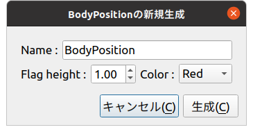
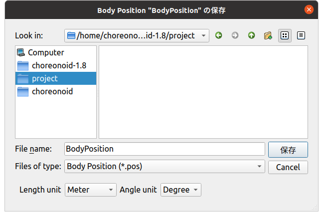
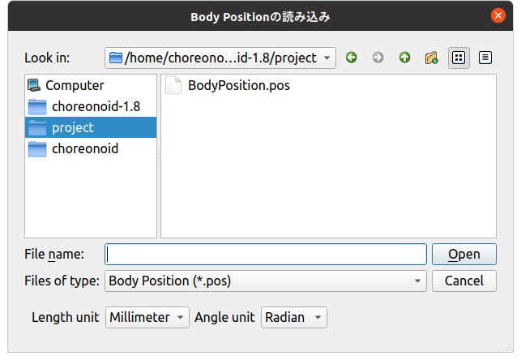

============================================================
プロジェクトアイテム生成／入出力のカスタマイズサンプル（S10）
============================================================

.. contents:: 目次
   :local:

概要
----

本節では :doc:`item-creation-io-customization` の例として、 :doc:`item-file-io-sample` を改良し、

* アイテムの新規作成時に旗の高さや色を指定できる
* アイテムのファイル保存／読み込み時に、長さと角度の単位を指定できる

ようにしたものを提示します。

ソースコード
------------

.. highlight:: cpp

今回のソースコードは :doc:`item-file-io-sample` について、新たにBodyPositionItemCustomization.cppというファイルを追加し、そこでオプションの実装と登録をするようにしています。これにともないBodyPositionItem.cppで記述していた登録処理は削除されます。またソースファイルの追加にあわせてCMakeLists.txtも修正しています。

以下では修正をしたソースファイルの修正箇所と、追加したBodyPositionItemCustomization.cppのソースコードを示します。

BodyPositionItem.cpp
~~~~~~~~~~~~~~~~~~~~
 
BodyPositionItem.cppについては、 :doc:`item-file-io-sample` とほぼ同じですが、アイテムの登録処理を行うinitializeClass関数を **削除** しています。このため、ソースの冒頭部分は以下のようになります。 ::

 #include "BodyPositionItem.h"
 #include <cnoid/ItemManager>
 #include <cnoid/MeshGenerator>
 #include <cnoid/EigenUtil>
 #include <cnoid/PutPropertyFunction>
 #include <cnoid/Archive>
 #include <cnoid/EigenArchive>
 #include <cnoid/YAMLReader>
 #include <cnoid/YAMLWriter>
 #include <fmt/format.h>

 using namespace std;
 using namespace fmt;
 using namespace cnoid;

 // ここに記述していた以下の関数を削除
 // void BodyPositionItem::initializeClass(ItemManager& manager)
 // {
 //     ...
 // }

 BodyPositionItem::BodyPositionItem()
 {
     ...

なお、今回のサンプルではBodyPositionItemクラスのloadBodyPosition関数とsaveBodyPosition関数も使用しなくなりますが、そちらは必ずしも削除する必要はありません。

BodyPositionItemCusomization.cpp
~~~~~~~~~~~~~~~~~~~~~~~~~~~~~~~~

このファイルには以下のソースコードを記述します。 ::
  
 #include "BodyPositionItem.h"
 #include <cnoid/ItemManager>
 #include <cnoid/ItemFileIO>
 #include <cnoid/ValueTree>
 #include <cnoid/EigenArchive>
 #include <cnoid/YAMLReader>
 #include <cnoid/YAMLWriter>
 #include <fmt/format.h>
 #include <QBoxLayout>
 #include <QLabel>
 #include <QLineEdit>
 #include <QDoubleSpinBox>
 #include <QComboBox>

 using namespace std;
 using namespace fmt;
 using namespace cnoid;

 namespace {

 class BodyPositionItemCreationPanel : public ItemCreationPanelBase<BodyPositionItem>
 {
     QLineEdit* nameEntry;
     QDoubleSpinBox* heightSpin;
     QComboBox* colorCombo;

 public:
     BodyPositionItemCreationPanel()
     {
	 auto vbox = new QVBoxLayout;
	 setLayout(vbox);

	 auto hbox1 = new QHBoxLayout;
	 hbox1->addWidget(new QLabel("Name :"));
	 nameEntry = new QLineEdit;
	 hbox1->addWidget(nameEntry);
	 vbox->addLayout(hbox1);

	 auto hbox2 = new QHBoxLayout;

	 hbox2->addWidget(new QLabel("Flag height :"));
	 heightSpin = new QDoubleSpinBox;
	 heightSpin->setRange(0.01, 9.99);
	 heightSpin->setDecimals(2);
	 heightSpin->setValue(1.0);
	 hbox2->addWidget(heightSpin);

	 hbox2->addWidget(new QLabel("Color :"));
	 colorCombo = new QComboBox;
	 colorCombo->addItem("Red");
	 colorCombo->addItem("Green");
	 colorCombo->addItem("Blue");
	 hbox2->addWidget(colorCombo);

	 vbox->addLayout(hbox2);
     }

     virtual bool initializeCreation(BodyPositionItem* protoItem, Item* parentItem) override
     {
	 nameEntry->setText(protoItem->name().c_str());
	 return true;
     }

     virtual bool updateItem(BodyPositionItem* protoItem, Item* parentItem) override
     {
	 protoItem->setName(nameEntry->text().toStdString());
	 protoItem->setFlagHeight(heightSpin->value());
	 protoItem->setFlagColor(colorCombo->currentIndex());

	 if(auto bodyItem = dynamic_cast<BodyItem*>(parentItem)){
	     protoItem->setPosition(bodyItem->body()->rootLink()->position());
	 }

	 return true;
     }
 };

 class BodyPositionItemFileIO : public ItemFileIoBase<BodyPositionItem>
 {
     enum LengthUnit { Meter, Millimeter } lengthUnit;
     enum AngleUnit { Degree, Radian } angleUnit;
     QWidget* panel;
     QComboBox* lengthUnitCombo;
     QComboBox* angleUnitCombo;

 public:
     BodyPositionItemFileIO()
	 : ItemFileIoBase<BodyPositionItem>(
	     "BODY-POSITION",
	     Load | Save | Options | OptionPanelForLoading | OptionPanelForSaving)
     {
	 setCaption("Body Position");
	 setExtension("pos");
	 resetOptions();
	 panel = nullptr;
     }

     virtual void resetOptions() override
     {
	 lengthUnit = Meter;
	 angleUnit = Degree;
     }

     virtual void storeOptions(Mapping* options) override
     {
	 if(lengthUnit == Millimeter){
	     options->write("length_unit", "millimeter");
	 } else {
	     options->write("length_unit", "meter");
	 }
	 if(angleUnit == Radian){
	     options->write("angle_unit", "radian");
	 } else {
	     options->write("angle_unit", "degree");
	 }
     }

     virtual bool restoreOptions(const Mapping* options) override
     {
	 string unit;
	 options->read("length_unit", unit);
	 if(unit == "millimeter"){
	     lengthUnit = Millimeter;
	 } else {
	     lengthUnit = Meter;
	 }
	 options->read("angle_unit", unit);
	 if(unit == "radian"){
	     angleUnit = Radian;
	 } else {
	     angleUnit = Degree;
	 }
	 return true;
     }

     QWidget* getOrCreateOptionPanel()
     {
	 if(!panel){
	     panel = new QWidget;
	     auto hbox = new QHBoxLayout;
	     panel->setLayout(hbox);

	     hbox->addWidget(new QLabel("Length unit"));
	     lengthUnitCombo = new QComboBox;
	     lengthUnitCombo->addItem("Meter");
	     lengthUnitCombo->addItem("Millimeter");
	     hbox->addWidget(lengthUnitCombo);

	     hbox->addWidget(new QLabel("Angle unit"));
	     angleUnitCombo = new QComboBox;
	     angleUnitCombo->addItem("Degree");
	     angleUnitCombo->addItem("Radian");
	     hbox->addWidget(angleUnitCombo);
	 }
	 return panel;
     }

     void fetchOptionPanel()
     {
	 if(lengthUnitCombo->currentIndex() == 0){
	     lengthUnit = Meter;
	 } else {
	     lengthUnit = Millimeter;
	 }
	 if(angleUnitCombo->currentIndex() == 0){
	     angleUnit = Degree;
	 } else {
	     angleUnit = Radian;
	 }
     }

     virtual QWidget* getOptionPanelForLoading() override
     {
	 return getOrCreateOptionPanel();
     }

     virtual void fetchOptionPanelForLoading() override
     {
	 fetchOptionPanel();
     }

     virtual bool load(BodyPositionItem* item, const std::string& filename) override
     {
	 YAMLReader reader;
	 MappingPtr archive;
	 try {
	     archive = reader.loadDocument(filename)->toMapping();
	 }
	 catch(const ValueNode::Exception& ex){
	     os() << ex.message() << endl;
	 }
	 double lengthRatio = 1.0;
	 if(lengthUnit == Millimeter){
	     lengthRatio /= 1000.0;
	 }

	 Isometry3 T = item->position();
	 Vector3 v;
	 if(read(archive, "translation", v)){
	     T.translation() = lengthRatio * v;
	 }
	 if(read(archive, "rotation", v)){
	     if(angleUnit == Degree){
		 v = radian(v);
	     }
	     T.linear() = rotFromRpy(v);
	 }
	 item->setPosition(T);

	 double height;
	 if(archive->read("flag_height", height)){
	     item->setFlagHeight(lengthRatio * height);
	 }
	 string color;
	 if(archive->read("flag_color", color)){
	     if(color == "red"){
		 item->setFlagColor(BodyPositionItem::Red);
	     } else if(color == "green"){
		 item->setFlagColor(BodyPositionItem::Green);
	     } else if(color == "blue"){
		 item->setFlagColor(BodyPositionItem::Blue);
	     }
	 }
	 return true;
     }

     virtual QWidget* getOptionPanelForSaving(BodyPositionItem* /* item */) override
     {
	 return getOrCreateOptionPanel();
     }

     virtual void fetchOptionPanelForSaving() override
     {
	 fetchOptionPanel();
     }

     virtual bool save(BodyPositionItem* item, const std::string& filename) override
     {
	 YAMLWriter writer;
	 if(!writer.openFile(filename)){
	     os() << format("Failed to open \"{0}\".", filename) << endl;
	     return false;
	 }

	 MappingPtr archive = new Mapping;
	 double lengthRatio = 1.0;
	 if(lengthUnit == Millimeter){
	     lengthRatio = 1000.0;
	 }
	 write(archive, "translation", Vector3(lengthRatio * item->position().translation()));
	 Vector3 rpy = rpyFromRot(item->position().linear());
	 if(angleUnit == Degree){
	     rpy = degree(rpy);
	 }
	 write(archive, "rotation", rpy);
	 archive->write("flag_height", lengthRatio * item->flagHeight());

	 switch(static_cast<int>(item->flagColor())){
	 case BodyPositionItem::Red:
	     archive->write("flag_color", "red");
	     break;
	 case BodyPositionItem::Green:
	     archive->write("flag_color", "green");
	     break;
	 case BodyPositionItem::Blue:
	     archive->write("flag_color", "blue");
	     break;
	 }

	 writer.putNode(archive);

	 return true;
     }
 };

 }

 void BodyPositionItem::initializeClass(ExtensionManager* ext)
 {
     ext->itemManager()
	 .registerClass<BodyPositionItem>("BodyPositionItem")
	 .addCreationPanel<BodyPositionItem>(new BodyPositionItemCreationPanel)
	 .addFileIO<BodyPositionItem>(new BodyPositionItemFileIO);
 }
 
CMakeLists.txt
~~~~~~~~~~~~~~

.. highlight:: cmake

CMakeLists.txtは基本的にはこれまでと同様のものになりますが、今回追加したソースファイルも記述しておく必要があります。

Choreonoid本体のビルド環境でビルドする場合は以下になります。 ::

 set(sources DevGuidePlugin.cpp BodyPositionItem.cpp BodyPositionItemCusomization.cpp)
 choreonoid_add_plugin(CnoidDevGuidePlugin ${sources})
 target_link_libraries(CnoidDevGuidePlugin CnoidBodyPlugin)

ソースファイルが増えてきたので一旦sourcesという変数にソースファイルの一覧を格納するようにしています。

Choreonoid本体とは独立してビルドする場合は以下になります。 ::

 cmake_minimum_required(VERSION 3.10)
 project(DevGuidePlugin)
 find_package(Choreonoid REQUIRED)
 set(CMAKE_CXX_STANDARD ${CHOREONOID_CXX_STANDARD})
 set(sources DevGuidePlugin.cpp BodyPositionItem.cpp BodyPositionItemCusomization.cpp)
 choreonoid_add_plugin(CnoidDevGuidePlugin ${sources})
 target_link_libraries(CnoidDevGuidePlugin Choreonoid::CnoidBody)

追加設定項目の利用方法
----------------------

このプラグインを導入するとアイテムの生成とファイル入出力に設定項目が追加されます。これを試してみましょう。

これまでと同様にPA10Pickupなどの適当なプロジェクトを読み込んで、Bodyアイテムに対してBodyPositionアイテムを生成します。
対象のボディアイテムを選択して、メインメニューの「ファイル」−「新規」−「BodyPosition」を選択します。
すると以下の新規生成ダイアログが表示されます。

これまでの新規生成ダイアログではアイテム名のみ指定できましたが、今回のダイアログでは "Flag height" と "Color" も指定できるようになっています。これらか今回実装した設定項目になります。それぞれ旗の高さと色に対応するもので、高さについては数値入力用のスピンボックスを用いて値を入力できます。色についてはコンボボックスをクリックすると選択肢が表示されるので、その中から選択して指定することができます。

名前やオプションの設定が完了したら、「生成」ボタンを押すと、BodyPositionアイテムが生成されます。
生成されたアイテムにチェックを入れて旗を表示してください。
旗の高さや色についてダイアログで設定した状態に最初からなっていることを確認できるかと思います。
さらに、Bodyアイテムを選択した（Bodyアイテムが親になる）状態で生成した場合は、BodyPositionアイテムの記録位置が最初から親のBodyアイテムの位置に一致した状態となります。これは今回の設定項目とともに追加された挙動です。
:doc:`item-creation-io-customization` によってこのような初期化処理も実装できます。

次にBodyPositionアイテムのファイル保存を行ってみましょう。
アイテムを選択して、「ファイル」−「名前を付けて選択アイテムを保存」を実行すると、以下の保存ダイアログが表示されます。

ここでダイアログの下部に注目してください。
"Length unit" と "Angle unit" を選択するコンボボックスが表示されていることを確認できます。
これらのコンボボックスでファイルで使用される単位を指定することができます。
長さと角度の単位について、デフォルトはメートル（Meter）と度（Degree）ですが、それぞれミリメートル（Millimeter）とラジアン（Radian）も選択することができます。

実際にこれらの設定を変えて保存し、ファイルの中身を確認してみてください。
例えばメートルと度で以下のように保存される状態があるとします。

.. code-block:: yaml

 flag_color: red
 flag_height: 1
 rotation: [ 0, -0, 90 ]
 translation: [ 0.9, 0, 0.035 ]

同じ状態で単位をミリメートルとラジアンに変更して保存すると、ファイルは以下のように保存されます。

.. code-block:: yaml

 flag_color: red
 flag_height: 1000
 rotation: [ 0, -0, 1.5708 ]
 translation: [ 900, 0, 35 ]

今後はBodyPositionアイテムをファイルから読み込んでみましょう。「ファイル」−「読み込み」のメニューから「Body Position」を選択すると、以下のファイル読み込みダイアログが表示されます。

読み込みについてもこのように単位を指定するコンボボックスが表示されます。
ここでは読み込み対象のファイルが保存されたときと同じ単位を指定するようにします。
するとBodyPositionアイテムの位置や向きが正しく読み込まれます。
もし異なる単位を指定して読み込んでしまうと、位置や向きが元の状態とは変わってしまうことになります。

なお、このようなやり方でファイルで使用する単位を指定することは、現実に使用するファイル形式としては望ましくありません。ファイルを作成したときの単位が何であるか分かりづらいですし、単位を間違えて読み込むと正しく読み込まれないので、混乱が生じます。このようなかたちで単位を指定できても特に有り難いことはなく、むしろ不親切な設計と言えます。そこはオプションの実装サンプルとして分かりやすくするため、あえてこのようにしたとご理解ください。

とは言え現実に使用されている既存のファイル形式でも同様のオプションが必要となることがあります。
例えば三次元モデルデータを格納するファイル形式の中には、長さの単位が特に規定されておらず、ファイルが作成されたときの状況で単位がまちまちということがあります。そのような場合には本サンプルのようなオプションで対処するしかありません。
実際にChoreonoidのBodyアイテムをメッシュファイルから読み込む際には、長さの単位をメートル、ミリメートル、インチから選択可能としています。また座標軸の取り方についても、Z軸とY軸のどちらを上方向にするか選択できるようになっています。
もちろんそれらのオプションもItemFileIOを用いて実装されています。

ソースコードの解説
------------------

.. highlight:: cpp

今回のサンプルで新たに追加したコードはほぼ全て BodyPositionItemCustomization.cpp に含まれています。
この部分はBodyMotionItemクラス本体の実装からファイルを分ける必要は必ずしもないのですが、 :doc:`item-file-io-sample` への追加部分を分かりやすくするため、今回このような構成としています。以下ではこのファイルの実装内容について解説します。 

そこでまずヘッダファイルのクラス定義にて、単位を指定するための以下の列挙型を定義しています。 ::

 enum LengthUnit { Meter, Millimeter };
 enum AngleUnit { Degree, Radian };

それぞれ長さの単位と角度の単位を指定する列挙型です。

読み込みと保存の関数にこれらの列挙型で単位を指定する引数を追加しています。 ::

 bool loadBodyPosition(
     const std::string& filename, LengthUnit lengthUnit, AngleUnit anguleUnit, std::ostream& os);
 bool saveBodyPosition(
     const std::string& filename, LengthUnit lengthUnit, AngleUnit anguleUnit, std::ostream& os);

引数lengthUnitとangleUnitが該当します。

実装ファイルでは基本的にこれらの関数の内容を修正しています。
実際の内容については冒頭に掲載しているソースコードで確認してください。
引数lengthUnitがMeterの場合はこれまでと同じ処理になりますが、Millimeterの場合はファイルから読み込んだ値を1000で割り、逆にファイルに保存する際は1000を掛けるようにしています。
引数angleUnitも同様で、値がDegreeの場合はこれまでと同様にラジアンと度の変換をしていますが、Degreeの場合は変換せずに読み書きをするようにしています。

これでファイル入出力にオプションを追加する準備ができました。

BodyMotionItemRegistration.cppの内容
~~~~~~~~~~~~~~~~~~~~~~~~~~~~~~~~~~~~

まずヘッダについて、今回新たにインクルードしているのは以下になります。 ::

 #include <cnoid/ItemFileIO>

ファイル入出力の詳細を実装可能なItemFileIOクラスを取り込んでいます。 ::

 #include <QBoxLayout>
 #include <QLabel>
 #include <QLineEdit>
 #include <QDoubleSpinBox>
 #include <QComboBox>

Qtのクラスに関するヘッダです。
オプション設定用のGUIを構築するにあたって必要となるものです。

次に生成パネルをカスタマイズするためのItemCreationPanelを実装しています。 ::

 class BodyPositionItemCreationPanel : public ItemCreationPanelBase<BodyPositionItem>

BodyPositionItem用の生成パネルをItemCreationPanelBaseテンプレートを基底として定義します。 ::

 QLineEdit* nameEntry;
 QDoubleSpinBox* heightSpin;
 QComboBox* colorCombo;

設定用のGUIを構成するQtのウィジェットに対応する変数です。
生成後にも参照する必要があるものをこのようにメンバ変数として定義しています。 ::

 BodyPositionItemCreationPanel()
 {
     auto vbox = new QVBoxLayout;
     setLayout(vbox);
      
     auto hbox1 = new QHBoxLayout;
     hbox1->addWidget(new QLabel("Name:"));
     nameEntry = new QLineEdit;
     hbox1->addWidget(nameEntry);
     vbox->addLayout(hbox1);
 
     auto hbox2 = new QHBoxLayout;
 
     hbox2->addWidget(new QLabel("Flag height:"));
     heightSpin = new QDoubleSpinBox;
     heightSpin->setRange(0.01, 9.99);
     heightSpin->setDecimals(2);
     heightSpin->setValue(1.0);
     hbox2->addWidget(heightSpin);
 
     hbox2->addWidget(new QLabel("Color:"));
     colorCombo = new QComboBox;
     colorCombo->addItem("Red");
     colorCombo->addItem("Green");
     colorCombo->addItem("Blue");
     hbox2->addWidget(colorCombo);
 
     vbox->addLayout(hbox2);
 }

コンストラクタで設定用のGUIを構築しています。
ここではQtで一般的なクラスを一般的なコードで使用しており、Choreonoid特有の点は特に無いので、詳細な説明は省きます。
:doc:`toolbar` の :ref:`plugin-dev-toolbar-use-qt-classes` で述べたように、プラグインでGUIに関わる部分を実装するにあたっては、Qtに関する知識も必要になります。そちらはQtのマニュアル等で学ぶようにしてください。

ここで構築しているGUIの主要な構成要素は以下になります。
これらはアイテムの生成時に入力内容を参照する必要があるので、対応するメンバ変数にポインタを格納しています。

* 名前を設定するためのテキスト入力領域をQLineEditとして作成

* 旗の高さを設定するための数値入力領域をQDoubleSpinBoxとして作成

* 旗の色を選択するためのインタフェースをQComboBoxとして作成

これらにラベルも付与して、レイアウトクラスを用いてパネル内に適当に配置しています。 ::

 virtual bool initializeCreation(BodyPositionItem* protoItem, Item* parentItem) override
 {
     nameEntry->setText(protoItem->name().c_str());
     return true;
 }

ItemCreationPanelBaseのvirtual関数であるinitializeCreationをオーバーライドしています。
この関数にはアイテム生成用パネルが表示される際の初期化処理を実装します。
ここではプロトタイプアイテムの名前を名前入力欄にセットし、デフォルトの名前が入力された状態としています。 ::

 virtual bool updateItem(BodyPositionItem* protoItem, Item* parentItem) override
 {
     ...
 }

ItemCreationPanelBaseのvirtual関数であるupdateItem関数をオーバーライドしています。
この関数にはアイテムの生成にあたって、プロトタイプアイテムの内容を更新する処理を実装します。
新規アイテムの生成はプロトタイプアイテムを複製することで行われるので、ここで更新したプロトタイプアイテムの内容がそのまま新規アイテムの内容となります。
以下はこの関数の実装内容になります。 ::

 protoItem->setName(nameEntry->text().toStdString());
 protoItem->setFlagHeight(heightSpin->value());
 protoItem->setFlagColor(colorCombo->currentIndex());

名前、旗の高さ、旗の色の各属性について、生成パネルで入力された内容をプロトタイプアイテムに設定しています。 ::

 if(auto bodyItem = dynamic_cast<BodyItem*>(parentItem)){
     protoItem->setPosition(bodyItem->body()->rootLink()->position());
 }

生成されるアイテムの親アイテムがBodyアイテムの場合は、対応するBodyオブジェクトのルートリンクの現在位置をBodyPositionアイテムの記録位置としてセットしています。これにより生成されたアイテムの記録位置は自動的に対象となるBodyオブジェクトの位置と一致するようになります。 ::

 return true;

更新に成功したらtrueを返すようにします。
何か問題があるときは、falseを返すことでアイテムの生成をキャンセルできます。

次にファイル入出力をカスタマイズするためのItemFileIOを実装しています。 ::

 class BodyPositionItemFileIO : public ItemFileIoBase<BodyPositionItem>

BodyPositionItem用のItemFileIOを、ItemFileIoBaseテンプレートを基底として定義します。 ::

 enum LengthUnit { Meter, Millimeter } lengthUnit;
 enum AngleUnit { Degree, Radian } angleUnit;

オプションの設定内容を保存するための列挙型を定義し、メンバ変数としています。
それぞれ長さの単位と角度の単位を指定する値となります。 ::

 QWidget* panel;
 QComboBox* lengthUnitCombo;
 QComboBox* angleUnitCombo;

オプション設定用パネルを構成するウィジェットのポインタをメンバ変数として定義しています。 ::

 BodyPositionItemFileIO()
     : ItemFileIoBase<BodyPositionItem>(
         "BODY-POSITION",
         Load | Save | Options | OptionPanelForLoading | OptionPanelForSaving)
 {
     setCaption("Body Position");
     setExtension("pos");
     resetOptions();
     panel = nullptr;
 }

コンストラクタです。
まず基底クラスのコンストラクタで、ItemFileIOの基盤となる属性として、ファイル形式の識別子（format）と、本オブジェクトが対応するAPIを指定しています。またコンストラクタの本体でキャプションと拡張子を設定し、次のresetOptions関数でオプションの設定内容を初期化しています。パネルのGUIについてはコンストラクタで作成してもよいのですが、ここでは該当するpanel変数をnullptrで初期化し、実際のパネルはファイルダイアログを初めて表示する際にオンデマンドで作成するようにしています。 ::

 virtual void resetOptions() override
 {
     lengthUnit = Meter;
     angleUnit = Degree;
 }

ItemFileIOのvirtual関数であるresetOptionsを実装しています。
これはオプションの設定内容を初期化するための関数で、長さの単位をメートルに、角度の単位を度に初期化しています。
前述のようにコンストラクタからも初期化のために利用しています。 ::

 virtual void storeOptions(Mapping* options) override
 {
     if(lengthUnit == Millimeter){
         options->write("length_unit", "millimeter");
     } else {
         options->write("length_unit", "meter");
     }
     if(angleUnit == Radian){
         options->write("angle_unit", "radian");
     } else {
         options->write("angle_unit", "degree");
     }
 }

ItemFileIOのvirtual関数であるstoreOptionsを実装しています。
この関数では、ItemFileIOオブジェクト内部のオプション設定状態を、引数optionsに出力するようにします。
ここでは具体的に、現在の長さの単位を "length_unit"、角度の単位を "angle_unit" というキーで出力します。
"length_unit" の値は、単位がメートルであれば "meter"、ミリメートルであれば "millimeter" とします。
"angle_unit" の値は、単位が度であれば "degree"、ラジアンあれば "radian" とします。 ::

 virtual bool restoreOptions(const Mapping* options) override
 {
     string unit;
     options->read("length_unit", unit);
     if(unit == "millimeter"){
         lengthUnit = Millimeter;
     } else {
         lengthUnit = Meter;
     }
     options->read("angle_unit", unit);
     if(unit == "radian"){
         angleUnit = Radian;
     } else {
         angleUnit = Degree;
     }
     return true;
 }

ItemFileIOのvirtual関数であるrestoreOptionsを実装しています。
この関数ではstoreOptionsとは逆の処理として、引数optionsの内容を解釈してItemFileIOオブジェクト内部のオプション設定状態を更新するようにします。
ここでは具体的に、optionsの "length_unit" というキーに "millimeter" という文字列が格納されていれば、長さの単位をミリメートルにし、そうでなければデフォルトのメートルにします。また "angle_unit" というキーに "radian" という文字列が格納されていれば、角度の単位をラジアンにし、そうでなければデフォルトの度にします。 ::

 QWidget* getOrCreateOptionPanel()
 {
     if(!panel){
         panel = new QWidget;
         auto hbox = new QHBoxLayout;
         panel->setLayout(hbox);
 
         hbox->addWidget(new QLabel("Length unit"));
         lengthUnitCombo = new QComboBox;
         lengthUnitCombo->addItem("Meter");
         lengthUnitCombo->addItem("Millimeter");
         hbox->addWidget(lengthUnitCombo);
 
         hbox->addWidget(new QLabel("Angle unit"));
         angleUnitCombo = new QComboBox;
         angleUnitCombo->addItem("Degree");
         angleUnitCombo->addItem("Radian");
         hbox->addWidget(angleUnitCombo);
     }
     return panel;
 }

オプション設定用のパネルを返す関数です。
パネルがまだ作成されていなければ作成してから返すようにします。
この関数により、パネルがオンデマンドで作成されます。
パネルの内容は長さの単位と角度の単位を選択するためのコンボボックスにそれぞれラベルをつけて配置するというものです。
それらを配置したQWidgetのインスタンスをメンバ変数panelに格納し、それを返すようにしています。
今回実装したBodyPositionItemFileIOでは、ファイルの読み込みと保存で同じ設定項目を設けるようにしていますので、ここで作成したパネルは両者で共有されます。 ::

 void fetchOptionPanel()
 {
     if(lengthUnitCombo->currentIndex() == 0){
         lengthUnit = Meter;
     } else {
         lengthUnit = Millimeter;
     }
     if(angleUnitCombo->currentIndex() == 0){
         angleUnit = Degree;
     } else {
         angleUnit = Radian;
     }
 }

オプションパネルの入力状態をItemFileIOオブジェクト内部のオプション設定に反映させる関数です。
長さと角度の単位について、それぞれ対応するコンボボックスの選択を参照して、該当するメンバ変数の値を更新しています。
この処理についてもファイルの読み込みと保存で共有するようにしています。 ::

 virtual QWidget* getOptionPanelForLoading() override
 {
     return getOrCreateOptionPanel();
 }

ファイル読み込み用のオプションパネルを取得するためのvirtual関数を実装しています。
この処理の実体であるgetOrCreateOptionPanel関数をそのまま呼ぶようにしています。 ::

 virtual void fetchOptionPanelForLoading() override
 {
     fetchOptionPanel();
 }

ファイル読み込み用のオプションパネルの入力状態を反映させるvirtual関数を実装しています。
こちらも処理の実体であるfetchOptionPanel関数をそのまま呼ぶようにしています。 ::

  virtual bool load(BodyPositionItem* item, const std::string& filename) override
  {
      YAMLReader reader;
      MappingPtr archive;
      try {
	  archive = reader.loadDocument(filename)->toMapping();
      }
      catch(const ValueNode::Exception& ex){
	  os() << ex.message() << endl;
      }
      double lengthRatio = 1.0;
      if(lengthUnit == Millimeter){
	  lengthRatio /= 1000.0;
      }

      Isometry3 T = item->position();
      Vector3 v;
      if(read(archive, "translation", v)){
	  T.translation() = lengthRatio * v;
      }
      if(read(archive, "rotation", v)){
	  if(angleUnit == Degree){
	      v = radian(v);
	  }
	  T.linear() = rotFromRpy(v);
      }
      item->setPosition(T);

      double height;
      if(archive->read("flag_height", height)){
	  item->setFlagHeight(lengthRatio * height);
      }
      string color;
      if(archive->read("flag_color", color)){
	  if(color == "red"){
	      item->setFlagColor(BodyPositionItem::Red);
	  } else if(color == "green"){
	      item->setFlagColor(BodyPositionItem::Green);
	  } else if(color == "blue"){
	      item->setFlagColor(BodyPositionItem::Blue);
	  }
      }
      return true;
  }

実際にファイル読み込み処理を行うvirtual関数であるload関数を実装しています。
実装内容はBodyPositionItemクラスのloadBodyPosition関数に対して、単位の変換を導入したものとなっています。
現在設定されている単位のタイプは上述のメンバ変数lengthUnit、angleUnitに格納されていますので、そちらの値によって単位変換の処理を切り分けています。これにより単位の設定が実際の読み込み処理に反映されます。
またこの関数はBodyPositionItemのメンバ関数ではないので、BodyPositionItemのpublic関数のみを用いて実装するようにしています。 ::

 virtual QWidget* getOptionPanelForSaving(BodyPositionItem* /* item */) override
 {
     return getOrCreateOptionPanel();
 }
 
 virtual void fetchOptionPanelForSaving() override
 {
     fetchOptionPanel();
 }

ファイル保存用のオプションを処理するためのvirtual関数を実装しています。
上述のようにBodyPositionItemFileIOはファイルの読み込みと保存で同じ設定項目を共有しているので、これらの関数の実装は読み込み用のものと同じになります。 ::

  virtual bool save(BodyPositionItem* item, const std::string& filename) override
  {
      YAMLWriter writer;
      if(!writer.openFile(filename)){
	  os() << format("Failed to open \"{0}\".", filename) << endl;
	  return false;
      }

      MappingPtr archive = new Mapping;
      double lengthRatio = 1.0;
      if(lengthUnit == Millimeter){
	  lengthRatio = 1000.0;
      }
      write(archive, "translation", Vector3(lengthRatio * item->position().translation()));
      Vector3 rpy = rpyFromRot(item->position().linear());
      if(angleUnit == Degree){
	  rpy = degree(rpy);
      }
      write(archive, "rotation", rpy);
      archive->write("flag_height", lengthRatio * item->flagHeight());

      switch(static_cast<int>(item->flagColor())){
      case BodyPositionItem::Red:
	  archive->write("flag_color", "red");
	  break;
      case BodyPositionItem::Green:
	  archive->write("flag_color", "green");
	  break;
      case BodyPositionItem::Blue:
	  archive->write("flag_color", "blue");
	  break;
      }

      writer.putNode(archive);

      return true;
  }

実際にファイルの保存処理を行うvirtual関数であるsave関数を実装しています。
こちらもload関数と同様で、BodyPositionItemクラスのsaveBodyPosition関数に対して、単位の変換を導入したものとなっています。 ::

 void BodyPositionItem::initializeClass(ExtensionManager* ext)
 {
     ext->itemManager()
	 .registerClass<BodyPositionItem>("BodyPositionItem")
	 .addCreationPanel<BodyPositionItem>(new BodyPositionItemCreationPanel)
	 .addFileIO<BodyPositionItem>(new BodyPositionItemFileIO);
 }

BodyPositionItemクラスをシステムに登録する関数です。
このファイルで実装しているBodyPositionItemCreationPanel、BodyPositionItemFileIOをそれぞれ生成とファイル入出力に用いるように登録しています。
