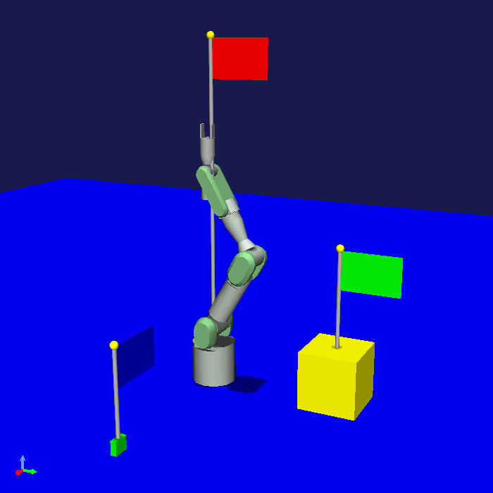

==================================================
プロジェクトアイテムのファイル入出力サンプル (S09)
==================================================

.. contents:: 目次
   :local:

概要
----

本節では :doc:`item-file-io` に関するサンプルとして、 :doc:`item-project-save-sample` を改良し、アイテムの状態をファイルに保存するようにしたものを提示します。

ソースコード
------------

.. highlight:: cpp

今回のソースコードは :doc:`item-project-save-sample` のコードにファイル入出力用の関数を追加し、それを登録するようにしたものです。またアイテムの :ref:`plugin-dev-state-store-restore-functions` の内容もファイル入出力の導入にあわせて修正しています。ソースコードの大部分はS08と同じで、S08からの変更箇所にはコメントを付けて強調表示しています。修正したファイルはBodyPositionItemのヘッダファイルと実装ファイルで、DevGuidePlugin.cpp と CMakeLists.txt は同じです。

BodyPositionItem.h
~~~~~~~~~~~~~~~~~~

.. code-block:: cpp
 :emphasize-lines: 29,30,44,45,46

 #ifndef DEVGUIDE_PLUGIN_BODY_POSITION_ITEM_H
 #define DEVGUIDE_PLUGIN_BODY_POSITION_ITEM_H

 #include <cnoid/Item>
 #include <cnoid/RenderableItem>
 #include <cnoid/BodyItem>
 #include <cnoid/SceneGraph>
 #include <cnoid/SceneDrawables>
 #include <cnoid/Selection>

 class BodyPositionItem : public cnoid::Item, public cnoid::RenderableItem
 {
 public:
     static void initializeClass(cnoid::ExtensionManager* ext);

     BodyPositionItem();
     BodyPositionItem(const BodyPositionItem& org);
     void storeBodyPosition();
     void restoreBodyPosition();
     virtual cnoid::SgNode* getScene() override;
     void setPosition(const cnoid::Isometry3& T);
     const cnoid::Isometry3& position() const { return position_; }
     bool setFlagHeight(double height);
     double flagHeight() const { return flagHeight_; }
     enum ColorId { Red, Green, Blue };
     bool setFlagColor(int colorId);
     double flagColor() const { return flagColorSelection.which(); }

     // 追加
     virtual void notifyUpdate() override;

 protected:
     virtual Item* doDuplicate() const override;
     virtual void onTreePathChanged() override;
     virtual void doPutProperties(cnoid::PutPropertyFunction& putProperty) override;
     virtual bool store(cnoid::Archive& archive) override;
     virtual bool restore(const cnoid::Archive& archive) override;

 private:
     void createFlag();
     void updateFlagPosition();
     void updateFlagMaterial();

     // 以下の2つの関数を追加
     bool loadBodyPosition(const std::string& filename, std::ostream& os);
     bool saveBodyPosition(const std::string& filename, std::ostream& os);

     cnoid::BodyItem* bodyItem;
     cnoid::Isometry3 position_;
     cnoid::SgPosTransformPtr flag;
     double flagHeight_;
     cnoid::Selection flagColorSelection;
     cnoid::SgMaterialPtr flagMaterial;
 };

 typedef cnoid::ref_ptr<BodyPositionItem> BodyPositionItemPtr;

 #endif // DEVGUIDE_PLUGIN_BODY_POSITION_ITEM_H

 }

BodyPositionItem.cpp
~~~~~~~~~~~~~~~~~~~~

.. code-block:: cpp
 :emphasize-lines: 9,10,11,25,26,27,28,29,30,31,32,33,239,240,241,242,243,244,245,246,247,248,249,250,252,253,254,255,256,257,258,259,260,261,262,263,264,265,266,267,268,269,270,271,272,273,274,275,276,277,278,279,280,281,282,283,284,285,286,287,288,289,290,291,292,293,294,295,296,297,298,299,300,301,302,303,304,305

 #include "BodyPositionItem.h"
 #include <cnoid/ItemManager>
 #include <cnoid/MeshGenerator>
 #include <cnoid/EigenUtil>
 #include <cnoid/PutPropertyFunction>
 #include <cnoid/Archive>
 #include <cnoid/EigenArchive>

 // 以下の2つのヘッダを追加
 #include <cnoid/YAMLReader>
 #include <cnoid/YAMLWriter>

 #include <fmt/format.h>

 using namespace std;
 using namespace fmt;
 using namespace cnoid;

 void BodyPositionItem::initializeClass(ExtensionManager* ext)
 {
     ext->itemManager()
	 .registerClass<BodyPositionItem>("BodyPositionItem")
	 .addCreationPanel<BodyPositionItem>()

	 // 以下を追加     
	 .addLoaderAndSaver<BodyPositionItem>(
	     "Body Position", "BODY-POSITION", "pos",
	     {
		 return item->loadBodyPosition(filename, os);
	     },
	     {
		 return item->saveBodyPosition(filename, os);
	     });
 }

 BodyPositionItem::BodyPositionItem()
 {
     bodyItem = nullptr;
     position_.setIdentity();
     flagColorSelection.setSymbol(Red, "red");
     flagColorSelection.setSymbol(Green, "green");
     flagColorSelection.setSymbol(Blue, "blue");
     flagColorSelection.select(Red);
     flagHeight_ = 1.8;
 }

 BodyPositionItem::BodyPositionItem(const BodyPositionItem& org)
     : Item(org)
 {
     bodyItem = nullptr;
     position_ = org.position_;
     flagHeight_ = org.flagHeight_;
     flagColorSelection = org.flagColorSelection;
 }

 Item* BodyPositionItem::doDuplicate() const
 {
     return new BodyPositionItem(*this);
 }

 void BodyPositionItem::onTreePathChanged()
 {
     auto newBodyItem = findOwnerItem<BodyItem>();
     if(newBodyItem && newBodyItem != bodyItem){
	 bodyItem = newBodyItem;
	 mvout()
	     << format("BodyPositionItem \"{0}\" has been attached to {1}.",
		       name(), bodyItem->name())
	     << endl;
     }
 }

 void BodyPositionItem::storeBodyPosition()
 {
     if(bodyItem){
	 position_ = bodyItem->body()->rootLink()->position();
	 updateFlagPosition();
	 mvout()
	     << format("The current position of {0} has been stored to {1}.",
		       bodyItem->name(), name())
	     << endl;
     }
 }

 void BodyPositionItem::restoreBodyPosition()
 {
     if(bodyItem){
	 bodyItem->body()->rootLink()->position() = position_;
	 bodyItem->notifyKinematicStateChange(true);
	 mvout()
	     << format("The position of {0} has been restored from {1}.",
		       bodyItem->name(), name())
	     << endl;
     }
 }

 SgNode* BodyPositionItem::getScene()
 {
     if(!flag){
	 createFlag();
     }
     return flag;
 }

 void BodyPositionItem::createFlag()
 {
     if(!flag){
	 flag = new SgPosTransform;
	 updateFlagPosition();
	 flagMaterial = new SgMaterial;
	 updateFlagMaterial();
     } else {
	 flag->clearChildren();
     }

     MeshGenerator meshGenerator;

     auto pole = new SgShape;
     pole->setMesh(meshGenerator.generateCylinder(0.01, flagHeight_));
     pole->getOrCreateMaterial()->setDiffuseColor(Vector3f(0.7f, 0.7f, 0.7f));
     auto polePos = new SgPosTransform;
     polePos->setRotation(AngleAxis(radian(90.0), Vector3::UnitX()));
     polePos->setTranslation(Vector3(0.0, 0.0, flagHeight_ / 2.0));
     polePos->addChild(pole);
     flag->addChild(polePos);

     auto ornament = new SgShape;
     ornament->setMesh(meshGenerator.generateSphere(0.02));
     ornament->getOrCreateMaterial()->setDiffuseColor(Vector3f(1.0f, 1.0f, 0.0f));
     auto ornamentPos = new SgPosTransform;
     ornamentPos->setTranslation(Vector3(0.0, 0.0, flagHeight_ + 0.01));
     ornamentPos->addChild(ornament);
     flag->addChild(ornamentPos);

     auto banner = new SgShape;
     banner->setMesh(meshGenerator.generateBox(Vector3(0.002, 0.3, 0.2)));
     banner->setMaterial(flagMaterial);
     auto bannerPos = new SgPosTransform;
     bannerPos->setTranslation(Vector3(0.0, 0.16, flagHeight_ - 0.1));
     bannerPos->addChild(banner);
     flag->addChild(bannerPos);
 }

 void BodyPositionItem::updateFlagPosition()
 {
     if(flag){
	 auto p = position_.translation();
	 flag->setTranslation(Vector3(p.x(), p.y(), 0.0));
	 auto rpy = rpyFromRot(position_.linear());
	 flag->setRotation(AngleAxis(rpy.z(), Vector3::UnitZ()));
	 flag->notifyUpdate();
     }
 }

 void BodyPositionItem::updateFlagMaterial()
 {
     if(flagMaterial){
	 switch(flagColorSelection.which()){
	 case Red:
	     flagMaterial->setDiffuseColor(Vector3f(1.0f, 0.0f, 0.0f));
	     break;
	 case Green:
	     flagMaterial->setDiffuseColor(Vector3f(0.0f, 1.0f, 0.0f));
	     break;
	 case Blue:
	     flagMaterial->setDiffuseColor(Vector3f(0.0f, 0.0f, 1.0f));
	     break;
	 default:
	     break;
	 }
	 flagMaterial->notifyUpdate();
     }
 }        

 void BodyPositionItem::setPosition(const Isometry3& T)
 {
     position_ = T;
     updateFlagPosition();
     notifyUpdate();
 }

 bool BodyPositionItem::setFlagHeight(double height)
 {
     if(height <= 0.0){
	 return false;
     }
     flagHeight_ = height;
     if(flag){
	 createFlag();
	 flag->notifyUpdate();
     }
     notifyUpdate();
     return true;
 }

 bool BodyPositionItem::setFlagColor(int colorId)
 {
     if(!flagColorSelection.select(colorId)){
	 return false;
     }
     updateFlagMaterial();
     notifyUpdate();
     return true;
 }

 void BodyPositionItem::doPutProperties(PutPropertyFunction& putProperty)
 {
     auto p = position_.translation();
     putProperty("Translation", format("{0:.3g} {1:.3g} {2:.3g}", p.x(), p.y(), p.z()),
		 [this](const string& text){
		     Vector3 p;
		     if(toVector3(text, p)){
			 position_.translation() = p;
			 setPosition(position_);
			 return true;
		     }
		     return false;
		 });

     auto r = degree(rpyFromRot(position_.linear()));
     putProperty("Rotation", format("{0:.0f} {1:.0f} {2:.0f}", r.x(), r.y(), r.z()),
		 [this](const string& text){
		     Vector3 rpy;
		     if(toVector3(text, rpy)){
			 position_.linear() = rotFromRpy(radian(rpy));
			 setPosition(position_);
			 return true;
		     }
		     return false;
		 });

     putProperty.min(0.1)("Flag height", flagHeight_,
		 [this](double height){ return setFlagHeight(height); });

     putProperty("Flag color", flagColorSelection,
		 [this](int which){ return setFlagColor(which); });
 }

 // 以下の関数を追加
 void BodyPositionItem::notifyUpdate()
 {
     Item::notifyUpdate();
     suggestFileUpdate();
 }

 // 以下の関数を修正
 bool BodyPositionItem::store(Archive& archive)
 {
     bool stored = false;
     if(overwrite()){
	  stored = archive.writeFileInformation(this);
     }
     return stored;
 }

 // 以下の関数を修正
 bool BodyPositionItem::restore(const Archive& archive)
 {
     return archive.loadFileTo(this);
 }

 // 以下の関数を追加
 bool BodyPositionItem::loadBodyPosition(const std::string& filename, std::ostream& os)
 {
     YAMLReader reader;
     MappingPtr archive;
     try {
	 archive = reader.loadDocument(filename)->toMapping();
     }
     catch(const ValueNode::Exception& ex){
	 os << ex.message() << endl;
     }
     Vector3 v;
     if(read(archive, "translation", v)){
	 position_.translation() = v;
     }
     if(read(archive, "rotation", v)){
	 position_.linear() = rotFromRpy(radian(v));
     }
     archive->read("flag_height", flagHeight_);
     string color;
     if(archive->read("flag_color", color)){
	 flagColorSelection.select(color);
     }
     return true;
 }

 // 以下の関数を追加
 bool BodyPositionItem::saveBodyPosition(const std::string& filename, std::ostream& os)
 {
     YAMLWriter writer;
     if(!writer.openFile(filename)){
	 os << format("Failed to open \"{0}\".", filename) << endl;
	 return false;
     }

     MappingPtr archive = new Mapping;
     write(archive, "translation", Vector3(position_.translation()));
     write(archive, "rotation", degree(rpyFromRot(position_.linear())));
     archive->write("flag_height", flagHeight_);
     archive->write("flag_color", flagColorSelection.selectedSymbol());
     writer.putNode(archive);

     return true;
 }

BodyPositionファイルの保存と読み込み
------------------------------------

このプラグインを導入すると、BodyPositionアイテムの設定内容が専用のファイルに記録されるようになります。
この操作方法は :ref:`plugin-dev-item-file-io-example` で示したとおりですので、それと同様に試してみてください。
「ファイル」メニューの「選択アイテムの保存」で設定内容をファイルに保存し、同メニューの「読み込み」−「BodyPosition」でBodyPositionアイテムをファイルから読み込める（生成できる）ようになっているはずです。

なお、ファイル入出力の導入にともなって、プロジェクトファイルへの保存内容はこれまでのサンプルとは異なっているため、これまでのサンプルプラグインを用いて保存したプロジェクトファイルからは、BodyPositionアイテムを読み込むことができません。
そのためBodyPositionアイテムについては新規に作成し直す必要がありますので、ご注意ください。

上記のようにアイテムのファイル入出力はアイテムごとに個別に行うことができますが、プロジェクトの保存／読み込みに連動させることもできます。これは何も難しいことはなく、プロジェクト保存時にアイテムの内容が別ファイルに保存され、プロジェクト読み込み時にはアイテムごとに対応するファイルから内容が読み込まれるということです。
Choreonoidは通常プロジェクトを作成して利用するので、このような利用方法が一般的かと思います。
ファイル入出力の理解を深めるため、本サンプルでもこの利用方法を試していただければと思います。

例えばこれまでと同様に、PA10PickupのプロジェクトにBodyPositionアイテムを導入して、 :doc:`item-property-sample` の :ref:`plugin-dev-item-property-sample-howto` で示した以下の状態にしたとします。

ここでプロジェクト保存を行いましょう。メインメニューの「ファイル」−「名前を付けてプロジェクトを保存」を選択し、保存ダイアログでプロジェクトファイル名を指定します。

この場合、 :doc:`item-project-save-sample` においては、BodyPositionItemの内容を含む全ての情報がプロジェクトファイルに保存されて完了しました。しかし今回のサンプルでは、各BodyPositionアイテムについてファイル保存のダイアログが表示されるかと思います。これは :ref:`plugin-dev-item-file-io-overwrite` で解説した条件3に該当する挙動になります。各ダイアログでデフォルトのファイル名のまま保存すると、プロジェクトファイルに加えて以下のファイルが出力されます。

* BodyPosition1.pos
* BodyPosition2.pos
* BodyPosition3.pos

これらのファイルが、BodyPositionアイテムに対して登録したセーバ関数によって出力されたファイルで、各BodyPositionアイテムの設定内容に該当するものです。これらのファイルが出力されていることは、プロジェクト保存時にメッセージビュー上に出力される以下のメッセージで確認できます。

.. code-block:: text
 :emphasize-lines: 2,3

 BodyPositionItem "BodyPosition1"を書き出し中
 Body Position "BodyPosition1" を "/home/nakaoka/choreonoid/BodyPosition1.pos" に保存中
  -> 完了!

強調表示している部分がファイルの出力に関するメッセージです。

ファイル出力の結果として、例えばBodyPosition3.posは以下の内容のファイルとなります。

.. code-block:: yaml

 flag_color: blue
 flag_height: 0.5
 rotation: [ 0, -0, 90 ]
 translation: [ 0.9, 0, 0.035 ]

これはYAML形式のファイルとなっています。このサンプルではこのようにYAML形式を用いましたが、アイテムの入出力対象となるファイルの形式に特に決まりはなく、どのような形式を用いても結構です。実際のところ既存のファイルを読み込めるようにすることが目的だとすると、そのファイルの形式に合わせることになります。一方でファイル形式も含めて新規に設計するデータである場合、YAMLは有力な選択肢になるかと思います。YAMLはシンプルで可読性も高く多様なデータ構造に対応可能という優れた記述形式ですし、Choreonoid SDKはYAMLを扱うクラスも備えているからです。実際にChoreonoid独自のデータを扱うアイテムのファイルの多くはYAMLで記述するようになっています。

:ref:`plugin-dev-item-file-io-overwrite` はファイルの更新が必要なときのみ実行されるので、BodyPositionアイテムの設定を変更せずに再度プロジェクト保存を行っても、ファイルの出力はされません。この場合はプロジェクト保存時に

.. code-block:: text

 BodyPositionItem "BodyPosition1"を書き出し中

というメッセージだけが表示されます。もちろん、その後アイテムの内容を更新すれば、次のプロジェクト保存ではファイルの上書き処理が行われます。

ファイルの保存ができたら一旦Choreonodiを終了して、保存したプロジェクトファイルを読み込んでみましょう。
先ほどと同じ状態が再現されるかと思います。
そして読み込みの際のメッセージは

.. code-block:: text
 :emphasize-lines: 2,3

 BodyPositionItem "BodyPosition1" を読み出し中
 Body Position "/home/nakaoka/choreonoid/BodyPosition1.pos" を読み込み中
  -> 完了!

などとなることから、実際にアイテムの内容がファイルから読み込まれているのが分かります。

ソースコードの解説
------------------

BodyPositionItemの実装ファイルを対象に :doc:`item-project-save-sample` から追加された部分について解説します。

まず今回のサンプルでは入出力するファイルの形式としてYAMLを用いますので、YAMLの読み書きを行うための以下のヘッダをインクルードしています。 ::

 #include <cnoid/YAMLReader>
 #include <cnoid/YAMLWriter>

それぞれYAMLを読み込むためのYAMLReaderクラスと書き込むためのYAMLWriterクラスに対応します。
ファイル入出力関数の実装でこれらのクラスを使用します。

次にinitializeClass関数で行っているBodyPositionItemクラスの登録処理に、ファイル入出力関数の登録を追加しています。 ::

 .addLoaderAndSaver<BodyPositionItem>(
     "Body Position", "BODY-POSITION", "pos",
     {
	 return item->loadBodyPosition(filename, os);
     },
     {
	 return item->saveBodyPosition(filename, os);
     });

ここでは :ref:`plugin-dev-item-io-function-registration` で紹介した addLoaderAndSaver関数を使用することで、入力（ローダ）と出力（セーバ）の両方の関数を一度に登録しています。各関数は今回BodyPositionItemのメンバ関数として実装しています。登録する関数はこのようにメンバ関数でもよいですし、他の形態の関数でもかまいません。
今回はBodyPositionItemの標準のファイル形式となることを想定して、同クラスのメンバ関数として入出力関数を実装していますが、既存のアイテムクラスに対してファイル形式を追加する場合は、クラス外部の関数になるかと思います。

ファイル形式のキャプションは "Body Position"、フォーマットは "BODY-POSITION" としています。
これらは任意の文字列を設定することが可能です。
一般的に、キャプションはユーザがみて分かりやすいものとします。
フォーマットは特に決まりはないのですが、他の形式と区別できるように設定することが重要です。

ファイルの拡張子はposとしています。今回はYAML形式のファイルとなりますので、ここはyamlとしてもよいかもしれません。あるいは両方の拡張子に対応したい場合は、 "pos;yaml" と設定します。

ローダ、セーバ関数には最後の引数で親アイテムが渡されますが、今回は親アイテムの情報は必要ないので、ラムダ式において該当する仮引数は省略しています。 ::

 void BodyPositionItem::notifyUpdate()
 {
     Item::notifyUpdate();
     suggestFileUpdate();
 }

ここでは元々Itemクラスに備わっているnotifyUpdate関数をオーバーライドしています。
notifyUpdateはアイテムの内容が更新されたことを通知する関数で、これが実行されるとアイテムのsigUpdatedシグナルが送出され、それによってアイテムの更新を他のオブジェクトが検知できるというものです。
この関数はvirtual関数となっており、独自のアイテム型でオーバーライドして、更新通知の処理をカスタマイズすることができます。

ここでやりたいのは、 :ref:`plugin-dev-item-file-io-overwrite` を適切に機能させるために必要な、「最後のファイル入出力の後にアイテムの内容が更新された」ことの通知です。これを行うsuggestFileUpdate関数を、notifyUpdate関数と紐付けて実行しています。これにより、アイテムの更新時は常にファイルも更新する必要がある旨を伝えています。

このようにsuggestFileUpdateの実行はnotifyUpdateと紐付けることもできますが、ファイル入出力を行う全てのアイテムで必ずしもこの実装が適切であるとは限りません。例えばアイテムのデータや状態の一部がファイルに保存される場合は、それに関わる更新のときだけsuggestFileUpdateを実行するのが適切です。suggestFileUpdateの使用はそのようなことにも注意して適切なタイミングで行うようにしてください。 ::

 bool BodyPositionItem::store(Archive& archive)
 {
     bool stored = false;
     if(overwrite()){
          stored = archive.writeFileInformation(this);
     }
     return stored;
 }

今回ファイル入出力の導入に伴い、プロジェクト保存のためのstore関数も修正しています。
ここでは :ref:`plugin-dev-item-file-info-project-save` で示した通りのコーディングを行っています。
これによりファイルの情報がプロジェクトファイルに記録されます。 ::

 bool BodyPositionItem::restore(const Archive& archive)
 {
     return archive.loadFileTo(this);
 }

同じ理由でrestore関数も修正します。こちらも :ref:`plugin-dev-item-file-info-project-save` で示した通りのコーディングを行っています。

次に、実際にファイルを読み込む関数 ::

 bool BodyPositionItem::loadBodyPosition(const std::string& filename, std::ostream& os)
 {
    ...
 }

を実装しています。以下はその内容の解説です。 ::

 YAMLReader reader;

YAMLファイルの読み込みに使用する `YAMLReader <https://choreonoid.org/ja/documents/reference/latest/classcnoid_1_1YAMLReader.html>`_ を生成しています。 ::

 MappingPtr archive;

YAMLファイルから読み込んだマッピングノードを格納する変数です。 ::

 try {
     archive = reader.loadDocument(filename)->toMapping();
 }
 catch(const ValueNode::Exception& ex){
     os << ex.message() << endl;
 }

ファイルの読み込みを行います。
YAMLReaderのloadDocument関数にファイル名を与えて、読み込みに成功するとトップレベルのノードに対応するValueNodeポインタが返ります。
ここではトップレベルはマッピングであるという想定で、ValueNodeポインタをマッピングのポインタに変換し、archive変数に格納しています。
この読み込みの過程でエラーがあると、YAMLReaderはValueNode::Exception型の例外を投げるようになっています。
この例外を補足するようにして、エラー時にはエラーメッセージを出力するようにしています。
読み込み関数の引数として使用可能なstd::ostreamオブジェクトは、このように読み込みに関わるメッセージを出力するために使用できます。 ::

 Vector3 v;
 if(read(archive, "translation", v)){
     position_.translation() = v;
 }
 if(read(archive, "rotation", v)){
     position_.linear() = rotFromRpy(radian(v));
 }
 archive->read("flag_height", flagHeight_);
 string color;
 if(archive->read("flag_color", color)){
     flagColorSelection.select(color);
 }

この部分は :doc:`item-project-save-sample` のrestore関数の実装と同じです。先のサンプルでは対象がプロジェクトファイルでしたが、このサンプルで専用のファイルに変わったというだけですね。

最後に、実際にファイルに書き込む関数 ::

 bool BodyPositionItem::saveBodyPosition(const std::string& filename, std::ostream& os)
 {
     ...
 }

を実装しています。その内容について以下解説します。 ::

 YAMLWriter writer;

YAMLの書き込みに `YAMLWriterクラス <https://choreonoid.org/ja/documents/reference/latest/classcnoid_1_1YAMLWriter.html>`_ を利用します。 ::

 if(!writer.openFile(filename)){
     os << format("Failed to open \"{0}\".", filename) << endl;
     return false;
 }

書き込み対象のファイルを開きます。失敗した場合は、その旨のメッセージを出力して終了します。 ::
     
 MappingPtr archive = new Mapping;

ここでは書き込み用に一旦 :ref:`YAML型構造化データ <plugin-dev-yaml-structured-data-classes>` を構築します。
そのトップノードとなるMappingを生成しています。 ::

 write(archive, "translation", Vector3(position_.translation()));
 write(archive, "rotation", degree(rpyFromRot(position_.linear())));
 archive->write("flag_height", flagHeight_);
 archive->write("flag_color", flagColorSelection.selectedSymbol());

この部分は :doc:`item-project-save-sample` のstore関数の実装と同じです。こちらも対象がプロジェクトファイルから専用のファイルに変わったということですね。 ::

 writer.putNode(archive);

構築したデータをwriterを用いてファイルに出力します。

最後に関数からtrueを返すことで処理に成功したことを示します。
これでファイルの保存は完了となります。
