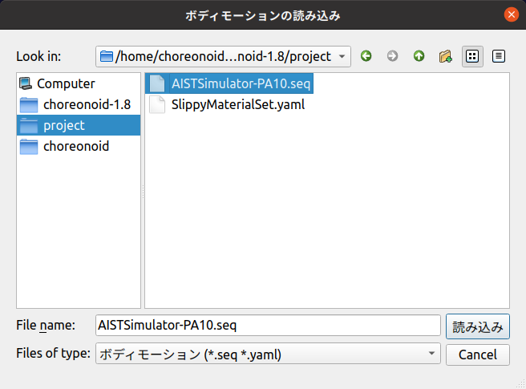

====================================
プロジェクトアイテムのファイル入出力
====================================

.. contents:: 目次
   :local:

.. highlight:: cpp

概要
----

プロジェクトアイテムの状態やデータをファイルから読み込んだり、ファイルに保存したりしたいことがあります。
これは :doc:`item-project-save` の対象となるプロジェクトファイルとは異なり、あるデータに特化した独立したファイルを対象とするものです。本節ではそのようなプロジェクトアイテムのファイル入出力を実現する方法について解説します。

.. _plugin-dev-item-file-io-example:

ファイル入出力の例
------------------

ファイル入出力の実現方法を解説するにあたって、まずその実現イメージを把握するために、既存のプロジェクトアイテムにおけるファイル入出力の例を紹介します。

ファイルの入力（読み込み）を利用している既存アイテムとしてまず挙げられるのがボディアイテムです。
Choreonoidを利用した方であれば既にご存知かと思いますが、ボディアイテムについては通常 :doc:`../handling-models/modelfile/index` を読み込むことで生成するようになっています。この操作はメインメニューの「ファイル」−「読み込み」−「ボディ」から表示されるファイルダイアログなどによって実現することができます。

ボディアイテムについては、プロジェクト保存時に自身のモデルデータをプロジェクトファイルに直接保存することはなく、あくまでモデルファイルのファイル名などの参照的な情報のみを記録します。そしてプロジェクトを読み込み直す際に、外部のモデルファイルからモデルデータが読み込まれることで、同じモデルが復帰します。

このように、ボディアイテムではファイル入力が重要な役割を果たしており、これによってアイテムが存在していると言っても過言ではありません。（なお、ボディアイテムはChoreonoidの最新版でファイル出力も可能となっておりますが、それについては話がやや複雑になるのでここでは詳細を省きます。）

ファイルの入力に加えて出力（書き込み）も行うアイテムもあります。例えばシミュレーション結果等の動作軌道を格納する「ボディモーションアイテム」は、動作軌道を専用の「ボディモーションファイル」に出力する機能を備えています。出力したファイルはその後読み込むことが可能で、それによって同じ動作軌道を再現することができます。

これについて試してみましょう。まずはシミュレーションを行うプロジェクトを読み込みます。何でもよいのですが、ここでは本ガイドでしばしば利用しているPA10Pickupを例として用いることにします。PA10Pickupでシミュレーションを実行すると、PA10以下のアイテムは以下の構成になるかと思います。

.. code-block:: text

 + PA10
   + SimpleController
     + AISTSimulator-PA10

ここで "AISTSimulator-PA10" がシミュレーション結果のボディモーションアイテムです。ここでこのアイテムを選択し、メインメニューの「ファイル」−「選択アイテムの保存」を実行してください。すると以下のファイル保存ダイアログが表示されます。

.. image:: images/save-bodymotion.png
    :scale: 70%

ここで適当なディレクトリを選択して「保存」ボタンを押します。すると動作軌道のデータがファイルに保存されます。この場合のファイル名はデフォルトで "AISTSimulator-PA10.seq" となります。ファイルの形式は :doc:`../reference/body-motion` となります。

次に保存したモーションファイルを読み込んでみましょう。一旦ボディモーションアイテムを削除するか、プロジェクトを読み込み直すなどして、ボディモーションアイテムが無い状態にしてください。その上でPA10もしくはSimpleControllerのアイテムを選択し、メインメニューの「ファイル」ー「読み込み」−「ボディモーション」を実行します。すると以下のファイル読み込みダイアログが表示されます。

ここで先程保存したモーションファイル "AISTSimulator-PA10.seq" を選択して「読み込み」ボタンを押します。するとボディモーションアイテムがPA10の下に読み込まれて、アイテムツリーがシミュレーション直後と同じ状態になります。読み込まれたアイテムの中には実際に先程と同じ動作軌道データが入っています。これはアイテムを選択してタイムバーを操作することで確認できます。

更にこの状態でプロジェクト保存をしましょう。するとボディモーションアイテム "AISTSimulator-PA10" について、「モーションファイル "AISTSimulator-PA10.seq" から読み込まれたものである」旨がプロジェクトファイルに保存されます。そして保存したプロジェクトファイルを読み込み直すと、生成されるボディモーションアイテムにボディモーションファイルが読み込まれて、先程と同じデータが復元します。

.. note:: シミュレーション後にそのままプロジェクト保存をした場合、ボディモーションアイテム "AISTSimulator-PA10" はプロジェクトに保存されません。これはシミュレーション結果のボディモーションアイテムがデフォルトで "Temporal" 属性の一時的なアイテムとなっているからです。（ :ref:`plugin-dev-item-basic-attributes` 参照。）「選択アイテムの保存」操作を行うことで、Temporal属性が解除されて、プロジェクトファイルにも保存されるようになります。

このボディモーションアイテムの例にみられるように、アイテムがファイル入出力の双方をサポートすることで、Choreonoid上で生成されたデータを保持し続けることが可能となります。

ここまでファイル入出力を行うアイテム型を2つ紹介しましたが、それら以外にもChoreonoidで利用可能なアイテムの多くがファイル入出力機能を備えています。該当する主なアイテム型について以下に示します。（括弧内は対象となるファイルの種類になります。）

* ファイル入力を行うアイテム

  * ボディアイテム（モデルファイル）

  * マテリアルアイテム（マテリアルファイル）

  * シーンアイテム（三次元モデル／メッシュファイル）

  * Pythonスクリプトアイテム（Pythonスクリプト）

  * メディアアイテム（動画／音声ファイル）

* ファイル入出力を行うアイテム

  * ボディモーションアイテム（ボディモーションファイル）

  * ポーズ列アイテム（ポーズ列ファイル）

  * ポイントセットアイテム（点群ファイル）

なお、アイテムの状態を保存・復帰するだけなら、 :doc:`item-project-save` によって対応できるので、必ずしもファイル入出力は必要ありません。アイテムがファイル入出力をサポートすべきかどうかは、以下の基準で判断できます。

1. 既存のファイルを利用したい場合
2. Choreonoidの外部でも利用したい場合
3. データのサイズが大きい場合

1については、アイテムがそのファイルを読み込めるようにすることが一番手っ取り早い解決策となります。
上記のアイテム型の中でも、ボディアイテム、シーンアイテム、Pythonスクリプトアイテム、メディアアイテム、ポイントセットアイテム等の多数のアイテム型がこれに該当します。アイテムがファイル入力をサポートするポピュラーな理由であると言えるでしょう。

2については1の逆で、Choreonoid上で生成したデータが外部でも有用な場合は、ファイルを介して外部からも利用できるようにすることが一般的です。また外部のツールで編集して再度Choreonoid上で使用することも考えられます。上記アイテム型の中では、ボディモーションアイテムが特に該当するかと思います。例えばシミュレーション結果を外部のツールで表示、解析するといったことが考えられます。

3については、大抵の場合1や2も同時に当てはまるのですが、必ずしもそうでない場合も、考慮すべき項目となります。もしプロジェクトの保存・復帰だけができればよいのであれば、 :doc:`item-project-save` によって全てのデータをプロジェクトフィアル内に保存することも考えられます。しかしデータがサイズが大きい場合は、その部分を外部のファイルに書き出したほうが、プロジェクトを扱いやすくなるかと思います。またプロジェクトファイルはYAML形式のテキストデータですが、サイズの大きなデータはバイナリ形式の方が適している場合もあります。

プラグインで導入する独自のアイテム型について、上記の項目が当てはまるようでしたら、ファイル入出力の実装を検討してください。

.. _plugin-dev-item-io-function-registration:

ファイル入出力関数の登録
------------------------

あるアイテム型をファイル入出力に対応させるには、 :ref:`plugin-dev-item-type-registration` に使用した `ItemManager <https://choreonoid.org/ja/documents/reference/latest/classcnoid_1_1ItemManager.html>`_ を用いて、入力（読み込み）や出力（書き込み）の関数を登録します。

まずファイル読み込み用の関数（ローダ）については以下のテンプレート関数で登録できます。 ::

 template <class ItemType>
 ItemManager& addLoader(
     const std::string& caption, const std::string& format, const std::string& extensions, 
     typename FileFunction<ItemType>::Function function, int usage = Standard);

各引数の意味を以下に示します。

* **ItemType** （テンプレート引数）

  * 対象となるアイテムのクラスを指定します。

* **caption**

  * ファイルのタイプを表す文字列を指定します。

* **format**

  * ファイルの形式を表す文字列を指定します。

* **extensions**

  * ファイルの拡張子を指定します（拡張子の先頭のドットの部分は省きます）。

  * 複数該当する場合はセミコロンで区切って指定します。

* **function**

  * ファイル読み込み関数（ローダ）を指定します。

* **standard**

  * 登録するローダの利用方法を指定します。値はItemManagerクラスの列挙型IoUsageTypeで定義されている以下のいずれかの値になります。

    * **Standard** : 標準の利用方法になります。

    * **Conversion** : 変換的な利用になります。読み込みの場合はいわゆる「インポート」となります。

    * **Internal** : 主にプラグインのプログラムコードから利用されます。

ローダの形式はFileFunctionクラスによって規定されます。これはアイテム型をItemTypeとしたときに、以下の関数オブジェクトになります。 ::

 std::function<bool(ItemType* item, const std::string& filename, std::ostream& os, Item* parentItem)

この関数の各引数の意味を以下に示します。

* **item**

  * ファイルを読み込むアイテムです。

* **filename**

  * 対象となるファイルのファイル名（ファイルパス）です。

* **os**

  * メッセージを出力するための出力ストリームです。

  * ファイル読み込み時の状況や警告、エラー等を通知するテキストメッセージの出力に使用します。

* **parentItem**

  * 親アイテムがある場合はこの引数にセットされます。

  * 読み込み成功後に親となるケースも含みます。

関数の戻り値によってファイル読み込みの成否を示します。成功した場合はtrueを、失敗した場合はfalseを返すようにします。

ローダ関数の登録は通常 :ref:`plugin-dev-item-type-registration` と同様にプラグインのinitialize関数から行います。例えばFooItemのデータをファイルから読み込む以下の関数が定義されているとします。 ::

 bool loadFooData(FooItem* item, const std::string& filename, std::ostream& os, Item* parentItem);

この関数の中身は、filenameで指定したファイルをitemのデータとして読み込むものであれば、どのように実装してもOKです。

これを以下のようなコードでFooItemのローダとして登録できます。 ::

 itemManager().addLoader<FooItem>("Foo Data", "FOO-DATA", "dat", loadFooData);

なお、ローダを登録する前に対象のアイテム型自体がItemManagerで登録されている必要があります。また、同じアイテム型に対してローダは複数登録することができます。これにより、ファイル形式ごとにローダを登録して、複数のファイル形式に対応させることが可能です。

ファイル書き込み（保存）用の関数（セーバ）については以下のテンプレート関数で登録できます。 ::

 template<class ItemType>
 ItemManager& addSaver(
     const std::string& caption, const std::string& format, const std::string& extensions,
     typename FileFunction<ItemType>::Function function, int usage = Standard);

引数はaddLoader関数と同じです。登録する関数が読み込み用ではなく書き込み用となる点だけが異なります。functionに指定する関数の型もaddLoderと同じになります。

同じ形式のファイルを対象としてローダとセーバの両方を登録する場合は、ItemManagerの以下の関数で同時に登録することもできます。 ::

 template<class ItemType>
 ItemManager& addLoaderAndSaver(
     const std::string& caption, const std::string& format, const std::string& extensions,
     typename FileFunction<ItemType>::Function loaderFunction,
     typename FileFunction<ItemType>::Function saverFunction,
     int usage = Standard);

読み込み用の関数と書き込み用の関数をそれぞれloaderFunctionとsaverFunctionに指定します。
それ以外の引数については両者で共通の指定となります。

GUIからの利用
-------------

入出力関数を登録すると、それを用いたアイテムの読み込みや保存をChoreonoidのGUI上でユーザが利用できるようになります。

まず入力用関数（ローダ）については、メインメニューの「ファイル」−「読み込み」のカテゴリに、登録したローダのキャプションが追加されます。それを選択して表示されるダイアログからファイルを選択することで、該当するローダを用いたアイテムの読み込みが行われます。出力用関数（セーバ）については、「ファイル」−「名前を付けて選択アイテムを保存」から利用できるようになります。これらについては :ref:`plugin-dev-item-file-io-example` で示したのと同様のものです。

なお、あるアイテム型について複数のセーバが登録されている場合、そのアイテム型を対象とした「名前を付けて選択アイテムを保存」において、保存ダイアログの "Files of type" のコンボボックスに、登録されているセーバが含まれるようになります。ユーザはこのコンボボックスから選択することで、保存時のファイル形式を指定できます。

上記は登録時に引数usageをデフォルトの "Standard" とした場合の挙動です。一方でusageに "Conversion" を指定して登録すると、Standardの場合とは異なるメニュー項目から利用することになります。具体的には、ローダについてはメインメニューの「ファイル」−「インポート」のカテゴリに登録したローダの項目が追加されますでの、そこから利用します。セーバについては、「ファイル」−「選択アイテムのエクスポート」に項目が追加されますので、そこから利用します。これは「名前を付けて選択アイテムを保存」とは異なり、複数のセーバがConversionで登録されていても、メニュー項目の段階で分けられています。従って複数のエクスポート形式がある場合でも、メニュー選択の時点でどの形式を用いるかが決まることになります。

StandardとConversionのどちらで登録するかは、開発者の判断に委ねられています。登録するローダやセーバの対象ファイル形式が、Choreonoidで使用する際に標準的なファイル形式だと判断できれば、Standardで登録します。一方で、Choreonoidでは標準とは言えない形式であると判断すれば、Conversionにしておくことで、ユーザも同様の認識ができます。これはあるアイテム型に対して多数のファイル形式が利用できる場合に、なるべく混乱を避けるのに有効かと思います。

なお、登録の際の引数に "Internal" を指定した場合は、GUIからは利用できなくなります。この場合は次で説明する「プログラムからの利用」でのみ利用できるようになります。

.. _plugin-dev-item-file-io-function-program-use:

プログラムからの利用
--------------------

登録したローダやセーバは、プログラムから利用することもできます。その際、ローダやセーバの関数そのものを直接実行するのではなく、Itemクラスの所定の関数を介して実行することで、Choreonoidのフレームワークと統合された統一的な手法でアイテムの読み込みや保存をすることができます。これによってファイルに関する情報を統一的に管理でき、プログラムコードも一貫性のあるものになりますので、通常はこちらの方法を利用するようにします。

.. _plugin-dev-item-file-loading-function:

ファイルの読み込み
~~~~~~~~~~~~~~~~~~

アイテムの読み込みに関しては `Itemクラス <https://choreonoid.org/ja/documents/reference/latest/classcnoid_1_1Item.html>`_ の以下の関数で実現できます。 ::

 bool load(const std::string& filename,
           Item* parent,
           const std::string& format = std::string(),
           const Mapping* options = nullptr);

この関数の各引数の意味を以下に示します。

* **filename**

  * 読み込むファイル名（ファイルパス）を指定します。

* **parent**

  * 親アイテムを指定します。

  * アイテムが生成直後でまだアイテムツリーに属していない状況で、読み込み成功後にツリーに追加場合は、追加先となるアイテムを指定します。

  * ファイルの読み込みがアイテム単体で完結する場合この引数は特に意味を持ちませんが、読み込みが上位のアイテムにも依存する一部のアイテム型については、指定する必要があります。

* **format**

  * 登録時に指定したファイル形式を表す文字列を指定します。

  * 省略するとファイル名の拡張子に適合するものが選択されます。

  * ファイル形式を特定できない場合はエラーになります。

* **options**

  * 読み込みに関わるオプションをMappingの形式で指定します。

  * オプションがない場合はnullptrを指定します。デフォルト値もnullptrとなっており、通常はそれで問題ありません。

  * この引数の詳細は :doc:`item-creation-io-customization` の :ref:`plugin-dev-itemfileio` で解説します。

引数parentについては、上記の説明からも分かるように必ずしも必要となるわけではありません。必要としないことが予め分かっている場合は、引数parentを省略した以下のオーバーロード関数も使用できます。 ::

 bool load(const std::string& filename,
           const std::string& format = std::string(),
           const Mapping* options = nullptr);

これらのload関数は内部で該当するローダ関数を呼び出してファイルの読み込み処理を行います。読み込みに成功すると、アイテムの内容が更新され、trueが返ります。失敗するとfalseが返ります。登録時のusageがInternalとなっているローダについても、これらの関数を介して使用することができます。 ::

例えばボディアイテムを生成してモデルファイルをロードするプログラムコードは以下のようになります。 ::

 BodyItemPtr bodyItem = new BodyItem;
 bodyItem->load("robot.body");

ここではファイル名に拡張子が含まれるのでformatは省略しています。またモデルの読み込みに親アイテムの情報は必要ないので、そちらも省略しています。多くのアイテムはこのようにシンプルな記述でファイルを読み込むことができます。なおファイルパスについてはここでは特に考慮しておらず、カレントディレクトリにファイルが存在する前提となりますが、実際の利用時にはもちろんファイルパスも含めて適切に指定する必要があります。

ファイルの保存
~~~~~~~~~~~~~~

セーバ関数が登録されているアイテムについては、以下の関数で自身の内容をファイルに保存することができます。 ::

 bool save(const std::string& filename,
           const std::string& format = std::string(),
           const Mapping* options = nullptr);

この関数はload関数と同様に使用することができます。load関数と異なる点として、ファイル保存の際にアイテムは通常アイテムツリーに組み込まれていますので、親アイテムを明示的に指定することはありません。その他の引数については、load関数と同様に指定します。関数を実行すると内部で該当するセーバ関数が呼び出されてファイルの書き込み処理が行われ、処理に成功したらtrueが返ります。

ファイル情報の取得
~~~~~~~~~~~~~~~~~~

所定の方法で（上記のGUIからの利用やload、save関数を利用して）ファイルの入出力がされたアイテムについては、 `Itemクラス <https://choreonoid.org/ja/documents/reference/latest/classcnoid_1_1Item.html>`_ の以下の関数で（最後に入出力された）ファイルの情報を取得できます。

* **const std::string& filePath() const**

  * ファイルパスを返します。

* **std::string fileName() const**

  * （ディレクトリを含まない）ファイル名の部分だけ返します。

* **const std::string& fileFormat() const**

  * ファイル形式を表す文字列（登録時にformatで指定したもの）を返します。

* **const Mapping* fileOptions() const**

  * ファイル読み込み／書き込み時のオプションを返します。

* **std::time_t fileModificationTime() const**

  * ファイルの変更時刻を返します。

これらの情報は必要に応じて任意の箇所から参照して利用することが可能です。

.. _plugin-dev-item-file-io-overwrite:

ファイルの上書き処理
--------------------

あるアイテム型がファイルの入出力の双方をサポートしている場合、ファイルの「上書き」という操作ができます。
これは所定の方法でファイルの入出力がされたアイテムに対して、最後の入出力の対象となったファイルを現在のアイテムの内容で上書きするというものです。これは実際にはアイテムのファイル保存を同じファイルに対して行う処理になります。

まずGUI上から上書きの操作を行う場合は、対象となるアイテムを選択して、メインメニューの「ファイル」−「選択アイテムの保存」を実行します。するとアイテムが上記の条件を満たしていれば、対象のファイルが上書きされます。

この操作はプログラムからも行うことができます。その場合は `Itemクラス <https://choreonoid.org/ja/documents/reference/latest/classcnoid_1_1Item.html>`_ の以下の関数を使用します。 ::

 bool overwrite(bool forceOverwrite = false, const std::string& format = std::string());

通常は全てデフォルトの引数で（つまり引数なしで）実行します。すると「上書きが必要なときのみ」実際に上書きが実行されます。

上書きが必要な条件は以下のいずれかになります。

1. 最後のファイル入出力の後にアイテムの内容が更新された
2. 現在のファイルの最終更新時刻が、最後にファイル入出力を行った時の時刻よりも後になっている
3. アイテムが新規生成された後にファイル保存されたことがない

条件1については、ファイルの入出力後に、Choreonoid上でアイテムの内容が変わるのような操作がされ、アイテムを保存したファイルの内容も変わるということを意味します。ただし実際にそのようなことが行われたかどうかは、自動で判定することが難しいです。
そこでアイテムを操作するプログラムの側で、ファイルの内容に影響を与えるような更新を行った場合は、Itemクラスの以下の関数でそのことを通知するようにします。::

 void suggestFileUpdate();

この関数を実行すると、アイテム内部のフラグが更新され、アイテムの内容とファイルの内容に差が生じていることが記録されます。このことはItemクラスの以下の関数で判定できます。 ::

 bool isConsistentWithFile() const;

この関数がtrueを返す場合は、最後に入出力を行ったファイルとアイテムの内容が同じであることを意味します。falseの場合は、両者に差が生じていることを意味します。

条件2については、ファイルの入出力後に、Choreonoidの外部からファイルが更新されたことを意味します。その更新によって、Choreonoid上のアイテムの内容とファイルの内容が異なっている可能性が高いと判断されます。

以上の1か2の条件が成り立つときは、「ファイルの上書きが必要」と判断されて、overwrite関数で実際に上書きの処理が行われます。もし条件が成り立たない場合は、上書き処理はスキップされます。

3についてはそもそも既存のファイルがまだ存在しないので、実際には「上書き」ではないのですが、こちらも「上書き操作」の対象となります。この場合は、上書き操作をすると、ファイル保存ダイアログが表示され、そこでファイル名を指定するとファイルが保存されます。現在のアイテムの内容がファイルに書き出されるという意味では、上書きと同じ挙動になります。

上記のoverwrite関数の引数 "forceOverwrite" がtrueのときは、常に上書き処理が実行されます。またoverwrite関数ではformat引数でファイル形式を指定することも可能で、指定したファイル形式が最後に入出力したファイル形式と異なる場合も、上書き処理が実行されます。

アイテムの入出力対象となるファイルの上書きは、:ref:`basics_project_save` においても適用されます。これはプロジェクト保存時に、上記の「上書きが必要な条件」を満たすアイテムが存在する場合、該当する各アイテムに対して自動でファイルの上書き処理が実行されるというものです。（条件3のときはやはりファイル保存ダイアログが表示されるので、完全に自動とはなりません。）この処理によって、プロジェクトに含まれるアイテムの編集操作を行った場合、その編集結果をプロジェクト保存で一括して保存できることになります。これは上書き処理の最も効果的な活用であり、実際のChoreonoidの利用においても頻繁に実行される処理となります。

このような上書き処理を正しく機能させるためには、上記のsuggestFileUpdate関数を適切に実行することが必要です。
プラグインの実装においてファイル入出力が可能なアイテムを操作する場合は、このことに十分留意するようにしてください。
これはプラグインで独自のアイテム型を追加する場合だけでなく、既存のアイテムを操作する場合にも当てはまります。

.. _plugin-dev-item-file-info-project-save:

ファイル情報のプロジェクトファイルへの記録
------------------------------------------

アイテムにファイル入出力を導入する場合でも、 :doc:`item-project-save` は必要です。仮にアイテムの全てのデータがファイルに保存されるとしても、そのファイルを読み込まないことにはアイテムを復帰できません。 そしてファイルを読み込むためにはその対象となるアイテムがまず必要で、さらにファイルパスやファイル形式などの情報も必要です。それらの情報はやはりプロジェクトファイルに保存されている必要があり、プロジェクト復帰時にそれらの情報を元にアイテムが生成されファイルが読み込まれることになります。

これを実現するため、アイテムの :ref:`plugin-dev-state-store-restore-functions` でファイル情報の記録とファイルの読み込みを行う必要があります。以下ではこの方法について解説します。説明用のコードはFooItemというアイテム型の例になります。

まず状態保存用のstore関数については以下のような実装が必要となります。::

 bool FooItem::store(Archive& archive)
 {
     bool stored = false;
     if(overwrite()){
         if(archive.writeRelocatablePath("file", filePath())){
             archive.write("format", fileFormat());
             stored = true;
         }
     }
     return stored;
 }

ここではまず ::

 if(overwrite()){

によってファイルの上書きを試みています。ファイル入出力の双方を行うアイテムは、store関数で通常このファイル上書き処理を行うようにします。アイテムがファイル入力のみをサポートしているものであれば、この処理は必要ありません。

上書きに成功した場合は、 ::

 archive.writeRelocatablePath("file", filePath())

によってファイルのパスを再配置可能な形式に変換し、"file" というキーでプロジェクトファイルに記録します。
ここでは :ref:`plugin-dev-archive-class` の :ref:`plugin-dev-relocatable-filepath-functions` で紹介したwriteRelocatablePath関数でこれを実現しています。さらに ::

 archive.write("format", fileFormat());

によって、ファイル形式（フォーマット）も記録しています。
今回はファイル形式がひとつ登録されるだけなのでこの必要性をあまり感じないかもしれません。
ファイル形式は複数存在する可能性があり、その場合でもファイル形式を区別できるよう、通常はプロジェクトファイルにこの情報も記録しておきます。

Choreonoidのプロジェクトファイルでは、このようにファイルパスに "file"、ファイル形式に "format" というキーを用いるのが慣例となっています。独自に作成するアイテム型でも同じキーを使うようにすると統一感を確保できてよいでしょう。

なおこの実装は :ref:`plugin-dev-archive-class` の :ref:`plugin-dev-file-io-functions` で紹介したwriteFileInformation関数を用いて以下のように記述することもできます。 ::

 bool FooItem::store(Archive& archive)
 {
     bool stored = false;
     if(overwrite()){
         stored = archive.writeFileInformation(this);
     }
     return stored;
 }

writeFileInformation関数によってファイルパスとファイル形式の情報が上記と同様に書き込まれます。
こちらの関数を用いるとより簡潔に記述できます。対象アイテム型がファイル入力のみサポートする場合はoverwriteの処理が省かれるので ::

 bool FooItem::store(Archive& archive)
 {
     return archive.writeFileInformation(this);
 }

とすることで（ファイルに関しては）必要な全ての情報を出力できます。

状態復帰用のrestore関数については以下のような実装が必要となります。 ::

 bool FooItem::restore(const Archive& archive)
 {
     bool restored = false;
     string file;
     if(archive.readRelocatablePath("file", file)){
         string format;
         archive.read("format", format);
         restored = load(file, format);
     }
     return restored;
 }

ここではstore関数とほぼ逆の処理をおこなっています。まず ::

 string file;
 if(archive.readRelocatablePath("file", file)){

によって "file" というキーに再配置可能ファイルパスが格納されていると想定して、パス変数等があればその展開を行います。
これには :ref:`plugin-dev-archive-class` の :ref:`plugin-dev-relocatable-filepath-functions` で紹介したeadRelocatablePath関数を使用しています。そしてこれに成功すると、 ::

 string format;
 archive.read("format", format);

によってファイル形式を読み込んでいます。これらの情報を用いて ::

 restored = load(file, format);

とし、ファイルの読み込みを行っています。
ここでは :doc:`item-file-io` - :ref:`plugin-dev-item-file-loading-function` で紹介したload関数を使用しています。

この処理もより簡潔に記述することが可能です。
それにはやはり :ref:`plugin-dev-archive-class` の :ref:`plugin-dev-file-io-functions` で紹介した、loadFileTo関数を使用します。
これを使用するとrestore関数は以下のように記述できます。 ::

 bool FooItem::restore(const Archive& archive)
 {
     return archive.loadFileTo(this);
 }

この記述によって、（ファイルに関しては）必要な全ての処理を実行できます。

上記のコードは典型的なファイル入出力を行うアイテムを想定したものですが、アイテムと関連するファイル入出力の構成によっては、上記のコードを単純に適用できない場合もあるかもしれません。そのような場合も、上記のコードを参考にして、状況に合わせた情報の記録とファイル読み込みを行うようにしてください。
