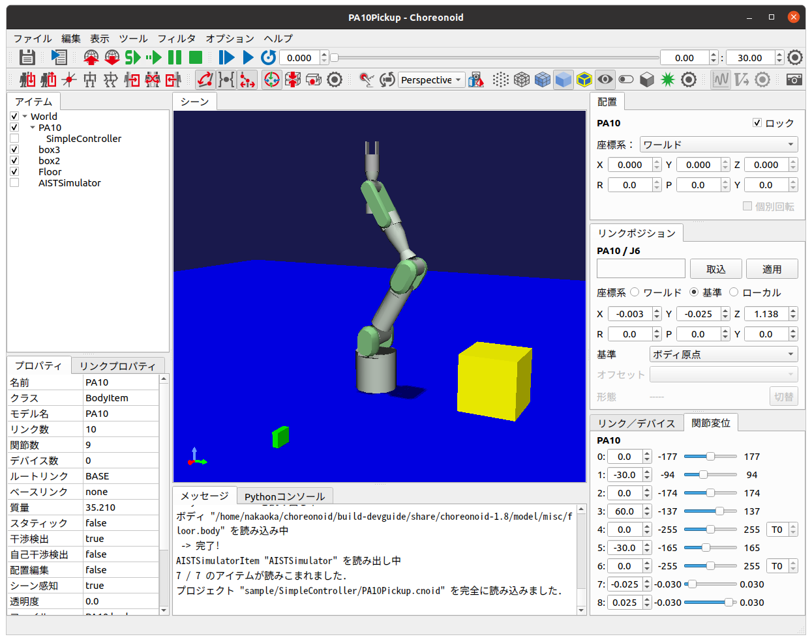

プロジェクトアイテム操作サンプル (S03)
======================================

.. contents:: 目次
   :local:

概要
----

ここではプロジェクトアイテムを操作する簡単なサンプルを提示します。このサンプルでは前節で述べたアイテム活用の3段階である

1. Itemクラスの機能によりアイテムの基本的な操作を行う
2. 個別アイテム型の機能により、特定のデータや処理に関する操作を行う
3. 独自のアイテム型を定義・実装し、独自のデータや処理を使用可能にする

について、1と2を含む例となっています。

1の操作としては「選択されている特定のアイテム型のアイテムを取得」します。ここで対象となるアイテム型はロボットや環境のモデルに対応するBodyアイテムです。そして2の例として、取得したBodyアイテムのモデルをタイムバーに連動させて回転させます。この部分は先に提示した :doc:`signal-sample` を発展させた内容としています。

このサンプルにより、既存のアイテムについてシグナルも活用しながら操作する方法について学ぶことができます。

ソースコード
------------

.. highlight:: cpp

これまでのサンプルと同様に、プラグインのソースディレクトリを作成し、そこに以下のソースコードをDevGuidePlugin.cppというファイル名で作成します。 ::

 #include <cnoid/Plugin>
 #include <cnoid/ConnectionSet>
 #include <cnoid/ItemList>
 #include <cnoid/RootItem>
 #include <cnoid/BodyItem>
 #include <cnoid/TimeBar>
 #include <coid/EigenTypes>
 #include <vector>
 
 using namespace cnoid;
 
 class DevGuidePlugin : public Plugin
 {
    ScopedConnectionSet connections;
    ItemList<BodyItem> bodyItems;
    std::vector<Matrix3> initialRotations;
 
 public:
     DevGuidePlugin() : Plugin("DevGuide")
     {
         require("Body");
     }
 
     virtual bool initialize() override
     {
         connections.add(
             RootItem::instance()->sigSelectedItemsChanged().connect(
                 [this](const ItemList<>& selectedItems){
                     onSelectedItemsChanged(selectedItems);
                 }));
 
         connections.add(
             TimeBar::instance()->sigTimeChanged().connect(
                 [this](double time){
                     return onTimeChanged(time);
                 }));
 
         return true;
     }

     void onSelectedItemsChanged(ItemList<BodyItem> selectedBodyItems)
     {
         if(selectedBodyItems != bodyItems){
             bodyItems = selectedBodyItems;
             initialRotations.clear();
             for(auto& bodyItem : bodyItems){
                 Body* body = bodyItem->body();
                 Link* rootLink = body->rootLink();
                 initialRotations.push_back(rootLink->rotation());
             }
         }
     }
 
     bool onTimeChanged(double time)
     {
         for(size_t i=0; i < bodyItems.size(); ++i){
             auto bodyItem = bodyItems[i];
             Matrix3 R = AngleAxis(time, Vector3::UnitZ()) * initialRotations[i];
             bodyItem->body()->rootLink()->setRotation(R);
             bodyItem->notifyKinematicStateChange(true);
         }
 
         return !bodyItems.empty();
     }
 };
 
 CNOID_IMPLEMENT_PLUGIN_ENTRY(DevGuidePlugin)

ビルド用のCMakeLists.txtは、Choreonoid本体のビルド環境でビルドする場合は、以下のように記述します。

.. code-block:: cmake

 choreonoid_add_plugin(CnoidDevGuidePlugin DevGuidePlugin.cpp)
 target_link_libraries(CnoidDevGuidePlugin PUBLIC CnoidBodyPlugin)

これまでのサンプルで使用してきたものに対して、一行追加されていることにご注意ください。

Choreonoid本体とは独立してビルドする場合は以下のようにします。

.. code-block:: cmake

 cmake_minimum_required(VERSION 3.10)
 project(DevGuidePlugin)
 find_package(Choreonoid REQUIRED)
 set(CMAKE_CXX_STANDARD ${CHOREONOID_CXX_STANDARD})
 choreonoid_add_plugin(CnoidDevGuidePlugin DevGuidePlugin.cpp)
 target_link_libraries(CnoidDevGuidePlugin PUBLIC Choreonoid::CnoidBodyPlugin)

プラグインの実行
----------------

このプラグインの機能を実行するにあたっては、まずBodyアイテムを含むプロジェクトを読み込んでおきます。Bodyアイテムを含んでいれば基本的には何でもよいです。新たにプロジェクトを作成して適当なBodyファイルを読み込んでもよいですし、既存のプロジェクトファイルを読み込んでもよいです。できれば複数のBodyアイテムが読み込まれていると、プラグインの挙動がより分かりやすくなってよいかと思います。

何を読み込めばよいか分からないという場合は、Choreonoid本体付属サンプルであるPA10Pickup.cnoidを読み込むとよいでしょう。ソースディレクトリのsample/SimpleController にこのファイルがあります。インストールをしている場合は、インストール先のshareディレクトリのprojectディレクトリにあります。このサンプルを読み込むと以下のような画面になります。

以下ではこのサンプルを対象に操作方法を説明します。

まずアイテムツリービュー上でPA10をクリックして選択しましょう。その状態でタイムバーのスライダを操作してください。するとPA10モデルがスライダの操作に応じてクルクルと回ります。

回転の対象となるのは選択されているアイテムです。次にアイテムツリービュー上でCtrlキーを押しながらbox3をクリックし、box3を追加で選択します。そしてタイムバーを操作ます。すると今回はPA10と緑色のボックスが同時に回転します。

同様にbox2やFloorも追加で選択して試してみてください。選択したアイテムが全てクルクル回るかと思います。

この挙動はタイムバーの現在時刻と連動していますので、タイムバーの他の操作で時刻を変えても機能します。例えばタイムバーの時刻入力用スピンボックスに適当な値を入れると、その時刻に対応する回転位置にダイレクトに変化します。またタイムバーの再生ボタンを押すと、選択しているモデルが回転するアニメーションになるかと思います。

このように、プラグインによって「選択しているBodyアイテムをタイムバーに連動させて回転させる」という機能を実現することができました。この機能自体にはあまり意味はありませんが、この応用でChoreonoid上のモデルに対して他にも様々な操作や処理をプラグインによって追加できることになります。

ソースコードの解説
------------------

本サンプルについても、これまでのサンプルで解説した個所については省略し、新たに導入した部分について解説します。 ::

 #include <cnoid/ConnectionSet>

本サンプルではScopedConnectionSetクラスを使用しているため、このヘッダのインクルードが必要になります。
これにより、ConnectionSetクラスとScopedConnectionSetクラスが使用できるようになります。 ::

 #include <cnoid/ItemList>

対象アイテムの取得と格納に :ref:`plugin-dev-item-operations-item-list` を使用するため、こちらのヘッダも取り込みます。 ::

 #include <cnoid/RootItem>

選択アイテムの取得に使用するRootItemのヘッダです。 ::

 #include <cnoid/BodyItem>

今回操作対象になるBodyアイテムのヘッダです。 ::

 #include <coid/EigenTypes>

モデルの姿勢を回転させるために必要な行列・ベクトル関係の定義を取り込みます。Choreonoidでは行列・ベクトルの格納と計算に線形代数ライブラリEigenを用いており、このヘッダではChoreonoidで使用されているEigen関連の主な型が定義されています。こちらはBodyItemヘッダをインクルードするとあわせて取り込まれますが、ここでは明示的に取り込んでおきます。Eigenについては別途解説します。 ::

 #include <vector>

本サンプルではstd::vectorも使用します。こちらも実際には他のヘッダからもインクルードされていますが、明示的に取り込んでおきます。 ::

以下はプラグインクラス内のコードになります。まずメンバ変数を3つ定義しています。 ::

 ScopedConnectionSet connections;

本サンプルでは2つのシグナルをプラグインのスロット関数に接続するので、接続管理用のオブジェクトも複数のConnectionオブジェクトに対応するScopedConnectionSetにしています。 ::

 ItemList<BodyItem> bodyItems;

操作対象となるBodyアイテムを格納するためのItemListです。テンプレート引数にBodyItemを指定しているので、この型のみ格納するリストになります。 ::

 std::vector<Matrix3> initialRotations;

操作対象となるBodyモデルの初期姿勢（回転）を格納する3x3行列の配列です。行列の型はMatrix3型で、上記のEigenTypesヘッダで定義されています。 ::

 DevGuidePlugin() : Plugin("DevGuide")
 {
     require("Body");
 }

コンストラクタです。これまでのサンプルではPluginクラスの初期化のみでしたが、本サンプルでは ::

 require("Body");

を追記しています。

この記述により、このプラグインがBodyプラグインに依存することをシステムに伝えています。本サンプルで使用するBodyアイテムはBodyプラグインで定義されているものなので、そちらへの依存が生じています。このようにあるプラグインが別のプラグインに依存している場合は、プラグインのコンストラクタでrequire関数によってそのことを伝える必要があります。依存先のプラグインはプラグイン名の本体（〜Pluginの〜の部分のみ）を文字列で指定します。

この結果、本プラグインのinitialize関数は、必ずBodyプラグインのinitialize関数が実行された後で実行されるようになります。ちなみにもしBodyプラグインの初期化に失敗すると、本プラグインも利用できなくなります。

次にinitialize関数内のコードに入ります。 ::

 connections.add(
      RootItem::instance()->sigSelectedItemsChanged().connect(
          [this](const ItemList<>& selectedItems){
              onSelectedItemsChanged(selectedItems);
          }));

ここでは選択アイテムの変化を知らせるシグナルを、プラグインクラスのonSelectedItemsChanged関数と接続しています。 :doc:`item-operations` の :ref:`plugin-dev-item-operations-signals` で紹介したRootItemのシグナルであるsigSelectedItemsChangedを使用しています。ユーザの操作などによりアイテムの選択状態が変化すると、このシグナルが送出され、現在選択されているアイテムがItemListに格納されて渡されます。またこの接続についてconnect関数が返すConnectionオブジェクトをconnectionsに追加し、ScopedConnectionSetによる接続の管理を行うようにしています。

このシグナルと接続されているonSelectedItemsChanged関数を先にみておきましょう。 ::

 void onSelectedItemsChanged(ItemList<BodyItem> selectedBodyItems)
 {
     if(selectedBodyItems != bodyItems){
         bodyItems = selectedBodyItems;
         initialRotations.clear();
         for(auto& bodyItem : bodyItems){
             Body* body = bodyItem->body();
             Link* rootLink = body->rootLink();
             initialRotations.push_back(rootLink->rotation());
         }
     }
 }

まずこの関数の引数はItemList<BodyItem>としています。シグナルの引数はItemList<>なので、両者の型が異なりますが、 :ref:`plugin-dev-item-operations-item-list` で説明したように、この場合引数受け渡しの際にはBodyItem型のアイテムのみがコピーされて渡されます。 ::

 if(selectedBodyItems != bodyItems){

bodyItemsはそれまで操作対象となっていたBodyアイテムのリストです。これと今回検出されたselectedBodyItemsを比較して、両者が異なる場合はbodyItemsの更新処理を行います。 ::

 bodyItems = selectedBodyItems;

選択されているBodyアイテムでbodyItemsを更新します。これが新しい操作対象になります。 ::

 initialRotations.clear();

新しい操作対象モデル用に初期姿勢を設定し直すため、一旦初期姿勢のリストをクリアします。 ::

 for(auto& bodyItem : bodyItems){

操作対象の全てのBodyアイテムに対して以下を繰り返します。 ::

 Body* body = bodyItem->body();

`BodyItemクラス <https://choreonoid.org/ja/documents/reference/latest/classcnoid_1_1BodyItem.html>`_ は `Bodyクラス <https://choreonoid.org/ja/documents/reference/latest/classcnoid_1_1Body.html>`_ のオブジェクトをメンバとして有しており、getter関数であるbodyによってそれを得ることができます。このオブジェクトが :doc:`../handling-models/bodymodel` の実態で、BodyアイテムはBodyオブジェクトをプロジェクトアイテムとして利用できるようにするためのものと言えるでしょう。Bodyモデル本体に対する操作はこのようにまずbodyオブジェクトを取得して、それに対して行うことになります。 ::

 Link* rootLink = body->rootLink();

本サンプルではBodyモデル全体の位置、すなわちルートリンクの位置を操作しますので、ここでルートリンクのオブジェクトを取得しています。これは `Linkクラス <https://choreonoid.org/ja/documents/reference/latest/classcnoid_1_1Link.html>`_ のオブジェクトになります。 ::

 initialRotations.push_back(rootLink->rotation());

Linkクラスのメンバ関数rotationでそのリンクの現在の姿勢（回転）をMatrix3型の3x3行列値として取得できます。ここではその値をinitialRotations配列に追加しています。これが選択されているBodyアイテムの数だけ格納されることになります。この配列を用いて、アイテムの選択が変化したときの状態を初期状態として保存しておき、それらに対して回転処理を適用するようにしています。これによってタイムバーの時刻によらず、現在姿勢からスムーズに回転が始まるようにしています。

initialize関数に戻って、残りの初期化処理をみてみましょう。 ::

 connections.add(
     TimeBar::instance()->sigTimeChanged().connect(
         [this](double time){
             return onTimeChanged(time);
         }));

:doc:`signal-sample` で使用したタイムバーのsitTimeChangedシグナルを本サンプルでも利用しています。本サンプルでも、タイムバーの時刻が変化するとonTimeChangedが呼ばれるようにしています。この接続についてもconnectionsで管理するようにしています。

接続する関数は以下になります。 ::

 bool onTimeChanged(double time)
 {
     for(size_t i=0; i < bodyItems.size(); ++i){
         auto bodyItem = bodyItems[i];
         Matrix3 R = AngleAxis(time, Vector3::UnitZ()) * initialRotations[i];
         bodyItem->body()->rootLink()->setRotation(R);
         bodyItem->notifyKinematicStateChange(true);
     }
 
     return !bodyItems.empty();
 }

ここで対象Bodyアイテムに対する回転の処理を行っています。まず ::

 for(size_t i=0; i < bodyItems.size(); ++i){
     ...

によって対象アイテムの数だけ以下の処理を繰り返します。 ::

 auto bodyItem = bodyItems[i];

bodyItemsに格納されているi番目のBodyItemオブジェクトを取り出しています。

.. note:: ItemListはref_ptr型を要素にもつので、上のコードは実際には ::

  ref_ptr<BodyItem> bodyItem = bodyItems[i];

 と処理されています。一方 ::

  auto bodyItem = bodyItems[i].get();

 と書くと、生ポインタが取り出されます。つまり ::

  BodyItem* bodyItem = bodyItems[i].get();

 となるわけですが、実はref_ptrは生ポインタに暗黙的に変換できるようになっているので、getを省略して以下のようにも書けます。 ::

  BodyItem* bodyItem = bodyItems[i];

 このようにref_ptrは生ポインタと同様に扱うことも可能です。
 既に（親アイテムやItemListなどから）ref_ptrで保持されているアイテムについては、一時的に参照する際にはこのように生ポインタを使用しても問題ありません。これにより記述が簡潔になりますし、参照カウンタ処理のオーバーヘッドもなくせます。このことはアイテムに限らず全てのReferenced型のオブジェクトに対して有効です。実は本サンプルで使用されているBodyやLinkもReferenced型のクラスで、同じことが当てはまります。

.. note:: ただしスマートポインタから生ポインタへの暗黙的な変換は一般的にはよくないものとされています。両者を混ぜて使うことも一般的には良くないことでしょう。Referenced型は参照カウンタ内蔵式なのでそうでないものと比べると問題になることは少ないですが、実際に何が起きているか理解した上で使用することが望ましいです。

次に以下のコードで回転後の姿勢を計算しています。::

 Matrix3 R = AngleAxis(time, Vector3::UnitZ()) * initialRotations[i];

ここではEigenの型であるAngleAxisを用いて回転を加えています。AngleAxisは ::

 AngleAxis(回転角度 , 回転軸)

というコンストラクタで生成することができます。回転角度にはラジアンによるスカラー値を、回転軸には3次元ベクトルを与えます。

ここでは現在時刻timeをそのまま角度値として使用し、Vector3::UnitZ()によってZ軸方向の単位ベクトルを与え、Z軸まわりにtimeラジアン回転させる変換を生成しています。
そして各ボディの初期姿勢 initialRotations[i] にこの回転を適用することで、現在の時刻に対応する姿勢を決めています。 ::

 bodyItem->body()->rootLink()->setRotation(R);

計算した姿勢をルートリンクの姿勢として設定し直しています。 ::

 bodyItem->notifyKinematicStateChange(true);

姿勢が変化したことを伝えます。BodyItemクラスは ::

 SignalProxy<void()> sigKinematicStateChanged();

というシグナルをメンバとして持っています。このシグナルはBodyモデルの運動学的状態、すなわち位置や速度、姿勢等が変化した場合に送出されるシグナルです。notifyKinematicStateChangeにより、このシグナルが送出されます。このシグナルには、モデルの状態を表示・編集する各種ビューの更新処理や、シーンビュー上のモデルの描画を更新する処理などがスロットとして接続されています。従って、このシグナルが送出されることで、それらの関連処理も実行され、モデルの最新の状態が反映されるようになります。ここでは回転を適用した姿勢が実際にシーンビューなどに反映されることになります。

なおnotifyKinematicStateChangeは引数無しで呼び出すこともできますが、この例のように第一引数にtrueを与えることで、シグナルの送出前にルートリンクからの順運動学計算を行うようになります。Bodyモデルが関節を有するマルチリンクモデルの場合は、この処理を加えることで、ルート以降のリンクの位置も正しく更新されます。これは ::

 bodyItem->body()->calcForwardKinematics();
 bodyItem->notifyKinematicStateChange();

とするのと同じ処理になります。

この関数からは以下の戻り値を返しています。 ::

 return !bodyItems.empty();

これは対象となるBodyアイテムがあるときはtrueになりますが、対象がひとつも無いときはfalseになります。
この戻り値により、対象となるBodyアイテムがある限りはアニメーションが継続されます。

CMakeLists.txtにおける依存ライブラリの追加
------------------------------------------

.. highlight:: cmake

本サンプルをビルドするためののCMakeLists.txtでは、これまでのサンプルに加えて ::

 target_link_libraries(CnoidDevGuidePlugin PUBLIC CnoidBodyPlugin)

を追加する必要があります。

これはBodyプラグインのライブラリとリンクするための記述です。上述のように本サンプルはBodyプラグインに依存しています。これは本プラグインのバイナリがBodyプラグインのバイナリにも依存するということを意味します。すなわち、Bodyプラグインのライブラリファイルとリンクしなければなりません。ところが、プラグインの全てがBodyプラグインに必ずしも依存するわけではないので、choreonoid_add_pluginを記述するだけではBodyプラグインへのリンクはされないようになっています。

そこでCMakeの組み込みコマンドであるtarget_link_librariesを用いて、リンクスべきライブラリを明示的に指定します。
このコマンドでは第一引数に対象となるターゲットを指定し、その後リンクすべきターゲットやライブラリを列挙します。
:ref:`plugin-dev-cmake-description-basics` で補足したように、リンクすべきターゲットやライブラリの前には、 "PUBLIC" か "PRIVATE" のキーワードを記述する必要があります。

ここではChoreonoid本体のビルド環境でプラグインを同時にビルドしているので、BodyプラグインについてもCMakeのビルドターゲットとして同時にビルドされています。
その名前が"CnoidBodyPlugin"なので、このように指定することで、Bodyプラグインにリンクされるようになります。

Choreonoid本体とは独立してビルドする場合もやっていることは同じです。ただしターゲット名が ::

 Choreonoid::CnoidBodyPlugin

と指定されていて、本体のビルド環境でビルドする場合とは若干異なっています。

これはfind_packageによるライブラリ情報の取得において、ChoreonoidのコンフィグファイルはCMakeの「インポートライブラリ」の形態で情報を提供するようになっているためです。インポートライブラリの場合はこのように「パッケージ名::ライブラリ名」とするのがCMakeの慣習なので、このようになっています。
