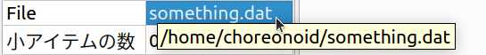
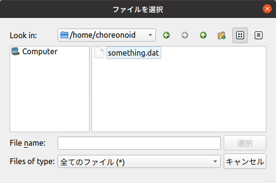
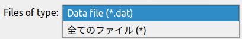

================================
プロジェクトアイテムのプロパティ
================================

.. contents:: 目次
   :local:

.. highlight:: cpp

概要
----

プロジェクトアイテムは、その内部の状態や設定にアクセスするための「プロパティ」という仕組みを備えています。
この仕組みを用いることで、どのアイテム型であっても、 :ref:`basics_mainwindow_item_property_view` の統一的なインタフェースでアイテムの状態や設定を確認／編集することが可能となります。
プロパティは容易に実装することができ、プロパティビューで手軽に確認や編集ができますので、アイテムの開発側にとっても利用側にとっても便利な仕組みとなっています。

本節ではこの仕組みに基づくプロパティをアイテムに実装する方法について解説します。

プロパティ出力関数
------------------

プロパティの仕組みにおいて中心的な役割を果たすのが `Itemクラス <https://choreonoid.org/ja/documents/reference/latest/classcnoid_1_1Item.html>`_ の以下の関数です。 ::

 void putProperties(PutPropertyFunction& putProperty);

これはプロパティにアクセスする際に呼ばれる関数で、この関数から引数のputPropertyオブジェクトを介してアイテムのプロパティが出力されます。アイテムプロパティビューもこの関数を使用してプロパティの情報を取得しています。

Itemクラスにはプロパティに関するもうひとつの関数として、以下も定義されています。 ::
  
 virtual void doPutProperties(PutPropertyFunction& putProperty);

こちらはvirtual関数となっていて、Itemクラスのサブクラスでオーバーライドして実装します。
これはputProperties関数の内部からを呼ばれるようになっています。
この関数を実装することで、各アイテム型固有のプロパティを出力することができます。

以上の構成についてまとめると以下になります。

* プロジェクトアイテムのプロパティはItemクラスのputProperties関数によって出力される。

* 各アイテム型に固有のプロパティはItemクラスのvirtual関数doPutPropertiesをオーバーライドすることで実装する。

* putProperties関数は、アイテム型に共通のプロパティを出力するとともに、doPutProperties関数も実行して個々のアイテム型固有のプロパティも出力する。

従って、アイテム型に固有のプロパティを実装するにあたっては、対応するクラスでdoPutProperties関数を実装すればOKです。

.. _plugin-dev-put-property-function:

PutPropertyFunctionによるプロパティの出力
-----------------------------------------

プロパティの出力はdoPutProperties関数の引数putPropertyオブジェクトを介して行います。
これは `PutPropertyFunctionクラス <https://choreonoid.org/ja/documents/reference/latest/classcnoid_1_1PutPropertyFunction.html>`_ のオブジェクトです。このクラスはインタフェースクラスとして機能する抽象クラスで、プロパティ出力のための各種関数が関数呼び出し演算子のかたちで定義されています。

このクラスはPutPropertyFunctionヘッダで定義されていますので、使用の際はこのヘッダを以下のようにしてインクルードしておきます。 ::

 #include <cnoid/PutPropertyFunction>

PutPropertyFunctionでは、まず単純にプロパティの値を出力するための関数として、以下の関数（関数呼び出し演算子）が定義されています。

* **void operator() (const std::string& name, bool value)**

  * bool型のプロパティを出力する。
  * nameにはプロパティ名を、valueに値を出力する（以下同様）。
  
* **void operator() (const std::string& name, int value)**

  * int型のプロパティを出力する。

* **void operator() (const std::string& name, double value)**

  * double型のプロパティを出力する。

* **void operator() (const std::string& name, const std::string& value)**

  * 文字列（std::string）型のプロパティを出力する。
  
* **void operator() (const std::string& name, const Selection& selection)**

  * いくつかの選択肢からひとつ選ぶタイプのプロパティを出力する。

  * `Selectionクラス <https://choreonoid.org/ja/documents/reference/latest/classcnoid_1_1Selection.html>`_ の値として出力する。

* **void operator() (const std::string& name, const FilePathProperty& filepath)**

  * ファイルパスのプロパティを出力する。

  * `FilePathPropertyクラス <https://choreonoid.org/ja/documents/reference/latest/classcnoid_1_1FilePathProperty.html>`_ の値として出力する。

例えばint型の"id"というプロパティがメンバ変数idに格納されているとします。これをdoPutProperties関数で出力する場合は以下のようにします。 ::

 virtual void doPutProperties(PutPropertyFunction& putProperty) override
 {
     putProperty("id", id);
 }

数値のプロパティについては、値の範囲を設定することもできます。 ::
      
 putProperty.min(0).max(10);
 putProperty("id", id);

とするとidは0から10の範囲となります。minやmaxはオブジェクト自身への参照を返すので、以下のように書くこともできます。 ::

 putProperty.min(0).max(10)("id", id);

double型の場合は数値の精度も指定できます。例えばdouble型のratioというプロパティについて ::

 putProperty.min(0.0).max(1.0).decimals(1)("ratio", ratio);

とすると、このプロパティは0.0から1.0の範囲で、小数点以下1桁までの精度で表示されることになります。

値の範囲や精度は一度設定するとその後の出力にも有効となりますが、 ::

 putProperty.reset();

とすると設定がリセットされます。

なお、対象のアイテム型が直接Itemクラスを継承しておらず、他のアイテム型を継承している場合は、doPutPropropertiesについてスーパークラスのプロパティ出力も引き継ぐ必要があります。例えば以下のように、Itemを継承しているFooItemがあり、それをさらにBarItemが継承していて、それぞれdoPutProperties関数を実装しているとします。 ::

 class FooItem : public Item
 {
     ...
 
     virtual void doPutProperties(PutPropertyFunction& putProperty) override
     {
         ...
     }
 };

 class BarItem : public FooItem
 {
     ...
 
     virtual void doPutProperties(PutPropertyFunction& putProperty) override
     {
         ...
     }
 };

この場合、BarItemがFooItemのプロパティを引き継ぐためには、BarItemのdoPutProperties関数を以下のようにします。 ::

 virtual void doPutProperties(PutPropertyFunction& putProperty) override
 {
     FooItem::doPutProperties(putProperty);

     ...
 };

もしBarItemでFooItemのプロパティを引き継ぎたくない事情があれば、必ずしもこれを行う必要はありません。

編集可能プロパティの出力
------------------------

プロパティは単に現在の値を出力するだけでなく、ユーザが編集して更新することもできます。
実際にアイテムプロパティビュー上で設定できるプロパティがあることをご存知ではないかと思います。

これを実現するためには、PutPropertyFunctionの以下の関数（関数呼び出し演算子）を使用します。
それぞれ前述の出力用関数について編集操作に対応したバージョンとなっています。

* **void operator() (const std::string& name, bool value, const std::function<bool(bool)>& changeFunc)**

  * bool型のプロパティについてその更新処理も含めて出力する。
  
* **void operator() (const std::string& name, int value, const std::function<bool(int)>& changeFunc)**

  * int型のプロパティについてその更新処理も含めてを出力する。

* **void operator() (const std::string& name, double value, const std::function< bool(double)>& changeFunc)**

  * double型のプロパティについてその更新処理も含めてを出力する。

* **void operator() (const std::string& name, const std::string& value, const std::function< bool(const std::string &)>& changeFunc)**

  * 文字列（std::string）型のプロパティについてその更新処理も含めて出力する。
  
* **void operator() (const std::string& name, const Selection& selection, const std::function< bool(int which)>& changeFunc)**

  * Selection型のプロパティについてその更新処理も含めて出力する。

* **void operator() (const std::string& name, const FilePathProperty& filepath, const std::function< bool(const std::string &)>& changeFunc)**

  * ファイルパスのプロパティについてその更新処理も含めて出力する。

これらの関数で出力されたプロパティについては、ユーザによって値が入力されると、その値を引数として関数オブジェクトchangeFuncが実行されます。そこでchangeFuncにプロパティを更新する処理を与えることで、プロパティの編集を実現できます。changFuncは全てbool型の戻り値を有しており、値を更新出来た場合はtrue、できなかった場合はfalseを返すようにします。

先ほどと同様に、int型の "ID" というプロパティがメンバ変数idに格納されている場合、以下のようにすることでidの編集操作を実現できます。 ::

 putProperty("ID", id, [this](int value){ id = value; return true; });

trueを返すことでこの値が実際に更新されたことがプロパティ編集側にも伝わります。
これによって、例えばアイテムプロパティビューであれば実際に編集した項目
このように「ある変数の値を常に入力値で更新する」場合は、changeProperty関数を用いて以下のように記述することもできます。 ::

 putProperty("ID", id, changeProperty(id));

changePropertyに先のラムダ式と同様の処理が実装されています。
先のラムダ式にも当てはまりますが、この場合変数idはプロパティを扱う間存在しつづける必要があることにご注意ください。
アイテムのメンバ変数であれば問題ありません。

あるid値について、他と重複している等の理由により、使用できないとします。そのような場合は以下のようにすることで更新を拒否することができます。 ::

 putProperty("ID", id,
             [this](int value){
                 if(value == 5){
                     return false;
                 }
                 id = value;
                 return true;
             });

ここでは入力値が5のときはidを更新しないようにしています。

.. _plugin-dev-item-properties-selection:

Selection型の利用
-----------------

PutPropertyFunctionの出力形式の一覧で挙げていた `Selection型 <https://choreonoid.org/ja/documents/reference/latest/classcnoid_1_1Selection.html>`_ の値をとるものについては、いくつかの選択肢からひとつ選ぶタイプのプロパティを実現するものです。ここではその使用方法について解説します。

Selection型は複数の選択肢のシンボル（文字列）を格納し、あわせて今どの選択肢が選択されているかの情報を持つ型となります。
まず選択肢となるシンボルをセットしておき、状況に応じて現在の選択肢を指定または参照します。

例として、色を赤、緑、青の選択肢の中から選ぶ場合を考えましょう。このためのSelection型の値colorSelectionを以下のように作成します。 ::

 Selection colorSelection({ "Red", "Green", "Blue" });

これで赤、緑、青に対応するRed、Green、Blueというシンボルが登録されました。

ここで ::

 colorSelection.select("Green");

とすると、現在の選択がGreenになります。そして現在選択されているシンボルは以下のようにして得ることができます。 ::

 std::string symbol = colorSelection.selectedSymbol();

.. note:: 各シンボルには各国言語に翻訳した文字列も紐付けることができます。その場合はselectedLabelという関数で翻訳版のテキストを取得できます。各国言語に翻訳した文字列は国際化機能によってデータを作成しておきます。この詳細は別途解説します。

実際には選択や参照はシンボルの文字列ではなく整数インデックス値で行うのが一般的です。
インデックスはシンボルの登録順に割り振られていて、この例では

0. Red
1. Green
2. Blue

となります。

Greenを選択する場合はこのインデックスで ::

 colorSelection.select(1);

とすることもできます。また現在選択されているインデックスは ::

 int index = colorSelection.selectedIndex();

もしくは ::

 int index = colorSelection.which();

で得ることができます。

選択肢に対応する列挙型を定義しておけば、インデックスの数値をシンボルで置き換えられます。例えば ::

 enum Color { Red, Green, Blue };

としておけば、 ::

 colorSelection.select(Green);

として選択できますし、 ::

 if(colorSelection.which() == Green){
     ...
 }

のような記述も可能となります。

プロパティとして出力する場合は単純にこの値を出力すればOKです。doPutProperties関数で ::

 putProperty("Color", colorSelection);

とすると、このSelectionの情報が出力されます。アイテムプロパティビューでは、選択されている選択肢のシンボルが表示されます。

ただし出力するだけでは文字列の出力とあまり変わらないかも知れません。つまり ::

 putProperty("Color", colorSelection.selectedSymbol());

としてもアイテムプロパティビュー上の表示は同じになります。（正確にはselectedLabelの出力する文字列と同じになります。）

Selection型が真価を発揮するのはプロパティの編集を行う場合です。これは ::

 putProperty("Color", colorSelection, [this](int which){ return colorSelection.select(which); });

などとして実現できます。Selection型のselect関数は引数whichが選択肢の範囲内であればtrueを返し、そうでなければ（選択を変えずに）falseを返すので、changeFunc関数の仕様ともマッチします。

このようにすると、アイテムプロパティビュー上での編集時に以下のようにコンボボックスで選択肢が表示されます。

.. image:: images/selection-combo.png
    :scale: 80%

以上の方法で、定められた選択肢の中から値を選択するプロパティを実現できます。

.. note:: Selection型はプロパティ機能とは独立して定義されている汎用的な型で、プロパティに限らずどこでも使用することができます。選択肢とそのシンボル、現在の選択をまとめて格納できるので、便利に使える場面もあるかと思います。そしてアイテムの内部状態を保持するために元々Selection型を使用している場合は、それをそのままプロパティとしても利用できるという流れになります。

FilePathProperty型の利用
------------------------

PutPropertyFunctionの出力形式の一覧では `FilePathProperty型 <https://choreonoid.org/ja/documents/reference/latest/classcnoid_1_1FilePathProperty.html>`_ の値を引数にとるものも挙げていました。これはファイル名やファイルパスをプロパティとして出力する際に使えるものです。

この型はコンストラクタでファイル名やファイルパスの文字列を指定して生成できます。アイテムで使用するファイルのパスがstring型のメンバ変数filepathに格納されているとしましょう。このファイルパスの情報はputPropertyを用いて以下のように出力できます。 ::

 putProperty("File", FilePathProperty(filepath));

この型を介して出力すると、デフォルトではファイルパスからディレクトリを除去したファイル名の部分だけ表示されます。例えばfilepathの内容が "/home/choreonoid/something.dat" であるとすると、アイテムプロパティビューには "something.dat" と表示されます。その上で、ファイル名が表示されている箇所をマウスポインタでしばらく指していると、パス全体を表す文字列が以下のようにツールチップとして表示されます。

このようにして、パス全体としては長くなる場合でも通常はファイル名だけのコンパクトな表示としつつ、必要に応じてパス全体も確認できるようになっています。これはファイル名の表示に単なる文字列ではなくFilePathPropertyを使用するひとつの利点となります。

ちなみにこの挙動はFilePathPropertyのsetFullpathDisplayMode関数で切り替えられるようになっており、常にパス全体を表示させることも可能です。

そしてFilePathPropertyがより真価を発揮するのはSelectionと同様でやはりプロパティの編集を行う場合です。これは ::

 putProperty("File", FilePathProperty(filepath),
             [this](const std::string& value){
                 filepath = value;
                 return true;
             });

などとして実現できます。
このようにして出力すると、アイテムプロパティビュー上での編集時に以下のように表示されます。

.. image:: images/filepathproperty-edit.png
    :scale: 80%

このように編集時の入力領域にはパス全体が表示されます。この領域はテキスト入力フォームとなっていますので、ここでそのまま編集してもよいのですが、さらに右端にファイルのアイコンが表示されています。このアイコンをクリックすると、以下のようなファイル選択ダイアログが表示されます。

ダイアログでは現在設定されているファイルパスのディレクトリがデフォルトで開かれます。
そしてこのダイアログでファイルを選択すると、それがプロパティの編集結果として入力されます。
このようにファイルダイアログを使用することで、ユーザは効率的にファイルの選択を行うことができます。

FilePathPropertyでは対象とするファイルのフィルタも設定できます。これは以下のようにして設定します。 ::

 FilePathProperty property(filepath);
 property.setFilters({ "Data file (*.dat)" });

※ setFiltersの内容はFilePathPropertyのコンストラクタの第二引数でも設定できます。

このようにして出力すると、ファイルダイアログでファイルタイプを指定する項目にフィルタの内容が追加され、以下のようになります。

ファイルダイアログ上で一覧表示されるファイルは、このフィルタに該当するものとなり、対象とするファイルタイプのみを表示させることができます。フィルタは複数設定することも可能で、その場合は先頭のフィルタがデフォルトで適用されます。

FilePathPropertyは他にもファイルの選択を行いやすくするための機能を備えています。
それらの詳細はリファレンスマニュアルをご参照ください。

全アイテム型に共通のプロパティ
------------------------------

各アイテム型固有のプロパティを出力する方法をここまで説明しましたが、全アイテム型の基底となるItemクラスからもプロパティが出力されるようになっています。これは全アイテム型に共通のもので、具体的には以下のプロパティとなります。

* **名前**

  * アイテムの名前

* **クラス**

  * アイテムのクラス名

* **子アイテムの数**

  * アイテムが保有する子アイテムの数

* **サブアイテム？**

  * アイテムがSubItem属性を有しているか

* **一時的**

  * アイテムがTemporal属性を有しているか

* **参照数**

  * アイテムを保持しているref_ptrの数

これらのプロパティは各アイテム型におけるdoPutProperties関数の実装とは関係なく、常に出力されます。
これによってアイテムの基本的な属性や状態が分かります。

.. note:: これらのプロパティにはデバッグ要素的な意味合いのものもあり、それらは一般のユーザには必ずしも必要ないので、今後のChoreonoidの改良で表示を切り替えられるようにすることを検討しています。

.. 補足: ItemPropertyViewのカスタマイズについて
.. ---------------------------------------------

