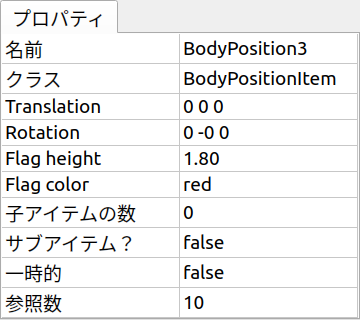

==================================================
プロジェクトアイテムのプロパティ実装サンプル (S07)
==================================================

.. contents:: 目次
   :local:

概要
----

本節では :doc:`item-properties` に関するサンプルとして、 :doc:`item-scene-sample` にプロパティを実装します。
これによって、BodyPositionアイテムに記録されている位置をプロパティとして確認・設定できるようにします。
また、記録位置を可視化する旗について、その高さと色をプロパティで変更できるようにします。

ソースコード
------------

.. highlight:: cpp

これまでのサンプルはソースコードをひとつのファイルにまとめていましたが、本サンプルは実装内容が複雑になってきたこともあり、ソースコードをいくつかのファイルに分けることにします。これまでのようにサンプルとしてはソースコードを簡潔にするためひとつのファイルにまとめることもありますが、実際のプラグインの実装では複数のファイルで実装するのが一般的です。これ以降のサンプルもこの形態で実装することにします。

具体的には本サンプルは以下のファイルで構成されます。

* BodyPositionItem.h

  * BodyPositionItemクラスのヘッダファイル

* BodyPositionItem.cpp

  * BodyPositionItemクラスの実装ファイル

* DevGuidePlugin.cpp

  * プラグインクラスの実装ファイル

以下に各ソースファイルの内容を示します。
なお本サンプルは :doc:`item-scene-sample` を改良したものとなっており、ベースとなる部分の実装はそちらとほぼ同じです。
追加／修正している部分は強調表示しています。

BodyPositionItem.h
~~~~~~~~~~~~~~~~~~

BodyPositionItemクラスのヘッダファイルです。クラスの定義部分だけを記述しています。

.. code-block:: cpp
 :emphasize-lines: 1,2,9,14,21,22,23,24,25,26,27,32,35,37,38,40,42,43,44,47,49

 #ifndef DEVGUIDE_PLUGIN_BODY_POSITION_ITEM_H
 #define DEVGUIDE_PLUGIN_BODY_POSITION_ITEM_H

 #include <cnoid/Item>
 #include <cnoid/RenderableItem>
 #include <cnoid/BodyItem>
 #include <cnoid/SceneGraph>
 #include <cnoid/SceneDrawables>
 #include <cnoid/Selection>
 
 class BodyPositionItem : public cnoid::Item, public cnoid::RenderableItem
 {
 public:
     static void initializeClass(cnoid::ExtensionManager* ext);
 
     BodyPositionItem();
     BodyPositionItem(const BodyPositionItem& org);
     void storeBodyPosition();
     void restoreBodyPosition();
     virtual cnoid::SgNode* getScene() override;
     void setPosition(const cnoid::Isometry3& T);
     const cnoid::Isometry3& position() const { return position_; }
     bool setFlagHeight(double height);
     double flagHeight() const { return flagHeight_; }
     enum ColorId { Red, Green, Blue };
     bool setFlagColor(int colorId);
     double flagColor() const { return flagColorSelection.which(); }
 
 protected:
     virtual Item* doDuplicate() const override;
     virtual void onTreePathChanged() override;
     virtual void doPutProperties(PutPropertyFunction& putProperty) override;
 
 private:
     void createFlag();
     void updateFlagPosition();
     void updateFlagMaterial();
 
     cnoid::BodyItem* bodyItem;
     cnoid::Isometry3 position_;
     cnoid::SgPosTransformPtr flag;
     double flagHeight_;
     cnoid::Selection flagColorSelection;
     cnoid::SgMaterialPtr flagMaterial;
 };
 
 typedef cnoid::ref_ptr<BodyPositionItem> BodyPositionItemPtr;
 
 #endif // DEVGUIDE_PLUGIN_BODY_POSITION_ITEM_H

BodyPositionItem.cpp
~~~~~~~~~~~~~~~~~~~~

BodyPositionItemの実装ファイルです。

.. code-block:: cpp
 :emphasize-lines: 5,12,13,14,15,16,17,22,23,24,25,26,27,34,35,36,83,88,89,90,91,92,93,94,95,96,97,102,114,122,130,132,138,139,140,141,142,143,144,145,146,147,148,149,150,151,152,153,154,155,156,158,159,160,161,162,163,165,166,167,168,169,170,172,173,174,175,176,177,179,180,181,182,183,184,186,187,189,190,191,192,193,194,196,197,198,199,200,201,202,203,204,205,206,207,208,209,210,211,212,213,214,215,216,217,218,219,220

 #include "BodyPositionItem.h"
 #include <cnoid/ItemManager>
 #include <cnoid/MeshGenerator>
 #include <cnoid/EigenUtil>
 #include <cnoid/PutPropertyFunction>
 #include <fmt/format.h>
 
 using namespace std;
 using namespace fmt;
 using namespace cnoid;

 void BodyPositionItem::initializeClass(ExtensionManager* ext)
 {
     ext->itemManager()
         .registerClass<BodyPositionItem>("BodyPositionItem")
         .addCreationPanel<BodyPositionItem>();
 }
 
 BodyPositionItem::BodyPositionItem()
 {
     bodyItem = nullptr;
     position_.setIdentity();
     flagColorSelection.setSymbol(Red, "red");
     flagColorSelection.setSymbol(Green, "green");
     flagColorSelection.setSymbol(Blue, "blue");
     flagColorSelection.select(Red);
     flagHeight_ = 1.8;
 }

 BodyPositionItem::BodyPositionItem(const BodyPositionItem& org)
     : Item(org)
 {
     bodyItem = nullptr;
     position_ = org.position_;
     flagHeight_ = org.flagHeight_;
     flagColorSelection = org.flagColorSelection;
 }

 Item* BodyPositionItem::doDuplicate() const
 {
     return new BodyPositionItem(*this);
 }

 void BodyPositionItem::onTreePathChanged()
 {
     auto newBodyItem = findOwnerItem<BodyItem>();
     if(newBodyItem && newBodyItem != bodyItem){
	 bodyItem = newBodyItem;
	 mvout()
	     << format("BodyPositionItem \"{0}\" has been attached to {1}.",
		       name(), bodyItem->name())
	     << endl;
     }
 }

 void BodyPositionItem::storeBodyPosition()
 {
     if(bodyItem){
	 position_ = bodyItem->body()->rootLink()->position();
	 updateFlagPosition();
	 mvout()
	     << format("The current position of {0} has been stored to {1}.",
		       bodyItem->name(), name())
	     << endl;
     }
 }

 void BodyPositionItem::restoreBodyPosition()
 {
     if(bodyItem){
	 bodyItem->body()->rootLink()->position() = position_;
	 bodyItem->notifyKinematicStateChange(true);
	 mvout()
	     << format("The position of {0} has been restored from {1}.",
		       bodyItem->name(), name())
	     << endl;
     }
 }

 SgNode* BodyPositionItem::getScene()
 {
     if(!flag){
	 createFlag();
     }
     return flag;
 }

 void BodyPositionItem::createFlag()
 {
     if(!flag){
	 flag = new SgPosTransform;
	 updateFlagPosition();
	 flagMaterial = new SgMaterial;
	 updateFlagMaterial();
     } else {
	 flag->clearChildren();
     }

     MeshGenerator meshGenerator;

     auto pole = new SgShape;
     pole->setMesh(meshGenerator.generateCylinder(0.01, flagHeight_));
     pole->getOrCreateMaterial()->setDiffuseColor(Vector3f(0.7f, 0.7f, 0.7f));
     auto polePos = new SgPosTransform;
     polePos->setRotation(AngleAxis(radian(90.0), Vector3::UnitX()));
     polePos->setTranslation(Vector3(0.0, 0.0, flagHeight_ / 2.0));
     polePos->addChild(pole);
     flag->addChild(polePos);

     auto ornament = new SgShape;
     ornament->setMesh(meshGenerator.generateSphere(0.02));
     ornament->getOrCreateMaterial()->setDiffuseColor(Vector3f(1.0f, 1.0f, 0.0f));
     auto ornamentPos = new SgPosTransform;
     ornamentPos->setTranslation(Vector3(0.0, 0.0, flagHeight_ + 0.01));
     ornamentPos->addChild(ornament);
     flag->addChild(ornamentPos);

     auto banner = new SgShape;
     banner->setMesh(meshGenerator.generateBox(Vector3(0.002, 0.3, 0.2)));
     banner->setMaterial(flagMaterial);
     auto bannerPos = new SgPosTransform;
     bannerPos->setTranslation(Vector3(0.0, 0.16, flagHeight_ - 0.1));
     bannerPos->addChild(banner);
     flag->addChild(bannerPos);
 }

 void BodyPositionItem::updateFlagPosition()
 {
     if(flag){
	 auto p = position_.translation();
	 flag->setTranslation(Vector3(p.x(), p.y(), 0.0));
	 auto rpy = rpyFromRot(position_.linear());
	 flag->setRotation(AngleAxis(rpy.z(), Vector3::UnitZ()));
	 flag->notifyUpdate();
     }
 }

 void BodyPositionItem::updateFlagMaterial()
 {
     if(flagMaterial){
	 switch(flagColorSelection.which()){
	 case Red:
	     flagMaterial->setDiffuseColor(Vector3f(1.0f, 0.0f, 0.0f));
	     break;
	 case Green:
	     flagMaterial->setDiffuseColor(Vector3f(0.0f, 1.0f, 0.0f));
	     break;
	 case Blue:
	     flagMaterial->setDiffuseColor(Vector3f(0.0f, 0.0f, 1.0f));
	     break;
	 default:
	     break;
	 }
	 flagMaterial->notifyUpdate();
     }
 }        

 void BodyPositionItem::setPosition(const Isometry3& T)
 {
     position_ = T;
     updateFlagPosition();
     notifyUpdate();
 }

 bool BodyPositionItem::setFlagHeight(double height)
 {
     if(height <= 0.0){
	 return false;
     }
     flagHeight_ = height;
     if(flag){
	 createFlag();
	 flag->notifyUpdate();
     }
     notifyUpdate();
     return true;
 }

 bool BodyPositionItem::setFlagColor(int colorId)
 {
     if(!flagColorSelection.select(colorId)){
	 return false;
     }
     updateFlagMaterial();
     notifyUpdate();
     return true;
 }

 void BodyPositionItem::doPutProperties(PutPropertyFunction& putProperty)
 {
     auto p = position_.translation();
     putProperty("Translation", format("{0:.3g} {1:.3g} {2:.3g}", p.x(), p.y(), p.z()),
		 [this](const string& text){
		     Vector3 p;
		     if(toVector3(text, p)){
			 position_.translation() = p;
			 setPosition(position_);
			 return true;
		     }
		     return false;
		 });

     auto r = degree(rpyFromRot(position_.linear()));
     putProperty("Rotation", format("{0:.0f} {1:.0f} {2:.0f}", r.x(), r.y(), r.z()),
		 [this](const string& text){
		     Vector3 rpy;
		     if(toVector3(text, rpy)){
			 position_.linear() = rotFromRpy(radian(rpy));
			 setPosition(position_);
			 return true;
		     }
		     return false;
		 });

     putProperty.min(0.1)("Flag height", flagHeight_,
		 [this](double height){ return setFlagHeight(height); });

     putProperty("Flag color", flagColorSelection,
		 [this](int which){ return setFlagColor(which); });
 }

DevGuidePlugin.cpp
~~~~~~~~~~~~~~~~~~

プラグインクラスを実装しているDevGuidePlugin.cppのソースコードです。
こちらは :doc:`item-scene-sample` のプラグインクラス実装部分を分離したものです。

.. code-block:: cpp
 :emphasize-lines: 20

 #include "BodyPositionItem.h"
 #include <cnoid/Plugin>
 #include <cnoid/ToolBar>
 #include <cnoid/RootItem>
 #include <cnoid/ItemList>
 
 using namespace cnoid;
 
 class DevGuidePlugin : public Plugin
 {
 public:
     DevGuidePlugin()
         : Plugin("DevGuide")
     {
         require("Body");
     }
        
     virtual bool initialize() override
     {
         BodyPositionItem::initializeClass(this);
        
         auto toolBar = new ToolBar("BodyPositionBar");
         toolBar->addButton("Store Body Positions")->sigClicked().connect(
             [this](){ storeBodyPositions(); });
         toolBar->addButton("Restore Body Positions")->sigClicked().connect(
             [this](){ restoreBodyPositions(); });
         toolBar->setVisibleByDefault();
         addToolBar(toolBar);
 
         return true;
     }
            
     void storeBodyPositions()
     {
         for(auto& item : RootItem::instance()->selectedItems<BodyPositionItem>()){
             item->storeBodyPosition();
         }
     }
    
     void restoreBodyPositions()
     {
         for(auto& item : RootItem::instance()->selectedItems<BodyPositionItem>()){
             item->restoreBodyPosition();
         }
     }
 };
 
 CNOID_IMPLEMENT_PLUGIN_ENTRY(DevGuidePlugin)

CMakeLists.txt
~~~~~~~~~~~~~~

.. highlight:: cmake

ソースファイルを分けたので、CMakeLists.txtもそれにあわせて修正しています。
内容は :doc:`item-operation-sample` で提示したものとほぼ同じですが、choreonoid_add_pluginに複数のソースファイルを指定している点が異なります。

Choreonoid本体のビルド環境でビルドする場合は以下になります。 ::

 choreonoid_add_plugin(CnoidDevGuidePlugin DevGuidePlugin.cpp BodyPositionItem.cpp)
 target_link_libraries(CnoidDevGuidePlugin PUBLIC CnoidBodyPlugin)

Choreonoid本体とは独立してビルドする場合は以下になります。 ::

 cmake_minimum_required(VERSION 3.10)
 project(DevGuidePlugin)
 find_package(Choreonoid REQUIRED)
 set(CMAKE_CXX_STANDARD ${CHOREONOID_CXX_STANDARD})
 choreonoid_add_plugin(CnoidDevGuidePlugin DevGuidePlugin.cpp BodyPositionItem.cpp)
 target_link_libraries(CnoidDevGuidePlugin PUBLIC Choreonoid::CnoidBodyPlugin)

.. _plugin-dev-item-property-sample-howto:

プロパティの利用方法
--------------------

今回のプラグインを読み込むと、BodyPositionアイテムに以下のプロパティが追加されます。

* **Translation**

 * 記録位置の並進成分
 * X、Y、Zの3要素を表示、設定

* **Rotation**

 * 記録位置の回転成分
 * ロール、ピッチ、ヨーの3要素を表示、設定

* **Flag height**

  * 旗の高さ
  * 数値（メートル）で指定

* **Flag color**

  * 旗の色
  * red, gree、blueの中から選択

これまでのサンプルと同じ要領でBodyPositionアイテムを作成し、それをアイテムツリービュー上で選択します。
するとアイテムプロパティビュー上にこれらのプロパティが以下のように表示されます。

ここでそれぞれのプロパティの値の部分をクリックすると入力ができるようになりますので、適当に変えてみましょう。
旗の高さと色については、BodyPositionアイテムのチェックが入っていれば、設定した値がシーンビュー上の表示に反映されます。

例えば :doc:`item-scene-sample` の :ref:`plugin-dev-item-scene-sample-body-position-item-visualization` で提示したのと同様に、PA10Pickupの3つのモデルにそれぞれBodyPositionアイテムを付与して現在位置を記録し、旗を表示します。そして各アイテムに異なる高さと色を設定してみましょう。以下にその例を示します。

.. image:: images/flags-example.png
    :scale: 50%

ここでは各BodyPositionアイテムのプロパティを以下のように設定しています。

* BodyPosition1

  * Translation: 0 0 0
  
  * Rotation: 0 0 0

  * Flag height: 1.8

  * Flag color: red

* BodyPosition2

  * Translation: 0 0.7 0.15
  
  * Rotation: 0 0 0

  * Flag height: 0.8

  * Flag color: green

* BodyPosition3

  * Translation: 0.9 0 0.035
  
  * Rotation: 0 0 90

  * Flag height: 0.5

  * Flag color: blue

このようにアイテムにプロパティを導入することで、アイテムのデータや設定をユーザが容易に変更できるようになります。

ソースコードの解説
------------------

.. highlight:: cpp

本サンプルのソースコードについてファイルごとに解説します。

BodyPositionItem.h
~~~~~~~~~~~~~~~~~~

このファイルではBodyPositionItemクラスの定義をしています。

ここではまずこのファイルがBodyPositionItemクラスのヘッダファイルとしてどこからも使えるようにするため、以下のインクルードガードを導入しています。 ::

 #ifndef DEVGUIDE_PLUGIN_BODY_POSITION_ITEM_H
 #define DEVGUIDE_PLUGIN_BODY_POSITION_ITEM_H
 ...

 #endif // DEVGUIDE_PLUGIN_BODY_POSITION_ITEM_H

インクルードしているヘッダファイルはこれまのサンプルでも使用されたものです。 ::

 class BodyPositionItem : public cnoid::Item, public cnoid::RenderableItem

BodyPositionItemクラスの定義を開始します。ここで基底クラスに名前空間cnoidのスコープ解決演算子をつけています。
 
このファイルではBodyPositionItemクラスをグローバル名前空間で定義しています。
ただしこれまでのサンプルとは異なり、今回はヘッダファイルなので、このファイル内で ::

 using namespace cnoid;

などとしてusingディレクティブを使用することは推奨されません。
従って、上記のようにChoreonoid SDKのクラスについては名前空間cnoidを明示的に指定するようにしています。
これはこのファイル内で使用されている他のChoreonoid SDKクラスについても同様です。

.. note:: 名前空間cnoidの明示的な指定は、クラス定義を名前空間cnoid内で行えば必要なくなります。ただし名前空間cnoidはChoreonoid SDK用のものですので、独自プラグインの場合は通常使用しないほうがよいでしょう。この名前空間を使用するのは、基本的にはChoreonoid本体に含まれるプラグインか、公式に認定されたプラグインに限られます。

:doc:`item-scene-sample` からの追加要素として、BodyPositionItemクラスにはまず以下のstatic関数を追加しています。 ::

 static void initializeClass(cnoid::ExtensionManager* ext);

これはBodyPositionItemクラスの初期化を行う関数です。

他の追加要素として、記録位置、旗の高さ、旗の色に関して、設定と取得をできるようにしています。

まず記録位置については、以下のメンバ関数を定義しています。 ::

 void setPosition(const cnoid::Isometry3& T);
 const cnoid::Isometry3& position() const { return position_; }

それぞれ記録位置の設定と取得を行う関数です。いわゆるセッタ、ゲッタ関数ですね。
ゲッタ関数はgetPositionとはせずに、変数と同様の名前としています。その場合ゲッタ関数と変数で名前が衝突してしまうので、変数名の方にアンダーバーを付与して ::

 cnoid::Isometry3 position_;

と定義して、名前の衝突を避けています。Choreonoid本体の実装でも同じ形態でメンバ変数とゲッタ関数を定義している部分が各所にあり、ここではその形態を踏襲しています。

旗の高さについては、関数 ::

 bool setFlagHeight(double height);
 double flagHeight() const { return flagHeight_; }

で設定と取得を行えるようにし、変数は ::

 double flagHeight_;

と定義しています。

旗の色については、まず列挙型 ::

 enum ColorId { Red, Green, Blue };

によって3つの選択肢の中から選ぶようにしています。これは :ref:`Selection型 <plugin-dev-item-properties-selection>` の変数 ::

 Selection flagColorSelection;

に格納するようにしています。そして色の設定と取得を行うメンバ関数として ::

  bool setFlagColor(int colorId);
  double flagColor() const { return flagColorSelection.which(); }

を定義しています。

また、旗の色を決めるマテリアルの変数として、 ::

 SgMaterialPtr flagMaterial;

を定義しています。これはflagと同様にスマートポインタとしていて、生成後はこのアイテムで常に保持するようにしています。
色のプロパティの反映はこのマテリアルの色要素を変更することで実現しています。

他にはプロパティを実装するために ::

 virtual void doPutProperties(PutPropertyFunction& putProperty) override;

を定義し、他に内部実装用にcreateFlagとupdateFlagMaterialの関数を追加しています。

BodyPositionItemクラスの定義の後に、 ::

 typedef cnoid::ref_ptr<BodyPositionItem> BodyPositionItemPtr;

によって、BodyPositionItemのスマートポインタをBodyPositionItemPtrという名称でtypedefしています。
これは今回のサンプルでは使用しませんが、今後BodyPositionItemのインスタンスを保持しておきたい場面で使用します。
Choreonoidではスマートポインタの利用が多いと思われるクラスについては、このように「クラス名 + Ptr」という名前でスマートポインタ型をtypedefし、コーディングで使用するのが慣例となっています。

BodyPositionItem.cpp
~~~~~~~~~~~~~~~~~~~~

このファイルではBodyPositionItemクラスの実装をしています。
:doc:`item-scene-sample` から追加・変更になった部分を中心に解説します。 ::

 #include <cnoid/PutPropertyFunction>     

アイテムのプロパティを実装するのに必要なPutPropertyFunctionのヘッダをインクルードしています。 ::

 void BodyPositionItem::initializeClass(ExtensionManager* ext)
 {
     ext->itemManager()
         .registerClass<BodyPositionItem>("BodyPositionItem")
         .addCreationPanel<BodyPositionItem>();
 }

BodyPositionItemクラスを登録するための関数です。
これまでプラグインクラスのinitialize関数に記述していた処理をこちらに移しています。
このようにしてBodyPositionItemに関わる処理をなるべくこのファイルにまとめるようにしています。 ::

 BodyPositionItem::BodyPositionItem()
 {
     bodyItem = nullptr;
     position_.setIdentity();
     flagColorSelection.setSymbol(Red, "red");
     flagColorSelection.setSymbol(Green, "green");
     flagColorSelection.setSymbol(Blue, "blue");
     flagColorSelection.select(Red);
     flagHeight_ = 1.8;
 }

BodyPositionItemのデフォルトコンストラクタです。
flagColorSelectionに赤（Red）、緑（Green）、青（Blue）の選択肢をセットして、デフォルトの選択を赤としています。
また旗の高さのデフォルトを1.8に設定しています。 ::

 BodyPositionItem::BodyPositionItem(const BodyPositionItem& org)
     : Item(org)
 {
     bodyItem = nullptr;
     position_ = org.position_;
     flagHeight_ = org.flagHeight_;
     flagColorSelection = org.flagColorSelection;
 }
  
BodyPositionItemのコピーコンストラクタです。
旗の高さと色についてもコピーしています。 ::

 SgNode* BodyPositionItem::getScene()
 {
     if(!flag){
         createFlag();
     }
     return flag;
 } 

RenderableItemインタフェースのgetScene関数です。
:doc:`item-scene-sample` とは構成を変えて、実際の旗のシーンモデルの生成はcreateFlag関数で行うようにしています。 ::

 void BodyPositionItem::createFlag()
 {
     ...
 }

旗のシーンモデルを生成する関数です。この関数は、旗の高さを変更したときにも実行されるようになっています。
実行される度にその時のパラメータで旗を生成しなおします。以下ではこの関数内のコードをみていきます。 ::

  if(!flag){
      flag = new SgPosTransform;
      updateFlagPosition();
      flagMaterial = new SgMaterial;
      updateFlagMaterial();
  } else {
      flag->clearChildren();
  }

モデルを初めて生成する場合と生成し直す場合で処理を分けています。
初めて生成する場合はモデルのトップノードとなるflagと色の変更を受け持つflagMaterialを生成します。
これらはモデルを生成し直す際にも保持されます。
生成したオブジェクトはそれぞれupdateFlagPosition関数とupdateFlagMaterial関数で初期化しています。
モデルを生成し直す場合は、flagの子ノードを全て除去し、生成し直すモデルで置き換えられるようにしています。 ::

 MeshGenerator meshGenerator;
 
 auto pole = new SgShape;
 pole->setMesh(meshGenerator.generateCylinder(0.01, flagHeight_));
 pole->getOrCreateMaterial()->setDiffuseColor(Vector3f(0.7f, 0.7f, 0.7f));
 auto polePos = new SgPosTransform;
 polePos->setRotation(AngleAxis(radian(90.0), Vector3::UnitX()));
 polePos->setTranslation(Vector3(0.0, 0.0, flagHeight_ / 2.0));
 polePos->addChild(pole);
 flag->addChild(polePos);
 
 auto ornament = new SgShape;
 ornament->setMesh(meshGenerator.generateSphere(0.02));
 ornament->getOrCreateMaterial()->setDiffuseColor(Vector3f(1.0f, 1.0f, 0.0f));
 auto ornamentPos = new SgPosTransform;
 ornamentPos->setTranslation(Vector3(0.0, 0.0, flagHeight_ + 0.01));
 ornamentPos->addChild(ornament);
 flag->addChild(ornamentPos);
 
 auto banner = new SgShape;
 banner->setMesh(meshGenerator.generateBox(Vector3(0.002, 0.3, 0.2)));
 banner->setMaterial(flagMaterial);
 auto bannerPos = new SgPosTransform;
 bannerPos->setTranslation(Vector3(0.0, 0.16, flagHeight_ - 0.1));
 bannerPos->addChild(banner);
 flag->addChild(bannerPos);

旗のモデルを生成するコードです。こちらも基本的には :doc:`item-scene-sample` の該当コードと同じですが、以下の修正によりプロパティの変更に対応しています。

* 旗の高さをメンバ変数flagHeight_で設定

* banner部のマテリアルとしてメンバ変数のflagMetarialをセット

これによって、flagHeight_の値を変更して再生成をするとその値が反映されます。またflagMaterialの属性を変えるとそれが旗の外観に反映されます。 ::

 void BodyPositionItem::updateFlagMaterial()
 {
     if(flagMaterial){
         switch(flagColorSelection.which()){
         case Red:
             flagMaterial->setDiffuseColor(Vector3f(1.0f, 0.0f, 0.0f));
             break;
         case Green:
             flagMaterial->setDiffuseColor(Vector3f(0.0f, 1.0f, 0.0f));
             break;
         case Blue:
             flagMaterial->setDiffuseColor(Vector3f(0.0f, 0.0f, 1.0f));
             break;
         default:
             break;
         }
         flagMaterial->notifyUpdate();
     }
 }        

旗のマテリアルを更新する関数です。
プロパティのひとつである旗の色について、現在選択されている色をマテリアルの拡散光色として設定します。
このマテリアルに対してnotifyUpdateを実行することで、色の変更をシーングラフに通知しています。 ::

 void BodyPositionItem::setPosition(const Isometry3& T)
 {
     position_ = T;
     updateFlagPosition();
     notifyUpdate();
 }
  
記録位置を設定する関数です。
引数はメンバ変数position_と同じIsometry3型（の参照）で、並進成分と回転成分の両方を含む変換型（4x4同次変換行列に相当）の値です。
記録位置に対応するメンバ変数positionの更新後に、updateFlagPositionで旗の表示位置を更新しています。
さらにアイテム自身が更新されたことを伝えるnotifyUpdate関数を実行しています。
これによって :ref:`plugin-dev-item-operations-signals` で紹介したsigUpdatedシグナルを送出されます。
このアイテムの更新を外部から検知したい場合は、このシグナルを利用します。 ::

 bool BodyPositionItem::setFlagHeight(double height)
 {
     if(height <= 0.0){
         return false;
     }
     flagHeight_ = height;
     if(flag){
         createFlag();
         flag->notifyUpdate();
     }
     notifyUpdate();
     return true;
 }

旗の高さを変更する関数です。flagHeight_の値を設定し直してcreateFlag関数でモデルの再生成を行っています。
生成後はモデルのトップノードに対してnotifyUpdate関数を実行して、変更をシーングラフに通知しています。
またflagHeight_の変更によってアイテムの状態が更新されることになるので、アイテムのnotifyUpdate関数も実行してアイテムの更新を通知しています。
なおこの関数は戻り値としてbool値を返すようにしていて、それによって入力値が妥当なものであるかを示すようにしています。
引数に指定した高さが不正（0以下）の場合は、falseを返して変更を受け付けません。
この形態により、この関数はそのままプロパティの更新関数として使うことができます。 ::

 bool BodyPositionItem::setFlagColor(int colorId)
 {
     if(!flagColorSelection.select(colorId)){
         return false;
     }
     updateFlagMaterial();
     notifyUpdate();
     return true;
 }

旗の色を変更する関数です。ヘッダファイルで定義されている列挙型 ::

  enum ColorId { Red, Green, Blue };

の値で色を指定します。

色が設定されたら、updateFlagMaterial関数でシーン表示における色も更新するようにしています。
そしてsetFlagHeightと同様にnotifyUpdate関数によってアイテムの更新を通知しています。

またこの関数もそのままプロパティの更新関数として使えるようにbool値を返すようにしています。
色のIDが不正な場合はfalseを返します。 ::

 void BodyPositionItem::doPutProperties(PutPropertyFunction& putProperty)
 {
     ...
 }

今回の本題となる部分です。
:doc:`item-properties` で解説したdoPutPropertiesのオーバーライドを用いて、4つのプロパティを実装しています。
以下では各プロパティごとに対応するコードを解説します。 ::

 auto p = position.translation();
 putProperty("Translation", format("{0:.3g} {1:.3g} {2:.3g}", p.x(), p.y(), p.z()),
             [this](const string& text){
                 Vector3 p;
                 if(toVector3(text, p)){
                     position_.translation() = p;
                     setPosition(position_);
                     return true;
                 }
                 return false;
             });

記録位置の並進成分をプロパティとして出力しています。
PutPropertyFunctionにはベクトルを出力する機能は無いので、ここでは文字列として出力しています。
formatで整形し、X、Y、Zの3要素を順番に並べた文字列としています。
そして編集操作を受け付けるように、更新関数も与えています。

更新関数では入力が文字列となりますが、まずそこからtoVector3関数によって3次元ベクトル型Vector3の値に変換しています。
この関数はEigenUtilで定義されています。
変換に成功するとtrueが返るので、その場合は位置を記録しているposition_変数の並進成分をこの値で更新した上で、前述のsetPosition関数に与えています。setPosition関数では結局position_変数が更新されるので、その部分だけみるとわざわざこの関数を実行する必要はありません。しかしsetPosition関数では他に旗の表示位置を更新したりアイテムの更新をシグナルで通知する処理もしていて、そちらも必要なので、ここで実行するようにしています。

そのようにして最終的に並進位置の更新に成功すると更新関数はtrueを返しますが、ユーザの入力した文字列が3次元ベクトル値に変換できない場合は、falseを返します。 ::
  
 auto r = degree(rpyFromRot(position_.linear()));
 putProperty("Rotation", format("{0:.0f} {1:.0f} {2:.0f}", r.x(), r.y(), r.z()),
             [this](const string& text){
                 Vector3 rpy;
                 if(toVector3(text, rpy)){
                     position_.linear() = rotFromRpy(radian(rpy));
                     setPosition(position_);
                     return true;
                 }
                 return false;
             });

記録位置の回転成分をプロパティとして出力しています。
回転成分についてはロールピッチヨー（RPY）で表現していて、position_変数の回転成分から値を算出しています。
その際ラジアン値をディグリー値に変換しています。
これはユーザにとってプロパティの値を分かりやすくするためです。
RPYも3次元ベクトルになりますので、その出力や更新は並進成分と同様に処理しています。
更新関数ではRPY値をラジアンに戻した上で、rotFromRpy関数によって回転行列を算出し、position_変数の回転成分に代入しています。
ここでもsetPosition関数によって位置の更新に必要な処理を行っています。 ::

 putProperty.min(0.1)("Flag height", flagHeight_,
             [this](double height){ return setFlagHeight(height); });

旗の高さをプロパティとして出力し、その更新関数としてsetFlagHeightを関連付けています。 ::
 
 putProperty("Flag color", flagColorSelection,
             [this](int which){ return setFlagColor(which); });

旗の色をプロパティとして出力し、その更新関数としてsetFlagColorを関連付けています。

DevGuidePlugin.cpp
~~~~~~~~~~~~~~~~~~

このソースファイルではDevGuidePluginクラスの定義・実装をしています。
内容は :doc:`item-scene-sample` の該当部分と同じです。

今回BodyPositionItemクラスの定義・実装を別ファイルに分けた上で、その登録処理もBodyPositionItemのinitializeClass関数に実装しました。そこでこちらのファイルからは ::

 #include "BodyPositionItem.h"

としてBodyPositionItemのヘッダをインクルードし、プラグインのinitialize関数で ::

 BodyPositionItem::initializeClass(this);

としてBodyPositionItemクラスの登録を行うようにしています。

ツールバーの作成とボタンが押されたときの処理は引き続きプラグインクラス内に実装していますが、こちらもツールバーの内容が複雑になってきたら、別ファイルに分けるとよいかもしれません。

実際のプラグインは、複数のアイテムやツールバー等の構成要素からなることもあります。そのような場合も、今回のBodyPositionItemのように各構成要素をなるべく別ファイルに分けて実装し、プラグインクラスからはそれらの初期化関数だけ呼び出すようにするのがよいでしょう。そのようにすることで、各構成要素の実装がそれぞれまとまりますし、プラグインクラスの実装も簡潔になるので、プラグインの開発や保守をしやすくなると思います。
