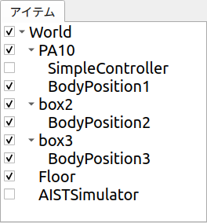
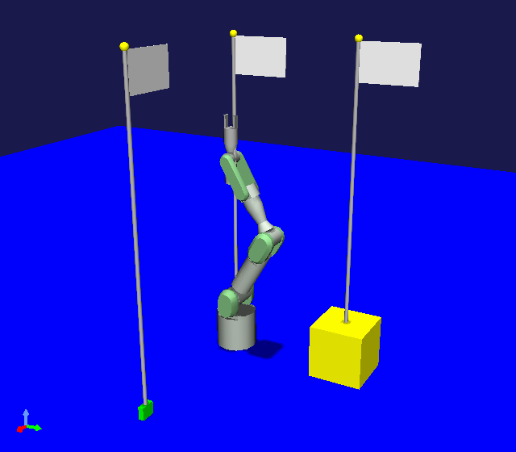

========================
シーン表示サンプル (S06)
========================

.. contents:: 目次
   :local:

.. highlight:: cpp

概要
----

本節では :doc:`item-scene` に関するサンプルとして、 :doc:`new-item-type-sample` をシーン表示に対応させたものを紹介します。
先のサンプルで作成したBodyPositionアイテムについて、記録している位置をシーンビュー上に旗として表示し、視覚的に確認できるようにします。

ソースコード
------------

今回のサンプルのソースコードです。これまでと同様に、プラグインのソースディレクトリを作成し、DevGuidePlugin.cppというファイル名で以下のソースコードを格納してください。ビルド用のCMakeLists.txtもこれまでと同じです。

このソースコードは :doc:`new-item-type-sample` に一部コードを追加したものです。追加された部分についてはその旨のコメントを付けて強調表示をしています。

.. code-block:: cpp
 :emphasize-lines: 9,10,11,12,13,21,22,27,28,66,67,88,89,90,91,92,93,94,95,96,97,98,99,100,101,102,103,104,105,106,107,108,109,110,111,112,113,114,115,116,117,118,119,120,121,122,123,124,126,127,128,129,130,131,132,133,134,135,136,137

 #include <cnoid/Plugin>
 #include <cnoid/ItemManager>
 #include <cnoid/Item>
 #include <cnoid/RootItem>
 #include <cnoid/BodyItem>
 #include <cnoid/ItemList>
 #include <cnoid/ToolBar>
 
 // 以下の4つのヘッダを追加
 #include <cnoid/RenderableItem>
 #include <cnoid/SceneDrawables>
 #include <cnoid/MeshGenerator>
 #include <cnoid/EigenUtil>
 
 #include <fmt/format.h>
 
 using namespace std;
 using namespace fmt;
 using namespace cnoid;
 
 // RenderableItemの継承を追加
 class BodyPositionItem : public Item, public RenderableItem
 {
     BodyItem* bodyItem;
     Isometry3 position;
 
     // 追加
     SgPosTransformPtr flag;
    
 public:
     BodyPositionItem()
     {
         bodyItem = nullptr;
         position.setIdentity();
     }
    
     BodyPositionItem(const BodyPositionItem& org)
         : Item(org)
     {
         bodyItem = nullptr;
         position = org.position;
     }
    
     virtual Item* doDuplicate() const override
     {
         return new BodyPositionItem(*this);
     }
 
     virtual void onTreePathChanged() override
     {
         auto newBodyItem = findOwnerItem<BodyItem>();
         if(newBodyItem && newBodyItem != bodyItem){
             bodyItem = newBodyItem;
             mvout()
                 << format("BodyPositionItem \"{0}\" has been attached to {1}.",
                           name(), bodyItem->name())
                 << endl;
         }
     }
 
     void storeBodyPosition()
     {
         if(bodyItem){
             position = bodyItem->body()->rootLink()->position();

             // 追加
             updateFlagPosition();
	     
             mvout()
                 << format("The current position of {0} has been stored to {1}.",
                           bodyItem->name(), name())
                 << endl;
         }
     }
            
     void restoreBodyPosition()
     {
         if(bodyItem){
             bodyItem->body()->rootLink()->position() = position;
             bodyItem->notifyKinematicStateChange(true);
             mvout()
                 << format("The position of {0} has been restored from {1}.",
                           bodyItem->name(), name())
                 << endl;
         }
     }
 
     // 以下の関数を追加
     virtual SgNode* getScene() override
     {
         if(!flag){
             flag = new SgPosTransform;
             MeshGenerator meshGenerator;
             constexpr double height = 1.8;
 
             auto pole = new SgShape;
             pole->setMesh(meshGenerator.generateCylinder(0.01, height));
             pole->getOrCreateMaterial()->setDiffuseColor(Vector3f(0.7f, 0.7f, 0.7f));
             auto polePos = new SgPosTransform;
             polePos->setRotation(AngleAxis(radian(90.0), Vector3::UnitX()));
             polePos->setTranslation(Vector3(0.0, 0.0, height / 2.0));
             polePos->addChild(pole);
             flag->addChild(polePos);
 
             auto ornament = new SgShape;
             ornament->setMesh(meshGenerator.generateSphere(0.02));
             ornament->getOrCreateMaterial()->setDiffuseColor(Vector3f(1.0f, 1.0f, 0.0f));
             auto ornamentPos = new SgPosTransform;
             ornamentPos->setTranslation(Vector3(0.0, 0.0, height + 0.01));
             ornamentPos->addChild(ornament);
             flag->addChild(ornamentPos);
 
             auto banner = new SgShape;
             banner->setMesh(meshGenerator.generateBox(Vector3(0.002, 0.3, 0.2)));
             banner->getOrCreateMaterial()->setDiffuseColor(Vector3f(1.0f, 1.0f, 1.0f));
             auto bannerPos = new SgPosTransform;
             bannerPos->setTranslation(Vector3(0.0, 0.16, height - 0.1));
             bannerPos->addChild(banner);
             flag->addChild(bannerPos);
         }
 
         updateFlagPosition();
         return flag;
     }
 
     // 以下の関数を追加
     void updateFlagPosition()
     {
         if(flag){
             auto p = position.translation();
             flag->setTranslation(Vector3(p.x(), p.y(), 0.0));
             auto rpy = rpyFromRot(position.linear());
             flag->setRotation(AngleAxis(rpy.z(), Vector3::UnitZ()));
             flag->notifyUpdate();
         }
     }
 };

 class DevGuidePlugin : public Plugin
 {
 public:
     DevGuidePlugin()
         : Plugin("DevGuide")
     {
         require("Body");
     }
        
     virtual bool initialize() override
     {
         itemManager()
             .registerClass<BodyPositionItem>("BodyPositionItem")
             .addCreationPanel<BodyPositionItem>();
        
         auto toolBar = new ToolBar("BodyPositionBar");
         toolBar->addButton("Store Body Positions")->sigClicked().connect(
             [this](){ storeBodyPositions(); });
         toolBar->addButton("Restore Body Positions")->sigClicked().connect(
             [this](){ restoreBodyPositions(); });
         toolBar->setVisibleByDefault();
         addToolBar(toolBar);
 
         return true;
     }
            
     void storeBodyPositions()
     {
         for(auto& item : RootItem::instance()->selectedItems<BodyPositionItem>()){
             item->storeBodyPosition();
         }
     }
    
     void restoreBodyPositions()
     {
         for(auto& item : RootItem::instance()->selectedItems<BodyPositionItem>()){
             item->restoreBodyPosition();
         }
     }
 };
 
 CNOID_IMPLEMENT_PLUGIN_ENTRY(DevGuidePlugin)

.. _plugin-dev-item-scene-sample-body-position-item-visualization:

BodyPositionアイテムの保存位置の表示
------------------------------------

本サンプルは :ref:`plugin-dev-body-position-item` に保存位置の表示機能を追加したものです。
そこでまずBodyPositionアイテムを使える状態にしてください。
先のサンプルで作成したプロジェクトがあれば、それを読み込んでいただければOKです。

ここでは説明用に先のサンプルと同様PA10Pickupのプロジェクトを使うことにします。
プロジェクト読み込み後に各ボディアイテムに対してひとつずつBodyPositionItemを作成し、それぞれ現在位置の記録を行ったとします。
このときアイテムツリービューは以下の状態になっているとしましょう。

.. image:: images/bodypositionitems1.png
    :scale: 80%

ここで各BodyPositionアイテムのチェックボックスをクリックしてチェックを入れます。
全てのBodyPositionアイテムのチェックを入れると以下のようになります。

するとシーンビューには以下のように表示されるかと思います。

ここで表示されている旗は、各BodyPositionアイテムで記録されている位置を示すものです。
記録位置とX、Y座標が一致する床面上に、記録姿勢の水平向きと合わせて、旗が立つようにしています。
各BodyPositionアイテムのチェックをオン／オフすることで、それぞれの記録位置に対応する旗の表示が切り替わるのが分かるかと思います。
また、BodyPositionアイテムの記録位置を変更すると、旗の位置もそれに追従するようになっているので、そちらも試してみてください。

ここで表示されている旗のモデルは、 :doc:`item-scene` で解説した方法でBodyPositionアイテムから提供されるようにしています。

ソースコードの解説
------------------

上記ソースコードについて、 :doc:`new-item-type-sample` から追加された部分について解説します。

まず以下のヘッダを追加でインクルードしています。 ::

 #include <cnoid/RenderableItem>

アイテムをシーン表示に対応させるためのインタフェースクラス <https://choreonoid.org/ja/documents/reference/latest/classcnoid_1_1RenderableItem.html>`_ を使用できるようにします。 ::

 #include <cnoid/SceneDrawables>

メッシュ等の描画に関わるシーンオブジェクト／ノード型が定義されているヘッダです。
このヘッダをインクルードすることで、SgShape、SgMesh、SgMaterialといったクラスが使えるようになります。
またこのヘッダは基本的なシーンオブジェクト／ノード型が定義されているSceneGraphヘッダも内部でインクルードしています。 ::

 #include <cnoid/MeshGenerator>

:ref:`plugin-dev-mesh-generator` が定義されているヘッダです。 ::

 #include <cnoid/EigenUtil>

行列・ベクトルライブラリであるEigenと関連のある各種定義／関数を提供するヘッダです。
本サンプルではディグリーの角度からラジアンを得るためにradian関数を使用しており、それがこのヘッダで定義されています。

次はアイテムクラスの定義です。 ::

 class BodyPositionItem : public Item, public RenderableItem

先のサンプルではItemクラスのみ継承していましたが、本サンプルでは追加でRenderableItemも継承し、多重継承の定義としています。
これにより :ref:`plugin-dev-renderable-item` を行います。 ::

 SgPosTransformPtr flag;

SgPosTransform型のスマートポインタflagを定義しています。
この変数に旗のモデルの最上位ノードを保持します。 ::

 void storeBodyPosition()
 {
     if(bodyItem){
         position = bodyItem->body()->rootLink()->position();
 
         // S05に追加
         updateFlagPosition();

         ...
 }

storeBodyPosition関数で、ボディアイテムの現在位置を保存した後に、旗の位置を更新するupdateFlagPosition関数を実行しています。
これにより旗の位置が常にBodyPositionアイテムの保存位置に追従します。 ::

 virtual SgNode* getScene() override
 {
     ...
 }

RenderableItemで定義されているgetScene関数をオーバーライドして、このアイテムの提供するシーンノードを実装しています。
この関数ではメンバ変数flagで保持しているノードオブジェクトを返すのですが、 ::

  if(!flag){
      flag = new SgPosTransform;
      ...
  }
  ...

  return flag;

という構造により、flagがまだ作成されていないときはまず作成してから返すようにしています。

シーンのモデルの構築は例えばアイテムクラスのコンストラクタで行ってもよいのですが、そこで作成したモデルが必ずしも使用されるとは限りません。アイテムのチェックがオンとなり、getScene関数が呼ばれて初めてモデルが使用されるようになるからです。
そこでgetScene関数が呼ばれる際にオンデマンドでモデルの構築を行うことで、無駄な処理をしなくて済むようにしています。

ではflag変数で保持する旗のモデルの構築についてみていきましょう。 ::

 flag = new SgPosTransform;

モデルの最上位ノードをSgPosTransform型のノードとして生成し、flagにセットしています。
旗の位置姿勢はBodyPositionアイテムの記録位置にあわせて変更する必要がありますが、それをSgPosTransformで実現します。
flagはスマートポインタなので、このように生成したノードをセットしておけば、このアイテムが破棄されるまでは保持されつづけます。
またこれ以降旗の構成要素となるノードを生成していきますが、それらはこの最上位ノードに子ノーとドして追加されます。
その場合子ノードは親ノードのスマートポインタによってやはり保持され続けることになります。 ::

 MeshGenerator meshGenerator;

:ref:`plugin-dev-use-primitive-shapes` をするための :ref:`plugin-dev-mesh-generator` を生成します。
MeshGeneratorはモデル生成時に一時的にしようできればよいので、ローカルスコープの自動変数としています。
この場合if文のスコープを抜ける際にMeshGeneratorのオブジェクトは解放されます。 ::

 constexpr double height = 1.8;
 
旗のポールの高さを定義しています。 ::

 auto pole = new SgShape;
 pole->setMesh(meshGenerator.generateCylinder(0.01, height));
 pole->getOrCreateMaterial()->setDiffuseColor(Vector3f(0.7f, 0.7f, 0.7f));

旗のポールの部分を作成しています。
SgShapeノードを生成し、それに対してMeshGeneratorで生成したシリンダ形状をセットし、さらにマテリアルを生成した上で色をグレーに設定しています。 ::

 auto polePos = new SgPosTransform;
 polePos->setRotation(AngleAxis(radian(90.0), Vector3::UnitX()));
 polePos->setTranslation(Vector3(0.0, 0.0, height / 2.0));
 polePos->addChild(pole);

ポール部分の位置と姿勢を調整するためのSgPosTransformノードを生成し、その子ノードとして先程のポール形状を追加しています。
MeshGeneratorで生成したシリンダは柱がY軸に沿う向きとなりますが、これをZ軸に沿う向きとするため、X軸周りに90度回転させています。
またモデルのローカル座標原点をポールの最下部とするため、シリンダ高さの半分をZ軸方向に動かし、これを実現しています。 ::

 flag->addChild(polePos);

旗全体をまとめるSgPosTransformノードであるflagにポール部分を追加しています。 ::

 auto ornament = new SgShape;
 ornament->setMesh(meshGenerator.generateSphere(0.02));
 ornament->getOrCreateMaterial()->setDiffuseColor(Vector3f(1.0f, 1.0f, 0.0f));
 auto ornamentPos = new SgPosTransform;
 ornamentPos->setTranslation(Vector3(0.0, 0.0, height + 0.01));
 ornamentPos->addChild(ornament);
 flag->addChild(ornamentPos);

ポールと同じ要領で、ポール上部に装着する球状のオーナメントを作成し、色を黄色に設定し、位置を調整し、flagに追加しています。 ::

 auto banner = new SgShape;
 banner->setMesh(meshGenerator.generateBox(Vector3(0.002, 0.3, 0.2)));
 banner->getOrCreateMaterial()->setDiffuseColor(Vector3f(1.0f, 1.0f, 1.0f));
 auto bannerPos = new SgPosTransform;
 bannerPos->setTranslation(Vector3(0.0, 0.16, height - 0.1));
 bannerPos->addChild(banner);
 flag->addChild(bannerPos);

ポール、オーナメントと同じ要領で、旗の本体（バナー）の部分を作成しています。

以上で旗のモデルの作成は完了です。
残りの処理はgetScene関数が呼ばれる度に実行されます。 ::

 updateFlagPosition();

旗の位置をBodyPositionアイテムの現在の記録位置に更新します。 ::

 return flag;

旗のモデルを返します。このモデルがシーンビュー上の表示などに使用されます。 ::

 void updateFlagPosition()
 {
     if(flag){
         auto p = position.translation();
         flag->setTranslation(Vector3(p.x(), p.y(), 0.0));
         auto rpy = rpyFromRot(position.linear());
         flag->setRotation(AngleAxis(rpy.z(), Vector3::UnitZ()));
         flag->notifyUpdate();
     }
 }

旗の位置を更新する関数です。
flagが生成されている場合はif文内で更新処理を行います。

更新においては、記録位置のX、Y座標を取り出し、Z座標は0（＝床面）とした位置を旗の位置としています。
旗のモデルはローカル座標原点をポールの最下部に一致させていますので、この位置に旗が立つことになります。
またEigenUtilで定義されているrpyFromRot関数を用いて、記録位置の行列の回転成分（position.linear())から、ロールピッチヨーの値を算出しています。そのうちのヨー軸成分（rpy.z())だけ取り出した回転を旗のモデルに適用しています。

最後にflagノードのnotifyUpdate()関数を実行することで、このノードの更新をシーングラフに伝えています。
これが結果的にシーングラフのルートノードまで伝わり、その更新シグナルを介してでシーンビューにも更新が伝わり表示が更新されます。
