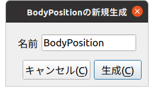
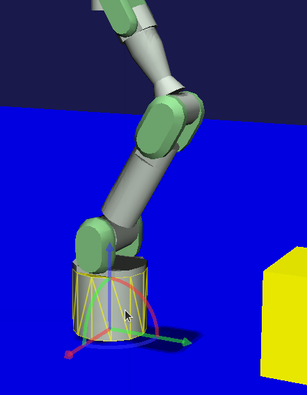
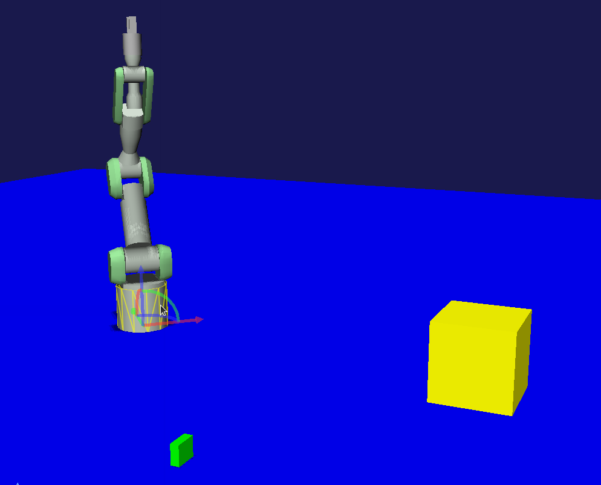
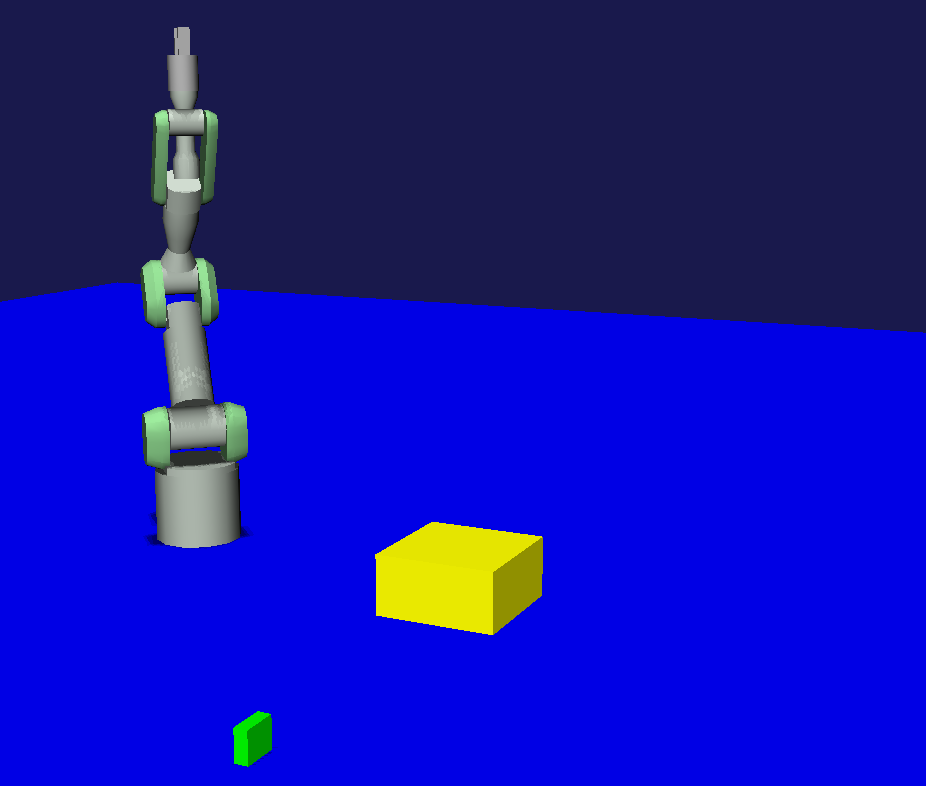

==========================================
独自プロジェクトアイテム型のサンプル (S05)
==========================================

.. contents:: 目次
   :local:

概要
----

本節では :doc:`new-item-type` に関するサンプルを提示します。このサンプルでは "BodyPositionItem" というアイテム型を新たに作成し、これを用いてモデルの位置を保存・復帰できるようにします。このアイテム型は今後の節でも拡張を続けていくものとし、今回その基盤となる部分を構築します。

ソースコード
------------

.. highlight:: cpp

今回のサンプルのソースコードです。これまでと同様に、プラグインのソースディレクトリを作成し、DevGuidePlugin.cppというファイル名で以下のソースコードを格納してください。 ::

 #include <cnoid/Plugin>
 #include <cnoid/ItemManager>
 #include <cnoid/Item>
 #include <cnoid/RootItem>
 #include <cnoid/BodyItem>
 #include <cnoid/ItemList>
 #include <cnoid/ToolBar>
 #include <fmt/format.h>
 
 using namespace std;
 using namespace fmt;
 using namespace cnoid;
 
 class BodyPositionItem : public Item
 {
     BodyItem* bodyItem;
     Isometry3 position;
 
 public:
     BodyPositionItem()
     {
         bodyItem = nullptr;
         position.setIdentity();
     }
    
     BodyPositionItem(const BodyPositionItem& org)
         : Item(org)
     {
         bodyItem = nullptr;
         position = org.position;
     }
    
     virtual Item* doDuplicate() const override
     {
         return new BodyPositionItem(*this);
     }
 
     virtual void onTreePathChanged() override
     {
         auto newBodyItem = findOwnerItem<BodyItem>();
         if(newBodyItem && newBodyItem != bodyItem){
             bodyItem = newBodyItem;
             mvout()
	         << format("BodyPositionItem \"{0}\" has been attached to {1}.",
		           name(), bodyItem->name())
                 << endl;
         }
     }
 
     void storeBodyPosition()
     {
         if(bodyItem){
             position = bodyItem->body()->rootLink()->position();
             mvout()
	         << format("The current position of {0} has been stored to {1}.",
		           bodyItem->name(), name())
	         << endl;
         }
     }
            
     void restoreBodyPosition()
     {
         if(bodyItem){
             bodyItem->body()->rootLink()->position() = position;
             bodyItem->notifyKinematicStateChange(true);
             mvout()
	         << format("The position of {0} has been restored from {1}.",
		           bodyItem->name(), name())
		 << endl;
         }
     }
 };
 
 class DevGuidePlugin : public Plugin
 {
 public:
     DevGuidePlugin()
         : Plugin("DevGuide")
     {
         require("Body");
     }
        
     virtual bool initialize() override
     {
         itemManager()
             .registerClass<BodyPositionItem>("BodyPositionItem")
             .addCreationPanel<BodyPositionItem>();
        
         auto toolBar = new ToolBar("DevGuideBar");
         toolBar->addButton("Store Body Positions")->sigClicked().connect(
             [this](){ storeBodyPositions(); });
         toolBar->addButton("Restore Body Positions")->sigClicked().connect(
             [this](){ restoreBodyPositions(); });
         toolBar->setVisibleByDefault();
         addToolBar(toolBar);
 
         return true;
     }
            
     void storeBodyPositions()
     {
         for(auto& item : RootItem::instance()->selectedItems<BodyPositionItem>()){
             item->storeBodyPosition();
         }
     }
    
     void restoreBodyPositions()
     {
         for(auto& item : RootItem::instance()->selectedItems<BodyPositionItem>()){
             item->restoreBodyPosition();
         }
     }
 };
 
 CNOID_IMPLEMENT_PLUGIN_ENTRY(DevGuidePlugin)

ビルド用のCMakeLists.txtは :doc:`item-operation-sample` と同じになります。

.. _plugin-dev-body-position-item:

BodyPositionアイテムの機能
--------------------------

.. highlight:: text

本サンプルで作成するBodyPositionアイテムはBodyアイテムのモデルの位置を保存・復帰するアイテムとなっています。
この使用方法についてまず説明します。

これまでのサンプルと同様に、まず何らかのモデルをBodyアイテムとして読み込んでおきます。
特に試したいモデルがなければ、これまでと同じPA10Pickup.cnoidのプロジェクトファイルを読み込むことにしましょう。

BodyPositionアイテムはBodyアイテムに関連付けて使用します。
これはBodyPositionアイテムを対象とするBodyアイテムの子アイテムとして配置することで実現します。
これを行うため、まず適当なBodyアイテムを選択した状態で、メインメニューの「ファイル」−「新規」から「BodyPosition」を選択してください。
今回のプラグインが読み込めていれば、この項目が選べるようになっているはずです。
もしこの項目が見当たらなければ、プラグインのビルドやインストールに失敗していますので、そちらを確認してください。

すると以下のような生成ダイアログが表示されます。ここで名前を入力し「生成」ボタンを押すとアイテムが作成されます。

後で分かりやすくするため、ここでは名前に番号1を付与して "BodyPosition1" と設定しておきましょう。
PA10PickupサンプルでPA10を対象にこれを行うと、アイテムツリーは以下のようになります。 ::

 + World
   + PA10
     + SimpleController
     + BodyPosition1
   + box2
   + box3
   + floor
   + AISTSimulator

この際メッセージビューに以下のように表示されます。 ::

 BodyPositionItem "BodyPosition1" has been attached to PA10.

これで今回作成した "BodyPosition1" がPA10に関連付けられたことが分かります。

もしアイテムが別の場所に作成されてしまっていたら、アイテムツリービュー上でアイテムをドラッグして、PA10の子アイテムになるようにしてください。
これを行って上記のメッセージが表示されればOKです。

次に位置の記録操作を行います。この操作は本プラグインによって導入されるツールバーである "BodyPositionBar" から行います。
このツールバーの画像を以下に示します。

.. image:: images/body-position-bar.png

このツールバーは2つのボタンを備えています。位置の記録はひとつ目のボタンである "Store Body Positions" によって行います。

まず位置を記録したいBodyPositionアイテムを選択します。ここでは "BodyPosition1" を選択しましょう。そして "Store Body Positions" ボタンをクリックします。
するとメッセージビューに以下のように表示され、位置が記録されたことが分かります。 ::

 The current position of PA10 has been stored to BodyPosition1.

次にモデルを移動して別のBodyPositionアイテムにその位置を記録しましょう。
モデルの移動はChoreonoidの操作に慣れている方であれば問題ないかと思いますが、ここではPA10PickupサンプルでPA10モデルを動かす方法を説明します。

まずこのサンプルでPA10モデルは移動を「ロック」された状態になっていますので、このロックを解除しましょう。
これをシーンビュー上で行う場合は、まずシーンビューを編集モードにして、マウスカーソルがPA10モデルを指している状態で右クリックします。
すると以下のコンテキストメニューが表示されますので、ここから「配置ロック」のチェックを外すことでロックを解除できます。

.. image:: images/pa10-unlock1.png
    :scale: 60%

ロックを解除してロボットのベース部分をクリックすると以下のようにドラッグ用のハンドルが表示されます。

この状態でベース部分やハンドルをドラッグするとモデルを移動できます。扇形状のハンドルをドラッグすることでモデルを回転させることもできます。

適当にドラッグしてPA10を移動させましょう。何でもよいのですが、例えば以下のような位置まで動かすとします。

.. note:: Choreonoidではモデルの操作を行う様々なインタフェースを備えていて、ここで紹介したシーンビュー上でのドラッグ以外の手段でもモデルを移動させることができます。例えば通常メインウィンドウの右上に配置されている「配置ビュー」でもモデルを移動させることができます。

ここで２つ目のBodyPositionアイテムを作成しましょう。先程と同様にPA10を選択して、メインメニューの「ファイル」−「新規」−「BodyPosition」から生成してください。今度は名前を "BodyPosition2" とします。するとPA10以下は以下のアイテム配置となります。 ::

 + World
   + PA10
     + SimpleController
     + BodyPosition1
     + BodyPosition2
  
.. note:: 2つ目のBodyPositionアイテムの作成はBodyPosition1をコピーすることで行ってもOKです。その場合はBodyPosition1の右クリックメニューで「コピー（単独）」を実行し、次にコピー先アイテムの右クリックメニューで「ペースト」を実行します。その後ペーストされたアイテムの名前をBodyPosition2に変更します。

BodyPosition2を配置できたら、これを選択し、BodyPositionBarの"Store Body Positions" をクリックします。するとメッセージビューに以下が表示されます。 ::

 The current position of PA10 has been stored to BodyPosition2.

これで2つの異なる位置がそれぞれBodyPosition1とBodyPosition2に記録されました。

次に記録した位置の復帰をしましょう。BodyPosition1を選択してBodyPositionBarの "Restore Body Positions" をクリックします。
するとモデルが最初の記録位置に戻ります。次にまたBodyPosition2を選択して"Restore Body Positions" をクリックすると、そちらの記録位置に移動します。
このようにBodyPositionアイテムはモデルの位置を記録して、それを後で呼び出すことができます。

BodyPositionアイテムに記録される位置はモデルとは独立した情報になっていますので、他のモデルに適用することも可能です。
例えばBodyPosition2をアイテムツリービュー上でドラッグして、box2の子アイテムとし、以下のツリー構成とします。 ::

 + World
   + PA10
     + SimpleController
     + BodyPosition1
   + box2
     + BodyPosition2
   + box3

するとメッセージビューには以下のように表示されます。 ::

  BodyPositionItem "BodyPosition2" has been attached to box2.
       
この状態でBodyPosition1を選択し、"Restore Body Positions" をクリックしましょう。すると黄色のボックスがPA10の初期位置に移動して、以下のような配置になります。

このようにして記録した位置情報はモデル間で使い回すことができます。

また同時に複数モデルに対して位置の記録や復帰を行うこともできます。その場合はモデルごとにBodyPositionアイテムを用意し、記録や復帰を行いたい全てのBodyPositionアイテムを選択して、"Store Body Positions" または "Restore Body Positions" をクリックします。

ソースコードの解説
------------------

.. highlight:: cpp

これまでのサンプルの解説も踏まえて、本サンプルに特有の部分を中心に解説します。 ::

 #include <cnoid/ItemManager>

アイテム型の登録を行うためのItemManagerのヘッダをインクルードしています。 ::

 #include <cnoid/Item>

Itemクラスのヘッダです。独自アイテムはItemクラスを継承して定義するのでこちらが必要になります。
実はこのヘッダは上記のItemManagerのヘッダから取り込まれるのでここでは書かなくてもよいのですが、独自アイテムの定義にはItemクラスが必要であることを明示するためあえて記述しています。 ::

 using namespace std;
 using namespace fmt;
 using namespace cnoid;

本サンプルではこれら3つの名前空間を取り込み、記述を簡潔にしています。
なお、作成したクラスを外部に公開するためのヘッダファイルにおいては、名前の衝突を防ぐため、このような名前空間の取り込みは通常は行わないようにします。 ::

 class BodyPositionItem : public Item
 {
     ...
 };

今回作成するBodyPositionアイテム型の定義です。 ::

 BodyItem* bodyItem;

メンバ変数としてBodyアイテムへのポインタを持たせています。これを用いて位置の保存・復帰の対象となるBodyアイテムを参照します。 ::
 
 Isometry3 position;

モデルの位置を格納するためのIsometry3型の変数です。
これはEigenライブラリの型をカスタマイズしたもので、基本的には3次元空間の座標変換を行うための4x4同次変換行列に対応するものです。
ただし行列の3x3線形変換要素については回転行列（正規直交行列）であることを前提とした型になっています。
要するにこの型は３次元空間の位置と姿勢（回転）を表すための行列で、Choreonoidではモデルを構成する剛体の位置姿勢を格納する変数として使用しています。 ::

 BodyPositionItem()
 {
     bodyItem = nullptr;
     position.setIdentity();
 }

アイテムのデフォルトコンストラクタです。
まだ対象となるBodyアイテムは設定されていないのでbodyItemをnullptrで初期化しています。
またpositionについてはsetIdentity関数で単位行列に初期化しています。これはグローバル座標原点位置に対応します。 ::

 BodyPositionItem(const BodyPositionItem& org)
     : Item(org)
 {
     bodyItem = nullptr;
     position = org.position;
 }

コピーコンストラクタを定義しています。
コピーコンストラクタは必ずしも必須ではないのですが、アイテムのインスタンスを複製するためのduplicate関数は必須なので、その実装のため通常コピーコンストラクタも定義します。
初期化子リストで親クラスItemのコピーコンストラクタも実行しています。コピーコンストラクタの実装においてはこのように必ず親クラスのコピーコンストラクタも実行するようにします。
ここではpositionの内容もコピーしています。 ::
  
 virtual Item* doDuplicate() const override
 {
     return new BodyPositionItem(*this);
 }

インスタンスの複製を返すdoDuplicate関数をオーバーライドして実装します。
実装内容は単純に同じ型の複製をコピーコンストラクタを用いて生成するようにしています。
ItemクラスはReferenced型のオブジェクトであり、生成後にスマートポインタref_ptrで保持する必要がありますが、doDuplicate関数については生成したインスタンスをそのまま生ポインタで返せばOKです。 ::

 virtual void onTreePathChanged() override
 {
     ...
 }

アイテムツリーにおけるこのアイテムへのパスが変化したときに実行されるvirtual関数です。
この関数をオーバーライドすることで、アイテム間の位置関係が変化したときの処理を実装できます。
以下はこの関数内の記述です。 ::

 auto newBodyItem = findOwnerItem<BodyItem>();

findOwnerItemはItemクラスのメンバ関数で、自身の親アイテムをたどって特定の型のアイテムをみつけるというものです。
みつけたいアイテム型をテンプレートパラメータに指定します。
ここではこのBodyPositionアイテムの上位に配置されているBodyアイテムを探しています。
みつかればそのアイテムを返し、みつからなければnullptrを返します。 

.. note:: findOwnerItemではルートに至るまで親アイテムをたどっていくので、親の親など、必ずしも直近の親ではない上位のアイテムも対象となります。もし対象を直近の親に限定したければ、 ::
	  
       auto newBodyItem = dynamic_cast<BodyItem>(parentItem());

  とすればOKです。

::
  
 if(newBodyItem && newBodyItem != bodyItem){
     bodyItem = newBodyItem;
     ...

Bodyアイテムが上位に存在してそれが現在の対象ボディアイテムと異なる場合は、対象ボディアイテムを更新します。 ::

     ...
     mvout()
         << format("BodyPositionItem \"{0}\" has been attached to {1}.",
                   name(), bodyItem->name())
         << endl;
 }

BodyPositionアイテムがBodyアイテムに関連付けられた旨のメッセージを出力しています。

メッセージビューへの出力はこれまでのサンプルではMessageViewクラスのインスタンスを介して行っていましたが、他の出力方法として、こちらのmvout関数を使うこともできます。この関数はstd::ostreamへの参照を返すようになっており、このストリームに出力するとそれはメッセージビューへの出力となります。つまりC++の標準入出力ストリームの流儀でメッセージビューに出力することが可能となるわけです。

そしてここでもメッセージの整形にfmtライブラリを用いています。ここで使用している{0}と{1}は置換フィールドに番号の指定もしたもので、{0}と{1}がこれらの番号の順番でその後の引数の内容に置換されます。ここでは{0}に対応する引数としてname()を指定しており、これはBodyPositionアイテムの名前と置換されます。そして{1}についてはbodyItem->name()が対応しており、Bodyアイテムの名前と置換されます。

次で位置を保存する関数を定義しています。 ::

 void storeBodyPosition()
 {
     if(bodyItem){
         position = bodyItem->body()->rootLink()->position();
         mvout()
             << format("The current position of {0} has been stored to {1}.",
	               bodyItem->name(), name())
             << endl;
     }
 }
  
これはツールバーの "Store Body Positions" がクリックされると選択されているBodyPositionアイテムに対して実行される関数です。
対象BodyアイテムであるbodyItemが有効であれば ::
  
 position = bodyItem->body()->rootLink()->position();

によってposition変数に現在のBodyモデルのルートリンクの位置姿勢をコピーしています。
その後位置を保存した旨のメッセージを出力します。 ::

 void restoreBodyPosition()
 {
     if(bodyItem){
         bodyItem->body()->rootLink()->position() = position;
         bodyItem->notifyKinematicStateChange(true);
         mvout()
             << format("The position of {0} has been restored from {1}.",
	               bodyItem->name(), name())
             << endl;
     }
 }

こちらは位置の復帰を行うための関数です。
ツールバーの "Restore Body Positions" がクリックされると選択されているBodyPositionアイテムに対して実行されます。
storeBodyPositionと逆の処理として、 ::

 bodyItem->body()->rootLink()->position() = position;

によって変数positionに保存されている位置姿勢を対象Bodyモデルのルートリンクの位置姿勢に設定しています。
ただしこれは変数の値を更新しているだけで、これだけではGUI上の表示は更新されませんが、 ::
  
  bodyItem->notifyKinematicStateChange(true);
  
とすることでGUI上の表示が更新されます。
この処理はこれまでのサンプルと同様です。
そしてこの関数でも位置姿勢が復帰した旨のメッセージを出力しています。

BodyPositionアイテムの実装は以上です。

次はプラグインの実装に入ります。まずinitialize関数で ::

 itemManager()
     .registerClass<BodyPositionItem>("BodyPositionItem")
     .addCreationPanel<BodyPositionItem>();

としてBodyPositionItemクラスの登録を行っています。
これは :ref:`plugin-dev-item-type-registration` で説明している処理になります。
ただしここではitemManager()で取得したインスタンスに対して複数の関数を続けて記述しています。
基本的にItemManagerの関数は自身の参照を返すようになっていますので、このように登録に必要な処理をまとめて記述することができます。 ::

 auto toolBar = new ToolBar("DevGuideBar");
 toolBar->addButton("Store Body Positions")->sigClicked().connect(
     [this](){ storeBodyPositions(); });
 toolBar->addButton("Restore Body Positions")->sigClicked().connect(
     [this](){ restoreBodyPositions(); });
 toolBar->setVisibleByDefault();
 addToolBar(toolBar);

ツールバーを作成しています。
:doc:`toolbar` や :doc:`toolbar-sample` で紹介した方法で、ツールバーを生成し、そこにボタンを追加し、最後に登録をおこなっています。
ボタンについてはそれぞれsigCickedシグナルに関数を接続し、クリックした時に対応する関数が実行されるようにしています。 ::

 void storeBodyPositions()
 {
     for(auto& item : RootItem::instance()->selectedItems<BodyPositionItem>()){
         item->storeBodyPosition();
     }
 }

ツールバーの "Store body positions" ボタンがクリックされたときに実行される関数です。 ::
  
 RootItem::instance()->selectedItems<BodyPositionItem>()

によって選択されているBodyPositionItem型のアイテムがItemList<BodyPositionItem>として返されます。これをfor文でまわして、各要素に対して ::
  
 item->storeBodyPosition();

としてBodyPositionItemのstoreBodyPosition関数を実行しています。
これにより位置の記録が行われます。

またツールバーの "Restore body positions" ボタンがクリックされたときには以下が実行されます。 ::

 void restoreBodyPositions()
 {
     for(auto& item : RootItem::instance()->selectedItems<BodyPositionItem>()){
         item->restoreBodyPosition();
     }
 }

こちらもstoreBodyPositions関数と同様にして、選択されているBodyPositionItemのrestoreBodyPosition関数を実行しています。
これにより位置の復帰が行われます。

  

