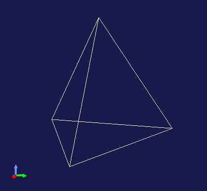

============
シーングラフ
============

.. contents:: 目次
   :local:

概要
----

Choreonoidはロボットを含む仮想世界を扱うためのフレームワークで、仮想世界を構成する物体や機構のモデルデータを格納し、それを三次元コンピュータグラフィックスとして描画する機能を備えています。Choreonoid SDKではそのような描画の対象となる仮想世界を総称して「シーン」と呼んでおり、これを `シーングラフ <https://en.wikipedia.org/wiki/Scene_graph>`_ と呼ばれるデータ構造で格納します。

プラグインで独自のモデルやデータをシーンとして描画するためにはこのシーングラフに関する知識が欠かせません。
そこで本節ではこのシーングラフの概念や使用方法について解説します。

.. _plugin-dev-about-scenegraph:

シーングラフとは
----------------

.. highlight:: text

シーングラフはシーンの構成要素をノードとするグラフ構造で、複数のノードを組み合わせることでシーン全体を構築するものです。グラフという名称ではありますが、実際の構造はどちらかと言うとツリーに近いもので、シーン全体の起点となるルートノードを持ち、ルートからの階層的な（親子関係の）構造で他のノードがシーンに導入されます。ただし同一のノードが複数のノードから子ノードとして共有される、逆に言えばあるノードが複数の親を持つことも可能です。その場合はツリー構造の範疇を超えますが、より一般的なデータ構造であるグラフであればこのケースもカバーできます。

シーングラフを構成するノードは様々なタイプのものがありますが、基本的にはシーンに存在する物体（形状）に対応するノードがあり、それらをまとめるグループノードや、それらの相対位置関係を構築する座標変換ノードによって、物体のノードが構造化されます。またこれに加えて光源（ライト）を追加するノードや、視点を定義するためのノードなども利用できます。

ここではシーングラフを初めて学ぶ方にイメージをつかんでもらうために、ごく簡単な例を示します。
まずシーンに物体として球状のものがひとつあるとイメージしてください。
これに対応するノードをSphereとすると、シーングラフは以下のように表されます。 ::

 + Root
   - Sphere

ここでRootというノードはシーン全体の起点となるルートノードです。SphereはRootの子ノードとなります。

そこに物体が加わるとします。例えば箱状のものをイメージしてください。これをBoxノードとすると、シーングラフは以下のように表されます。 ::

 + Root
   + Group1
     - Sphere
     - Box

2つの物体をGroup1というグループノードでまとめています。まとめられているSphereとBoxはいずれもGroup1の子ノードとなります。

この場合、各物体の位置は固定されていますが、それぞれ任意の位置に移動したいとしましょう。その場合は座標変換ノードを導入して、以下のようにします。 ::

 + Root
   + Group1
     + Position1
       - Sphere
     + Position2
       - Box

ここでPosition1、Position2は位置に関わる座標変換ノードです。このノードは位置のパラメータを有しており、子ノード以下のノードにその座標変換が適用されます。このケースではPosition1、Position2のパラメータを変更することで、SphereとBoxの位置をそれぞれ変更できます。

さらに物体が加わり、それをBoxに固定するとしましょう。追加される物体を円柱状のものと想定し、このノードをCylinderとすると、シーングラフは以下のように構成できます。 ::

 + Root
   + Group1
     + Position1
       - Sphere
     + Position2
       - Box
       + Position3
	 - Cylinder

ここでPosition3はCylinderをBoxの任意の箇所に固定するために導入しています。Position3はBoxからの相対座標で位置を設定します。
またこの状況でPosition2の位置パラメータを変更すると、BoxとCylinderが連動して（同時に）移動することになります。

ここまでは全てツリー構造でしたが、ツリー構造でなくなる例を以下に示します。 ::

 + Root
   + Group1
     + Position1
       - Sphere
     + Position2
       - Box
       + Position3
	 - Sphere

ここでは先程のCylinderをSphereと置き換えています。そしてこのSphereは最初に導入した（Position1の子ノードである）Sphereと同じノードであるとします。つまりこれは正確には ::

 + Root
   + Group1
     + Position1
       - --------------+ 
     + Position2       |
       - Box           +- Sphere
       + Position3     |
	 - ------------+

と表されることになります。

このようにすることで、Sphereのデータをシーンの2箇所から共有できます。ただし2箇所についてルートからのノードの経路は異なるので、それぞれが受ける影響は異なります。この例ではSphereの位置は2箇所で異なることになります。

このようにノードを共有することでシーン全体のデータ量を削減できます。これは形状が複雑な場合や、同じ形状が多数存在する場合などに、大きな効果があります。また共有されているノードについては、一度の操作でシーン内の複数ヶ所の更新ができることになります。

.. note:: シーングラフの構造はロボットの構造ともよく似ています。Choreonoidでロボットのモデルを表現するためのBodyクラスも、ロボットを構成するリンクがLinkクラスとして表現され、そのオブジェクトをノードとするツリー構造となっています。そこでは関節ごとにリンクの親子関係が構築されており、それによってリンク間の相対位置関係が規定され、さらに各リンクは形状も有しています。ただしシーングラフは見た目に関わる情報のみを格納しますが、ロボットのモデルではそれに加えて質量・重心等の物理パラメータや、その他ロボットの機構等に関わる情報も有する点が異なります。その上で、Linkクラスは自身の形状・外観に対応するデータをシーングラフの形態で有しています。

以上がシーングラフの概要になります。シーングラフは三次元コンピュータグラフィックスの描画システムとしてポピュラーなもので、この構造に基づく描画ライブラリやゲームエンジンの実装が多数あります。中でも古典的なものとしてSilicon Graphics社が1990年代に開発した `Open Inventor <https://en.wikipedia.org/wiki/Open_Inventor>`_ というライブラリがあります。このライブラリは `Inventor Mentor <https://www.amazon.co.jp/Inventor-Mentor-Programming-Object-Oriented-Graphics/dp/0201624958/>`_ という書籍で詳しく解説されており、 `そのWeb版 <https://developer.openinventor.com/UserGuides/Oiv9/Inventor_Mentor/index.html>`_ も閲覧できますので、興味があればそちらも参考にしてください。今となっては古いライブラリですが、内容的には現在でも通じる部分は多いです。ちなみに現在でも `Coin3D <https://coin3d.github.io/>`_ という実装を利用できます。

Choreonoidのシーングラフの概要
------------------------------

Choreonoidでは独自のシーングラフの実装を用いています。これはOpen Inventorを含む既存のライブラリや三次元モデリング言語を参考にしながら、Choreonoidの機能や用途にマッチするように構築したものです。この実装は比較的シンプルなもので、特に外部のライブラリに依存することもなく、実装のほぼ全てがChoreonoid内で完結しています。そしてシーングラフ本体のデータ構造は特定の描画APIには依存しない設計となっています。

もちろん実際の描画は何らかの描画用APIを用いて行う必要があり、そのためのレンダラと呼ばれる描画用クラスが用意されています。現状ではOpenGLバージョン3.3を利用する `GLSLSceneRenderer <https://choreonoid.org/ja/documents/reference/latest/classcnoid_1_1GLSLSceneRenderer.html>`_ がデフォルトのレンダラとして使用されるようになっています。

シーングラフの設計は、三次元モデリング言語VRML97を参考にしている部分もありますので、シーングラフの利用にあたっては `VRML97の仕様書 <https://tecfa.unige.ch/guides/vrml/vrml97/spec/>`_ や各種ドキュメントも参考になるかと思います。

シーングラフのクラス階層
------------------------

シーングラフを構成するオブジェクトの最小単位となるのが `SgObjectクラス <https://choreonoid.org/ja/documents/reference/latest/classcnoid_1_1SgObject.html>`_ です。これは :doc:`Referenced型 <referenced>` のクラスであり、動的に生成してポインタで共有し、必要に応じてref_ptrによるスマートポインタで参照を保持します。

SgObjectのうち、単体でシーングラフに導入できるものは、SgObjectを継承した `SgNodeクラス <https://choreonoid.org/ja/documents/reference/latest/classcnoid_1_1SgNode.html>`_ として定義されます。

以上まとめると、シーングラフの基盤となるクラスとしてSgObjectとSgNodeがあり、それらは以下のクラス階層で定義されています。 ::

 + Referenced
   + ClonableReferenced
     + SgObject
       + SgNode

SgObjectやSgNodeはシーンの構成要素として基本的な属性を保持しますが、これらのクラスのみで何か意味のあるシーンを構築できるわけではありません。実際にはこれらのクラスを継承したクラスが多数定義されており、それらの派生クラスを用いてシーンを構築します。以下ではSgObjectを基底にもつオブジェクトを全て「シーンオブジェクト」と呼ぶことにします。

全てのシーンオブジェクトは広義にはシーングラフを構成する「ノード」であると言えます。ただし他のオブジェクトの子要素としてしかシーングラフに導入できないオブジェクトもあります。一方で単体でシーングラフに導入できるオブジェクトもあります。両者で処理方法が異なる場面もあるため、後者を狭義の「ノード」として前者からは区別します。その基底としてSgNodeが定義されており、これを継承したオブジェクトを「シーンノード」と呼ぶことにします。

.. note:: 上記のクラス階層に含まれる `ClonableReferenced <https://choreonoid.org/ja/documents/reference/latest/classcnoid_1_1ClonableReferenced.html>`_ は、Referenced型のオブジェクトの複製に関するAPIを共通化するためのクラスです。これを継承しているクラスについては、 `CloneMapクラス <https://choreonoid.org/ja/documents/reference/latest/classcnoid_1_1CloneMap.html>`_ を用いて相互に参照し合うオブジェクト群を一括に複製することができます。シーングラフを扱う際にそのような処理が必要になることが多いので、これを導入しています。

これらのクラスはChoreonoid SDKのUtilライブラリに実装されており、

.. code-block:: cpp

 #include <cnoid/SceneGraph>

としてSceneGraphヘッダを取り込むことで利用可能となります。

シーンオブジェクトの基本的な型はUtilライブラリで定義されていますが、他のライブラリやプラグインで定義されている型もあります。例えばGUIと連携するものはBaseモジュールで定義されていますし、ロボットモデルと連携するものはBodyライブラリやBodyプラグインで定義されています。もちろん独自のプラグインで新たなシーンオブジェクト型を定義して使用することも可能です。

シーンオブジェクトのヘッダについてはオブジェクトのカテゴリごとに分けられています。
Utilライブラリに含まれるヘッダの概要を以下に示します。

* **SceneGraph**

  * 基盤となるオブジェクト
  * グループ化や座標変換に関するノード  

* **SceneDrawables**

  * 描画の実態となる形状や外観に関するオブジェクト／ノード

* **SceneLights**

  * 光源（ライト）に関するノード

* **SceneCameras**

  * 視点（カメラ）に関するノード
  
* **SceneEffects**

  * 描画に何らかの付加的な効果を与えるノード

これらのヘッダに含まれる主要なノード型のクラス階層を以下に示します。括弧内は各クラスの概要になります。 ::

 + SgNode
   + SgShape（形状）
   + SgPlot（プロット対象データ）
     + SgLineSet（線群）
     + SgPointSet（点群）
   + SgGroup（グループ化）
     + SgTransform（座標変換）
       + SgPosTransform（回転＋並進）
       + SgScaleTransform（スケーリング）
       + SgAffineTransform（一般のアフィン変換）
     + SgSwitchableGroup（オン／オフ切り替え）
     + SgBoundingBox（バウンディングボックス表示）
     + SgHighlight（ハイライト表示）
     + SgTransparentGroup（半透明化）
     + SgOverlay（オーバーレイ表示）
       + SgViewportOverlay（ビューポートへのオーバーレイ表示）
   + SgPreprocessed（描画時に前処理が必要なノード）
     + SgLight（光源）
       + SgDirectionalLight（平行光源）
       + SgPointLight（点光源）
         + SgSpotLight（スポットライト）
     + SgCamera（カメラ）
       + SgPerspectiveCamera（透視投影カメラ）
       + SgOrthographicCamera（平行投影カメラ）
     + SgFog（霧）

またノード型ではないシーンオブジェクトの型について、主要なものを以下に示します。これらは特定のノード型の構成要素として使用されます。 ::
	 
 + SgObject
   + SgMeshBase（メッシュ型の共通情報）
     + SgMesh（標準のメッシュ情報）
     + SgPolygonMesh（任意のポリゴンからなるメッシュ情報）
   + SgMaterial（色等のマテリアル情報）
   + SgTexture（テクスチャ情報）
   + SgTextureTransform（テクスチャの座標変換）
   + SgImage（画像データ）
   + SgVertexArray（頂点配列）
   + SgNormalArray（法線配列）
   + SgColorArray（色配列）
   + SgIndexArray（インデックス配列）
   + SgSwitch（オン／オフ状態）

.. note:: これらの階層図からも分かるように、シーングラフの構成要素となるオブジェクトの型名には "Sg" というプレフィックスが付与されています。これは "Scene Graph" に由来するもので、一般的な名称になることの多いシーングラフの要素型について、名前衝突を避けるのとシーングラフの要素であることを明確にするために付与しています。これはネームスペースの追加で対応することも考えられますが、これらはChoreonoid SDKの基本となるクラスで既にネームスペースcnoid内にありますので、あえて追加のネームスペースを使わずにより簡潔な記述ができるようにしています。なお、シーングラフの要素であってもより応用的／複合的なクラスについては、このプレフィックスを付与していないものもあります。

.. _plugin-dev-scene-node-classes:

シーンオブジェクトの使用方法
----------------------------

先に挙げたクラス階層図で主要なシーンオブジェクト型と各型の概要を紹介しましたが、ここではその中でも特に基本的な型を対象として、使用方法を解説します。これらのオブジェクト型を用いることでほとんどのシーンは構築できるかと思います。

SgShape
~~~~~~~

`SgShape <https://choreonoid.org/ja/documents/reference/latest/classcnoid_1_1SgShape.html>`_ は形状を表現するノードです。シーンの主体となるのは基本的にこのノードであり、このノードを他のノードでアレンジすることでシーン全体を構築することになります。

このノードは形状の描画に関わる以下の3つのオブジェクトをまとめるノードとなっています。

* メッシュ（SgMesh）
* マテリアル（SgMaterial）
* テクスチャ（SgTexture）

メッシュオブジェクトはSgShapeの以下の関数で取得／セットできます。

* **SgMesh* mesh()**

  * 現在セットされているメッシュを返します。なければnullptrを返します。

* **SgMesh* setMesh(SgMesh* mesh)**

  * 指定したメッシュをセットします。

* **SgMesh* getOrCreateMesh()**

  * 既にセットされているメッシュがあればそれを返し、なければ新たに作成してセットした上でそれを返します。

マテリアルとテクスチャについても同様に以下の関数で取得／セットできます。    

* **SgMaterial* material()**
* **SgMaterial* setMaterial(SgMaterial* material)**
* **SgMaterial* getOrCreateMaterial()**

* **SgTexture* texture()**
* **SgTexture* setTexture(SgTexture* texture)**
* **SgTexture* getOrCreateTexture()**

これらのオブジェクトは全てスマートポインタで保有されます。従ってSgShapeが存在している間は保有しているオブジェクトの存在も保証されます。
  
SgShapeが描画されるためには最低限メッシュをセットしておく必要がありますが、マテリアルとテクスチャについては必須ではありません。
マテリアルを設定しないと、デフォルトのマテリアルが使用されて色はグレーになります。
ただしメッシュが色情報を持っていることもあり、その場合はそちらに基づく色付けが行われます。

.. _plugin-dev-scenegraph-sgmesh:

SgMesh
~~~~~~

`SgMesh <https://choreonoid.org/ja/documents/reference/latest/classcnoid_1_1SgMesh.html>`_ はメッシュの情報を格納するオブジェクトです。これ単体でシーングラフに導入することはなく、必ずSgShapeにセットして導入します。またこのクラスは `SgMeshBase <https://choreonoid.org/ja/documents/reference/latest/classcnoid_1_1SgMeshBase.html>`_ を継承していて、そちらで定義されている情報もあわせて使用します。

SgMeshには以下のデータを格納できます。

* **頂点**

  * 3次元ベクトルの配列
  * Vector3f型を要素とする配列オブジェクトSgVertexArrayをスマートポインタで保有
  * 関数vertices、setVertices、getOrCreateVerticesを用いて取得／セット

* **面**

  * 三角形ポリゴンで構成
  * 整数インデックス値の配列
  * 頂点配列におけるインデックスで三角形の3頂点を指定
  * 面数 x 3の頂点インデックス値を保有
  * int型を要素とする配列オブジェクトSgIndexArrayを直接保有
  * 関数faceVertexIndicesで配列にアクセス
  * 関数triangleで各面ごとの値を参照
  * 関数newTriangle、addTriangleで面を追加

* **法線**

  * 3次元ベクトルの配列
  * Vector3f型を要素とする配列オブジェクトSgNormalArrayをスマートポインタで保有
  * 関数normals、setNormals、getOrCreateNormalsを用いて取得／セット

* **法線インデックス**

  * 頂点と法線の対応付けに利用可能
  * 整数インデックス値の配列
  * 法線配列におけるインデックスで法線を指定
  * 面データにおける頂点インデックスの並びと一致させて格納
  * int型を要素とする配列オブジェクトSgIndexArrayを直接保有
  * 関数normalIndicesでアクセス  

* **色**

  * R、G、Bの3要素を格納する3次元ベクトルの配列
  * Vector3f型を要素とする配列オブジェクトSgColorArrayをスマートポインタで保有
  * 関数colors、setColors、getOrCreateColorsを用いて取得／セット

* **色インデックス**

  * 各面の頂点と色の対応付けに利用可能
  * 整数インデックス値の配列
  * 色配列におけるインデックスで色を指定
  * 面データのインデックスの並びと一致させて格納
  * int型を要素とする配列オブジェクトSgIndexArrayを直接保有
  * 関数colorIndicesでアクセス

* **テクスチャ座標**

  * テクスチャのUV座標を格納する2次元ベクトルの配列
  * Vector2f型を要素とする配列オブジェクトSgTexCoordArrayをスマートポインタで保有
  * 関数texCoords、setTexCoords、getOrCreateTexCoordsを用いて取得／セット

* **テクスチャ座標インデックス**

  * 各面の頂点とテクスチャ座標の対応付に利用可能
  * 整数インデックス値の配列
  * テクスチャ座標配列におけるインデックスで座標を指定
  * 面データのインデックスの並びと一致させて格納
  * int型を要素とする配列オブジェクトSgIndexArrayを直接保有
  * 関数texCoordIndicesでアクセス

描画に最低限必要なのは頂点と面のデータです。
通常は法線も必要ですが、ライティングを行わない場合は法線は不要です。
色は通常SgMaterialでメッシュ全体に対して設定するので、SgMeshで設定する必要はありません。
頂点ごとに色を変えて設定したい場合にのみ色情報をセットします。
テクスチャ座標についてはテクスチャを使用する場合に必要となります。

法線、色、テクスチャ座標の各データにはデータ本体とインデックスの2種類のデータがあります。
各データの本体を面データと対応付けるためにインデックスデータを使用します。
インデックスによる対応付けによって、データ本体で同一要素の重複を避けることが可能となり、総合的なデータサイズを減らすことができます。
ただしインデックスデータは必ずしも設定する必要はありません。
設定しない場合はデータ本体の要素が面頂点の並びと直接対応するものとします。

.. note:: 上記説明で「配列オブジェクト」としているのは、具体的にはSceneDrawablesヘッダで定義されている `SgVectorArayテンプレートクラス <https://choreonoid.org/ja/documents/reference/latest/classcnoid_1_1SgVectorArray.html>`_ を対象要素の型で実体化したものです。このテンプレートクラスにより、std::vectorと同様の機能をシーンオブジェクトとして利用できるようになります。

メッシュ構築の例として、正四面体のメッシュを構築するコードを以下に示します。

.. code-block:: cpp

 auto mesh = new SgMesh;

 mesh->setVertices(
     new SgVertexArray(
         { {  1.154700f,  0.0f, 0.0f },
           { -0.577350f, -1.0f, 0.0f },
           { -0.577350f,  1.0f, 0.0f },
           {  0.0f,       0.0f, 1.632993f }
         }));
 
 mesh->setNormals(
     new SgNormalArray(
         { {  0.0,       0.0,      -1.0      },
           {  0.471405, -0.816497,  0.333333 },
           {  0.471405,  0.816497,  0.333333 },
           { -0.942801,  0.0,       0.333333 }
         }));
 
 mesh->faceVertexIndices() =
     { 0, 1, 2,
       0, 3, 1,
       0, 2, 3,
       1, 3, 2  };
 
 mesh->normalIndices() =
     { 0, 0, 0,
       1, 1, 1,
       2, 2, 2,
       3, 3, 3 };

正四面体の各辺の長さは1としています。このメッシュをSgShapeにセットして描画すると、以下のように表示されます。

.. image:: images/tetrahedron.png
    :scale: 70%

上記コードでは順番に

* 四面体の4頂点の座標
* 各面に対応する4つの法線
* 各面（三角形）を構成する頂点のインデックス
* 面ごとの頂点インデックスに対応する法線のインデックス

をSgMeshにセットしています。

SgMeshは「ソリッド属性」も有しており、以下の関数でその参照と設定ができます。

* **bool isSolid() const**

  * 設定されているソリッド属性を返します。

* **void setSolid(bool on)**

  * ソリッド属性を設定します。

ソリッド属性は、形状の中身が詰まっているかどうかを表すものです。これがtrueの場合は詰まっていることになり、falseの場合は中が空洞になっていることになります。とは言えメッシュのデータとしては面のデータがあるに過ぎないので、実際に中身が詰まっていることはありません。この属性はあくまでどちらを想定するかというもので、実際には面の裏側を描画するかどうか決めるために使われます。デフォルトではfalseとなっています。

一般的にメッシュの各面には表裏があります。SgMeshでは面に向かって見たときに頂点の並びが半時計まわり（Counter clock wise, CCW）になる方向を表面としています。そして視点から見たときに裏側となる面について、ソリッド属性がfalseのときは描画を行いますが、trueのときは描画は行いません。falseのときは中身が空洞と仮定されているので、面の裏側が見えることもあるという想定です。一方でtrueのときは中身が詰まっているので、そもそも裏側が見えることはない（＝裏側は描画しなくてもよい）という想定になります。逆に言うと、面の裏側が見えるはずのないオブジェクトについては、この属性をtrueにしておきます。すると裏面の描画がスキップされるので、描画が若干高速になるという効果を得られます。

SgMaterial
~~~~~~~~~~

`SgMaterial <https://choreonoid.org/ja/documents/reference/latest/classcnoid_1_1SgMaterial.html>`_ は物体表面の材質を表現するオブジェクトで、SgShapeにセットして使用します。このオブジェクトは以下の属性を有しています。

.. list-table::
 :widths: 24,14,24,20,18
 :header-rows: 1

 * - 属性
   - 値型
   - 意味
   - 値の範囲
   - デフォルト値
 * - **ambientIntensity**
   - float
   - 環境光強度
   - 0.0〜1.0
   - 1.0
 * - **diffuseColor**
   - Vector3f
   - 拡散光色
   - 0.0〜1.0（各要素）
   - (1, 1, 1)
 * - **emissiveColor**
   - Vector3f
   - 放射光色
   - 0.0〜1.0（各要素）
   - (0, 0, 0)
 * - **specularColor**
   - Vector3f
   - 鏡面光色
   - 0.0〜1.0（各要素）
   - (0, 0, 0)
 * - **specularExponent**
   - float
   - 鏡面反射指数（光沢度）
   - 0.0〜
   - 25.0
 * - **transparency**
   - float
   - 透明度
   - 0.0〜1.0
   - 0.0

各属性の値はそれぞれ以下のメンバ関数で取得できます。

* **float ambientIntensity() const**
* **const Vector3f& diffuseColor() const**
* **const Vector3f& emissiveColor() const**
* **const Vector3f& specularColor() const**
* **float specularExponent() const**
* **float transparency() const**
		
また以下のメンバ関数で値を設定できます。

* **void setAmbientIntensity(float intensity)**
* **void setDiffuseColor(const Vector3f& color)**
* **void setEmissiveColor(const Vector3f& color)**
* **void setSpecularColor(const Vector3f& color)**
* **void setSpecularExponent(float e)**
* **void setTransparency(float t)**

.. note:: 上記関数のcolor引数については実際にはテンプレートで定義されていて任意のEigenベクトル型で値を設定できるようになっていますが、ここでは分かりやすさを重視して対応するメンバ変数の型で表記しています。
  
SgMaterialを生成・設定し、それをSgShapeにセットすることで、形状の描画において設定したマテリアル属性が反映されます。

SgTexture
~~~~~~~~~

`SgTexture <https://choreonoid.org/ja/documents/reference/latest/classcnoid_1_1SgTexture.html>`_ はテクスチャ情報を格納するオブジェクトで、SgShapeにセットして使用します。このオブジェクトは以下のオブジェクトで構成されます。

* テクスチャ画像（SgImage）
* テクスチャ座標変換（SgTextrueTransform）

テクスチャ画像は `SgImage型 <https://choreonoid.org/ja/documents/reference/latest/classcnoid_1_1SgImage.html>`_ のシーンオブジェクトとして格納します。これは以下の関数で取得／セットします。

* **SgImage* image()**

  * 現在セットされている画像を返します。なければnullptrを返します。

* **SgImage* setImage(SgImage* image)**

  * 画像ををセットします。

* **SgImage* getOrCreateImage()**

  * 既にセットされている画像があればそれを返し、なければ空の画像を生成してセットした上でそれを返します。

SgImageは `Imageクラス <https://choreonoid.org/ja/documents/reference/latest/classcnoid_1_1Image.html>`_ をシーンオブジェクトとし得利用できるようにラップしたものです。これはSgImageの以下の関数でアクセスできます。

* **Image& image()**

  * Imageオブジェクトを返します。
    
* **const Image& constImage() const**

  * constなIamgeオブジェクトを返します。画像の更新をしない場合はこちらを使用します。

Imageクラスは汎用的な二次元画像クラスで、画像データの本体はこちらに格納されます。このクラスには画像サイズを変更したりピクセルデータにアクセスする関数が用意されていますし、画像ファイルの入出力も可能です。

例えば以下のコードでテクスチャファイルを読み込んでSgShapeノードにセットできます。 ::

  auto shape = new SgShape;
  ...
  shape->getOrCreateTexture()->getOrCreateImage()->image().load("texture.png");
  

テクスチャ画像には座標変換を適用することもできます。
その場合、座標変換の情報は `SgTextureTransform型 <https://choreonoid.org/ja/documents/reference/latest/classcnoid_1_1SgTextureTransform.html>`_ のシーンオブジェクトとして格納します。
テクスチャ画像と同様に以下の関数を利用して座標変換オブジェクトの取得／セットができます。

* **SgTextrueTransform* textureTransform()**
* **SgTextureTransform* setTextureTransform(SgTextureTransform* image)**
* **SgTextureTransform* getOrCreateTextureTransform()**

SgTextureTransformでは、回転やスケーリングの設定ができます。詳細はリファレンスマニュアルをご参照ください。

SgLineSet
~~~~~~~~~

`SgLineSet <https://choreonoid.org/ja/documents/reference/latest/classcnoid_1_1SgLineSet.html>`_ は線群を格納するノードです。これにより複数の線分を組み合わせた図形を表現できます。

このノードは、物体と言うよりは、シーンを視覚的に分かりやすくする補助的な表現として利用することになるかと思います。
使用例としては、Choreonoidのシーンビューにデフォルトで表示される床グリッド線を挙げることができます。

このクラスは `SgPlotクラス <https://choreonoid.org/ja/documents/reference/latest/classcnoid_1_1SgPlot.html>`_ を継承していて、線群の構築に必要な多くの情報はそちらで定義されています。SgPlotは次で説明するSgPointSetからも継承されていて、SgLineSetとSgPointSetの共通部分を定義したクラスとなっています。

SgLineSetの使用方法はSgShape、SgMeshの使用方法と共通する部分もあります。そのような部分としては以下が挙げられます。

* 頂点データをセットする
* マテリアルをセットする
* （必要に応じて）頂点ごとの色データをセットする

これらはSgShapeやSgMeshと同じ関数／データ型を用いてセットすることが可能です。
それらの関数はSgPlotクラスで定義されています。

一方SgShape、SgMeshとは異なる部分として、面のデータではなく線分のデータをセットする必要があります。
これはSgLineSetの以下の関数を用いて取得／セットできます。

* **SgIndexArray& lineVertexIndices()**

  * 線分の両端となる点を頂点配列におけるインデックスで指定する配列オブジェクトを返します。
  * 線分ひとつにつき2要素 x 全線分数のインデックス値を格納します。

* **void addLine(int v0, int v1)**

  * 線分を追加します。
  * 線分の両端となる頂点のインデックスを指定します。
  * 指定したインデックスのペアがlineVertexIndicesに追加されます。

* **int numLines() const**

  * 現在設定されている線分の数を返します。

* **LineRef line(int i)**

  *  i番目の線分の頂点インデックス2要素を格納した配列を返します

例として :ref:`plugin-dev-scenegraph-sgmesh` の説明で紹介した正四面体のサンプルについて、その辺をSgLineSetに格納するコードを以下に示します。

.. code-block:: cpp  

 auto lineSet = new SgLineSet;
 
 lineSet->setVertices(
     new SgVertexArray(
         { {  1.154700f,  0.0f, 0.0f },
           { -0.577350f, -1.0f, 0.0f },
           { -0.577350f,  1.0f, 0.0f },
           {  0.0f,       0.0f, 1.632993f }
         }));
 
 lineSet->lineVertexIndices() =
     { 0, 1,
       0, 2,
       0, 3,
       1, 2,
       1, 3,
       2, 3 };

このノードを描画すると以下のように表示されます。

SgLineSetは以下の関数で線幅も設定・参照できるようになっています。

* **void setLineWidth(float width)**

  * 線幅を設定します。デフォルトは1です。

* **float lineWidth() const**

  * 現在設定されている線幅を返します。

SgPointSet
~~~~~~~~~~

`SgPointSet <hhttps://choreonoid.org/ja/documents/reference/latest/classcnoid_1_1SgPointSet.html>`_ は点群を格納するノードです。
このノードの利用例としては、レーザーやステレオカメラによる三次元距離計測センサで得たデータの可視化に使われることが多いです。

このクラスもSgLineSetと同様に `SgPlotクラス <https://choreonoid.org/ja/documents/reference/latest/classcnoid_1_1SgPlot.html>`_ を継承しています。点群に必要なデータのほとんどはSgPlotにて定義されており、SgPointSetで追加定義されているのは以下のポイントサイズに関する関数のみとなっています。

* **void setPointSize(double size)**

  * 描画の際の各点のサイズ（ポイントサイズ）を設定します。デフォルトは1になります。

* **double pointSize() const**

  * 現在設定されているポイントサイズを返します。

頂点データをセットすると各頂点がそのまま点として描画されます。
その上で、頂点ごとに色を設定したい場合は色データもセットします。
全頂点に対して一括して色の設定をしたい場合はマテリアルで設定することもできます。

SgGroup
~~~~~~~

`SgGroup <https://choreonoid.org/ja/documents/reference/latest/classcnoid_1_1SgGroup.html>`_ は複数のノードを子ノードとして格納し、シーングラフの階層化をするためのノードです。

SgGroupは子ノードを扱うための多数の関数を備えていますが、その中でも基本的な関数として以下を挙げることができます。

* **void addChild(SgNode* node, SgUpdateRef update = nullptr)**

  * 子ノードを追加します。

* **bool removeChild(SgNode* node, SgUpdateRef update=nullptr)**

  * 子ノードを除去します。

* **int numChildren() const**

  * 保持している子ノードの数を返します。

* **SgNode* child(int i)**

  * i番目の子ノードを返します。

これらの関数を用いて :ref:`plugin-dev-about-scenegraph` で述べたような階層的なシーングラフを構築したり、シーングラフ内のノードを探索したりします。

探索については以下のコードで深さ優先探索ができます。

.. code-block:: cpp

 void traverse(SgNode* node)
 {
     // do something for node
     ...

     if(node->isGroupNode()){
         auto grup = node->toGroupNode();
         int n = group->numChildren();
         for(int i=0; i < n; ++i){
             traverse(group->child(i));
         }
     }
 }

なおSgGroupは子アイテムのイテレータを返すbegin、end関数も備えているので、上記のfor文は以下のように範囲for文に置き換えることもできます。

.. code-block:: cpp

 for(auto& child : *group){
     ...
 }

上記の関数addChildとremoveChildで定義されている引数updateについては、子ノードの追加や除去を外部に通知する場合に使用します。
この詳細は :ref:`plugin-dev-scenegraph-update-notification` で解説します。

.. _plugin-dev-scenegraph-sgpostransform:

SgPosTransform
~~~~~~~~~~~~~~

`SgPosTransform <https://choreonoid.org/ja/documents/reference/latest/classcnoid_1_1SgPosTransform.html>`_ は並進と回転からなる座標変換のノードです。並進と回転というのは、要するに物体の（姿勢を含む）位置を移動させるというものです。クラス名に含まれる "Pos" はPositionの略で、位置に関わる座標変換であることを表しています。

このノードはSgGroupを継承していて、SgGroupと同様に子ノードを持つことができます。その際に、設定されている座標変換が子ノードに対して適用されます。その結果、親子ノード間の相対的な位置が変化します。

.. note:: 正確にはSgPosTransformは `SgTransformクラス <https://choreonoid.org/ja/documents/reference/latest/classcnoid_1_1SgTransform.html>`_ を継承しており、SgTransformがSgGroupを継承しています。座標変換を行うノードは他にもあるのですが、それらは全てSgTransformを継承するようになっており、これが座標変換ノードの抽象基底クラスとなっています。座標変換ノードの具象クラスとしては、SgPosTransformの他にSgScaleTransformとSgAffineTransformがあります。

SgPosTransformの座標変換は以下のメンバ関数で設定できます。

1. **void setPosition(const Isometry3& T)**
2. **void setTranslation(const Vector3& p)**
3. **void setRotation(const Matrix3& R)**
4. **void setRotation(const AngleAxis& aa)**
5. **void setRotation(const Quaternion& q)**

1は位置（並進成分）と姿勢（回転成分）を一括で設定するものです。Isometry3は4x4同次変換行列に相当するEigenのTransform型で、位置姿勢を表す型としてChoreonoidで標準的に使用されています。

2は並進成分を設定するものです。Eigenの三次元ベクトル型で設定します。

3〜5は回転成分を設定するものです。3は3x3回転行列で設定します。4はEigenのAngleAxis型を用いて設定します。これは回転の座標変換を回転軸と回転角度で表現するもので、AngleAxis(回転角度スカラー値 , 回転軸の3次元ベクトル)とすることで生成できます。5はクォータニオンで回転を設定します。

座標変換は子ノードのローカル座標に対して適用され、その結果が本ノード（＝親ノード）の座標系での位置になります。
子ノードのローカル座標系においける位置をpとし、座標変換行列をT、親ノード座標系における変換後の位置をp'とすると、この変換は ::

 p' = T * p;

と表すことができます。

.. note:: 上記関数は実際には全てテンプレート関数として定義されていて、それぞれ同種のEigen型であれば値を設定できるようになっていますが、ここでは分かりやすさを重視して標準的な型に固定して表記しています。

SgPosTransformノードに設定されている座標変換については以下の関数で参照を得ることができます。

1. **Isometry3& T()**
2. **Isometry3& position()**
3. **Isometry3::TranslationPart translation()**
4. **Isometry3::LinearPart rotation()**

1と2はIsometry3の形式で位置姿勢を一括して参照するものです。

3は並進成分になります。Isometyr3::TranslationPartはIsometry3の並進成分を参照する一時オブジェクトで、Vector3の参照のように扱うことができます。

4は回転成分になります。Isometyr3::LinearPartはIsometry3の線形変換部の3x3行列を参照する一時オブジェクトで、Matrix3の参照のように扱うことができます。

これらは参照型なので、戻り値を介して値を更新することも可能です。また各関数についてはconst参照を返すconst関数版も定義されています。

SgScaleTransform
~~~~~~~~~~~~~~~~

`SgScaleTransform <https://choreonoid.org/ja/documents/reference/latest/classcnoid_1_1SgScaleTransform.html>`_ はスケーリング（拡大縮小）の座標変換を行うノードです。このノードもSgGroupから派生しているノードで、子アイテムに対して座標変換を適用するものとなっています。

スケーリングの設定は以下の関数で行います。

1. **void setScale(double s)**
2. **void setScale(const Vector3& s)**

1は全ての軸に対して同じ拡大縮小率を設定します。

2はX、Y、Zの各軸ごとに独立してスケールを設定するものです。
ベクトルのx、y、zのそれぞれの要素が対応する軸の拡大縮小率になります。

.. note:: この関数も実際にはテンプレート関数として定義されていて、同種のEigenベクトル型であれば値を設定できます。

現在設定されているスケーリングの値は以下の関数で取得できます。

* **Vector3& scale()**

戻り値のベクトルのx、y、zの各要素が対応する軸のスケールになります。
こちらも参照型になりますので、戻り値を介して値を更新することも可能です。またconst版もあります。

スケーリングの使用例としては、ファイル等から読み込んだ既存モデルについて、寸法の単位があっていない場合に、モデル本体を修正せずに一括して単位を合わせることができます。また、本節で後述するプリミティブ形状の利用において、軸ごとに異なるスケーリングを設定することで形状のバリエーションを増やすことができます。

そのようにスケーリングは時に便利に使うことができるのですが、利用においては注意が必要です。
例えば、スケーリングを適用することでメッシュの形状と法線データの整合性がとれなくなることがあります。
特に軸ごとに異なるスケールを設定すると影響が大きくなります。
そのようなこともあるため、このノードはむやみに使用せず、他の手段で目的を達成することも考慮してください。
上記の利用例でも、適用する形状データを調節修正することで、このノードの使用を避けることができます。

SgLight
~~~~~~~

`SgLight <https://choreonoid.org/ja/documents/reference/latest/classcnoid_1_1SgLight.html>`_ は光源（照明）のノードです。
このノードによってシーン中の物体が照らされて、表面の明るさや陰影が変化します。
このノードはシーングラフ中に複数導入することも可能です。
その場合は光源の数だけ物体が重ねて照らされることになります。

SgLight自体は光源の基盤となるクラスで、実際にはこれを継承した特定の光源クラスを用います。
利用可能なクラスは以下の3つになります。

* **SgDirectionalLight**

  * 平行光線を発する光源です。平行光線は太陽光のように天空から地上に平行に降り注ぐような光線で、シーンの全ての箇所を同じ方向に照らします。

* **SgPointLight**

  * 点光源です。ある点から放射状に発光し、一般的に遠方になるにつれ強度が減衰します。これによりシーン内の場所によって照らされる方向や強度が変化します。

* **SgSpotLight**

  * スポットライトです。SgPointLightを継承しており、点光源と同様の特性を持ちますが、照らされる領域が光源位置を頂点とする円錐状の領域に限定されるようになっています。

基盤となるSgLightはノード型であるPreprocessedクラスを継承しています。
Preprocessedは描画時に前処理が必要なノードです。
シーンの描画時に、光源については予めシーングラフを探索して全ての光源を検出し、その情報に基づいてシーンのライティングを行います。
この検出処理のため光源のノードはPreprocessedノードとなっています。

光源関連ノードのクラス階層は以下のようになります。 ::

 + SoNode
   + SgPreprocessed
     + SgLight
       + SgDirectionalLight
       + SgPointLight
	 + SgSpotLight

SgLightは全光源に共通の属性として以下を備えています。

.. list-table::
 :widths: 24,14,24,20,18
 :header-rows: 1

 * - 属性
   - 値型
   - 意味
   - 値の範囲
   - デフォルト値
 * - **on**
   - bool
   - オン／オフ
   - 
   - true
 * - **intensity**
   - float
   - 光の強度
   - 0.0〜1.0
   - 1.0
 * - **ambientIntensity**
   - float
   - 環境光強度
   - 0.0〜1.0
   - 0.0
 * - **color**
   - Vector3f
   - 色
   - 0.0〜1.0（各要素）
   - (1, 1, 1)

各属性の値はそれぞれ以下のメンバ関数で取得できます。

* **bool on() const**
* **float intensity() const**
* **float ambientIntensity() const**
* **const Vector3f& color() const**

また以下のメンバ関数で値を設定できます。  

* **void on(bool on)**
* **void setIntensity(float intensity)**
* **void setAmbientIntensity(float intensity)**
* **void setColor(const Vector3f& c)**

`SgDirectionalLight <https://choreonoid.org/ja/documents/reference/latest/classcnoid_1_1SgDirectionalLight.html>`_ はSgLightに追加で以下の属性を備えています。

.. list-table::
 :widths: 24,14,24,20,18
 :header-rows: 1

 * - 属性
   - 値型
   - 意味
   - 値の範囲
   - デフォルト値
 * - **direction**
   - Vector3
   - 光線方向
   - 単位ベクトル
   - (0, 0, -1)

この属性は以下のメンバ関数で取得・設定できます。

* **const Vector3& direction() const**
* **void setDirection(const Vector3& d)**  

`SgPointLight <https://choreonoid.org/ja/documents/reference/latest/classcnoid_1_1SgPointLight.html>`_ はSgLightに追加で以下の属性を備えています。

.. list-table::
 :widths: 24,14,24,20,18
 :header-rows: 1

 * - 属性
   - 値型
   - 意味
   - 値の範囲
   - デフォルト値
 * - **constantAttenuation**
   - float
   - 減衰式定数項
   - 0.0〜1.0
   - 1.0
 * - **linearAttenuation**
   - float
   - 減衰式1次係数
   - 0.0〜1.0
   - 0.0
 * - **quadraticAttenuation**
   - float
   - 減衰式2次係数
   - 0.0〜1.0
   - 0.0

これらの属性で光源からの距離に対する光の減衰を設定します。
減衰の比率aは以下の式で計算されます。 ::
     
 a = 1 / max(constantAttenuation + linearAttenuation × r + quadraticAttenuation × r^2, 1)

ここでrは光源からの距離です。r^2はrの2乗を表しています。

これらの属性の値は以下のメンバ関数で取得できます。

* **float constantAttenuation() const**
* **float linearAttenuation() const**
* **float quadraticAttenuation() const**

また以下のメンバ関数で値を設定できます。

* **void setConstantAttenuation(float a)**
* **void setLinearAttenuation(float a)**
* **void setQuadraticAttenuation(float a)**

`SgSpotPointLight <https://choreonoid.org/ja/documents/reference/latest/classcnoid_1_1SgSpotLight.html>`_ はSgPointLightに追加で以下の属性を備えています。

.. list-table::
 :widths: 20,20,24,20,18
 :header-rows: 1

 * - 属性
   - 値型
   - 意味
   - 値の範囲
   - デフォルト値
 * - **direction**
   - Vector3
   - 光線方向
   - 単位ベクトル
   - (0, 0, -1)
 * - **beamWidth**
   - float（ラジアン）
   - ビーム幅角
   - 0°〜180°
   - 90°
 * - **cutOffAngle**
   - float（ラジアン）
   - カットオフ角
   - 0°〜180°
   - 90°
 * - **cutOffExponent**
   - float（ラジアン）
   - カットオフ減衰指数
   - 0〜
   - 1

スポットライトはまずdirectionで方向を決めます。その方向からビーム幅角の範囲内にある領域は点光源と同様に照らされます。その範囲を超えてカットオフ角までの領域については光が減衰し、カットオフ角の外の領域は全く照射されなくなります。ビーム幅角からカットオフ角までの減衰の度合いはカットオフ減衰指数で調整できます。値が0だと全く減衰が無くなり、大きくなると減衰の度合いが強くなります。

これらの属性の値は以下のメンバ関数で取得できます。

* **const Vector3& direction() const**
* **float beamWidth() const**
* **float cutOffAngle() const**
* **float cutOffExponent() const**

また以下のメンバ関数で値を設定できます。

* **void setDirection(const Vector3& d)**
* **void setBeamWidth(float w)**
* **void setCutOffAngle(float a)**
* **void setCutOffExponent(float e)**

.. note:: この節で紹介したカメラノードの属性設定用の関数のいくつかは、他のノード型と同様に、実際にはテンプレート関数で定義されているものがあります。ここではそのような関数についても記述を分かりやすくするため標準的な型を対象とした定義に書き換えています。正確な定義についてはリファレンスマニュアルでご確認ください。
	   
SgCamera
~~~~~~~~

`SgCamera <https://choreonoid.org/ja/documents/reference/latest/classcnoid_1_1SgCamera.html>`_ はカメラに対応するノードで、シーンを描画する際の視点を定めるものです。カメラノードの空間中の位置が視点位置になり、姿勢が視線の方向を定めます。このノードはシーングラフ中に複数導入することも可能で、その場合は任意のカメラから見たシーンを描画することができます。

SgCamera自体はカメラの基盤となるクラスで、実際にはこれを継承した特定のカメラクラスを用います。
利用可能なクラスは以下の2つになります。

* **SgPerspectiveCamera**

  * 透視投影による画像を得るカメラです。遠近感のついた画像を得ることができます。通常はこちらのカメラを使用します。

* **SgOrthgoraphicCamera**

  * 平行投影（正射影）による画像を得るカメラです。遠近感の無い画像を得ることができます。寸法や形状を正確に把握したい場合に使用します。

SgCameraもSgLightと同様にPreprocessedを継承しています。
カメラについても描画の前処理としてシーン中のカメラの検出とその位置・姿勢の算出をしておく必要があるからです。

カメラ関連ノードのクラス階層は以下のようになります。 ::

 + SoNode
   + SgPreprocessed
     + SgCamera
       + SgPerspectiveCamera
       + SgOrthographicCamera

SgCameraはカメラ共通のAPIとして以下の関数を備えています。

* **static Isometry3 positionLookingFor(const Vector3& eye, const Vector3& direction, const Vector3& up)**

  * カメラの位置姿勢に対応する座標変換行列を返します。eyeに視点位置、directionに視線方向、upに上方向を指定すると、対応するIsometry3型の値を得られます。

* **static Isometry3 positionLookingAt(const Vector3& eye, const Vector3& center, const Vector3& up)**
  
  * カメラの位置姿勢に対応する座標変換行列を返します。eyeに視点位置、centerに注視点、upに上方向を指定すると、対応するIsometry3型の値を得られます。

* **void setNearClipDistance(double d)**

  * カメラに映る領域の手前側の平面を規定するニアクリップ距離を設定します。これより手前の物体は映らなくなります。
  
* **double nearClipDistance() const**

  * 現在設定されているニアクリップ距離を返します。
  
* **void setFarClipDistance(double d)**

  * カメラに映る領域の奥側の平面を規定するファークリップ距離を設定します。これより先の物体は映らなくなります。
  
* **double farClipDistance() const**

  * 現在設定されているファークリップ距離を返します。

SgPerspectiveCameraでは上記関数に加えて以下を使用できます。

* **void setFieldOfView(double fov)**

  * 視野角（カメラの画角）をラジアンで設定します。デフォルトでは0.785398(≒45度）が設定されています。なお視野角は投影面の縦（垂直）方向と横（水平）方向のうち、サイズが小さい方向を対象とした値となります。

* **double fieldOfView() const**

  * 現在設定されている視野角を返します。値はラジアンです。

SgOrthographicCameraでは以下の関数を使用することができます。

* **void setHeight(double h)**

  * 視体積の高さを設定します。視体積の水平方向のサイズはこの値と投影面の縦横比から定まります。

* **double height() const**

  * 現在設定されている視体積の高さを返します。

カメラの姿勢はY軸のプラス方向が鉛直上向きで、Z軸のマイナス方向が視線の方向になります。
カメラの位置と向きを設定する場合は、SgPosTransformに対応する座標変換を設定し、カメラはその子ノードとします。
SgPosTransformに設定する座標変換ははSgCameraのstatic関数であるpositionLokkingForやpositionLookingAtによって用意に算出することができます。

例えば

.. code-block:: cpp

 auto T = SgCamera::positionLookingAt(
     Vector3(1.0, 1.0, 1.0), Vector3(0.0, 0.0, 0.0), Vector3(0.0, 0.0, 1.0));
 auto cameraPosition = SgPosTransform;
 cameraPosition->setPosition(T);
 cameraPosition->addChild(new SgPerspectiveCamera);

とし、このcameraPositionをシーングラフに追加することで、座標(1.0, 1.0, 1.0)の位置から原点をみる透視投影カメラを導入できます。

なお、Choreonoidではシーンビューにおいてマウスで操作可能なカメラがデフォルトで組み込まれていますので、それを利用する場合は特にカメラを追加する必要はありません。組み込みのカメラとは別の視点が必要になる場合に、自前のカメラを導入するようにします。
導入したカメラは、シーンビュー上では :ref:`basics_sceneview_change_camera` で選択することできます。
するとビューの描画がそのカメラの視点で行われるようになります。

.. _plugin-dev-scenegraph-path:

オブジェクト／ノードパス
------------------------

ルートノードを起点とするシーングラフの中で、ルートからあるオブジェクトへの経路を、「オブジェクトパス」もしくは「ノードパス」と呼びます。それぞれオブジェクトの配列で表現され、通常以下の定義が用いられます。

.. code-block:: cpp

  // オブジェクトパス
  typedef std::vector<SgObject*> SgObjectPath;

  // ノードパス
  typedef std::vector<SgNode*> SgNodePath;
  
これらのパスによって、シーングラフ内でのあるオブジェクトの位置を特定することができます。

パスについて注意が必要な点として、同一のオブジェクトであっても、複数のパスが存在し得るということがあります。例えば冒頭の :ref:`plugin-dev-about-scenegraph` で紹介した以下のシーングラフについて ::

 + Root
   + Group1
     + Position1
       - --------------+ 
     + Position2       |
       - Box           +- Sphere
       + Position3     |
	 - ------------+

Sphereは単一のオブジェクトですが、Rootからここに至るパスは以下の2つがあります。

* Root - Group1 - Position1 - Sphere
* Root - Group1 - Position2 - Position3 - Sphere

パスが2つあるということは、シーンにおいて実際にSphereは2つ存在するということであり、また両者の位置も異なります。
このように、オブジェクト単体とシーングラフにおける存在は異なりますので、後者を表現するために、パスが必要となります。

.. _plugin-dev-scenegraph-update-notification:

更新の通知
----------

シーングラフはそこに含まれるオブジェクトが更新された場合に、そのことをシグナルとして通知する機能があります。
これにより、シーングラフを参照するプログラムが、シーングラフの更新と連動して処理を行うことが可能となります。
例えばシーングラフの描画を行うレンダラと呼ばえるクラスは、シーングラフが更新される度に描画を行い、常に最新のシーングラフの状態が表示されているようにします。
シーンビュー上でのロボットモデルのアニメーションやマウス操作によるインタラクションも、この仕組みを用いて実現されています。
ここではこの仕組みについて解説します。

更新通知シグナル
~~~~~~~~~~~~~~~~

.. highlight:: cpp

更新の通知はSgObjectクラスで定義されているsigUpdatedシグナルによって行われます。
このシグナルには以下のメンバ関数でアクセスできます。 ::

 SignalProxy<void(const SgUpdate& update)> sigUpdated();

このシグナルは、実際に更新を行ったオブジェクトだけでなく、その全ての上位（親側の）オブジェクトに対して階層的に適用されます。
通知を受け取る側は、自身の処理に影響を与える最上位のオブジェクト（ノード）に対して、このシグナルを接続しておきます。
するとそこに含まれる全ての更新が通知される一方で、そこに含まれないオブジェクトの更新は通知されないので、シーングラフ中の部分的な更新に対する処理の連動を無駄なく効率的に行うことができます。

更新情報オブジェクト
~~~~~~~~~~~~~~~~~~~~

sigUpdatedシグナルは更新の内容を伝える「更新情報オブジェクト」として、引数に `SgUpdate型 <https://choreonoid.org/ja/documents/reference/latest/classcnoid_1_1SgUpdate.html>`_ のオブジェクトを有しています。このオブジェクトは更新内容を伝える情報として、

* アクション
* オブジェクトパス

の2つの情報を有しています。

アクションは更新の種類を伝えるもので、SgUpdateで定義されている以下のシンボルで表されます。

* **Added**

  * オブジェクトが追加された

* **Removed**

  * オブジェクトが除去された

* **GeometryModified**

  * 位置や形状等のジオメトリ要素が変更された

* **AppearanceModifeid**

  * 色やライティング等の見た目に関わる要素が変更された

* **Modified**

  * 何らかの（ジオメトリか見た目に関わる）要素が更新された

この情報はSgObjectの以下の関数で取得・確認できます。

* **int action() const**

  * actionの値を返します。

* **bool hasAction(int act) const**

  * 指定したactionである場合trueを返します。

オブジェクトパスは更新元のオブジェクトからシグナル発行元のオブジェクト（ノード）に至るまでのシーングラフのパスで、以下の関数で取得できます。

* **const Path& path() const**

ここで戻り値のPath型はSgUpdate内で以下のように定義されています。 ::

  typedef std::vector<SgObject*> Path;
  
このパスに含まれるオブジェクトの順序は、ルートから始まる一般的なものとは逆で、更新したオブジェクトから上位に辿ってルートに至る順序となりますので、ご注意ください。また、sigUpdatedシグナルのupdate引数から得られるパスは、必ずしもルートまで至るものではなく、シグナルの所属オブジェクトまでのパスとなります。

更新の通知
~~~~~~~~~~

更新の通知はSgObjectの以下のいずれかのメンバ関数で行います。

1. **void notifyUpdate(int action = SgUpdate::Modified)**
2. **void notifyUpdate(SgUpdate& update)**

1の形式ではaction引数に上記のアクションのいずれかを指定します。デフォルトではModifiedが指定されます。

2の形式ではupdateオブジェクトを指定します。updateオブエジェクトには予め以下の関数でアクションを設定しておきます。

* **SgUpdate(int action)** （コンストラクタ）
* **void setAction(int act)**
* **SgUpdate& withAction(int act)**

withActionについてはアクションを設定した上で自身の参照を返します。
この関数で既存のSgUpdateオブジェクトへのアクションの設定と引数updateへの引き渡しを同時にできます。  
なおパスについてはnotifyUpdateが処理するので特に何もする必要はありません。

この関数を実行すると、実行対象のオブジェクトからその上位ノードに至るパスの全てのオブジェクトからsigUpdatedが順次送出されます。
パスの探索中に複数の親を有するオブジェクトがある場合は、その時点でパスも複数に分岐しそれぞれ処理されることになります。

シーングラフのオブジェクトを更新する際は、適切に更新の通知を行うようにしてください。
そうすることで、更新がシーンビュー上での表示などにも反映されます。

更新通知引数
~~~~~~~~~~~~

更新の通知については、必ずしもnotifyUpdate関数を実行する必要は無く、シーンオブジェクトに対する他の関数の実行時に同時にできる場合もあります。

そのような関数は、引数の最後にSgUpdateRef型の値をとるように定義されています。例えばSgGroupのaddChild関数は以下のように定義されています。 ::

 void addChild(SgNode* node, SgUpdateRef update = nullptr);

これについてデフォルト引数で ::

 group->addChild(node);

とすると、ただnodeを追加するだけとなります。この場合更新の通知は別途行う必要があります。

一方 ::

 group->addChild(node, true);

とすると、この動作に対応する更新の通知が同時にされます。この場合アクションはAddedになります。
SgUpdateのオブジェクトは内部で生成されます。

既存のSgUpdateオブジェクトがあるときは ::

 group->addChild(node, update);

として指定することができます。この場合引数に与えた更新情報オブジェクトを使って更新通知が行われます。
更新情報オブジェクトのアクションやパスは自動で設定されます。
SgUpdateオブジェクトを内部で新たに生成する必要がないので、先程の方法よりは若干効率的に処理できます。
更新を頻繁に行う場合はSgUpdateオブジェクトを用意しておいてこの使い方をするとよいでしょう。
（これはnotifyUpdate関数を使う場合にも当てはまります。）

以上の要領で更新通知のための記述を少しだけ簡潔にできます。
ただし更新通知はそれなりにコストのかかる処理ですので、同じノードの複数の要素を更新するときなどは、最後にまとめて通知するようにした方がよいです。ここで紹介した方法はそれも踏まえて適切に使っていただければと思います。

更新通知の例
~~~~~~~~~~~~

更新通知の処理について、例を挙げて説明しましょう。冒頭で挙げた以下のシーングラフを想定します。 ::

 + Root
   + Group1
     + Position1
       - --------------+ 
     + Position2       |
       - Box           +- Sphere
       + Position3     |
	 - ------------+
  
ここでSphereの形状を変更し、Sphereへの更新通知をしたとしましょう。するとsigUpdatedシグナルが送出されるノードとその際のパスは以下になります。

* Sphere
  
  * Sphere

* Position1
   
  * Sphere - Position1
    
* Group1
   
  * Sphere - Position1 - Group1
    
* Root
   
  * Sphere - Position1 - Group1 - Root
    
* Position3
   
  * Sphere - Position3
    
* Position2
   
  * Sphere - Position3 - Position2
    
* Group1
   
  * Sphere - Position3 - Position2 - Group1
    
* Root
   
  * Sphere - Position3 - Position2 - Group1 - Root

この状況では、一回の更新通知で多数のノードからシグナルが送出されることが分かります。
それらは全てSphere更新の影響を受ける可能性のあるノードです。

更新通知を受ける側は、処理に対して適切なノードのシグナルを接続する必要があります。
例えばSphereの形状のみに関心のある処理は、Sphereのシグナルと接続しておきます。
一方でシーン全体に関わる処理は、Rootのシグナルと接続しておきます。
